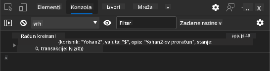
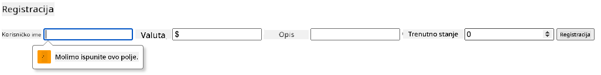

<!--
CO_OP_TRANSLATOR_METADATA:
{
  "original_hash": "b667b7d601e2ee19acb5aa9d102dc9f3",
  "translation_date": "2025-08-27T22:05:13+00:00",
  "source_file": "7-bank-project/2-forms/README.md",
  "language_code": "hr"
}
-->
# Izrada Bankovne Aplikacije, 2. dio: Izrada Obrasca za Prijavu i Registraciju

## Pre-Lekcijski Kviz

[Pre-lekcijski kviz](https://ff-quizzes.netlify.app/web/quiz/43)

### Uvod

U gotovo svim modernim web aplikacijama možete kreirati račun kako biste imali svoj privatni prostor. Budući da više korisnika može istovremeno pristupiti web aplikaciji, potreban je mehanizam za odvojeno pohranjivanje osobnih podataka svakog korisnika i odabir informacija koje će se prikazati. Nećemo pokrivati kako [sigurno upravljati identitetom korisnika](https://en.wikipedia.org/wiki/Authentication) jer je to opsežna tema sama po sebi, ali osigurat ćemo da svaki korisnik može kreirati jedan (ili više) bankovnih računa u našoj aplikaciji.

U ovom dijelu koristit ćemo HTML obrasce za dodavanje prijave i registracije u našu web aplikaciju. Vidjet ćemo kako programatski poslati podatke na API poslužitelja i na kraju kako definirati osnovna pravila za validaciju korisničkih unosa.

### Preduvjeti

Potrebno je da ste završili [HTML predloške i rutiranje](../1-template-route/README.md) web aplikacije za ovu lekciju. Također trebate instalirati [Node.js](https://nodejs.org) i [pokrenuti API poslužitelja](../api/README.md) lokalno kako biste mogli slati podatke za kreiranje računa.

**Napomena**
Imat ćete dva terminala pokrenuta istovremeno, kako je navedeno u nastavku:
1. Za glavnu bankovnu aplikaciju koju smo izradili u lekciji [HTML predlošci i rutiranje](../1-template-route/README.md)
2. Za [API poslužitelja bankovne aplikacije](../api/README.md) koji smo upravo postavili.

Potrebno je da oba poslužitelja budu pokrenuta kako biste mogli pratiti ostatak lekcije. Oni slušaju na različitim portovima (port `3000` i port `5000`), tako da bi sve trebalo raditi bez problema.

Možete testirati je li poslužitelj ispravno pokrenut izvršavanjem ove naredbe u terminalu:

```sh
curl http://localhost:5000/api
# -> should return "Bank API v1.0.0" as a result
```

---

## Obrazac i kontrole

Element `<form>` obuhvaća dio HTML dokumenta gdje korisnik može unositi i slati podatke putem interaktivnih kontrola. Postoji mnogo različitih korisničkih sučelja (UI) kontrola koje se mogu koristiti unutar obrasca, a najčešće su `<input>` i `<button>` elementi.

Postoji mnogo različitih [vrsta](https://developer.mozilla.org/docs/Web/HTML/Element/input) `<input>` elemenata. Na primjer, za kreiranje polja u koje korisnik može unijeti svoje korisničko ime možete koristiti:

```html
<input id="username" name="username" type="text">
```

Atribut `name` koristit će se kao naziv svojstva kada se podaci obrasca budu slali. Atribut `id` koristi se za povezivanje `<label>` elementa s kontrolom obrasca.

> Pogledajte cijeli popis [`<input>` vrsta](https://developer.mozilla.org/docs/Web/HTML/Element/input) i [ostalih kontrola obrasca](https://developer.mozilla.org/docs/Learn/Forms/Other_form_controls) kako biste dobili ideju o svim nativnim UI elementima koje možete koristiti pri izradi sučelja.

✅ Napomena da je `<input>` [prazan element](https://developer.mozilla.org/docs/Glossary/Empty_element) kojem ne biste trebali dodavati odgovarajuću zatvarajuću oznaku. Međutim, možete koristiti samostalnu `<input/>` notaciju, ali nije obavezno.

Element `<button>` unutar obrasca je malo poseban. Ako ne odredite njegov atribut `type`, automatski će poslati podatke obrasca na poslužitelj kada se pritisne. Evo mogućih vrijednosti za `type`:

- `submit`: Zadano ponašanje unutar `<form>` elementa, gumb pokreće akciju slanja obrasca.
- `reset`: Gumb resetira sve kontrole obrasca na njihove početne vrijednosti.
- `button`: Ne dodjeljuje zadano ponašanje kada se gumb pritisne. Možete mu dodijeliti prilagođene akcije pomoću JavaScripta.

### Zadatak

Započnimo dodavanjem obrasca u predložak `login`. Trebat ćemo polje za *korisničko ime* i gumb *Prijava*.

```html
<template id="login">
  <h1>Bank App</h1>
  <section>
    <h2>Login</h2>
    <form id="loginForm">
      <label for="username">Username</label>
      <input id="username" name="user" type="text">
      <button>Login</button>
    </form>
  </section>
</template>
```

Ako pažljivo pogledate, možete primijetiti da smo ovdje dodali i `<label>` element. `<label>` elementi koriste se za dodavanje naziva UI kontrolama, poput našeg polja za korisničko ime. Oznake su važne za čitljivost vaših obrazaca, ali također dolaze s dodatnim prednostima:

- Povezivanjem oznake s kontrolom obrasca pomaže korisnicima koji koriste asistivne tehnologije (poput čitača ekrana) da razumiju koje podatke trebaju unijeti.
- Klikom na oznaku možete izravno staviti fokus na povezani unos, što olakšava pristup na uređajima s dodirnim zaslonom.

> [Pristupačnost](https://developer.mozilla.org/docs/Learn/Accessibility/What_is_accessibility) na webu vrlo je važna tema koja se često zanemaruje. Zahvaljujući [semantičkim HTML elementima](https://developer.mozilla.org/docs/Learn/Accessibility/HTML) nije teško kreirati pristupačan sadržaj ako ih pravilno koristite. Možete [pročitati više o pristupačnosti](https://developer.mozilla.org/docs/Web/Accessibility) kako biste izbjegli uobičajene pogreške i postali odgovoran programer.

Sada ćemo dodati drugi obrazac za registraciju, odmah ispod prethodnog:

```html
<hr/>
<h2>Register</h2>
<form id="registerForm">
  <label for="user">Username</label>
  <input id="user" name="user" type="text">
  <label for="currency">Currency</label>
  <input id="currency" name="currency" type="text" value="$">
  <label for="description">Description</label>
  <input id="description" name="description" type="text">
  <label for="balance">Current balance</label>
  <input id="balance" name="balance" type="number" value="0">
  <button>Register</button>
</form>
```

Koristeći atribut `value` možemo definirati zadanu vrijednost za određeni unos.
Primijetite također da unos za `balance` ima vrstu `number`. Izgleda li drugačije od ostalih unosa? Pokušajte interaktivno raditi s njim.

✅ Možete li navigirati i interaktivno raditi s obrascima koristeći samo tipkovnicu? Kako biste to učinili?

## Slanje podataka na poslužitelj

Sada kada imamo funkcionalno korisničko sučelje, sljedeći korak je slanje podataka na naš poslužitelj. Napravimo brzi test koristeći naš trenutni kod: što se događa ako kliknete na gumb *Prijava* ili *Registracija*?

Jeste li primijetili promjenu u URL sekciji vašeg preglednika?


Zadana akcija za `<form>` je slanje obrasca na trenutni URL poslužitelja koristeći [GET metodu](https://www.w3.org/Protocols/rfc2616/rfc2616-sec9.html#sec9.3), dodajući podatke obrasca izravno u URL. Ova metoda ima nekoliko nedostataka:

- Podaci koji se šalju vrlo su ograničeni veličinom (oko 2000 znakova)
- Podaci su izravno vidljivi u URL-u (nije idealno za lozinke)
- Ne radi s prijenosom datoteka

Zato možete promijeniti metodu na [POST metodu](https://www.w3.org/Protocols/rfc2616/rfc2616-sec9.html#sec9.5) koja šalje podatke obrasca na poslužitelj u tijelu HTTP zahtjeva, bez prethodnih ograničenja.

> Iako je POST najčešće korištena metoda za slanje podataka, [u nekim specifičnim scenarijima](https://www.w3.org/2001/tag/doc/whenToUseGet.html) preporučljivo je koristiti GET metodu, primjerice kod implementacije polja za pretraživanje.

### Zadatak

Dodajte `action` i `method` svojstva obrascu za registraciju:

```html
<form id="registerForm" action="//localhost:5000/api/accounts" method="POST">
```

Sada pokušajte registrirati novi račun sa svojim imenom. Nakon klika na gumb *Registracija* trebali biste vidjeti nešto poput ovoga:


Ako sve ide kako treba, poslužitelj bi trebao odgovoriti na vaš zahtjev s [JSON](https://www.json.org/json-en.html) odgovorom koji sadrži podatke o kreiranom računu.

✅ Pokušajte se ponovno registrirati s istim imenom. Što se događa?

## Slanje podataka bez osvježavanja stranice

Kao što ste vjerojatno primijetili, postoji mali problem s pristupom koji smo upravo koristili: prilikom slanja obrasca izlazimo iz naše aplikacije i preglednik se preusmjerava na URL poslužitelja. Pokušavamo izbjeći sva osvježavanja stranica u našoj web aplikaciji jer izrađujemo [Jednostranu aplikaciju (SPA)](https://en.wikipedia.org/wiki/Single-page_application).

Kako bismo poslali podatke obrasca na poslužitelj bez prisilnog osvježavanja stranice, moramo koristiti JavaScript kod. Umjesto da stavimo URL u svojstvo `action` elementa `<form>`, možete koristiti bilo koji JavaScript kod s prefiksom `javascript:` za izvođenje prilagođene akcije. Koristeći ovo također znači da ćete morati implementirati neke zadatke koji su se prethodno automatski obavljali od strane preglednika:

- Dohvat podataka obrasca
- Pretvorba i kodiranje podataka obrasca u odgovarajući format
- Kreiranje HTTP zahtjeva i slanje na poslužitelj

### Zadatak

Zamijenite `action` obrasca za registraciju s:

```html
<form id="registerForm" action="javascript:register()">
```

Otvorite `app.js` i dodajte novu funkciju nazvanu `register`:

```js
function register() {
  const registerForm = document.getElementById('registerForm');
  const formData = new FormData(registerForm);
  const data = Object.fromEntries(formData);
  const jsonData = JSON.stringify(data);
}
```

Ovdje dohvaćamo element obrasca koristeći `getElementById()` i koristimo pomoćnika [`FormData`](https://developer.mozilla.org/docs/Web/API/FormData) za izdvajanje vrijednosti iz kontrola obrasca kao skup ključ/vrijednost parova. Zatim podatke pretvaramo u običan objekt koristeći [`Object.fromEntries()`](https://developer.mozilla.org/docs/Web/JavaScript/Reference/Global_Objects/Object/fromEntries) i na kraju serijaliziramo podatke u [JSON](https://www.json.org/json-en.html), format koji se često koristi za razmjenu podataka na webu.

Podaci su sada spremni za slanje na poslužitelj. Kreirajte novu funkciju nazvanu `createAccount`:

```js
async function createAccount(account) {
  try {
    const response = await fetch('//localhost:5000/api/accounts', {
      method: 'POST',
      headers: { 'Content-Type': 'application/json' },
      body: account
    });
    return await response.json();
  } catch (error) {
    return { error: error.message || 'Unknown error' };
  }
}
```

Što ova funkcija radi? Prvo, primijetite ključnu riječ `async` ovdje. To znači da funkcija sadrži kod koji će se izvršavati [**asinkrono**](https://developer.mozilla.org/docs/Web/JavaScript/Reference/Statements/async_function). Kada se koristi zajedno s ključnom riječi `await`, omogućuje čekanje na izvršenje asinkronog koda - poput čekanja na odgovor poslužitelja ovdje - prije nastavka.

Evo kratkog videa o korištenju `async/await`:

[](https://youtube.com/watch?v=YwmlRkrxvkk "Async i Await za upravljanje obećanjima")

> 🎥 Kliknite na sliku iznad za video o async/await.

Koristimo `fetch()` API za slanje JSON podataka na poslužitelj. Ova metoda uzima 2 parametra:

- URL poslužitelja, pa ovdje vraćamo `//localhost:5000/api/accounts`.
- Postavke zahtjeva. Tu postavljamo metodu na `POST` i pružamo `body` za zahtjev. Budući da šaljemo JSON podatke na poslužitelj, također moramo postaviti zaglavlje `Content-Type` na `application/json` kako bi poslužitelj znao kako interpretirati sadržaj.

Budući da će poslužitelj odgovoriti na zahtjev s JSON-om, možemo koristiti `await response.json()` za parsiranje JSON sadržaja i vraćanje rezultirajućeg objekta. Napominjemo da je ova metoda asinkrona, pa ovdje koristimo ključnu riječ `await` prije vraćanja kako bismo osigurali da se eventualne pogreške tijekom parsiranja također uhvate.

Sada dodajte malo koda u funkciju `register` kako biste pozvali `createAccount()`:

```js
const result = await createAccount(jsonData);
```

Budući da ovdje koristimo ključnu riječ `await`, moramo dodati ključnu riječ `async` prije funkcije register:

```js
async function register() {
```

Na kraju, dodajmo neke logove kako bismo provjerili rezultat. Konačna funkcija trebala bi izgledati ovako:

```js
async function register() {
  const registerForm = document.getElementById('registerForm');
  const formData = new FormData(registerForm);
  const jsonData = JSON.stringify(Object.fromEntries(formData));
  const result = await createAccount(jsonData);

  if (result.error) {
    return console.log('An error occurred:', result.error);
  }

  console.log('Account created!', result);
}
```

To je bilo malo duže, ali stigli smo! Ako otvorite [alate za razvoj preglednika](https://developer.mozilla.org/docs/Learn/Common_questions/What_are_browser_developer_tools) i pokušate registrirati novi račun, ne biste trebali vidjeti nikakvu promjenu na web stranici, ali poruka će se pojaviti u konzoli potvrđujući da sve radi.



✅ Mislite li da se podaci šalju na poslužitelj sigurno? Što ako netko uspije presresti zahtjev? Možete pročitati o [HTTPS](https://en.wikipedia.org/wiki/HTTPS) kako biste saznali više o sigurnoj komunikaciji podataka.

## Validacija podataka

Ako pokušate registrirati novi račun bez postavljanja korisničkog imena, možete vidjeti da poslužitelj vraća pogrešku sa statusnim kodom [400 (Loš Zahtjev)](https://developer.mozilla.org/docs/Web/HTTP/Status/400#:~:text=The%20HyperText%20Transfer%20Protocol%20(HTTP,%2C%20or%20deceptive%20request%20routing).).

Prije slanja podataka na poslužitelj dobra je praksa [validirati podatke obrasca](https://developer.mozilla.org/docs/Learn/Forms/Form_validation) unaprijed kad god je to moguće, kako biste osigurali da šaljete valjan zahtjev. HTML5 kontrole obrasca pružaju ugrađenu validaciju koristeći razne atribute:

- `required`: polje mora biti popunjeno, inače se obrazac ne može poslati.
- `minlength` i `maxlength`: definiraju minimalni i maksimalni broj znakova u tekstualnim poljima.
- `min` i `max`: definiraju minimalnu i maksimalnu vrijednost numeričkog polja.
- `type`: definira vrstu očekivanih podataka, poput `number`, `email`, `file` ili [ostalih ugrađenih vrsta](https://developer.mozilla.org/docs/Web/HTML/Element/input). Ovaj atribut također može promijeniti vizualni prikaz kontrole obrasca.
- `pattern`: omogućuje definiranje [regularnog izraza](https://developer.mozilla.org/docs/Web/JavaScript/Guide/Regular_Expressions) za testiranje je li uneseni podatak valjan ili ne.
Savjet: možete prilagoditi izgled svojih kontrola obrasca ovisno o tome jesu li valjani ili ne koristeći CSS pseudo-klase `:valid` i `:invalid`.
### Zadatak

Postoje 2 obavezna polja za kreiranje valjanog novog računa: korisničko ime i valuta, dok su ostala polja opcionalna. Ažurirajte HTML forme koristeći atribut `required` i tekst u oznaci polja kako biste to postigli:

```html
<label for="user">Username (required)</label>
<input id="user" name="user" type="text" required>
...
<label for="currency">Currency (required)</label>
<input id="currency" name="currency" type="text" value="$" required>
```

Iako ova konkretna implementacija servera ne nameće specifična ograničenja na maksimalnu duljinu polja, uvijek je dobra praksa definirati razumna ograničenja za unos teksta od strane korisnika.

Dodajte atribut `maxlength` u tekstualna polja:

```html
<input id="user" name="user" type="text" maxlength="20" required>
...
<input id="currency" name="currency" type="text" value="$" maxlength="5" required>
...
<input id="description" name="description" type="text" maxlength="100">
```

Sada, ako pritisnete gumb *Registriraj se* i neko polje ne poštuje pravilo validacije koje smo definirali, trebali biste vidjeti nešto poput ovoga:



Validacija poput ove, koja se obavlja *prije* slanja podataka na server, naziva se **validacija na strani klijenta**. No, imajte na umu da nije uvijek moguće obaviti sve provjere bez slanja podataka. Na primjer, ovdje ne možemo provjeriti postoji li već račun s istim korisničkim imenom bez slanja zahtjeva serveru. Dodatna validacija koja se obavlja na serveru naziva se **validacija na strani servera**.

Obično je potrebno implementirati obje vrste validacije, a dok validacija na strani klijenta poboljšava korisničko iskustvo pružanjem trenutne povratne informacije korisniku, validacija na strani servera ključna je za osiguranje da su podaci korisnika koje obrađujete ispravni i sigurni.

---

## 🚀 Izazov

Prikazati poruku o grešci u HTML-u ako korisnik već postoji.

Evo primjera kako konačna stranica za prijavu može izgledati nakon malo stiliziranja:


## Kviz nakon predavanja

[Kviz nakon predavanja](https://ff-quizzes.netlify.app/web/quiz/44)

## Pregled i samostalno učenje

Razvijatelji su postali vrlo kreativni u svojim naporima za izradu formi, posebno u vezi strategija validacije. Saznajte više o različitim tokovima formi pregledavajući [CodePen](https://codepen.com); možete li pronaći neke zanimljive i inspirativne forme?

## Zadatak

[Stilizirajte svoju bankovnu aplikaciju](assignment.md)

---

**Odricanje od odgovornosti**:  
Ovaj dokument je preveden pomoću AI usluge za prevođenje [Co-op Translator](https://github.com/Azure/co-op-translator). Iako nastojimo osigurati točnost, imajte na umu da automatski prijevodi mogu sadržavati pogreške ili netočnosti. Izvorni dokument na izvornom jeziku treba smatrati autoritativnim izvorom. Za ključne informacije preporučuje se profesionalni prijevod od strane čovjeka. Ne preuzimamo odgovornost za nesporazume ili pogrešna tumačenja koja mogu proizaći iz korištenja ovog prijevoda.