<!--
CO_OP_TRANSLATOR_METADATA:
{
  "original_hash": "7cbdbd132d39a2bb493e85bc2a9387cc",
  "translation_date": "2026-01-07T09:16:28+00:00",
  "source_file": "7-bank-project/2-forms/README.md",
  "language_code": "hr"
}
-->
# Izradite bankarsku aplikaciju, dio 2: Izgradite obrazac za prijavu i registraciju

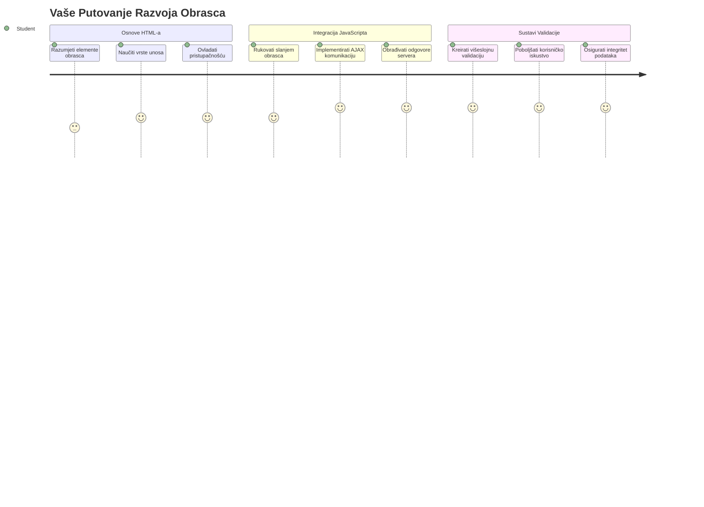
## Predpredavanje Kviz

[Predpredavanje kviz](https://ff-quizzes.netlify.app/web/quiz/43)

Jeste li ikada ispunili obrazac online i on vam odbije format e-pošte? Ili izgubili sve informacije kad ste kliknuli pošalji? Svi smo se susreli s tim frustrirajućim iskustvima.

Obrasci su most između vaših korisnika i funkcionalnosti vaše aplikacije. Kao što kontrolori leta koriste pažljive protokole za sigurno usmjeravanje aviona do odredišta, tako dobro dizajnirani obrasci pružaju jasne povratne informacije i sprječavaju skupe pogreške. Loši obrasci, s druge strane, mogu brzo otjerati korisnike, kao što nesporazum na užurbanom aerodromu može izazvati neželjene posljedice.

U ovom ćemo satu pretvoriti vašu statičnu bankarsku aplikaciju u interaktivnu aplikaciju. Naučit ćete kako graditi obrasce koji provjeravaju korisničke unose, komuniciraju sa serverima i pružaju korisne povratne informacije. Zamislite to kao izgradnju kontrolnog sučelja koje korisnicima omogućuje navigaciju funkcijama vaše aplikacije.

Na kraju ćete imati kompletan sustav za prijavu i registraciju s validacijom koji usmjerava korisnike prema uspjehu umjesto frustraciji.

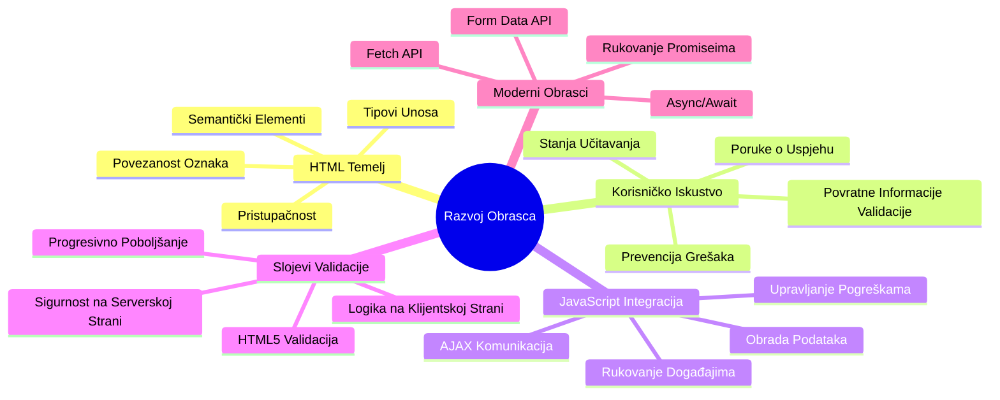
## Preduvjeti

Prije nego što počnemo graditi obrasce, provjerimo jeste li sve pravilno postavili. Ova lekcija nastavlja točno tamo gdje smo stali u prethodnoj, pa ako ste preskočili naprijed, možda biste prvo htjeli vratiti se i uspostaviti osnovno funkcioniranje.

### Potrebna postavka

| Komponenta | Status | Opis |
|-----------|--------|-------|
| [HTML predlošci](../1-template-route/README.md) | ✅ Potrebno | Osnovna struktura vaše bankarske aplikacije |
| [Node.js](https://nodejs.org) | ✅ Potrebno | JavaScript okruženje za server |
| [Bankarski API server](../api/README.md) | ✅ Potrebno | Backend servis za pohranu podataka |

> 💡 **Savjet za razvoj**: Istovremeno ćete pokretati dva odvojena servera – jedan za vašu frontend bankarsku aplikaciju i drugi za backend API. Ova postavka odražava stvarni razvojni scenarij gdje frontend i backend servisi rade neovisno.

### Konfiguracija servera

**Vaše razvojno okruženje će uključivati:**
- **Frontend server**: Servira vašu bankarsku aplikaciju (obično port `3000`)
- **Backend API server**: Rukuje pohranom i dohvaćanjem podataka (port `5000`)
- **Oba servera** mogu raditi istovremeno bez sukoba

**Testiranje povezivanja s API-jem:**
```bash
curl http://localhost:5000/api
# Očekivani odgovor: "Bank API v1.0.0"
```

**Ako vidite odgovor s verzijom API-ja, spremni ste za nastavak!**

---

## Razumijevanje HTML obrazaca i kontrola

HTML obrasci su način na koji korisnici komuniciraju s vašom web aplikacijom. Zamislite ih kao telegrafski sustav koji je u 19. stoljeću povezivao udaljena mjesta – oni su komunikacijski protokol između korisničke namjere i odgovora aplikacije. Kad se dizajniraju s pažnjom, hvataju pogreške, usmjeravaju format unosa i pružaju korisne sugestije.

Moderni obrasci su znatno sofisticiraniji od običnih tekstualnih unosa. HTML5 je uveo specijalizirane tipove unosa koji automatski rukuju provjerom valjanosti e-pošte, formatiranjem brojeva i odabirom datuma. Ove su inovacije korisne i za pristupačnost i za iskustvo mobilnih korisnika.

### Bitni elementi obrasca

**Gradivni blokovi koje svaki obrazac treba:**

```html
<!-- Basic form structure -->
<form id="userForm" method="POST">
  <label for="username">Username</label>
  <input id="username" name="username" type="text" required>
  
  <button type="submit">Submit</button>
</form>
```

**Evo što ovaj kod radi:**
- **Stvara** kontejner obrasca s jedinstvenim identifikatorom
- **Navođenjem** HTTP metode za slanje podataka
- **Povezuje** oznake s unosima radi pristupačnosti
- **Definira** gumb za slanje za procesiranje obrasca

### Moderni tipovi unosa i atributi

| Tip unosa | Namjena | Primjer korištenja |
|-----------|---------|-------------------|
| `text` | Opći tekstualni unos | `<input type="text" name="username">` |
| `email` | Validacija e-pošte | `<input type="email" name="email">` |
| `password` | Skriveni tekst | `<input type="password" name="password">` |
| `number` | Numerički unos | `<input type="number" name="balance" min="0">` |
| `tel` | Telefonski brojevi | `<input type="tel" name="phone">` |

> 💡 **Prednost modernog HTML5**: Korištenje specifičnih tipova unosa omogućuje automatsku validaciju, odgovarajuće tipkovnice na mobilnim uređajima i bolju podršku pristupačnosti bez dodatnog JavaScripta!

### Tipovi gumba i ponašanje

```html
<!-- Different button behaviors -->
<button type="submit">Save Data</button>     <!-- Submits the form -->
<button type="reset">Clear Form</button>    <!-- Resets all fields -->
<button type="button">Custom Action</button> <!-- No default behavior -->
```

**Što svaki tip gumba radi:**
- **Submit gumbi**: Pokreću slanje obrasca i šalju podatke na određenu adresu
- **Reset gumbi**: Vraćaju sva polja obrasca u početno stanje
- **Obični gumbi**: Nemaju zadano ponašanje, zahtijevaju prilagođeni JavaScript da bi funkcionirali

> ⚠️ **Važna napomena**: `<input>` element je samostalno zatvoreni tag i ne treba mu zatvarajući tag. Moderni je običaj pisati `<input>` bez kosa crte.

### Izrada obrasca za prijavu

Sad ćemo napraviti praktični obrazac za prijavu koji demonstrira moderne prakse HTML obrazaca. Počet ćemo s osnovnom strukturom i postupno ćemo ga poboljšavati s pristupačnostima i validacijom.

```html
<template id="login">
  <h1>Bank App</h1>
  <section>
    <h2>Login</h2>
    <form id="loginForm" novalidate>
      <div class="form-group">
        <label for="username">Username</label>
        <input id="username" name="user" type="text" required 
               autocomplete="username" placeholder="Enter your username">
      </div>
      <button type="submit">Login</button>
    </form>
  </section>
</template>
```

**Pregled što se ovdje događa:**
- **Strukturira** obrazac pomoću semantičkih HTML5 elemenata
- **Grupira** povezane elemente s `div` kontejnerima s opisnim klasama
- **Povezuje** oznake i unose pomoću atributa `for` i `id`
- **Uključuje** moderne atribute poput `autocomplete` i `placeholder` za bolje korisničko iskustvo
- **Dodaje** `novalidate` za rukovanje validacijom putem JavaScript-a umjesto zadane provjere preglednika

### Snaga ispravnih oznaka (labela)

**Zašto oznake (label) imaju važnost u modernom web razvoju:**

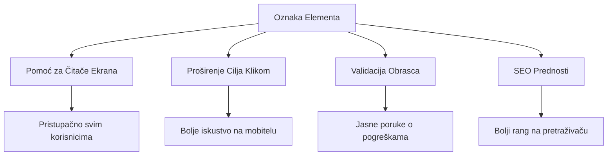
**Što ispravne oznake omogućuju:**
- **Omogućuju** čitačima ekrana da jasno najave polja obrasca
- **Povećavaju** područje klikabilnosti (klik na oznaku fokusira unos)
- **Poboljšavaju** upotrebljivost na mobilnim uređajima većim područjima za dodir
- **Podržavaju** validaciju obrasca korisnim porukama o pogreškama
- **Unapređuju** SEO pružajući semantičko značenje poljima obrasca

> 🎯 **Cilj pristupačnosti**: Svaki unos u obrascu treba imati pridruženu oznaku. Ova jednostavna praksa čini vaše obrasce dostupnima svima, uključujući korisnike s invaliditetom, i poboljšava iskustvo za sve korisnike.

### Izrada obrasca za registraciju

Obrazac za registraciju zahtijeva detaljnije informacije za stvaranje potpunog korisničkog računa. Izgradimo ga koristeći moderne HTML5 značajke i poboljšanu pristupačnost.

```html
<hr/>
<h2>Register</h2>
<form id="registerForm" novalidate>
  <div class="form-group">
    <label for="user">Username</label>
    <input id="user" name="user" type="text" required 
           autocomplete="username" placeholder="Choose a username">
  </div>
  
  <div class="form-group">
    <label for="currency">Currency</label>
    <input id="currency" name="currency" type="text" value="$" 
           required maxlength="3" placeholder="USD, EUR, etc.">
  </div>
  
  <div class="form-group">
    <label for="description">Account Description</label>
    <input id="description" name="description" type="text" 
           maxlength="100" placeholder="Personal savings, checking, etc.">
  </div>
  
  <div class="form-group">
    <label for="balance">Starting Balance</label>
    <input id="balance" name="balance" type="number" value="0" 
           min="0" step="0.01" placeholder="0.00">
  </div>
  
  <button type="submit">Create Account</button>
</form>
```

**U gornjem primjeru smo:**
- **Organizirali** svako polje unutar `div` kontejnera radi bolje stilizacije i izgleda
- **Dodali** odgovarajuće atribute `autocomplete` radi podrške automatskom popunjavanju preglednika
- **Uključili** korisne pomoćne tekstove (placeholder) koji vode korisnika kod unosa
- **Postavili** razumno zadane vrijednosti koristeći atribut `value`
- **Koristili** atribute za validaciju poput `required`, `maxlength` i `min`
- **Primijenili** tip unosa `number` za polje stanja računa s podrškom za decimalne brojeve

### Istraživanje tipova unosa i ponašanja

**Moderni tipovi unosa pružaju dodatne mogućnosti:**

| Značajka | Korist | Primjer |
|----------|--------|---------|
| `type="number"` | Numerička tipkovnica na mobitelima | Lakše unošenje stanja računa |
| `step="0.01"` | Kontrola decimale | Omogućuje unose s centima u valuti |
| `autocomplete` | Autofill preglednika | Brže popunjavanje obrasca |
| `placeholder` | Kontekstualni savjeti | Usmjerava očekivanja korisnika |

> 🎯 **Izazov za pristupačnost**: Pokušajte koristiti obrasce samo pomoću tipkovnice! Koristite `Tab` za kretanje između polja, `Space` za označavanje okvira, te `Enter` za slanje obrasca. Ovo će vam pomoći shvatiti kako korisnici s čitačima ekrana koriste vaše obrasce.

### 🔄 **Pedagoški pregled**
**Razumijevanje osnova obrazaca**: Prije implementacije JavaScripta, provjerite razumijete:
- ✅ Kako semantički HTML kreira pristupačne strukture obrazaca
- ✅ Zašto tipovi unosa utječu na tipkovnice na mobitelima i validaciju
- ✅ Odnos između oznaka i kontrola obrasca
- ✅ Kako atributi obrasca utječu na zadanom ponašanju preglednika

**Brzi samoprovjera**: Što se dogodi kad pošaljete obrazac bez JavaScript obrade?
*Odgovor: Preglednik izvršava zadano slanje, obično preusmjeravanje na URL akcije*

**Prednosti HTML5 obrazaca**: Moderni obrasci pružaju:
- **Ugrađenu validaciju**: Automatska provjera formata e-pošte i brojeva
- **Mobilnu optimizaciju**: Odgovarajuće tipkovnice za različite tipove unosa
- **Pristupačnost**: Podrška za čitače ekrana i navigaciju tipkovnicom
- **Postupno poboljšanje**: Radi čak i kad je JavaScript isključen

## Razumijevanje metoda slanja obrasca

Kad netko ispuni vaš obrazac i klikne pošalji, ti podaci moraju negdje otići – obično na server koji ih može spremiti. Postoji nekoliko načina za to i znati koji koristiti može vam kasnije uštedjeti glavobolju.

Pogledajmo što se zapravo događa kad netko klikne gumb za slanje.

### Zadano ponašanje obrasca

Prvo, promatrat ćemo što se događa s osnovnim slanjem obrasca:

**Testirajte svoje trenutne obrasce:**
1. Kliknite gumb *Registriraj* u obrascu
2. Promatrajte promjene u adresnoj traci vašeg preglednika
3. Primijetite kako se stranica osvježava i podaci pojavljuju u URL-u


### Usporedba HTTP metoda

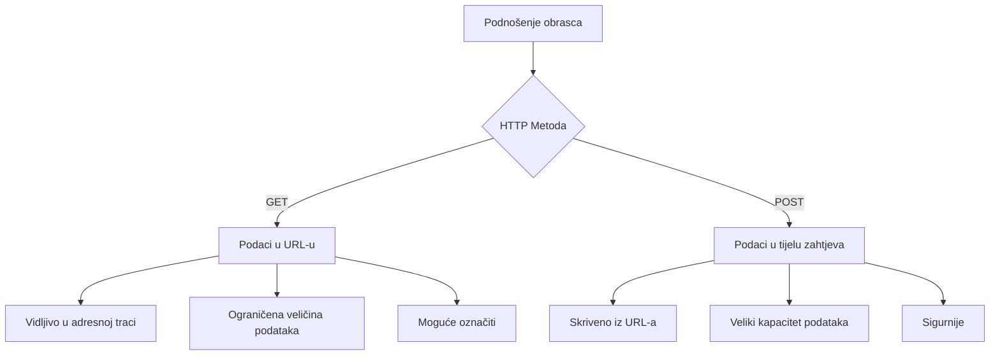
**Razumijevanje razlika:**

| Metoda | Namjena | Lokacija podataka | Razina sigurnosti | Ograničenje veličine |
|--------|---------|-------------------|-------------------|----------------------|
| `GET` | Pretraživanje, filteri | URL parametri | Niska (vidljivo) | ~2000 znakova |
| `POST` | Korisnički računi, osjetljivi podaci | Tijelo zahtjeva | Viša (skriveno) | Nema praktične granice |

**Osnovne razlike koje treba razumjeti:**
- **GET**: Dodaje podatke obrasca u URL kao parametre upita (pogodno za pretraživanja)
- **POST**: Uključuje podatke u tijelo zahtjeva (bitno za osjetljive informacije)
- **Ograničenja GET-a**: Veličina, vidljivi podaci, trajna povijest preglednika
- **Prednosti POST-a**: Veliki kapacitet podataka, zaštita privatnosti, podrška za prijenos datoteka

> 💡 **Dobra praksa**: Koristite `GET` za obrasce pretraživanja i filtere (dohvat podataka), a `POST` za registraciju korisnika, prijavu i stvaranje podataka.

### Konfiguriranje slanja obrasca

Konfigurirajmo obrazac za registraciju da pravilno komunicira s backend API-jem koristeći POST metodu:

```html
<form id="registerForm" action="//localhost:5000/api/accounts" 
      method="POST" novalidate>
```

**Ova konfiguracija radi:**
- **Usmjerava** slanje obrasca na API endpoint
- **Koristi** POST metodu za sigurnu transmiziju podataka
- **Dodaje** `novalidate` kako bi validaciju upravljao JavaScript

### Testiranje slanja obrasca

**Slijedite ove korake za testiranje obrasca:**
1. **Ispunite** obrazac za registraciju s vašim informacijama
2. **Kliknite** gumb "Kreiraj račun"
3. **Promatrajte** odgovor servera u pregledniku

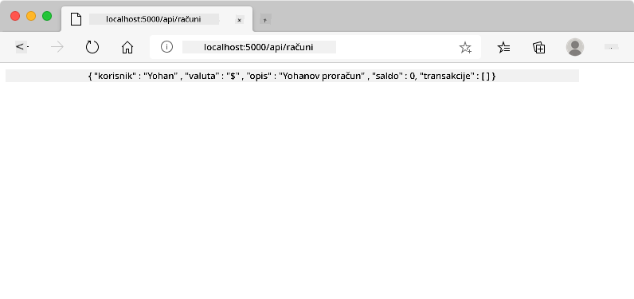

**Što biste trebali vidjeti:**
- **Preglednik preusmjerava** na URL API endpointa
- **JSON odgovor** s podacima vašeg novostvorenog računa
- **Potvrda servera** da je račun uspješno kreiran

> 🧪 **Vrijeme za eksperiment**: Pokušajte se ponovno registrirati s istim korisničkim imenom. Koji odgovor dobivate? Ovo vam pomaže razumjeti kako server upravlja dupliranim podacima i uvjetima pogreške.

### Razumijevanje JSON odgovora

**Kad server uspješno obradi vaš obrazac:**
```json
{
  "user": "john_doe",
  "currency": "$",
  "description": "Personal savings",
  "balance": 100,
  "id": "unique_account_id"
}
```

**Ovaj odgovor potvrđuje:**
- **Kreira** novi račun s navedenim podacima
- **Dodjeljuje** jedinstveni identifikator za buduću upotrebu
- **Vraća** sve informacije o računu radi provjere
- **Nagatno** uspješno spremanje u bazu podataka

## Moderna obrada obrazaca s JavaScriptom

Tradicionalno slanje obrasca uzrokuje potpuno osvježavanje stranice, slično kao što su rane svemirske misije zahtijevale potpuni reset sustava radi korekcije putanje. Ovakav pristup prekida korisničko iskustvo i gubi stanje aplikacije.

JavaScript obrada obrazaca funkcionira poput kontinuiranih sustava vođenja koje koriste moderni svemirski letjelice – omogućuje podešavanja u realnom vremenu bez gubitka navigacijskog konteksta. Možemo presresti slanje obrasca, pružiti neposredne povratne informacije, elegantno obraditi pogreške i nadograditi sučelje prema odgovorima servera, dok korisnik ostaje u trenutnoj poziciji u aplikaciji.

### Zašto izbjegavati osvježavanje stranice?

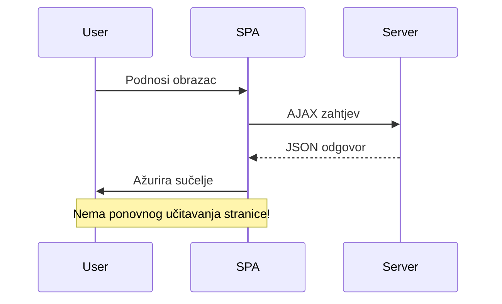
**Prednosti JavaScript obrade obrazaca:**
- **Održava** stanje aplikacije i korisnički kontekst
- **Pruža** trenutne povratne informacije i indikatore učitavanja
- **Omogućuje** dinamičko rukovanje pogreškama i validaciju
- **Stvara** glatka, aplikaciji slična korisnička iskustva
- **Dopusta** uvjetnu logiku na temelju odgovora servera

### Prijelaz s tradicionalnih na moderne obrasce

**Izazovi tradicionalnog pristupa:**
- **Preusmjerava** korisnike izvan vaše aplikacije
- **Gubi** trenutno stanje aplikacije i kontekst
- **Zahtijeva** potpuno osvježavanje stranice za jednostavne operacije
- **Pruža** ograničenu kontrolu nad korisničkim povratnim informacijama

**Prednosti modernog JavaScript pristupa:**
- **Drži** korisnike unutar vaše aplikacije
- **Održava** sve stanje i podatke aplikacije
- **Omogućuje** validaciju i povratne informacije u realnom vremenu
- **Podržava** postupno poboljšanje i pristupačnost

### Implementacija JavaScript obrade obrasca

Zamijenimo tradicionalno slanje obrasca modernim JavaScript rukovanjem događajima:

```html
<!-- Remove the action attribute and add event handling -->
<form id="registerForm" method="POST" novalidate>
```

**Dodajte logiku registracije u vašu datoteku `app.js`:**

```javascript
// Moderno upravljanje obrascima vođenim događajima
function register() {
  const registerForm = document.getElementById('registerForm');
  const formData = new FormData(registerForm);
  const data = Object.fromEntries(formData);
  const jsonData = JSON.stringify(data);
  
  console.log('Form data prepared:', data);
}

// Priloži slušatelja događaja kada se stranica učita
document.addEventListener('DOMContentLoaded', () => {
  const registerForm = document.getElementById('registerForm');
  registerForm.addEventListener('submit', (event) => {
    event.preventDefault(); // Spriječi zadanu predaju obrasca
    register();
  });
});
```

**Što se ovdje događa:**
- **Sprječava** zadano slanje obrasca pomoću `event.preventDefault()`
- **Dohvaća** element obrasca koristeći modernu selekciju DOM-a
- **Izvlači** podatke obrasca pomoću moćnog API-ja `FormData`
- **Pretvara** `FormData` u običan objekt pomoću `Object.fromEntries()`
- **Serijalizira** podatke u JSON format za komunikaciju sa serverom
- **Ispisuje** obrađene podatke za ispravljanje pogrešaka i verifikaciju

### Razumijevanje FormData API-ja

**FormData API pruža moćno rukovanje obrascima:**
```javascript
// Primjer što FormData hvata
const formData = new FormData(registerForm);

// FormData automatski hvata:
// {
//   "user": "john_doe",
//   "currency": "$",
//   "description": "Osobni račun",
//   "balance": "100"
// }
```

**Prednosti FormData API-ja:**
- **Sveobuhvatno prikupljanje**: Hvata sve elemente obrasca uključujući tekst, datoteke i složene unose
- **Svijest o tipu**: Automatski obrađuje različite vrste unosa bez potrebe za prilagođenim kodiranjem
- **Učinkovitost**: Uklanja ručno prikupljanje polja jednim pozivom API-ja
- **Prilagodljivost**: Očuva funkcionalnost dok se struktura obrasca razvija

### Izrada funkcije za komunikaciju sa serverom

Sada izradimo robusnu funkciju za komunikaciju s vašim API serverom koristeći moderne JavaScript obrasce:

```javascript
async function createAccount(account) {
  try {
    const response = await fetch('//localhost:5000/api/accounts', {
      method: 'POST',
      headers: { 
        'Content-Type': 'application/json',
        'Accept': 'application/json'
      },
      body: account
    });
    
    // Provjerite je li odgovor bio uspješan
    if (!response.ok) {
      throw new Error(`HTTP error! status: ${response.status}`);
    }
    
    return await response.json();
  } catch (error) {
    console.error('Account creation failed:', error);
    return { error: error.message || 'Network error occurred' };
  }
}
```

**Razumijevanje asinkronog JavaScripta:**

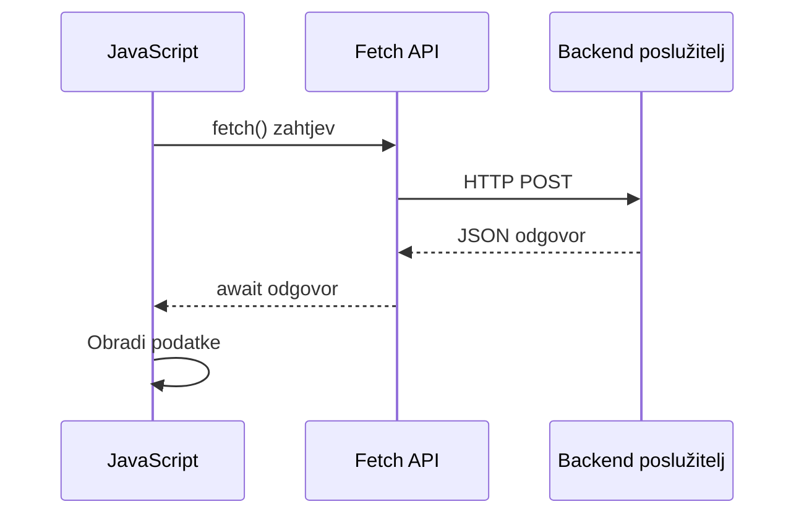
**Što ova moderna implementacija ostvaruje:**
- **Koristi** `async/await` za čitljiv asinkroni kod
- **Uključuje** ispravno rukovanje pogreškama sa try/catch blokovima
- **Provjerava** status odgovora prije obrade podataka
- **Postavlja** odgovarajuće zaglavlja za JSON komunikaciju
- **Pruža** detaljne poruke o pogreškama za otklanjanje pogrešaka
- **Vraća** konzistentnu strukturu podataka za uspješne i pogrešne slučajeve

### Snaga modernog Fetch API-ja

**Prednosti Fetch API-ja u odnosu na starije metode:**

| Značajka | Prednost | Implementacija |
|---------|---------|----------------|
| Temeljen na Promiseima | Čist asinkroni kod | `await fetch()` |
| Prilagodba zahtjeva | Potpuna HTTP kontrola | Zaglavlja, metode, tijelo |
| Obrada odgovora | Fleksibilna parsiranja podataka | `.json()`, `.text()`, `.blob()` |
| Rukovanje pogreškama | Sveobuhvatno hvatanje pogrešaka | Try/catch blokovi |

> 🎥 **Saznajte više**: [Async/Await Tutorial](https://youtube.com/watch?v=YwmlRkrxvkk) - Razumijevanje asinkronih JavaScript obrazaca za moderni web razvoj.

**Ključni pojmovi za komunikaciju sa serverom:**
- **Async funkcije** omogućuju pauzu u izvršavanju da se čeka odgovor servera
- **Await ključna riječ** čini asinkroni kod čitljivim kao sinkroni
- **Fetch API** nudi moderne HTTP zahtjeve temeljene na Promise-ima
- **Rukovanje pogreškama** osigurava da vaša aplikacija lijepo reagira na mrežne probleme

### Dovršavanje funkcije za registraciju

Sada spojimo sve s kompletnom, spremnom za produkciju funkcijom za registraciju:

```javascript
async function register() {
  const registerForm = document.getElementById('registerForm');
  const submitButton = registerForm.querySelector('button[type="submit"]');
  
  try {
    // Prikaži stanje učitavanja
    submitButton.disabled = true;
    submitButton.textContent = 'Creating Account...';
    
    // Obradi podatke obrasca
    const formData = new FormData(registerForm);
    const jsonData = JSON.stringify(Object.fromEntries(formData));
    
    // Pošalji na poslužitelj
    const result = await createAccount(jsonData);
    
    if (result.error) {
      console.error('Registration failed:', result.error);
      alert(`Registration failed: ${result.error}`);
      return;
    }
    
    console.log('Account created successfully!', result);
    alert(`Welcome, ${result.user}! Your account has been created.`);
    
    // Resetiraj obrazac nakon uspješne registracije
    registerForm.reset();
    
  } catch (error) {
    console.error('Unexpected error:', error);
    alert('An unexpected error occurred. Please try again.');
  } finally {
    // Vrati stanje gumba
    submitButton.disabled = false;
    submitButton.textContent = 'Create Account';
  }
}
```

**Ova poboljšana implementacija uključuje:**
- **Pruža** vizualne povratne informacije tijekom slanja obrasca
- **Onemogućava** gumb za slanje da spriječi duplicirane prijave
- **Rukuje** očekivanim i neočekivanim pogreškama na elegantan način
- **Prikazuje** razumljive poruke o uspjehu i pogrešci korisniku
- **Resetira** obrazac nakon uspješne registracije
- **Vraća** stanje korisničkog sučelja bez obzira na ishod

### Testiranje vaše implementacije

**Otvorite alate za razvoj u pregledniku i testirajte registraciju:**

1. **Otvorite** konzolu preglednika (F12 → Konzola)
2. **Ispunite** obrazac za registraciju
3. **Kliknite** "Create Account"
4. **Promatrajte** poruke u konzoli i povratne informacije korisniku


**Što biste trebali vidjeti:**
- **Stanje učitavanja** pojavljuje se na gumbu za slanje
- **Zapisnici u konzoli** prikazuju detaljne informacije o procesu
- **Poruka o uspjehu** pojavljuje se kad je izrada računa uspješna
- **Obrazac se automatski resetira** nakon uspješnog slanja

> 🔒 **Sigurnosna napomena**: Trenutno se podaci prenose preko HTTP-a što nije sigurno za produkciju. U stvarnim aplikacijama uvijek koristite HTTPS za šifriranje prijenosa podataka. Saznajte više o [HTTPS sigurnosti](https://en.wikipedia.org/wiki/HTTPS) i zašto je bitna za zaštitu korisničkih podataka.

### 🔄 **Pedagoški pregled**
**Integracija modernog JavaScripta**: Provjerite svoje razumijevanje asinkronog rukovanja obrascima:
- ✅ Kako `event.preventDefault()` mijenja zadano ponašanje obrasca?
- ✅ Zašto je FormData API učinkovitiji od ručnog prikupljanja polja?
- ✅ Kako obrasci async/await poboljšavaju čitljivost koda?
- ✅ Koju ulogu ima rukovanje pogreškama u korisničkom iskustvu?

**Arhitektura sustava**: Vaša obrada obrazaca demonstrira:
- **Programiranje navođeno događajima**: Obrasci reagiraju na korisničke akcije bez ponovnog učitavanja stranice
- **Asinkrona komunikacija**: Zahtjevi serveru ne blokiraju korisničko sučelje
- **Rukovanje pogreškama**: Ljubazna degradacija kada mrežni zahtjevi zakažu
- **Upravljanje stanjem**: Ažuriranja UI-ja odražavaju server odgovore prikladno
- **Postepeno poboljšanje**: Osnovna funkcionalnost radi, JavaScript ju poboljšava

**Profesionalni obrasci**: Implementirali ste:
- **Jedinstvenu odgovornost**: Funkcije imaju jasne, fokusirane svrhe
- **Granice pogrešaka**: Try/catch blokovi sprječavaju rušenje aplikacije
- **Povratnu informaciju korisniku**: Stanja učitavanja i poruke o uspjehu/pogrešci
- **Transformaciju podataka**: Iz FormData u JSON za komunikaciju sa serverom

## Sveobuhvatna validacija obrasca

Validacija obrasca sprječava frustrirajuće iskustvo otkrivanja pogrešaka tek nakon slanja. Poput više redundantnih sustava na Međunarodnoj svemirskoj stanici, učinkovita validacija koristi višestruke slojeve sigurnosnih provjera.

Optimalan pristup kombinira validaciju na razini preglednika za trenutnu povratnu informaciju, JavaScript validaciju za poboljšano korisničko iskustvo i validaciju na strani servera za sigurnost i integritet podataka. Ova redundancija osigurava zadovoljstvo korisnika i zaštitu sustava.

### Razumijevanje slojeva validacije

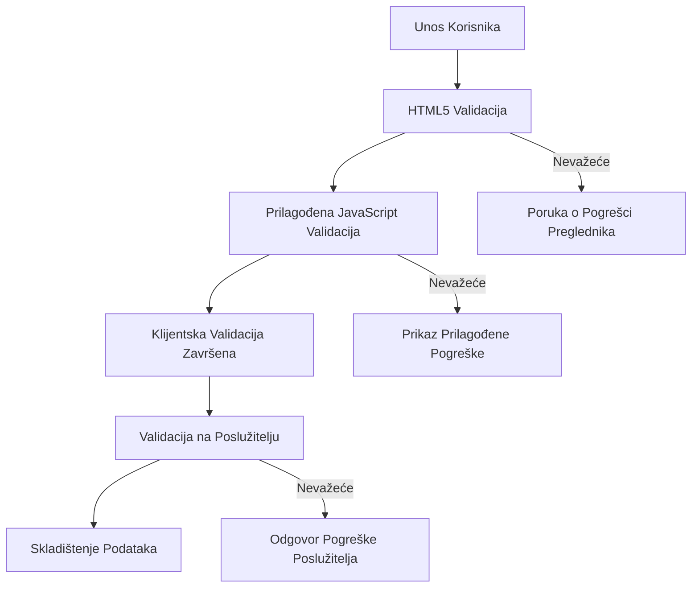
**Strategija višeslojne validacije:**
- **HTML5 validacija**: Trenutne provjere u pregledniku
- **JavaScript validacija**: Prilagođena logika i korisničko iskustvo
- **Validacija na serveru**: Završne sigurnosne i integritetske provjere
- **Postepeno poboljšanje**: Radi čak i ako je JavaScript onemogućen

### HTML5 atributi za validaciju

**Moderne alate za validaciju na raspolaganju:**

| Atribut | Svrha | Primjer upotrebe | Ponašanje preglednika |
|---------|-------|------------------|-----------------------|
| `required` | Obvezna polja | `<input required>` | Sprječava prazno slanje |
| `minlength`/`maxlength` | Ograničenja duljine teksta | `<input maxlength="20">` | Provjerava ograničenje znakova |
| `min`/`max` | Numerički rasponi | `<input min="0" max="1000">` | Validira granice broja |
| `pattern` | Prilagođena regex pravila | `<input pattern="[A-Za-z]+">` | Usklađuje specifične formate |
| `type` | Validacija tipa podataka | `<input type="email">` | Validacija specifičnih formata |

### CSS stilizacija validacije

**Kreirajte vizualnu povratnu informaciju za stanja validacije:**

```css
/* Valid input styling */
input:valid {
  border-color: #28a745;
  background-color: #f8fff9;
}

/* Invalid input styling */
input:invalid {
  border-color: #dc3545;
  background-color: #fff5f5;
}

/* Focus states for better accessibility */
input:focus:valid {
  box-shadow: 0 0 0 0.2rem rgba(40, 167, 69, 0.25);
}

input:focus:invalid {
  box-shadow: 0 0 0 0.2rem rgba(220, 53, 69, 0.25);
}
```

**Što ove vizualne naznake postižu:**
- **Zeleni okviri**: Označavaju uspješnu validaciju, poput zelenih svjetala u kontrolnoj sobi
- **Crveni okviri**: Signaliziraju pogreške validacije koje zahtijevaju pažnju
- **Isticanje fokusa**: Pruža jasni vizualni kontekst za trenutnu lokaciju unosa
- **Konzistentno stiliziranje**: Uspostavlja predvidljive obrasce sučelja koje korisnici mogu naučiti

> 💡 **Savjet**: Koristite CSS pseudo-klase `:valid` i `:invalid` kako biste pružili trenutačnu vizualnu povratnu informaciju dok korisnici upisuju, stvarajući responzivno i korisno sučelje.

### Implementacija sveobuhvatne validacije

Unaprijedimo vaš obrazac za registraciju robustnom validacijom koja pruža izvrsno korisničko iskustvo i kvalitetu podataka:

```html
<form id="registerForm" method="POST" novalidate>
  <div class="form-group">
    <label for="user">Username <span class="required">*</span></label>
    <input id="user" name="user" type="text" required 
           minlength="3" maxlength="20" 
           pattern="[a-zA-Z0-9_]+" 
           autocomplete="username"
           title="Username must be 3-20 characters, letters, numbers, and underscores only">
    <small class="form-text">Choose a unique username (3-20 characters)</small>
  </div>
  
  <div class="form-group">
    <label for="currency">Currency <span class="required">*</span></label>
    <input id="currency" name="currency" type="text" required 
           value="$" maxlength="3" 
           pattern="[A-Z$€£¥₹]+" 
           title="Enter a valid currency symbol or code">
    <small class="form-text">Currency symbol (e.g., $, €, £)</small>
  </div>
  
  <div class="form-group">
    <label for="description">Account Description</label>
    <input id="description" name="description" type="text" 
           maxlength="100" 
           placeholder="Personal savings, checking, etc.">
    <small class="form-text">Optional description (up to 100 characters)</small>
  </div>
  
  <div class="form-group">
    <label for="balance">Starting Balance</label>
    <input id="balance" name="balance" type="number" 
           value="0" min="0" step="0.01" 
           title="Enter a positive number for your starting balance">
    <small class="form-text">Initial account balance (minimum $0.00)</small>
  </div>
  
  <button type="submit">Create Account</button>
</form>
```

**Razumijevanje poboljšane validacije:**
- **Kombinira** indikatore obaveznih polja s korisnim opisima
- **Uključuje** `pattern` atribute za validaciju formata
- **Pruža** `title` atribute radi pristupačnosti i opisa alata
- **Dodaje** pomoćni tekst za vođenje unosa korisnika
- **Koristi** semantičku HTML strukturu za bolju pristupačnost

### Napredna pravila validacije

**Što svako pravilo validacije postiže:**

| Polje | Pravila validacije | Korisnička prednost |
|-------|--------------------|---------------------|
| Korisničko ime | `required`, `minlength="3"`, `maxlength="20"`, `pattern="[a-zA-Z0-9_]+"` | Osigurava valjane, jedinstvene identifikatore |
| Valuta | `required`, `maxlength="3"`, `pattern="[A-Z$€£¥₹]+"` | Prima uobičajene simbole valuta |
| Stanje računa | `min="0"`, `step="0.01"`, `type="number"` | Sprečava negativne iznose |
| Opis | `maxlength="100"` | Razumna ograničenja duljine |

### Testiranje ponašanja validacije

**Isprobajte ove scenarije validacije:**
1. **Pošaljite** obrazac s praznim obaveznim poljima
2. **Unesite** korisničko ime kraće od 3 znaka
3. **Pokušajte** s posebnim znakovima u polju korisničkog imena
4. **Unesite** negativan iznos stanja


**Što ćete primijetiti:**
- **Preglednik prikazuje** nativne poruke o grešci validacije
- **Promjene stilova** temelje se na stanjima `:valid` i `:invalid`
- **Slanje obrasca** se sprječava dok sve validacije ne prođu
- **Fokus se automatski** pomjera na prvo polje koje nije valjano

### Validacija na klijentovoj i serverskoj strani

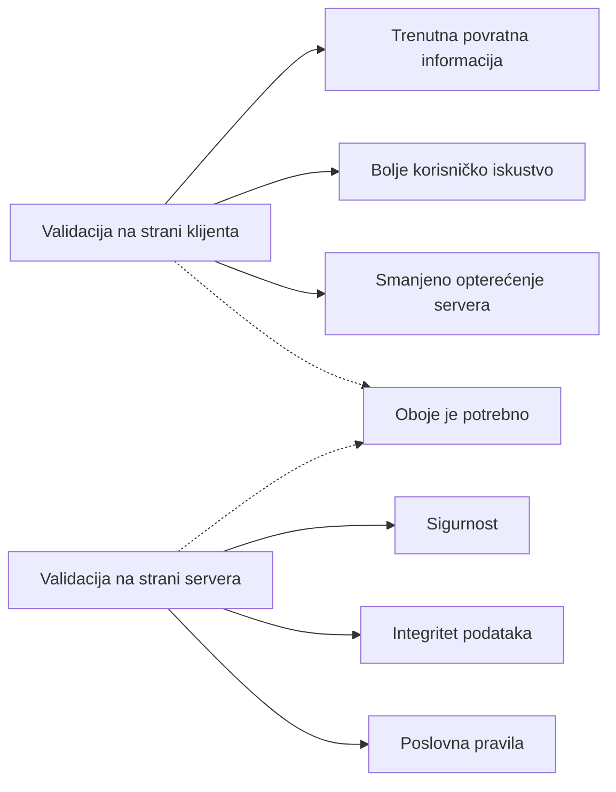
**Zašto vam trebaju oba sloja:**
- **Validacija na klijentu**: Pruža trenutnu povratnu informaciju i poboljšava iskustvo korisnika
- **Validacija na serveru**: Osigurava sigurnost i obrađuje složena poslovna pravila
- **Kombinirani pristup**: Stvara robusne, korisnički prihvatljive i sigurne aplikacije
- **Postepeno poboljšanje**: Radi čak i kad je JavaScript onemogućen

> 🛡️ **Podsjetnik o sigurnosti**: Nikada nemojte vjerovati samo validaciji na klijentu! Zlonamjerni korisnici mogu zaobići provjere na klijentskoj strani, stoga je validacija na serveru ključna za sigurnost i integritet podataka.

### ⚡ **Što možete napraviti u sljedećih 5 minuta**
- [ ] Testirajte vaš obrazac s nevaljanim podacima i pogledajte poruke validacije
- [ ] Pokušajte poslati obrazac s onemogućenim JavaScriptom i pogledajte HTML5 validaciju
- [ ] Otvorite DevTools preglednika i pregledajte podatke obrasca koji se šalju serveru
- [ ] Eksperimentirajte s različitim tipovima unosa i promatrajte promjene tipkovnice na mobilnom uređaju

### 🎯 **Što možete postići u ovom satu**
- [ ] Završiti kviz nakon lekcije i razumjeti pojmove rukovanja obrascima
- [ ] Implementirati izazov sa sveobuhvatnom validacijom i povratnim informacijama u stvarnom vremenu
- [ ] Dodati CSS stilizaciju za profesionalan izgled obrazaca
- [ ] Stvoriti rukovanje pogreškama za duplicirane korisničke nazive i pogreške servera
- [ ] Dodati polja za potvrdu lozinke s odgovarajućom validacijom

### 📅 **Vaše tjedno putovanje do majstorstva obrazaca**
- [ ] Završiti cijelu bankarsku aplikaciju s naprednim funkcijama obrazaca
- [ ] Implementirati mogućnosti slanja datoteka za profilne slike ili dokumente
- [ ] Dodati višekoračne obrasce s indikatorima napretka i upravljanjem stanjima
- [ ] Kreirati dinamične obrasce koji se prilagođavaju izborima korisnika
- [ ] Implementirati automatsko spremanje i oporavak forme za bolje korisničko iskustvo
- [ ] Dodati naprednu validaciju poput verifikacije emaila i formatiranja telefonskih brojeva

### 🌟 **Vaše mjesečno majstorstvo frontend razvoja**
- [ ] Graditi složene aplikacije s uvjetnom logikom i radnim tokovima
- [ ] Naučiti biblioteke i okvire za brzi razvoj obrazaca
- [ ] Savladati smjernice pristupačnosti i principe inkluzivnog dizajna
- [ ] Implementirati internacionalizaciju i lokalizaciju za globalne obrasce
- [ ] Kreirati ponovo upotrebljive biblioteke i dizajn sustave za obrasce
- [ ] Doprinositi otvorenim projektima obrazaca i dijeliti najbolje prakse

## 🎯 Vaš vremenski plan ovladavanja razvojem obrazaca

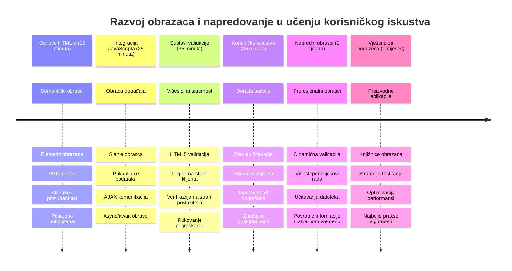
### 🛠️ Sažetak vašeg alata za razvoj obrazaca

Nakon završetka ove lekcije, sada ste ovladali:
- **HTML5 obrascima**: Semantička struktura, tipovi unosa i značajke pristupačnosti
- **JavaScript rukovanjem obrascima**: Upravljanje događajima, prikupljanje podataka i AJAX komunikacija
- **Arhitekturom validacije**: Višeslojna validacija za sigurnost i korisničko iskustvo
- **Asinkronim programiranjem**: Moderni fetch API i async/await obrasci
- **Upravljanjem pogreškama**: Sveobuhvatno rukovanje pogreškama i sustavi povratne informacije korisniku
- **Dizajnom korisničkog iskustva**: Stanja učitavanja, poruke uspjeha i oporavak od pogrešaka
- **Postepenim poboljšanjem**: Obrasci koji rade na svim preglednicima i mogućnostima

**Primjena u stvarnom svijetu**: Vaše vještine za razvoj obrazaca primjenjuju se direktno na:
- **E-trgovinu**: Procesi naplate, registracija računa i obrasci za plaćanje
- **Poslovni softver**: Sustavi za unos podataka, sučelja izvještavanja i aplikacije za radne tokove
- **Upravljanje sadržajem**: Platforme za objavljivanje, korisnički generirani sadržaj i administrativna sučelja
- **Financijske aplikacije**: Bankarska sučelja, investicijske platforme i sustavi transakcija
- **Zdravstvene sustave**: Portali za pacijente, zakazivanje termina i obrasci medicinskih evidencija
- **Obrazovne platforme**: Prijave na tečajeve, alati za procjenu i sustavi za upravljanje učenjem

**Stečene profesionalne vještine**: Sada možete:
- **Dizajnirati** pristupačne obrasce koji rade za sve korisnike uključujući osobe s invaliditetom
- **Implementirati** sigurnu validaciju obrasca koja sprječava korupciju podataka i sigurnosne propuste
- **Kreirati** responzivna korisnička sučelja koja pružaju jasne povratne informacije i upute
- **Otklanjati pogreške** složenih interakcija obrasca koristeći alate za razvoj i analizu mreže
- **Optimizirati** performanse obrasca putem učinkovitog rukovanja podacima i strategija validacije

**Ovladani koncepti frontend razvoja**:
- **Arhitektura navođena događajima**: Upravljanje i sustavi odgovora na korisničke interakcije
- **Asinkrono programiranje**: Ne-blokirajuća komunikacija sa serverom i rukovanje pogreškama
- **Validacija podataka**: Sigurnosne i integritetske provjere na klijentskoj i serverskoj strani
- **Dizajn korisničkog iskustva**: Intuitivna sučelja koja vode korisnike prema uspjehu
- **Inženjering pristupačnosti**: Inkluzivan dizajn koji radi za različite korisničke potrebe

**Sljedeća razina**: Spremni ste za istraživanje naprednih biblioteka obrazaca, implementaciju složenih pravila validacije ili izgradnju sustava za prikupljanje podataka razine poduzeća!

🌟 **Postignuće otključano**: Izgradili ste kompletan sustav rukovanja obrascima s profesionalnom validacijom, rukovanjem pogreškama i obrascima korisničkog iskustva!

---


---

## GitHub Copilot Agent Challenge 🚀

Koristite način rada Agent za dovršetak sljedećeg izazova:

**Opis:** Unaprijedite obrazac za registraciju sveobuhvatnom validacijom na strani klijenta i povratnom informacijom korisniku. Ovaj izazov pomoći će vam u praksi validacije obrazaca, rukovanju pogreškama i poboljšavanju korisničkog iskustva interaktivnim povratnim informacijama.
**Prompt:** Kreirajte kompletan sustav validacije obrasca za registracijski obrazac koji uključuje: 1) Povratne informacije o validaciji u stvarnom vremenu za svako polje dok korisnik tipka, 2) Prilagođene poruke validacije koje se pojavljuju ispod svakog polja za unos, 3) Polje za potvrdu lozinke s validacijom podudaranja, 4) Vizualne pokazatelje (kao što su zelene kvačice za valjana polja i crvena upozorenja za nevaljana), 5) Gumb za slanje koji se aktivira samo kada sve validacije prođu. Koristite HTML5 atribute za validaciju, CSS za stiliziranje stanja validacije te JavaScript za interaktivno ponašanje.

Saznajte više o [agent mode](https://code.visualstudio.com/blogs/2025/02/24/introducing-copilot-agent-mode) ovdje.

## 🚀 Izazov

Prikažite poruku o pogrešci u HTML-u ako korisnik već postoji.

Evo primjera kako završna stranica za prijavu može izgledati nakon malo stiliziranja:

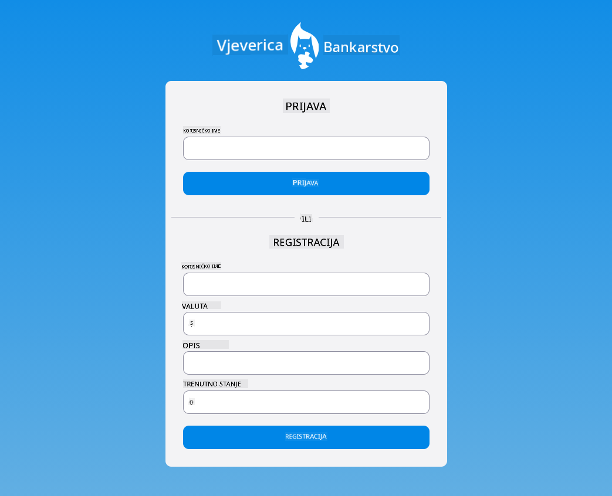

## Kviz nakon predavanja

[Kviz nakon predavanja](https://ff-quizzes.netlify.app/web/quiz/44)

## Pregled i samostalan rad

Programeri su vrlo kreativno pristupili izradi obrazaca, posebno u vezi sa strategijama validacije. Istražite različite tokove obrazaca pregledavajući [CodePen](https://codepen.com); možete li pronaći neke zanimljive i inspirativne obrasce?

## Zadatak

[Stilizirajte svoju bankarsku aplikaciju](assignment.md)

---

<!-- CO-OP TRANSLATOR DISCLAIMER START -->
**Odricanje od odgovornosti**:  
Ovaj dokument preveden je korištenjem AI usluge za prevođenje [Co-op Translator](https://github.com/Azure/co-op-translator). Iako nastojimo postići točnost, imajte na umu da automatizirani prijevodi mogu sadržavati pogreške ili netočnosti. Izvorni dokument na izvornom jeziku treba smatrati autoritativnim izvorom. Za kritične informacije preporučuje se profesionalni ljudski prijevod. Ne snosimo odgovornost za bilo kakve nesporazume ili pogrešna tumačenja koja proizlaze iz korištenja ovog prijevoda.
<!-- CO-OP TRANSLATOR DISCLAIMER END -->