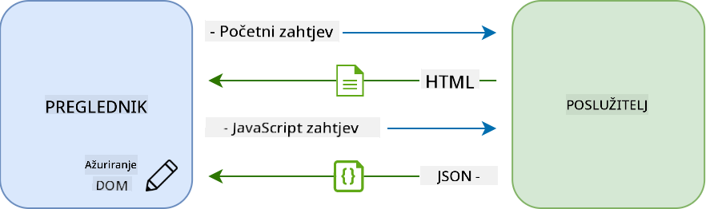

<!--
CO_OP_TRANSLATOR_METADATA:
{
  "original_hash": "f587e913e3f7c0b1c549a05dd74ee8e5",
  "translation_date": "2025-08-27T22:01:26+00:00",
  "source_file": "7-bank-project/3-data/README.md",
  "language_code": "hr"
}
-->
# Izgradnja bankovne aplikacije, dio 3: Metode dohvaćanja i korištenja podataka

## Kviz prije predavanja

[Kviz prije predavanja](https://ff-quizzes.netlify.app/web/quiz/45)

### Uvod

U središtu svake web aplikacije nalaze se *podaci*. Podaci mogu imati različite oblike, ali njihova glavna svrha uvijek je prikazivanje informacija korisniku. Kako web aplikacije postaju sve interaktivnije i složenije, način na koji korisnik pristupa i komunicira s informacijama postaje ključni dio razvoja weba.

U ovoj lekciji vidjet ćemo kako asinkrono dohvatiti podatke sa servera i koristiti te podatke za prikaz informacija na web stranici bez ponovnog učitavanja HTML-a.

### Preduvjeti

Potrebno je da ste izradili [Formu za prijavu i registraciju](../2-forms/README.md) kao dio web aplikacije za ovu lekciju. Također trebate instalirati [Node.js](https://nodejs.org) i [pokrenuti API server](../api/README.md) lokalno kako biste dobili podatke o korisničkim računima.

Možete testirati radi li server ispravno izvršavanjem ove naredbe u terminalu:

```sh
curl http://localhost:5000/api
# -> should return "Bank API v1.0.0" as a result
```

---

## AJAX i dohvaćanje podataka

Tradicionalne web stranice ažuriraju prikazani sadržaj kada korisnik odabere poveznicu ili pošalje podatke putem forme, ponovno učitavajući cijelu HTML stranicu. Svaki put kada je potrebno učitati nove podatke, web server vraća potpuno novu HTML stranicu koju preglednik mora obraditi, prekidajući trenutnu korisničku akciju i ograničavajući interakcije tijekom učitavanja. Ovaj način rada naziva se *Višestranična aplikacija* ili *MPA*.


Kako su web aplikacije postajale složenije i interaktivnije, pojavila se nova tehnika nazvana [AJAX (Asynchronous JavaScript and XML)](https://en.wikipedia.org/wiki/Ajax_(programming)). Ova tehnika omogućuje web aplikacijama slanje i dohvaćanje podataka sa servera asinkrono pomoću JavaScripta, bez potrebe za ponovnim učitavanjem HTML stranice, što rezultira bržim ažuriranjima i glatkijim korisničkim interakcijama. Kada se novi podaci dobiju sa servera, trenutna HTML stranica može se ažurirati pomoću JavaScripta koristeći [DOM](https://developer.mozilla.org/docs/Web/API/Document_Object_Model) API. S vremenom se ovaj pristup razvio u ono što se danas naziva [*Jednostranična aplikacija* ili *SPA*](https://en.wikipedia.org/wiki/Single-page_application).



Kada je AJAX prvi put uveden, jedini dostupni API za asinkrono dohvaćanje podataka bio je [`XMLHttpRequest`](https://developer.mozilla.org/docs/Web/API/XMLHttpRequest/Using_XMLHttpRequest). No, moderni preglednici sada implementiraju praktičniji i moćniji [`Fetch` API](https://developer.mozilla.org/docs/Web/API/Fetch_API), koji koristi obećanja (promises) i bolje je prilagođen za manipulaciju JSON podacima.

> Iako svi moderni preglednici podržavaju `Fetch API`, ako želite da vaša web aplikacija radi na starijim preglednicima, uvijek je dobra ideja provjeriti [tablicu kompatibilnosti na caniuse.com](https://caniuse.com/fetch).

### Zadatak

U [prethodnoj lekciji](../2-forms/README.md) implementirali smo formu za registraciju kako bismo kreirali korisnički račun. Sada ćemo dodati kod za prijavu koristeći postojeći račun i dohvat njegovih podataka. Otvorite datoteku `app.js` i dodajte novu funkciju `login`:

```js
async function login() {
  const loginForm = document.getElementById('loginForm')
  const user = loginForm.user.value;
}
```

Ovdje započinjemo dohvaćanjem elementa forme pomoću `getElementById()`, a zatim dobivamo korisničko ime iz unosa pomoću `loginForm.user.value`. Svaki kontrolni element forme može se pristupiti putem njegovog imena (postavljenog u HTML-u pomoću atributa `name`) kao svojstva forme.

Na sličan način kao što smo učinili za registraciju, kreirat ćemo drugu funkciju za izvršavanje zahtjeva prema serveru, ali ovaj put za dohvaćanje podataka o računu:

```js
async function getAccount(user) {
  try {
    const response = await fetch('//localhost:5000/api/accounts/' + encodeURIComponent(user));
    return await response.json();
  } catch (error) {
    return { error: error.message || 'Unknown error' };
  }
}
```

Koristimo `fetch` API za asinkrono dohvaćanje podataka sa servera, ali ovaj put ne trebamo dodatne parametre osim URL-a koji pozivamo, jer samo tražimo podatke. Po defaultu, `fetch` kreira [`GET`](https://developer.mozilla.org/docs/Web/HTTP/Methods/GET) HTTP zahtjev, što je upravo ono što nam treba.

✅ `encodeURIComponent()` je funkcija koja kodira posebne znakove za URL. Koje probleme bismo mogli imati ako ne pozovemo ovu funkciju i direktno koristimo vrijednost `user` u URL-u?

Sada ćemo ažurirati našu funkciju `login` kako bismo koristili `getAccount`:

```js
async function login() {
  const loginForm = document.getElementById('loginForm')
  const user = loginForm.user.value;
  const data = await getAccount(user);

  if (data.error) {
    return console.log('loginError', data.error);
  }

  account = data;
  navigate('/dashboard');
}
```

Prvo, budući da je `getAccount` asinkrona funkcija, moramo je uskladiti s ključnom riječi `await` kako bismo pričekali rezultat servera. Kao i kod svakog zahtjeva prema serveru, također moramo obraditi slučajeve pogreške. Za sada ćemo samo dodati poruku u log za prikaz pogreške i vratiti se na to kasnije.

Zatim moramo pohraniti podatke negdje kako bismo ih kasnije mogli koristiti za prikaz informacija na nadzornoj ploči. Budući da varijabla `account` još ne postoji, kreirat ćemo globalnu varijablu na vrhu naše datoteke:

```js
let account = null;
```

Nakon što su korisnički podaci spremljeni u varijablu, možemo se prebaciti s *login* stranice na *dashboard* koristeći funkciju `navigate()` koju već imamo.

Na kraju, trebamo pozvati našu funkciju `login` kada se forma za prijavu pošalje, modificirajući HTML:

```html
<form id="loginForm" action="javascript:login()">
```

Testirajte radi li sve ispravno registracijom novog računa i pokušajem prijave koristeći isti račun.

Prije nego što prijeđemo na sljedeći dio, možemo dovršiti funkciju `register` dodavanjem ovoga na kraj funkcije:

```js
account = result;
navigate('/dashboard');
```

✅ Jeste li znali da po defaultu možete pozivati server API-je samo s *iste domene i porta* kao web stranica koju pregledavate? Ovo je sigurnosni mehanizam koji provode preglednici. No, naša web aplikacija radi na `localhost:3000`, dok API server radi na `localhost:5000`. Zašto to funkcionira? Koristeći tehniku nazvanu [Cross-Origin Resource Sharing (CORS)](https://developer.mozilla.org/docs/Web/HTTP/CORS), moguće je izvršavati HTTP zahtjeve između različitih domena ako server dodaje posebne zaglavlja odgovoru, dopuštajući iznimke za određene domene.

> Saznajte više o API-jima kroz ovu [lekciju](https://docs.microsoft.com/learn/modules/use-apis-discover-museum-art/?WT.mc_id=academic-77807-sagibbon).

## Ažuriranje HTML-a za prikaz podataka

Sada kada imamo korisničke podatke, moramo ažurirati postojeći HTML kako bismo ih prikazali. Već znamo kako dohvatiti element iz DOM-a koristeći, na primjer, `document.getElementById()`. Nakon što imate osnovni element, evo nekih API-ja koje možete koristiti za njegovo modificiranje ili dodavanje podređenih elemenata:

- Koristeći svojstvo [`textContent`](https://developer.mozilla.org/docs/Web/API/Node/textContent) možete promijeniti tekst elementa. Imajte na umu da promjena ove vrijednosti uklanja sve podređene elemente (ako ih ima) i zamjenjuje ih pruženim tekstom. Kao takvo, ovo je također učinkovit način za uklanjanje svih podređenih elemenata određenog elementa dodjeljivanjem praznog niza `''`.

- Koristeći [`document.createElement()`](https://developer.mozilla.org/docs/Web/API/Document/createElement) zajedno s metodom [`append()`](https://developer.mozilla.org/docs/Web/API/ParentNode/append) možete kreirati i dodati jedan ili više novih podređenih elemenata.

✅ Koristeći svojstvo [`innerHTML`](https://developer.mozilla.org/docs/Web/API/Element/innerHTML) elementa također je moguće promijeniti njegov HTML sadržaj, ali ovo bi trebalo izbjegavati jer je ranjivo na [cross-site scripting (XSS)](https://developer.mozilla.org/docs/Glossary/Cross-site_scripting) napade.

### Zadatak

Prije nego što prijeđemo na ekran nadzorne ploče, postoji još jedna stvar koju bismo trebali učiniti na *login* stranici. Trenutno, ako pokušate prijaviti se s korisničkim imenom koje ne postoji, poruka se prikazuje u konzoli, ali za običnog korisnika ništa se ne mijenja i ne zna što se događa.

Dodajmo element rezerviranog mjesta u formu za prijavu gdje možemo prikazati poruku o pogrešci ako je potrebno. Dobro mjesto bilo bi neposredno prije gumba za prijavu `<button>`:

```html
...
<div id="loginError"></div>
<button>Login</button>
...
```

Ovaj `<div>` element je prazan, što znači da se ništa neće prikazati na ekranu dok mu ne dodamo neki sadržaj. Također mu dodajemo `id` kako bismo ga lako dohvatili pomoću JavaScripta.

Vratite se u datoteku `app.js` i kreirajte novu pomoćnu funkciju `updateElement`:

```js
function updateElement(id, text) {
  const element = document.getElementById(id);
  element.textContent = text;
}
```

Ova funkcija je prilično jednostavna: s obzirom na *id* elementa i *tekst*, ažurirat će tekstualni sadržaj DOM elementa s odgovarajućim `id`. Koristimo ovu metodu umjesto prethodne poruke o pogrešci u funkciji `login`:

```js
if (data.error) {
  return updateElement('loginError', data.error);
}
```

Sada, ako pokušate prijaviti se s nevažećim računom, trebali biste vidjeti nešto poput ovoga:


Sada imamo tekst pogreške koji se vizualno prikazuje, ali ako ga pokušate koristiti s čitačem ekrana, primijetit ćete da ništa nije najavljeno. Kako bi tekst koji se dinamički dodaje stranici bio najavljen čitačima ekrana, potrebno je koristiti nešto što se zove [Live Region](https://developer.mozilla.org/docs/Web/Accessibility/ARIA/ARIA_Live_Regions). Ovdje ćemo koristiti specifičnu vrstu live regije nazvanu alert:

```html
<div id="loginError" role="alert"></div>
```

Implementirajte isto ponašanje za pogreške funkcije `register` (ne zaboravite ažurirati HTML).

## Prikaz informacija na nadzornoj ploči

Koristeći iste tehnike koje smo upravo vidjeli, također ćemo se pobrinuti za prikaz informacija o računu na stranici nadzorne ploče.

Ovako izgleda objekt računa dobiven sa servera:

```json
{
  "user": "test",
  "currency": "$",
  "description": "Test account",
  "balance": 75,
  "transactions": [
    { "id": "1", "date": "2020-10-01", "object": "Pocket money", "amount": 50 },
    { "id": "2", "date": "2020-10-03", "object": "Book", "amount": -10 },
    { "id": "3", "date": "2020-10-04", "object": "Sandwich", "amount": -5 }
  ],
}
```

> Napomena: kako biste si olakšali posao, možete koristiti unaprijed postojeći `test` račun koji je već popunjen podacima.

### Zadatak

Započnimo zamjenom sekcije "Balance" u HTML-u kako bismo dodali elemente rezerviranog mjesta:

```html
<section>
  Balance: <span id="balance"></span><span id="currency"></span>
</section>
```

Također ćemo dodati novu sekciju odmah ispod za prikaz opisa računa:

```html
<h2 id="description"></h2>
```

✅ Budući da opis računa funkcionira kao naslov za sadržaj ispod njega, označen je semantički kao naslov. Saznajte više o tome kako [struktura naslova](https://www.nomensa.com/blog/2017/how-structure-headings-web-accessibility) doprinosi pristupačnosti i kritički pogledajte stranicu kako biste utvrdili što još može biti naslov.

Zatim ćemo kreirati novu funkciju u `app.js` za popunjavanje rezerviranih mjesta:

```js
function updateDashboard() {
  if (!account) {
    return navigate('/login');
  }

  updateElement('description', account.description);
  updateElement('balance', account.balance.toFixed(2));
  updateElement('currency', account.currency);
}
```

Prvo provjeravamo imamo li potrebne podatke o računu prije nego što nastavimo dalje. Zatim koristimo funkciju `updateElement()` koju smo ranije kreirali za ažuriranje HTML-a.

> Kako bismo prikaz stanja računa učinili ljepšim, koristimo metodu [`toFixed(2)`](https://developer.mozilla.org/docs/Web/JavaScript/Reference/Global_Objects/Number/toFixed) kako bismo prisilili prikaz vrijednosti s 2 decimale.

Sada trebamo pozvati našu funkciju `updateDashboard()` svaki put kada se učita stranica nadzorne ploče. Ako ste već završili [zadatak iz lekcije 1](../1-template-route/assignment.md), ovo bi trebalo biti jednostavno, inače možete koristiti sljedeću implementaciju.

Dodajte ovaj kod na kraj funkcije `updateRoute()`:

```js
if (typeof route.init === 'function') {
  route.init();
}
```

I ažurirajte definiciju ruta s:

```js
const routes = {
  '/login': { templateId: 'login' },
  '/dashboard': { templateId: 'dashboard', init: updateDashboard }
};
```

Ovom promjenom, svaki put kada se prikaže stranica nadzorne ploče, poziva se funkcija `updateDashboard()`. Nakon prijave, trebali biste moći vidjeti stanje računa, valutu i opis.

## Dinamičko kreiranje redaka tablice pomoću HTML predložaka

U [prvoj lekciji](../1-template-route/README.md) koristili smo HTML predloške zajedno s metodom [`appendChild()`](https://developer.mozilla.org/docs/Web/API/Node/appendChild) za implementaciju navigacije u našoj aplikaciji. Predlošci također mogu biti manji i koristiti se za dinamičko popunjavanje ponavljajućih dijelova stranice.

Koristit ćemo sličan pristup za prikaz popisa transakcija u HTML tablici.

### Zadatak

Dodajte novi predložak u HTML `<body>`:

```html
<template id="transaction">
  <tr>
    <td></td>
    <td></td>
    <td></td>
  </tr>
</template>
```

Ovaj predložak predstavlja jedan redak tablice, s 3 stupca koje želimo popuniti: *datum*, *objekt* i *iznos* transakcije.

Zatim dodajte ovo svojstvo `id` elementu `<tbody>` tablice unutar predloška nadzorne ploče kako biste ga lakše pronašli pomoću JavaScripta:

```html
<tbody id="transactions"></tbody>
```

Naš HTML je spreman, sada prelazimo na JavaScript kod i kreiramo novu funkciju `createTransactionRow`:

```js
function createTransactionRow(transaction) {
  const template = document.getElementById('transaction');
  const transactionRow = template.content.cloneNode(true);
  const tr = transactionRow.querySelector('tr');
  tr.children[0].textContent = transaction.date;
  tr.children[1].textContent = transaction.object;
  tr.children[2].textContent = transaction.amount.toFixed(2);
  return transactionRow;
}
```

Ova funkcija radi upravo ono što joj ime sugerira: koristeći predložak koji smo ranije kreirali, kreira novi redak tablice i popunjava njegov sadržaj koristeći podatke o transakciji. Koristit ćemo ovo u našoj funkciji `updateDashboard()` za popunjavanje tablice:

```js
const transactionsRows = document.createDocumentFragment();
for (const transaction of account.transactions) {
  const transactionRow = createTransactionRow(transaction);
  transactionsRows.appendChild(transactionRow);
}
updateElement('transactions', transactionsRows);
```

Ovdje koristimo metodu [`document.createDocumentFragment()`](https://developer.mozilla.org/docs/Web/API/Document/createDocumentFragment) koja kreira novi DOM fragment na kojem možemo raditi prije nego što ga konačno dodamo u našu HTML tablicu.

Još uvijek postoji jedna stvar koju moramo učiniti prije nego što ovaj kod može raditi, budući da naša funkcija `updateElement()` trenutno podržava samo tekstualni sadržaj. Promijenimo njezin kod malo:

```js
function updateElement(id, textOrNode) {
  const element = document.getElementById(id);
  element.textContent = ''; // Removes all children
  element.append(textOrNode);
}
```

Koristimo metodu [`append()`](https://developer.mozilla.org/docs/Web/API/ParentNode/append) jer omogućuje dodavanje teksta ili [DOM čvorova](https://developer.mozilla.org/docs/Web/API/Node) roditeljskom elementu, što je savršeno za sve naše slučajeve.
Ako pokušate koristiti račun `test` za prijavu, sada biste trebali vidjeti popis transakcija na nadzornoj ploči 🎉.

---

## 🚀 Izazov

Suradnjom učinite da stranica nadzorne ploče izgleda kao prava aplikacija za bankarstvo. Ako ste već stilizirali svoju aplikaciju, pokušajte koristiti [media queries](https://developer.mozilla.org/docs/Web/CSS/Media_Queries) kako biste stvorili [responzivni dizajn](https://developer.mozilla.org/docs/Web/Progressive_web_apps/Responsive/responsive_design_building_blocks) koji dobro funkcionira na stolnim računalima i mobilnim uređajima.

Evo primjera stilizirane stranice nadzorne ploče:


## Kviz nakon predavanja

[Kviz nakon predavanja](https://ff-quizzes.netlify.app/web/quiz/46)

## Zadatak

[Refaktorirajte i komentirajte svoj kod](assignment.md)

---

**Odricanje od odgovornosti**:  
Ovaj dokument je preveden pomoću AI usluge za prevođenje [Co-op Translator](https://github.com/Azure/co-op-translator). Iako nastojimo osigurati točnost, imajte na umu da automatski prijevodi mogu sadržavati pogreške ili netočnosti. Izvorni dokument na izvornom jeziku treba smatrati autoritativnim izvorom. Za kritične informacije preporučuje se profesionalni prijevod od strane čovjeka. Ne preuzimamo odgovornost za nesporazume ili pogrešna tumačenja koja mogu proizaći iz korištenja ovog prijevoda.