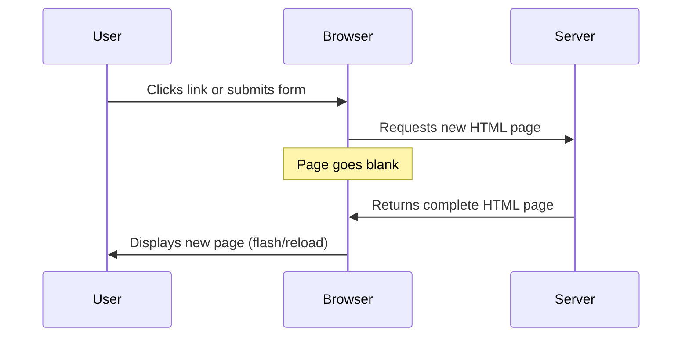
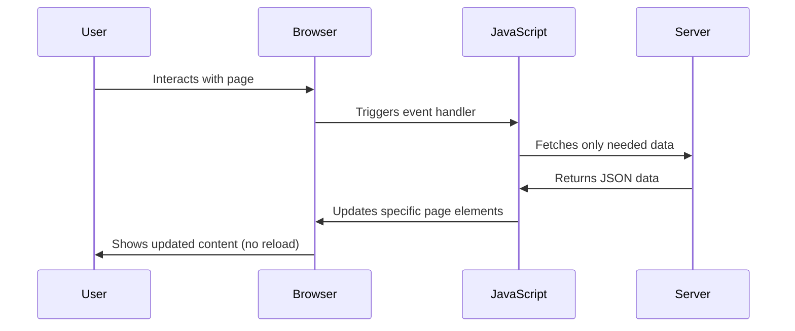
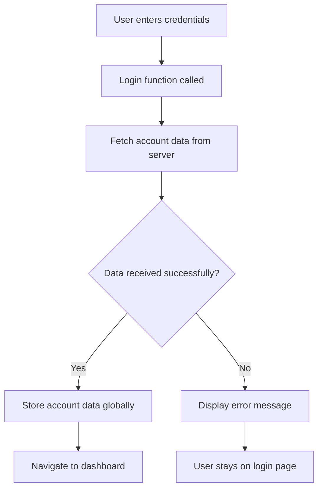
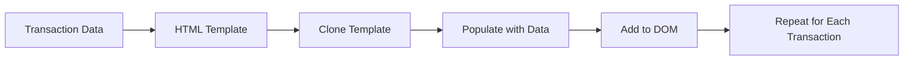

<!--
CO_OP_TRANSLATOR_METADATA:
{
  "original_hash": "2c1164912414820c8efd699b43f64954",
  "translation_date": "2025-10-25T00:05:01+00:00",
  "source_file": "7-bank-project/3-data/README.md",
  "language_code": "hr"
}
-->
# Izrada aplikacije za bankarstvo, dio 3: Metode dohvaćanja i korištenja podataka

Razmislite o računalu Enterprisea iz Zvjezdanih staza - kada kapetan Picard zatraži status broda, informacije se pojavljuju trenutno, bez da se cijelo sučelje zatvori i ponovno izgradi. Taj neprekidni tok informacija upravo je ono što ovdje gradimo s dinamičkim dohvaćanjem podataka.

Trenutno je vaša aplikacija za bankarstvo poput tiskane novine - informativna, ali statična. Pretvorit ćemo je u nešto slično kontrolnom centru NASA-e, gdje podaci kontinuirano teku i ažuriraju se u stvarnom vremenu bez prekida korisničkog tijeka rada.

Naučit ćete kako komunicirati s poslužiteljima asinkrono, kako rukovati podacima koji dolaze u različito vrijeme i kako transformirati sirove informacije u nešto značajno za vaše korisnike. Ovo je razlika između demo verzije i softvera spremnog za produkciju.

## Kviz prije predavanja

[Pre-lecture quiz](https://ff-quizzes.netlify.app/web/quiz/45)

### Preduvjeti

Prije nego što se upustite u dohvaćanje podataka, osigurajte da imate sljedeće komponente spremne:

- **Prethodna lekcija**: Završite [Formu za prijavu i registraciju](../2-forms/README.md) - nadogradit ćemo na ovom temelju
- **Lokalni poslužitelj**: Instalirajte [Node.js](https://nodejs.org) i [pokrenite API poslužitelj](../api/README.md) za pružanje podataka o računima
- **API veza**: Testirajte vezu s poslužiteljem pomoću ove naredbe:

```bash
curl http://localhost:5000/api
# Expected response: "Bank API v1.0.0"
```

Ovaj brzi test osigurava da svi dijelovi ispravno komuniciraju:
- Provjerava da Node.js ispravno radi na vašem sustavu
- Potvrđuje da je vaš API poslužitelj aktivan i odgovara
- Validira da vaša aplikacija može dosegnuti poslužitelj (kao provjera radio veze prije misije)

---

## Razumijevanje dohvaćanja podataka u modernim web aplikacijama

Način na koji web aplikacije rukovode podacima dramatično se razvio tijekom posljednja dva desetljeća. Razumijevanje ove evolucije pomoći će vam da cijenite zašto su moderni pristupi poput AJAX-a i Fetch API-ja toliko moćni i zašto su postali ključni alati za web programere.

Istražimo kako su tradicionalne web stranice funkcionirale u usporedbi s dinamičnim, responzivnim aplikacijama koje danas gradimo.

### Tradicionalne višestranične aplikacije (MPA)

U ranim danima weba, svaki klik bio je poput mijenjanja kanala na starom televizoru - ekran bi se zamračio, a zatim polako prikazivao novi sadržaj. To je bila stvarnost ranih web aplikacija, gdje je svaka interakcija značila potpuno ponovno izgrađivanje cijele stranice od nule.




**Zašto je ovaj pristup bio nezgrapan:**
- Svaki klik značio je ponovno izgrađivanje cijele stranice od nule
- Korisnici su bili prekidani usred razmišljanja zbog tih dosadnih bljeskova stranice
- Vaša internetska veza radila je prekovremeno preuzimajući isti zaglavlje i podnožje iznova i iznova
- Aplikacije su se osjećale više kao pretraživanje kartoteke nego korištenje softvera

### Moderne jednostranične aplikacije (SPA)

AJAX (Asynchronous JavaScript and XML) potpuno je promijenio ovu paradigmu. Kao modularni dizajn Međunarodne svemirske postaje, gdje astronauti mogu zamijeniti pojedine komponente bez ponovnog izgrađivanja cijele strukture, AJAX nam omogućuje ažuriranje specifičnih dijelova web stranice bez ponovnog učitavanja svega. Iako ime spominje XML, danas uglavnom koristimo JSON, ali osnovni princip ostaje isti: ažuriraj samo ono što treba promijeniti.




**Zašto se SPA aplikacije osjećaju puno bolje:**
- Ažuriraju se samo dijelovi koji se stvarno mijenjaju (pametno, zar ne?)
- Nema više neugodnih prekida - vaši korisnici ostaju u svom tijeku
- Manje podataka putuje mrežom, što znači brže učitavanje
- Sve se osjeća brzo i responzivno, poput aplikacija na vašem telefonu

### Evolucija prema modernom Fetch API-ju

Moderni preglednici pružaju [`Fetch` API](https://developer.mozilla.org/docs/Web/API/Fetch_API), koji zamjenjuje stariji [`XMLHttpRequest`](https://developer.mozilla.org/docs/Web/API/XMLHttpRequest/Using_XMLHttpRequest). Kao razlika između upravljanja telegrafom i korištenja e-pošte, Fetch API koristi obećanja za čišći asinkroni kod i prirodno rukuje JSON-om.

| Značajka | XMLHttpRequest | Fetch API |
|----------|----------------|-----------|
| **Sintaksa** | Složena, temeljena na povratnim pozivima | Čista, temeljena na obećanjima |
| **Rukovanje JSON-om** | Potrebno ručno parsiranje | Ugrađena metoda `.json()` |
| **Rukovanje greškama** | Ograničene informacije o greškama | Detaljne informacije o greškama |
| **Podrška za moderne tehnologije** | Kompatibilnost sa starijim verzijama | ES6+ obećanja i async/await |

> 💡 **Kompatibilnost preglednika**: Dobre vijesti - Fetch API radi u svim modernim preglednicima! Ako vas zanimaju specifične verzije, [caniuse.com](https://caniuse.com/fetch) ima kompletnu priču o kompatibilnosti.
> 
**Zaključak:**
- Odlično radi u Chromeu, Firefoxu, Safariju i Edgeu (praktički svugdje gdje su vaši korisnici)
- Samo Internet Explorer treba dodatnu pomoć (i iskreno, vrijeme je da se oprostimo od IE-a)
- Savršeno vas priprema za elegantne async/await obrasce koje ćemo kasnije koristiti

### Implementacija prijave korisnika i dohvaćanja podataka

Sada ćemo implementirati sustav prijave koji vašu aplikaciju za bankarstvo transformira iz statičnog prikaza u funkcionalnu aplikaciju. Kao što se koriste protokoli autentifikacije u sigurnim vojnim objektima, provjerit ćemo korisničke vjerodajnice i zatim omogućiti pristup njihovim specifičnim podacima.

Gradit ćemo ovo postupno, počevši od osnovne autentifikacije, a zatim dodajući mogućnosti dohvaćanja podataka.

#### Korak 1: Kreiranje temelja funkcije za prijavu

Otvorite svoju datoteku `app.js` i dodajte novu funkciju `login`. Ova funkcija će rukovati procesom autentifikacije korisnika:

```javascript
async function login() {
  const loginForm = document.getElementById('loginForm');
  const user = loginForm.user.value;
}
```

**Razložimo ovo:**
- Ključna riječ `async`? Ona govori JavaScriptu "hej, ova funkcija možda treba pričekati na neke stvari"
- Dohvaćamo našu formu sa stranice (ništa posebno, samo je pronalazimo po njenom ID-u)
- Zatim izvlačimo ono što je korisnik unio kao svoje korisničko ime
- Evo zgodnog trika: možete pristupiti bilo kojem unosu forme pomoću atributa `name` - nema potrebe za dodatnim pozivima getElementById!

> 💡 **Obrazac pristupa formi**: Svakom kontroleru forme može se pristupiti putem njegovog imena (postavljenog u HTML-u pomoću atributa `name`) kao svojstva elementa forme. Ovo pruža čist i čitljiv način za dohvaćanje podataka iz forme.

#### Korak 2: Kreiranje funkcije za dohvaćanje podataka o računu

Zatim ćemo kreirati namjensku funkciju za dohvaćanje podataka o računu s poslužitelja. Ovo slijedi isti obrazac kao vaša funkcija za registraciju, ali se fokusira na dohvaćanje podataka:

```javascript
async function getAccount(user) {
  try {
    const response = await fetch('//localhost:5000/api/accounts/' + encodeURIComponent(user));
    return await response.json();
  } catch (error) {
    return { error: error.message || 'Unknown error' };
  }
}
```

**Što ovaj kod postiže:**
- **Koristi** moderni `fetch` API za asinkrono slanje zahtjeva za podatke
- **Konstruira** URL GET zahtjeva s parametrom korisničkog imena
- **Primjenjuje** `encodeURIComponent()` za sigurno rukovanje posebnim znakovima u URL-ovima
- **Pretvara** odgovor u JSON format za jednostavnu manipulaciju podacima
- **Rukuje** greškama na elegantan način vraćanjem objekta greške umjesto rušenja

> ⚠️ **Napomena o sigurnosti**: Funkcija `encodeURIComponent()` rukuje posebnim znakovima u URL-ovima. Kao kodni sustavi koji se koriste u pomorskim komunikacijama, osigurava da vaša poruka stigne točno onako kako je namijenjena, sprječavajući da se znakovi poput "#" ili "&" pogrešno interpretiraju.
> 
**Zašto je ovo važno:**
- Sprječava da posebni znakovi pokvare URL-ove
- Štiti od napada manipulacijom URL-om
- Osigurava da vaš poslužitelj primi namijenjene podatke
- Slijedi sigurne prakse kodiranja

#### Razumijevanje HTTP GET zahtjeva

Evo nečega što bi vas moglo iznenaditi: kada koristite `fetch` bez dodatnih opcija, automatski stvara [`GET`](https://developer.mozilla.org/docs/Web/HTTP/Methods/GET) zahtjev. Ovo je savršeno za ono što radimo - tražimo od poslužitelja "hej, mogu li vidjeti podatke o ovom korisniku?"

Razmislite o GET zahtjevima kao o pristojnom traženju posudbe knjige iz knjižnice - tražite da vidite nešto što već postoji. POST zahtjevi (koje smo koristili za registraciju) više su poput predaje nove knjige da se doda u kolekciju.

| GET zahtjev | POST zahtjev |
|-------------|-------------|
| **Svrha** | Dohvaćanje postojećih podataka | Slanje novih podataka na poslužitelj |
| **Parametri** | U URL putanji/upitu | U tijelu zahtjeva |
| **Keširanje** | Može se keširati od strane preglednika | Obično se ne kešira |
| **Sigurnost** | Vidljivo u URL-u/logovima | Skriveno u tijelu zahtjeva |

#### Korak 3: Povezivanje svih dijelova

Sada dolazi zadovoljavajući dio - povežimo vašu funkciju za dohvaćanje podataka o računu s procesom prijave. Ovo je trenutak kada sve klikne na svoje mjesto:

```javascript
async function login() {
  const loginForm = document.getElementById('loginForm');
  const user = loginForm.user.value;
  const data = await getAccount(user);

  if (data.error) {
    return console.log('loginError', data.error);
  }

  account = data;
  navigate('/dashboard');
}
```

Ova funkcija slijedi jasan slijed:
- Izvlači korisničko ime iz unosa forme
- Zahtijeva podatke o korisničkom računu s poslužitelja
- Rukuje svim greškama koje se pojave tijekom procesa
- Sprema podatke o računu i navigira na nadzornu ploču nakon uspjeha

> 🎯 **Async/Await obrazac**: Budući da je `getAccount` asinkrona funkcija, koristimo ključnu riječ `await` kako bismo pauzirali izvršavanje dok poslužitelj ne odgovori. Ovo sprječava da kod nastavi s neodređenim podacima.

#### Korak 4: Kreiranje prostora za vaše podatke

Vaša aplikacija treba mjesto gdje će pamtiti informacije o računu nakon što se učitaju. Razmislite o ovome kao o kratkoročnoj memoriji vaše aplikacije - mjesto za čuvanje podataka trenutnog korisnika. Dodajte ovu liniju na vrh vaše datoteke `app.js`:

```javascript
// This holds the current user's account data
let account = null;
```

**Zašto nam je ovo potrebno:**
- Čuva podatke o računu dostupnima s bilo kojeg mjesta u vašoj aplikaciji
- Početak s `null` znači "još nitko nije prijavljen"
- Ažurira se kada se netko uspješno prijavi ili registrira
- Djeluje kao jedinstveni izvor istine - nema zabune oko toga tko je prijavljen

#### Korak 5: Povezivanje vaše forme

Sada povežimo vašu novu funkciju za prijavu s HTML formom. Ažurirajte oznaku forme ovako:

```html
<form id="loginForm" action="javascript:login()">
  <!-- Your existing form inputs -->
</form>
```

**Što ova mala promjena čini:**
- Zaustavlja formu da radi svoje zadano ponašanje "ponovnog učitavanja cijele stranice"
- Poziva vašu prilagođenu JavaScript funkciju umjesto toga
- Održava sve glatkim i u stilu jednostranične aplikacije
- Daje vam potpunu kontrolu nad onim što se događa kada korisnici kliknu "Prijava"

#### Korak 6: Poboljšanje funkcije za registraciju

Radi dosljednosti, ažurirajte svoju funkciju `register` kako bi također spremala podatke o računu i navigirala na nadzornu ploču:

```javascript
// Add these lines at the end of your register function
account = result;
navigate('/dashboard');
```

**Ovo poboljšanje pruža:**
- **Neometan** prijelaz s registracije na nadzornu ploču
- **Dosljedno** korisničko iskustvo između prijave i registracije
- **Trenutni** pristup podacima o računu nakon uspješne registracije

#### Testiranje vaše implementacije



**Vrijeme je za testiranje:**
1. Kreirajte novi račun kako biste provjerili radi li sve ispravno
2. Pokušajte se prijaviti s istim vjerodajnicama
3. Pogledajte konzolu vašeg preglednika (F12) ako nešto ne funkcionira
4. Provjerite jeste li stigli na nadzornu ploču nakon uspješne prijave

Ako nešto ne radi, ne paničarite! Većina problema su jednostavne greške poput tipfelera ili zaborava pokretanja API poslužitelja.

#### Kratka riječ o magiji među-domenne komunikacije

Možda se pitate: "Kako moja web aplikacija komunicira s ovim API poslužiteljem kad rade na različitim portovima?" Odlično pitanje! Ovo se tiče nečega na što svaki web programer kad-tad naiđe.

> 🔒 **Sigurnost među-domenne komunikacije**: Preglednici provode "politiku istog podrijetla" kako bi spriječili neovlaštenu komunikaciju između različitih domena. Kao sustav kontrolnih točaka u Pentagonu, provjeravaju je li komunikacija ovlaštena prije nego što dopuste prijenos podataka.
> 
**U našem postavljanju:**
- Vaša web aplikacija radi na `localhost:3000` (razvojni poslužitelj)
- Vaš API poslužitelj radi na `localhost:5000` (poslužitelj pozadinskog sustava)
- API poslužitelj uključuje [CORS zaglavlja](https://developer.mozilla.org/docs/Web/HTTP/CORS) koja eksplicitno autoriziraju komunikaciju s vašom web aplikacijom

Ova konfiguracija odražava stvarni razvoj gdje frontend i backend aplikacije obično rade na odvojenim poslužiteljima.

> 📚 **Saznajte više**: Dublje istražite API-je i dohvaćanje podataka s ovim sveobuhvatnim [Microsoft Learn modulom o API-jima](https://docs.microsoft.com/learn/modules/use-apis-discover-museum-art/?WT.mc_id=academic-77807-sagibbon).

## Oživljavanje vaših podataka u HTML-u

Sada ćemo učiniti dohvaćene podatke vidljivima korisnicima putem manipulacije DOM-om. Kao proces razvijanja fotografija u tamnoj komori, uzimamo nevidljive podatke i prikazujemo ih u nešto što korisnici mogu vidjeti i s čime mogu interagirati.

Manipulacija DOM-om je tehnika koja transformira statične web stranice u dinamičke aplikacije koje ažuriraju svoj sadržaj na temelju interakcija korisnika i odgovora poslužitelja.

### Odabir pravog alata za posao

Kada je riječ o ažuriranju vašeg HTML-a pomoću JavaScripta, imate nekoliko opcija. Razmislite o njima kao o različitim alatima u kutiji s alatima - svaki je savršen za određene zadatke:

| Metoda | Za što je odlična | Kada je koristiti | Razina sigurnosti |
|--------|-------------------|-------------------|-------------------|
| `textContent` | Sigurno prikazivanje korisničkih podataka | Kad god prikazujete tekst | ✅ Potpuno sigurno |
| `createElement()` + `append()` | Izgradnja složenih izgleda | Kreiranje novih sekcija/lista | ✅ Pouzdano |
| `innerHTML` | Postavljanje HTML sadržaja | ⚠️ Pokušajte izbjegavati ovu metodu | ❌ Rizično |

#### Siguran način prikazivanja teksta: textContent

Svojstvo [`textContent`](https://developer.mozilla.org/docs/Web/API/Node/textContent) vaš je najbolji prijatelj kada prikazujete korisničke podatke. To je poput zaštitara za vašu web stranicu - ništa štetno ne
Za složeniji sadržaj, kombinirajte [`document.createElement()`](https://developer.mozilla.org/docs/Web/API/Document/createElement) s metodom [`append()`](https://developer.mozilla.org/docs/Web/API/ParentNode/append):

```javascript
// Safe way to create new elements
const transactionItem = document.createElement('div');
transactionItem.className = 'transaction-item';
transactionItem.textContent = `${transaction.date}: ${transaction.description}`;
container.append(transactionItem);
```

**Razumijevanje ovog pristupa:**
- **Stvara** nove DOM elemente programatski
- **Omogućuje** potpunu kontrolu nad atributima i sadržajem elemenata
- **Omogućuje** složene, ugniježđene strukture elemenata
- **Održava** sigurnost odvajanjem strukture od sadržaja

> ⚠️ **Sigurnosno upozorenje**: Iako se [`innerHTML`](https://developer.mozilla.org/docs/Web/API/Element/innerHTML) često pojavljuje u tutorijalima, može izvršavati ugrađene skripte. Kao što sigurnosni protokoli u CERN-u sprječavaju neovlašteno izvršavanje koda, korištenje `textContent` i `createElement` pruža sigurnije alternative.
> 
**Rizici innerHTML-a:**
- Izvršava bilo koje `<script>` oznake u korisničkim podacima
- Podložno napadima ubrizgavanja koda
- Stvara potencijalne sigurnosne ranjivosti
- Sigurnije alternative koje koristimo pružaju ekvivalentnu funkcionalnost

### Učiniti pogreške razumljivima korisnicima

Trenutno se pogreške pri prijavi pojavljuju samo u konzoli preglednika, što korisnicima nije vidljivo. Kao razlika između unutarnje dijagnostike pilota i sustava informiranja putnika, trebamo komunicirati važne informacije kroz odgovarajući kanal.

Implementacija vidljivih poruka o pogreškama pruža korisnicima trenutne povratne informacije o tome što je pošlo po zlu i kako dalje postupiti.

#### Korak 1: Dodajte mjesto za poruke o pogreškama

Prvo, dodijelite mjesto za poruke o pogreškama u vašem HTML-u. Dodajte ovo neposredno prije gumba za prijavu kako bi korisnici to prirodno primijetili:

```html
<!-- This is where error messages will appear -->
<div id="loginError" role="alert"></div>
<button>Login</button>
```

**Što se ovdje događa:**
- Stvaramo prazan spremnik koji ostaje nevidljiv dok nije potreban
- Postavljen je tamo gdje korisnici prirodno gledaju nakon klika na "Prijava"
- Taj `role="alert"` je koristan dodatak za čitače ekrana - obavještava pomoćnu tehnologiju "hej, ovo je važno!"
- Jedinstveni `id` omogućuje našim JavaScript funkcijama jednostavno ciljanje

#### Korak 2: Napravite korisnu pomoćnu funkciju

Napravimo malu pomoćnu funkciju koja može ažurirati tekst bilo kojeg elementa. Ovo je jedna od onih funkcija "napiši jednom, koristi svugdje" koja će vam uštedjeti vrijeme:

```javascript
function updateElement(id, text) {
  const element = document.getElementById(id);
  element.textContent = text;
}
```

**Prednosti funkcije:**
- Jednostavno sučelje koje zahtijeva samo ID elementa i tekstualni sadržaj
- Sigurno pronalazi i ažurira DOM elemente
- Ponovno upotrebljiv obrazac koji smanjuje dupliciranje koda
- Održava dosljedno ponašanje ažuriranja u cijeloj aplikaciji

#### Korak 3: Prikazivanje pogrešaka tamo gdje ih korisnici mogu vidjeti

Sada zamijenimo tu skrivenu poruku u konzoli nečim što korisnici zapravo mogu vidjeti. Ažurirajte svoju funkciju za prijavu:

```javascript
// Instead of just logging to console, show the user what's wrong
if (data.error) {
  return updateElement('loginError', data.error);
}
```

**Ova mala promjena čini veliku razliku:**
- Poruke o pogreškama pojavljuju se točno tamo gdje korisnici gledaju
- Nema više tajanstvenih tihih pogrešaka
- Korisnici dobivaju trenutne, korisne povratne informacije
- Vaša aplikacija počinje izgledati profesionalno i promišljeno

Sada, kada testirate s nevažećim računom, vidjet ćete korisnu poruku o pogrešci izravno na stranici!


#### Korak 4: Biti inkluzivan s pristupačnošću

Evo nečeg zanimljivog o onom `role="alert"` koji smo ranije dodali - to nije samo ukras! Ovaj mali atribut stvara ono što se zove [Live Region](https://developer.mozilla.org/docs/Web/Accessibility/ARIA/ARIA_Live_Regions) koji odmah najavljuje promjene čitačima ekrana:

```html
<div id="loginError" role="alert"></div>
```

**Zašto je ovo važno:**
- Korisnici čitača ekrana čuju poruku o pogrešci čim se pojavi
- Svi dobivaju iste važne informacije, bez obzira na način navigacije
- Jednostavan način da vaša aplikacija radi za više ljudi
- Pokazuje da vam je stalo do stvaranja inkluzivnih iskustava

Male stvari poput ove razlikuju dobre programere od izvrsnih!

#### Korak 5: Primijenite isti obrazac na registraciju

Radi dosljednosti, implementirajte identično rukovanje pogreškama u svom obrascu za registraciju:

1. **Dodajte** element za prikaz pogrešaka u svoj HTML za registraciju:
```html
<div id="registerError" role="alert"></div>
```

2. **Ažurirajte** svoju funkciju za registraciju kako biste koristili isti obrazac za prikaz pogrešaka:
```javascript
if (data.error) {
  return updateElement('registerError', data.error);
}
```

**Prednosti dosljednog rukovanja pogreškama:**
- **Pruža** ujednačeno korisničko iskustvo na svim obrascima
- **Smanjuje** kognitivno opterećenje korištenjem poznatih obrazaca
- **Pojednostavljuje** održavanje s ponovljivim kodom
- **Osigurava** da se standardi pristupačnosti poštuju u cijeloj aplikaciji

## Stvaranje dinamičke nadzorne ploče

Sada ćemo vašu statičnu nadzornu ploču pretvoriti u dinamičko sučelje koje prikazuje stvarne podatke o računu. Kao razlika između ispisanog rasporeda letova i uživo prikazanih odlazaka na aerodromima, prelazimo s statičnih informacija na prikaz u stvarnom vremenu.

Koristeći tehnike manipulacije DOM-om koje ste naučili, stvorit ćemo nadzornu ploču koja se automatski ažurira s trenutnim informacijama o računu.

### Upoznavanje s vašim podacima

Prije nego što počnemo graditi, zavirimo u vrstu podataka koje vaš poslužitelj vraća. Kada se netko uspješno prijavi, evo blaga informacija s kojima možete raditi:

```json
{
  "user": "test",
  "currency": "$",
  "description": "Test account",
  "balance": 75,
  "transactions": [
    { "id": "1", "date": "2020-10-01", "object": "Pocket money", "amount": 50 },
    { "id": "2", "date": "2020-10-03", "object": "Book", "amount": -10 },
    { "id": "3", "date": "2020-10-04", "object": "Sandwich", "amount": -5 }
  ]
}
```

**Ova struktura podataka pruža:**
- **`user`**: Savršeno za personalizaciju iskustva ("Dobrodošao natrag, Sara!")
- **`currency`**: Osigurava ispravan prikaz iznosa novca
- **`description`**: Prijateljski naziv za račun
- **`balance`**: Trenutno stanje računa
- **`transactions`**: Kompletna povijest transakcija sa svim detaljima

Sve što vam treba za izradu profesionalne nadzorne ploče za bankarstvo!

> 💡 **Savjet stručnjaka**: Želite odmah vidjeti svoju nadzornu ploču u akciji? Koristite korisničko ime `test` prilikom prijave - dolazi unaprijed učitano s uzorcima podataka kako biste mogli vidjeti kako sve funkcionira bez potrebe za stvaranjem transakcija unaprijed.
> 
**Zašto je testni račun koristan:**
- Dolazi s realističnim uzorcima podataka već učitanim
- Savršen za pregled kako se transakcije prikazuju
- Odličan za testiranje značajki vaše nadzorne ploče
- Štedi vas od ručnog stvaranja lažnih podataka

### Stvaranje elemenata za prikaz nadzorne ploče

Izgradimo vaše sučelje nadzorne ploče korak po korak, počevši s informacijama o sažetku računa, a zatim prelazeći na složenije značajke poput popisa transakcija.

#### Korak 1: Ažurirajte strukturu HTML-a

Prvo, zamijenite statički odjeljak "Stanje" dinamičkim elementima rezerviranim za popunjavanje putem JavaScripta:

```html
<section>
  Balance: <span id="balance"></span><span id="currency"></span>
</section>
```

Zatim dodajte odjeljak za opis računa. Budući da ovo djeluje kao naslov za sadržaj nadzorne ploče, koristite semantički HTML:

```html
<h2 id="description"></h2>
```

**Razumijevanje strukture HTML-a:**
- **Koristi** odvojene `<span>` elemente za stanje i valutu radi individualne kontrole
- **Primjenjuje** jedinstvene ID-ove na svaki element za ciljanje putem JavaScripta
- **Prati** semantički HTML koristeći `<h2>` za opis računa
- **Stvara** logičnu hijerarhiju za čitače ekrana i SEO

> ✅ **Uvid u pristupačnost**: Opis računa funkcionira kao naslov za sadržaj nadzorne ploče, pa je označen semantički kao naslov. Saznajte više o tome kako [struktura naslova](https://www.nomensa.com/blog/2017/how-structure-headings-web-accessibility) utječe na pristupačnost. Možete li identificirati druge elemente na svojoj stranici koji bi mogli imati koristi od oznaka naslova?

#### Korak 2: Kreirajte funkciju za ažuriranje nadzorne ploče

Sada kreirajte funkciju koja popunjava vašu nadzornu ploču stvarnim podacima o računu:

```javascript
function updateDashboard() {
  if (!account) {
    return navigate('/login');
  }

  updateElement('description', account.description);
  updateElement('balance', account.balance.toFixed(2));
  updateElement('currency', account.currency);
}
```

**Korak po korak, evo što ova funkcija radi:**
- **Provjerava** postoje li podaci o računu prije nastavka
- **Preusmjerava** neautorizirane korisnike natrag na stranicu za prijavu
- **Ažurira** opis računa koristeći ponovljivu funkciju `updateElement`
- **Formatira** stanje tako da uvijek prikazuje dvije decimale
- **Prikazuje** odgovarajući simbol valute

> 💰 **Formatiranje novca**: Ta metoda [`toFixed(2)`](https://developer.mozilla.org/docs/Web/JavaScript/Reference/Global_Objects/Number/toFixed) je spas! Osigurava da vaše stanje uvijek izgleda kao pravi novac - "75.00" umjesto samo "75". Vaši korisnici će cijeniti poznato formatiranje valute.

#### Korak 3: Osigurajte da se vaša nadzorna ploča ažurira

Kako biste osigurali da se vaša nadzorna ploča osvježava s trenutnim podacima svaki put kada je netko posjeti, trebamo je povezati s vašim navigacijskim sustavom. Ako ste završili [zadatak iz lekcije 1](../1-template-route/assignment.md), ovo bi vam trebalo biti poznato. Ako niste, ne brinite - evo što trebate:

Dodajte ovo na kraj svoje funkcije `updateRoute()`:

```javascript
if (typeof route.init === 'function') {
  route.init();
}
```

Zatim ažurirajte svoje rute kako biste uključili inicijalizaciju nadzorne ploče:

```javascript
const routes = {
  '/login': { templateId: 'login' },
  '/dashboard': { templateId: 'dashboard', init: updateDashboard }
};
```

**Što ovaj pametan postav radi:**
- Provjerava ima li ruta posebni kod za inicijalizaciju
- Automatski pokreće taj kod kada se ruta učita
- Osigurava da vaša nadzorna ploča uvijek prikazuje svježe, trenutne podatke
- Održava vašu logiku rutiranja čistom i organiziranom

#### Testiranje vaše nadzorne ploče

Nakon implementacije ovih promjena, testirajte svoju nadzornu ploču:

1. **Prijavite se** s testnim računom
2. **Provjerite** jeste li preusmjereni na nadzornu ploču
3. **Provjerite** prikazuju li se ispravno opis računa, stanje i valuta
4. **Pokušajte se odjaviti i ponovno prijaviti** kako biste osigurali da se podaci pravilno osvježavaju

Vaša nadzorna ploča sada bi trebala prikazivati dinamične informacije o računu koje se ažuriraju na temelju podataka prijavljenog korisnika!

## Izrada pametnih popisa transakcija pomoću predložaka

Umjesto ručnog stvaranja HTML-a za svaku transakciju, koristit ćemo predloške za automatsko generiranje dosljednog formatiranja. Kao standardizirane komponente koje se koriste u proizvodnji svemirskih letjelica, predlošci osiguravaju da svaki redak transakcije slijedi istu strukturu i izgled.

Ova tehnika učinkovito skalira od nekoliko transakcija do tisuća, održavajući dosljedne performanse i prezentaciju.



### Korak 1: Kreirajte predložak za transakcije

Prvo, dodajte ponovljivi predložak za retke transakcija u svoj HTML `<body>`:

```html
<template id="transaction">
  <tr>
    <td></td>
    <td></td>
    <td></td>
  </tr>
</template>
```

**Razumijevanje HTML predložaka:**
- **Definira** strukturu za jedan redak tablice
- **Ostaje** nevidljiv dok se ne klonira i popuni pomoću JavaScripta
- **Sadrži** tri ćelije za datum, opis i iznos
- **Pruža** ponovljivi obrazac za dosljedno formatiranje

### Korak 2: Pripremite svoju tablicu za dinamički sadržaj

Zatim dodajte `id` tijelu tablice kako bi ga JavaScript mogao lako ciljati:

```html
<tbody id="transactions"></tbody>
```

**Što ovo postiže:**
- **Stvara** jasan cilj za umetanje redaka transakcija
- **Razdvaja** strukturu tablice od dinamičkog sadržaja
- **Omogućuje** jednostavno čišćenje i ponovno popunjavanje podataka o transakcijama

### Korak 3: Izradite funkciju za generiranje redaka transakcija

Sada kreirajte funkciju koja transformira podatke o transakcijama u HTML elemente:

```javascript
function createTransactionRow(transaction) {
  const template = document.getElementById('transaction');
  const transactionRow = template.content.cloneNode(true);
  const tr = transactionRow.querySelector('tr');
  tr.children[0].textContent = transaction.date;
  tr.children[1].textContent = transaction.object;
  tr.children[2].textContent = transaction.amount.toFixed(2);
  return transactionRow;
}
```

**Razrada ove funkcije:**
- **Dohvaća** element predloška prema njegovom ID-u
- **Klonira** sadržaj predloška za sigurnu manipulaciju
- **Odabire** redak tablice unutar kloniranog sadržaja
- **Popunjava** svaku ćeliju podacima o transakciji
- **Formatira** iznos kako bi prikazao ispravne decimalne brojeve
- **Vraća** gotov redak spreman za umetanje

### Korak 4: Učinkovito generirajte više redaka transakcija

Dodajte ovaj kod u svoju funkciju `updateDashboard()` kako biste prikazali sve transakcije:

```javascript
const transactionsRows = document.createDocumentFragment();
for (const transaction of account.transactions) {
  const transactionRow = createTransactionRow(transaction);
  transactionsRows.appendChild(transactionRow);
}
updateElement('transactions', transactionsRows);
```

**Razumijevanje ovog učinkovitog pristupa:**
- **Stvara** dokumentni fragment za grupne operacije na DOM-u
- **Iterira** kroz sve transakcije u podacima o računu
- **Generira** redak za svaku transakciju koristeći funkciju za generiranje
- **Prikuplja** sve retke u fragment prije dodavanja u DOM
- **Izvodi** jedno ažuriranje DOM-a umjesto više pojedinačnih umetanja

> ⚡ **Optimizacija performansi**: [`document.createDocumentFragment()`](https://developer.mozilla.org/docs/Web/API/Document/createDocumentFragment) radi poput proizvodnog procesa u Boeingu - komponente se pripremaju izvan glavne linije, a zatim se instaliraju kao cjelovita jedinica. Ovaj pristup grupiranja minimizira ponovno crtanje DOM-a izvođenjem jedne umjesto više pojedinačnih operacija.

### Korak 5: Poboljšajte funkciju ažuriranja za miješani sadržaj

Vaša funkcija `updateElement()` trenutno obrađuje samo tekstualni sadržaj. Ažurirajte je kako bi radila i s tekstom i s DOM čvorovima:

```javascript
function updateElement(id, textOrNode) {
  const element = document.getElementById(id);
  element.textContent = ''; // Removes all children
  element.append(textOrNode);
}
```

**Ključna poboljšanja u ovom ažuriranju:**
- **Čisti** postojeći sadržaj prije dodavanja novog
- **Prihvaća** ili tekstualne nizove ili DOM čvorove kao parametre
- **Koristi** metodu [`append()`](https://developer.mozilla.org/docs/Web/API/ParentNode/append) za fleksibilnost
- **Održava** kompatibilnost unatrag s postojećom upotrebom temeljenom na tekstu

### Testiranje vaše nadzorne ploče

Vrijeme je za trenutak istine! Pogledajmo vašu dinamičku nadzornu ploču u akciji:

1. Prijavite se koristeći `test` račun (ima unaprijed pripremljene uzorke podataka)
2. Navigirajte na svoju nadzornu ploču
3. Provjerite pojavljuju li se redci transakcija s ispravnim formatiranjem
4. Provjerite izgledaju li datumi, opisi i iznosi ispravno

Ako sve funkcionira, trebali biste vidjeti potpuno funkcionalan popis transakcija na svojoj nadzornoj ploči! 🎉

**Što ste postigli:**
- Izgradili ste nadzornu ploču koja se skalira s bilo kojom količinom podataka
- Kreirali ste ponovljive predloške za dosljedno formatiranje
- Implementirali ste učinkovite tehnike manipulacije DOM-om
- Razvili ste funkcionalnost usporedivu s profesionalnim
**Upit:** Kreirajte funkcionalnost pretraživanja za aplikaciju za bankarstvo koja uključuje: 1) Obrazac za pretraživanje s unosnim poljima za vremenski raspon (od/do), minimalni/maksimalni iznos i ključne riječi opisa transakcije, 2) Funkciju `filterTransactions()` koja filtrira niz account.transactions na temelju kriterija pretraživanja, 3) Ažurirajte funkciju `updateDashboard()` kako bi prikazala filtrirane rezultate, i 4) Dodajte gumb "Očisti filtere" za resetiranje prikaza. Koristite moderne JavaScript metode za nizove poput `filter()` i obradite rubne slučajeve za prazne kriterije pretraživanja.

Saznajte više o [agent modu](https://code.visualstudio.com/blogs/2025/02/24/introducing-copilot-agent-mode) ovdje.

## 🚀 Izazov

Spremni za podizanje vaše aplikacije za bankarstvo na višu razinu? Učinite da izgleda i osjeća se kao nešto što biste stvarno željeli koristiti. Evo nekoliko ideja koje će potaknuti vašu kreativnost:

**Učinite je lijepom**: Dodajte CSS stilizaciju kako biste transformirali svoju funkcionalnu nadzornu ploču u nešto vizualno privlačno. Razmislite o čistim linijama, dobrom razmaku, pa čak i suptilnim animacijama.

**Učinite je responzivnom**: Pokušajte koristiti [media queries](https://developer.mozilla.org/docs/Web/CSS/Media_Queries) za kreiranje [responzivnog dizajna](https://developer.mozilla.org/docs/Web/Progressive_web_apps/Responsive/responsive_design_building_blocks) koji odlično funkcionira na telefonima, tabletima i računalima. Vaši korisnici će vam biti zahvalni!

**Dodajte malo stila**: Razmislite o bojanju transakcija (zeleno za prihode, crveno za troškove), dodavanju ikona ili kreiranju efekata prilikom prelaska mišem koji čine sučelje interaktivnim.

Evo kako bi mogla izgledati dotjerana nadzorna ploča:


Ne morate se osjećati obveznima da ovo točno kopirate - koristite to kao inspiraciju i prilagodite prema vlastitom ukusu!

## Kviz nakon predavanja

[Kviz nakon predavanja](https://ff-quizzes.netlify.app/web/quiz/46)

## Zadatak

[Refaktorirajte i komentirajte svoj kod](assignment.md)

---

**Izjava o odricanju odgovornosti**:  
Ovaj dokument je preveden pomoću AI usluge za prevođenje [Co-op Translator](https://github.com/Azure/co-op-translator). Iako nastojimo osigurati točnost, imajte na umu da automatski prijevodi mogu sadržavati pogreške ili netočnosti. Izvorni dokument na izvornom jeziku treba smatrati autoritativnim izvorom. Za ključne informacije preporučuje se profesionalni prijevod od strane čovjeka. Ne preuzimamo odgovornost za nesporazume ili pogrešna tumačenja koja proizlaze iz korištenja ovog prijevoda.