# Izrada bankarske aplikacije - dio 3: Načini dohvaćanja i korištenja podataka

Razmislite o Enterpriseovom računalu u Star Treku - kada kapetan Picard zatraži status broda, informacije se pojavljuju odmah bez da se cijeli sučelje zaustavi i ponovno sastavi. Taj besprijekoran tijek informacija upravo gradimo ovdje s dinamičkim dohvaćanjem podataka.

Trenutno je vaša banka unutar aplikacije poput tiskanih novina - informativna, ali statična. Pretvorit ćemo je u nešto poput kontrolnog centra NASA-e, gdje podaci kontinuirano teku i ažuriraju se u stvarnom vremenu bez prekidanja korisničkog tijeka rada.

Naučit ćete kako asinkrono komunicirati sa serverima, rukovati podacima koji dolaze u različito vrijeme i pretvarati sirove informacije u nešto smisleno za vaše korisnike. Ovo je razlika između demonstracije i softvera spremnog za produkciju.

## ⚡ Što možete napraviti u sljedećih 5 minuta

**Brzi put za zaposlene programere**

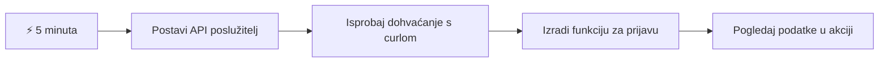
- **Minuta 1-2**: Pokrenite svoj API server (`cd api && npm start`) i testirajte vezu
- **Minuta 3**: Napravite osnovnu funkciju `getAccount()` koristeći fetch
- **Minuta 4**: Povežite login formu s `action="javascript:login()"`
- **Minuta 5**: Testirajte login i pratite pojavu podataka o računu u konzoli

**Brze testne naredbe**:
```bash
# Provjerite radi li API
curl http://localhost:5000/api

# Testirajte dohvaćanje podataka računa
curl http://localhost:5000/api/accounts/test
```

**Zašto je ovo važno**: U 5 minuta vidjet ćete magiju asinkronog dohvaćanja podataka koja pokreće svaku modernu web aplikaciju. Ovo je temelj koji aplikacijama daje osjećaj odzivnosti i živosti.

## 🗺️ Vaše putovanje kroz podatkovno vođene web aplikacije

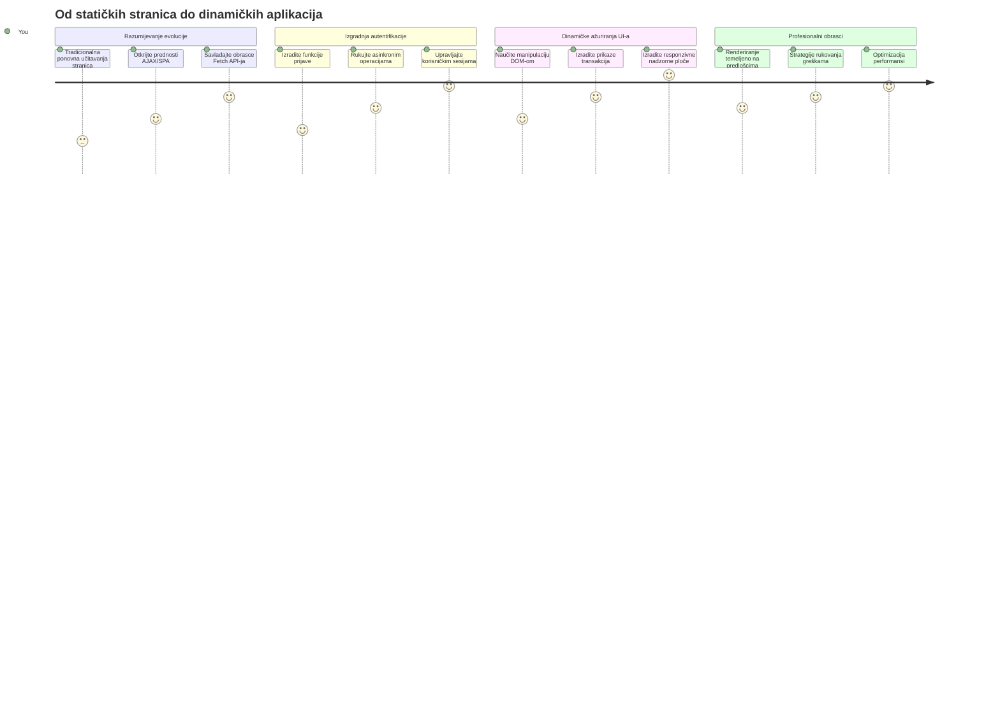
**Cilj vašeg putovanja**: Do kraja ove lekcije razumjet ćete kako moderne web aplikacije dohvaćaju, obrađuju i prikazuju podatke dinamički, stvarajući besprijekorna korisnička iskustva koja očekujemo od profesionalnih aplikacija.

## Predpredavanje Kviza

[Pre-lecture quiz](https://ff-quizzes.netlify.app/web/quiz/45)

### Preduvjeti

Prije nego što zaronite u dohvaćanje podataka, osigurajte da imate spremne ove komponente:

- **Prethodna lekcija**: Završite [Login i registracijski obrazac](../2-forms/README.md) - na tome ćemo graditi
- **Lokalni server**: Instalirajte [Node.js](https://nodejs.org) i [pokrenite API server](../api/README.md) za pružanje podataka o računu
- **API veza**: Testirajte vezu sa serverom ovom naredbom:

```bash
curl http://localhost:5000/api
# Očekivani odgovor: "Bank API v1.0.0"
```

Ovaj brzi test osigurava da svi dijelovi ispravno komuniciraju:
- Provjerava radi li Node.js ispravno na vašem sustavu
- Potvrđuje da je vaš API server aktivan i odgovara
- Validira da vaša aplikacija može doći do servera (kao provjera radio veze prije misije)

## 🧠 Pregled ekosustava za upravljanje podacima

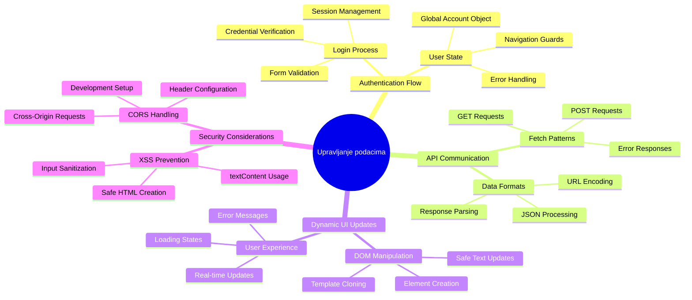
**Osnovni princip**: Moderne web aplikacije su sustavi za orkestraciju podataka - koordiniraju između korisničkih sučelja, API servera i sigurnosnih modela preglednika kako bi stvorile besprijekorna, responzivna iskustva.

---

## Razumijevanje dohvaćanja podataka u modernim web aplikacijama

Način na koji web aplikacije rukuju podacima dramatično se razvio tijekom posljednja dva desetljeća. Razumijevanje te evolucije pomoći će vam shvatiti zašto su moderne tehnike poput AJAX-a i Fetch API-ja toliko moćne i zašto su postale ključni alati web programera.

Istražimo kako su tradicionalne web-stranice funkcionirale u odnosu na dinamične, responzivne aplikacije koje danas gradimo.

### Tradicionalne više-stranične aplikacije (MPA)

U ranim danima weba, svaki klik bio je poput promjene kanala na starom televizoru - zaslon bi potamnio, zatim se polako napunio novim sadržajem. Tako je bilo u ranim web aplikacijama, gdje je svaka interakcija značila potpuno ponovno građenje cijele stranice ispočetka.

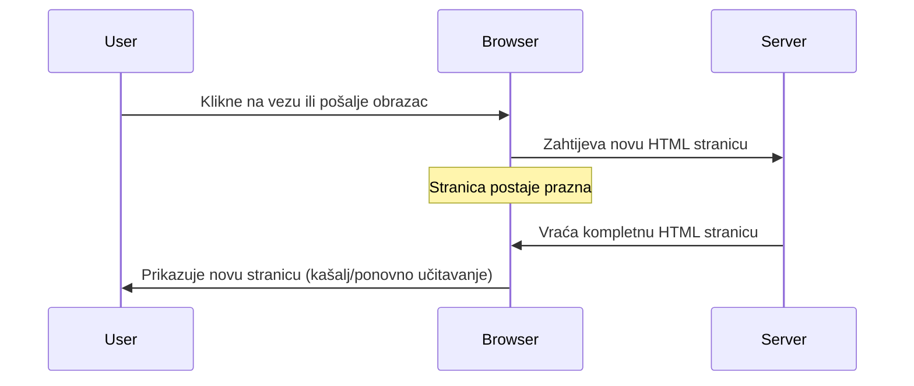
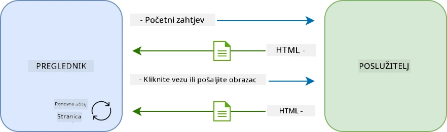

**Zašto je taj pristup djelovao nezgrapno:**
- Svaki klik značio je potpuno ponovno građenje stranice od nule
- Korisnici su bili prekidani usred misli onim dosadnim bljeskovima stranice
- Vaša internetska veza je prekomjerno preuzimala isti zaglavlje i podnožje više puta
- Aplikacije su više djelovale kao klikanje kroz arhivski ormar nego korištenje softvera

### Moderne jedno-stranične aplikacije (SPA)

AJAX (Asinhroni JavaScript i XML) potpuno je promijenio ovaj paradigmu. Kao modularni dizajn Međunarodne svemirske postaje, gdje astronauti mogu zamijeniti pojedine dijelove bez hitnog rekonstrukcije sustava, AJAX omogućuje da ažuriramo specifične dijelove web stranice bez ponovnog učitavanja svega. Iako naziv spominje XML, danas najviše koristimo JSON, ali osnovni princip ostaje isti: mijenjamo samo ono što treba.

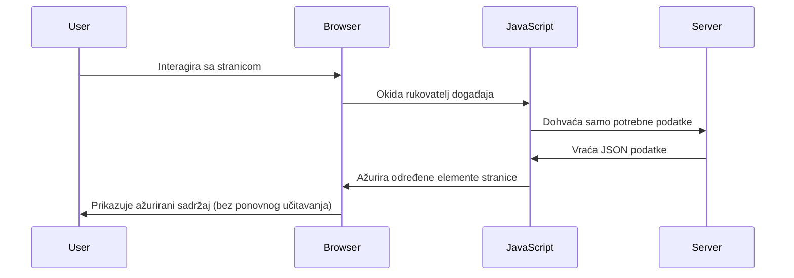
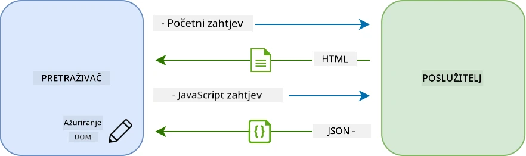

**Zašto SPA aplikacije djeluju puno bolje:**
- Ažuriraju samo dijelove koji su stvarno promijenjeni (pametno, zar ne?)
- Nema više bolnih prekida - korisnici ostaju u svom tijeku rada
- Manje podataka putuje mrežom, što znači brže učitavanje
- Sve djeluje brzo i responzivno, kao aplikacije na vašem telefonu

### Evolucija do modernog Fetch API-ja

Moderni preglednici pružaju [`Fetch` API](https://developer.mozilla.org/docs/Web/API/Fetch_API), koji zamjenjuje stariji [`XMLHttpRequest`](https://developer.mozilla.org/docs/Web/API/XMLHttpRequest/Using_XMLHttpRequest). Kao razlika između rada s telegrafom i korištenja elektroničke pošte, Fetch API koristi promiseove za čišći asinhroni kod i prirodno rukuje JSON-om.

| Značajka | XMLHttpRequest | Fetch API |
|---------|----------------|----------|
| **Sintaksa** | Složene povratne funkcije | Čist kod baziran na promisevima |
| **Rukovanje JSON-om** | Ručna obrada potrebna | Ugrađena `.json()` metoda |
| **Rukovanje greškama** | Ograničene informacije | Sveobuhvatni detalji o pogreškama |
| **Moderna podrška** | Kompatibilnost sa starijim verzijama | ES6+ promise i async/await |

> 💡 **Kompatibilnost preglednika**: Dobre vijesti - Fetch API radi u svim modernim preglednicima! Ako vas zanimaju specifične verzije, [caniuse.com](https://caniuse.com/fetch) ima kompletnu priču o kompatibilnosti.
> 
**Zaključak:**
- Odlično radi u Chromeu, Firefoxu, Safariu i Edgeu (prakticno svugdje gdje su vaši korisnici)
- Samo Internet Explorer treba dodatnu pomoć (i iskreno, vrijeme je da ga pustimo)
- Savršeno vas priprema za elegantne async/await obrasce koje ćemo koristiti kasnije

### Implementacija korisničkog prijavljivanja i dohvaćanja podataka

Sad ćemo implementirati sustav za prijavu koji vašu bankarsku aplikaciju pretvara iz statičnog prikaza u funkcionalnu aplikaciju. Kao autentični protokoli u sigurnim vojnim objektima, provjerit ćemo korisničke vjerodajnice i zatim pružiti pristup njihovim specifičnim podacima.

Gradit ćemo to inkrementalno, počevši s osnovnim ovjeravanjem, a zatim dodajući mogućnosti dohvaćanja podataka.

#### Korak 1: Izradite osnovu funkcije login

Otvorite svoj `app.js` fajl i dodajte novu funkciju `login`. Ova će upravljati procesom autentifikacije korisnika:

```javascript
async function login() {
  const loginForm = document.getElementById('loginForm');
  const user = loginForm.user.value;
}
```

**Objasnimo ovo:**
- Ta `async` riječ? Govori JavaScriptu "hej, ova funkcija možda će morati pričekati nešto"
- Hvatamo naš obrazac s stranice (nema ništa posebno, samo ga pronalazimo po njegovom ID-u)
- Izvlačimo što god je korisnik upisao kao korisničko ime
- Evo zgodnog trika: možete pristupiti bilo kojem elementu forme po njegovom `name` atributu - nema potrebe za dodatnim pozivima getElementById!

> 💡 **Obrazac pristupa**: Svakom kontrolnom elementu obrasca može se pristupiti po imenu (postavljeno u HTML-u koristeći atribut `name`) kao svojstvu forme. Ovo pruža čist i čitljiv način dohvaćanja podataka iz forme.

#### Korak 2: Izradite funkciju za dohvaćanje podataka o računu

Zatim ćemo napraviti posebnu funkciju za dohvaćanje podataka o računu sa servera. Ovo slijedi isti obrazac kao i vaša funkcija registracije, ali fokusira se na dohvaćanje podataka:

```javascript
async function getAccount(user) {
  try {
    const response = await fetch('//localhost:5000/api/accounts/' + encodeURIComponent(user));
    return await response.json();
  } catch (error) {
    return { error: error.message || 'Unknown error' };
  }
}
```

**Evo što ovaj kod radi:**
- **Koristi** moderni `fetch` API za asinhroni zahtjev podataka
- **Gradi** URL za GET zahtjev s parametrima korisničkog imena
- **Primjenjuje** `encodeURIComponent()` za sigurno rukovanje posebnim znakovima u URL-ovima
- **Pretvara** odgovor u JSON za jednostavnu obradu podataka
- **Rukuje** greškama na elegantan način vraćajući objekt s greškom umjesto pada

> ⚠️ **Sigurnosna napomena**: Funkcija `encodeURIComponent()` rukuje posebnim znakovima u URL-ovima. Kao kodovi u pomorskoj komunikaciji, osigurava da vaša poruka stigne točno onako kako treba, sprečavajući da znakovi poput "#" ili "&" budu pogrešno protumačeni.
> 
**Zašto je ovo važno:**
- Sprečava da posebni znakovi slome URL
- Štiti od napada manipulacije URL-om
- Osigurava da server dobije točne podatke
- Prati sigurne prakse kodiranja

#### Razumijevanje HTTP GET zahtjeva

Evo nečega što bi vas moglo iznenaditi: kada koristite `fetch` bez dodatnih opcija, on automatski stvara [`GET`](https://developer.mozilla.org/docs/Web/HTTP/Methods/GET) zahtjev. To je savršeno za ono što radimo - pitamo server "hej, mogu li vidjeti podatke ovog korisničkog računa?"

Razmislite o GET zahtjevima kao ljubaznom traženju posudbe knjige u knjižnici - tražite nešto što već postoji. POST zahtjevi (koje smo koristili za registraciju) su poput slanja nove knjige da se doda u zbirku.

| GET Zahtjev | POST Zahtjev |
|-------------|--------------|
| **Svrha** | Dohvaćanje postojećih podataka | Slanje novih podataka serveru |
| **Parametri** | U URL putanji/upitu | U tijelu zahtjeva |
| **Keširanje** | Može biti keširano od strane preglednika | Obično se ne kešira |
| **Sigurnost** | Vidljivo u URL-u/zapisima | Sakriveno u tijelu zahtjeva |

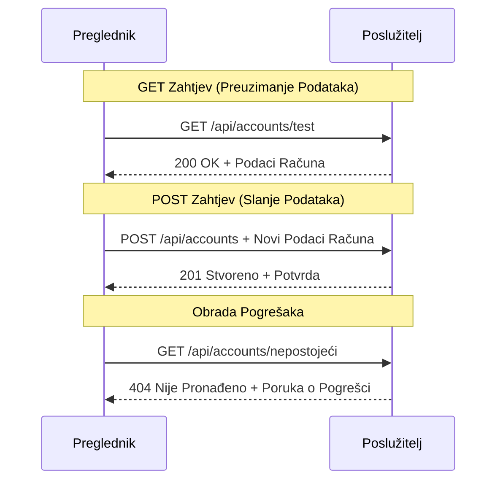
#### Korak 3: Sve povezujemo zajedno

Sad onaj zadovoljavajući dio - povežimo vašu funkciju dohvaćanja računa s procesom prijave. Ovo je trenutak gdje sve dolazi na svoje mjesto:

```javascript
async function login() {
  const loginForm = document.getElementById('loginForm');
  const user = loginForm.user.value;
  const data = await getAccount(user);

  if (data.error) {
    return console.log('loginError', data.error);
  }

  account = data;
  navigate('/dashboard');
}
```

Ova funkcija slijedi jasan slijed:
- Izvlači korisničko ime iz obrasca
- Traži podatke korisničkog računa sa servera
- Rukuje bilo kakvim greškama tijekom procesa
- Spremi podatke računa i preusmjeri na nadzornu ploču ako je uspješno

> 🎯 **Async/Await obrazac**: Budući da je `getAccount` asinhrona funkcija, koristimo ključnu riječ `await` da pauziramo izvršenje dok server ne odgovori. Time sprječavamo da kod nastavi raditi s nepoznatim podacima.

#### Korak 4: Stvaranje mjesta za vaše podatke

Vašoj aplikaciji treba mjesto za pamćenje podataka o računu nakon što su učitani. Pomislite na to kao kratkoročnu memoriju vaše aplikacije - mjesto za pohranu podataka trenutnog korisnika pod rukom. Dodajte ovaj redak na vrh datoteke `app.js`:

```javascript
// Ovo sadrži podatke trenutnog korisničkog računa
let account = null;
```

**Zašto nam treba ovo:**
- Čuva dostupne podatke o računu s bilo kojeg mjesta u aplikaciji
- Početna vrijednost `null` znači "nitko još nije prijavljen"
- Ažurira se kad se netko uspješno prijavi ili registrira
- Djeluje kao jedini izvor istine - nema zbunjenosti tko je prijavljen

#### Korak 5: Povežite vaš obrazac

Sada povežimo vašu novu login funkciju s HTML formom. Ažurirajte svoj tag forme ovako:

```html
<form id="loginForm" action="javascript:login()">
  <!-- Your existing form inputs -->
</form>
```

**Što ova mala promjena radi:**
- Sprječava da forma radi svoju zadanu akciju "ponovno učitavanje cijele stranice"
- Poziva vašu prilagođenu JavaScript funkciju umjesto toga
- Održava sve glatkim i slično SPA aplikacijama
- Daje vam potpunu kontrolu nad onim što se događa kad korisnici kliknu "Login"

#### Korak 6: Poboljšajte funkciju registracije

Radi dosljednosti, ažurirajte vašu funkciju `register` da također sprema podatke o računu i preusmjerava na nadzornu ploču:

```javascript
// Dodajte ove retke na kraj vaše funkcije register
account = result;
navigate('/dashboard');
```

**Ovo poboljšanje pruža:**
- **Neprekidan** prijelaz od registracije do nadzorne ploče
- **Dosljedan** korisnički dojam između prijave i registracije
- **Trenutni** pristup podacima računa nakon uspješne registracije

#### Testiranje vaše implementacije

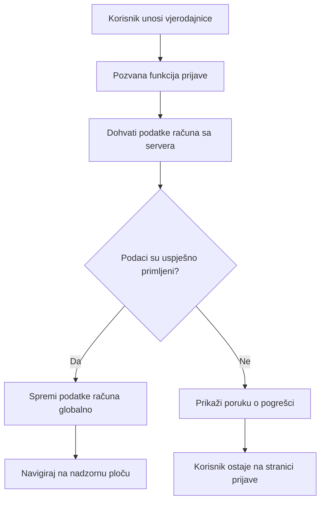
**Vrijeme je za testiranje:**
1. Kreirajte novi račun da se uvjerite da sve radi
2. Pokušajte se prijaviti s istim vjerodajnicama
3. Pogledajte konzolu preglednika (F12) ako nešto izgleda čudno
4. Provjerite da li ste preusmjereni na nadzornu ploču nakon uspješne prijave

Ako nešto ne radi, ne paničarite! Većina problema su male greške poput tipfelera ili zaborava pokretanja API servera.

#### Kratka riječ o magiji Cross-Origin

Možda se pitate: "Kako moja web aplikacija komunicira s ovim API serverom ako rade na različitim portovima?" Odlično pitanje! Ovo je nešto što svaki web developer prije ili kasnije susretne.

> 🔒 **Cross-Origin sigurnost**: Preglednici primjenjuju "pravilo iste domene" da spriječe neovlaštenu komunikaciju između različitih domena. Kao kontrolni punkt u Pentagonskoj zgradi, oni provjeravaju je li komunikacija odobrena prije omogućavanja prijenosa podataka.
> 
**U našem slučaju:**
- Vaša web aplikacija radi na `localhost:3000` (razvojni server)
- Vaš API server radi na `localhost:5000` (backend server)
- API server uključuje [CORS zaglavlja](https://developer.mozilla.org/docs/Web/HTTP/CORS) koja izričito dopuštaju komunikaciju s vaše web aplikacije

Ovo je česta konfiguracija u razvoju gdje frontend i backend obično rade na različitim serverima.

> 📚 **Saznajte više**: Dublje istražite API-je i dohvaćanje podataka u ovom opsežnom [Microsoft Learn modulu o API-jima](https://docs.microsoft.com/learn/modules/use-apis-discover-museum-art/?WT.mc_id=academic-77807-sagibbon).

## Oživljavanje vaših podataka u HTML-u

Sad ćemo učiniti dohvaćene podatke vidljivima korisnicima kroz manipulaciju DOM-om. Kao proces razvijanja fotografija u mračnoj komori, uzimamo nevidljive podatke i prikazujemo ih u nečemu što korisnici mogu vidjeti i s čim mogu komunicirati.
Manipulacija DOM-om je tehnika koja pretvara statične web stranice u dinamičke aplikacije koje ažuriraju svoj sadržaj na temelju korisničkih interakcija i odgovora poslužitelja.

### Odabir Pravog Alata za Posao

Kad je riječ o ažuriranju vašeg HTML-a s JavaScriptom, imate nekoliko opcija. Zamislite ih kao različite alate u kutiji s alatima - svaki savršen za određene zadatke:

| Metoda | Za što je izvrsna | Kada je koristiti | Razina sigurnosti |
|--------|-------------------|------------------|-------------------|
| `textContent` | Sigurno prikazivanje korisničkih podataka | Kad god prikazujete tekst | ✅ Čvrsto kao stijena |
| `createElement()` + `append()` | Izrada složenih rasporeda | Kreiranje novih sekcija/lista | ✅ Neprobojno |
| `innerHTML` | Postavljanje HTML sadržaja | ⚠️ Pokušajte ovo izbjegavati | ❌ Rizično poslovanje |

#### Siguran Način za Prikaz Teksta: textContent

Svojstvo [`textContent`](https://developer.mozilla.org/docs/Web/API/Node/textContent) je vaš najbolji prijatelj kad prikazujete korisničke podatke. Kao da imate portira na svojoj web stranici - ništa štetno ne prolazi:

```javascript
// Siguran, pouzdan način za ažuriranje teksta
const balanceElement = document.getElementById('balance');
balanceElement.textContent = account.balance;
```

**Prednosti textContent:**
- Sve tretira kao običan tekst (sprječava izvršavanje skripti)
- Automatski briše postojeći sadržaj
- Učinkovit za jednostavna ažuriranja teksta
- Pruža ugrađenu sigurnost protiv zlonamjernog sadržaja

#### Izrada Dinamičkih HTML Elemenata

Za složeniji sadržaj, kombinirajte [`document.createElement()`](https://developer.mozilla.org/docs/Web/API/Document/createElement) s metodom [`append()`](https://developer.mozilla.org/docs/Web/API/ParentNode/append):

```javascript
// Siguran način za stvaranje novih elemenata
const transactionItem = document.createElement('div');
transactionItem.className = 'transaction-item';
transactionItem.textContent = `${transaction.date}: ${transaction.description}`;
container.append(transactionItem);
```

**Razumijevanje ovog pristupa:**
- **Stvara** nove DOM elemente programatski
- **Održava** punu kontrolu nad atributima i sadržajem elemenata
- **Omogućuje** složene, ugniježdene strukture elemenata
- **Čuva** sigurnost odvajanjem strukture od sadržaja

> ⚠️ **Sigurnosna Napomena**: Iako se [`innerHTML`](https://developer.mozilla.org/docs/Web/API/Element/innerHTML) često pojavljuje u tutorijalima, može izvršavati ugrađene skripte. Kao što sigurnosni protokoli u CERN-u sprječavaju neovlašteno izvršavanje koda, korištenje `textContent` i `createElement` nudi sigurnije alternative.
> 
**Rizici innerHTML:**
- Izvršava sve `<script>` oznake u korisničkim podacima
- Podložan napadima injektiranja koda
- Stvara potencijalne sigurnosne propuste
- Sigurnije alternative koje koristimo daju ekvivalentnu funkcionalnost

### Pravljenje Prijateljskih Poruka o Pogreškama

Trenutno se pogreške kod prijave prikazuju samo u preglednikovoj konzoli, što je korisnicima nevidljivo. Kao razlika između pilotske interne dijagnostike i sustava za informacije putnicima, moramo komunicirati važne informacije kroz odgovarajući kanal.

Implementacija vidljivih poruka o pogreškama omogućuje korisnicima odmah povratnu informaciju o tome što je pošlo po zlu i kako nastaviti.

#### Korak 1: Dodajte Mjesto za Poruke o Pogreškama

Prvo, dajmo porukama o pogreškama mjesto u vašem HTML-u. Dodajte ovo točno prije gumba za prijavu kako bi korisnici prirodno to vidjeli:

```html
<!-- This is where error messages will appear -->
<div id="loginError" role="alert"></div>
<button>Login</button>
```

**Što se ovdje događa:**
- Kreiramo prazan kontejner koji ostaje nevidljiv dok nije potreban
- Pozicioniran je tamo gdje korisnici prirodno pogledaju nakon klika na "Prijava"
- Taj `role="alert"` je odlična stvar za čitače ekrana - govori asistivnoj tehnologiji "hej, ovo je važno!"
- Jedinstveni `id` daje JavaScriptu jednostavan cilj

#### Korak 2: Napravite Pomoćnu Funkciju

Neka napravimo malu pomoćnu funkciju koja može ažurirati bilo koji tekst u elementu. Ovo je jedna od onih "napiši jednom, koristi svugdje" funkcija koje će vam uštedjeti vrijeme:

```javascript
function updateElement(id, text) {
  const element = document.getElementById(id);
  element.textContent = text;
}
```

**Prednosti funkcije:**
- Jednostavno sučelje koje zahtjeva samo ID elementa i tekst
- Sigurno pronalazi i ažurira DOM elemente
- Reupotrebljiv obrazac koji smanjuje dupliciranje koda
- Održava dosljedno ponašanje ažuriranja kroz aplikaciju

#### Korak 3: Prikažite Pogreške Gdje ih Korisnici Mogu Vidjeti

Sada zamijenimo skrivenu poruku u konzoli s nečim što korisnici zaista mogu vidjeti. Ažurirajte vašu funkciju prijave:

```javascript
// Umjesto samo zapisivanja u konzolu, pokažite korisniku što nije u redu
if (data.error) {
  return updateElement('loginError', data.error);
}
```

**Ova mala promjena donosi veliku razliku:**
- Poruke o pogreškama pojavljuju se točno tamo gdje korisnici gledaju
- Nema više misterioznih tihih neuspjeha
- Korisnici dobivaju trenutnu, korisnu povratnu informaciju
- Vaša aplikacija počinje djelovati profesionalno i promišljeno

Sada, kad testirate s nevažećim računom, vidjet ćete korisnu poruku o pogrešci direktno na stranici!


#### Korak 4: Biti Uključiv s Pristupačnošću

Evo nešto kul o tom `role="alert"` koji smo ranije dodali - nije samo dekoracija! Ovaj mali atribut stvara ono što se zove [Živa Regija (Live Region)](https://developer.mozilla.org/docs/Web/Accessibility/ARIA/ARI_Live_Regions) koja odmah objavljuje promjene čitačima ekrana:

```html
<div id="loginError" role="alert"></div>
```

**Zašto je ovo važno:**
- Korisnici čitača ekrana čuju poruku o pogrešci čim se pojavi
- Svi dobivaju iste važne informacije, bez obzira na način navigacije
- Jednostavan način da vaša aplikacija radi za više ljudi
- Pokazuje da vam je stalo do stvaranja uključivog iskustva

Male sitnice poput ove razdvajaju dobre programere od izvrsnih!

### 🎯 Pedagoška Provjera: Obrasci Autentikacije

**Stani i Promisli**: Upravo ste implementirali kompletan tijek autentikacije. Ovo je osnovni obrazac u web razvoju.

**Brza Samoprocjena**:
- Možete li objasniti zašto koristimo async/await za pozive API-ja?
- Što bi se dogodilo da zaboravimo funkciju `encodeURIComponent()`?
- Kako naše rukovanje pogreškama poboljšava korisničko iskustvo?

**Poveznica s Praktikom**: Obrasci koje ste ovdje naučili (asinkrono dohvaćanje podataka, rukovanje pogreškama, korisnička povratna informacija) koriste se u svakoj većoj web aplikaciji od društvenih mreža do e-trgovina. Gradite vještine spremne za proizvodnju!

**Izazovno Pitanje**: Kako biste mogli modificirati ovaj sustav autentikacije da podrži više korisničkih uloga (kupac, administrator, blagajnik)? Razmislite o strukturi podataka i potrebnim promjenama u korisničkom sučelju.

#### Korak 5: Primijenite Isti Obrazac na Registraciju

Za konzistentnost, implementirajte identično rukovanje pogreškama u formi za registraciju:

1. **Dodajte** element za prikaz pogrešaka u vaš registracijski HTML:
```html
<div id="registerError" role="alert"></div>
```

2. **Ažurirajte** vašu funkciju registracije da koristi isti obrazac prikaza pogrešaka:
```javascript
if (data.error) {
  return updateElement('registerError', data.error);
}
```

**Prednosti konzistentnog rukovanja pogreškama:**
- **Osigurava** ujednačeno korisničko iskustvo kroz sve forme
- **Smanjuje** kognitivno opterećenje korištenjem poznatih obrazaca
- **Pojednostavljuje** održavanje s reupotrebljivim kodom
- **Jamči** da se standardi pristupačnosti poštuju u cijeloj aplikaciji

## Izrada Vaše Dinamične Kontrolne Ploče

Sada ćemo vaš statični dashboard transformirati u dinamičko sučelje koje prikazuje stvarne podatke računa. Kao razlika između tiskanog rasporeda leta i živih tablo na aerodromima, prelazimo sa statičnih informacija na prikaze u stvarnom vremenu.

Koristeći tehnike manipulacije DOM-om koje ste naučili, izradit ćemo dashboard koji se automatski ažurira sa trenutnim informacijama o računu.

### Upoznavanje s Vašim Podacima

Prije nego što počnemo graditi, zavirimo kakve podatke vaš poslužitelj vraća. Kad se netko uspješno prijavi, evo kakvo blago informacija dobijete:

```json
{
  "user": "test",
  "currency": "$",
  "description": "Test account",
  "balance": 75,
  "transactions": [
    { "id": "1", "date": "2020-10-01", "object": "Pocket money", "amount": 50 },
    { "id": "2", "date": "2020-10-03", "object": "Book", "amount": -10 },
    { "id": "3", "date": "2020-10-04", "object": "Sandwich", "amount": -5 }
  ]
}
```

**Ova struktura podataka pruža:**
- **`user`**: Savršeno za personaliziranje iskustva ("Dobro došla nazad, Sarah!")
- **`currency`**: Osigurava ispravan prikaz novčanih iznosa
- **`description`**: Prijateljski naziv računa
- **`balance`**: Vrlo važan trenutačni saldo
- **`transactions`**: Cjelovitu povijest transakcija sa svim detaljima

Sve što vam treba da izgradite profesionalan bankarski dashboard!

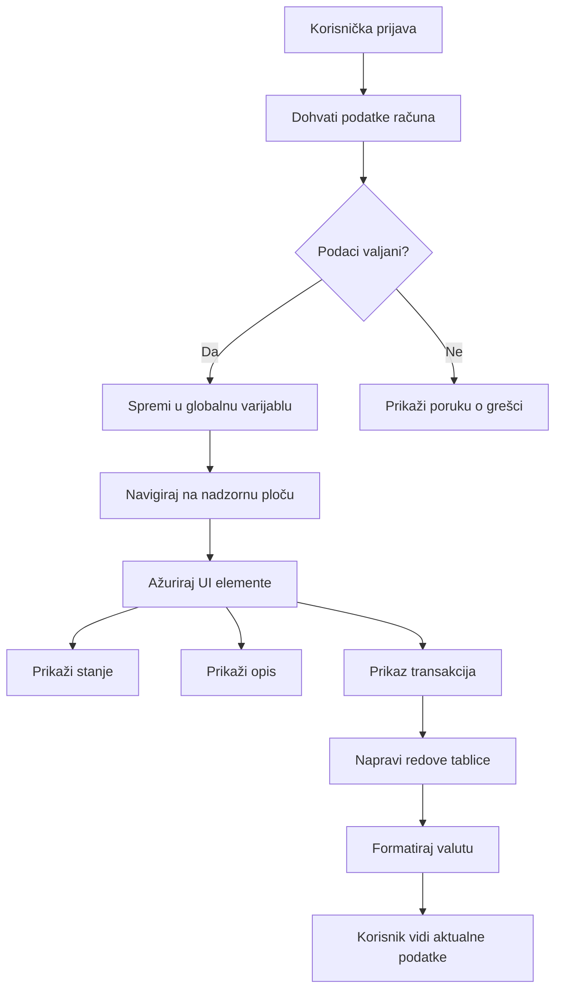
> 💡 **Savjet za Profesionalce**: Želite odmah vidjeti vaš dashboard u akciji? Koristite korisničko ime `test` kada se prijavljujete - već dolazi s unaprijed učitanim primjerima podataka pa možete odmah vidjeti sve bez potrebe da prvo kreirate transakcije.
> 
**Zašto je testni račun koristan:**
- Dolazi s realističnim primjerima podataka već učitanim
- Savršen je za gledanje kako se transakcije prikazuju
- Odličan za testiranje značajki vašeg dashboarda
- Štedi vam trud ručnog unosa lažnih podataka

### Izrada Elemenata za Prikaz Dashboarda

Gradimo sučelje vaše kontrolne ploče korak po korak, počevši sa sažetkom računa, a zatim prelazimo na složenije značajke poput lista transakcija.

#### Korak 1: Ažurirajte Vašu HTML Strukturu

Prvo, zamijenite statičan odjeljak "Saldo" dinamičnim placeholder elementima koje vaš JavaScript može popuniti:

```html
<section>
  Balance: <span id="balance"></span><span id="currency"></span>
</section>
```

Zatim dodajte sekciju za opis računa. Budući da ovo djeluje kao naslov za sadržaj dashboarda, koristite semantički HTML:

```html
<h2 id="description"></h2>
```

**Razumijevanje HTML strukture:**
- **Koristi** zasebne `<span>` elemente za saldo i valutu radi pojedinačne kontrole
- **Primjenjuje** jedinstvene ID-jeve na svaki element za ciljanje iz JavaScripta
- **Prati** semantički HTML koristeći `<h2>` za opis računa
- **Stvara** logičku hijerarhiju za čitače ekrana i SEO

> ✅ **Pristupačnost na Umu**: Opis računa funkcionira kao naslov za sadržaj dashboarda, stoga je označen semantički kao zaglavlje. Više o utjecaju [strukture zaglavlja](https://www.nomensa.com/blog/2017/how-structure-headings-web-accessibility) na pristupačnost. Možete li identificirati druge elemente na svojoj stranici koji bi mogli imati koristi od zaglavlja?

#### Korak 2: Napravite Funkciju za Ažuriranje Dashboarda

Sada napravite funkciju koja ispunjava dashboard stvarnim podacima računa:

```javascript
function updateDashboard() {
  if (!account) {
    return navigate('/login');
  }

  updateElement('description', account.description);
  updateElement('balance', account.balance.toFixed(2));
  updateElement('currency', account.currency);
}
```

**Korak po korak, evo što ova funkcija radi:**
- **Provjerava** da li podaci o računu postoje prije nastavka
- **Preusmjerava** neautentificirane korisnike natrag na stranicu prijave
- **Ažurira** opis računa koristeći ponovo upotrebljivu funkciju `updateElement`
- **Formatira** saldo da uvijek prikazuje dvije decimale
- **Prikazuje** odgovarajući simbol valute

> 💰 **Formatiranje Novca**: Ta metoda [`toFixed(2)`](https://developer.mozilla.org/docs/Web/JavaScript/Reference/Global_Objects/Number/toFixed) je spasitelj! Osigurava da vaš saldo uvijek izgleda kao pravi novac - "75.00" umjesto samo "75". Vaši korisnici će cijeniti poznati prikaz valute.

#### Korak 3: Osigurajte Da Se Vaš Dashboard Ažurira

Kako bismo bili sigurni da se vaš dashboard osvježava s trenutnim podacima svaki put kad netko posjeti, trebamo se uhvatiti vašeg navigacijskog sustava. Ako ste odradili [zadanu vježbu iz lekcije 1](../1-template-route/assignment.md), ovo bi vam trebalo biti poznato. Ako ne, ne brinite - evo što vam treba:

Dodajte ovo na kraj vaše funkcije `updateRoute()`:

```javascript
if (typeof route.init === 'function') {
  route.init();
}
```

Zatim ažurirajte vaše rute da uključe inicijalizaciju dashboarda:

```javascript
const routes = {
  '/login': { templateId: 'login' },
  '/dashboard': { templateId: 'dashboard', init: updateDashboard }
};
```

**Što ova pametna postavka radi:**
- Provjerava ako ruta ima poseban inicijalizacijski kod
- Automatski pokreće taj kod kad se ruta učita
- Osigurava da vaš dashboard uvijek prikazuje svježe, aktualne podatke
- Drži vašu logiku rutanja čistom i organiziranom

#### Testiranje Vašeg Dashboarda

Nakon implementacije ovih promjena, testirajte vaš dashboard:

1. **Prijavite se** s testnim računom
2. **Provjerite** jeste li preusmjereni na dashboard
3. **Pogledajte** jesu li opis računa, saldo i valuta ispravno prikazani
4. **Pokušajte se odjaviti i ponovo prijaviti** kako biste bili sigurni da se podaci pravilno osvježavaju

Vaš dashboard sada treba prikazivati dinamične podatke računa koji se ažuriraju na temelju podataka prijavljenog korisnika!

## Izrada Pametnih Lista Transakcija pomoću Predložaka

Umjesto da ručno kreiramo HTML za svaku transakciju, koristit ćemo predloške za automatsko generiranje ujednačenog formata. Kao standardizirani dijelovi u proizvodnji svemirskih letjelica, predlošci osiguravaju da svaki redak transakcije slijedi istu strukturu i izgled.

Ova tehnika učinkovito skalira od nekoliko transakcija do tisuća, održavajući dosljedne performanse i prezentaciju.

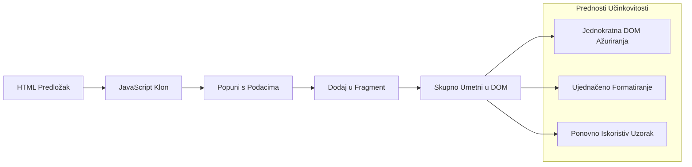
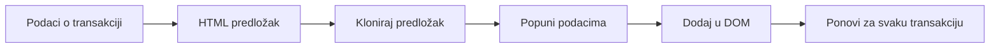
### Korak 1: Kreirajte Predložak za Transakciju

Prvo, dodajte reupotrebljivi predložak za retke transakcija unutar vašeg `<body>` HTML-a:

```html
<template id="transaction">
  <tr>
    <td></td>
    <td></td>
    <td></td>
  </tr>
</template>
```

**Razumijevanje HTML predložaka:**
- **Definira** strukturu za jedan redak tablice
- **Ostaje** nevidljiv dok se ne klonira i ne popuni JavaScriptom
- **Uključuje** tri ćelije za datum, opis i iznos
- **Pruža** reupotrebljiv obrazac za dosljedan format

### Korak 2: Pripremite Tablicu za Dinamički Sadržaj

Zatim, dodajte `id` vašem tijelu tablice kako bi JavaScript mogao lako ciljati:

```html
<tbody id="transactions"></tbody>
```

**Što ovo omogućuje:**
- **Stvara** jasan cilj za umetanje redaka transakcija
- **Odvaja** strukturu tablice od dinamičkog sadržaja
- **Omogućuje** jednostavno brisanje i ponovno punjenje podataka transakcija

### Korak 3: Izgradite Tvornicu Redaka Transakcija

Sada napravite funkciju koja pretvara podatke transakcija u HTML elemente:

```javascript
function createTransactionRow(transaction) {
  const template = document.getElementById('transaction');
  const transactionRow = template.content.cloneNode(true);
  const tr = transactionRow.querySelector('tr');
  tr.children[0].textContent = transaction.date;
  tr.children[1].textContent = transaction.object;
  tr.children[2].textContent = transaction.amount.toFixed(2);
  return transactionRow;
}
```

**Raskrinkavanje ove tvornice funkcija:**
- **Dohvaća** element predloška po njegovom ID-ju
- **Klonira** sadržaj predloška za sigurnu manipulaciju
- **Odabire** red tablice unutar kloniranog sadržaja
- **Popunjava** svaku ćeliju podacima transakcije
- **Formatira** iznos da pokaže ispravne decimale
- **Vraća** kompletan red spreman za umetanje

### Korak 4: Učinkovito Generirajte Više Redova Transakcija

Dodajte ovaj kod u vašu funkciju `updateDashboard()` za prikaz svih transakcija:

```javascript
const transactionsRows = document.createDocumentFragment();
for (const transaction of account.transactions) {
  const transactionRow = createTransactionRow(transaction);
  transactionsRows.appendChild(transactionRow);
}
updateElement('transactions', transactionsRows);
```

**Razumijevanje ovoga učinkovitog pristupa:**
- **Stvara** fragment dokumenta za grupiranje DOM operacija
- **Iterira** kroz sve transakcije u podacima računa
- **Generira** redak za svaku transakciju pomoću tvornice funkcija
- **Prikuplja** sve retke u fragment prije dodavanja u DOM
- **Izvršava** jedno ažuriranje DOM-a umjesto više pojedinačnih umetanja
> ⚡ **Optimizacija performansi**: [`document.createDocumentFragment()`](https://developer.mozilla.org/docs/Web/API/Document/createDocumentFragment) radi poput procesa sklapanja u Boeingu – komponente se pripremaju izvan glavne linije, a zatim se instaliraju kao cjelovita jedinica. Ovaj pristup grupiranju minimizira ponovne izračune DOM-a izvođenjem jedinstvene umetnute radnje umjesto više pojedinačnih operacija.

### Korak 5: Poboljšajte funkciju ažuriranja za mješoviti sadržaj

Vaša funkcija `updateElement()` trenutno obrađuje samo tekstualni sadržaj. Ažurirajte je da radi i s tekstom i s DOM čvorovima:

```javascript
function updateElement(id, textOrNode) {
  const element = document.getElementById(id);
  element.textContent = ''; // Removes all children
  element.append(textOrNode);
}
```

**Ključna poboljšanja u ovom ažuriranju:**
- **Briše** postojeći sadržaj prije dodavanja novog sadržaja
- **Prihvaća** ili tekstualne nizove ili DOM čvorove kao parametre
- **Koristi** metodu [`append()`](https://developer.mozilla.org/docs/Web/API/ParentNode/append) za veću fleksibilnost
- **Održava** kompatibilnost unatrag s postojećim načinom rada temeljenim na tekstu

### Vozite svoj kontrolni panel na test

Vrijeme je za trenutak istine! Pogledajmo vaš dinamični kontrolni panel u akciji:

1. Prijavite se koristeći račun `test` (već sadrži primjerni sadržaj)
2. Navigirajte do svog kontrolnog panela
3. Provjerite pojavljuju li se redovi transakcija s ispravnim oblikovanjem
4. Provjerite jesu li datum, opisi i iznosi ispravno prikazani

Ako sve radi, trebali biste vidjeti potpuno funkcionalnu listu transakcija na svom kontrolnom panelu! 🎉

**Što ste postigli:**
- Izgradili ste kontrolni panel koji se prilagođava bilo kojoj količini podataka
- Kreirali ste ponovo upotrebljive predloške za dosljedno oblikovanje
- Proveli ste učinkovite tehnike manipulacije DOM-om
- Razvili ste funkcionalnost usporedivu s proizvodnim bankarskim aplikacijama

Uspješno ste transformirali statičnu web stranicu u dinamičku web aplikaciju.

### 🎯 Pedagoški pregled: Generiranje dinamičkog sadržaja

**Razumijevanje arhitekture**: Implementirali ste sofisticirani podatkovni tok prema korisničkom sučelju koji odražava obrasce korištene u okvirima poput React, Vue i Angular.

**Glavne usvojene koncepte**:
- **Renderiranje temeljeno na predlošcima**: Izrada ponovo upotrebljivih UI komponenti
- **Dokument fragmenti**: Optimizacija performansi DOM-a
- **Sigurna manipulacija DOM-om**: Sprječavanje sigurnosnih ranjivosti
- **Transformacija podataka**: Pretvaranje serverskih podataka u korisnička sučelja

**Industrijska povezanost**: Ove tehnike čine temelj modernih frontend okvira. Reactov virtualni DOM, Vue sustav predložaka i Angularova komponentna arhitektura svi se oslanjaju na ove osnovne koncepte.

**Pitanje za razmišljanje**: Kako biste proširili ovaj sustav da podrži ažuriranja u stvarnom vremenu (npr., da nove transakcije automatski budu vidljive)? Razmotrite WebSockets ili Server-Sent Events.

---

## 📈 Vaš vremenski tijek ovladavanja upravljanjem podacima

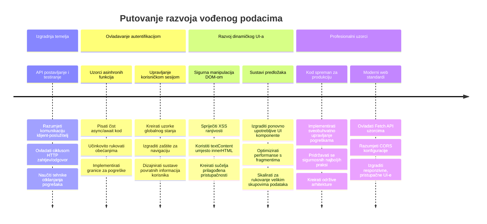
**🎓 Prekretnica diplomiranja**: Uspješno ste izgradili cjelovitu web aplikaciju vođenu podacima koristeći moderne JavaScript uzorke. Ove vještine direktno se prenose na rad s okvirima poput React, Vue ili Angular.

**🔄 Sposobnosti sljedeće razine**:
- Spremni za istraživanje frontend okvira koji nadograđuju ove koncepte
- Pripremljeni za implementaciju značajki u stvarnom vremenu s WebSockets
- Opremljeni za izgradnju progresivnih web aplikacija s offline mogućnostima
- Postavljeni temelji za učenje naprednih obrazaca upravljanja stanjem

## Izazov GitHub Copilot agenta 🚀

Upotrijebite način rada Agent za dovršetak sljedećeg izazova:

**Opis:** Poboljšajte bankarsku aplikaciju implementiranjem funkcije pretraživanja i filtriranja transakcija koja korisnicima omogućava pronalazak specifičnih transakcija prema rasponu datuma, iznosu ili opisu.

**Naredba:** Izradite funkcionalnost pretraživanja za bankarsku aplikaciju koja uključuje: 1) Obrazac za pretraživanje s poljima za unos raspona datuma (od/do), minimalnog/maksimalnog iznosa, i ključnih riječi u opisu transakcije, 2) Funkciju `filterTransactions()` koja filtrira niz account.transactions na temelju kriterija pretraživanja, 3) Ažurirajte funkciju `updateDashboard()` da prikazuje filtrirane rezultate, i 4) Dodajte gumb "Obriši filtre" za resetiranje prikaza. Koristite moderne JavaScript metode nizova poput `filter()` i obradite rubne slučajeve za prazne kriterije pretraživanja.

Saznajte više o [načinu rada agente](https://code.visualstudio.com/blogs/2025/02/24/introducing-copilot-agent-mode) ovdje.

## 🚀 Izazov

Spremni da podignete svoju bankarsku aplikaciju na sljedeću razinu? Učinite da izgleda i osjeća se kao nešto što biste zapravo željeli koristiti. Evo nekoliko ideja za poticanje vaše kreativnosti:

**Uljepšajte je**: Dodajte CSS stilove kako biste svoj funkcionalni kontrolni panel pretvorili u nešto vizualno privlačno. Razmislite o čistim linijama, dobrom razmaku i možda čak nekoliko suptilnih animacija.

**Učinite je responsivnom**: Probajte koristiti [media queries](https://developer.mozilla.org/docs/Web/CSS/Media_Queries) za stvaranje [responsivnog dizajna](https://developer.mozilla.org/docs/Web/Progressive_web_apps/Responsive/responsive_design_building_blocks) koji savršeno radi na telefonima, tabletima i računalima. Vaši korisnici će vam biti zahvalni!

**Dodajte malo štiha**: Razmislite o kodiranju boja za transakcije (zeleno za prihod, crveno za rashode), dodavanju ikona ili kreiranju efekata pri prelasku mišem koje čine sučelje interaktivnim.

Evo kako bi mogao izgledati dotjerani kontrolni panel:


Nemojte osjećati potrebu da točno replicirate – upotrijebite ga kao inspiraciju i prilagodite po svom ukusu!

## Kviz nakon predavanja

[Kviz nakon predavanja](https://ff-quizzes.netlify.app/web/quiz/46)

## Zadatak

[Refaktorirajte i komentirajte svoj kod](assignment.md)

---

<!-- CO-OP TRANSLATOR DISCLAIMER START -->
**Odricanje od odgovornosti**:
Ovaj dokument je preveden pomoću AI usluge za prevođenje [Co-op Translator](https://github.com/Azure/co-op-translator). Iako nastojimo osigurati točnost, imajte na umu da automatski prijevodi mogu sadržavati pogreške ili netočnosti. Izvorni dokument na izvornom jeziku treba smatrati službenim i autoritativnim izvorom. Za kritične informacije preporučuje se profesionalni ljudski prijevod. Ne snosimo odgovornost za bilo kakva nesporazuma ili kriva tumačenja nastala korištenjem ovog prijevoda.
<!-- CO-OP TRANSLATOR DISCLAIMER END -->