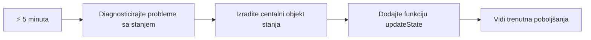
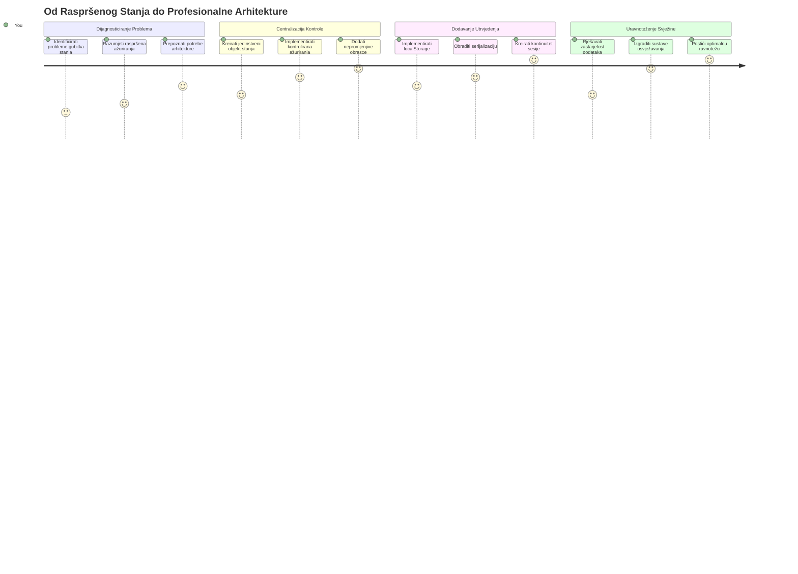
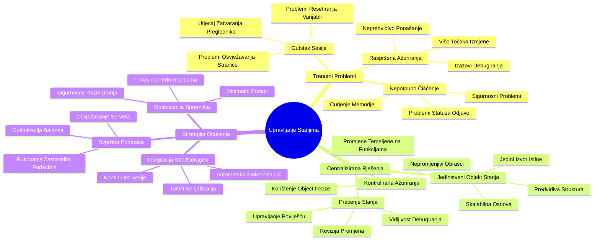
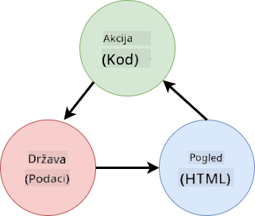
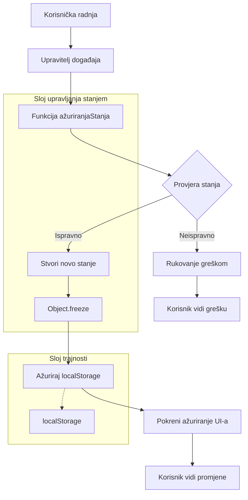
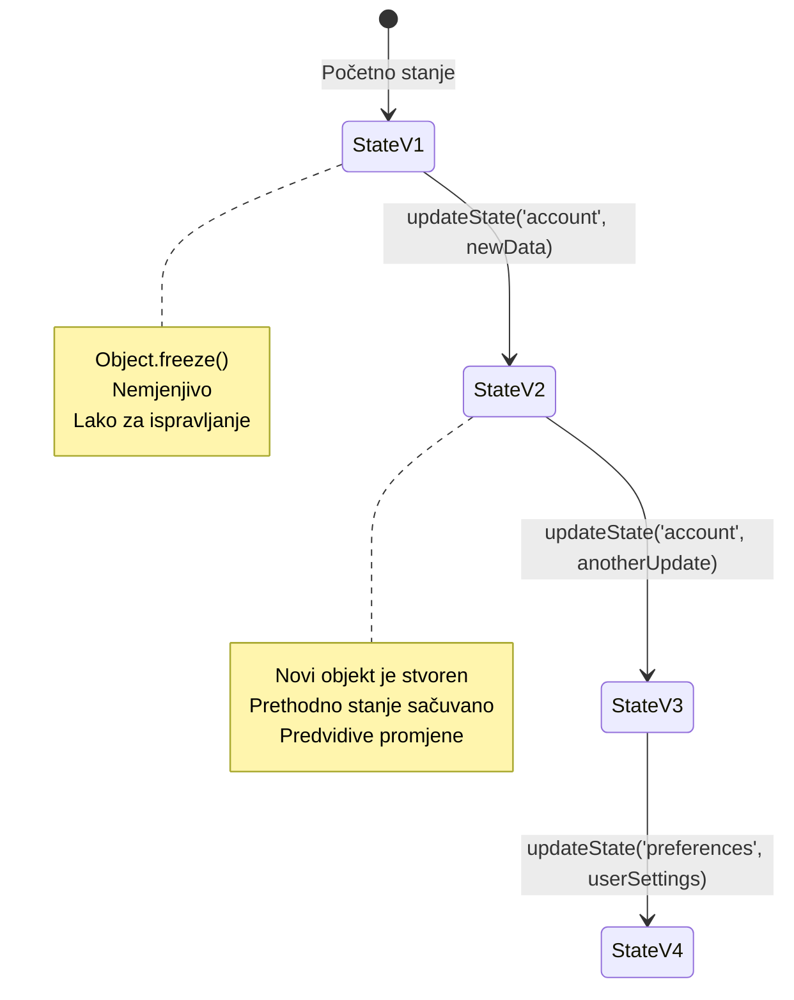
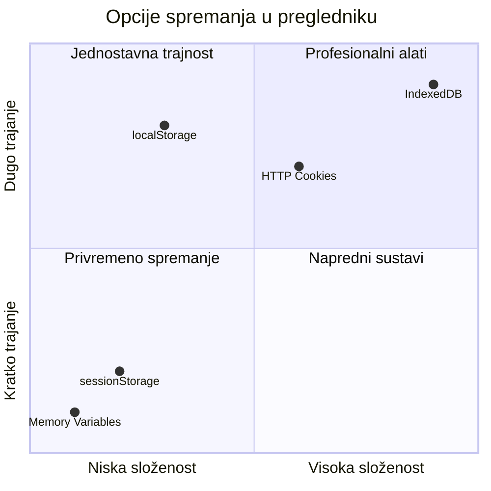
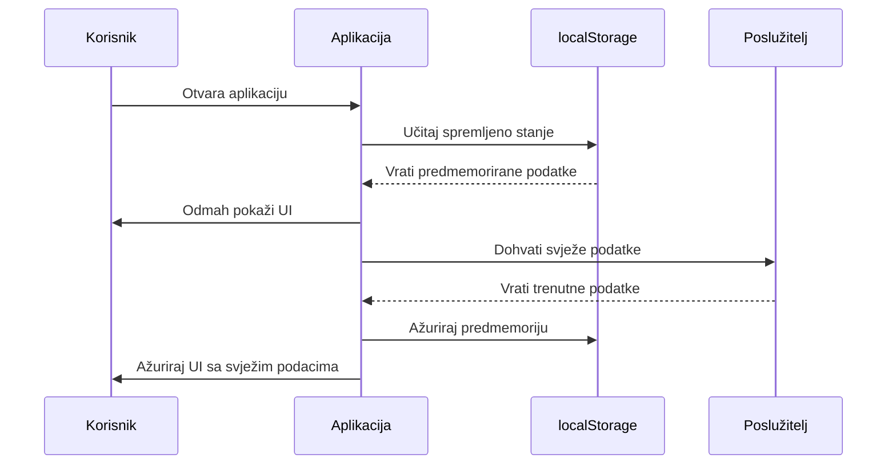
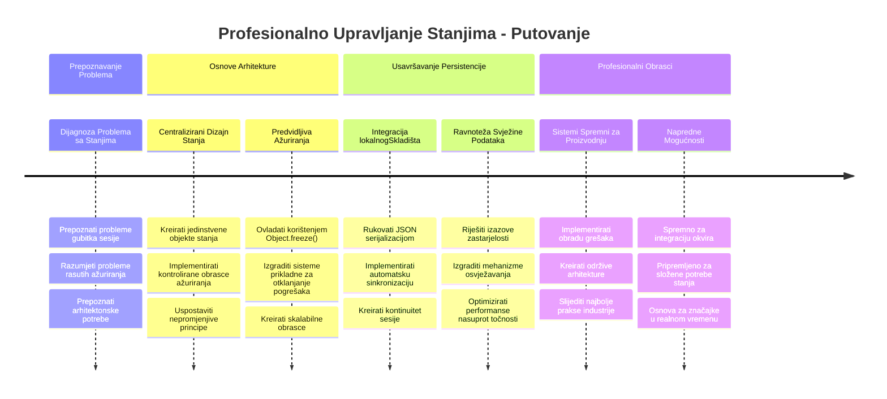

<!--
CO_OP_TRANSLATOR_METADATA:
{
  "original_hash": "b807b09df716dc48a2b750835bf8e933",
  "translation_date": "2026-01-07T09:23:23+00:00",
  "source_file": "7-bank-project/4-state-management/README.md",
  "language_code": "hr"
}
-->
# Izgradnja bankovne aplikacije 4. dio: Koncepti upravljanja stanjem

## ⚡ Što možete napraviti u sljedećih 5 minuta

**Brzi početni put za zaposlene programere**


- **Minuta 1**: Testirajte trenutačni problem sa stanjem - prijavite se, osvježite stranicu, promatrajte odjavu
- **Minuta 2**: Zamijenite `let account = null` s `let state = { account: null }`
- **Minuta 3**: Napravite jednostavnu funkciju `updateState()` za kontrolirana ažuriranja
- **Minuta 4**: Ažurirajte jednu funkciju da koristi novi obrazac
- **Minuta 5**: Testirajte poboljšanu predvidivost i mogućnost ispravljanja pogrešaka

**Brzi dijagnostički test**:
```javascript
// Prije: Raspodijeljeno stanje
let account = null; // Izgubljeno pri osvježavanju!

// Poslije: Centralizirano stanje
let state = Object.freeze({ account: null }); // Kontrolirano i praćeno!
```

**Zašto je to važno**: U 5 minuta dobit ćete iskustvo transformacije od kaotičnog upravljanja stanjem do predvidivih, lako ispravljivih obrazaca. Ovo je temelj koji čini složene aplikacije održivima.

## 🗺️ Vaše putovanje kroz savladavanje upravljanja stanjem


**Vaš cilj putovanja**: Do kraja ove lekcije izgradit ćete sustav upravljanja stanjem profesionalne razine koji rukuje trajnošću, svježinom podataka i predvidivim ažuriranjima - iste obrasce koji se koriste u produkcijskim aplikacijama.

## Pred- predavanje kviz

[Pre-lecture quiz](https://ff-quizzes.netlify.app/web/quiz/47)

## Uvod

Upravljanje stanjem je poput navigacijskog sustava na Voyager svemirskom brodu – kad sve radi glatko, jedva da ga primjećujete. Ali kada nešto pođe po zlu, razlika je između dosezanja međuzvjezdanog prostora i besciljnog lutanja u kozmičkoj praznini. U web razvoju, stanje predstavlja sve što vaša aplikacija treba pamtiti: status prijave korisnika, podatke obrazaca, povijest navigacije i privremena sučelja.

Kako se vaša bankovna aplikacija razvila od jednostavnog obrasca za prijavu u složeniju aplikaciju, vjerojatno ste naišli na neke uobičajene izazove. Osvježite stranicu i korisnici su neočekivano odjavljeni. Zatvorite preglednik i sav napredak nestane. Prilikom otklanjanja pogrešaka lovite kroz više funkcija koje sve na različite načine mijenjaju iste podatke.

Ovo nisu znakovi lošeg kodiranja – to su prirodni dječji problemi koji se pojavljuju kada aplikacije dosegnu određenu razinu složenosti. Svaki programer će se susresti s tim izazovima dok njegove aplikacije prelaze iz „dokaza koncepta“ u „spremne za produkciju“.

U ovoj lekciji implementirat ćemo centralizirani sustav upravljanja stanjem koji će vašu bankovnu aplikaciju pretvoriti u pouzdanu, profesionalnu aplikaciju. Naučit ćete upravljati proticima podataka predvidivo, pravilno trajno spremati korisničke sesije i stvoriti glatko korisničko iskustvo koje moderne web aplikacije zahtijevaju.

## Preduvjeti

Prije ulaska u koncepte upravljanja stanjem, trebate imati pravilno postavljeno razvojno okruženje i temelj svoje bankovne aplikacije. Ova lekcija nadograđuje direktno na koncepte i kod iz prethodnih dijelova ovog serijala.

Provjerite imate li spremne sljedeće komponente prije nego krenete dalje:

**Potrebna postavka:**
- Završite [lekciju o dohvaćanju podataka](../3-data/README.md) – vaša aplikacija treba uspješno učitavati i prikazivati podatke o računu
- Instalirajte [Node.js](https://nodejs.org) na sustav za pokretanje backend API-ja
- Pokrenite [server API](../api/README.md) lokalno radi upravljanja podacima o računu

**Testiranje vašeg okruženja:**

Provjerite radi li vaš API server pravilno izvršavanjem ove naredbe u terminalu:

```sh
curl http://localhost:5000/api
# -> treba vratiti "Bank API v1.0.0" kao rezultat
```

**Što ova naredba radi:**
- **Šalje** GET zahtjev lokalnom API serveru
- **Testira** vezu i provjerava reagira li server
- **Vraća** informaciju o verziji API-ja ako sve radi ispravno

## 🧠 Pregled arhitekture upravljanja stanjem


**Temeljno pravilo**: Profesionalno upravljanje stanjem uravnotežuje predvidivost, trajnost i performanse za stvaranje pouzdanih korisničkih iskustava koja se prilagođavaju od jednostavnih interakcija do složenih poslovnih procesa.

---

## Dijagnosticiranje trenutačnih problema sa stanjem

Kao Sherlock Holmes koji promatra mjesto zločina, moramo točno razumjeti što se događa u našoj trenutačnoj implementaciji prije nego što riješimo misterij nestanaka korisničkih sesija.

Provest ćemo jednostavan eksperiment koji otkriva temeljne izazove upravljanja stanjem:

**🧪 Isprobajte ovaj dijagnostički test:**
1. Prijavite se u vašu bankovnu aplikaciju i idite na nadzornu ploču
2. Osvježite stranicu preglednika
3. Promatrajte što se događa s vašim statusom prijave

Ako ste preusmjereni natrag na ekran za prijavu, otkrili ste klasični problem trajnosti stanja. Ovo se događa jer naša trenutačna implementacija pohranjuje korisničke podatke u JavaScript varijable koje se resetiraju pri svakom učitavanju stranice.

**Problemi trenutačne implementacije:**

Jednostavna varijabla `account` iz naše [prethodne lekcije](../3-data/README.md) stvara tri značajna problema koji utječu i na korisničko iskustvo i na održivost koda:

| Problem | Tehnički uzrok | Utjecaj na korisnika |
|---------|--------|----------------|
| **Gubitak sesije** | Osvježavanje stranice briše JavaScript varijable | Korisnici se moraju često ponovno prijavljivati |
| **Raspršena ažuriranja** | Više funkcija mijenja stanje izravno | Otklanjanje pogrešaka postaje sve teže |
| **Nepotpuno čišćenje** | Odjava ne briše sve reference na stanje | Mogući sigurnosni i privatnosni problemi |

**Arhitektonski izazov:**

Poput dizajna Titanica s dijeljenim pretincima koji se činilo čvrstim dok se nisu istovremeno poplavili više pretinaca, rješavanje ovih problema pojedinačno neće otkloniti temeljni arhitektonski problem. Potreban je sveobuhvatan sustav upravljanja stanjem.

> 💡 **Što zapravo pokušavamo postići ovdje?**

[Upravljanje stanjem](https://en.wikipedia.org/wiki/State_management) ustvari je rješavanje dva temeljna pitanja:

1. **Gdje su moji podaci?**: Praćenje koje informacije imamo i odakle dolaze
2. **Jesu li svi na istoj stranici?**: Osiguravanje da korisnici vide što se zapravo događa

**Naš plan igre:**

Umjesto da jurnjamo u krug, stvorit ćemo **centralizirani sustav upravljanja stanjem**. Zamislite to kao ako imate jednu stvarno organiziranu osobu koja vodi sve važne stvari:




**Razumijevanje ovog protoka podataka:**
- **Centralizira** sav podatkovni sadržaj aplikacije na jednom mjestu
- **Upravlja** svim promjenama stanja kroz kontrolirane funkcije
- **Osigurava** da je korisničko sučelje sinkronizirano sa trenutačnim stanjem
- **Pruža** jasan, predvidiv obrazac za upravljanje podacima

> 💡 **Stručni uvid**: Ova lekcija fokusira se na temeljne koncepte. Za složene aplikacije, biblioteke poput [Redux](https://redux.js.org) nude naprednije mogućnosti upravljanja stanjem. Razumijevanje ovih osnovnih principa pomoći će vam savladati bilo koju biblioteku za upravljanje stanjem.

> ⚠️ **Napredna tema**: Nećemo pokrivati automatska ažuriranja UI-a pokrenuta promjenama stanja, jer to uključuje koncepte [Reaktivnog programiranja](https://en.wikipedia.org/wiki/Reactive_programming). Smatrajte to izvrsnim sljedećim korakom u vašem učenju!

### Zadatak: Centralizirajte strukturu stanja

Započnimo transformaciju našeg raspršenog upravljanja stanjem u centralizirani sustav. Ovaj prvi korak postavlja temelj za sva sljedeća poboljšanja.

**Korak 1: Kreirajte centralni objekt stanja**

Zamijenite jednostavnu deklaraciju `account`:

```js
let account = null;
```

Strukturiranim objektom stanja:

```js
let state = {
  account: null
};
```

**Zašto je ova promjena važna:**
- **Centralizira** sve podatke aplikacije na jedno mjesto
- **Priprema** strukturu za dodavanje više svojstava u stanju kasnije
- **Stvara** jasnu granicu između stanja i ostalih varijabli
- **Postavlja** obrazac koji se može skalirati kako aplikacija raste

**Korak 2: Ažurirajte obrasce pristupa stanju**

Ažurirajte funkcije da koriste novu strukturu stanja:

**U funkcijama `register()` i `login()`**, zamijenite:
```js
account = ...
```

S:
```js
state.account = ...
```

**U funkciji `updateDashboard()`**, na vrh dodajte ovu liniju:
```js
const account = state.account;
```

**Što ova ažuriranja postižu:**
- **Održavaju** postojeću funkcionalnost dok poboljšavaju strukturu
- **Pripremaju** vaš kod za sofisticiranije upravljanje stanjem
- **Stvaraju** dosljedne obrasce za pristup podacima stanja
- **Postavljaju** temelj za centralizirana ažuriranja stanja

> 💡 **Napomena**: Ova refaktorizacija odmah ne rješava naše probleme, ali gradi bitan temelj za moćna poboljšanja koja slijede!

### 🎯 Pedagoški provjeravanje: Principi centralizacije

**Zastanite i razmislite**: Upravo ste implementirali temelj centraliziranog upravljanja stanjem. Ovo je ključna arhitektonska odluka.

**Brza samoprocjena**:
- Možete li objasniti zašto je bolje centralizirati stanje u jednom objektu nego imati raspršene varijable?
- Što bi se dogodilo ako zaboravite ažurirati neku funkciju da koristi `state.account`?
- Kako ovaj obrazac priprema vaš kod za naprednije značajke?

**Poveznica s realnim svijetom**: Obrasci centralizacije koje ste naučili temelj su modernih frameworka poput Redux, Vuex i React Context. Gradite isti arhitektonski pristup koji se koristi u velikim aplikacijama.

**Izazovno pitanje**: Ako biste trebali dodati korisničke postavke (temu, jezik) u vašu aplikaciju, gdje biste ih uveli u strukturu stanja? Kako bi se to skaliralo?

## Implementacija kontroliranih ažuriranja stanja

S obzirom da je naše stanje centralizirano, sljedeći je korak uspostavljanje kontroliranih mehanizama za izmjene podataka. Ovaj pristup osigurava predvidive promjene stanja i lakše otklanjanje pogrešaka.

Temeljno pravilo slično je kontroli zračnog prometa: umjesto da više funkcija samostalno mijenja stanje, usmjerit ćemo sve promjene kroz jednu kontroliranu funkciju. Ovaj obrazac pruža jasan nadzor o tome kada i kako se podaci mijenjaju.

**Upravljanje nepromjenjivim stanjem:**

Posmatrat ćemo naš objekt `state` kao [*nepromjenjiv*](https://en.wikipedia.org/wiki/Immutable_object), što znači da ga nikada ne mijenjamo izravno. Svaka promjena stvara novi objekt stanja sa ažuriranim podacima.

Iako ovaj pristup možda na prvu izgleda neučinkovit u odnosu na izravne promjene, donosi značajne prednosti u otklanjanju pogrešaka, testiranju i održavanju predvidivosti aplikacije.

**Prednosti upravljanja nepromjenjivim stanjem:**

| Prednost | Opis | Utjecaj |
|---------|-------------|--------|
| **Predvidivost** | Promjene se događaju samo kroz kontrolirane funkcije | Jednostavnije otklanjanje pogrešaka i testiranje |
| **Praćenje povijesti** | Svaka promjena stanja stvara novi objekt | Omogućuje funkcionalnost poništavanja/ponovnog vraćanja |
| **Sprječavanje nuspojava** | Nema slučajnih izmjena | Sprečava misteriozne pogreške |
| **Optimizacija performansi** | Jednostavno je otkriti kada se stanje stvarno promijenilo | Omogućuje učinkovita ažuriranja UI-ja |

**JavaScript nepokretnost s `Object.freeze()`:**

JavaScript nudi [`Object.freeze()`](https://developer.mozilla.org/docs/Web/JavaScript/Reference/Global_Objects/Object/freeze) kako bi spriječio izmjene objekata:

```js
const immutableState = Object.freeze({ account: userData });
// Svaki pokušaj izmjene immutableState će izazvati pogrešku
```

**Što se događa ovdje:**
- **Sprečava** izravne postavke ili brisanja svojstava
- **Baca** iznimke ako se pokuša izmjena
- **Osigurava** da promjene stanja moraju ići kroz kontrolirane funkcije
- **Stvara** jasan ugovor kako se stanje može ažurirati

> 💡 **Dubinski pogled**: Saznajte razliku između *plitkog* i *dubokog* zamrzavanja objekata u [MDN dokumentaciji](https://developer.mozilla.org/docs/Web/JavaScript/Reference/Global_Objects/Object/freeze#What_is_shallow_freeze). Razumijevanje ove razlike ključno je za složene strukture stanja.


### Zadatak

Naprimo novu funkciju `updateState()`:

```js
function updateState(property, newData) {
  state = Object.freeze({
    ...state,
    [property]: newData
  });
}
```

U ovoj funkciji stvaramo novi objekt stanja i kopiramo podatke iz prethodnog stanja koristeći [*spread (`...`) operator*](https://developer.mozilla.org/docs/Web/JavaScript/Reference/Operators/Spread_syntax#Spread_in_object_literals). Zatim prepisujemo određeno svojstvo objekta stanja novim podacima koristeći [zagrade](https://developer.mozilla.org/docs/Web/JavaScript/Guide/Working_with_Objects#Objects_and_properties) `[property]` za dodjelu. Na kraju zaključavamo objekt da spriječimo izmjene koristeći `Object.freeze()`. Trenutno u stanju samo imamo svojstvo `account`, ali ovim pristupom možete dodati koliko god svojstava vam treba.

Također ćemo ažurirati početnu inicijalizaciju `state` kako bismo osigurali da je početno stanje također zamrznuto:

```js
let state = Object.freeze({
  account: null
});
```

Nakon toga, ažurirajte funkciju `register` zamjenom dodjele `state.account = result;` s:

```js
updateState('account', result);
```

Isto učinite u funkciji `login`, zamijenite `state.account = data;` s:

```js
updateState('account', data);
```

Iskoristit ćemo priliku i riješiti problem da se podaci o računu ne brišu kada korisnik klikne *Logout*.

Kreirajte novu funkciju `logout()`:

```js
function logout() {
  updateState('account', null);
  navigate('/login');
}
```

U `updateDashboard()`, zamijenite preusmjeravanje `return navigate('/login');` s `return logout()`;

Isprobajte registraciju novog računa, odjavu i ponovnu prijavu kako biste provjerili da sve i dalje radi ispravno.

> Savjet: možete pratiti sve promjene stanja dodavanjem `console.log(state)` na dno funkcije `updateState()` i otvaranjem konzole u alatima za razvoj preglednika.

## Implementacija trajnosti podataka

Problem gubitka sesije koji smo ranije identificirali zahtijeva rješenje trajnosti koje održava stanje korisnika kroz sesije preglednika. Time se naša aplikacija iz privremenog iskustva pretvara u pouzdan, profesionalan alat.

Razmislite kako atomski satovi održavaju precizno vrijeme čak i tijekom nestanka struje tako da pohranjuju kritično stanje u neisparivoj memoriji. Slično tome, web aplikacije trebaju mehanizme trajne pohrane kako bi sačuvale ključne korisničke podatke kroz sesije preglednika i osvježavanja stranica.

**Strateška pitanja za trajnost podataka:**

Prije implementacije trajnosti, razmotrite ove ključne čimbenike:

| Pitanje | Kontekst bankovne aplikacije | Utjecaj odluke |
|----------|-------------------|----------------|
| **Jesu li podaci osjetljivi?** | Stanje računa, povijest transakcija | Odaberite sigurnu metodu pohrane |
| **Koliko dugo bi trebao trajati?** | Stanje prijave vs. privremene UI postavke | Odaberite odgovarajuće trajanje pohrane |
| **Trebaju li to poslužitelju?** | Autentifikacijski tokeni vs. UI postavke | Odredite zahtjeve za dijeljenjem |

**Opcije pohrane u pregledniku:**

Moderni preglednici nude nekoliko mehanizama za pohranu, svaki dizajniran za različite slučajeve upotrebe:

**Primarni API-ji za pohranu:**

1. **[`localStorage`](https://developer.mozilla.org/docs/Web/API/Window/localStorage)**: Trajna [Key/Value pohrana](https://en.wikipedia.org/wiki/Key%E2%80%93value_database)  
   - **Traje** neograničeno kroz sesije preglednika  
   - **Preživljava** ponovno pokretanje preglednika i računala  
   - **Ograničen** na određenu domenu web stranice  
   - **Savršen** za korisničke postavke i stanje prijave

2. **[`sessionStorage`](https://developer.mozilla.org/docs/Web/API/Window/sessionStorage)**: Privremena pohrana sesije  
   - **Funkcionira** identično kao localStorage u aktivnoj sesiji  
   - **Briše** se automatski zatvaranjem kartice preglednika  
   - **Idealno** za privremene podatke koji ne bi trebali trajati

3. **[HTTP kolačići](https://developer.mozilla.org/docs/Web/HTTP/Cookies)**: Pohrana dijeljena s poslužiteljem  
   - **Automatski** se šalju sa svakim zahtjevom poslužitelju  
   - **Savršeni** za [autentifikacijske](https://en.wikipedia.org/wiki/Authentication) tokene  
   - **Ograničeni** veličinom i mogu utjecati na performanse

**Zahtjev za serijalizaciju podataka:**

I `localStorage` i `sessionStorage` pohranjuju samo [stringove](https://developer.mozilla.org/docs/Web/JavaScript/Reference/Global_Objects/String):

```js
// Pretvori objekte u JSON nizove znakova za pohranu
const accountData = { user: 'john', balance: 150 };
localStorage.setItem('account', JSON.stringify(accountData));

// Parsiraj JSON nizove znakova natrag u objekte prilikom dohvaćanja
const savedAccount = JSON.parse(localStorage.getItem('account'));
```

**Razumijevanje serijalizacije:**  
- **Pretvara** JavaScript objekte u JSON stringove pomoću [`JSON.stringify()`](https://developer.mozilla.org/docs/Web/JavaScript/Reference/Global_Objects/JSON/stringify)  
- **Rekonstruira** objekte iz JSON-a pomoću [`JSON.parse()`](https://developer.mozilla.org/docs/Web/JavaScript/Reference/Global_Objects/JSON/parse)  
- **Automatski obrađuje** kompleksne ugniježđene objekte i nizove  
- **Ne uspijeva** za funkcije, neodređene vrijednosti i cikličke reference

> 💡 **Napredna opcija**: Za složene offline aplikacije s velikim skupovima podataka razmotrite [`IndexedDB` API](https://developer.mozilla.org/docs/Web/API/IndexedDB_API). Pruža punu bazu podataka na strani klijenta, ali zahtijeva složeniju implementaciju.


### Zadatak: Implementirajte trajnu pohranu u localStorage

Implementirajmo trajnu pohranu tako da korisnici ostaju prijavljeni dok se eksplicitno ne odjave. Koristit ćemo `localStorage` za pohranu podataka računa kroz sesije preglednika.

**Korak 1: Definirajte konfiguraciju pohrane**

```js
const storageKey = 'savedAccount';
```

**Što ova konstanta pruža:**  
- **Stvara** dosljedni identifikator za naše pohranjene podatke  
- **Sprečava** tipfelere u referencama ključa pohrane  
- **Olakšava** promjenu ključa za pohranu ako je potrebno  
- **Prati** najbolje prakse za održiv kod

**Korak 2: Dodajte automatsku pohranu**

Dodajte ovaj redak na kraj funkcije `updateState()`:

```js
localStorage.setItem(storageKey, JSON.stringify(state.account));
```

**Objašnjenje što se ovdje događa:**  
- **Pretvara** objekt računa u JSON string za pohranu  
- **Spremi** podatke koristeći naš dosljedni ključ pohrane  
- **Izvršava** se automatski kad se stanje promijeni  
- **Osigurava** da su pohranjeni podaci uvijek sinkronizirani sa trenutnim stanjem

> 💡 **Prednost arhitekture**: Budući da smo centralizirali sve promjene stanja kroz `updateState()`, dodavanje pohrane zahtijevalo je samo jedan redak koda. Ovo pokazuje snagu dobrih arhitektonskih odluka!

**Korak 3: Vratite stanje pri pokretanju aplikacije**

Napravite funkciju inicijalizacije koja vraća spremljene podatke:

```js
function init() {
  const savedAccount = localStorage.getItem(storageKey);
  if (savedAccount) {
    updateState('account', JSON.parse(savedAccount));
  }

  // Naš prethodni kod za inicijalizaciju
  window.onpopstate = () => updateRoute();
  updateRoute();
}

init();
```

**Razumijevanje procesa inicijalizacije:**  
- **Dohvaća** prethodno spremljene podatke računa iz localStorage  
- **Parsira** JSON string natrag u JavaScript objekt  
- **Ažurira** stanje pomoću naše kontrolirane funkcije za ažuriranje  
- **Automatski vraća** korisničku sesiju prilikom učitavanja stranice  
- **Izvršava** se prije ažuriranja ruta da osigura dostupnost stanja

**Korak 4: Optimizirajte zadanu rutu**

Ažurirajte zadanu rutu kako biste iskoristili trajnu pohranu:

U `updateRoute()`, zamijenite:
```js
// Zamijeni: return navigate('/login');
return navigate('/dashboard');
```

**Zašto je ova promjena smislenija:**  
- **Iskorištava** naš novi sustav trajne pohrane učinkovito  
- **Dopušta** nadzornoj ploči da provodi provjere autentifikacije  
- **Automatski preusmjerava** na prijavu ako nema spremljene sesije  
- **Stvara** besprijekorno korisničko iskustvo

**Testiranje vaše implementacije:**

1. Prijavite se u svoju bankarsku aplikaciju  
2. Osvježite stranicu preglednika  
3. Provjerite ostajete li prijavljeni i na nadzornoj ploči  
4. Zatvorite i ponovno otvorite preglednik  
5. Vratite se u aplikaciju i potvrdite da ste i dalje prijavljeni

🎉 **Postignuće otključano**: Uspješno ste implementirali upravljanje trajnim stanjem! Vaša aplikacija sada funkcionira kao profesionalna web aplikacija.

### 🎯 Pedagoška provjera: Arhitektura trajnosti

**Razumijevanje arhitekture**: Implementirali ste sofisticirani sloj trajnosti koji balansira korisničko iskustvo i složenost upravljanja podacima.

**Ključni pojmovi usvojeni**:  
- **Serijalizacija JSON-a**: Pretvaranje složenih objekata u pohranjive stringove  
- **Automatska sinkronizacija**: Promjene stanja pokreću trajnu pohranu  
- **Vraćanje sesije**: Aplikacije mogu obnoviti korisnički kontekst nakon prekida  
- **Centralizirana trajnost**: Jedna funkcija za ažuriranje upravlja svim pohranama

**Povezanost s industrijom**: Ovaj obrazac trajnosti temelj je Progressive Web Apps (PWA), offline-prve aplikacije i modernih mobilnih web iskustava. Gradite mogućnosti na profesionalnoj razini.

**Pitanje za razmišljanje**: Kako biste izmijenili ovaj sustav da podrži više korisničkih računa na istom uređaju? Razmotrite implikacije privatnosti i sigurnosti.

## Uravnoteživanje trajnosti i svježine podataka

Naš sustav trajnosti uspješno održava korisničke sesije, ali uvodi novi izazov: zastarjelost podataka. Kad više korisnika ili aplikacija mijenjaju iste podatke na poslužitelju, lokalno pohranjene informacije zastarijevaju.

Ova situacija podsjeća na vikinške pomorce koji su se oslanjali i na spremljene karte zvijezda i na aktualna opažanja neba. Karte su pružale stabilnost, ali navigatori su trebali svježe podatke kako bi se prilagodili promjenjivim uvjetima. Slično tome, naša aplikacija treba i trajno stanje korisnika i aktualne podatke s poslužitelja.

**🧪 Otkrivanje problema zastarjelosti podataka:**

1. Prijavite se u nadzornu ploču sa `test` računom  
2. Pokrenite ovu naredbu u terminalu kako biste simulirali transakciju iz drugog izvora:

```sh
curl --request POST \
     --header "Content-Type: application/json" \
     --data "{ \"date\": \"2020-07-24\", \"object\": \"Bought book\", \"amount\": -20 }" \
     http://localhost:5000/api/accounts/test/transactions
```

3. Osvježite stranicu nadzorne ploče u pregledniku  
4. Promatrajte prikazuje li se nova transakcija

**Što ovaj test pokazuje:**  
- **Pokazuje** kako lokalna pohrana može postati “zastarjela”  
- **Simulira** scenarije iz stvarnog svijeta gdje podaci mijenjaju izvan vaše aplikacije  
- **Otkriva** sukob između trajnosti i svježine podataka

**Izazov zastarjelosti podataka:**

| Problem | Uzrok | Utjecaj na korisnika |
|---------|-------|---------------------|
| **Zastarjeli podaci** | localStorage se nikada ne briše automatski | Korisnici vide zastarjele informacije |
| **Promjene na poslužitelju** | Druge aplikacije/korisnici mijenjaju iste podatke | Nekonzistentan prikaz na različitim platformama |
| **Predmemorija vs. stvarnost** | Lokalna predmemorija ne odgovara stanju poslužitelja | Loše korisničko iskustvo i zbunjenost |

**Strategija rješenja:**

Implementirat ćemo uzorak "osvježi pri učitavanju" koji uravnotežuje prednosti trajnosti i potrebu za svježim podacima. Ovaj pristup održava glatko korisničko iskustvo uz točnu podatkovnu točnost.


### Zadatak: Implementirajte sustav osvježavanja podataka

Napravit ćemo sustav koji automatski dohvaća svježe podatke s poslužitelja, dok zadržava prednosti našeg upravljanja trajnim stanjem.

**Korak 1: Napravite ažurirač podataka računa**

```js
async function updateAccountData() {
  const account = state.account;
  if (!account) {
    return logout();
  }

  const data = await getAccount(account.user);
  if (data.error) {
    return logout();
  }

  updateState('account', data);
}
```

**Logika ove funkcije uključuje:**  
- **Provjerava** je li korisnik trenutno prijavljen (postoji state.account)  
- **Preusmjerava** na odjavu ako nema valjane sesije  
- **Dohvaća** svježe podatke računa s poslužitelja koristeći postojeću funkciju `getAccount()`  
- **Rukuje** pogreškama poslužitelja elegantno odjavljivanjem nevažećih sesija  
- **Ažurira** stanje svježim podacima koristeći naš kontrolirani sustav nadzora  
- **Pokreće** automatsku pohranu u localStorage kroz funkciju `updateState()`

**Korak 2: Napravite handler za osvježavanje nadzorne ploče**

```js
async function refresh() {
  await updateAccountData();
  updateDashboard();
}
```

**Što ova funkcija za osvježavanje radi:**  
- **Koordinira** proces osvježavanja podataka i ažuriranja korisničkog sučelja  
- **Čeka** dovršetak dohvaćanja svježih podataka prije ažuriranja prikaza  
- **Osigurava** da nadzorna ploča prikazuje najnovije informacije  
- **Održava** jasnu razdvojenost između upravljanja podacima i ažuriranja sučelja

**Korak 3: Integrirajte sa sustavom ruta**

Ažurirajte konfiguraciju ruta da automatski pokrene osvježavanje:

```js
const routes = {
  '/login': { templateId: 'login' },
  '/dashboard': { templateId: 'dashboard', init: refresh }
};
```

**Kako ova integracija funkcionira:**  
- **Izvršava** funkciju osvježavanja svaki put kada se učitava ruta nadzorne ploče  
- **Osigurava** da se uvijek prikazuju svježi podaci kada korisnik dođe na nadzornu ploču  
- **Održava** postojeću strukturu ruta uz dodavanje svježine podataka  
- **Pruža** dosljedan uzorak za inicijalizaciju specifičnu za rutu

**Testiranje vašeg sustava osvježavanja:**

1. Prijavite se u bankarsku aplikaciju  
2. Pokrenite gore navedenu curl naredbu za stvaranje nove transakcije  
3. Osvježite stranicu nadzorne ploče ili se odmaknite i vratite  
4. Provjerite da nova transakcija odmah bude vidljiva

🎉 **Savršena ravnoteža postignuta**: Vaša aplikacija sada kombinira glatko iskustvo trajnog stanja s točnošću svježih podataka s poslužitelja!

## 📈 Vaš vremenski tijek svladavanja upravljanja stanjem


**🎓 Prekretnica diplome**: Uspješno ste izgradili kompletan sustav upravljanja stanjem koristeći iste principe koji pokreću Redux, Vuex i druge profesionalne biblioteke za stanje. Ti obrasci skaliraju od jednostavnih aplikacija do enterprise rješenja.

**🔄 Sljedeće razine mogućnosti**:  
- Spremni za svladavanje frameworka za upravljanje stanjem (Redux, Zustand, Pinia)  
- Pripremljeni za implementaciju real-time značajki putem WebSocket-a  
- Opremljeni za izgradnju offline-prvih Progressive Web Apps  
- Temelj spreman za napredne obrasce poput strojnih stanja i promatrača

## Izazov GitHub Copilota Agent 🚀

Koristite Agent mod za dovršetak sljedećeg izazova:

**Opis:** Implementirajte sveobuhvatan sustav upravljanja stanjem s undo/redo funkcionalnošću za bankarsku aplikaciju. Ovaj izazov će vam pomoći uvježbati napredne koncepte upravljanja stanjem uključujući praćenje povijesti stanja, nepromjenjive druge ažuriranja i sinkronizaciju sučelja.

**Zadatak:** Kreirajte poboljšani sustav upravljanja stanjem koji uključuje: 1) niz povijesti stanja koji prati sva prethodna stanja, 2) funkcije undo i redo koje mogu vratiti prethodna stanja, 3) UI gumbe za undo/redo na nadzornoj ploči, 4) maksimalnu veličinu povijesti od 10 stanja radi sprječavanja problema s memorijom, i 5) pravilno čišćenje povijesti kada se korisnik odjavi. Osigurajte da undo/redo funkcionalnost radi s promjenama na stanju računa i traje kroz osvježavanja preglednika.

Više o [agent modu](https://code.visualstudio.com/blogs/2025/02/24/introducing-copilot-agent-mode) pročitajte ovdje.

## 🚀 Izazov: Optimizacija pohrane

Vaša implementacija sada učinkovito upravlja korisničkim sesijama, osvježavanjem podataka i upravljanjem stanjem. Ipak, razmislite je li naš trenutni pristup optimalan u balansiranju učinkovitosti pohrane i funkcionalnosti.

Kao velemajstori šaha koji razlikuju ključne figure i zamjenjive pijune, učinkovito upravljanje stanjem zahtijeva prepoznavanje koji podaci moraju trajati naspram onih koji bi uvijek trebali biti svježi s poslužitelja.

**Analiza optimizacije:**

Procijenite svoju trenutnu implementaciju localStorage-a i razmislite o ovim strateškim pitanjima:  
- Koje je minimalne informacije potrebno za održavanje autentifikacije korisnika?  
- Koji se podaci toliko često mijenjaju da lokalna predmemorija nema velike koristi?  
- Kako optimizacija pohrane može poboljšati performanse bez narušavanja iskustva korisnika?

Ova vrsta arhitektonske analize razlikuje iskusne programere koji uzimaju u obzir i funkcionalnost i učinkovitost u svojim rješenjima.

**Strategija implementacije:**  
- **Identificirajte** bitne podatke koji moraju trajati (vjerojatno samo identifikacija korisnika)  
- **Izmijenite** lokalnu implementaciju pohrane tako da pohranjuje samo ključne podatke sesije  
- **Osigurajte** da se svježi podaci uvijek učitavaju s poslužitelja pri posjetu nadzornoj ploči  
- **Testirajte** da optimizirani pristup zadržava isto korisničko iskustvo

**Napredna razmatranja:**  
- **Usporedite** kompromise između pohrane kompletnog računa i samo autentifikacijskih tokena  
- **Dokumentirajte** svoje odluke i razloge za buduće članove tima

Ovaj izazov pomoći će vam da razmišljate kao profesionalni programer koji uvažava i korisničko iskustvo i učinkovitost aplikacije. Uzmite si vremena za eksperimentiranje!

## Kviz nakon predavanja

[Post-lecture quiz](https://ff-quizzes.netlify.app/web/quiz/48)

## Zadatak

[Implementirajte dijalog "Dodaj transakciju"](assignment.md)

Evo primjera rezultata nakon završetka zadatka:


---

<!-- CO-OP TRANSLATOR DISCLAIMER START -->
**Odricanje od odgovornosti**:
Ovaj dokument preveden je korištenjem AI usluge prevođenja [Co-op Translator](https://github.com/Azure/co-op-translator). Iako težimo točnosti, imajte na umu da automatski prijevodi mogu sadržavati pogreške ili netočnosti. Izvorni dokument na izvornom jeziku treba smatrati autoritativnim izvorom. Za važne informacije preporučuje se profesionalni ljudski prijevod. Ne snosimo odgovornost za bilo kakve nesporazume ili pogrešne interpretacije koje proizlaze iz korištenja ovog prijevoda.
<!-- CO-OP TRANSLATOR DISCLAIMER END -->