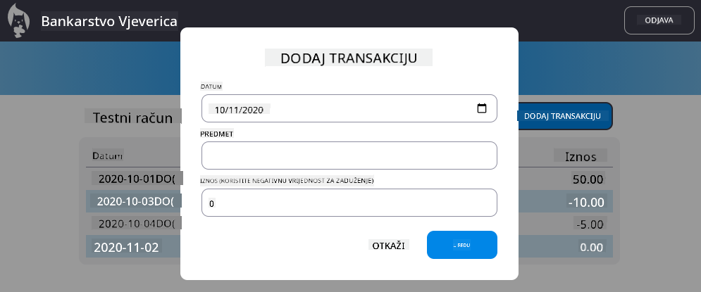

<!--
CO_OP_TRANSLATOR_METADATA:
{
  "original_hash": "4fa20c513e367e9cdd401bf49ae16e33",
  "translation_date": "2025-08-27T22:07:56+00:00",
  "source_file": "7-bank-project/4-state-management/README.md",
  "language_code": "hr"
}
-->
# Izgradnja aplikacije za bankarstvo, dio 4: Koncepti upravljanja stanjem

## Kviz prije predavanja

[Kviz prije predavanja](https://ff-quizzes.netlify.app/web/quiz/47)

### Uvod

Kako web aplikacija raste, postaje izazov pratiti sve tokove podataka. Koji kod dobiva podatke, koja stranica ih koristi, gdje i kada ih treba ažurirati... lako je završiti s neurednim kodom koji je teško održavati. Ovo je posebno istinito kada trebate dijeliti podatke između različitih stranica aplikacije, primjerice korisničke podatke. Koncept *upravljanja stanjem* oduvijek je postojao u svim vrstama programa, ali kako web aplikacije postaju sve složenije, sada je ključno razmišljati o tome tijekom razvoja.

U ovom završnom dijelu, pregledat ćemo aplikaciju koju smo izgradili kako bismo ponovno razmotrili način upravljanja stanjem, omogućujući podršku za osvježavanje preglednika u bilo kojem trenutku i trajno čuvanje podataka tijekom korisničkih sesija.

### Preduvjeti

Potrebno je da ste završili dio aplikacije za web [dohvaćanje podataka](../3-data/README.md) za ovu lekciju. Također trebate instalirati [Node.js](https://nodejs.org) i [pokrenuti API poslužitelja](../api/README.md) lokalno kako biste mogli upravljati podacima o računima.

Možete testirati radi li poslužitelj ispravno izvršavanjem ove naredbe u terminalu:

```sh
curl http://localhost:5000/api
# -> should return "Bank API v1.0.0" as a result
```

---

## Ponovno razmotrite upravljanje stanjem

U [prethodnoj lekciji](../3-data/README.md), predstavili smo osnovni koncept stanja u našoj aplikaciji s globalnom varijablom `account` koja sadrži bankovne podatke za trenutno prijavljenog korisnika. Međutim, naša trenutna implementacija ima neke nedostatke. Pokušajte osvježiti stranicu dok ste na nadzornoj ploči. Što se događa?

Postoje tri problema s trenutnim kodom:

- Stanje nije trajno, jer osvježavanje preglednika vraća vas na stranicu za prijavu.
- Postoji više funkcija koje mijenjaju stanje. Kako aplikacija raste, to može otežati praćenje promjena i lako je zaboraviti ažurirati jednu.
- Stanje se ne čisti, pa kada kliknete na *Odjava*, podaci o računu i dalje ostaju, iako ste na stranici za prijavu.

Mogli bismo ažurirati naš kod kako bismo riješili ove probleme jedan po jedan, ali to bi stvorilo više dupliciranja koda i učinilo aplikaciju složenijom i težom za održavanje. Ili bismo mogli zastati na nekoliko minuta i ponovno razmisliti o našoj strategiji.

> Koje probleme zapravo pokušavamo riješiti?

[Upravljanje stanjem](https://en.wikipedia.org/wiki/State_management) odnosi se na pronalaženje dobrog pristupa za rješavanje ova dva specifična problema:

- Kako učiniti tokove podataka u aplikaciji razumljivima?
- Kako osigurati da su podaci o stanju uvijek sinkronizirani s korisničkim sučeljem (i obrnuto)?

Kada se pobrinete za ovo, svi drugi problemi koje biste mogli imati možda su već riješeni ili su postali lakši za rješavanje. Postoji mnogo mogućih pristupa za rješavanje ovih problema, ali mi ćemo se odlučiti za uobičajeno rješenje koje se sastoji od **centralizacije podataka i načina njihove promjene**. Tokovi podataka izgledali bi ovako:


> Ovdje nećemo pokriti dio gdje podaci automatski pokreću ažuriranje prikaza, jer je to povezano s naprednijim konceptima [reaktivnog programiranja](https://en.wikipedia.org/wiki/Reactive_programming). To je dobra tema za daljnje istraživanje ako ste spremni za dubinsko proučavanje.

✅ Postoji mnogo biblioteka s različitim pristupima upravljanju stanjem, [Redux](https://redux.js.org) je popularna opcija. Pogledajte koncepte i obrasce koji se koriste jer je to često dobar način za učenje o potencijalnim problemima s kojima se možete suočiti u velikim web aplikacijama i kako ih možete riješiti.

### Zadatak

Započet ćemo s malo refaktoriranja. Zamijenite deklaraciju `account`:

```js
let account = null;
```

S:

```js
let state = {
  account: null
};
```

Ideja je *centralizirati* sve podatke naše aplikacije u jednom objektu stanja. Trenutno imamo samo `account` u stanju, pa se puno toga ne mijenja, ali to stvara put za buduće promjene.

Također moramo ažurirati funkcije koje ga koriste. U funkcijama `register()` i `login()` zamijenite `account = ...` s `state.account = ...`;

Na vrhu funkcije `updateDashboard()` dodajte ovaj redak:

```js
const account = state.account;
```

Ovo refaktoriranje samo po sebi nije donijelo mnogo poboljšanja, ali ideja je bila postaviti temelje za sljedeće promjene.

## Praćenje promjena podataka

Sada kada smo postavili objekt `state` za pohranu naših podataka, sljedeći korak je centralizacija ažuriranja. Cilj je olakšati praćenje svih promjena i kada se one događaju.

Kako bismo izbjegli promjene na objektu `state`, također je dobra praksa smatrati ga [*nepromjenjivim*](https://en.wikipedia.org/wiki/Immutable_object), što znači da ga uopće nije moguće mijenjati. To također znači da morate stvoriti novi objekt stanja ako želite nešto promijeniti u njemu. Na taj način gradite zaštitu od potencijalno neželjenih [nuspojava](https://en.wikipedia.org/wiki/Side_effect_(computer_science)) i otvarate mogućnosti za nove značajke u svojoj aplikaciji, poput implementacije poništavanja/ponovnog izvršavanja, dok također olakšavate otklanjanje pogrešaka. Na primjer, mogli biste zabilježiti svaku promjenu napravljenu na stanju i zadržati povijest promjena kako biste razumjeli izvor greške.

U JavaScriptu možete koristiti [`Object.freeze()`](https://developer.mozilla.org/docs/Web/JavaScript/Reference/Global_Objects/Object/freeze) za stvaranje nepromjenjive verzije objekta. Ako pokušate napraviti promjene na nepromjenjivom objektu, bit će podignuta iznimka.

✅ Znate li razliku između *plitkog* i *dubokog* nepromjenjivog objekta? Možete pročitati o tome [ovdje](https://developer.mozilla.org/docs/Web/JavaScript/Reference/Global_Objects/Object/freeze#What_is_shallow_freeze).

### Zadatak

Kreirajmo novu funkciju `updateState()`:

```js
function updateState(property, newData) {
  state = Object.freeze({
    ...state,
    [property]: newData
  });
}
```

U ovoj funkciji stvaramo novi objekt stanja i kopiramo podatke iz prethodnog stanja koristeći [*operator širenja (`...`)*](https://developer.mozilla.org/docs/Web/JavaScript/Reference/Operators/Spread_syntax#Spread_in_object_literals). Zatim nadjačavamo određeno svojstvo objekta stanja novim podacima koristeći [notaciju zagrada](https://developer.mozilla.org/docs/Web/JavaScript/Guide/Working_with_Objects#Objects_and_properties) `[property]` za dodjelu. Na kraju, zaključavamo objekt kako bismo spriječili izmjene koristeći `Object.freeze()`. Trenutno imamo samo svojstvo `account` pohranjeno u stanju, ali s ovim pristupom možete dodati koliko god svojstava trebate u stanje.

Također ćemo ažurirati inicijalizaciju `state` kako bismo osigurali da je početno stanje također zaključano:

```js
let state = Object.freeze({
  account: null
});
```

Nakon toga, ažurirajte funkciju `register` zamjenom dodjele `state.account = result;` s:

```js
updateState('account', result);
```

Učinite isto s funkcijom `login`, zamjenom `state.account = data;` s:

```js
updateState('account', data);
```

Sada ćemo iskoristiti priliku da riješimo problem s podacima o računu koji se ne brišu kada korisnik klikne na *Odjava*.

Kreirajte novu funkciju `logout()`:

```js
function logout() {
  updateState('account', null);
  navigate('/login');
}
```

U `updateDashboard()` zamijenite preusmjeravanje `return navigate('/login');` s `return logout()`;

Pokušajte registrirati novi račun, odjaviti se i ponovno prijaviti kako biste provjerili radi li sve ispravno.

> Savjet: možete pogledati sve promjene stanja dodavanjem `console.log(state)` na dno `updateState()` i otvaranjem konzole u alatima za razvoj preglednika.

## Trajno stanje

Većina web aplikacija treba trajno pohranjivati podatke kako bi ispravno funkcionirala. Svi ključni podaci obično se pohranjuju u bazu podataka i pristupaju putem API-ja poslužitelja, poput podataka o korisničkom računu u našem slučaju. No, ponekad je također zanimljivo trajno pohraniti neke podatke na klijentskoj aplikaciji koja se izvodi u vašem pregledniku, za bolje korisničko iskustvo ili za poboljšanje performansi učitavanja.

Kada želite trajno pohraniti podatke u pregledniku, postoji nekoliko važnih pitanja koja biste trebali postaviti:

- *Jesu li podaci osjetljivi?* Trebali biste izbjegavati pohranjivanje bilo kakvih osjetljivih podataka na klijentu, poput korisničkih lozinki.
- *Koliko dugo trebate zadržati ove podatke?* Planirate li pristupiti ovim podacima samo za trenutnu sesiju ili želite da budu pohranjeni zauvijek?

Postoji više načina za pohranu informacija unutar web aplikacije, ovisno o tome što želite postići. Na primjer, možete koristiti URL-ove za pohranu upita za pretraživanje i učiniti ih dijeljivima između korisnika. Također možete koristiti [HTTP kolačiće](https://developer.mozilla.org/docs/Web/HTTP/Cookies) ako podaci trebaju biti dijeljeni s poslužiteljem, poput informacija o [autentifikaciji](https://en.wikipedia.org/wiki/Authentication).

Druga opcija je korištenje jedne od mnogih API-ja preglednika za pohranu podataka. Dva su posebno zanimljiva:

- [`localStorage`](https://developer.mozilla.org/docs/Web/API/Window/localStorage): [Key/Value store](https://en.wikipedia.org/wiki/Key%E2%80%93value_database) koji omogućuje trajno pohranjivanje podataka specifičnih za trenutnu web stranicu tijekom različitih sesija. Podaci pohranjeni u njemu nikada ne istječu.
- [`sessionStorage`](https://developer.mozilla.org/docs/Web/API/Window/sessionStorage): radi isto kao `localStorage`, osim što se podaci pohranjeni u njemu brišu kada sesija završi (kada se preglednik zatvori).

Napomena da oba ova API-ja omogućuju pohranu samo [nizova](https://developer.mozilla.org/docs/Web/JavaScript/Reference/Global_Objects/String). Ako želite pohraniti složene objekte, morat ćete ih serijalizirati u [JSON](https://developer.mozilla.org/docs/Web/JavaScript/Reference/Global_Objects/JSON) format koristeći [`JSON.stringify()`](https://developer.mozilla.org/docs/Web/JavaScript/Reference/Global_Objects/JSON/stringify).

✅ Ako želite stvoriti web aplikaciju koja ne radi s poslužiteljem, također je moguće stvoriti bazu podataka na klijentu koristeći [`IndexedDB` API](https://developer.mozilla.org/docs/Web/API/IndexedDB_API). Ovo je rezervirano za napredne slučajeve upotrebe ili ako trebate pohraniti značajnu količinu podataka, jer je složenije za korištenje.

### Zadatak

Želimo da naši korisnici ostanu prijavljeni dok eksplicitno ne kliknu na gumb *Odjava*, pa ćemo koristiti `localStorage` za pohranu podataka o računu. Prvo, definirajmo ključ koji ćemo koristiti za pohranu naših podataka.

```js
const storageKey = 'savedAccount';
```

Zatim dodajte ovaj redak na kraj funkcije `updateState()`:

```js
localStorage.setItem(storageKey, JSON.stringify(state.account));
```

S ovim, podaci o korisničkom računu bit će trajno pohranjeni i uvijek ažurirani jer smo prethodno centralizirali sva ažuriranja stanja. Ovo je trenutak kada počinjemo uživati u svim našim prethodnim refaktoriranjima 🙂.

Kako su podaci pohranjeni, također moramo voditi računa o njihovom vraćanju kada se aplikacija učita. Budući da ćemo početi imati više inicijalizacijskog koda, možda bi bilo dobro stvoriti novu funkciju `init`, koja također uključuje naš prethodni kod na dnu `app.js`:

```js
function init() {
  const savedAccount = localStorage.getItem(storageKey);
  if (savedAccount) {
    updateState('account', JSON.parse(savedAccount));
  }

  // Our previous initialization code
  window.onpopstate = () => updateRoute();
  updateRoute();
}

init();
```

Ovdje dohvaćamo spremljene podatke, i ako ih ima, ažuriramo stanje u skladu s tim. Važno je to učiniti *prije* ažuriranja rute, jer može postojati kod koji se oslanja na stanje tijekom ažuriranja stranice.

Također možemo učiniti stranicu *Nadzorna ploča* zadanom stranicom naše aplikacije, jer sada trajno pohranjujemo podatke o računu. Ako se ne pronađu podaci, nadzorna ploča ionako preusmjerava na stranicu *Prijava*. U `updateRoute()` zamijenite rezervni `return navigate('/login');` s `return navigate('/dashboard');`.

Sada se prijavite u aplikaciju i pokušajte osvježiti stranicu. Trebali biste ostati na nadzornoj ploči. S tim ažuriranjem riješili smo sve naše početne probleme...

## Ažuriranje podataka

...Ali možda smo također stvorili novi problem. Ups!

Idite na nadzornu ploču koristeći račun `test`, zatim pokrenite ovu naredbu u terminalu kako biste stvorili novu transakciju:

```sh
curl --request POST \
     --header "Content-Type: application/json" \
     --data "{ \"date\": \"2020-07-24\", \"object\": \"Bought book\", \"amount\": -20 }" \
     http://localhost:5000/api/accounts/test/transactions
```

Pokušajte osvježiti stranicu nadzorne ploče u pregledniku sada. Što se događa? Vidite li novu transakciju?

Stanje je trajno pohranjeno zahvaljujući `localStorage`, ali to također znači da se nikada ne ažurira dok se ne odjavite iz aplikacije i ponovno prijavite!

Jedna moguća strategija za rješavanje ovog problema je ponovno učitavanje podataka o računu svaki put kada se učita nadzorna ploča, kako bi se izbjegli zastarjeli podaci.

### Zadatak

Kreirajte novu funkciju `updateAccountData`:

```js
async function updateAccountData() {
  const account = state.account;
  if (!account) {
    return logout();
  }

  const data = await getAccount(account.user);
  if (data.error) {
    return logout();
  }

  updateState('account', data);
}
```

Ova metoda provjerava jesmo li trenutno prijavljeni, a zatim ponovno učitava podatke o računu s poslužitelja.

Kreirajte drugu funkciju nazvanu `refresh`:

```js
async function refresh() {
  await updateAccountData();
  updateDashboard();
}
```

Ova funkcija ažurira podatke o računu, a zatim se brine o ažuriranju HTML-a stranice nadzorne ploče. To je ono što trebamo pozvati kada se učita ruta nadzorne ploče. Ažurirajte definiciju rute s:

```js
const routes = {
  '/login': { templateId: 'login' },
  '/dashboard': { templateId: 'dashboard', init: refresh }
};
```

Pokušajte ponovno učitati nadzornu ploču sada, trebala bi prikazati ažurirane podatke o računu.

---

## 🚀 Izazov

Sada kada ponovno učitavamo podatke o računu svaki put kada se učita nadzorna ploča, mislite li da još uvijek trebamo trajno pohranjivati *sve podatke o računu*?

Pokušajte zajedno raditi na promjeni onoga što se sprema i učitava iz `localStorage` kako biste uključili samo ono što je apsolutno potrebno za rad aplikacije.

## Kviz nakon predavanja
[Post-predavanje kviz](https://ff-quizzes.netlify.app/web/quiz/48)

## Zadatak

[Implementirajte dijalog "Dodaj transakciju"](assignment.md)

Evo primjera rezultata nakon dovršetka zadatka:



---

**Odricanje od odgovornosti**:  
Ovaj dokument je preveden pomoću AI usluge za prevođenje [Co-op Translator](https://github.com/Azure/co-op-translator). Iako nastojimo osigurati točnost, imajte na umu da automatski prijevodi mogu sadržavati pogreške ili netočnosti. Izvorni dokument na izvornom jeziku treba smatrati autoritativnim izvorom. Za ključne informacije preporučuje se profesionalni prijevod od strane ljudskog prevoditelja. Ne preuzimamo odgovornost za bilo kakve nesporazume ili pogrešne interpretacije koje proizlaze iz korištenja ovog prijevoda.