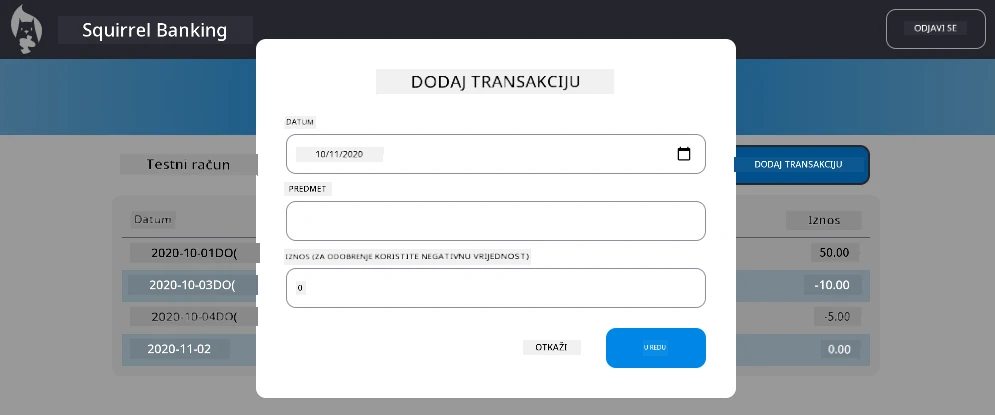

<!--
CO_OP_TRANSLATOR_METADATA:
{
  "original_hash": "50a7783473b39a2e0f133e271a102231",
  "translation_date": "2025-10-25T00:04:43+00:00",
  "source_file": "7-bank-project/4-state-management/assignment.md",
  "language_code": "hr"
}
-->
# Implementacija dijaloga "Dodaj transakciju"

## Pregled

Vaša aplikacija za bankarstvo sada ima solidno upravljanje stanjem i pohranu podataka, ali nedostaje joj ključna funkcionalnost koju prave bankarske aplikacije trebaju: mogućnost da korisnici dodaju vlastite transakcije. U ovom zadatku implementirat ćete kompletan dijalog "Dodaj transakciju" koji se besprijekorno integrira s vašim postojećim sustavom upravljanja stanjem.

Ovaj zadatak objedinjuje sve što ste naučili u četiri lekcije o bankarstvu: HTML predloške, rukovanje obrascima, integraciju API-ja i upravljanje stanjem.

## Ciljevi učenja

Završetkom ovog zadatka, naučit ćete:
- **Kreirati** korisnički prilagođen dijalog za unos podataka
- **Implementirati** pristupačan dizajn obrasca s podrškom za tipkovnicu i čitače ekrana
- **Integrirati** nove funkcionalnosti s vašim postojećim sustavom upravljanja stanjem
- **Prakticirati** komunikaciju s API-jem i rukovanje greškama
- **Primijeniti** moderne web razvojne obrasce na stvarnu funkcionalnost

## Upute

### Korak 1: Gumb za dodavanje transakcije

**Kreirajte** gumb "Dodaj transakciju" na stranici nadzorne ploče koji korisnici mogu lako pronaći i koristiti.

**Zahtjevi:**
- **Postavite** gumb na logičnu lokaciju na nadzornoj ploči
- **Koristite** jasan, akcijski tekst na gumbu
- **Stilizirajte** gumb tako da odgovara postojećem dizajnu korisničkog sučelja
- **Osigurajte** da je gumb pristupačan putem tipkovnice

### Korak 2: Implementacija dijaloga

Odaberite jedan od dva pristupa za implementaciju dijaloga:

**Opcija A: Odvojena stranica**
- **Kreirajte** novi HTML predložak za obrazac transakcije
- **Dodajte** novu rutu u vaš sustav za usmjeravanje
- **Implementirajte** navigaciju do i od stranice obrasca

**Opcija B: Modalni dijalog (preporučeno)**
- **Koristite** JavaScript za prikaz/sakrivanje dijaloga bez napuštanja nadzorne ploče
- **Implementirajte** koristeći svojstvo [`hidden`](https://developer.mozilla.org/docs/Web/HTML/Global_attributes/hidden) ili CSS klase
- **Kreirajte** glatko korisničko iskustvo s pravilnim upravljanjem fokusom

### Korak 3: Implementacija pristupačnosti

**Osigurajte** da vaš dijalog zadovoljava [standarde pristupačnosti za modalne dijaloge](https://developer.paciellogroup.com/blog/2018/06/the-current-state-of-modal-dialog-accessibility/):

**Navigacija tipkovnicom:**
- **Podržite** tipku Escape za zatvaranje dijaloga
- **Zadržite** fokus unutar dijaloga dok je otvoren
- **Vratite** fokus na gumb za otvaranje dijaloga kada se zatvori

**Podrška za čitače ekrana:**
- **Dodajte** odgovarajuće ARIA oznake i uloge
- **Najavite** otvaranje/zatvaranje dijaloga čitačima ekrana
- **Osigurajte** jasne oznake polja obrasca i poruke o greškama

### Korak 4: Kreiranje obrasca

**Dizajnirajte** HTML obrazac koji prikuplja podatke o transakciji:

**Obavezna polja:**
- **Datum**: Kada se transakcija dogodila
- **Opis**: Za što je transakcija bila
- **Iznos**: Vrijednost transakcije (pozitivno za prihod, negativno za troškove)

**Značajke obrasca:**
- **Provjerite** ispravnost unosa korisnika prije slanja
- **Osigurajte** jasne poruke o greškama za neispravne podatke
- **Uključite** korisne tekstove za unos i oznake
- **Stilizirajte** u skladu s vašim postojećim dizajnom

### Korak 5: Integracija API-ja

**Povežite** vaš obrazac s backend API-jem:

**Koraci implementacije:**
- **Pregledajte** [specifikacije API-ja poslužitelja](../api/README.md) za ispravan endpoint i format podataka
- **Kreirajte** JSON podatke iz unosa u obrazac
- **Pošaljite** podatke na API koristeći odgovarajuće rukovanje greškama
- **Prikažite** poruke o uspjehu/neuspjehu korisniku
- **Rukujte** mrežnim greškama na odgovarajući način

### Korak 6: Integracija upravljanja stanjem

**Ažurirajte** svoju nadzornu ploču novom transakcijom:

**Zahtjevi za integraciju:**
- **Osvježite** podatke o računu nakon uspješnog dodavanja transakcije
- **Ažurirajte** prikaz nadzorne ploče bez potrebe za ponovnim učitavanjem stranice
- **Osigurajte** da se nova transakcija odmah pojavi
- **Održavajte** pravilnu konzistentnost stanja tijekom procesa

## Tehničke specifikacije

**Detalji o API endpointu:**
Pogledajte [dokumentaciju API-ja poslužitelja](../api/README.md) za:
- Potreban JSON format za podatke o transakciji
- HTTP metodu i URL endpointa
- Očekivani format odgovora
- Rukovanje odgovorima o greškama

**Očekivani rezultat:**
Nakon završetka ovog zadatka, vaša aplikacija za bankarstvo trebala bi imati potpuno funkcionalnu značajku "Dodaj transakciju" koja izgleda i ponaša se profesionalno:

## Testiranje implementacije

**Funkcionalno testiranje:**
1. **Provjerite** da je gumb "Dodaj transakciju" jasno vidljiv i pristupačan
2. **Testirajte** da se dijalog pravilno otvara i zatvara
3. **Potvrdite** da provjera ispravnosti obrasca radi za sva obavezna polja
4. **Provjerite** da se uspješne transakcije odmah prikazuju na nadzornoj ploči
5. **Osigurajte** da rukovanje greškama radi za neispravne podatke i probleme s mrežom

**Testiranje pristupačnosti:**
1. **Navigirajte** kroz cijeli proces koristeći samo tipkovnicu
2. **Testirajte** s čitačem ekrana kako biste osigurali pravilne najave
3. **Provjerite** da upravljanje fokusom radi ispravno
4. **Provjerite** da svi elementi obrasca imaju odgovarajuće oznake

## Rubrika za evaluaciju

| Kriterij | Izvrsno | Zadovoljavajuće | Potrebno poboljšanje |
| -------- | --------- | -------- | ----------------- |
| **Funkcionalnost** | Značajka dodavanja transakcije radi besprijekorno s izvrsnim korisničkim iskustvom i slijedi sve najbolje prakse iz lekcija | Značajka dodavanja transakcije radi ispravno, ali možda ne slijedi neke najbolje prakse ili ima manje probleme s upotrebljivošću | Značajka dodavanja transakcije djelomično radi ili ima značajne probleme s upotrebljivošću |
| **Kvaliteta koda** | Kod je dobro organiziran, slijedi utvrđene obrasce, uključuje pravilno rukovanje greškama i besprijekorno se integrira s postojećim sustavom upravljanja stanjem | Kod radi, ali može imati neke probleme s organizacijom ili nekonzistentne obrasce u odnosu na postojeći kod | Kod ima značajne strukturne probleme ili se ne integrira dobro s postojećim obrascima |
| **Pristupačnost** | Potpuna podrška za navigaciju tipkovnicom, kompatibilnost s čitačima ekrana i slijedi WCAG smjernice s izvrsnim upravljanjem fokusom | Osnovne značajke pristupačnosti implementirane, ali možda nedostaju neke funkcionalnosti za navigaciju tipkovnicom ili čitače ekrana | Ograničene ili nikakve razmatranja pristupačnosti |
| **Korisničko iskustvo** | Intuitivno, uglađeno sučelje s jasnim povratnim informacijama, glatkim interakcijama i profesionalnim izgledom | Dobro korisničko iskustvo s manjim područjima za poboljšanje u povratnim informacijama ili vizualnom dizajnu | Loše korisničko iskustvo s zbunjujućim sučeljem ili nedostatkom povratnih informacija |

## Dodatni izazovi (opcionalno)

Nakon što završite osnovne zahtjeve, razmislite o sljedećim poboljšanjima:

**Napredne značajke:**
- **Dodajte** kategorije transakcija (hrana, prijevoz, zabava itd.)
- **Implementirajte** provjeru unosa s povratnim informacijama u stvarnom vremenu
- **Kreirajte** prečace na tipkovnici za napredne korisnike
- **Dodajte** mogućnost uređivanja i brisanja transakcija

**Napredna integracija:**
- **Implementirajte** funkcionalnost poništavanja za nedavno dodane transakcije
- **Dodajte** mogućnost uvoza više transakcija iz CSV datoteka
- **Kreirajte** mogućnost pretraživanja i filtriranja transakcija
- **Implementirajte** funkcionalnost izvoza podataka

Ove opcionalne značajke pomoći će vam da vježbate napredne koncepte web razvoja i stvorite potpuniju aplikaciju za bankarstvo!

---

**Izjava o odricanju odgovornosti**:  
Ovaj dokument je preveden pomoću AI usluge za prevođenje [Co-op Translator](https://github.com/Azure/co-op-translator). Iako nastojimo osigurati točnost, imajte na umu da automatski prijevodi mogu sadržavati pogreške ili netočnosti. Izvorni dokument na izvornom jeziku treba smatrati autoritativnim izvorom. Za ključne informacije preporučuje se profesionalni prijevod od strane čovjeka. Ne preuzimamo odgovornost za nesporazume ili pogrešna tumačenja koja proizlaze iz korištenja ovog prijevoda.