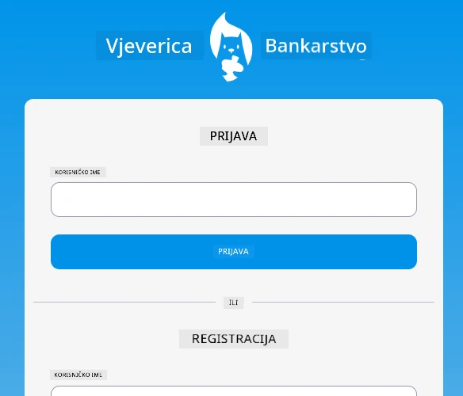

<!--
CO_OP_TRANSLATOR_METADATA:
{
  "original_hash": "830359535306594b448db6575ce5cdee",
  "translation_date": "2025-08-27T22:00:16+00:00",
  "source_file": "7-bank-project/README.md",
  "language_code": "hr"
}
-->
# :dollar: Izgradite Banku

U ovom projektu naučit ćete kako izgraditi fiktivnu banku. Ove lekcije uključuju upute o tome kako postaviti web aplikaciju i definirati rute, izraditi forme, upravljati stanjem i dohvatiti podatke s API-ja od kojeg možete preuzeti podatke banke.

|  |  |
|--------------------------------|--------------------------------|

## Lekcije

1. [HTML predlošci i rute u web aplikaciji](1-template-route/README.md)
2. [Izradite formu za prijavu i registraciju](2-forms/README.md)
3. [Metode dohvaćanja i korištenja podataka](3-data/README.md)
4. [Koncepti upravljanja stanjem](4-state-management/README.md)

### Zasluge

Ove lekcije napisane su s :hearts: od strane [Yohan Lasorsa](https://twitter.com/sinedied).

Ako vas zanima kako izraditi [server API](/7-bank-project/api/README.md) korišten u ovim lekcijama, možete pratiti [ovu seriju videa](https://aka.ms/NodeBeginner) (posebno videozapise od 17. do 21.).

Također možete pogledati [ovaj interaktivni Learn tutorial](https://aka.ms/learn/express-api).

---

**Odricanje od odgovornosti**:  
Ovaj dokument je preveden pomoću AI usluge za prevođenje [Co-op Translator](https://github.com/Azure/co-op-translator). Iako nastojimo osigurati točnost, imajte na umu da automatski prijevodi mogu sadržavati pogreške ili netočnosti. Izvorni dokument na izvornom jeziku treba smatrati autoritativnim izvorom. Za ključne informacije preporučuje se profesionalni prijevod od strane čovjeka. Ne preuzimamo odgovornost za bilo kakva nesporazuma ili pogrešna tumačenja koja proizlaze iz korištenja ovog prijevoda.