# Korištenje urednika koda: Ovladavanje VSCode.dev

Sjetite se u *The Matrixu* kada se Neo morao spojiti na masivni računalni terminal kako bi pristupio digitalnom svijetu? Današnji alati za web razvoj su sasvim druga priča – nevjerojatno moćne mogućnosti dostupne s bilo kojeg mjesta. VSCode.dev je uređivač koda baziran u pregledniku koji donosi profesionalne razvojne alate na bilo koji uređaj s internet vezom.

Baš kao što je tiskarski stroj učinio knjige dostupnima svima, ne samo redovnicima u samostanima, VSCode.dev demokratizira kodiranje. Možete raditi na projektima s računala u knjižnici, školskog laboratorija ili bilo gdje gdje imate pristup pregledniku. Nema instalacija, nema ograničenja “trebam svoju specifičnu konfiguraciju”.

Do kraja ove lekcije razumjet ćete kako upravljati VSCode.dev-om, otvarati repozitorije s GitHuba izravno u pregledniku i koristiti Git za kontrolu verzija – sve vještine na kojima se profesionalni developeri oslanjaju svakodnevno.

## ⚡ Što možete učiniti u sljedećih 5 minuta

**Brzi početni put za zaposlene developere**


- **Minuta 1**: Otiđite na [vscode.dev](https://vscode.dev) - nema potrebe za instalacijom
- **Minuta 2**: Prijavite se s GitHubom za povezivanje vaših repozitorija
- **Minuta 3**: Isprobajte URL trik: promijenite `github.com` u `vscode.dev/github` u bilo kojem URL-u repozitorija
- **Minuta 4**: Kreirajte novu datoteku i gledajte kako automatski radi isticanje sintakse
- **Minuta 5**: Napravite promjenu i pošaljite je putem panela za kontrolu izvora

**Brzi testni URL**:  
```
# Transform this:
github.com/microsoft/Web-Dev-For-Beginners

# Into this:
vscode.dev/github/microsoft/Web-Dev-For-Beginners
```
  
**Zašto je ovo važno**: U 5 minuta iskusit ćete slobodu kodiranja bilo gdje pomoću profesionalnih alata. Ovo predstavlja budućnost razvoja – pristupačnu, moćnu i neposrednu.

## 🗺️ Vaše putovanje učenjem kroz razvoj u oblaku

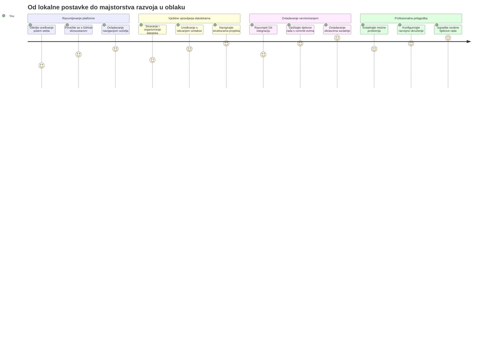
**Vaš cilj putovanja**: Do kraja ove lekcije ovladat ćete profesionalnim razvojnim okruženjem u oblaku koje radi s bilo kojeg uređaja, omogućavajući vam kodiranje istim alatima koje koriste developeri u velikim tehnološkim tvrtkama.

## Što ćete naučiti

Nakon što ovo zajedno prođemo, moći ćete:

- Upravljati VSCode.dev-om kao da vam je drugi dom – pronalaziti sve što vam treba bez gubljenja
- Otvoriti bilo koji GitHub repozitorij u pregledniku i odmah početi s uređivanjem (ovo je prilično magično!)
- Koristiti Git za praćenje promjena i spremanje napretka kao profesionalac
- Pojačati svoj uređivač s ekstenzijama koje ubrzavaju i uljepšavaju kodiranje
- S povjerenjem stvarati i organizirati datoteke projekta

## Što će vam trebati

Zahtjevi su jednostavni:

- Besplatan [GitHub račun](https://github.com) (pomoći ćemo vam s kreacijom ako treba)
- Osnovno poznavanje web preglednika
- Lekcija GitHub Basics pruža korisne informacije, ali nije nužna

> 💡 **Novi ste na GitHubu?** Kreiranje računa je besplatno i traje nekoliko minuta. Kao što vam knjižnična iskaznica daje pristup knjigama širom svijeta, GitHub račun otvara vrata kod repozitorijima diljem interneta.

## 🧠 Pregled ekosustava razvoja u oblaku

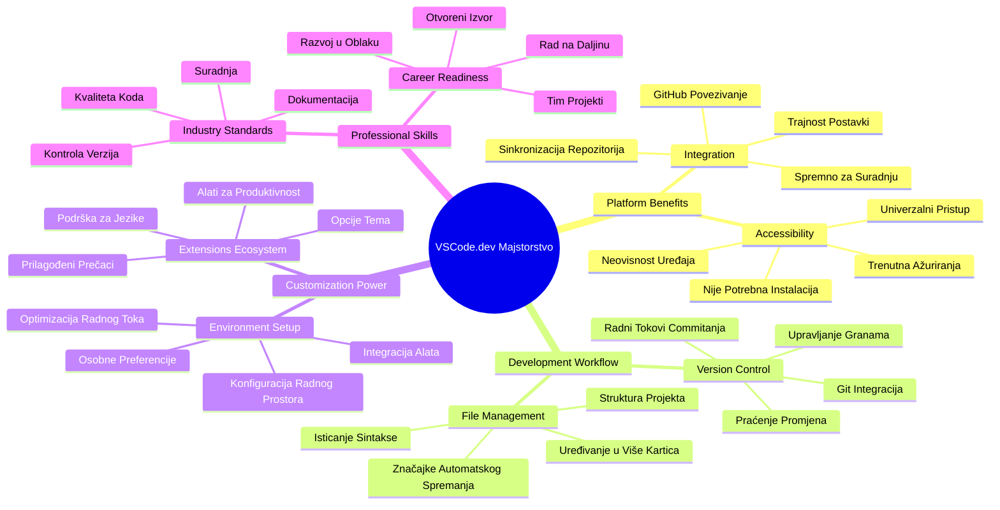
**Temeljno načelo**: Razvojna okruženja bazirana na oblaku predstavljaju budućnost kodiranja - pružaju profesionalne alate koji su dostupni, suradnički i neovisni o platformi.

## Zašto su web-bazirani uređivači koda važni

Prije interneta, znanstvenici na različitim sveučilištima nisu mogli lako dijeliti istraživanja. Tada je u 1960-ima nastao ARPANET, povezujući računala na daljinu. Web-bazirani uređivači koda slijede isto načelo – čine moćne alate dostupnim bez obzira na vašu fizičku lokaciju ili uređaj.

Uređivač koda služi kao vaš razvojni radni prostor, gdje pišete, uređujete i organizirate kodne datoteke. Za razliku od jednostavnih tekstualnih uređivača, profesionalni uređivači koda pružaju isticanje sintakse, otkrivanje pogrešaka i mogućnosti upravljanja projektima.

VSCode.dev donosi ove mogućnosti u vaš preglednik:

**Prednosti web-baziranog uređivanja:**

| Značajka | Opis | Praktična korist |
|---------|-------------|----------|
| **Neovisnost o platformi** | Radi na bilo kojem uređaju s preglednikom | Radite s raznih računala bez problema |
| **Nema potrebe za instalacijom** | Pristup kroz web URL | Zaobiđite ograničenja instalacije softvera |
| **Automatska ažuriranja** | Uvijek radi najnoviju verziju | Pristup novim značajkama bez ručnih ažuriranja |
| **Integracija s repozitorijem** | Izravna veza na GitHub | Uređujte kod bez upravljanja lokalnim datotekama |

**Praktične implikacije:**
- Kontinuitet rada u različitim okruženjima  
- Konzistentno sučelje bez obzira na operativni sustav  
- Neposredne mogućnosti suradnje  
- Smanjene potrebe za lokalnim prostorom za pohranu

## Istraživanje VSCode.dev-a

Baš kao što je laboratorij Marie Curie sadržavao sofisticiranu opremu u relativno jednostavnom prostoru, VSCode.dev pakira profesionalne razvojne alate u sučelje preglednika. Ova web aplikacija pruža istu osnovnu funkcionalnost kao i desktop uređivači koda.

Počnite tako da otvorite [vscode.dev](https://vscode.dev) u svom pregledniku. Sučelje se učitava bez preuzimanja ili instalacija na sustav – neposredna primjena principa računarstva u oblaku.

### Povezivanje vašeg GitHub računa

Baš kao što je telefon Alexandera Grahama Bella povezivao udaljena mjesta, povezivanje vašeg GitHub računa spaja VSCode.dev s vašim repozitorijima. Kada se zatraži prijava putem GitHuba, preporučuje se prihvatiti ovu vezu.

**Integracija s GitHubom pruža:**
- Izravan pristup vašim repozitorijima unutar uređivača  
- Sinkronizirane postavke i ekstenzije na svim uređajima  
- Jednostavniji tijek spremanja na GitHub  
- Personalizirano razvojno okruženje

### Upoznavanje s vašim novim radnim prostorom

Kad se sve učita, vidjet ćete prelijepo čist radni prostor dizajniran da vas usredotoči na ono najvažnije – vaš kod!

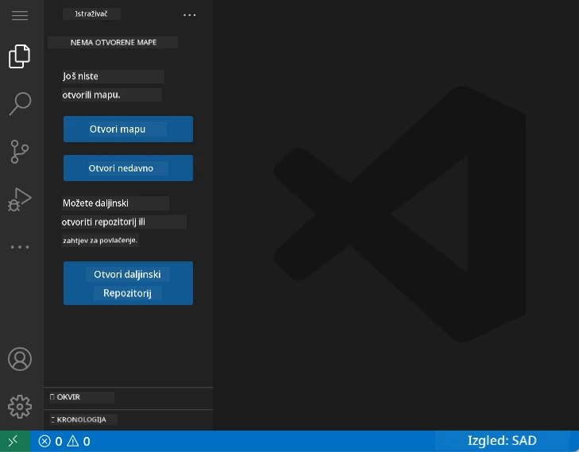

**Evo ture po susjedstvu:**  
- **Traka aktivnosti** (ona traka s lijeve strane): Glavna navigacija s Explorerom 📁, Pretraživanjem 🔍, Kontrolom izvora 🌿, Ekstenzijama 🧩 i Postavkama ⚙️  
- **Bočna traka** (panel pored nje): Mijenja se da vam pokaže relevantne informacije prema odabiru  
- **Područje uređivača** (veliki prostor u sredini): Tu se događa čarolija – vaše glavno područje za kodiranje

**Uzmite trenutak za istraživanje:**  
- Klikajte po ikonama na Traci aktivnosti i vidite što svaka radi  
- Primijetite kako se bočna traka ažurira s različitim informacijama – prilično zgodno, zar ne?  
- Pogled Explorera (📁) je mjesto gdje ćete vjerojatno provesti najviše vremena, stoga se upoznajte s njim

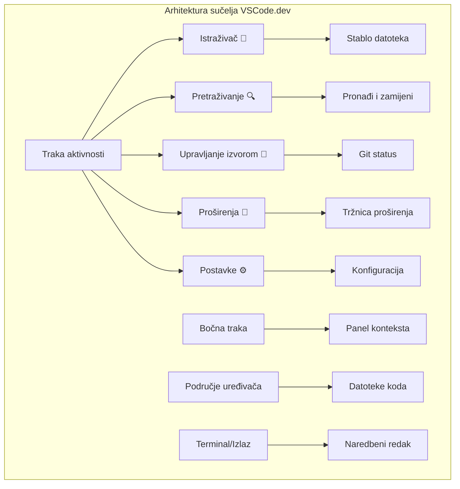
## Otvaranje GitHub repozitorija

Prije interneta, istraživači su morali fizički putovati do knjižnica kako bi pristupili dokumentima. GitHub repozitoriji funkcioniraju slično – to su zbirke koda pohranjene daljinski. VSCode.dev uklanja tradicionalni korak preuzimanja repozitorija na lokalno računalo prije uređivanja.

Ova mogućnost omogućuje neposredan pristup bilo kojem javnom repozitoriju za pregledavanje, uređivanje ili doprinos. Evo dva načina za otvaranje repozitorija:

### Metoda 1: Klikni i odaberi

Savršena je kada tek započinjete u VSCode.dev-u i želite otvoriti određeni repozitorij. Jednostavna je i prilagođena početnicima:

**Evo kako to učiniti:**

1. Otiđite na [vscode.dev](https://vscode.dev) ako već niste tamo  
2. Potražite gumb "Open Remote Repository" na početnom zaslonu i kliknite ga  

   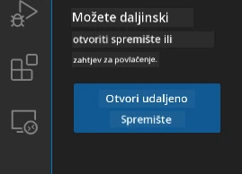

3. Zalijepite bilo koji URL GitHub repozitorija (probajte ovaj: `https://github.com/microsoft/Web-Dev-For-Beginners`)  
4. Pritisnite Enter i gledajte čaroliju!

**Pro savjet - Prečac do Command Palette-a:**

Želite li se osjećati kao čarobnjak kodiranja? Isprobajte ovaj prečac na tipkovnici: Ctrl+Shift+P (ili Cmd+Shift+P na Macu) za otvaranje Command Palette-a:

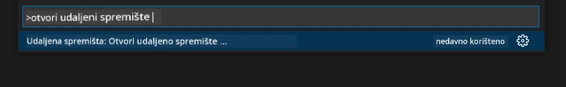

**Command Palette je kao tražilica za sve što možete napraviti:**  
- Upisite "open remote" i pronaći će otvoritelj repozitorija za vas  
- Pamti repozitorije koje ste nedavno otvorili (vrlo korisno!)  
- Kad se naviknete, osjećat ćete se kao da kodirate munjevitom brzinom  
- To je zapravo VSCode.dev-ova verzija "Hej Siri, ali za kodiranje"

### Metoda 2: Tehnika promjene URL-a

Baš kao što HTTP i HTTPS koriste različite protokole, a zadržavaju isti oblik domene, VSCode.dev koristi URL obrazac koji oponaša GitHub-ov sustav adresiranja. Bilo koji URL GitHub repozitorija može se modificirati da se otvori izravno u VSCode.dev-u.

**Obrazac transformacije URL-a:**

| Vrsta repozitorija | GitHub URL | VSCode.dev URL |
|--------------------|------------|----------------|
| **Javni repozitorij** | `github.com/microsoft/Web-Dev-For-Beginners` | `vscode.dev/github/microsoft/Web-Dev-For-Beginners` |
| **Osobni projekt** | `github.com/your-username/my-project` | `vscode.dev/github/your-username/my-project` |
| **Bilo koji dostupan repo** | `github.com/their-username/awesome-repo` | `vscode.dev/github/their-username/awesome-repo` |

**Implementacija:**  
- Zamijenite `github.com` s `vscode.dev/github`  
- Sve ostale dijelove URL-a ostavite nepromijenjenima  
- Radi s bilo kojim javno dostupnim repozitorijem  
- Omogućuje neposredan pristup uređivanju

> 💡 **Savjet koji mijenja život**: Dodajte u favorite VSCode.dev verzije svojih omiljenih repozitorija. Imam favorite poput "Edit My Portfolio" i "Fix Documentation" koji me voze izravno u način uređivanja!

**Koju metodu koristiti?**  
- **Putem sučelja**: Odlično kad istražujete ili ne pamtite točan naziv repozitorija  
- **URL trik**: Savršeno za munjeviti pristup kad točno znate gdje idete

### 🎯 Pedagoška provjera: Pristup razvoju u oblaku

**Zastanite i razmislite**: Upravo ste naučili dva načina za pristupanje kod repozitorijima putem web preglednika. Ovo predstavlja temeljnu promjenu u načinu razvoja softvera.

**Brza samoocjena**:  
- Možete li objasniti zašto web-bazirano uređivanje eliminira tradicionalno "postavljanje razvojne okoline"?  
- Koje prednosti pruža tehnika promjene URL-a u odnosu na lokalno kloniranje preko Gita?  
- Kako ovaj pristup mijenja način na koji biste mogli doprinositi otvorenim projektima?

**Povezanost sa stvarnim svijetom**: Velike tvrtke poput GitHub, GitLab i Replit izgradile su svoje razvojne platforme na ovim načelima baziranim na oblaku. Vi učite iste radne tokove koje koriste profesionalni razvojni timovi širom svijeta.

**Izazovno pitanje**: Kako bi razvoj baziran na oblaku mogao promijeniti način na koji se kodiranje podučava u školama? Razmotrite zahtjeve za uređajima, upravljanje softverom i mogućnosti suradnje.

## Rad s datotekama i projektima

Sad kad imate otvoren repozitorij, krenimo s izgradnjom! VSCode.dev daje sve što vam treba da stvarate, uređujete i organizirate svoje kodne datoteke. Razmislite o njemu kao o svojoj digitalnoj radionici – svaki alat je tamo gdje vam treba.

Zaronimo u svakodnevne zadatke koji će činiti većinu vašeg rasporeda kodiranja.

### Kreiranje novih datoteka

Baš kao što se plovila u arhitektovom uredu organiziraju, kreiranje datoteka u VSCode.dev-u slijedi strukturirani pristup. Sustav podržava sve standardne tipove datoteka za web razvoj.

**Proces kreiranja datoteke:**

1. Navigirajte do ciljnog foldera u bočnom pretraživaču (Explorer sidebar)  
2. Zadržite pokazivač na imenu foldera da se pojavi ikona "Nova datoteka" (📄+)  
3. Unesite ime datoteke uključujući odgovarajuću ekstenziju (`style.css`, `script.js`, `index.html`)  
4. Pritisnite Enter za stvaranje datoteke

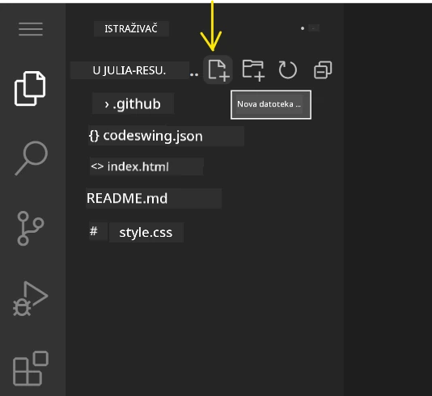

**Konvencije imenovanja:**  
- Koristite opisna imena koja označavaju svrhu datoteke  
- Uključite ekstenzije datoteka radi pravilnog isticanja sintakse  
- Slijedite dosljedne obrasce imenovanja kroz projekte  
- Koristite mala slova i crtice umjesto razmaka

### Uređivanje i spremanje datoteka

Evo gdje prava zabava počinje! Uređivač VSCode.dev je prepun korisnih značajki koje čine kodiranje glatkim i intuitivnim. Kao da imate zaista pametnog asistenta za pisanje, ali za kod.

**Vaš tijek rada za uređivanje:**  
1. Kliknite bilo koju datoteku u Exploreru da je otvorite u glavnom prostoru  
2. Počnite tipkati i gledajte kako vam VSCode.dev pomaže bojama, sugestijama i pronalaženjem pogrešaka  
3. Spremite posao sa Ctrl+S (Windows/Linux) ili Cmd+S (Mac) – iako se automatski sprema!

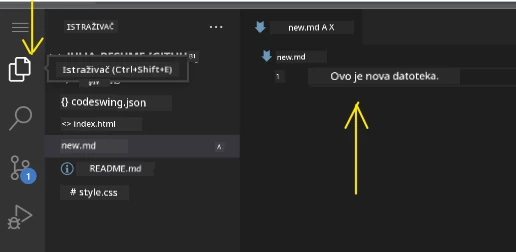

**Hladne stvari koje se događaju dok kodirate:**  
- Vaš kod je prekrasno obojen za lakše čitanje  
- VSCode.dev predlaže dovršetke dok tipkate (kao automatska ispravka, ali puno pametnije)  
- Uočava tipfeler i greške prije nego što uopće spremite  
- Možete imati više datoteka otvorenih u karticama, baš kao u pregledniku  
- Sve se automatski sprema u pozadini

> ⚠️ **Brzi savjet**: Iako je automatsko spremanje sjajno, navika pritiskanja Ctrl+S ili Cmd+S još je uvijek dobra. Odmah sprema sve i pokreće dodatne korisne funkcije poput provjere pogrešaka.

### Kontrola verzija s Gitom

Baš kao što arheolozi stvaraju detaljne zapise slojeva iskapanja, Git prati promjene u vašem kodu tijekom vremena. Taj sustav čuva povijest projekta i omogućava vraćanje na prethodne verzije kad je potrebno. VSCode.dev uključuje integriranu Git funkcionalnost.

**Sučelje kontrole izvora:**  
1. Pristupite panelu Kontrola izvora preko ikone 🌿 na Traci aktivnosti  
2. Izmijenjene datoteke pojavljuju se u odjeljku "Promjene"  
3. Boje označavaju tip promjene: zeleno za dodan tekst, crveno za izbrisano

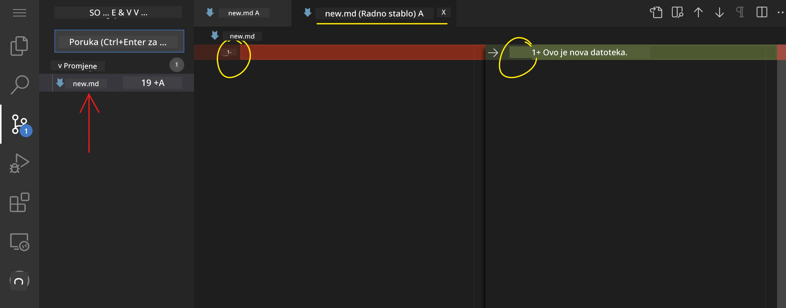

**Spremanje rada (workflow za commit):**

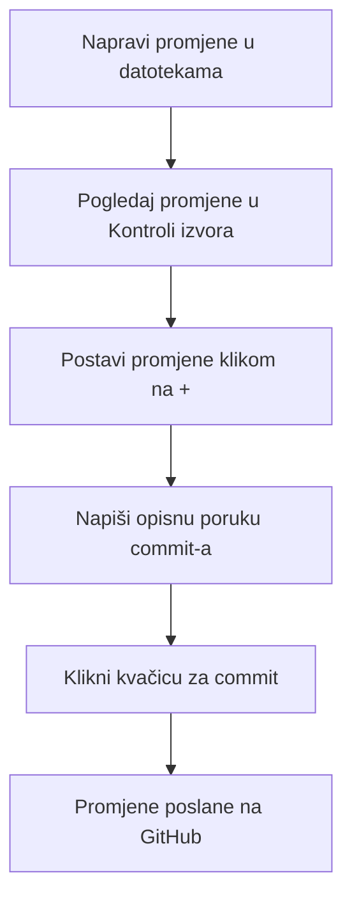
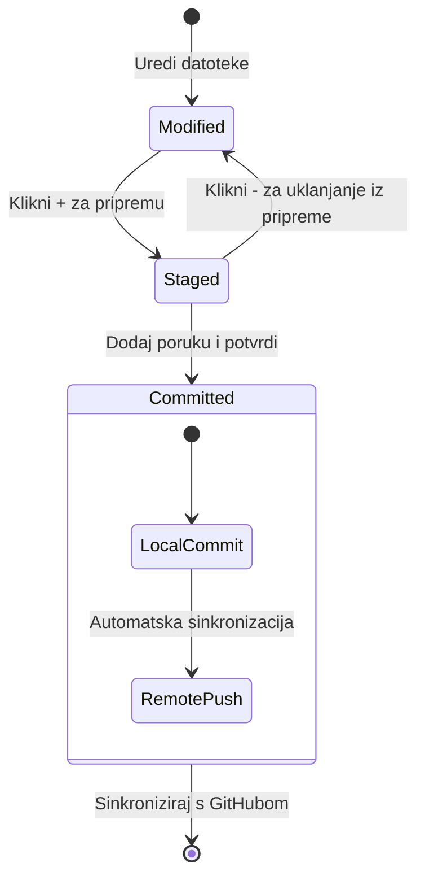
**Vaš korak-po-korak proces:**  
- Kliknite "+" ikonu pored datoteka koje želite spremiti (time ih "stage-ate")
- Dvaput provjerite jeste li zadovoljni sa svim pripremljenim promjenama  
- Napišite kratku bilješku u kojoj objašnjavate što ste napravili (to je vaša "poruka potvrde")  
- Kliknite na gumb s kvačicom da sve spremite na GitHub  
- Ako promijenite mišljenje, ikona za poništavanje omogućava vam da odbacite promjene  

**Pisanje dobrih poruka potvrda (to je lakše nego što mislite!):**  
- Jednostavno opišite što ste napravili, poput "Dodaj kontakt obrazac" ili "Popravi neispravnu navigaciju"  
- Držite ih kratkima i jasnima – duljine tvita, ne eseja  
- Počnite s radnjama poput "Dodaj", "Popravi", "Ažuriraj" ili "Ukloni"  
- **Dobri primjeri**: "Dodaj responzivni navigacijski meni", "Popravi probleme s mobilnim prikazom", "Ažuriraj boje radi bolje pristupačnosti"  

> 💡 **Brzi savjet za navigaciju**: Koristite hamburger meni (☰) u gornjem lijevom kutu da se brzo vratite u svoj GitHub repozitorij i vidite svoje potvrđene promjene online. Kao portal između vašeg okruženja za uređivanje i doma vašeg projekta na GitHubu!  

## Poboljšanje funkcionalnosti s proširenjima

Baš kao što radionica obrtnika sadrži specijalizirane alate za različite zadatke, VSCode.dev se može prilagoditi proširenjima koja dodaju specifične mogućnosti. Ti dodaci razvijeni od strane zajednice rješavaju uobičajene potrebe razvoja kao što su oblikovanje koda, živi pregled i poboljšana integracija Git-a.  

Tržište proširenja domaćin je tisućama besplatnih alata koje su stvorili programeri širom svijeta. Svako proširenje rješava određene izazove radnog toka, omogućujući vam da izgradite personalizirano razvojno okruženje prilagođeno vašim potrebama i preferencijama.  

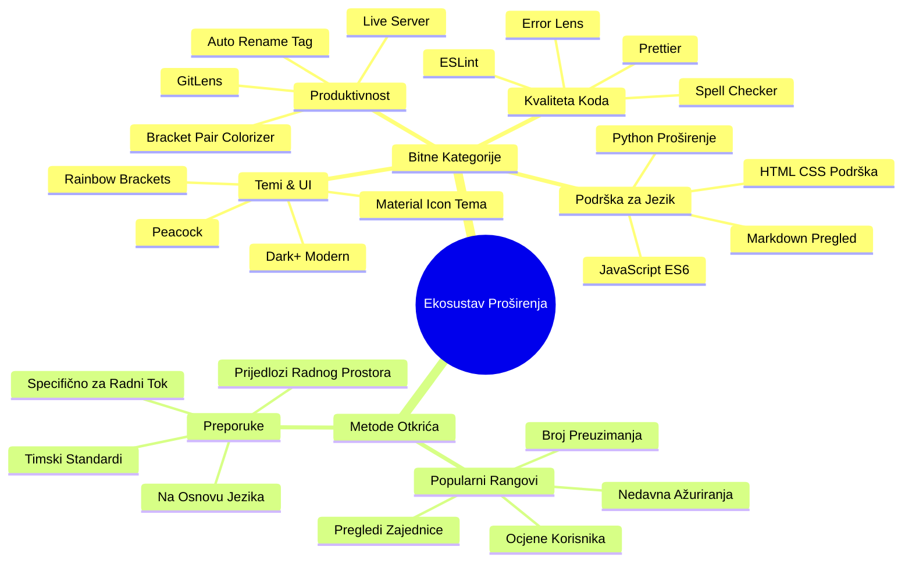
### Pronalazak vaših savršenih proširenja  

Tržište proširenja je zaista dobro organizirano, pa se nećete izgubiti tražeći ono što vam treba. Dizajnirano je da vam pomogne otkriti i specifične alate i zanimljive stvari za koje niste ni znali!  

**Kako doći do tržišta proširenja:**  

1. Kliknite ikonu Proširenja (🧩) na Traci aktivnosti  
2. Pregledavajte ili pretražujte nešto specifično  
3. Kliknite na bilo što što izgleda zanimljivo da biste saznali više  

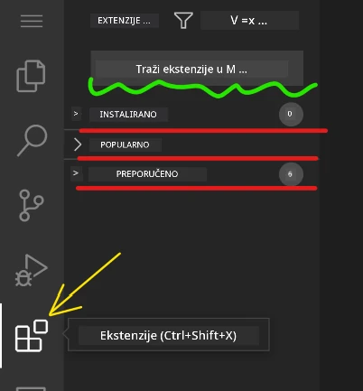  

**Što ćete tamo vidjeti:**  

| Sekcija | Što se nalazi | Zašto je korisno |  
|----------|---------------|-----------------|  
| **Instalirano** | Proširenja koja ste već dodali | Vaš osobni alatni set za kodiranje |  
| **Popularno** | Favoriti mase | Na što se većina programera pouzdaje |  
| **Preporučeno** | Pametne preporuke za vaš projekt | Korisni savjeti VSCode.dev-a |  

**Što olakšava pregledavanje:**  
- Svako proširenje prikazuje ocjene, broj preuzimanja i recenzije stvarnih korisnika  
- Dobivate snimke zaslona i jasne opise što svako radi  
- Sve je jasno označeno informacijama o kompatibilnosti  
- Predlažu se slična proširenja za usporedbu opcija  

### Instalacija proširenja (vrlo je jednostavno!)  

Dodavanje novih mogućnosti vašem uređivaču jednostavno je kao klik na gumb. Proširenja se instaliraju za nekoliko sekundi i odmah počinju raditi – bez ponovnih pokretanja i čekanja.  

**Sve što trebate učiniti:**  

1. Pretražite što želite (probajte "live server" ili "prettier")  
2. Kliknite na ono što vam se sviđa za više detalja  
3. Pročitajte što radi i provjerite ocjene  
4. Pritisnite plavi gumb "Install" i gotovo!  

  

**Što se događa iza scene:**  
- Proširenje se automatski preuzima i postavlja  
- Nove značajke odmah se pojavljuju u sučelju  
- Sve počinje raditi odmah (ozbiljno, toliko je brzo!)  
- Ako ste prijavljeni, proširenje se sinkronizira na svim vašim uređajima  

**Neka proširenja koja bih preporučio da počnete koristiti:**  
- **Live Server**: Vidi svoje web stranice ažurirane u stvarnom vremenu dok kodiraš (ovo je čarobno!)  
- **Prettier**: Automatski čisti i profesionalizira tvoj kod  
- **Auto Rename Tag**: Promijeni jedan HTML tag, a njegov partner se također ažurira  
- **Bracket Pair Colorizer**: Boja označava vaše zagrade da se nikada ne izgubite  
- **GitLens**: Nadograđuje vaše Git funkcije s gomilom korisnih informacija  

### Prilagođavanje vaših proširenja  

Većina proširenja dolazi s postavkama koje možete podesiti kako bi radila točno onako kako želite. Zamislite to kao podešavanje sjedala i retrovizora u automobilu – svatko ima svoje preferencije!  

**Podešavanje postavki proširenja:**  

1. Pronađite instalirano proširenje u panelu Proširenja  
2. Potražite malu ikonu zupčanika (⚙️) pored imena i kliknite na nju  
3. Izaberite "Extension Settings" iz padajućeg izbornika  
4. Prilagodite dok vam radni tok ne odgovara savršeno  

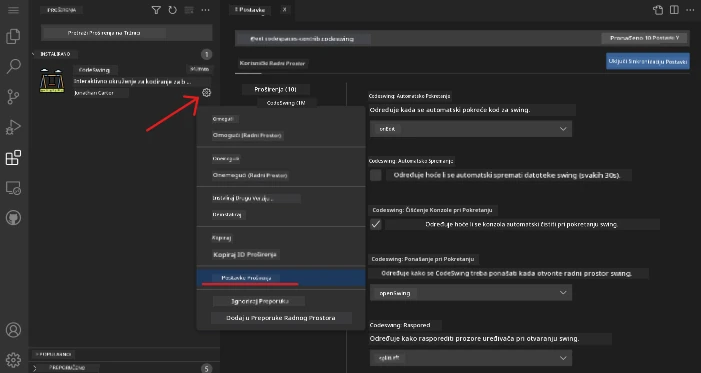  

**Česte stvari koje ćete možda htjeti podesiti:**  
- Kako se vaš kod formatira (tabovi vs razmaci, duljina linije, itd.)  
- Koje prečace na tipkovnici pokreću različite radnje  
- S kojim vrstama datoteka proširenje treba raditi  
- Uključivanje ili isključivanje određenih značajki da bi sučelje bilo čisto  

### Održavanje organizacije vaših proširenja  

Kako otkrivate sve više cool proširenja, htjet ćete održati svoju kolekciju urednom i da sve teče glatko. VSCode.dev ovo čini vrlo lako za upravljanje.  

**Vaše opcije upravljanja proširenjima:**  

| Što možete učiniti | Kada je korisno | Profesionalni savjet |  
|--------------------|-----------------|---------------------|  
| **Onemogući** | Testirate je li proširenje uzrok problema | Bolje od deinstalacije ako možda želite vratiti |  
| **Deinstaliraj** | Potpuno uklanjanje proširenja koja ne trebate | Održava okruženje čistim i brzim |  
| **Ažuriraj** | Dobivanje najnovijih značajki i ispravaka | Obično se događa automatski, ali vrijedi provjeriti |  

**Kako ja volim upravljati proširenjima:**  
- Svakih nekoliko mjeseci pregledavam što sam instalirao i uklonim ono što ne koristim  
- Održavam proširenja ažurnima da imam najnovija poboljšanja i sigurnosne ispravke  
- Ako nešto usporava, privremeno onemogućim proširenja da vidim je li štogod krivac  
- Čitam bilješke o ažuriranjima kod velikih nadogradnji – ponekad imaju super nove značajke!  

> ⚠️ **Savjet za performanse**: Proširenja su sjajna, ali previše njih može usporiti vaš uređivač. Fokusirajte se na ona koja vam stvarno olakšavaju život i ne bojte se deinstalirati ona koja nikada ne koristite.  

### 🎯 Pedagoški pregled: Prilagodba razvojnog okruženja  

**Razumijevanje arhitekture**: Naučili ste kako prilagoditi profesionalno razvojno okruženje koristeći proširenja stvorena od strane zajednice. Ovo odražava kako timovi u poduzećima grade standardizirane alate.  

**Ključni usvojeni pojmovi**:  
- **Pronalaženje proširenja**: Pronalazak alata koji rješavaju specifične razvojne izazove  
- **Konfiguracija okruženja**: Prilagođavanje alata osobnim ili timskim preferencijama  
- **Optimizacija performansi**: Balansiranje funkcionalnosti i performansi sustava  
- **Zajednički rad zajednice**: Korištenje alata koje je stvorila globalna zajednica programera  

**Povezanost s industrijom**: Ekosustavi proširenja pokreću glavne razvojne platforme poput VS Code, Chrome DevTools i modernih IDE-a. Razumijevanje kako evaluirati, instalirati i konfigurirati proširenja ključno je za profesionalne razvojne tokove.  

**Pitanje za razmišljanje**: Kako biste pristupili uspostavljanju standardiziranog razvojog okruženja za tim od 10 developera? Razmotrite dosljednost, performanse i individualne preferencije.  

## 📈 Vaša vremenska crta usavršavanja u razvoju u oblaku  

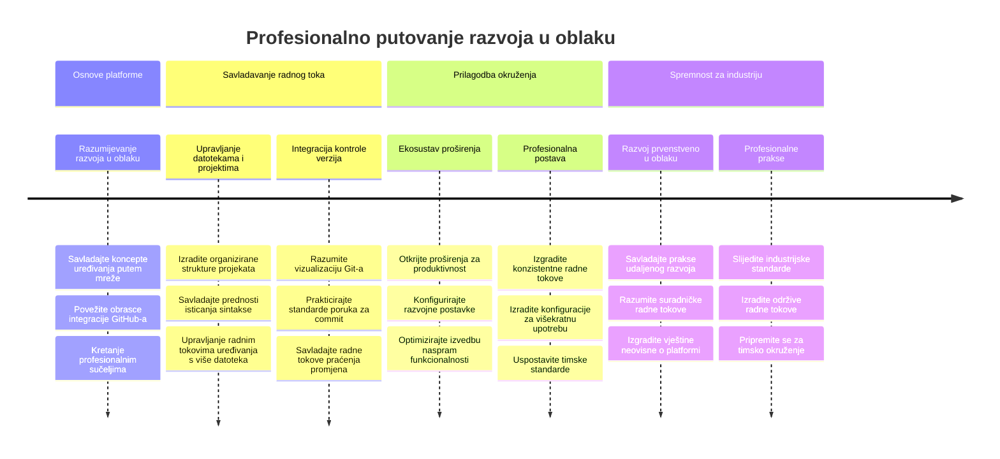
**🎓 Prekretnica diplomiranja**: Uspješno ste svladali razvoj u oblaku koristeći iste alate i tokove rada koje koriste profesionalni developeri u velikim tehnološkim tvrtkama. Te vještine predstavljaju budućnost razvoja softvera.  

**🔄 Sljedeće razine sposobnosti:**  
- Spremni za istraživanje naprednih platformi za razvoj u oblaku (Codespaces, GitPod)  
- Pripremljeni za rad u distribuiranim razvojnim timovima  
- Opremljeni za doprinos open source projektima na globalnoj razini  
- Postavljena osnova za moderne DevOps i prakse kontinuirane integracije  

## Izazov GitHub Copilot agenta 🚀  

Kao što NASA koristi strukturirani pristup za svemirske misije, ovaj izazov uključuje sustavnu primjenu vještina VSCode.dev-a u potpunom scenariju radnog toka.  

**Cilj:** Demonstrirati vještinu korištenja VSCode.dev-a uspostavljanjem sveobuhvatnog web razvojničkog radnog toka.  

**Zahtjevi projekta:** Uz pomoć Agent moda, dovršite ove zadatke:  
1. Napravite fork postojećeg repozitorija ili stvorite novi  
2. Uspostavite funkcionalnu strukturu projekta s HTML, CSS i JavaScript datotekama  
3. Instalirajte i konfigurirajte tri proširenja za poboljšanje razvoja  
4. Vježbajte kontrolu verzija s opisnim porukama potvrde  
5. Eksperimentirajte s kreiranjem i izmjenom feature grana  
6. Dokumentirajte proces i naučeno u README.md datoteci  

Ova vježba konsolidira sve VSCode.dev koncepte u praktični radni tok koji se može primijeniti na buduće razvojne projekte.  

Saznajte više o [agent modu](https://code.visualstudio.com/blogs/2025/02/24/introducing-copilot-agent-mode) ovdje.  

## Zadatak  

Vrijeme je da ove vještine stavite na pravi test! Imam praktični projekt koji će vam omogućiti da vježbate sve što smo pokrili: [Izradite web stranicu životopisa koristeći VSCode.dev](./assignment.md)  

Ovaj zadatak vodi vas kroz izradu profesionalne web stranice životopisa potpuno u pregledniku. Koristit ćete sve VSCode.dev značajke koje smo istražili, a na kraju ćete imati i izvrsnu web stranicu i snažno samopouzdanje u svoj novi radni tok.  

## Nastavite istraživati i razvijati svoje vještine  

Imate sada solidnu osnovu, ali postoji još toliko zanimljivih stvari za otkriti! Evo nekoliko izvora i ideja za podizanje vaših VSCode.dev vještina na višu razinu:  

**Službena dokumentacija koju vrijedi označiti:**  
- [VSCode Web Dokumentacija](https://code.visualstudio.com/docs/editor/vscode-web?WT.mc_id=academic-0000-alfredodeza) – Potpuni vodič za uređivanje u pregledniku  
- [GitHub Codespaces](https://docs.github.com/en/codespaces) – Za one koji žele još moćnije mogućnosti u oblaku  

**Zanimljive značajke za sljedeće isprobati:**  
- **Tipkovnički prečaci**: Naučite kombinacije tipki koje će vas učiniti vještim kao ninja kodiranja  
- **Postavke radnog prostora**: Postavite različita okruženja za različite vrste projekata  
- **Višekorijenski radni prostori**: Radite na više repozitorija istovremeno (super praktično!)  
- **Integracija terminala**: Pristupite alatima naredbenog retka direktno u pregledniku  

**Ideje za vježbu:**  
- Uključite se u open source projekte i doprinosite koristeći VSCode.dev – izvrstan način da se vratite zajednici!  
- Isprobajte različita proširenja da pronađete idealnu postavku za sebe  
- Kreirajte predloške projekata za vrste stranica koje najčešće gradite  
- Vježbajte Git tokove rada poput grananja i spajanja – te vještine su zlato u timskim projektima  

---  

**Savladali ste razvoj u pregledniku!** 🎉 Kao što je izum prijenosnih instrumenata omogućio znanstvenicima istraživanje na udaljenim lokacijama, VSCode.dev omogućava profesionalno kodiranje s bilo kojeg uređaja povezanog na internet.  

Te vještine odražavaju suvremene industrijske prakse – mnogi profesionalni developeri koriste razvojna okruženja u oblaku zbog njihove fleksibilnosti i pristupačnosti. Naučili ste radni tok koji se može skalirati od individualnih projekata do velikih timskih suradnji.  

Primijenite ove tehnike u svom sljedećem razvojnom projektu! 🚀

---

<!-- CO-OP TRANSLATOR DISCLAIMER START -->
**Izjava o odricanju odgovornosti**:
Ovaj dokument je preveden korištenjem AI prevoditeljskog servisa [Co-op Translator](https://github.com/Azure/co-op-translator). Iako težimo točnosti, imajte na umu da automatski prijevodi mogu sadržavati pogreške ili netočnosti. Izvorni dokument na izvornom jeziku treba smatrati autoritativnim izvorom. Za kritične informacije preporučuje se profesionalni ljudski prijevod. Ne snosimo odgovornost za bilo kakva nesporazume ili krivo tumačenje proizašla iz korištenja ovog prijevoda.
<!-- CO-OP TRANSLATOR DISCLAIMER END -->