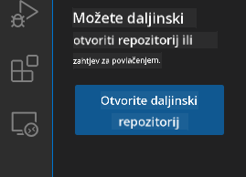
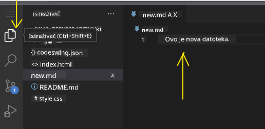
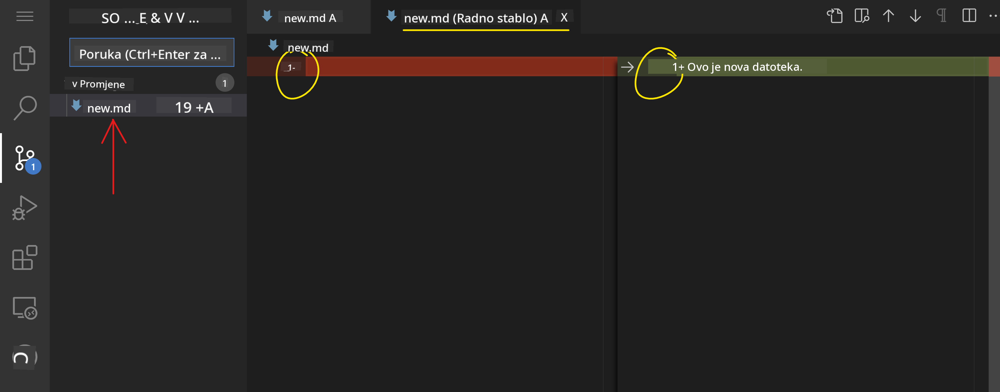
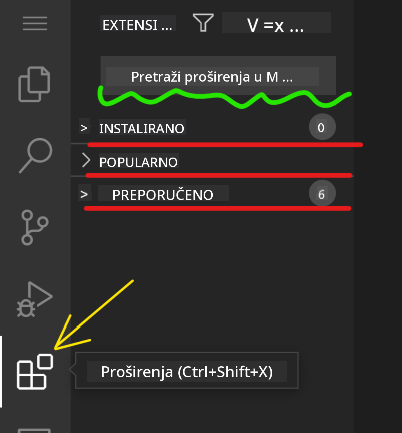
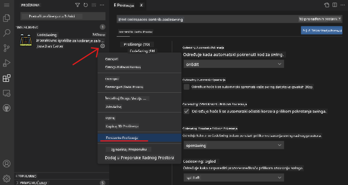

<!--
CO_OP_TRANSLATOR_METADATA:
{
  "original_hash": "1ba61d96a11309a2a6ea507496dcf7e5",
  "translation_date": "2025-08-29T12:38:45+00:00",
  "source_file": "8-code-editor/1-using-a-code-editor/README.md",
  "language_code": "hr"
}
-->
# Korištenje uređivača koda

Ova lekcija pokriva osnove korištenja [VSCode.dev](https://vscode.dev), web-baziranog uređivača koda, kako biste mogli mijenjati svoj kod i doprinositi projektu bez instaliranja bilo čega na svoje računalo.

## Ciljevi učenja

U ovoj lekciji naučit ćete:

- Kako koristiti uređivač koda u projektu
- Kako pratiti promjene pomoću verzioniranja
- Kako prilagoditi uređivač za razvoj

### Preduvjeti

Prije nego što počnete, trebate kreirati račun na [GitHub](https://github.com). Posjetite [GitHub](https://github.com/) i kreirajte račun ako ga već nemate.

### Uvod

Uređivač koda je ključni alat za pisanje programa i suradnju na postojećim projektima kodiranja. Kada razumijete osnove uređivača i kako koristiti njegove značajke, moći ćete ih primijeniti pri pisanju koda.

## Početak rada s VSCode.dev

[VSCode.dev](https://vscode.dev) je uređivač koda na webu. Ne trebate instalirati ništa da biste ga koristili, baš kao da otvarate bilo koju drugu web stranicu. Za početak rada s uređivačem, otvorite sljedeći link: [https://vscode.dev](https://vscode.dev). Ako niste prijavljeni na [GitHub](https://github.com/), slijedite upute za prijavu ili kreiranje novog računa, a zatim se prijavite.

Kada se učita, trebao bi izgledati slično ovoj slici:


Postoje tri glavna dijela, počevši od krajnje lijeve strane prema desno:

1. _Traka aktivnosti_ koja uključuje neke ikone, poput povećala 🔎, zupčanika ⚙️ i nekoliko drugih.
2. Proširena traka aktivnosti koja prema zadanim postavkama prikazuje _Explorer_, nazvana _bočna traka_.
3. I na kraju, područje koda s desne strane.

Kliknite na svaku od ikona kako biste prikazali različite izbornike. Kada završite, kliknite na _Explorer_ kako biste se vratili na početnu točku.

Kada počnete stvarati kod ili mijenjati postojeći kod, to će se događati u najvećem području s desne strane. Ovo područje koristit ćete i za vizualizaciju postojećeg koda, što ćete učiniti sljedeće.

## Otvaranje GitHub repozitorija

Prvo što trebate učiniti je otvoriti GitHub repozitorij. Postoji više načina za otvaranje repozitorija. U ovom dijelu vidjet ćete dva različita načina kako možete otvoriti repozitorij i započeti rad na promjenama.

### 1. Korištenjem uređivača

Koristite sam uređivač za otvaranje udaljenog repozitorija. Ako odete na [VSCode.dev](https://vscode.dev), vidjet ćete gumb _"Open Remote Repository"_:



Također možete koristiti paletu naredbi. Paleta naredbi je okvir za unos u koji možete upisati bilo koju riječ koja je dio naredbe ili akcije kako biste pronašli odgovarajuću naredbu za izvršenje. Koristite izbornik u gornjem lijevom kutu, zatim odaberite _View_, a potom _Command Palette_, ili koristite sljedeću tipkovničku prečicu: Ctrl-Shift-P (na MacOS-u bi to bilo Command-Shift-P).


Kada se izbornik otvori, upišite _open remote repository_, a zatim odaberite prvu opciju. Više repozitorija u kojima sudjelujete ili koje ste nedavno otvorili će se prikazati. Također možete koristiti puni GitHub URL za odabir jednog. Koristite sljedeći URL i zalijepite ga u okvir:

```
https://github.com/microsoft/Web-Dev-For-Beginners
```

✅ Ako je uspješno, vidjet ćete sve datoteke tog repozitorija učitane u uređivaču teksta.

### 2. Korištenjem URL-a

Također možete koristiti URL izravno za učitavanje repozitorija. Na primjer, puni URL za trenutni repozitorij je [https://github.com/microsoft/Web-Dev-For-Beginners](https://github.com/microsoft/Web-Dev-For-Beginners), ali možete zamijeniti GitHub domenu s `VSCode.dev/github` i učitati repozitorij izravno. Rezultirajući URL bio bi [https://vscode.dev/github/microsoft/Web-Dev-For-Beginners](https://vscode.dev/github/microsoft/Web-Dev-For-Beginners).

## Uređivanje datoteka

Kada otvorite repozitorij u pregledniku/vscode.dev, sljedeći korak je ažuriranje ili izmjena projekta.

### 1. Kreiranje nove datoteke

Možete kreirati datoteku unutar postojećeg foldera ili je kreirati u glavnom direktoriju/folderu. Za kreiranje nove datoteke, otvorite lokaciju/direktorij u koji želite spremiti datoteku i odaberite ikonu _'New file ...'_ na traci aktivnosti _(lijevo)_, dodijelite joj ime i pritisnite enter.


### 2. Uređivanje i spremanje datoteke u repozitoriju

Korištenje vscode.dev je korisno kad god želite brzo ažurirati svoj projekt bez potrebe za lokalnim učitavanjem softvera.  
Za ažuriranje koda, kliknite na ikonu 'Explorer', također smještenu na traci aktivnosti, kako biste vidjeli datoteke i foldere u repozitoriju.  
Odaberite datoteku kako biste je otvorili u području koda, napravite promjene i spremite.



Kada završite s ažuriranjem projekta, odaberite ikonu _`source control`_ koja sadrži sve nove promjene koje ste napravili u svom repozitoriju.

Za pregled promjena koje ste napravili u projektu, odaberite datoteku(e) u folderu `Changes` na proširenoj traci aktivnosti. Ovo će otvoriti 'Working Tree' kako biste vizualno vidjeli promjene koje ste napravili u datoteci. Crvena boja označava uklanjanje iz projekta, dok zelena označava dodavanje.



Ako ste zadovoljni promjenama koje ste napravili, zadržite pokazivač na folderu `Changes` i kliknite gumb `+` kako biste pripremili promjene za predaju. Priprema znači pripremanje vaših promjena za predaju na GitHub.

Ako, međutim, niste zadovoljni nekim promjenama i želite ih odbaciti, zadržite pokazivač na folderu `Changes` i odaberite ikonu `undo`.

Zatim upišite `commit message` _(Opis promjene koju ste napravili u projektu)_, kliknite ikonu `check` kako biste predali i poslali svoje promjene.

Kada završite s radom na projektu, odaberite ikonu `hamburger menu` u gornjem lijevom kutu kako biste se vratili na repozitorij na github.com.


## Korištenje ekstenzija

Instaliranje ekstenzija na VSCode omogućuje dodavanje novih značajki i prilagodbu opcija razvojnog okruženja u uređivaču kako biste poboljšali tijek rada. Ove ekstenzije također pomažu dodati podršku za više programskih jezika i često su generičke ili specifične za određeni jezik.

Za pregled popisa svih dostupnih ekstenzija, kliknite na ikonu _`Extensions`_ na traci aktivnosti i počnite upisivati ime ekstenzije u tekstualno polje označeno _'Search Extensions in Marketplace'_.  
Vidjet ćete popis ekstenzija, od kojih svaka sadrži **ime ekstenzije, ime izdavača, kratki opis, broj preuzimanja** i **ocjenu zvjezdicama**.


Također možete pregledati sve prethodno instalirane ekstenzije proširivanjem foldera _`Installed`_, popularne ekstenzije koje koriste većina developera u folderu _`Popular`_ i preporučene ekstenzije za vas, bilo od korisnika u istom radnom prostoru ili na temelju vaših nedavno otvorenih datoteka, u folderu _`Recommended`_.



### 1. Instaliranje ekstenzija

Za instaliranje ekstenzije, upišite ime ekstenzije u polje za pretraživanje i kliknite na nju kako biste vidjeli dodatne informacije o ekstenziji u području koda kada se pojavi na proširenoj traci aktivnosti.

Možete kliknuti _plavi gumb za instalaciju_ na proširenoj traci aktivnosti za instalaciju ili koristiti gumb za instalaciju koji se pojavljuje u području koda kada odaberete ekstenziju za učitavanje dodatnih informacija.


### 2. Prilagodba ekstenzija

Nakon instaliranja ekstenzije, možda ćete trebati prilagoditi njezino ponašanje i prilagoditi je prema svojim preferencijama. Za to, odaberite ikonu Extensions, a ovaj put vaša ekstenzija će se pojaviti u folderu _Installed_, kliknite na _**ikonu zupčanika**_ i navigirajte do _Extensions Setting_.



### 3. Upravljanje ekstenzijama

Nakon instaliranja i korištenja ekstenzije, vscode.dev nudi opcije za upravljanje ekstenzijom prema različitim potrebama. Na primjer, možete odabrati:

- **Onemogućiti:** _(Privremeno onemogućite ekstenziju kada vam više nije potrebna, ali je ne želite potpuno deinstalirati)_

    Odaberite instaliranu ekstenziju na proširenoj traci aktivnosti > kliknite ikonu zupčanika > odaberite 'Disable' ili 'Disable (Workspace)' **ILI** otvorite ekstenziju u području koda i kliknite plavi gumb Disable.

- **Deinstalirati:** Odaberite instaliranu ekstenziju na proširenoj traci aktivnosti > kliknite ikonu zupčanika > odaberite 'Uninstall' **ILI** otvorite ekstenziju u području koda i kliknite plavi gumb Uninstall.

---

## Zadatak

[Izradite web stranicu životopisa koristeći vscode.dev](https://github.com/microsoft/Web-Dev-For-Beginners/blob/main/8-code-editor/1-using-a-code-editor/assignment.md)

## Pregled i samostalno učenje

Pročitajte više o [VSCode.dev](https://code.visualstudio.com/docs/editor/vscode-web?WT.mc_id=academic-0000-alfredodeza) i nekim njegovim drugim značajkama.

---

**Odricanje od odgovornosti**:  
Ovaj dokument je preveden pomoću AI usluge za prevođenje [Co-op Translator](https://github.com/Azure/co-op-translator). Iako nastojimo osigurati točnost, imajte na umu da automatski prijevodi mogu sadržavati pogreške ili netočnosti. Izvorni dokument na izvornom jeziku treba smatrati autoritativnim izvorom. Za ključne informacije preporučuje se profesionalni prijevod od strane čovjeka. Ne preuzimamo odgovornost za bilo kakve nesporazume ili pogrešne interpretacije koje proizlaze iz korištenja ovog prijevoda.