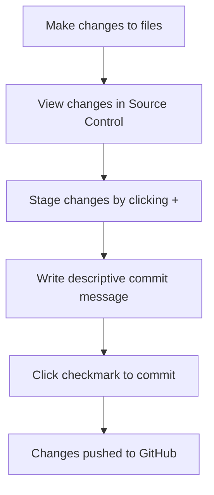

<!--
CO_OP_TRANSLATOR_METADATA:
{
  "original_hash": "cfd4a15974168ca426d50c67682ab9d4",
  "translation_date": "2025-10-24T23:50:05+00:00",
  "source_file": "8-code-editor/1-using-a-code-editor/README.md",
  "language_code": "hr"
}
-->
# Korištenje uređivača koda: Savladavanje VSCode.dev-a

Sjećate li se u *Matrixu* kada se Neo morao spojiti na ogromni računalni terminal kako bi pristupio digitalnom svijetu? Današnji alati za web razvoj su potpuno suprotni – nevjerojatno moćni alati dostupni s bilo kojeg mjesta. VSCode.dev je uređivač koda temeljen na pregledniku koji donosi profesionalne alate za razvoj na bilo koji uređaj s internetskom vezom.

Baš kao što je tiskarski stroj učinio knjige dostupnima svima, a ne samo pisarima u samostanima, VSCode.dev demokratizira kodiranje. Možete raditi na projektima s računala u knjižnici, školskom laboratoriju ili bilo gdje gdje imate pristup pregledniku. Bez instalacija, bez ograničenja poput "trebam svoj specifični setup".

Na kraju ove lekcije, razumjet ćete kako se kretati kroz VSCode.dev, otvarati GitHub repozitorije izravno u pregledniku i koristiti Git za kontrolu verzija – sve vještine na koje se profesionalni programeri oslanjaju svakodnevno.

## Što ćete naučiti

Nakon što zajedno prođemo kroz ovo, moći ćete:

- Snalaziti se u VSCode.dev kao da je vaš drugi dom – pronalaziti sve što vam treba bez gubljenja
- Otvoriti bilo koji GitHub repozitorij u pregledniku i odmah početi uređivati (ovo je stvarno magično!)
- Koristiti Git za praćenje promjena i spremanje napretka kao profesionalac
- Poboljšati svoj uređivač ekstenzijama koje ubrzavaju i čine kodiranje zabavnijim
- Kreirati i organizirati datoteke projekta s povjerenjem

## Što vam je potrebno

Zahtjevi su jednostavni:

- Besplatan [GitHub račun](https://github.com) (vodit ćemo vas kroz proces kreiranja ako je potrebno)
- Osnovno poznavanje web preglednika
- Lekcija o osnovama GitHuba pruža korisnu pozadinu, iako nije nužna

> 💡 **Novi ste na GitHubu?** Kreiranje računa je besplatno i traje nekoliko minuta. Kao što knjižnična iskaznica omogućuje pristup knjigama diljem svijeta, GitHub račun otvara vrata repozitorijima koda na internetu.

## Zašto su uređivači koda temeljeni na webu važni

Prije interneta, znanstvenici na različitim sveučilištima nisu mogli lako dijeliti istraživanja. Zatim je došao ARPANET 1960-ih, povezujući računala na udaljenostima. Uređivači koda temeljeni na webu slijede isti princip – čine moćne alate dostupnima bez obzira na vašu fizičku lokaciju ili uređaj.

Uređivač koda služi kao vaš radni prostor za razvoj, gdje pišete, uređujete i organizirate datoteke koda. Za razliku od jednostavnih uređivača teksta, profesionalni uređivači koda pružaju isticanje sintakse, otkrivanje grešaka i značajke upravljanja projektima.

VSCode.dev donosi ove mogućnosti u vaš preglednik:

**Prednosti uređivanja temeljenog na webu:**

| Značajka | Opis | Praktična korist |
|----------|------|------------------|
| **Neovisnost o platformi** | Radi na bilo kojem uređaju s preglednikom | Rad s različitih računala bez problema |
| **Nema potrebe za instalacijom** | Pristup putem web URL-a | Zaobilazi ograničenja instalacije softvera |
| **Automatska ažuriranja** | Uvijek koristi najnoviju verziju | Pristup novim značajkama bez ručnih ažuriranja |
| **Integracija s repozitorijem** | Izravna povezanost s GitHubom | Uređivanje koda bez lokalnog upravljanja datotekama |

**Praktične implikacije:**
- Kontinuitet rada u različitim okruženjima
- Dosljedno sučelje bez obzira na operativni sustav
- Mogućnosti trenutne suradnje
- Smanjeni zahtjevi za lokalnu pohranu

## Istraživanje VSCode.dev-a

Baš kao što je laboratorij Marie Curie sadržavao sofisticiranu opremu u relativno jednostavnom prostoru, VSCode.dev pakira profesionalne alate za razvoj u sučelje preglednika. Ova web aplikacija pruža istu osnovnu funkcionalnost kao i uređivači koda za stolna računala.

Započnite navigacijom na [vscode.dev](https://vscode.dev) u svom pregledniku. Sučelje se učitava bez preuzimanja ili instalacije sustava – izravna primjena principa računalstva u oblaku.

### Povezivanje vašeg GitHub računa

Baš kao što je telefon Alexandera Grahama Bella povezivao udaljene lokacije, povezivanje vašeg GitHub računa spaja VSCode.dev s vašim repozitorijima koda. Kada se od vas zatraži da se prijavite na GitHub, preporučuje se prihvaćanje ove veze.

**Integracija s GitHubom omogućuje:**
- Izravan pristup vašim repozitorijima unutar uređivača
- Sinkronizirane postavke i ekstenzije na različitim uređajima
- Pojednostavljeni tijek spremanja na GitHub
- Personalizirano razvojno okruženje

### Upoznavanje vašeg novog radnog prostora

Kada se sve učita, vidjet ćete prekrasno čisto radno okruženje dizajnirano da vas usmjeri na ono što je važno – vaš kod!

**Evo vašeg obilaska susjedstva:**
- **Traka aktivnosti** (ona traka s lijeve strane): Vaša glavna navigacija s Explorerom 📁, Pretraživanjem 🔍, Kontrolom izvora 🌿, Ekstenzijama 🧩 i Postavkama ⚙️
- **Bočna traka** (panel pored nje): Mijenja se kako bi vam prikazala relevantne informacije na temelju onoga što ste odabrali
- **Područje uređivača** (veliki prostor u sredini): Ovdje se događa magija – vaš glavni prostor za kodiranje

**Odvojite trenutak za istraživanje:**
- Kliknite na ikone na traci aktivnosti i pogledajte što svaka od njih radi
- Primijetite kako se bočna traka ažurira kako bi prikazala različite informacije – prilično zgodno, zar ne?
- Pogled na Explorer (📁) vjerojatno će biti mjesto gdje ćete provoditi većinu vremena, pa se udobno smjestite

## Otvaranje GitHub repozitorija

Prije interneta, istraživači su morali fizički putovati u knjižnice kako bi pristupili dokumentima. GitHub repozitoriji funkcioniraju slično – to su zbirke koda pohranjene na daljinu. VSCode.dev eliminira tradicionalni korak preuzimanja repozitorija na vaše lokalno računalo prije uređivanja.

Ova mogućnost omogućuje trenutni pristup bilo kojem javnom repozitoriju za pregled, uređivanje ili doprinos. Evo dva načina za otvaranje repozitorija:

### Metoda 1: Klikni i otvori

Ovo je savršeno kada tek započinjete s VSCode.dev-om i želite otvoriti određeni repozitorij. Jednostavno je i prilagođeno početnicima:

**Kako to učiniti:**

1. Idite na [vscode.dev](https://vscode.dev) ako već niste tamo
2. Potražite gumb "Open Remote Repository" na početnom zaslonu i kliknite ga

   

3. Zalijepite URL bilo kojeg GitHub repozitorija (probajte ovaj: `https://github.com/microsoft/Web-Dev-For-Beginners`)
4. Pritisnite Enter i gledajte magiju!

**Savjet za profesionalce - Prečac za Command Palette:**

Želite se osjećati kao čarobnjak za kodiranje? Isprobajte ovu tipkovničku prečicu: Ctrl+Shift+P (ili Cmd+Shift+P na Macu) za otvaranje Command Palette:

**Command Palette je kao tražilica za sve što možete učiniti:**
- Upišite "open remote" i pronaći će otvarač repozitorija za vas
- Pamti repozitorije koje ste nedavno otvorili (super korisno!)
- Kad se naviknete na to, osjećat ćete se kao da kodirate brzinom svjetlosti
- To je u osnovi VSCode.dev-ova verzija "Hej Siri, ali za kodiranje"

### Metoda 2: Tehnika izmjene URL-a

Baš kao što HTTP i HTTPS koriste različite protokole dok zadržavaju istu strukturu domene, VSCode.dev koristi obrazac URL-a koji odražava GitHub-ov sustav adresiranja. Bilo koji URL GitHub repozitorija može se izmijeniti kako bi se otvorio izravno u VSCode.dev.

**Obrazac transformacije URL-a:**

| Vrsta repozitorija | GitHub URL | VSCode.dev URL |
|--------------------|------------|----------------|
| **Javni repozitorij** | `github.com/microsoft/Web-Dev-For-Beginners` | `vscode.dev/github/microsoft/Web-Dev-For-Beginners` |
| **Osobni projekt** | `github.com/your-username/my-project` | `vscode.dev/github/your-username/my-project` |
| **Bilo koji dostupni repo** | `github.com/their-username/awesome-repo` | `vscode.dev/github/their-username/awesome-repo` |

**Primjena:**
- Zamijenite `github.com` s `vscode.dev/github`
- Ostatak URL-a ostaje nepromijenjen
- Radi s bilo kojim javno dostupnim repozitorijem
- Omogućuje trenutni pristup za uređivanje

> 💡 **Savjet koji mijenja život**: Označite VSCode.dev verzije svojih omiljenih repozitorija. Imam oznake poput "Uredi moj portfolio" i "Popravi dokumentaciju" koje me odmah vode u način uređivanja!

**Koju metodu koristiti?**
- **Putem sučelja**: Odlično kada istražujete ili se ne možete sjetiti točnih naziva repozitorija
- **Trik s URL-om**: Savršeno za munjeviti pristup kada točno znate kamo idete

## Rad s datotekama i projektima

Sada kada ste otvorili repozitorij, krenimo s izradom! VSCode.dev vam pruža sve što vam je potrebno za kreiranje, uređivanje i organiziranje vaših datoteka koda. Zamislite to kao svoju digitalnu radionicu – svaki alat je tamo gdje vam treba.

Zaronimo u svakodnevne zadatke koji će činiti većinu vašeg tijeka rada kodiranja.

### Kreiranje novih datoteka

Baš kao što se nacrti organiziraju u uredu arhitekta, kreiranje datoteka u VSCode.dev slijedi strukturirani pristup. Sustav podržava sve standardne vrste datoteka za web razvoj.

**Proces kreiranja datoteka:**

1. Idite na ciljani folder u bočnoj traci Explorer
2. Pređite mišem preko naziva foldera kako biste otkrili ikonu "New File" (📄+)
3. Unesite naziv datoteke uključujući odgovarajuću ekstenziju (`style.css`, `script.js`, `index.html`)
4. Pritisnite Enter za kreiranje datoteke

**Konvencije imenovanja:**
- Koristite opisne nazive koji ukazuju na svrhu datoteke
- Uključite ekstenzije datoteka za pravilno isticanje sintakse
- Slijedite dosljedne obrasce imenovanja kroz projekte
- Koristite mala slova i crtice umjesto razmaka

### Uređivanje i spremanje datoteka

Ovdje počinje prava zabava! Uređivač VSCode.dev-a prepun je korisnih značajki koje čine kodiranje glatkim i intuitivnim. To je kao da imate stvarno pametnog asistenta za pisanje, ali za kod.

**Vaš tijek rada pri uređivanju:**

1. Kliknite na bilo koju datoteku u Exploreru kako biste je otvorili u glavnom području
2. Počnite tipkati i gledajte kako vam VSCode.dev pomaže bojama, prijedlozima i otkrivanjem grešaka
3. Spremite svoj rad s Ctrl+S (Windows/Linux) ili Cmd+S (Mac) – iako se automatski sprema!

**Zanimljive stvari koje se događaju dok kodirate:**
- Vaš kod se lijepo oboji kako bi bio lakši za čitanje
- VSCode.dev predlaže dovršetke dok tipkate (kao automatsko ispravljanje, ali puno pametnije)
- Hvata tipografske greške i pogreške prije nego što ih spremite
- Možete imati više otvorenih datoteka u karticama, baš kao u pregledniku
- Sve se automatski sprema u pozadini

> ⚠️ **Brzi savjet**: Iako automatsko spremanje radi svoj posao, pritiskanje Ctrl+S ili Cmd+S i dalje je dobra navika. Odmah sprema sve i pokreće dodatne korisne značajke poput provjere grešaka.

### Kontrola verzija s Gitom

Baš kao što arheolozi stvaraju detaljne zapise slojeva iskopavanja, Git prati promjene u vašem kodu tijekom vremena. Ovaj sustav čuva povijest projekta i omogućuje vam povratak na prethodne verzije kada je to potrebno. VSCode.dev uključuje integriranu funkcionalnost Gita.

**Sučelje za kontrolu izvora:**

1. Pristupite panelu Source Control putem ikone 🌿 na traci aktivnosti
2. Izmijenjene datoteke pojavljuju se u odjeljku "Changes"
3. Boje označavaju vrste promjena: zelena za dodatke, crvena za brisanja

**Spremanje vašeg rada (tijek commit-a):**

**Evo vašeg korak-po-korak procesa:**
- Kliknite na ikonu "+" pored datoteka koje želite spremiti (time ih "postavljate")
- Provjerite jeste li zadovoljni svim postavljenim promjenama
- Napišite kratku bilješku koja objašnjava što ste učinili (to je vaša "commit poruka")
- Kliknite gumb za potvrdu kako biste sve spremili na GitHub
- Ako se predomislite oko nečega, ikona za poništavanje omogućuje vam odbacivanje promjena

**Pisanje dobrih commit poruka (lakše je nego što mislite!):**
- Samo opišite što ste učinili, poput "Dodaj kontakt obrazac" ili "Popravi neispravnu navigaciju"
- Neka bude kratko i jasno – razmislite o duljini tvita, a ne eseja
- Započnite s glagolima poput "Dodaj", "Popravi", "Ažuriraj" ili "Ukloni"
- **Dobri primjeri**: "Dodaj responzivni navigacijski izbornik", "Popravi probleme s mobilnim izgledom", "Ažuriraj boje za bolju pristupačnost"

> 💡 **Brzi savjet za navigaciju**: Koristite izbornik hamburger (☰) u gornjem lijevom kutu za povratak na vaš GitHub repozitorij i pregled vaših potvrđenih promjena online. To je kao portal između vašeg okruženja za uređivanje i doma vašeg projekta na GitHubu!

## Poboljšanje funkcionalnosti s ekstenzijama

Baš kao što radionica majstora sadrži specijalizirane alate za različite zadatke, VSCode.dev se može prilagoditi ekstenzijama koje dodaju specifične mogućnosti. Ovi alati koje razvija zajednica rješavaju uobičajene potrebe razvoja poput formatiranja koda, pregleda uživo i poboljšane integracije s Gitom.

Tržište ekstenzija sadrži tisuće besplatnih alata koje su razvili programeri diljem svijeta. Svaka ekstenzija rješava određene izazove u tijeku rada, omogućujući vam da izgradite personalizirano razvojno okruženje prilagođeno vašim specifičnim potrebama i preferencijama.

### Pronalaženje savršenih ekstenzija

Tržište ekstenzija je stvarno dobro organizirano, tako da se nećete izgubiti dok tražite ono što vam treba. Dizajnirano je da vam pomogne otkriti i specifične alate i zanimljive stvari za koje niste ni znali da postoje!

**Kako doći do tržišta:**

1. Kliknite na ikonu Ekstenzije (🧩) na traci aktivnosti
2. Pregledajte ili potražite nešto specifično
3. Kliknite na bilo što što vam se čini zanimljivo
- Svako proširenje prikazuje ocjene, broj preuzimanja i recenzije stvarnih korisnika
- Dobivate snimke zaslona i jasne opise što svako od njih radi
- Sve je jasno označeno informacijama o kompatibilnosti
- Predložena su slična proširenja kako biste mogli usporediti opcije

### Instaliranje proširenja (Super jednostavno!)

Dodavanje novih funkcionalnosti vašem editoru jednostavno je kao klik na gumb. Proširenja se instaliraju u sekundi i odmah počinju raditi – bez ponovnog pokretanja, bez čekanja.

**Evo što trebate učiniti:**

1. Potražite ono što želite (probajte pretražiti "live server" ili "prettier")
2. Kliknite na ono što vam se čini dobro kako biste vidjeli više detalja
3. Pročitajte što radi i provjerite ocjene
4. Pritisnite plavi gumb "Install" i gotovi ste!

**Što se događa iza kulisa:**
- Proširenje se automatski preuzima i postavlja
- Nove funkcionalnosti odmah se pojavljuju u vašem sučelju
- Sve počinje raditi odmah (ozbiljno, toliko je brzo!)
- Ako ste prijavljeni, proširenje se sinkronizira na svim vašim uređajima

**Neka proširenja koja bih preporučio za početak:**
- **Live Server**: Pogledajte kako se vaša web stranica ažurira u stvarnom vremenu dok kodirate (ovo je čarobno!)
- **Prettier**: Automatski čini vaš kod čistim i profesionalnim
- **Auto Rename Tag**: Promijenite jedan HTML tag i njegov partner se također ažurira
- **Bracket Pair Colorizer**: Obojava vaše zagrade kako se ne biste izgubili
- **GitLens**: Poboljšava vaše Git funkcionalnosti s puno korisnih informacija

### Prilagodba vaših proširenja

Većina proširenja dolazi s postavkama koje možete prilagoditi kako bi radila točno onako kako želite. Zamislite to kao podešavanje sjedala i ogledala u automobilu – svatko ima svoje preferencije!

**Podešavanje postavki proširenja:**

1. Pronađite instalirano proširenje u panelu Proširenja
2. Potražite malu ikonu zupčanika (⚙️) pored njegovog imena i kliknite na nju
3. Odaberite "Extension Settings" iz padajućeg izbornika
4. Prilagodite postavke dok ne budu savršene za vaš način rada

**Uobičajene stvari koje biste mogli prilagoditi:**
- Kako se vaš kod formatira (tabovi vs razmaci, duljina linije itd.)
- Koje prečace na tipkovnici pokreću različite radnje
- S kojim vrstama datoteka proširenje treba raditi
- Uključivanje ili isključivanje specifičnih funkcionalnosti kako bi sve ostalo pregledno

### Organiziranje vaših proširenja

Kako otkrivate više zanimljivih proširenja, poželjet ćete održavati svoju kolekciju urednom i funkcionalnom. VSCode.dev to čini vrlo jednostavnim za upravljanje.

**Opcije za upravljanje proširenjima:**

| Što možete učiniti | Kada je korisno | Savjet |
|--------|---------|----------|
| **Onemogućiti** | Testiranje uzrokuje li proširenje probleme | Bolje nego deinstalirati ako ga možda želite vratiti |
| **Deinstalirati** | Potpuno uklanjanje proširenja koja vam ne trebaju | Održava vaše okruženje čistim i brzim |
| **Ažurirati** | Dobivanje najnovijih funkcionalnosti i ispravki grešaka | Obično se događa automatski, ali vrijedi provjeriti |

**Kako ja volim upravljati proširenjima:**
- Svakih nekoliko mjeseci pregledam što sam instalirao i uklonim sve što ne koristim
- Održavam proširenja ažuriranima kako bih dobio najnovija poboljšanja i sigurnosne zakrpe
- Ako nešto izgleda sporo, privremeno onemogućim proširenja kako bih vidio uzrokuje li jedno od njih problem
- Čitam bilješke o ažuriranjima kad proširenja dobiju veće nadogradnje – ponekad se pojave zanimljive nove funkcionalnosti!

> ⚠️ **Savjet za performanse**: Proširenja su sjajna, ali previše njih može usporiti rad. Fokusirajte se na ona koja vam stvarno olakšavaju život i ne bojte se deinstalirati ona koja nikada ne koristite.

## Izazov GitHub Copilot Agent 🚀

Poput strukturiranog pristupa koji NASA koristi za svemirske misije, ovaj izazov uključuje sustavnu primjenu VSCode.dev vještina u cjelovitom scenariju radnog procesa.

**Cilj:** Demonstrirati vještinu rada s VSCode.dev uspostavljanjem sveobuhvatnog radnog procesa za web razvoj.

**Zahtjevi projekta:** Koristeći pomoć u Agent modu, dovršite ove zadatke:
1. Forkajte postojeći repozitorij ili kreirajte novi
2. Uspostavite funkcionalnu strukturu projekta s HTML, CSS i JavaScript datotekama
3. Instalirajte i konfigurirajte tri proširenja koja poboljšavaju razvoj
4. Vježbajte kontrolu verzija s opisnim porukama commit-a
5. Eksperimentirajte s kreiranjem i izmjenom grana za funkcionalnosti
6. Dokumentirajte proces i naučeno u README.md datoteci

Ova vježba konsolidira sve VSCode.dev koncepte u praktičan radni proces koji se može primijeniti na buduće razvojne projekte.

Saznajte više o [Agent modu](https://code.visualstudio.com/blogs/2025/02/24/introducing-copilot-agent-mode) ovdje.

## Zadatak

Vrijeme je da ove vještine testirate u stvarnom projektu! Imam praktičan projekt koji će vam omogućiti da vježbate sve što smo pokrili: [Izradite web stranicu životopisa koristeći VSCode.dev](./assignment.md)

Ovaj zadatak vodi vas kroz izradu profesionalne web stranice životopisa u potpunosti u vašem pregledniku. Koristit ćete sve VSCode.dev funkcionalnosti koje smo istražili, a na kraju ćete imati i sjajnu web stranicu i čvrsto samopouzdanje u vašem novom radnom procesu.

## Nastavite istraživati i razvijati svoje vještine

Sada imate čvrste temelje, ali postoji još toliko zanimljivih stvari za otkriti! Evo nekoliko resursa i ideja za podizanje vaših VSCode.dev vještina na višu razinu:

**Službeni dokumenti koje vrijedi spremiti:**
- [VSCode Web Dokumentacija](https://code.visualstudio.com/docs/editor/vscode-web?WT.mc_id=academic-0000-alfredodeza) – Potpuni vodič za uređivanje u pregledniku
- [GitHub Codespaces](https://docs.github.com/en/codespaces) – Kada želite još više snage u oblaku

**Zanimljive funkcionalnosti za daljnje istraživanje:**
- **Prečaci na tipkovnici**: Naučite kombinacije tipki koje će vas pretvoriti u pravog majstora kodiranja
- **Postavke radnog prostora**: Postavite različita okruženja za različite vrste projekata
- **Višekorijenski radni prostori**: Radite na više repozitorija istovremeno (super korisno!)
- **Integracija terminala**: Pristupite alatima naredbenog retka izravno u vašem pregledniku

**Ideje za vježbanje:**
- Pridružite se nekim open-source projektima i doprinesite koristeći VSCode.dev – sjajan način za doprinos zajednici!
- Isprobajte različita proširenja kako biste pronašli savršenu postavu
- Kreirajte predloške projekata za vrste web stranica koje najčešće izrađujete
- Vježbajte Git radne procese poput grananja i spajanja – ove vještine su zlata vrijedne u timskim projektima

---

**Savladali ste razvoj u pregledniku!** 🎉 Kao što je izum prijenosnih instrumenata omogućio znanstvenicima provođenje istraživanja na udaljenim lokacijama, VSCode.dev omogućuje profesionalno kodiranje s bilo kojeg uređaja povezanog na internet.

Ove vještine odražavaju trenutne industrijske prakse – mnogi profesionalni programeri koriste razvojna okruženja temeljena na oblaku zbog njihove fleksibilnosti i dostupnosti. Naučili ste radni proces koji se može skalirati od individualnih projekata do velikih timskih suradnji.

Primijenite ove tehnike na vaš sljedeći razvojni projekt! 🚀

---

**Odricanje od odgovornosti**:  
Ovaj dokument je preveden pomoću AI usluge za prevođenje [Co-op Translator](https://github.com/Azure/co-op-translator). Iako nastojimo osigurati točnost, imajte na umu da automatski prijevodi mogu sadržavati pogreške ili netočnosti. Izvorni dokument na izvornom jeziku treba smatrati autoritativnim izvorom. Za ključne informacije preporučuje se profesionalni prijevod od strane čovjeka. Ne odgovaramo za nesporazume ili pogrešna tumačenja koja proizlaze iz korištenja ovog prijevoda.