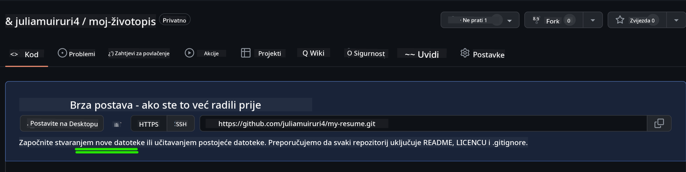
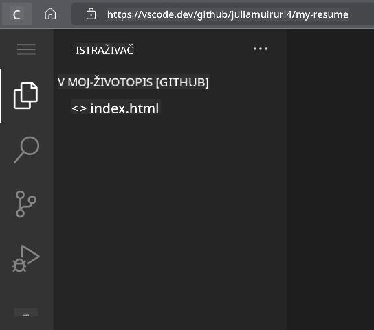

<!--
CO_OP_TRANSLATOR_METADATA:
{
  "original_hash": "effe56ba51c38d7bdfad1ea38288666b",
  "translation_date": "2025-10-24T23:50:49+00:00",
  "source_file": "8-code-editor/1-using-a-code-editor/assignment.md",
  "language_code": "hr"
}
-->
# Izrada web stranice za životopis pomoću VSCode.dev

Poboljšajte svoje karijerne mogućnosti izradom profesionalne web stranice za životopis koja prikazuje vaše vještine i iskustvo u interaktivnom, modernom formatu. Umjesto slanja tradicionalnih PDF dokumenata, zamislite da regruterima pružate elegantnu, responzivnu web stranicu koja demonstrira vaše kvalifikacije i sposobnosti u web razvoju.

Ovaj praktični zadatak omogućuje vam da primijenite sve svoje vještine u VSCode.dev dok stvarate nešto što je zaista korisno za vašu karijeru. Iskusit ćete cjelokupan tijek rada u web razvoju – od kreiranja repozitorija do objavljivanja – sve unutar vašeg preglednika.

Završetkom ovog projekta imat ćete profesionalnu online prisutnost koju možete lako podijeliti s potencijalnim poslodavcima, ažurirati kako vaše vještine rastu i prilagoditi kako bi odgovarala vašem osobnom brendu. Ovo je upravo vrsta praktičnog projekta koja pokazuje stvarne vještine u web razvoju.

## Ciljevi učenja

Nakon završetka ovog zadatka, moći ćete:

- **Kreirati** i upravljati kompletnim projektom web razvoja koristeći VSCode.dev
- **Strukturirati** profesionalnu web stranicu koristeći semantičke HTML elemente
- **Stilizirati** responzivne rasporede modernim CSS tehnikama
- **Implementirati** interaktivne značajke koristeći osnovne web tehnologije
- **Objaviti** aktivnu web stranicu dostupnu putem dijeljivog URL-a
- **Demonstrirati** najbolje prakse upravljanja verzijama tijekom cijelog procesa razvoja

## Preduvjeti

Prije nego započnete ovaj zadatak, osigurajte da imate:

- GitHub račun (kreirajte ga na [github.com](https://github.com/) ako je potrebno)
- Završenu lekciju o VSCode.dev koja pokriva navigaciju sučeljem i osnovne operacije
- Osnovno razumijevanje HTML strukture i koncepta CSS stiliziranja

## Postavljanje projekta i kreiranje repozitorija

Započnimo postavljanjem temelja vašeg projekta. Ovaj proces odražava stvarne tijekove rada u razvoju, gdje projekti počinju pravilnom inicijalizacijom repozitorija i planiranjem strukture.

### Korak 1: Kreirajte svoj GitHub repozitorij

Postavljanje posvećenog repozitorija osigurava da je vaš projekt pravilno organiziran i da se od početka prati verzija.

1. **Idite** na [GitHub.com](https://github.com) i prijavite se na svoj račun
2. **Kliknite** zeleni gumb "New" ili ikonu "+" u gornjem desnom kutu
3. **Nazovite** svoj repozitorij `my-resume` (ili odaberite personalizirani naziv poput `john-smith-resume`)
4. **Dodajte** kratak opis: "Profesionalna web stranica za životopis izrađena pomoću HTML-a i CSS-a"
5. **Odaberite** "Public" kako bi vaš životopis bio dostupan potencijalnim poslodavcima
6. **Označite** "Add a README file" kako biste kreirali početni opis projekta
7. **Kliknite** "Create repository" za dovršetak postavljanja

> 💡 **Savjet za imenovanje repozitorija**: Koristite opisne, profesionalne nazive koji jasno ukazuju na svrhu projekta. To pomaže prilikom dijeljenja s poslodavcima ili tijekom pregleda portfelja.

### Korak 2: Inicijalizacija strukture projekta

Budući da VSCode.dev zahtijeva barem jednu datoteku za otvaranje repozitorija, kreirat ćemo našu glavnu HTML datoteku izravno na GitHubu prije nego što se prebacimo na web uređivač.

1. **Kliknite** na poveznicu "creating a new file" u svom novom repozitoriju
2. **Upišite** `index.html` kao naziv datoteke
3. **Dodajte** ovu početnu HTML strukturu:

```html
<!DOCTYPE html>
<html lang="en">
<head>
    <meta charset="UTF-8">
    <meta name="viewport" content="width=device-width, initial-scale=1.0">
    <title>Your Name - Professional Resume</title>
</head>
<body>
    <h1>Your Name</h1>
    <p>Professional Resume Website</p>
</body>
</html>
```

4. **Napišite** poruku za commit: "Dodaj početnu HTML strukturu"
5. **Kliknite** "Commit new file" za spremanje promjena



**Što se postiže ovim početnim postavljanjem:**
- **Postavlja** pravilnu HTML5 strukturu dokumenta sa semantičkim elementima
- **Uključuje** meta oznaku za kompatibilnost responzivnog dizajna
- **Postavlja** opisni naslov stranice koji se pojavljuje u karticama preglednika
- **Stvara** temelj za profesionalnu organizaciju sadržaja

## Rad u VSCode.dev

Sada kada je temelj vašeg repozitorija postavljen, prebacimo se na VSCode.dev za glavni razvojni rad. Ovaj web-bazirani uređivač pruža sve alate potrebne za profesionalni web razvoj.

### Korak 3: Otvorite svoj projekt u VSCode.dev

1. **Idite** na [vscode.dev](https://vscode.dev) u novom prozoru preglednika
2. **Kliknite** "Open Remote Repository" na početnom zaslonu
3. **Kopirajte** URL svog repozitorija s GitHuba i zalijepite ga u polje za unos

   Format: `https://github.com/your-username/my-resume`
   
   *Zamijenite `your-username` svojim stvarnim GitHub korisničkim imenom*

4. **Pritisnite** Enter za učitavanje projekta

✅ **Indikator uspjeha**: Trebali biste vidjeti datoteke svog projekta u bočnoj traci Explorer i `index.html` dostupan za uređivanje u glavnom području uređivača.



**Što ćete vidjeti u sučelju:**
- **Bočna traka Explorer**: **Prikazuje** datoteke i strukturu mapa vašeg repozitorija
- **Područje uređivača**: **Prikazuje** sadržaj odabranih datoteka za uređivanje
- **Traka aktivnosti**: **Omogućuje** pristup značajkama poput Source Control i Extensions
- **Statusna traka**: **Pokazuje** status veze i informacije o trenutnoj grani

### Korak 4: Izradite sadržaj životopisa

Zamijenite sadržaj rezerviranog mjesta u `index.html` s cjelovitom strukturom životopisa. Ovaj HTML pruža temelj za profesionalnu prezentaciju vaših kvalifikacija.

<details>
<summary><b>Cjelovita HTML struktura životopisa</b></summary>

```html
<!DOCTYPE html>
<html lang="en">
<head>
    <meta charset="UTF-8">
    <meta name="viewport" content="width=device-width, initial-scale=1.0">
    <link href="style.css" rel="stylesheet">
    <link rel="stylesheet" href="https://cdnjs.cloudflare.com/ajax/libs/font-awesome/5.15.4/css/all.min.css">
    <title>Your Name - Professional Resume</title>
</head>
<body>
    <header id="header">
        <h1>Your Full Name</h1>
        <hr>
        <p class="role">Your Professional Title</p>
        <hr>
    </header>
    
    <main>
        <article id="mainLeft">
            <section>
                <h2>CONTACT</h2>
                <p>
                    <i class="fa fa-envelope" aria-hidden="true"></i>
                    <a href="mailto:your.email@domain.com">your.email@domain.com</a>
                </p>
                <p>
                    <i class="fab fa-github" aria-hidden="true"></i>
                    <a href="https://github.com/your-username">github.com/your-username</a>
                </p>
                <p>
                    <i class="fab fa-linkedin" aria-hidden="true"></i>
                    <a href="https://linkedin.com/in/your-profile">linkedin.com/in/your-profile</a>
                </p>
            </section>
            
            <section>
                <h2>SKILLS</h2>
                <ul>
                    <li>HTML5 & CSS3</li>
                    <li>JavaScript (ES6+)</li>
                    <li>Responsive Web Design</li>
                    <li>Version Control (Git)</li>
                    <li>Problem Solving</li>
                </ul>
            </section>
            
            <section>
                <h2>EDUCATION</h2>
                <h3>Your Degree or Certification</h3>
                <p>Institution Name</p>
                <p>Start Date - End Date</p>
            </section>
        </article>
        
        <article id="mainRight">
            <section>
                <h2>ABOUT</h2>
                <p>Write a compelling summary that highlights your passion for web development, key achievements, and career goals. This section should give employers insight into your personality and professional approach.</p>
            </section>
            
            <section>
                <h2>WORK EXPERIENCE</h2>
                <div class="job">
                    <h3>Job Title</h3>
                    <p class="company">Company Name | Start Date – End Date</p>
                    <ul>
                        <li>Describe a key accomplishment or responsibility</li>
                        <li>Highlight specific skills or technologies used</li>
                        <li>Quantify impact where possible (e.g., "Improved efficiency by 25%")</li>
                    </ul>
                </div>
                
                <div class="job">
                    <h3>Previous Job Title</h3>
                    <p class="company">Previous Company | Start Date – End Date</p>
                    <ul>
                        <li>Focus on transferable skills and achievements</li>
                        <li>Demonstrate growth and learning progression</li>
                        <li>Include any leadership or collaboration experiences</li>
                    </ul>
                </div>
            </section>
            
            <section>
                <h2>PROJECTS</h2>
                <div class="project">
                    <h3>Project Name</h3>
                    <p>Brief description of what the project accomplishes and technologies used.</p>
                    <a href="#" target="_blank">View Project</a>
                </div>
            </section>
        </article>
    </main>
</body>
</html>
```
</details>

**Smjernice za prilagodbu:**
- **Zamijenite** sav tekst rezerviranog mjesta stvarnim informacijama
- **Prilagodite** sekcije prema razini vašeg iskustva i fokusu karijere
- **Dodajte** ili uklonite sekcije prema potrebi (npr. Certifikati, Volonterski rad, Jezici)
- **Uključite** poveznice na svoje stvarne profile i projekte

### Korak 5: Kreirajte prateće datoteke

Profesionalne web stranice zahtijevaju organizirane strukture datoteka. Kreirajte CSS stilsku datoteku i konfiguracijske datoteke potrebne za kompletan projekt.

1. **Pređite** mišem preko naziva mape projekta u bočnoj traci Explorer
2. **Kliknite** na ikonu "New File" (📄+) koja se pojavljuje
3. **Kreirajte** ove datoteke jednu po jednu:
   - `style.css` (za stiliziranje i raspored)
   - `codeswing.json` (za konfiguraciju ekstenzije za pregled)

**Kreiranje CSS datoteke (`style.css`):**

<details>
<summary><b>Profesionalno CSS stiliziranje</b></summary>

```css
/* Modern Resume Styling */
body {
    font-family: 'Segoe UI', Tahoma, Geneva, Verdana, sans-serif;
    font-size: 16px;
    line-height: 1.6;
    max-width: 960px;
    margin: 0 auto;
    padding: 20px;
    color: #333;
    background-color: #f9f9f9;
}

/* Header Styling */
header {
    text-align: center;
    margin-bottom: 3em;
    padding: 2em;
    background: linear-gradient(135deg, #667eea 0%, #764ba2 100%);
    color: white;
    border-radius: 10px;
    box-shadow: 0 4px 6px rgba(0, 0, 0, 0.1);
}

h1 {
    font-size: 3em;
    letter-spacing: 0.1em;
    margin-bottom: 0.2em;
    font-weight: 300;
}

.role {
    font-size: 1.3em;
    font-weight: 300;
    margin: 1em 0;
}

/* Main Content Layout */
main {
    display: grid;
    grid-template-columns: 35% 65%;
    gap: 3em;
    margin-top: 3em;
    background: white;
    padding: 2em;
    border-radius: 10px;
    box-shadow: 0 2px 10px rgba(0, 0, 0, 0.1);
}

/* Typography */
h2 {
    font-size: 1.4em;
    font-weight: 600;
    margin-bottom: 1em;
    color: #667eea;
    border-bottom: 2px solid #667eea;
    padding-bottom: 0.3em;
}

h3 {
    font-size: 1.1em;
    font-weight: 600;
    margin-bottom: 0.5em;
    color: #444;
}

/* Section Styling */
section {
    margin-bottom: 2.5em;
}

#mainLeft {
    border-right: 1px solid #e0e0e0;
    padding-right: 2em;
}

/* Contact Links */
section a {
    color: #667eea;
    text-decoration: none;
    transition: color 0.3s ease;
}

section a:hover {
    color: #764ba2;
    text-decoration: underline;
}

/* Icons */
i {
    margin-right: 0.8em;
    width: 20px;
    text-align: center;
    color: #667eea;
}

/* Lists */
ul {
    list-style: none;
    padding-left: 0;
}

li {
    margin: 0.5em 0;
    padding: 0.3em 0;
    position: relative;
}

li:before {
    content: "▸";
    color: #667eea;
    margin-right: 0.5em;
}

/* Work Experience */
.job, .project {
    margin-bottom: 2em;
    padding-bottom: 1.5em;
    border-bottom: 1px solid #f0f0f0;
}

.company {
    font-style: italic;
    color: #666;
    margin-bottom: 0.5em;
}

/* Responsive Design */
@media (max-width: 768px) {
    main {
        grid-template-columns: 1fr;
        gap: 2em;
    }
    
    #mainLeft {
        border-right: none;
        border-bottom: 1px solid #e0e0e0;
        padding-right: 0;
        padding-bottom: 2em;
    }
    
    h1 {
        font-size: 2.2em;
    }
    
    body {
        padding: 10px;
    }
}

/* Print Styles */
@media print {
    body {
        background: white;
        color: black;
        font-size: 12pt;
    }
    
    header {
        background: none;
        color: black;
        box-shadow: none;
    }
    
    main {
        box-shadow: none;
    }
}
```
</details>

**Kreiranje konfiguracijske datoteke (`codeswing.json`):**

```json
{
    "scripts": [],
    "styles": []
}
```

**Razumijevanje značajki CSS-a:**
- **Koristi** CSS Grid za responzivnu, profesionalnu strukturu rasporeda
- **Implementira** moderne sheme boja s gradijentnim zaglavljima
- **Uključuje** hover efekte i glatke prijelaze za interaktivnost
- **Pruža** responzivni dizajn koji radi na svim veličinama uređaja
- **Dodaje** stilove prilagođene za ispis za generiranje PDF-a

### Korak 6: Instalacija i konfiguracija ekstenzija

Ekstenzije poboljšavaju vaše iskustvo razvoja pružajući mogućnosti za pregled uživo i poboljšane alate za tijek rada. Ekstenzija CodeSwing posebno je korisna za projekte web razvoja.

**Instalacija ekstenzije CodeSwing:**

1. **Kliknite** na ikonu Extensions (🧩) u traci aktivnosti
2. **Pretražite** "CodeSwing" u polju za pretraživanje tržišta
3. **Odaberite** ekstenziju CodeSwing iz rezultata pretraživanja
4. **Kliknite** plavi gumb "Install"


**Što CodeSwing omogućuje:**
- **Omogućuje** pregled vaše web stranice uživo dok uređujete
- **Prikazuje** promjene u stvarnom vremenu bez ručnog osvježavanja
- **Podržava** više vrsta datoteka uključujući HTML, CSS i JavaScript
- **Pruža** iskustvo integriranog razvojnog okruženja

**Rezultati odmah nakon instalacije:**
Nakon instalacije CodeSwinga, vidjet ćete pregled uživo vaše web stranice za životopis u uređivaču. To vam omogućuje da vidite kako vaša stranica izgleda dok unosite promjene.


**Razumijevanje poboljšanog sučelja:**
- **Podijeljeni prikaz**: **Prikazuje** vaš kod na jednoj strani i pregled uživo na drugoj
- **Ažuriranja u stvarnom vremenu**: **Odražava** promjene odmah dok tipkate
- **Interaktivni pregled**: **Omogućuje** testiranje poveznica i interakcija
- **Simulacija mobilnih uređaja**: **Pruža** mogućnosti testiranja responzivnog dizajna

### Korak 7: Upravljanje verzijama i objavljivanje

Sada kada je vaša web stranica za životopis dovršena, koristite Git za spremanje svog rada i učinite ga dostupnim online.

**Commitanje vaših promjena:**

1. **Kliknite** na ikonu Source Control (🌿) u traci aktivnosti
2. **Pregledajte** sve datoteke koje ste kreirali i izmijenili u sekciji "Changes"
3. **Stageajte** svoje promjene klikom na ikonu "+" pored svake datoteke
4. **Napišite** opisnu poruku za commit, poput:
   - "Dodaj kompletnu web stranicu za životopis s responzivnim dizajnom"
   - "Implementiraj profesionalno stiliziranje i strukturu sadržaja"
5. **Kliknite** na kvačicu (✓) za commitanje i pushanje promjena

**Primjeri učinkovitih poruka za commit:**
- "Dodaj profesionalni sadržaj i stiliziranje životopisa"
- "Implementiraj responzivni dizajn za mobilnu kompatibilnost"
- "Ažuriraj kontakt informacije i poveznice na projekte"

> 💡 **Profesionalni savjet**: Dobre poruke za commit pomažu u praćenju evolucije vašeg projekta i pokazuju pažnju na detalje – kvalitete koje poslodavci cijene.

**Pristup vašoj objavljenoj stranici:**
Nakon commitanja, možete se vratiti na svoj GitHub repozitorij koristeći izbornik hamburger (☰) u gornjem lijevom kutu. Vaša web stranica za životopis sada je pod verzijskom kontrolom i spremna za objavljivanje ili dijeljenje.

## Rezultati i sljedeći koraci

**Čestitamo! 🎉** Uspješno ste kreirali profesionalnu web stranicu za životopis koristeći VSCode.dev. Vaš projekt pokazuje:
**Demonstrirane tehničke vještine:**
- **Upravljanje repozitorijem**: Kreirali ste i organizirali kompletnu strukturu projekta
- **Web razvoj**: Izradili ste responzivnu web stranicu koristeći moderne HTML5 i CSS3 tehnologije
- **Upravljanje verzijama**: Implementirali ste pravilan Git tijek rada s smislenim commitovima
- **Proficijencija alata**: Učinkovito koristili sučelje VSCode.dev i sustav ekstenzija

**Postignuti profesionalni rezultati:**
- **Online prisutnost**: Dijeljivi URL koji prikazuje vaše kvalifikacije
- **Moderan format**: Interaktivna alternativa tradicionalnim PDF životopisima
- **Demonstracija vještina**: Konkretni dokaz vaših sposobnosti u web razvoju
- **Jednostavna ažuriranja**: Temelj koji možete kontinuirano poboljšavati i prilagođavati

### Opcije za objavljivanje

Kako biste učinili svoj životopis dostupnim poslodavcima, razmotrite ove opcije hostinga:

**GitHub Pages (Preporučeno):**
1. Idite na postavke svog repozitorija na GitHubu
2. Pomaknite se do sekcije "Pages"
3. Odaberite "Deploy from a branch" i izaberite "main"
4. Vaša stranica bit će dostupna na `https://your-username.github.io/my-resume`

**Alternativne platforme:**
- **Netlify**: Automatsko objavljivanje s prilagođenim domenama
- **Vercel**: Brzo objavljivanje s modernim značajkama hostinga
- **GitHub Codespaces**: Razvojno okruženje s ugrađenim pregledom

### Prijedlozi za poboljšanje

Nastavite razvijati svoje vještine dodavanjem ovih značajki:

**Tehnička poboljšanja:**
- **Interaktivnost s JavaScriptom**: Dodajte glatko pomicanje ili interaktivne elemente
- **Prekidač za tamni način rada**: Implementirajte promjenu teme prema preferencijama korisnika
- **Kontakt forma**: Omogućite direktnu komunikaciju s potencijalnim poslodavcima
- **SEO optimizacija**: Dodajte meta oznake i strukturirane podatke za bolju vidljivost u pretraživanju

**Poboljšanja sadržaja:**
- **Portfelj projekata**: Povežite na GitHub repozitorije i demonstracije uživo
- **Vizualizacija vještina**: Kreirajte trake napretka ili sustave ocjenjivanja vještina
- **Sekcija preporuka**: Uključite preporuke kolega ili instruktora
- **Integracija bloga**: Dodajte sekciju bloga za prikaz vašeg puta učenja

## GitHub Copilot Agent izazov 🚀

Koristite Agent način rada za dovršetak sljedećeg izazova:

**Opis:** Poboljšajte svoju web stranicu za životopis naprednim značajkama koje demonstriraju profesionalne sposobnosti web razvoja i moderne dizajnerske principe.

**Zadatak:** Na temelju vaše postojeće web stranice za životopis, implementirajte ove napredne značajke:
1. Dodajte prekidač za tamni/svijetli način rada s glatkim prijelazima
2. Kreirajte interaktivnu sekciju vještina s animiranim trakama napretka
3. Implementirajte kontakt formu s validacijom forme
4. Dodajte sekciju portfelja projekata s hover efektima i modalnim prozorima
5. Uključite sekciju bloga s najmanje 3 uzorka postova o vašem putu učenja
6. Optimizirajte za SEO s pravilnim meta oznakama, strukturiranim podacima i performansama
7. Objavite poboljšanu stranicu koristeći GitHub Pages ili Netlify
8. Dokumentirajte sve nove značajke u vašem README.md s prikazima zaslona

Vaša poboljšana web stranica trebala bi demonstrirati majstorstvo modernih praksi web razvoja uključujući responzivni dizajn, interaktivnost s JavaScriptom i profesionalne tijekove rada za objavljivanje.

## Proširenje izazova

Spremni za daljnji razvoj svojih vještina? Isprobajte ove napredne izazove:

**📱 Redizajn za mobilne uređaje:** Potpuno obnovite svoju stranicu koristeći pristup "mobile-first" s CSS Gridom i Flexboxom

**🔍 SEO optimizacija:** Implementirajte sveobuhvatnu SEO optimizaciju uključujući meta oznake, strukturirane podatke i optimizaciju performansi

**🌐 Podrška za više jezika:** Dodajte značajke internacionalizacije za podršku više jezika

**📊 Integracija analitike:** Dodajte Google Analytics za praćen
- **Pristupačnost**: Naučite WCAG smjernice za inkluzivni web dizajn  
- **Performanse**: Istražite alate poput Lighthousea za optimizaciju  
- **SEO**: Razumite osnove optimizacije za tražilice  

**Profesionalni razvoj:**  
- **Izgradnja portfelja**: Kreirajte dodatne projekte kako biste pokazali raznolike vještine  
- **Open Source**: Doprinesite postojećim projektima kako biste stekli iskustvo suradnje  
- **Umrežavanje**: Podijelite svoju web stranicu životopisa u zajednicama developera za povratne informacije  
- **Kontinuirano učenje**: Ostanite u toku s trendovima i tehnologijama web razvoja  

---

**Vaši sljedeći koraci:** Podijelite svoju web stranicu životopisa s prijateljima, obitelji ili mentorima za povratne informacije. Iskoristite njihove prijedloge za iteraciju i poboljšanje dizajna. Zapamtite, ovaj projekt nije samo životopis – to je demonstracija vašeg razvoja kao web developera!

---

**Izjava o odricanju odgovornosti**:  
Ovaj dokument je preveden pomoću AI usluge za prevođenje [Co-op Translator](https://github.com/Azure/co-op-translator). Iako nastojimo osigurati točnost, imajte na umu da automatski prijevodi mogu sadržavati pogreške ili netočnosti. Izvorni dokument na izvornom jeziku treba smatrati autoritativnim izvorom. Za ključne informacije preporučuje se profesionalni prijevod od strane čovjeka. Ne preuzimamo odgovornost za nesporazume ili pogrešne interpretacije nastale korištenjem ovog prijevoda.