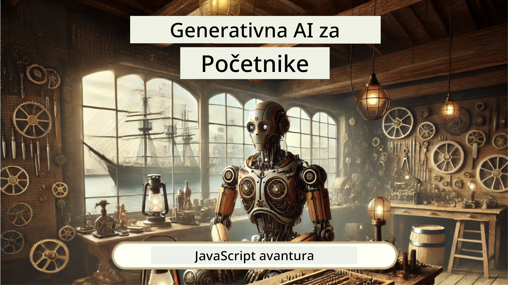
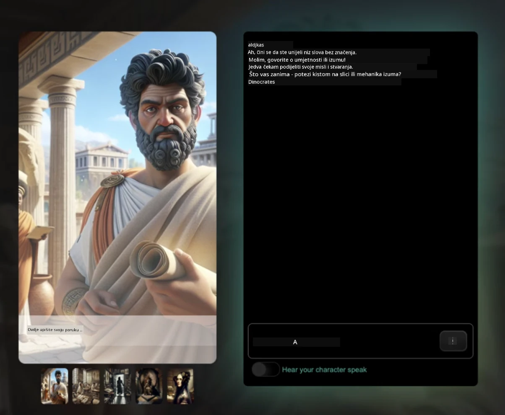
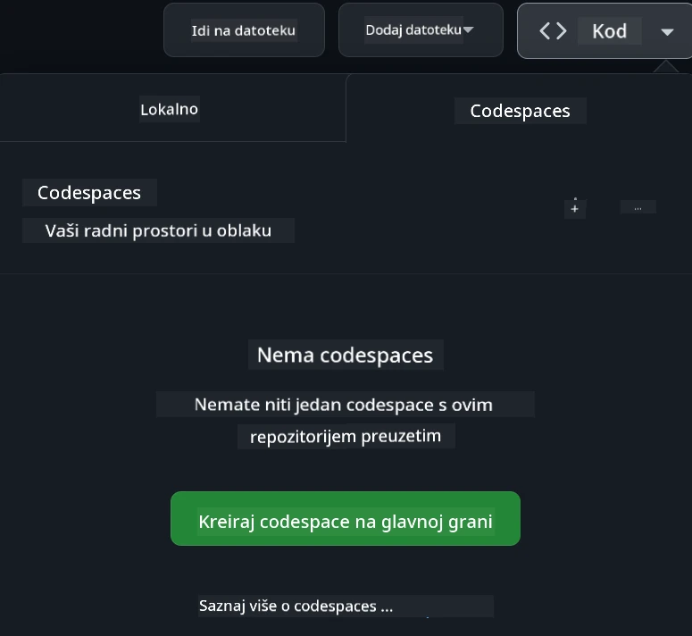

[](https://github.com/microsoft/Web-Dev-For-Beginners/blob/master/LICENSE)
[](https://GitHub.com/microsoft/Web-Dev-For-Beginners/graphs/contributors/)
[](https://GitHub.com/microsoft/Web-Dev-For-Beginners/issues/)
[](https://GitHub.com/microsoft/Web-Dev-For-Beginners/pulls/)
[](http://makeapullrequest.com)

[](https://GitHub.com/microsoft/Web-Dev-For-Beginners/watchers/)
[](https://GitHub.com/microsoft/Web-Dev-For-Beginners/network/)
[](https://GitHub.com/microsoft/Web-Dev-For-Beginners/stargazers/)

[](https://discord.gg/nTYy5BXMWG)

# Web razvoj za početnike - kurikulum

Naučite osnove web razvoja uz naš sveobuhvatan dvanaestotjedni tečaj kojeg vode Microsoft Cloud Advocates. Svaka od 24 lekcije duboko uvodi u JavaScript, CSS i HTML kroz praktične projekte poput terarija, proširenja za preglednike i svemirskih igara. Sudjelujte u kvizovima, diskusijama i praktičnim zadacima. Unaprijedite svoje vještine i optimizirajte zadržavanje znanja našom učinkovito projektno usmjerenom pedagogijom. Započnite svoje kodiranje već danas!

Pridružite se Azure AI Foundry Discord zajednici

[](https://discord.gg/nTYy5BXMWG)

Slijedite ove korake da započnete s korištenjem ovih resursa:
1. **Forkajte repozitorij**: Kliknite [](https://GitHub.com/microsoft/Web-Dev-For-Beginners/fork)
2. **Klonirajte repozitorij**:   `git clone https://github.com/microsoft/Web-Dev-For-Beginners.git`
3. [**Pridružite se Azure AI Foundry Discordu i upoznajte stručnjake i kolege developere**](https://discord.com/invite/ByRwuEEgH4)

### 🌐 Višejezična podrška

#### Podržano putem GitHub akcije (automatizirano i uvijek ažurirano)

<!-- CO-OP TRANSLATOR LANGUAGES TABLE START -->
[Arabic](../ar/README.md) | [Bengali](../bn/README.md) | [Bulgarian](../bg/README.md) | [Burmese (Myanmar)](../my/README.md) | [Chinese (Simplified)](../zh-CN/README.md) | [Chinese (Traditional, Hong Kong)](../zh-HK/README.md) | [Chinese (Traditional, Macau)](../zh-MO/README.md) | [Chinese (Traditional, Taiwan)](../zh-TW/README.md) | [Croatian](./README.md) | [Czech](../cs/README.md) | [Danish](../da/README.md) | [Dutch](../nl/README.md) | [Estonian](../et/README.md) | [Finnish](../fi/README.md) | [French](../fr/README.md) | [German](../de/README.md) | [Greek](../el/README.md) | [Hebrew](../he/README.md) | [Hindi](../hi/README.md) | [Hungarian](../hu/README.md) | [Indonesian](../id/README.md) | [Italian](../it/README.md) | [Japanese](../ja/README.md) | [Kannada](../kn/README.md) | [Korean](../ko/README.md) | [Lithuanian](../lt/README.md) | [Malay](../ms/README.md) | [Malayalam](../ml/README.md) | [Marathi](../mr/README.md) | [Nepali](../ne/README.md) | [Nigerian Pidgin](../pcm/README.md) | [Norwegian](../no/README.md) | [Persian (Farsi)](../fa/README.md) | [Polish](../pl/README.md) | [Portuguese (Brazil)](../pt-BR/README.md) | [Portuguese (Portugal)](../pt-PT/README.md) | [Punjabi (Gurmukhi)](../pa/README.md) | [Romanian](../ro/README.md) | [Russian](../ru/README.md) | [Serbian (Cyrillic)](../sr/README.md) | [Slovak](../sk/README.md) | [Slovenian](../sl/README.md) | [Spanish](../es/README.md) | [Swahili](../sw/README.md) | [Swedish](../sv/README.md) | [Tagalog (Filipino)](../tl/README.md) | [Tamil](../ta/README.md) | [Telugu](../te/README.md) | [Thai](../th/README.md) | [Turkish](../tr/README.md) | [Ukrainian](../uk/README.md) | [Urdu](../ur/README.md) | [Vietnamese](../vi/README.md)

> **Radije klonirate lokalno?**

> Ovaj repozitorij uključuje više od 50 prijevoda na jezike, što značajno povećava veličinu preuzimanja. Za kloniranje bez prijevoda koristite sparse checkout:
> ```bash
> git clone --filter=blob:none --sparse https://github.com/microsoft/Web-Dev-For-Beginners.git
> cd Web-Dev-For-Beginners
> git sparse-checkout set --no-cone '/*' '!translations' '!translated_images'
> ```
> Ovo vam daje sve što trebate za završetak tečaja uz mnogo brže preuzimanje.
<!-- CO-OP TRANSLATOR LANGUAGES TABLE END -->

**Ako želite da budu podržani dodatni prijevodi jezika, pogledajte [ovdje](https://github.com/Azure/co-op-translator/blob/main/getting_started/supported-languages.md)**

[](https://open.vscode.dev/microsoft/Web-Dev-For-Beginners)

#### 🧑‍🎓 _Jeste li student?_

Posjetite [**Student Hub stranicu**](https://docs.microsoft.com/learn/student-hub/?WT.mc_id=academic-77807-sagibbon) gdje ćete pronaći izvore za početnike, studentske pakete i čak načine kako dobiti besplatni certifikacijski kupon. Ovo je stranica koju želite označiti i povremeno provjeravati jer mjesečno mijenjamo sadržaje.

### 📣 Obavijest - Novi izazovi GitHub Copilot Agent moda za dovršiti!

Dodani novi izazov, potražite "GitHub Copilot Agent Challenge 🚀" u većini poglavlja. To je novi izazov koji trebate završiti koristeći GitHub Copilot i Agent mod. Ako niste koristili Agent mod, on može ne samo generirati tekst nego i stvarati i uređivati datoteke, pokretati naredbe i još mnogo toga.

### 📣 Obavijest - _Novi projekt za izgraditi koristeći generativnu AI_

Novi AI Assistant projekt upravo dodat, pogledajte [projekt](./9-chat-project/README.md)

### 📣 Obavijest - _Novi kurikulum_ o Generativnoj AI za JavaScript upravo objavljen

Ne propustite naš novi kurikulum o Generativnoj AI!

Posjetite [https://aka.ms/genai-js-course](https://aka.ms/genai-js-course) da započnete!



- Lekcije koje pokrivaju sve od osnova do RAG-a.
- Komunikacija s povijesnim likovima koristeći GenAI i našu prateću aplikaciju.
- Zabavna i zanimljiva priča, putovat ćete kroz vrijeme!




Svaka lekcija uključuje zadatak za dovršiti, provjeru znanja i izazov za usmjerenje na teme kao što su:
- Promptanje i inženjering prompta
- Generiranje tekstualnih i slikovnih aplikacija
- Pretraživačke aplikacije

Posjetite [https://aka.ms/genai-js-course](../../[https:/aka.ms/genai-js-course) da započnete!


## 🌱 Početak

> **Nastavnici**, uključili smo [neke prijedloge](for-teachers.md) o tome kako koristiti ovaj kurikulum. Voljeli bismo vaše povratne informacije [u našem forumu za raspravu](https://github.com/microsoft/Web-Dev-For-Beginners/discussions/categories/teacher-corner)!

**[Učenici](https://aka.ms/student-page/?WT.mc_id=academic-77807-sagibbon)**, za svaku lekciju, započnite s pripremnim kvizom prije predavanja i nastavite s čitanjem materijala predavanja, dovršavanjem raznih aktivnosti i provjerom razumijevanja pomoću poslije-predavanja kviza.

Za poboljšanje vašeg iskustva učenja, povežite se sa svojim kolegama kako biste zajedno radili na projektima! Diskusije su poticane na našem [forum za rasprave](https://github.com/microsoft/Web-Dev-For-Beginners/discussions) gdje će naš tim moderatora biti dostupan za odgovore na vaša pitanja.

Za dodatno obrazovanje, toplo preporučujemo istraživanje [Microsoft Learn](https://learn.microsoft.com/users/wirelesslife/collections/p1ddcy5jwy0jkm?WT.mc_id=academic-77807-sagibbon) za dodatne studijske materijale.

### 📋 Postavljanje vašeg okruženja

Ovaj kurikulum ima spremno razvojno okruženje! Kad započnete, možete odabrati pokretanje kurikuluma u [Codespace-u](https://github.com/features/codespaces/) (_okruženje bazirano na pregledniku, bez potrebe za instalacijama_), ili lokalno na vašem računalu koristeći uređivač teksta poput [Visual Studio Code](https://code.visualstudio.com/?WT.mc_id=academic-77807-sagibbon).

#### Kreirajte svoj repozitorij
Da biste jednostavno spremali svoj rad, preporučuje se da napravite vlastitu kopiju ovog repozitorija. To možete učiniti klikom na gumb **Use this template** na vrhu stranice. Time će se kreirati novi repozitorij na vašem GitHub računu s kopijom kurikuluma.

Slijedite ove korake:
1. **Forkajte repozitorij**: Kliknite na gumb "Fork" u gornjem desnom kutu ove stranice.
2. **Klonirajte repozitorij**:   `git clone https://github.com/microsoft/Web-Dev-For-Beginners.git`

#### Pokretanje kurikuluma u Codespace-u

U svojoj kopiji ovog repozitorija koju ste napravili, kliknite na gumb **Code** i odaberite **Open with Codespaces**. To će vam kreirati novi Codespace za rad.



#### Pokretanje kurikuluma lokalno na vašem računalu

Za pokretanje ovog kurikuluma lokalno na vašem računalu trebat će vam uređivač teksta, preglednik i alat za naredbenu liniju. Naša prva lekcija, [Uvod u programske jezike i alate tradea](../../1-getting-started-lessons/1-intro-to-programming-languages), provest će vas kroz različite opcije za svaki od ovih alata da odaberete ono što vam najviše odgovara.

Naša preporuka je korištenje [Visual Studio Code](https://code.visualstudio.com/?WT.mc_id=academic-77807-sagibbon) kao uređivača, koji također ima ugrađeni [Terminal](https://code.visualstudio.com/docs/terminal/basics/?WT.mc_id=academic-77807-sagibbon). Visual Studio Code možete preuzeti [ovdje](https://code.visualstudio.com/?WT.mc_id=academic-77807-sagibbon).


1. Klonirajte svoj repozitorij na računalo. To možete učiniti klikom na gumb **Code** i kopiranjem URL-a:

    [CodeSpace](./images/createcodespace.png)
Zatim otvorite [Terminal](https://code.visualstudio.com/docs/terminal/basics/?WT.mc_id=academic-77807-sagibbon) unutar [Visual Studio Code](https://code.visualstudio.com/?WT.mc_id=academic-77807-sagibbon) i pokrenite sljedeću naredbu, zamjenjujući `<your-repository-url>` URL-om koji ste upravo kopirali:

    ```bash 
    git clone <your-repository-url>
    ```

2. Otvorite mapu u Visual Studio Codeu. To možete učiniti klikom na **File** > **Open Folder** i odabirom mape koju ste upravo klonirali.


> Preporučene Visual Studio Code ekstenzije:
>
> * [Live Server](https://marketplace.visualstudio.com/items?itemName=ritwickdey.LiveServer&WT.mc_id=academic-77807-sagibbon) - za pregled HTML stranica unutar Visual Studio Codea
> * [Copilot](https://marketplace.visualstudio.com/items?itemName=GitHub.copilot&WT.mc_id=academic-77807-sagibbon) - za pomoć pri bržem pisanju koda

## 📂 Svaka lekcija uključuje:

- opcionalnu sketchnote bilješku
- opcionalni dodatni video
- kratki kviz za zagrijavanje prije lekcije
- pisanu lekciju
- za lekcije temeljene na projektima, vodiče korak po korak kako izgraditi projekt
- provjere znanja
- izazov
- dodatno čitanje
- zadatak
- [kviz nakon lekcije](https://ff-quizzes.netlify.app/web/)

> **Napomena o kvizovima**: Svi su kvizovi sadržani u mapi Quiz-app, ukupno 48 kvizova sa tri pitanja svaki. Dostupni su [ovdje](https://ff-quizzes.netlify.app/web/); aplikacija za kviz može se pokretati lokalno ili postaviti na Azure; slijedite upute u mapi `quiz-app`.

## 🗃️ Lekcije

|     |                       Naziv Projekta                       |                            Koncepti koji se podučavaju                             | Ciljevi učenja                                                                                                                 |                                                         Povezana lekcija                                                          |         Autor          |
| :-: | :--------------------------------------------------------: | :-------------------------------------------------------------------------------: | ----------------------------------------------------------------------------------------------------------------------------- | :-----------------------------------------------------------------------------------------------------------------------------: | :---------------------: |
| 01  |                       Početak rada                         |           Uvod u programiranje i alate struke                                    | Naučite osnovne koncepte koji stoje iza većine programskih jezika i o softveru koji pomaže profesionalnim developerima         | [Uvod u programske jezike i alate](./1-getting-started-lessons/1-intro-to-programming-languages/README.md)                      |         Jasmine         |
| 02  |                       Početak rada                         |             Osnove GitHub-a, uključuje rad u timu                               | Kako koristiti GitHub u vašem projektu te kako surađivati s drugima na kodu                                                  |                            [Uvod u GitHub](./1-getting-started-lessons/2-github-basics/README.md)                               |          Floor          |
| 03  |                       Početak rada                         |                             Pristupačnost                                        | Naučite osnove web pristupačnosti                                                                                                |                       [Osnove pristupačnosti](./1-getting-started-lessons/3-accessibility/README.md)                             |       Christopher       |
| 04  |                        Osnove JS                           |                         Tipovi podataka u JavaScriptu                           | Osnove tipova podataka u JavaScriptu                                                                                          |                                       [Tipovi podataka](./2-js-basics/1-data-types/README.md)                                 |         Jasmine         |
| 05  |                        Osnove JS                           |                         Funkcije i metode                                      | Upoznajte se s funkcijama i metodama za upravljanje logikom aplikacije                                                        |                              [Funkcije i metode](./2-js-basics/2-functions-methods/README.md)                                  | Jasmine i Christopher   |
| 06  |                        Osnove JS                           |                        Donošenje odluka s JS                                  | Naučite kako stvoriti uvjete u vašem kodu koristeći metode donošenja odluka                                                   |                                 [Donošenje odluka](./2-js-basics/3-making-decisions/README.md)                               |         Jasmine         |
| 07  |                        Osnove JS                           |                            Nizovi i petlje                                    | Radite s podacima koristeći nizove i petlje u JavaScriptu                                                                     |                                   [Nizovi i petlje](./2-js-basics/4-arrays-loops/README.md)                                  |         Jasmine         |
| 08  |            [Terrarium](./3-terrarium/solution/README.md)            |                            HTML u praksi                                     | Izgradite HTML za online terarij, fokusirajući se na izgradnju izgleda                                                        |                                 [Uvod u HTML](./3-terrarium/1-intro-to-html/README.md)                                    |           Jen           |
| 09  |            [Terrarium](./3-terrarium/solution/README.md)            |                            CSS u praksi                                      | Kreirajte CSS za stilizaciju online terarija, fokusirajući se na osnove CSS-a uključujući responzivnost stranice              |                                  [Uvod u CSS](./3-terrarium/2-intro-to-css/README.md)                                    |           Jen           |
| 10  |            [Terrarium](./3-terrarium/solution/README.md)            |             JavaScript zatvaranja, manipulacija DOM-om                        | Izgradite JavaScript koji omogućava funkcioniranje terarija kao sučelje za povlačenje i ispuštanje, fokusirajući se na zatvaranja i manipulaciju DOM-om |                  [JavaScript zatvaranja i manipulacija DOM-om](./3-terrarium/3-intro-to-DOM-and-closures/README.md)            |           Jen           |
| 11  |           [Typing Game](./4-typing-game/solution/README.md)           |                          Izgradnja igre tipkanja                              | Naučite kako koristiti događaje tipkovnice za upravljanje logikom vaše JavaScript aplikacije                                  |                                [Programiranje vođeno događajima](./4-typing-game/typing-game/README.md)                         |       Christopher       |
| 12  | [Green Browser Extension](./5-browser-extension/solution/README.md) |                         Rad s preglednicima                                  | Naučite kako preglednici rade, njihovu povijest i kako napraviti prve elemente ekstenzije za preglednik                       |                               [O preglednicima](./5-browser-extension/1-about-browsers/README.md)                             |           Jen           |
| 13  | [Green Browser Extension](./5-browser-extension/solution/README.md) | Izgradnja obrasca, pozivanje API-ja i pohrana varijabli u local storage       | Izgradite JavaScript elemente vaše ekstenzije preglednika za pozivanje API-ja koristeći varijable pohranjene u local storage |                [API-ji, Obrasci i Local Storage](./5-browser-extension/2-forms-browsers-local-storage/README.md)               |           Jen           |
| 14  | [Green Browser Extension](./5-browser-extension/solution/README.md) |          Pozadinski procesi u pregledniku, web performanse                   | Iskoristite pozadinske procese preglednika za upravljanje ikonama ekstenzije; naučite o web performansama i nekim optimizacijama |             [Pozadinski zadaci i performanse](./5-browser-extension/3-background-tasks-and-performance/README.md)             |           Jen           |
| 15  |           [Space Game](./6-space-game/solution/README.md)           |             Napredniji razvoj igara s JavaScriptom                           | Naučite o nasljeđivanju koristeći i klase i kompoziciju te Pub/Sub obrasce, u pripremi za izgradnju igre                      |                      [Uvod u napredni razvoj igara](./6-space-game/1-introduction/README.md)                                 |          Chris          |
| 16  |           [Space Game](./6-space-game/solution/README.md)           |                           Crtanje na platnu                                  | Saznajte o Canvas API-ju, koji se koristi za crtanje elemenata na zaslonu                                                    |                                [Crtanje na platnu](./6-space-game/2-drawing-to-canvas/README.md)                              |          Chris          |
| 17  |           [Space Game](./6-space-game/solution/README.md)           |                   Premještanje elemenata po zaslonu                         | Otkrijte kako elementi mogu dobiti gibanje koristeći kartezijanske koordinate i Canvas API                                     |                           [Pomicanje elemenata](./6-space-game/3-moving-elements-around/README.md)                            |          Chris          |
| 18  |           [Space Game](./6-space-game/solution/README.md)           |                          Detekcija sudara                                  | Učinite da se elementi sudaraju i međusobno reagiraju koristeći pritiske tipki te dodajte cooldown funkciju za očuvanje performansi igre |                              [Detekcija sudara](./6-space-game/4-collision-detection/README.md)                                |          Chris          |
| 19  |           [Space Game](./6-space-game/solution/README.md)           |                             Vođenje bodova                                  | Izvršavajte matematičke izračune temeljene na statusu i performansama igre                                                    |                                    [Vođenje bodova](./6-space-game/5-keeping-score/README.md)                                   |          Chris          |
| 20  |           [Space Game](./6-space-game/solution/README.md)           |                     Završetak i ponovno pokretanje igre                     | Naučite o završetku i ponovnom pokretanju igre, uključujući čišćenje resursa i resetiranje vrijednosti varijabli               |                                [Uvjet završetka](./6-space-game/6-end-condition/README.md)                                   |          Chris          |
| 21  |         [Banking App](./7-bank-project/solution/README.md)          |                 HTML predlošci i rute u web aplikaciji                      | Naučite kako stvarati kostur arhitekture višestranične web stranice koristeći rute i HTML predloške                           |                            [HTML predlošci i rute](./7-bank-project/1-template-route/README.md)                               |          Yohan          |
| 22  |         [Banking App](./7-bank-project/solution/README.md)          |                  Izgradnja obrasca za prijavu i registraciju                | Naučite o izgradnji obrazaca i rukovanju rutinama provjere valjanosti                                                        |                                           [Obrasci](./7-bank-project/2-forms/README.md)                                    |          Yohan          |
| 23  |         [Banking App](./7-bank-project/solution/README.md)          |                   Metode dohvaćanja i korištenja podataka                   | Kako podaci ulaze i izlaze iz vaše aplikacije, kako ih dohvatiti, pohraniti i ukloniti                                         |                                            [Podaci](./7-bank-project/3-data/README.md)                                       |          Yohan          |
| 24  |         [Banking App](./7-bank-project/solution/README.md)          |                      Koncepti upravljanja stanjem                         | Naučite kako vaša aplikacija zadržava stanje i kako ga programatski upravljati                                                |                                [Upravljanje stanjem](./7-bank-project/4-state-management/README.md)                            |          Yohan          |
| 25 | [Browser/VScode Code](../../8-code-editor) | Rad sa VScode | Naučite kako koristiti uređivač koda| [Koristite VScode uređivač koda](./8-code-editor/1-using-a-code-editor/README.md) | Chris |
| 26 | [AI Assistants](./9-chat-project/README.md) | Rad s AI | Naučite kako izgraditi vlastitog AI asistenta | [AI Assistant projekt](./9-chat-project/README.md) | Chris |

## 🏫 Pedagogija

Naš kurikulum je dizajniran s dva ključna pedagoška principa u vidu:
* učenje temeljeno na projektima
* česti kvizovi

Program uči osnove JavaScripta, HTML-a i CSS-a, kao i najnovije alate i tehnike koje danas koriste web developeri. Studenti će imati priliku steći praktično iskustvo izgradnjom igre tipkanja, virtualnog terarija, ekološke ekstenzije preglednika, igre nalik space invaderu i bankarske aplikacije za poslovne korisnike. Do kraja serije studenti će imati čvrsto razumijevanje web razvoja.

> 🎓 Možete proći prve lekcije ovog kurikuluma kao [Put učenja](https://docs.microsoft.com/learn/paths/web-development-101/?WT.mc_id=academic-77807-sagibbon) na Microsoft Learn!

Osiguravanjem da sadržaj odgovara projektima, proces učenja postaje zanimljiviji studentima, a zadržavanje koncepata je bolje. Također smo napisali nekoliko početnih lekcija o osnovama JavaScripta za uvod u koncepte, u paru s videom iz zbirke "[Serija za početnike o: JavaScript](https://channel9.msdn.com/Series/Beginners-Series-to-JavaScript/?WT.mc_id=academic-77807-sagibbon)" video tutorijala, od kojih su neki autori doprinijeli ovom kurikulumu.

Nadalje, kviz niskog rizika prije nastave postavlja namjeru učenika prema učenju teme, dok drugi kviz nakon nastave osigurava dodatno zadržavanje znanja. Ovaj kurikulum je dizajniran da bude fleksibilan i zabavan te ga se može pohađati u cijelosti ili djelomično. Projekti počinju mali i postaju sve složeniji do kraja 12-tjednog ciklusa.

Premda smo namjerno izbjegli uvođenje JavaScript okvira da bismo se koncentrirali na osnovne vještine potrebne kao web developer prije usvajanja okvira, dobar sljedeći korak nakon dovršetka ovog kurikuluma bio bi učiti o Node.js putem druge zbirke videa: "[Serija za početnike o: Node.js](https://channel9.msdn.com/Series/Beginners-Series-to-Nodejs/?WT.mc_id=academic-77807-sagibbon)".

> Posjetite naše smjernice [Kodeksa ponašanja](CODE_OF_CONDUCT.md) i [Doprinos](CONTRIBUTING.md). Dobrodošli su vaši konstruktivni komentari!


## 🧭 Izvanmrežni pristup

Možete pokretati ovu dokumentaciju izvan mreže koristeći [Docsify](https://docsify.js.org/#/). Forkajte ovaj repozitorij, [instalirajte Docsify](https://docsify.js.org/#/quickstart) na svojem računalu, a zatim u korijenskoj mapi ovog repozitorija upišite `docsify serve`. Web stranica će se poslužiti na portu 3000 na vašem localhostu: `localhost:3000`.

## 📘 PDF

PDF svih lekcija možete pronaći [ovdje](https://microsoft.github.io/Web-Dev-For-Beginners/pdf/readme.pdf).


## 🎒 Ostali tečajevi
Naš tim proizvodi i druge tečajeve! Pogledajte:

<!-- CO-OP TRANSLATOR OTHER COURSES START -->
### LangChain
[](https://aka.ms/langchain4j-for-beginners)
[](https://aka.ms/langchainjs-for-beginners?WT.mc_id=m365-94501-dwahlin)

---

### Azure / Edge / MCP / Agent
[](https://github.com/microsoft/AZD-for-beginners?WT.mc_id=academic-105485-koreyst)
[](https://github.com/microsoft/edgeai-for-beginners?WT.mc_id=academic-105485-koreyst)
[](https://github.com/microsoft/mcp-for-beginners?WT.mc_id=academic-105485-koreyst)
[](https://github.com/microsoft/ai-agents-for-beginners?WT.mc_id=academic-105485-koreyst)

---
 
### Serija generativne umjetne inteligencije
[](https://github.com/microsoft/generative-ai-for-beginners?WT.mc_id=academic-105485-koreyst)
[-9333EA?style=for-the-badge&labelColor=E5E7EB&color=9333EA)](https://github.com/microsoft/Generative-AI-for-beginners-dotnet?WT.mc_id=academic-105485-koreyst)
[-C084FC?style=for-the-badge&labelColor=E5E7EB&color=C084FC)](https://github.com/microsoft/generative-ai-for-beginners-java?WT.mc_id=academic-105485-koreyst)
[-E879F9?style=for-the-badge&labelColor=E5E7EB&color=E879F9)](https://github.com/microsoft/generative-ai-with-javascript?WT.mc_id=academic-105485-koreyst)

---
 
### Temeljno učenje
[](https://aka.ms/ml-beginners?WT.mc_id=academic-105485-koreyst)
[](https://aka.ms/datascience-beginners?WT.mc_id=academic-105485-koreyst)
[](https://aka.ms/ai-beginners?WT.mc_id=academic-105485-koreyst)
[](https://github.com/microsoft/Security-101?WT.mc_id=academic-96948-sayoung)
[](https://aka.ms/webdev-beginners?WT.mc_id=academic-105485-koreyst)
[](https://aka.ms/iot-beginners?WT.mc_id=academic-105485-koreyst)
[](https://github.com/microsoft/xr-development-for-beginners?WT.mc_id=academic-105485-koreyst)

---
 
### Copilot serija
[](https://aka.ms/GitHubCopilotAI?WT.mc_id=academic-105485-koreyst)
[](https://github.com/microsoft/mastering-github-copilot-for-dotnet-csharp-developers?WT.mc_id=academic-105485-koreyst)
[](https://github.com/microsoft/CopilotAdventures?WT.mc_id=academic-105485-koreyst)
<!-- CO-OP TRANSLATOR OTHER COURSES END -->

## Dobivanje pomoći

Ako zapnete ili imate pitanja o izradi AI aplikacija. Pridružite se ostalim učenicima i iskusnim programerima u raspravama o MCP-u. To je poticajna zajednica gdje su pitanja dobrodošla, a znanje se slobodno dijeli.

[](https://discord.gg/nTYy5BXMWG)

Ako imate povratne informacije o proizvodu ili greške tijekom izrade, posjetite:

[](https://aka.ms/foundry/forum)

## Licenca

Ovaj repozitorij licenciran je pod MIT licencom. Pogledajte datoteku [LICENSE](../../LICENSE) za više informacija.

---

<!-- CO-OP TRANSLATOR DISCLAIMER START -->
**Odricanje od odgovornosti**:  
Ovaj dokument je preveden pomoću AI usluge za prijevod [Co-op Translator](https://github.com/Azure/co-op-translator). Iako nastojimo postići točnost, imajte na umu da automatski prijevodi mogu sadržavati pogreške ili netočnosti. Izvorni dokument na njegovom izvornom jeziku treba smatrati autoritativnim izvorom. Za kritične informacije preporučuje se profesionalni ljudski prijevod. Ne snosimo odgovornost za bilo kakve nesporazume ili pogrešna tumačenja koja proizlaze iz korištenja ovog prijevoda.
<!-- CO-OP TRANSLATOR DISCLAIMER END -->