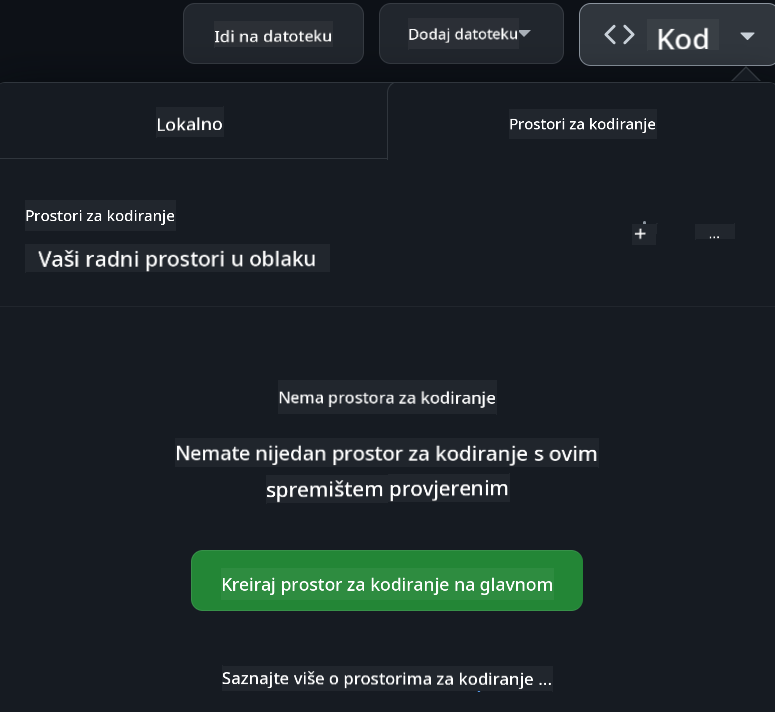

<!--
CO_OP_TRANSLATOR_METADATA:
{
  "original_hash": "caf2ca695e9d259153d24a5cf3e07ef5",
  "translation_date": "2025-10-11T11:28:56+00:00",
  "source_file": "README.md",
  "language_code": "hr"
}
-->
[](https://github.com/microsoft/Web-Dev-For-Beginners/blob/master/LICENSE)
[](https://GitHub.com/microsoft/Web-Dev-For-Beginners/graphs/contributors/)
[](https://GitHub.com/microsoft/Web-Dev-For-Beginners/issues/)
[](https://GitHub.com/microsoft/Web-Dev-For-Beginners/pulls/)
[](http://makeapullrequest.com)

[](https://GitHub.com/microsoft/Web-Dev-For-Beginners/watchers/)
[](https://GitHub.com/microsoft/Web-Dev-For-Beginners/network/)
[](https://GitHub.com/microsoft/Web-Dev-For-Beginners/stargazers/)

[](https://discord.gg/zxKYvhSnVp?WT.mc_id=academic-000002-leestott)

# Web razvoj za početnike - Kurikulum

Naučite osnove web razvoja uz naš sveobuhvatni 12-tjedni tečaj koji su osmislili Microsoft Cloud Advocates. Svaka od 24 lekcije istražuje JavaScript, CSS i HTML kroz praktične projekte poput terarija, proširenja za preglednike i svemirskih igara. Sudjelujte u kvizovima, raspravama i praktičnim zadacima. Poboljšajte svoje vještine i optimizirajte zadržavanje znanja uz našu učinkovitu metodologiju temeljenu na projektima. Započnite svoje kodersko putovanje već danas!

Pridružite se Azure AI Foundry Discord zajednici

[](https://discord.com/invite/ByRwuEEgH4)

Slijedite ove korake kako biste započeli s korištenjem ovih resursa:
1. **Forkajte repozitorij**: Kliknite [](https://GitHub.com/microsoft/Web-Dev-For-Beginners/fork)
2. **Klonirajte repozitorij**:   `git clone https://github.com/microsoft/Web-Dev-For-Beginners.git`
3. [**Pridružite se Azure AI Foundry Discordu i upoznajte stručnjake i kolege developere**](https://discord.com/invite/ByRwuEEgH4)

### 🌐 Podrška za više jezika

#### Podržano putem GitHub Action (Automatizirano i uvijek ažurirano)

<!-- CO-OP TRANSLATOR LANGUAGES TABLE START -->
[Arapski](../ar/README.md) | [Bengalski](../bn/README.md) | [Bugarski](../bg/README.md) | [Burmanski (Mjanmar)](../my/README.md) | [Kineski (pojednostavljeni)](../zh/README.md) | [Kineski (tradicionalni, Hong Kong)](../hk/README.md) | [Kineski (tradicionalni, Macau)](../mo/README.md) | [Kineski (tradicionalni, Tajvan)](../tw/README.md) | [Hrvatski](./README.md) | [Češki](../cs/README.md) | [Danski](../da/README.md) | [Nizozemski](../nl/README.md) | [Estonski](../et/README.md) | [Finski](../fi/README.md) | [Francuski](../fr/README.md) | [Njemački](../de/README.md) | [Grčki](../el/README.md) | [Hebrejski](../he/README.md) | [Hindski](../hi/README.md) | [Mađarski](../hu/README.md) | [Indonezijski](../id/README.md) | [Talijanski](../it/README.md) | [Japanski](../ja/README.md) | [Korejski](../ko/README.md) | [Litvanski](../lt/README.md) | [Malajski](../ms/README.md) | [Marathi](../mr/README.md) | [Nepalski](../ne/README.md) | [Norveški](../no/README.md) | [Perzijski (Farsi)](../fa/README.md) | [Poljski](../pl/README.md) | [Portugalski (Brazil)](../br/README.md) | [Portugalski (Portugal)](../pt/README.md) | [Pandžapski (Gurmukhi)](../pa/README.md) | [Rumunjski](../ro/README.md) | [Ruski](../ru/README.md) | [Srpski (ćirilica)](../sr/README.md) | [Slovački](../sk/README.md) | [Slovenski](../sl/README.md) | [Španjolski](../es/README.md) | [Svahili](../sw/README.md) | [Švedski](../sv/README.md) | [Tagalog (Filipinski)](../tl/README.md) | [Tamilski](../ta/README.md) | [Tajlandski](../th/README.md) | [Turski](../tr/README.md) | [Ukrajinski](../uk/README.md) | [Urdu](../ur/README.md) | [Vijetnamski](../vi/README.md)
<!-- CO-OP TRANSLATOR LANGUAGES TABLE END -->

**Ako želite da se podrže dodatni jezici, popis podržanih jezika možete pronaći [ovdje](https://github.com/Azure/co-op-translator/blob/main/getting_started/supported-languages.md)**

[](https://open.vscode.dev/microsoft/Web-Dev-For-Beginners)

#### 🧑‍🎓 _Jeste li student?_

Posjetite [**Student Hub stranicu**](https://docs.microsoft.com/learn/student-hub/?WT.mc_id=academic-77807-sagibbon) gdje ćete pronaći resurse za početnike, studentske pakete i čak načine kako dobiti besplatni certifikat. Ovo je stranica koju želite označiti i povremeno provjeravati jer mijenjamo sadržaj mjesečno.

### 📣 Najava - _Novi projekt za izradu pomoću generativne AI_

Upravo je dodan novi projekt AI asistenta, pogledajte [projekt](./09-chat-project/README.md)

### 📣 Najava - _Novi kurikulum_ o generativnoj AI za JavaScript upravo je objavljen

Ne propustite naš novi kurikulum o generativnoj AI!

Posjetite [https://aka.ms/genai-js-course](https://aka.ms/genai-js-course) kako biste započeli!


- Lekcije koje pokrivaju sve od osnova do RAG-a.
- Interakcija s povijesnim likovima pomoću GenAI i naše prateće aplikacije.
- Zabavna i zanimljiva naracija, putovat ćete kroz vrijeme!


Svaka lekcija uključuje zadatak za dovršavanje, provjeru znanja i izazov koji će vas voditi kroz teme poput:
- Pisanje upita i inženjering upita
- Generiranje aplikacija za tekst i slike
- Aplikacije za pretraživanje

Posjetite [https://aka.ms/genai-js-course](../../[https:/aka.ms/genai-js-course) kako biste započeli!


## 🌱 Početak

> **Nastavnici**, [uključili smo neke prijedloge](for-teachers.md) o tome kako koristiti ovaj kurikulum. Voljeli bismo čuti vaše povratne informacije [u našem forumu za raspravu](https://github.com/microsoft/Web-Dev-For-Beginners/discussions/categories/teacher-corner)!

**[Učenici](https://aka.ms/student-page/?WT.mc_id=academic-77807-sagibbon)**, za svaku lekciju započnite s kvizom prije predavanja, nastavite čitanjem materijala predavanja, dovršite razne aktivnosti i provjerite svoje razumijevanje kvizom nakon predavanja.

Kako biste poboljšali svoje iskustvo učenja, povežite se s kolegama kako biste zajedno radili na projektima! Rasprave su poticane u našem [forumu za raspravu](https://github.com/microsoft/Web-Dev-For-Beginners/discussions) gdje će naš tim moderatora biti dostupan za odgovaranje na vaša pitanja.

Za daljnje obrazovanje, toplo preporučujemo istraživanje [Microsoft Learn](https://learn.microsoft.com/users/wirelesslife/collections/p1ddcy5jwy0jkm?WT.mc_id=academic-77807-sagibbon) za dodatne materijale za učenje.

### 📋 Postavljanje vašeg okruženja

Ovaj kurikulum ima razvojno okruženje spremno za korištenje! Kada započnete, možete odabrati pokretanje kurikuluma u [Codespace](https://github.com/features/codespaces/) (_okruženje temeljeno na pregledniku, bez potrebe za instalacijom_), ili lokalno na vašem računalu koristeći tekstualni editor poput [Visual Studio Code](https://code.visualstudio.com/?WT.mc_id=academic-77807-sagibbon).

#### Kreirajte svoj repozitorij
Kako biste lako spremili svoj rad, preporučuje se da kreirate vlastitu kopiju ovog repozitorija. To možete učiniti klikom na gumb **Use this template** na vrhu stranice. Ovo će kreirati novi repozitorij u vašem GitHub računu s kopijom kurikuluma.

Slijedite ove korake:
1. **Forkajte repozitorij**: Kliknite na gumb "Fork" u gornjem desnom kutu ove stranice.
2. **Klonirajte repozitorij**:   `git clone https://github.com/microsoft/Web-Dev-For-Beginners.git`

#### Pokretanje kurikuluma u Codespaceu

U vašoj kopiji ovog repozitorija koju ste kreirali, kliknite na gumb **Code** i odaberite **Open with Codespaces**. Ovo će kreirati novi Codespace u kojem možete raditi.



#### Pokretanje kurikuluma lokalno na vašem računalu

Kako biste pokrenuli ovaj kurikulum lokalno na vašem računalu, trebat će vam tekstualni editor, preglednik i alat za naredbeni redak. Naša prva lekcija, [Uvod u programske jezike i alate](../../1-getting-started-lessons/1-intro-to-programming-languages), provest će vas kroz razne opcije za svaki od ovih alata kako biste odabrali ono što vam najbolje odgovara.

Naša preporuka je korištenje [Visual Studio Code](https://code.visualstudio.com/?WT.mc_id=academic-77807-sagibbon) kao vašeg editora, koji također ima ugrađeni [Terminal](https://code.visualstudio.com/docs/terminal/basics/?WT.mc_id=academic-77807-sagibbon). Možete preuzeti Visual Studio Code [ovdje](https://code.visualstudio.com/?WT.mc_id=academic-77807-sagibbon).


1. Klonirajte svoj repozitorij na svoje računalo. To možete učiniti klikom na gumb **Code** i kopiranjem URL-a:

    [CodeSpace](./images/createcodespace.png)

    Zatim otvorite [Terminal](https://code.visualstudio.com/docs/terminal/basics/?WT.mc_id=academic-77807-sagibbon) unutar [Visual Studio Code](https://code.visualstudio.com/?WT.mc_id=academic-77807-sagibbon) i pokrenite sljedeću naredbu, zamjenjujući `<your-repository-url>` s URL-om koji ste upravo kopirali:

    ```bash 
    git clone <your-repository-url>
    ```

2. Otvorite mapu u Visual Studio Code. To možete učiniti klikom na **File** > **Open Folder** i odabirom mape koju ste upravo klonirali.


>  Preporučeni Visual Studio Code dodaci:
>
> * [Live Server](https://marketplace.visualstudio.com/items?itemName=ritwickdey.LiveServer&WT.mc_id=academic-77807-sagibbon) - za pregled HTML stranica unutar Visual Studio Code
> * [Copilot](https://marketplace.visualstudio.com/items?itemName=GitHub.copilot&WT.mc_id=academic-77807-sagibbon) - za brže pisanje koda

## 📂 Svaka lekcija uključuje:

- opcionalni sketchnote
- opcionalni dopunski video
- kviz za zagrijavanje prije lekcije
- pisana lekcija  
- za lekcije temeljene na projektima, vodiči korak po korak o tome kako izraditi projekt  
- provjere znanja  
- izazov  
- dodatno čitanje  
- zadatak  
- [kviz nakon lekcije](https://ff-quizzes.netlify.app/web/)  

> **Napomena o kvizovima**: Svi kvizovi nalaze se u mapi Quiz-app, ukupno 48 kvizova, svaki s tri pitanja. Dostupni su [ovdje](https://ff-quizzes.netlify.app/web/), a aplikacija za kviz može se pokrenuti lokalno ili implementirati na Azure; slijedite upute u mapi `quiz-app`.

## 🗃️ Lekcije

|     |                       Naziv projekta                       |                            Poučeni koncepti                             | Ciljevi učenja                                                                                                                 |                                                         Povezana lekcija                                                          |         Autor          |
| :-: | :------------------------------------------------------: | :--------------------------------------------------------------------: | ----------------------------------------------------------------------------------------------------------------------------------- | :----------------------------------------------------------------------------------------------------------------------------: | :---------------------: |
| 01  |                     Početak rada                      |           Uvod u programiranje i alati za rad           | Naučite osnovne temelje većine programskih jezika i o softveru koji pomaže profesionalnim programerima u njihovom poslu | [Uvod u programske jezike i alate za rad](./1-getting-started-lessons/1-intro-to-programming-languages/README.md) |         Jasmine         |
| 02  |                     Početak rada                      |             Osnove GitHuba, uključujući rad u timu             | Kako koristiti GitHub u svom projektu, kako surađivati s drugima na kodnoj bazi                                                    |                            [Uvod u GitHub](./1-getting-started-lessons/2-github-basics/README.md)                             |          Floor          |
| 03  |                     Početak rada                      |                             Pristupačnost                              | Naučite osnove web pristupačnosti                                                                                               |                       [Osnove pristupačnosti](./1-getting-started-lessons/3-accessibility/README.md)                       |       Christopher       |
| 04  |                        Osnove JS-a                         |                         JavaScript tipovi podataka                          | Osnove JavaScript tipova podataka                                                                                                 |                                       [Tipovi podataka](./2-js-basics/1-data-types/README.md)                                        |         Jasmine         |
| 05  |                        Osnove JS-a                         |                         Funkcije i metode                          | Naučite o funkcijama i metodama za upravljanje logičkim tokom aplikacije                                                             |                              [Funkcije i metode](./2-js-basics/2-functions-methods/README.md)                               | Jasmine i Christopher |
| 06  |                        Osnove JS-a                         |                        Donošenje odluka s JS-om                        | Naučite kako stvoriti uvjete u svom kodu koristeći metode za donošenje odluka                                                           |                                 [Donošenje odluka](./2-js-basics/3-making-decisions/README.md)                                  |         Jasmine         |
| 07  |                        Osnove JS-a                         |                            Nizovi i petlje                            | Radite s podacima koristeći nizove i petlje u JavaScriptu                                                                                 |                                   [Nizovi i petlje](./2-js-basics/4-arrays-loops/README.md)                                    |         Jasmine         |
| 08  |       [Terarij](./3-terrarium/solution/README.md)       |                            HTML u praksi                            | Izradite HTML za stvaranje online terarija, fokusirajući se na izradu izgleda                                                         |                                 [Uvod u HTML](./3-terrarium/1-intro-to-html/README.md)                                 |           Jen           |
| 09  |       [Terarij](./3-terrarium/solution/README.md)       |                            CSS u praksi                             | Izradite CSS za stiliziranje online terarija, fokusirajući se na osnove CSS-a, uključujući prilagodljivost stranice                     |                                  [Uvod u CSS](./3-terrarium/2-intro-to-css/README.md)                                  |           Jen           |
| 10  |            [Terarij](./3-terrarium/solution/README.md)            |                 JavaScript zatvaranja, manipulacija DOM-a                  | Izradite JavaScript kako bi terarij funkcionirao kao sučelje za povlačenje i ispuštanje, fokusirajući se na zatvaranja i manipulaciju DOM-a             |                  [JavaScript zatvaranja, manipulacija DOM-a](./3-terrarium/3-intro-to-DOM-and-closures/README.md)                   |           Jen           |
| 11  |          [Igra tipkanja](./4-typing-game/solution/README.md)          |                          Izradite igru tipkanja                           | Naučite kako koristiti događaje s tipkovnice za upravljanje logikom svoje JavaScript aplikacije                                                          |                                [Programiranje vođeno događajima](./4-typing-game/typing-game/README.md)                                |       Christopher       |
| 12  | [Zeleni dodatak za preglednik](./5-browser-extension/solution/README.md) |                         Rad s preglednicima                          | Naučite kako preglednici rade, njihovu povijest i kako postaviti prve elemente dodatka za preglednik                               |                               [O preglednicima](./5-browser-extension/1-about-browsers/README.md)                                |           Jen           |
| 13  | [Zeleni dodatak za preglednik](./5-browser-extension/solution/README.md) | Izrada obrasca, pozivanje API-ja i spremanje varijabli u lokalnu pohranu | Izradite JavaScript elemente svog dodatka za preglednik kako biste pozvali API koristeći varijable pohranjene u lokalnoj pohrani                      |                [API-ji, obrasci i lokalna pohrana](./5-browser-extension/2-forms-browsers-local-storage/README.md)                 |           Jen           |
| 14  | [Zeleni dodatak za preglednik](./5-browser-extension/solution/README.md) |          Pozadinski procesi u pregledniku, web performanse          | Koristite pozadinske procese preglednika za upravljanje ikonom dodatka; naučite o web performansama i nekim optimizacijama za poboljšanje   |             [Pozadinski zadaci i performanse](./5-browser-extension/3-background-tasks-and-performance/README.md)              |           Jen           |
| 15  |           [Svemirska igra](./6-space-game/solution/README.md)           |             Napredniji razvoj igara s JavaScriptom             | Naučite o nasljeđivanju koristeći klase i kompoziciju te Pub/Sub uzorak, kao pripremu za izradu igre              |                      [Uvod u napredni razvoj igara](./6-space-game/1-introduction/README.md)                       |          Chris          |
| 16  |           [Svemirska igra](./6-space-game/solution/README.md)           |                           Crtanje na platno                            | Naučite o Canvas API-ju, koji se koristi za crtanje elemenata na ekranu                                                                       |                                [Crtanje na platno](./6-space-game/2-drawing-to-canvas/README.md)                                |          Chris          |
| 17  |           [Svemirska igra](./6-space-game/solution/README.md)           |                   Pomicanje elemenata po ekranu                    | Otkrijte kako elementi mogu dobiti pokret koristeći kartezijanske koordinate i Canvas API                                            |                           [Pomicanje elemenata](./6-space-game/3-moving-elements-around/README.md)                           |          Chris          |
| 18  |           [Svemirska igra](./6-space-game/solution/README.md)           |                          Detekcija sudara                           | Napravite da se elementi sudaraju i međusobno reagiraju koristeći pritiske tipki te osigurajte funkciju hlađenja za performanse igre    |                              [Detekcija sudara](./6-space-game/4-collision-detection/README.md)                              |          Chris          |
| 19  |           [Svemirska igra](./6-space-game/solution/README.md)           |                             Vođenje rezultata                              | Izvršite matematičke izračune na temelju statusa i performansi igre                                                                |                                    [Vođenje rezultata](./6-space-game/5-keeping-score/README.md)                                    |          Chris          |
| 20  |           [Svemirska igra](./6-space-game/solution/README.md)           |                     Završavanje i ponovno pokretanje igre                     | Naučite o završavanju i ponovnom pokretanju igre, uključujući čišćenje resursa i resetiranje vrijednosti varijabli                              |                                [Završni uvjet](./6-space-game/6-end-condition/README.md)                                 |          Chris          |
| 21  |         [Bankovna aplikacija](./7-bank-project/solution/README.md)          |                 HTML predlošci i rute u web aplikaciji                 | Naučite kako stvoriti strukturu arhitekture višestranične web stranice koristeći rute i HTML predloške                             |                            [HTML predlošci i rute](./7-bank-project/1-template-route/README.md)                             |          Yohan          |
| 22  |         [Bankovna aplikacija](./7-bank-project/solution/README.md)          |                  Izrada obrasca za prijavu i registraciju                   | Naučite o izradi obrazaca i rukovanju rutinama za validaciju                                                                          |                                           [Obrasci](./7-bank-project/2-forms/README.md)                                           |          Yohan          |
| 23  |         [Bankovna aplikacija](./7-bank-project/solution/README.md)          |                   Metode dohvaćanja i korištenja podataka                   | Kako podaci teku u i iz vaše aplikacije, kako ih dohvatiti, pohraniti i ukloniti                                                 |                                            [Podaci](./7-bank-project/3-data/README.md)                                            |          Yohan          |
| 24  |         [Bankovna aplikacija](./7-bank-project/solution/README.md)          |                      Koncepti upravljanja stanjem                      | Naučite kako vaša aplikacija zadržava stanje i kako njime upravljati programatski                                                              |                                [Upravljanje stanjem](./7-bank-project/4-state-management/README.md)                                |          Yohan          |
| 25 | [Preglednik/VScode kod](../../8-code-editor) | Rad s VScodeom | Naučite kako koristiti uređivač koda | [Koristite VScode uređivač koda](./8-code-editor/1-using-a-code-editor/README.md) | Chris |
| 26 | [AI asistenti](./9-chat-project/README.md) | Rad s AI-jem | Naučite kako izraditi vlastitog AI asistenta | [Projekt AI asistenta](./9-chat-project/README.md) | Chris |

## 🏫 Pedagogija

Naš kurikulum osmišljen je s dva ključna pedagoška principa:  
* učenje temeljeno na projektima  
* česti kvizovi  

Program podučava osnove JavaScripta, HTML-a i CSS-a, kao i najnovije alate i tehnike koje koriste današnji web programeri. Studenti će imati priliku steći praktično iskustvo izradom igre tipkanja, virtualnog terarija, ekološki prihvatljivog dodatka za preglednik, igre u stilu svemirskih osvajača i bankovne aplikacije za poslovanje. Do kraja serije, studenti će steći solidno razumijevanje web razvoja.

> 🎓 Prve lekcije ovog kurikuluma možete pohađati kao [Put učenja](https://docs.microsoft.com/learn/paths/web-development-101/?WT.mc_id=academic-77807-sagibbon) na Microsoft Learn!

Osiguravanjem da sadržaj odgovara projektima, proces postaje zanimljiviji za studente, a zadržavanje koncepta se povećava. Također smo napisali nekoliko početnih lekcija o osnovama JavaScripta za uvod u koncepte, u kombinaciji s videom iz kolekcije "[Serija za početnike: JavaScript](https://channel9.msdn.com/Series/Beginners-Series-to-JavaScript/?WT.mc_id=academic-77807-sagibbon)" video tutorijala, čiji su neki autori doprinijeli ovom kurikulumu.

Osim toga, kviz s niskim rizikom prije predavanja postavlja namjeru studenta prema učenju teme, dok drugi kviz nakon predavanja osigurava daljnje zadržavanje. Ovaj kurikulum osmišljen je da bude fleksibilan i zabavan te se može pohađati u cijelosti ili djelomično. Projekti počinju malim i postaju sve složeniji do kraja 12-tjednog ciklusa.

Iako smo namjerno izbjegavali uvođenje JavaScript okvira kako bismo se koncentrirali na osnovne vještine potrebne kao web programer prije usvajanja okvira, dobar sljedeći korak nakon završetka ovog kurikuluma bio bi učenje o Node.js-u putem druge kolekcije videa: "[Serija za početnike: Node.js](https://channel9.msdn.com/Series/Beginners-Series-to-Nodejs/?WT.mc_id=academic-77807-sagibbon)".

> Posjetite naše [Pravila ponašanja](CODE_OF_CONDUCT.md) i [Smjernice za doprinos](CONTRIBUTING.md). Vaše konstruktivne povratne informacije su dobrodošle!

## 🧭 Pristup bez interneta

Ovu dokumentaciju možete pokrenuti offline koristeći [Docsify](https://docsify.js.org/#/). Forkajte ovaj repo, [instalirajte Docsify](https://docsify.js.org/#/quickstart) na svom lokalnom računalu, a zatim u korijenskoj mapi ovog repo-a upišite `docsify serve`. Web stranica će se posluživati na portu 3000 na vašem localhostu: `localhost:3000`.

## 📘 PDF

PDF svih lekcija možete pronaći [ovdje](https://microsoft.github.io/Web-Dev-For-Beginners/pdf/readme.pdf).

## 🎒 Ostali tečajevi

Naš tim proizvodi i druge tečajeve! Pogledajte:

- [MCP za početnike](https://aka.ms/mcp-for-beginners)  
- [Edge AI za početnike](https://aka.ms/edgeai-for-beginners)  
- [AI agenti za početnike](https://aka.ms/ai-agents-beginners)  
- [Generativni AI za početnike .NET](https://github.com/microsoft/Generative-AI-for-beginners-dotnet)  
- [Generativni AI s JavaScriptom](https://github.com/microsoft/generative-ai-with-javascript)  
- [Generativni AI s Javom](https://github.com/microsoft/Generative-AI-for-beginners-java)  
- [AI za početnike](https://aka.ms/ai-beginners)  
- [Data Science za početnike](https://aka.ms/datascience-beginners)  
- [ML za početnike](https://aka.ms/ml-beginners)  
- [Kibernetička sigurnost za početnike](https://github.com/microsoft/Security-101)  
- [Web razvoj za početnike](https://aka.ms/webdev-beginners)  
- [IoT za početnike](https://aka.ms/iot-beginners)  
- [XR Razvoj za početnike](https://github.com/microsoft/xr-development-for-beginners)  
- [Savladavanje GitHub Copilota za agentičku upotrebu](https://github.com/microsoft/Mastering-GitHub-Copilot-for-Paired-Programming)  
- [Savladavanje GitHub Copilota za C#/.NET programere](https://github.com/microsoft/mastering-github-copilot-for-dotnet-csharp-developers)  
- [Odaberi svoju Copilot avanturu](https://github.com/microsoft/CopilotAdventures)  

## Dobivanje pomoći  

Ako zapnete ili imate pitanja o izradi AI aplikacija, pridružite se:  

[](https://aka.ms/foundry/discord)  

Ako imate povratne informacije o proizvodu ili naiđete na greške tijekom izrade, posjetite:  

[](https://aka.ms/foundry/forum)  

## Licenca  

Ovaj repozitorij licenciran je pod MIT licencom. Pogledajte datoteku [LICENSE](../../LICENSE) za više informacija.  

---

**Izjava o odricanju odgovornosti**:  
Ovaj dokument je preveden pomoću AI usluge za prevođenje [Co-op Translator](https://github.com/Azure/co-op-translator). Iako nastojimo osigurati točnost, imajte na umu da automatski prijevodi mogu sadržavati pogreške ili netočnosti. Izvorni dokument na izvornom jeziku treba smatrati autoritativnim izvorom. Za ključne informacije preporučuje se profesionalni prijevod od strane ljudskog prevoditelja. Ne preuzimamo odgovornost za nesporazume ili pogrešna tumačenja koja mogu proizaći iz korištenja ovog prijevoda.