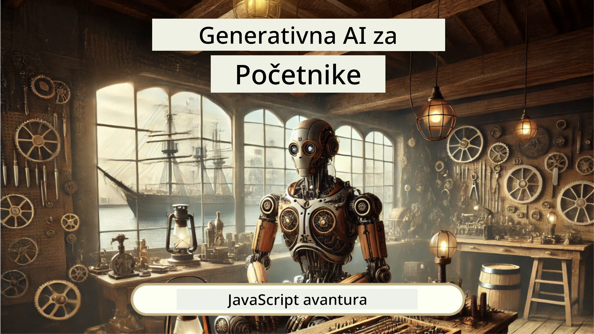
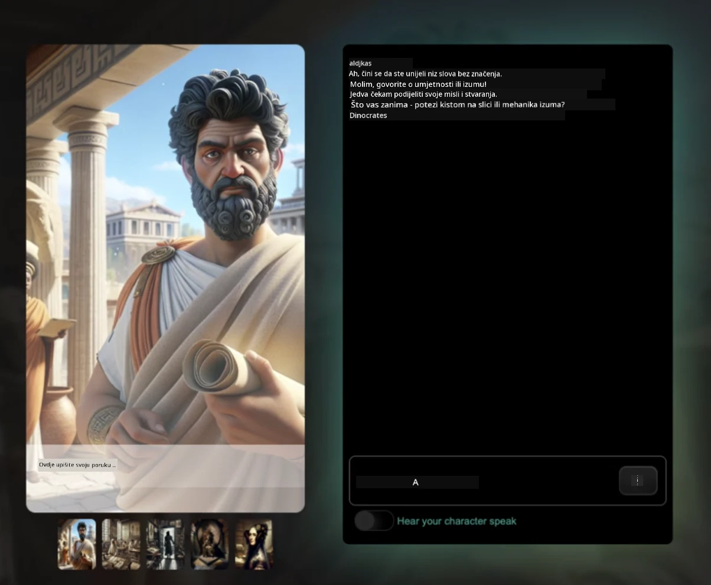
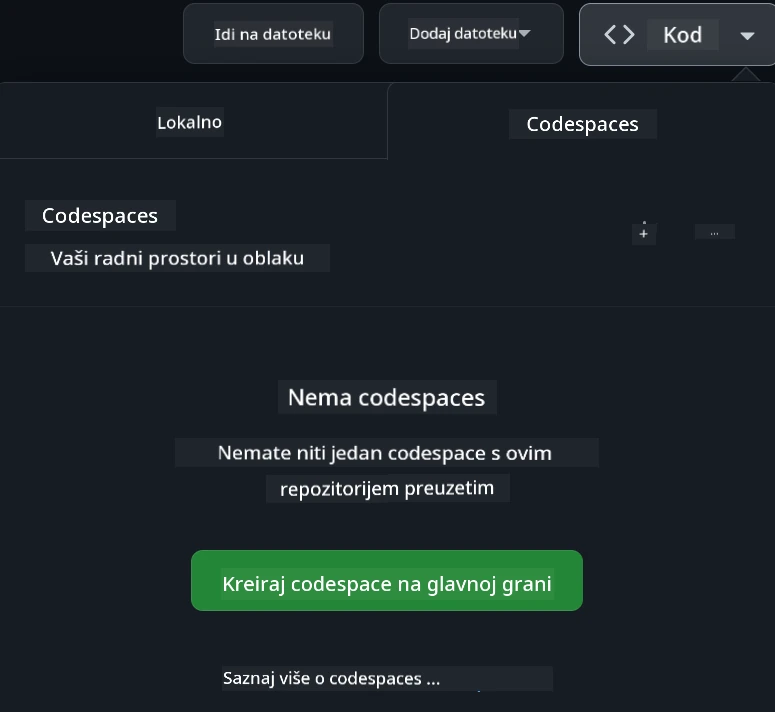

[](https://github.com/microsoft/Web-Dev-For-Beginners/blob/master/LICENSE)
[](https://GitHub.com/microsoft/Web-Dev-For-Beginners/graphs/contributors/)
[](https://GitHub.com/microsoft/Web-Dev-For-Beginners/issues/)
[](https://GitHub.com/microsoft/Web-Dev-For-Beginners/pulls/)
[](http://makeapullrequest.com) 

[](https://GitHub.com/microsoft/Web-Dev-For-Beginners/watchers/)
[](https://GitHub.com/microsoft/Web-Dev-For-Beginners/network/)
[](https://GitHub.com/microsoft/Web-Dev-For-Beginners/stargazers/)

[](https://discord.gg/nTYy5BXMWG)

# Razvoj weba za početnike - Nastavni plan

Naučite osnove web razvoja kroz naš sveobuhvatni 12-tjedni tečaj kojeg vode Microsoft Cloud Advocatei. Svaka od 24 lekcije detaljno obrađuje JavaScript, CSS i HTML kroz praktične projekte poput terarija, proširenja za preglednike i svemirskih igara. Uključite se u kvizove, rasprave i praktične zadatke. Unaprijedite svoje vještine i optimizirajte usvajanje znanja pomoću naše učinkovite pedagoške metode temeljenje na projektima. Započnite svoje programersko putovanje već danas!

Pridružite se Azure AI Foundry Discord zajednici

[](https://discord.gg/nTYy5BXMWG)

Slijedite ove korake da biste započeli s korištenjem ovih resursa:
1. **Forkajte repozitorij**: Kliknite [](https://GitHub.com/microsoft/Web-Dev-For-Beginners/fork)
2. **Klonirajte repozitorij**:   `git clone https://github.com/microsoft/Web-Dev-For-Beginners.git`
3. [**Pridružite se Azure AI Foundry Discordu i upoznajte stručnjake i kolege developere**](https://discord.com/invite/ByRwuEEgH4)

### 🌐 Podrška za više jezika

#### Podržano putem GitHub akcija (Automatski i uvijek ažurirano)

<!-- CO-OP TRANSLATOR LANGUAGES TABLE START -->
[Arabic](../ar/README.md) | [Bengali](../bn/README.md) | [Bulgarian](../bg/README.md) | [Burmese (Myanmar)](../my/README.md) | [Chinese (Simplified)](../zh-CN/README.md) | [Chinese (Traditional, Hong Kong)](../zh-HK/README.md) | [Chinese (Traditional, Macau)](../zh-MO/README.md) | [Chinese (Traditional, Taiwan)](../zh-TW/README.md) | [Croatian](./README.md) | [Czech](../cs/README.md) | [Danish](../da/README.md) | [Dutch](../nl/README.md) | [Estonian](../et/README.md) | [Finnish](../fi/README.md) | [French](../fr/README.md) | [German](../de/README.md) | [Greek](../el/README.md) | [Hebrew](../he/README.md) | [Hindi](../hi/README.md) | [Hungarian](../hu/README.md) | [Indonesian](../id/README.md) | [Italian](../it/README.md) | [Japanese](../ja/README.md) | [Kannada](../kn/README.md) | [Korean](../ko/README.md) | [Lithuanian](../lt/README.md) | [Malay](../ms/README.md) | [Malayalam](../ml/README.md) | [Marathi](../mr/README.md) | [Nepali](../ne/README.md) | [Nigerian Pidgin](../pcm/README.md) | [Norwegian](../no/README.md) | [Persian (Farsi)](../fa/README.md) | [Polish](../pl/README.md) | [Portuguese (Brazil)](../pt-BR/README.md) | [Portuguese (Portugal)](../pt-PT/README.md) | [Punjabi (Gurmukhi)](../pa/README.md) | [Romanian](../ro/README.md) | [Russian](../ru/README.md) | [Serbian (Cyrillic)](../sr/README.md) | [Slovak](../sk/README.md) | [Slovenian](../sl/README.md) | [Spanish](../es/README.md) | [Swahili](../sw/README.md) | [Swedish](../sv/README.md) | [Tagalog (Filipino)](../tl/README.md) | [Tamil](../ta/README.md) | [Telugu](../te/README.md) | [Thai](../th/README.md) | [Turkish](../tr/README.md) | [Ukrainian](../uk/README.md) | [Urdu](../ur/README.md) | [Vietnamese](../vi/README.md)

> **Radije klonirati lokalno?**
>
> Ovaj repozitorij uključuje više od 50 prijevoda što značajno povećava veličinu preuzimanja. Za kloniranje bez prijevoda, koristite sparse checkout:
>
> **Bash / macOS / Linux:**
> ```bash
> git clone --filter=blob:none --sparse https://github.com/microsoft/Web-Dev-For-Beginners.git
> cd Web-Dev-For-Beginners
> git sparse-checkout set --no-cone '/*' '!translations' '!translated_images'
> ```
>
> **CMD (Windows):**
> ```cmd
> git clone --filter=blob:none --sparse https://github.com/microsoft/Web-Dev-For-Beginners.git
> cd Web-Dev-For-Beginners
> git sparse-checkout set --no-cone "/*" "!translations" "!translated_images"
> ```
>
> Ovo vam daje sve što vam treba za dovršetak tečaja s puno bržim preuzimanjem.
<!-- CO-OP TRANSLATOR LANGUAGES TABLE END -->

**Ako želite da budu podržani dodatni jezici za prijevod, oni su navedeni [ovdje](https://github.com/Azure/co-op-translator/blob/main/getting_started/supported-languages.md)**

[](https://open.vscode.dev/microsoft/Web-Dev-For-Beginners)

#### 🧑‍🎓 _Jeste li student?_

Posjetite [**Student Hub stranicu**](https://docs.microsoft.com/learn/student-hub/?WT.mc_id=academic-77807-sagibbon) gdje ćete pronaći resurse za početnike, studentske pakete pa čak i načine kako dobiti besplatni certifikat. Ovo je stranica koju želite označiti i povremeno provjeravati jer mjesečno mijenjamo sadržaje.

### 📣 Objavljeno - Novi izazovi uz GitHub Copilot Agent mode!

Dodani su novi izazovi, potražite "GitHub Copilot Agent Challenge 🚀" u većini poglavlja. To je novi izazov koji možete dovršiti koristeći GitHub Copilot i Agent mode. Ako niste ranije koristili Agent mode, on ne samo da generira tekst već može i kreirati i uređivati datoteke, izvršavati naredbe i još mnogo toga.

### 📣 Objavljeno - _Novi projekt za izgradnju korištenjem generativne AI_

Upravo dodat novi AI Assistant projekt, pogledajte [projekt](./9-chat-project/README.md)

### 📣 Objavljeno - _Novi nastavni plan_ o generativnoj AI za JavaScript upravo je objavljen

Ne propustite naš novi nastavni plan o generativnoj AI!

Posjetite [https://aka.ms/genai-js-course](https://aka.ms/genai-js-course) za početak!



- Lekcije pokrivaju sve od osnova do RAG-a.
- Interakcija s povijesnim likovima kroz GenAI i našu prateću aplikaciju.
- Zabavno i zanimljivo pripovijedanje, putovat ćete kroz vrijeme!




Svaka lekcija uključuje zadatak za dovršiti, provjeru znanja i izazov za učenje tema poput:
- Promptanje i prompt inženjering
- Generiranje tekstualnih i slikovnih aplikacija
- Pretraživačke aplikacije

Posjetite [https://aka.ms/genai-js-course](https://aka.ms/genai-js-course) za početak!


## 🌱 Početak

> **Nastavnici**, uključili smo [neke prijedloge](for-teachers.md) kako koristiti ovaj nastavni plan. Voljeli bismo vaše povratne informacije [na našem forumu za rasprave](https://github.com/microsoft/Web-Dev-For-Beginners/discussions/categories/teacher-corner)!

**[Učenici](https://aka.ms/student-page/?WT.mc_id=academic-77807-sagibbon)**, za svaku lekciju započnite s pred-lecture kvizom, zatim pročitajte predavanje, dovršite različite aktivnosti i provjerite svoje razumijevanje pomoću post-lecture kviza.

Za povećanje svog iskustva učenja, povezujte se s kolegama i radite projekte zajedno! Poticanje rasprava je u našem [forumu za rasprave](https://github.com/microsoft/Web-Dev-For-Beginners/discussions) gdje je naš tim moderatora dostupan za odgovaranje na vaša pitanja.

Za daljnje obrazovanje, toplo preporučujemo istraživanje [Microsoft Learn](https://learn.microsoft.com/users/wirelesslife/collections/p1ddcy5jwy0jkm?WT.mc_id=academic-77807-sagibbon) za dodatne materijale za učenje.

### 📋 Postavljanje vašeg okruženja

Ovaj nastavni plan ima spremno razvojno okruženje! Kada započnete, možete odabrati pokretanje nastavnog plana u [Codespaceu](https://github.com/features/codespaces/) (_okruženje bazirano na pregledniku bez potrebe za instalacijama_), ili lokalno na vašem računalu koristeći tekstualni uređivač poput [Visual Studio Code](https://code.visualstudio.com/?WT.mc_id=academic-77807-sagibbon).

#### Kreirajte svoj repozitorij
Kako biste jednostavno spremili svoj rad, preporučuje se da kreirate vlastitu kopiju ovog repozitorija. To možete učiniti klikom na gumb **Use this template** na vrhu stranice. Time će se u vašem GitHub računu kreirati novi repozitorij s kopijom nastavnog plana.

Slijedite ove korake:
1. **Forkajte repozitorij**: Kliknite na gumb "Fork" u gornjem desnom kutu ove stranice.
2. **Klonirajte repozitorij**:   `git clone https://github.com/microsoft/Web-Dev-For-Beginners.git`

#### Pokretanje nastavnog plana u Codespaceu

U vašoj kopiji ovog repozitorija kliknite na gumb **Code** i odaberite **Open with Codespaces**. Time će se kreirati novi Codespace u kojem ćete raditi.



#### Pokretanje nastavnog plana lokalno na vašem računalu

Da biste ovaj nastavni plan pokrenuli lokalno na računalu, trebat će vam tekstualni uređivač, preglednik i alat za naredbenu liniju. Naša prva lekcija, [Uvod u programske jezike i alate](../../1-getting-started-lessons/1-intro-to-programming-languages), provest će vas kroz različite opcije za svaki od ovih alata kako biste odabrali što vam najviše odgovara.

Naša preporuka je da koristite [Visual Studio Code](https://code.visualstudio.com/?WT.mc_id=academic-77807-sagibbon) kao uređivač koji također ima ugrađeni [Terminal](https://code.visualstudio.com/docs/terminal/basics/?WT.mc_id=academic-77807-sagibbon). Visual Studio Code možete preuzeti [ovdje](https://code.visualstudio.com/?WT.mc_id=academic-77807-sagibbon).
1. Klonirajte vaš repozitorij na računalo. To možete učiniti klikom na gumb **Code** i kopiranjem URL-a:

    [CodeSpace](./images/createcodespace.png)

    Zatim otvorite [Terminal](https://code.visualstudio.com/docs/terminal/basics/?WT.mc_id=academic-77807-sagibbon) unutar [Visual Studio Code](https://code.visualstudio.com/?WT.mc_id=academic-77807-sagibbon) i pokrenite sljedeću naredbu, zamjenjujući `<your-repository-url>` s URL-om koji ste upravo kopirali:

    ```bash 
    git clone <your-repository-url>
    ```

2. Otvorite mapu u Visual Studio Code. To možete učiniti klikom na **File** > **Open Folder** i odabirom mape koju ste upravo klonirali.


>  Preporučeni dodaci za Visual Studio Code:
>
> * [Live Server](https://marketplace.visualstudio.com/items?itemName=ritwickdey.LiveServer&WT.mc_id=academic-77807-sagibbon) - za pregled HTML stranica unutar Visual Studio Codea
> * [Copilot](https://marketplace.visualstudio.com/items?itemName=GitHub.copilot&WT.mc_id=academic-77807-sagibbon) - za pomoć pri bržem pisanju koda

## 📂 Svaka lekcija uključuje:

- neobaveznu skicu
- neobavezni dodatni video
- kviz za zagrijavanje prije lekcije
- pisanu lekciju
- za lekcije temeljene na projektima, korak-po-korak vodiče za izgradnju projekta
- provjere znanja
- izazov
- dodatno čitanje
- zadatak
- [kviz nakon lekcije](https://ff-quizzes.netlify.app/web/)

> **Napomena o kvizovima**: Svi kvizovi su u mapi Quiz-app, ukupno 48 kvizova s po tri pitanja. Dostupni su [ovdje](https://ff-quizzes.netlify.app/web/); aplikacija kviza može se pokrenuti lokalno ili implementirati u Azure; slijedite upute u mapi `quiz-app`.

## 🗃️ Lekcije

|     |                       Naziv projekta                      |                            Koncepti koji se podučavaju                             | Ciljevi učenja                                                                                                                 |                                                         Povezana lekcija                                                          |         Autor          |
| :-: | :-------------------------------------------------------: | :--------------------------------------------------------------------------------: | ------------------------------------------------------------------------------------------------------------------------------ | :-----------------------------------------------------------------------------------------------------------------------------: | :---------------------: |
| 01  |                     Početak rada                          |           Uvod u programiranje i alate trgovine                                    | Naučite osnovne temelje iza većine programskih jezika i o softveru koji pomaže profesionalnim programerima u njihovom radu      | [Uvod u programske jezike i alate](./1-getting-started-lessons/1-intro-to-programming-languages/README.md)                        |         Jasmine         |
| 02  |                     Početak rada                          |             Osnove GitHub-a, uključuje rad u timu                                  | Kako koristiti GitHub u vašem projektu, kako surađivati s drugima na bazi koda                                                  |                            [Uvod u GitHub](./1-getting-started-lessons/2-github-basics/README.md)                                    |          Floor          |
| 03  |                     Početak rada                          |                             Pristupačnost                                           | Naučite osnove pristupačnosti weba                                                                                              |                       [Osnove pristupačnosti](./1-getting-started-lessons/3-accessibility/README.md)                                |       Christopher       |
| 04  |                        Osnove JS                          |                         JavaScript tipovi podataka                                | Osnove tipova podataka u JavaScriptu                                                                                            |                                       [Tipovi podataka](./2-js-basics/1-data-types/README.md)                                       |         Jasmine         |
| 05  |                        Osnove JS                          |                         Funkcije i metode                                        | Naučite o funkcijama i metodama za upravljanje tokom logike aplikacije                                                         |                              [Funkcije i metode](./2-js-basics/2-functions-methods/README.md)                                      | Jasmine i Christopher   |
| 06  |                        Osnove JS                          |                        Donošenje odluka u JS                                     | Naučite kako kreirati uvjete u vašem kodu koristeći metode za donošenje odluka                                                 |                                 [Donošenje odluka](./2-js-basics/3-making-decisions/README.md)                                   |         Jasmine         |
| 07  |                        Osnove JS                          |                            Nizovi i petlje                                       | Radite s podacima koristeći nizove i petlje u JavaScriptu                                                                       |                                   [Nizovi i petlje](./2-js-basics/4-arrays-loops/README.md)                                     |         Jasmine         |
| 08  |       [Terrarij](./3-terrarium/solution/README.md)       |                            HTML u praksi                                         | Izgradite HTML za online terarij, fokusirajući se na izradu rasporeda                                                          |                                 [Uvod u HTML](./3-terrarium/1-intro-to-html/README.md)                                          |           Jen           |
| 09  |       [Terrarij](./3-terrarium/solution/README.md)       |                            CSS u praksi                                          | Izgradite CSS za stiliziranje online terarija, fokusirajući se na osnove CSS-a uključujući responsivni dizajn stranice           |                                  [Uvod u CSS](./3-terrarium/2-intro-to-css/README.md)                                          |           Jen           |
| 10  |            [Terrarij](./3-terrarium/solution/README.md)            |                 JavaScript closures, manipulacija DOM-om                        | Izgradite JavaScript koji omogućava funkcionalnost terarija kao povuci-i-ispusti sučelja, fokusirajući se na closures i DOM     |                  [JavaScript closures, manipulacija DOM-om](./3-terrarium/3-intro-to-DOM-and-closures/README.md)                |           Jen           |
| 11  |          [Igra tipkanja](./4-typing-game/solution/README.md)          |                          Izradite igru tipkanja                                  | Naučite koristiti događaje tipkovnice za upravljanje logikom vaše JavaScript aplikacije                                         |                                [Programiranje vođeno događajima](./4-typing-game/typing-game/README.md)                          |       Christopher       |
| 12  | [Ekstenzija za zeleno pregledavanje](./5-browser-extension/solution/README.md) |                         Rad s preglednicima                                    | Naučite kako preglednici rade, njihovu povijest i kako izgraditi prve elemente ekstenzije preglednika                            |                               [O preglednicima](./5-browser-extension/1-about-browsers/README.md)                                  |           Jen           |
| 13  | [Ekstenzija za zeleno pregledavanje](./5-browser-extension/solution/README.md) | Izrada obrasca, pozivanje API-ja i pohrana varijabli u lokalnu pohranu          | Izradite JavaScript elemente vaše ekstenzije za preglednik za pozivanje API-ja koristeći varijable pohranjene u lokalnu pohranu |                [API-ji, obrasci i lokalna pohrana](./5-browser-extension/2-forms-browsers-local-storage/README.md)               |           Jen           |
| 14  | [Ekstenzija za zeleno pregledavanje](./5-browser-extension/solution/README.md) |          Pozadinski procesi u pregledniku, web performanse                     | Koristite pozadinske procese preglednika za upravljanje ikonom ekstenzije; naučite o web performansama i nekim optimizacijama  |             [Pozadinski zadaci i performanse](./5-browser-extension/3-background-tasks-and-performance/README.md)               |           Jen           |
| 15  |           [Igra u svemiru](./6-space-game/solution/README.md)           |             Naprednija izrada igara s JavaScriptom                            | Naučite o nasljeđivanju koristeći i klase i kompoziciju te Pub/Sub obrascu, kao pripremu za izradu igre                         |                      [Uvod u naprednu izradu igara](./6-space-game/1-introduction/README.md)                                     |          Chris          |
| 16  |           [Igra u svemiru](./6-space-game/solution/README.md)           |                           Crtanje na platnu                                   | Naučite o Canvas API-ju, koji se koristi za crtanje elemenata na zaslonu                                                      |                                [Crtanje na platnu](./6-space-game/2-drawing-to-canvas/README.md)                                |          Chris          |
| 17  |           [Igra u svemiru](./6-space-game/solution/README.md)           |                   Pomicanje elemenata po zaslonu                              | Otkrijte kako elementi mogu dobiti gibanje koristeći kartezijanske koordinate i Canvas API                                       |                           [Pomicanje elemenata](./6-space-game/3-moving-elements-around/README.md)                             |          Chris          |
| 18  |           [Igra u svemiru](./6-space-game/solution/README.md)           |                          Detekcija sudara                                    | Neka se elementi sudaraju i međusobno reagiraju korištenjem pritisaka tipki i izvedite funkciju cooldown za osiguranje performansi igre |                              [Detekcija sudara](./6-space-game/4-collision-detection/README.md)                                |          Chris          |
| 19  |           [Igra u svemiru](./6-space-game/solution/README.md)           |                             Vođenje rezultata                                 | Izvršite matematičke izračune temeljene na statusu igre i izvedbi                                                            |                                    [Vođenje rezultata](./6-space-game/5-keeping-score/README.md)                                  |          Chris          |
| 20  |           [Igra u svemiru](./6-space-game/solution/README.md)           |                     Završetak i ponovno pokretanje igre                       | Naučite o završavanju i ponovnom pokretanju igre, uključujući čišćenje resursa i resetiranje vrijednosti varijabli             |                                [Uvjet završetka](./6-space-game/6-end-condition/README.md)                                      |          Chris          |
| 21  |         [Bankarska aplikacija](./7-bank-project/solution/README.md)          |                 HTML predlošci i rute u web aplikaciji                      | Naučite kako napraviti arhitekturu višestranične web stranice koristeći rutiranje i HTML predloške                           |                            [HTML predlošci i rute](./7-bank-project/1-template-route/README.md)                                 |          Yohan          |
| 22  |         [Bankarska aplikacija](./7-bank-project/solution/README.md)          |                  Izrada obrasca za prijavu i registraciju                    | Naučite o izradi obrazaca i rukovanju procedurama validacije                                                                 |                                           [Obrasci](./7-bank-project/2-forms/README.md)                                    |          Yohan          |
| 23  |         [Bankarska aplikacija](./7-bank-project/solution/README.md)          |                   Metode dohvaćanja i korištenja podataka                   | Kako podaci ulaze i izlaze iz vaše aplikacije, kako ih dohvatiti, pohraniti i odbaciti                                        |                                            [Podaci](./7-bank-project/3-data/README.md)                                         |          Yohan          |
| 24  |         [Bankarska aplikacija](./7-bank-project/solution/README.md)          |                      Koncepti upravljanja stanjem                           | Naučite kako vaša aplikacija zadržava stanje i kako ga upravljati programatski                                              |                                [Upravljanje stanjem](./7-bank-project/4-state-management/README.md)                              |          Yohan          |
| 25 | [Browser/VScode Code](../../8-code-editor) | Rad s VScode | Naučite kako koristiti uređivač koda | [Korištenje VScode uređivača](./8-code-editor/1-using-a-code-editor/README.md) | Chris |
| 26 | [AI asistenti](./9-chat-project/README.md) | Rad s AI | Naučite kako izgraditi vlastitog AI asistenta | [AI projekt asistenta](./9-chat-project/README.md) | Chris |

## 🏫 Pedagogija

Naš kurikulum je dizajniran s dvije ključne pedagoške smjernice:
* učenje temeljeno na projektima
* učestali kvizovi

Program uči osnove JavaScripta, HTML-a i CSS-a, kao i najnovije alate i tehnike koje koriste današnji web programeri. Studenti će imati priliku razviti praktično iskustvo izradom igre tipkanja, virtualnog terarija, ekološki prihvatljive proširenje za preglednik, igre u stilu space invadera i bankarske aplikacije za poduzeća. Na kraju serije, studenti će imati čvrsto razumijevanje web razvoja.

> 🎓 Prve lekcije ovog kurikuluma možete proći kao [Learn Path](https://docs.microsoft.com/learn/paths/web-development-101/?WT.mc_id=academic-77807-sagibbon) na Microsoft Learn!

Osiguravanjem podudarnosti sadržaja s projektima, proces je angažiraniji za studente i zadržavanje koncepata će biti poboljšano. Također smo napisali nekoliko uvodnih lekcija o osnovama JavaScripta za upoznavanje s konceptima, uparene s videom iz zbirke video tutorijala "[Početnička serija za: JavaScript](https://channel9.msdn.com/Series/Beginners-Series-to-JavaScript/?WT.mc_id=academic-77807-sagibbon)", od kojih su neki autori doprinijeli ovom kurikulumu.

Osim toga, kviz s niskim ulozima prije sata usmjerava namjeru učenika prema učenju teme, dok drugi kviz nakon predavanja osigurava dodatno zadržavanje. Ovaj kurikulum je dizajniran da bude fleksibilan i zabavan te može se pohađati u cjelini ili djelomično. Projekti počinju mali i postaju sve složeniji do kraja 12-tjednog ciklusa.

Iako smo namjerno izbjegavali uvođenje JavaScript frameworka kako bismo se koncentrirali na osnovne vještine potrebne kao web programer prije usvajanja frameworka, dobar sljedeći korak u dovršetku ovog kurikuluma bilo bi učenje o Node.js putem druge zbirke videozapisa: "[Početnička serija za: Node.js](https://channel9.msdn.com/Series/Beginners-Series-to-Nodejs/?WT.mc_id=academic-77807-sagibbon)".

> Posjetite naše smjernice [Kodeksa ponašanja](CODE_OF_CONDUCT.md) i [Doprinos](CONTRIBUTING.md). Dobrodošli su vaši konstruktivni komentari!


## 🧭 Pristup izvan mreže

Ovu dokumentaciju možete pokrenuti izvan mreže koristeći [Docsify](https://docsify.js.org/#/). Forkajte ovaj repozitorij, [instalirajte Docsify](https://docsify.js.org/#/quickstart) na svoje lokalno računalo, a zatim u korijenskoj mapi ovog repozitorija upišite `docsify serve`. Web stranica će se poslužiti na portu 3000 na vašem localhostu: `localhost:3000`.

## 📘 PDF
PDF svih lekcija možete pronaći [ovdje](https://microsoft.github.io/Web-Dev-For-Beginners/pdf/readme.pdf).


## 🎒 Drugi tečajevi

Naš tim proizvodi i druge tečajeve! Pogledajte:

<!-- CO-OP TRANSLATOR OTHER COURSES START -->
### LangChain
[](https://aka.ms/langchain4j-for-beginners)
[](https://aka.ms/langchainjs-for-beginners?WT.mc_id=m365-94501-dwahlin)
[](https://github.com/microsoft/langchain-for-beginners?WT.mc_id=m365-94501-dwahlin)
---

### Azure / Edge / MCP / Agents
[](https://github.com/microsoft/AZD-for-beginners?WT.mc_id=academic-105485-koreyst)
[](https://github.com/microsoft/edgeai-for-beginners?WT.mc_id=academic-105485-koreyst)
[](https://github.com/microsoft/mcp-for-beginners?WT.mc_id=academic-105485-koreyst)
[](https://github.com/microsoft/ai-agents-for-beginners?WT.mc_id=academic-105485-koreyst)

---
 
### Serija Generativne AI
[](https://github.com/microsoft/generative-ai-for-beginners?WT.mc_id=academic-105485-koreyst)
[-9333EA?style=for-the-badge&labelColor=E5E7EB&color=9333EA)](https://github.com/microsoft/Generative-AI-for-beginners-dotnet?WT.mc_id=academic-105485-koreyst)
[-C084FC?style=for-the-badge&labelColor=E5E7EB&color=C084FC)](https://github.com/microsoft/generative-ai-for-beginners-java?WT.mc_id=academic-105485-koreyst)
[-E879F9?style=for-the-badge&labelColor=E5E7EB&color=E879F9)](https://github.com/microsoft/generative-ai-with-javascript?WT.mc_id=academic-105485-koreyst)

---
 
### Osnovno učenje
[](https://aka.ms/ml-beginners?WT.mc_id=academic-105485-koreyst)
[](https://aka.ms/datascience-beginners?WT.mc_id=academic-105485-koreyst)
[](https://aka.ms/ai-beginners?WT.mc_id=academic-105485-koreyst)
[](https://github.com/microsoft/Security-101?WT.mc_id=academic-96948-sayoung)
[](https://aka.ms/webdev-beginners?WT.mc_id=academic-105485-koreyst)
[](https://aka.ms/iot-beginners?WT.mc_id=academic-105485-koreyst)
[](https://github.com/microsoft/xr-development-for-beginners?WT.mc_id=academic-105485-koreyst)

---
 
### Serija Copilot
[](https://aka.ms/GitHubCopilotAI?WT.mc_id=academic-105485-koreyst)
[](https://github.com/microsoft/mastering-github-copilot-for-dotnet-csharp-developers?WT.mc_id=academic-105485-koreyst)
[](https://github.com/microsoft/CopilotAdventures?WT.mc_id=academic-105485-koreyst)
<!-- CO-OP TRANSLATOR OTHER COURSES END -->

## Dobivanje pomoći

Ako zapnete ili imate bilo kakvih pitanja o izradi AI aplikacija, pridružite se ostalim polaznicima i iskusnim developerima u raspravama o MCP-u. To je podržavajuća zajednica gdje su pitanja dobrodošla, a znanje se slobodno dijeli.

[](https://discord.gg/nTYy5BXMWG)

Ako imate povratne informacije o proizvodu ili prijavite greške tijekom izrade, posjetite:

[](https://aka.ms/foundry/forum)

## Licenca

Ovo spremište licencirano je pod MIT licencom. Pogledajte datoteku [LICENSE](../../LICENSE) za više informacija.

---

<!-- CO-OP TRANSLATOR DISCLAIMER START -->
**Odricanje od odgovornosti**:
Ovaj dokument je preveden pomoću AI usluge za prevođenje [Co-op Translator](https://github.com/Azure/co-op-translator). Iako nastojimo osigurati točnost, imajte na umu da automatski prijevodi mogu sadržavati pogreške ili netočnosti. Izvorni dokument na izvornom jeziku treba smatrati autoritativnim izvorom. Za važne informacije preporučuje se profesionalni ljudski prijevod. Ne snosimo odgovornost za bilo kakva nesporazuma ili pogrešna tumačenja koja proizlaze iz korištenja ovog prijevoda.
<!-- CO-OP TRANSLATOR DISCLAIMER END -->