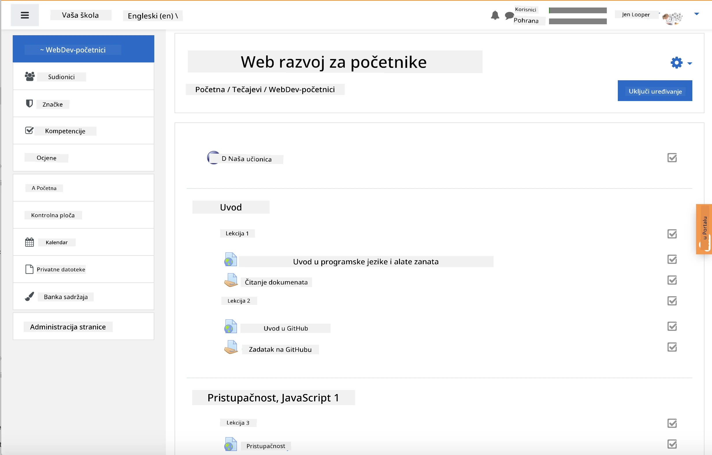
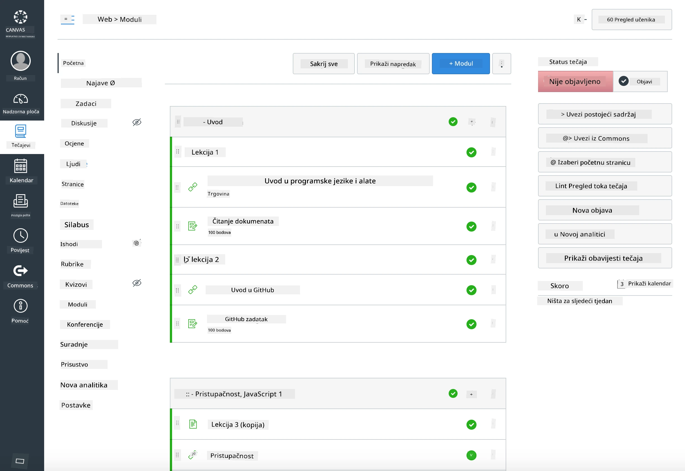

<!--
CO_OP_TRANSLATOR_METADATA:
{
  "original_hash": "71009af209f81cc01a1f2d324200375f",
  "translation_date": "2025-10-03T10:54:08+00:00",
  "source_file": "for-teachers.md",
  "language_code": "hr"
}
-->
### Za edukatore

Slobodno koristite ovaj kurikulum u svojoj učionici. Odlično se integrira s GitHub Classroomom i vodećim LMS platformama, a može se koristiti i kao samostalni repozitorij sa studentima.

### Korištenje s GitHub Classroomom

Za upravljanje lekcijama i zadacima po grupama, kreirajte jedan repozitorij po lekciji kako bi GitHub Classroom mogao zasebno povezati svaki zadatak.

- Forkajte ovaj repozitorij u svoju organizaciju.
- Kreirajte zaseban repozitorij za svaku lekciju tako da izvučete mapu lekcije u vlastiti repozitorij.
  - Opcija A: Kreirajte prazne repozitorije (jedan po lekciji) i kopirajte sadržaj mape lekcije u svaki.
  - Opcija B: Koristite pristup koji čuva povijest Git-a (npr. podijelite mapu u novi repozitorij) ako vam je potrebna povijest promjena.
- U GitHub Classroomu, kreirajte zadatak po lekciji i povežite ga s odgovarajućim repozitorijem lekcije.
- Preporučene postavke:
  - Vidljivost repozitorija: privatna za studentski rad.
  - Koristite početni kod iz zadane grane repozitorija lekcije.
  - Dodajte predloške za probleme (Issues) i zahtjeve za povlačenje (Pull Requests) za kvizove i predaje.
  - Opcionalno konfigurirajte automatsko ocjenjivanje i testove ako vaše lekcije uključuju takve elemente.
- Korisne konvencije:
  - Nazivi repozitorija poput lesson-01-intro, lesson-02-html, itd.
  - Oznake: kviz, zadatak, treba-pregled, kasno, ponovna-predaja.
  - Oznake/izdanja po grupama (npr. v2025-term1).

Savjet: Izbjegavajte pohranjivanje repozitorija unutar sinkroniziranih mapa (npr. OneDrive/Google Drive) kako biste spriječili Git konflikte na Windowsima.

### Korištenje s Moodleom, Canvasom ili Blackboardom

Ovaj kurikulum uključuje pakete za uvoz koji su kompatibilni s uobičajenim LMS radnim procesima.

- Moodle: Koristite Moodle datoteku za učitavanje [Moodle upload file](../../../../../../../teaching-files/webdev-moodle.mbz) za učitavanje cijelog tečaja.
- Common Cartridge: Koristite Common Cartridge datoteku [Common Cartridge file](../../../../../../../teaching-files/webdev-common-cartridge.imscc) za širu LMS kompatibilnost.
- Napomene:
  - Moodle Cloud ima ograničenu podršku za Common Cartridge. Preferirajte gore navedenu Moodle datoteku, koja se također može učitati u Canvas.
  - Nakon uvoza, pregledajte module, datume dospijeća i postavke kvizova kako bi odgovarali vašem rasporedu semestra.

> Kurikulum u Moodle učionici

> Kurikulum u Canvasu

### Korištenje repozitorija direktno (bez Classrooma)

Ako ne želite koristiti GitHub Classroom, tečaj možete voditi direktno iz ovog repozitorija.

- Sinkroni/online formati (Zoom/Teams):
  - Vodite kratke uvodne sesije; koristite breakout sobe za kvizove.
  - Najavite vremenski okvir za kvizove; studenti predaju odgovore kao GitHub Issues.
  - Za suradničke zadatke, studenti rade u javnim repozitorijima lekcija i otvaraju Pull Requests.
- Privatni/asinkroni formati:
  - Studenti forkaju svaku lekciju u svoje **privatne** repozitorije i dodaju vas kao suradnika.
  - Predaju putem Issues (kvizovi) i Pull Requests (zadatci) na vašem repozitoriju učionice ili njihovim privatnim forkovima.

### Najbolje prakse

- Osigurajte uvodnu lekciju o osnovama Git-a/GitHuba, Issues i PR-ova.
- Koristite kontrolne liste u Issues za višekorake kvizove/zadatke.
- Dodajte CONTRIBUTING.md i CODE_OF_CONDUCT.md za postavljanje normi učionice.
- Dodajte bilješke o pristupačnosti (alt tekst, titlovi) i ponudite ispisive PDF-ove.
- Verzionirajte svoj sadržaj po semestru i zamrznite repozitorije lekcija nakon objave.

### Povratne informacije i podrška

Želimo da ovaj kurikulum bude koristan vama i vašim studentima. Otvorite novi Issue u ovom repozitoriju za prijavu grešaka, zahtjeva ili poboljšanja, ili započnite raspravu u Teacher Corner.

---

**Odricanje od odgovornosti**:  
Ovaj dokument je preveden pomoću AI usluge za prevođenje [Co-op Translator](https://github.com/Azure/co-op-translator). Iako nastojimo osigurati točnost, imajte na umu da automatski prijevodi mogu sadržavati pogreške ili netočnosti. Izvorni dokument na izvornom jeziku treba smatrati autoritativnim izvorom. Za ključne informacije preporučuje se profesionalni prijevod od strane čovjeka. Ne preuzimamo odgovornost za nesporazume ili pogrešna tumačenja koja mogu proizaći iz korištenja ovog prijevoda.