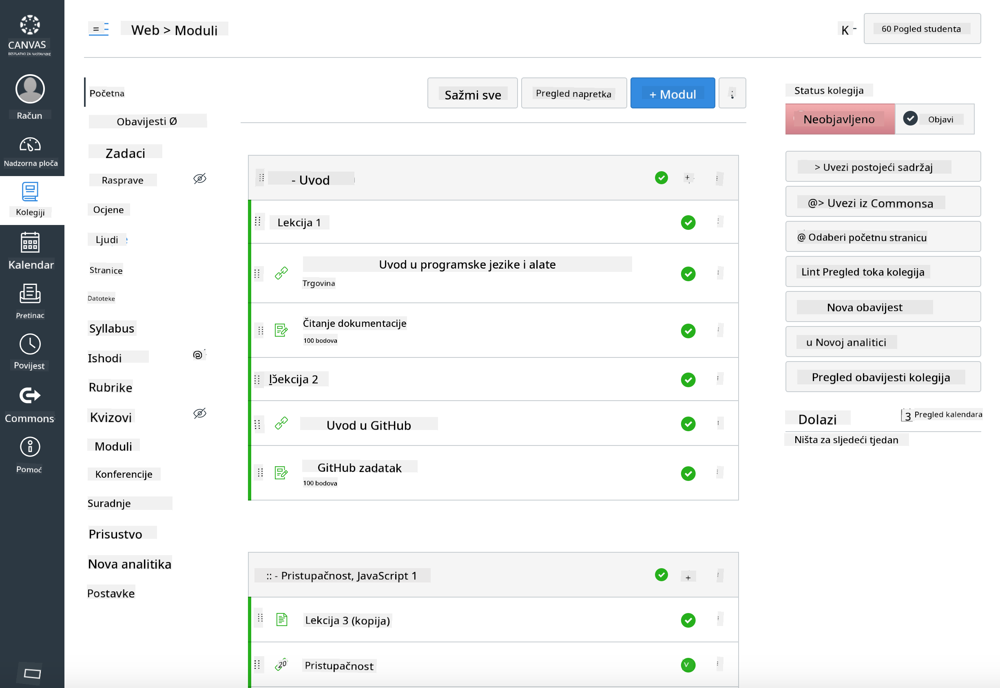

<!--
CO_OP_TRANSLATOR_METADATA:
{
  "original_hash": "75cb51f7ca9ea0b097ef4a1287e9290c",
  "translation_date": "2025-08-27T21:59:26+00:00",
  "source_file": "for-teachers.md",
  "language_code": "hr"
}
-->
## Za edukatore

Želite li koristiti ovaj kurikulum u svojoj učionici? Slobodno ga iskoristite!

Zapravo, možete ga koristiti direktno na GitHubu koristeći GitHub Classroom.

Da biste to učinili, forkajte ovaj repozitorij. Trebat ćete kreirati repozitorij za svaku lekciju, pa ćete morati izdvojiti svaku mapu u zaseban repozitorij. Na taj način, [GitHub Classroom](https://classroom.github.com/classrooms) može prepoznati svaku lekciju zasebno.

Ove [detaljne upute](https://github.blog/2020-03-18-set-up-your-digital-classroom-with-github-classroom/) pružit će vam ideju kako postaviti svoju učionicu.

## Korištenje u Moodleu, Canvasu ili Blackboardu

Ovaj kurikulum odlično funkcionira u ovim sustavima za upravljanje učenjem! Koristite [Moodle datoteku za prijenos](../../../../../../../teaching-files/webdev-moodle.mbz) za puni sadržaj ili isprobajte [Common Cartridge datoteku](../../../../../../../teaching-files/webdev-common-cartridge.imscc) koja sadrži dio sadržaja. Moodle Cloud ne podržava potpune Common Cartridge izvoze, pa je bolje koristiti Moodle datoteku za preuzimanje koja se može prenijeti u Canvas. Javite nam kako možemo poboljšati ovo iskustvo.

  
> Kurikulum u Moodle učionici

  
> Kurikulum u Canvasu

## Korištenje repozitorija u trenutnom obliku

Ako želite koristiti ovaj repozitorij u trenutnom obliku, bez korištenja GitHub Classrooma, i to je moguće. Trebat ćete komunicirati sa svojim učenicima o tome koju lekciju zajedno obrađujete.

U online formatu (Zoom, Teams ili drugi) možete organizirati breakout sobe za kvizove i mentorirati učenike kako bi se pripremili za učenje. Zatim pozovite učenike na kvizove i neka predaju svoje odgovore kao 'issues' u određeno vrijeme. Isto možete učiniti i sa zadacima ako želite da učenici surađuju javno.

Ako preferirate privatniji format, zamolite učenike da forkaju kurikulum, lekciju po lekciju, u svoje privatne GitHub repozitorije i daju vam pristup. Tada mogu privatno rješavati kvizove i zadatke te ih predati vama putem 'issues' na vašem repozitoriju za učionicu.

Postoji mnogo načina kako ovo može funkcionirati u online učionici. Javite nam što vam najbolje odgovara!

## Podijelite svoje mišljenje s nama!

Želimo da ovaj kurikulum funkcionira za vas i vaše učenike. Povežite se s nama na [Teacher corner](https://github.com/microsoft/Web-Dev-For-Beginners/discussions/categories/teacher-corner) i otvorite [**novi issue**](https://github.com/microsoft/Web-Dev-For-Beginners/issues/new/choose) za bilo kakve zahtjeve, greške i povratne informacije.

---

**Odricanje od odgovornosti**:  
Ovaj dokument je preveden pomoću AI usluge za prevođenje [Co-op Translator](https://github.com/Azure/co-op-translator). Iako nastojimo osigurati točnost, imajte na umu da automatski prijevodi mogu sadržavati pogreške ili netočnosti. Izvorni dokument na izvornom jeziku treba smatrati autoritativnim izvorom. Za kritične informacije preporučuje se profesionalni prijevod od strane čovjeka. Ne preuzimamo odgovornost za bilo kakva nesporazuma ili pogrešna tumačenja koja proizlaze iz korištenja ovog prijevoda.