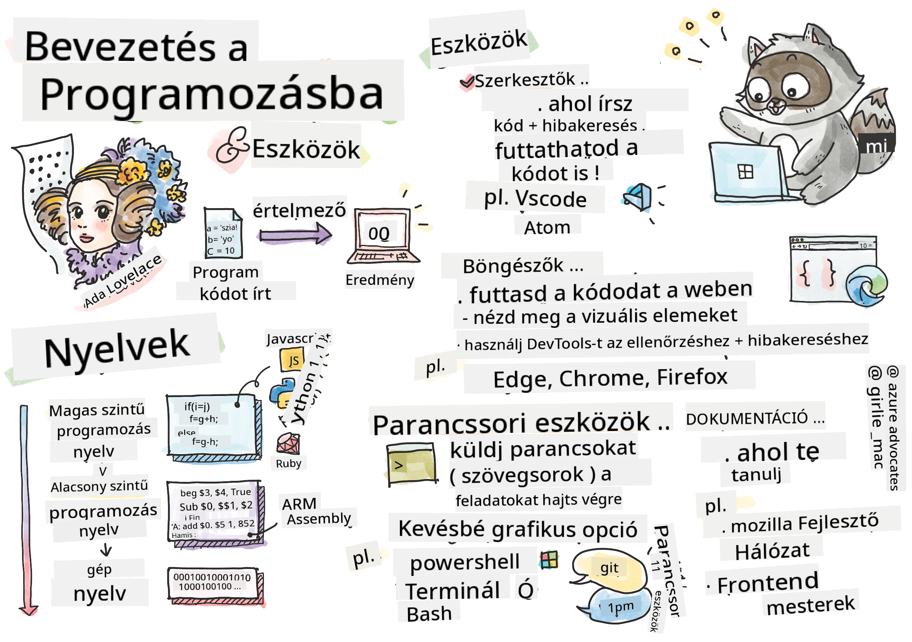

<!--
CO_OP_TRANSLATOR_METADATA:
{
  "original_hash": "3e0da5eb9b275fe3cb431033c1413ec2",
  "translation_date": "2025-10-24T19:57:48+00:00",
  "source_file": "1-getting-started-lessons/1-intro-to-programming-languages/README.md",
  "language_code": "hu"
}
-->
# Bevezetés a programozási nyelvekhez és modern fejlesztői eszközökhöz

Helló, leendő fejlesztő! 👋 Mondhatok valamit, amitől még mindig libabőrös leszek minden egyes nap? Hamarosan rájössz, hogy a programozás nem csak számítógépekről szól – ez valójában szuperképesség, amivel a legvadabb ötleteidet is életre keltheted!

Tudod azt a pillanatot, amikor a kedvenc alkalmazásodat használod, és minden tökéletesen működik? Amikor megnyomsz egy gombot, és valami varázslatos történik, amitől azt gondolod: "Wow, ezt hogy csinálták?" Nos, valaki, aki valószínűleg épp a kedvenc kávézójában ült hajnali 2-kor a harmadik eszpresszójával, írta azt a kódot, ami ezt a varázslatot létrehozta. És itt jön a lényeg: a mai lecke végére nemcsak megérted, hogyan csinálták, hanem alig várod majd, hogy te is kipróbáld!

Nézd, teljesen megértem, ha a programozás most ijesztőnek tűnik. Amikor én kezdtem, őszintén azt hittem, hogy ehhez valami matekzseni kell, vagy hogy már ötéves korod óta kódolnod kell. De itt van, ami teljesen megváltoztatta a nézőpontomat: a programozás pontosan olyan, mint egy új nyelven való beszélgetés megtanulása. Elkezdesz az "hello" és "köszönöm" szavakkal, aztán eljutsz odáig, hogy kávét rendelsz, és mire észbe kapsz, már mély filozófiai beszélgetéseket folytatsz! Csak ebben az esetben számítógépekkel beszélgetsz, és őszintén? Ők a legtürelmesebb beszélgetőpartnerek, akikkel valaha találkoztál – sosem ítélik el a hibáidat, és mindig készen állnak újra próbálkozni!

Ma felfedezzük azokat a hihetetlen eszközöket, amelyek nemcsak lehetővé teszik a modern webfejlesztést, hanem komolyan függőséget okoznak. Pontosan ugyanazokról a szerkesztőkről, böngészőkről és munkafolyamatokról beszélek, amelyeket a Netflix, a Spotify és a kedvenc indie alkalmazásstúdiód fejlesztői használnak minden egyes nap. És itt jön a rész, amitől táncra perdülsz: ezeknek a professzionális, iparági szabványú eszközöknek a többsége teljesen ingyenes!


> Sketchnote készítette: [Tomomi Imura](https://twitter.com/girlie_mac)

## Nézzük, mit tudsz már!

Mielőtt belevágunk a szórakoztató részbe, kíváncsi vagyok – mit tudsz már erről a programozási világról? És figyelj, ha úgy nézed ezeket a kérdéseket, hogy "Fogalmam sincs semmiről," az nemcsak rendben van, hanem tökéletes! Ez azt jelenti, hogy pontosan jó helyen vagy. Gondolj erre a kvízre úgy, mint egy bemelegítésre edzés előtt – csak megmozgatjuk az agyi izmaidat!

[Vegyél részt az előzetes kvízen](https://forms.office.com/r/dru4TE0U9n?origin=lprLink)


## A kaland, amire együtt indulunk

Oké, őszintén ugrálok az izgatottságtól, hogy mit fogunk ma felfedezni! Komolyan, bárcsak láthatnám az arcodat, amikor néhány koncepció összeáll. Íme az elképesztő utazás, amit együtt teszünk meg:

- **Mi is valójában a programozás (és miért ez a legmenőbb dolog valaha!)** – Felfedezzük, hogyan működik a kód, mint láthatatlan varázslat, amely mindent körülötted működtet, az ébresztőtől, ami valahogy tudja, hogy hétfő van, egészen az algoritmusig, ami tökéletesen összeállítja a Netflix ajánlásaidat
- **Programozási nyelvek és lenyűgöző személyiségük** – Képzeld el, hogy belépsz egy buliba, ahol mindenki teljesen különböző szuperképességekkel és problémamegoldási módszerekkel rendelkezik. Ilyen a programozási nyelvek világa, és imádni fogod megismerni őket!
- **Az alapvető építőelemek, amelyek digitális varázslatot hoznak létre** – Gondolj ezekre úgy, mint a végső kreatív LEGO készletre. Amint megérted, hogyan illeszkednek ezek az elemek egymáshoz, rájössz, hogy bármit megépíthetsz, amit csak elképzelsz
- **Professzionális eszközök, amelyek olyan érzést keltenek, mintha varázspálcát kaptál volna** – Nem túlzok – ezek az eszközök valóban olyan érzést keltenek, mintha szuperképességeid lennének, és a legjobb rész? Ugyanazokat használják a profik is!

> 💡 **Fontos**: Ne is gondolj arra, hogy ma mindent megjegyezz! Most csak azt szeretném, hogy érezd az izgalmat, hogy mi minden lehetséges. A részletek természetesen rögzülnek majd, ahogy együtt gyakorolunk – így történik az igazi tanulás!

> Ezt a leckét elérheted a [Microsoft Learn](https://docs.microsoft.com/learn/modules/web-development-101/introduction-programming/?WT.mc_id=academic-77807-sagibbon) oldalon!

## Szóval mi is pontosan *a* programozás?

Rendben, nézzük meg a millió dolláros kérdést: mi is valójában a programozás?

Elmesélek egy történetet, ami teljesen megváltoztatta a gondolkodásomat. Múlt héten próbáltam elmagyarázni anyukámnak, hogyan kell használni az új okostévé távirányítónkat. Azt vettem észre, hogy olyanokat mondok, mint "Nyomd meg a piros gombot, de ne a nagy piros gombot, hanem a kis piros gombot bal oldalon... nem, a másik bal oldalon... oké, most tartsd lenyomva két másodpercig, nem egyig, nem háromig..." Ismerős? 😅

Ez a programozás! Ez a művészet, hogy hihetetlenül részletes, lépésről lépésre szóló utasításokat adj valaminek, ami nagyon erős, de mindent tökéletesen ki kell fejteni neki. Csak itt nem az anyukádnak magyarázol (aki megkérdezheti: "Melyik piros gomb?!"), hanem egy számítógépnek (ami pontosan azt csinálja, amit mondasz, még akkor is, ha amit mondtál, nem egészen az, amit gondoltál).

Ami teljesen lenyűgözött, amikor először megtanultam ezt: a számítógépek valójában elég egyszerűek. Csak két dolgot értenek – 1 és 0, ami alapvetően csak "igen" és "nem" vagy "be" és "ki." Ennyi! De itt jön a varázslat – nem kell 1-ekben és 0-kban beszélnünk, mintha a Mátrixban lennénk. Itt jönnek a képbe a **programozási nyelvek**. Olyanok, mint a világ legjobb fordítói, akik a teljesen normális emberi gondolataidat számítógépes nyelvre fordítják.

És itt van, ami még mindig libabőrössé tesz minden reggel, amikor felébredek: szó szerint *minden* digitális dolog az életedben valakitől indult, aki valószínűleg pizsamában ült egy csésze kávéval, és kódot írt a laptopján. Az Instagram szűrő, ami tökéletesen néz ki? Valaki kódolta. Az ajánlás, ami elvezetett az új kedvenc dalodhoz? Egy fejlesztő építette azt az algoritmust. Az alkalmazás, ami segít elosztani a vacsora számlát a barátaiddal? Igen, valaki azt gondolta: "Ez idegesítő, fogadok, hogy meg tudom oldani," és aztán... megcsinálta!

Amikor megtanulsz programozni, nemcsak egy új készséget sajátítasz el – hanem részévé válsz ennek a hihetetlen problémamegoldó közösségnek, akik napjaikat azzal töltik, hogy azt gondolják: "Mi lenne, ha építenék valamit, ami egy kicsit jobbá teszi valaki napját?" Őszintén, van ennél menőbb dolog?

✅ **Érdekesség keresés**: Itt van valami szuper, amit érdemes megnézni, ha van egy szabad pillanatod – szerinted ki volt a világ első számítógépes programozója? Adok egy tippet: lehet, hogy nem az, akire számítasz! Ennek a személynek a története abszolút lenyűgöző, és megmutatja, hogy a programozás mindig is kreatív problémamegoldásról és a dobozon kívüli gondolkodásról szólt.

## A programozási nyelvek olyanok, mint a varázslat különböző ízei

Oké, ez furcsán fog hangzani, de maradj velem – a programozási nyelvek nagyon hasonlítanak a különböző zenei stílusokra. Gondolj bele: van jazz, ami sima és improvizatív, rock, ami erőteljes és egyenes, klasszikus, ami elegáns és strukturált, és hip-hop, ami kreatív és kifejező. Minden stílusnak megvan a maga hangulata, a maga lelkes rajongói közössége, és mindegyik tökéletes különböző hangulatokhoz és alkalmakhoz.

A programozási nyelvek pontosan így működnek! Nem ugyanazt a nyelvet használnád egy szórakoztató mobiljáték építéséhez, mint amit hatalmas mennyiségű klímaadat feldolgozásához, ahogy nem játszanál death metalt egy jógaórán (nos, a legtöbb jógaórán! 😄).

De itt van, ami minden alkalommal lenyűgöz, amikor erre gondolok: ezek a nyelvek olyanok, mintha a világ legtürelmesebb, legbriliánsabb tolmácsa ülne melletted. Kifejezheted az ötleteidet olyan módon, ami természetes az emberi agyad számára, és ők kezelik az összes hihetetlenül összetett munkát, hogy azt lefordítsák a számítógépek által érthető 1-ekre és 0-kra. Olyan, mintha lenne egy barátod, aki tökéletesen folyékonyan beszél "emberi kreativitásban" és "számítógépes logikában" – és sosem fárad el, sosem kell kávészünetet tartania, és sosem ítél el, ha kétszer kérdezel ugyanazt!

### Népszerű programozási nyelvek és felhasználási területeik

| Nyelv | Legjobb felhasználás | Miért népszerű |
|-------|-----------------------|----------------|
| **JavaScript** | Webfejlesztés, felhasználói felületek | Böngészőkben fut, és interaktív weboldalakat működtet |
| **Python** | Adattudomány, automatizálás, AI | Könnyen olvasható és tanulható, erős könyvtárak |
| **Java** | Vállalati alkalmazások, Android appok | Platformfüggetlen, robusztus nagy rendszerekhez |
| **C#** | Windows alkalmazások, játékfejlesztés | Erős Microsoft ökoszisztéma támogatás |
| **Go** | Felhőszolgáltatások, backend rendszerek | Gyors, egyszerű, modern számítástechnikára tervezett |

### Magas szintű vs. alacsony szintű nyelvek

Oké, ez volt az a koncepció, ami teljesen összezavart, amikor először tanultam, ezért megosztom azt az analógiát, ami végül segített megérteni – és nagyon remélem, hogy neked is segít!

Képzeld el, hogy egy országban vagy, ahol nem beszéled a nyelvet, és kétségbeesetten meg kell találnod a legközelebbi mosdót (mindannyian voltunk már ott, igaz? 😅):

- **Alacsony szintű programozás** olyan, mintha annyira jól megtanulnád a helyi dialektust, hogy beszélgetni tudsz a sarkon gyümölcsöt áruló nagymamával, kulturális utalásokkal, helyi szlenggel és belső poénokkal, amit csak az ért, aki ott nőtt fel. Szuper lenyűgöző és hihetetlenül hatékony... ha éppen folyékonyan beszélsz! De elég nyomasztó, amikor csak egy mosdót keresel.

- **Magas szintű programozás** olyan, mintha lenne egy csodálatos helyi barátod, aki egyszerűen megért téged. Mondhatod, hogy "Nagyon sürgősen mosdót keresek" sima angolul, és ő kezeli az összes kulturális fordítást, és olyan útbaigazítást ad, ami tökéletesen érthető a nem helyi agyad számára.

Programozási értelemben:
- **Alacsony szintű nyelvek** (mint az Assembly vagy a C) lehetővé teszik, hogy hihetetlenül részletes beszélgetéseket folytass a számítógép tényleges hardverével, de gépként kell gondolkodnod, ami... nos, mondjuk úgy, hogy ez elég nagy mentális váltás!
- **Magas szintű nyelvek** (mint a JavaScript, Python vagy C#) lehetővé teszik, hogy emberként gondolkodj, miközben ők kezelik az összes gépi beszédet a háttérben. Ráadásul ezeknek a nyelveknek hihetetlenül barátságos közösségei vannak, tele olyan emberekkel, akik emlékeznek, milyen volt újnak lenni, és őszintén segíteni akarnak!

Szerinted melyiket javaslom, hogy kezdj el? 😉 A magas szintű nyelvek olyanok, mint a segédkerekek, amelyeket sosem akarsz levenni, mert sokkal élvezetesebbé teszik az egész élményt!


### Hadd mutassam meg, miért barátságosabbak a magas szintű nyelvek

Rendben, megmutatok valamit, ami tökéletesen demonstrálja, miért szerettem bele a magas szintű nyelvekbe, de először – ígérd meg nekem valamit. Amikor meglátod az első kódpéldát, ne ess pánikba! Az a cél, hogy ijesztőnek tűnjön. Pontosan ezt akarom bemutatni!

Ugyanazt a feladatot fogjuk megnézni két teljesen különböző stílusban. Mindkettő létrehozza az úgynevezett Fibonacci-sorozatot – ez egy gyönyörű matematikai minta, ahol minden szám az előző kettő összege: 0, 1, 1, 2, 3, 5, 8, 13... (Érdekesség: ezt a mintát szó szerint mindenhol megtalálod a természetben – napraforgómag spirálok, fenyőtoboz minták, sőt, még a galaxisok kialakulásában is!)

Készen állsz, hogy lásd a különbséget? Induljunk!

**Magas szintű nyelv (JavaScript) – Emberbarát:**

```javascript
// Step 1: Basic Fibonacci setup
const fibonacciCount = 10;
let current = 0;
let next = 1;

console.log('Fibonacci sequence:');
```

**Ez a kód ezt csinálja:**
- **Deklarál** egy konstansot, hogy meghatározza, hány Fibonacci-számot szeretnénk generálni
- **Inicializál** két változót, hogy nyomon kövesse a sorozat aktuális és következő számát
- **Beállítja** a kezdő értékeket (0 és 1), amelyek meghatározzák
✅ **A Fibonacci-sorozatról**: Ez az elképesztően gyönyörű számminta (ahol minden szám az előző kettő összege: 0, 1, 1, 2, 3, 5, 8...) szó szerint *mindenhol* megtalálható a természetben! Megtalálod napraforgó spirálokban, fenyőtoboz mintákban, a nautilusz kagylók ívében, sőt még a faágak növekedésében is. Elképesztő, hogy a matematika és a kódolás hogyan segíthet megérteni és újraalkotni azokat a mintákat, amelyeket a természet a szépség megteremtéséhez használ!

## Az alapok, amelyek varázslatot teremtenek

Rendben, most, hogy láttad, hogyan néznek ki a programozási nyelvek működés közben, bontsuk le azokat az alapvető elemeket, amelyek minden valaha írt programot alkotnak. Gondolj ezekre úgy, mint a kedvenc recepted alapvető hozzávalóira – ha megérted, hogy mit csinál mindegyik, képes leszel olvasni és írni kódot szinte bármilyen nyelven!

Ez olyan, mint a programozás nyelvtanának megtanulása. Emlékszel, amikor az iskolában megtanultad a főneveket, igéket és azt, hogyan kell mondatokat összerakni? A programozásnak megvan a saját nyelvtana, és őszintén szólva, sokkal logikusabb és megbocsátóbb, mint az angol nyelvtan valaha volt! 😄

### Utasítások: Lépésről lépésre történő instrukciók

Kezdjük az **utasításokkal** – ezek olyanok, mint az egyes mondatok a számítógéppel folytatott beszélgetésben. Minden utasítás arra utasítja a számítógépet, hogy tegyen egy konkrét dolgot, mintha irányítanád: "Fordulj balra itt," "Állj meg a piros lámpánál," "Parkolj abba a helyre."

Az utasításokban az a nagyszerű, hogy általában nagyon olvashatóak. Nézd meg ezt:

```javascript
// Basic statements that perform single actions
const userName = "Alex";                    
console.log("Hello, world!");              
const sum = 5 + 3;                         
```

**Ez a kód a következőket teszi:**
- **Deklarál** egy állandó változót a felhasználó nevének tárolására
- **Megjelenít** egy üdvözlő üzenetet a konzol kimenetén
- **Kiszámít** és tárol egy matematikai művelet eredményét

```javascript
// Statements that interact with web pages
document.title = "My Awesome Website";      
document.body.style.backgroundColor = "lightblue";
```

**Lépésről lépésre, itt mi történik:**
- **Módosítja** a böngészőfülön megjelenő weboldal címét
- **Megváltoztatja** az egész oldal háttérszínét

### Változók: A programod memória rendszere

Oké, a **változók** őszintén az egyik kedvenc témám, mert annyira hasonlítanak olyan dolgokra, amelyeket már most is használsz minden nap!

Gondolj egy pillanatra a telefonod névjegyzékére. Nem memorizálod mindenki telefonszámát – ehelyett elmented "Anya," "Legjobb barát," vagy "Pizza hely, ami hajnali 2-ig szállít," és hagyod, hogy a telefonod emlékezzen a tényleges számokra. A változók pontosan így működnek! Olyan címkézett tárolók, ahol a programod információkat tárolhat, és később visszakeresheti őket egy értelmes név segítségével.

Ami igazán klassz: a változók változhatnak, ahogy a programod fut (innen a "változó" név – érted, mit csináltak?). Ahogy frissítheted azt a pizzás névjegyet, amikor találsz egy még jobb helyet, a változók is frissíthetők, ahogy a programod új információkat tanul meg, vagy ahogy a helyzetek változnak!

Hadd mutassam meg, milyen gyönyörűen egyszerű ez:

```javascript
// Step 1: Creating basic variables
const siteName = "Weather Dashboard";        
let currentWeather = "sunny";               
let temperature = 75;                       
let isRaining = false;                      
```

**Ezeket a fogalmakat megértve:**
- **Tárolj** változatlan értékeket `const` változókban (például weboldal neve)
- **Használj** `let`-et olyan értékekhez, amelyek változhatnak a program során
- **Rendelj** különböző adat típusokat: szövegek (stringek), számok és logikai értékek (igaz/hamis)
- **Válassz** beszédes neveket, amelyek elmagyarázzák, mit tartalmaz az egyes változók

```javascript
// Step 2: Working with objects to group related data
const weatherData = {                       
  location: "San Francisco",
  humidity: 65,
  windSpeed: 12
};
```

**A fentiekben:**
- **Létrehoztunk** egy objektumot, hogy összegyűjtsük a kapcsolódó időjárási információkat
- **Rendszereztük** több adatot egyetlen változónév alatt
- **Használtunk** kulcs-érték párokat, hogy minden információt egyértelműen megjelöljünk

```javascript
// Step 3: Using and updating variables
console.log(`${siteName}: Today is ${currentWeather} and ${temperature}°F`);
console.log(`Wind speed: ${weatherData.windSpeed} mph`);

// Updating changeable variables
currentWeather = "cloudy";                  
temperature = 68;                          
```

**Értsük meg minden részét:**
- **Megjelenít** információt sablon literálok segítségével `${}` szintaxissal
- **Hozzáfér** az objektum tulajdonságaihoz pontozásos jelöléssel (`weatherData.windSpeed`)
- **Frissít** `let`-tel deklarált változókat a változó körülmények tükrözésére
- **Kombinál** több változót, hogy értelmes üzeneteket hozzon létre

```javascript
// Step 4: Modern destructuring for cleaner code
const { location, humidity } = weatherData; 
console.log(`${location} humidity: ${humidity}%`);
```

**Amit tudnod kell:**
- **Kivon** konkrét tulajdonságokat objektumokból destrukturáló hozzárendeléssel
- **Hozz létre** új változókat automatikusan, amelyek megegyeznek az objektum kulcsaival
- **Egyszerűsítsd** a kódot az ismétlődő pontozásos jelölés elkerülésével

### Vezérlési folyamat: Tanítsd meg a programodat gondolkodni

Oké, itt válik a programozás igazán lenyűgözővé! A **vezérlési folyamat** alapvetően arról szól, hogy megtanítod a programodat okos döntéseket hozni, pontosan úgy, ahogy te is teszed nap mint nap anélkül, hogy észrevennéd.

Képzeld el: ma reggel valószínűleg végigmentél valami ilyesmin: "Ha esik az eső, viszek magammal esernyőt. Ha hideg van, kabátot veszek. Ha késésben vagyok, kihagyom a reggelit, és útközben veszek kávét." Az agyad természetesen követi ezt az if-then logikát naponta többször!

Ez az, ami miatt a programok intelligensnek és élőnek tűnnek, ahelyett, hogy csak egy unalmas, kiszámítható forgatókönyvet követnének. Valójában képesek megnézni egy helyzetet, értékelni, mi történik, és megfelelően reagálni. Ez olyan, mintha agyat adnál a programodnak, amely alkalmazkodni tud és döntéseket hozhat!

Szeretnéd látni, hogyan működik ez gyönyörűen? Hadd mutassam meg:

```javascript
// Step 1: Basic conditional logic
const userAge = 17;

if (userAge >= 18) {
  console.log("You can vote!");
} else {
  const yearsToWait = 18 - userAge;
  console.log(`You'll be able to vote in ${yearsToWait} year(s).`);
}
```

**Ez a kód a következőket teszi:**
- **Ellenőrzi**, hogy a felhasználó életkora megfelel-e a szavazási követelménynek
- **Végrehajt** különböző kódrészleteket a feltétel eredménye alapján
- **Kiszámítja** és megjeleníti, mennyi idő van hátra a szavazási jogosultságig, ha 18 év alatt van
- **Nyújt** konkrét, hasznos visszajelzést minden forgatókönyvre

```javascript
// Step 2: Multiple conditions with logical operators
const userAge = 17;
const hasPermission = true;

if (userAge >= 18 && hasPermission) {
  console.log("Access granted: You can enter the venue.");
} else if (userAge >= 16) {
  console.log("You need parent permission to enter.");
} else {
  console.log("Sorry, you must be at least 16 years old.");
}
```

**Ami itt történik:**
- **Kombinál** több feltételt az `&&` (és) operátor használatával
- **Létrehoz** feltételek hierarchiáját `else if` segítségével több forgatókönyv esetén
- **Kezel** minden lehetséges esetet egy végső `else` utasítással
- **Nyújt** világos, cselekvésre ösztönző visszajelzést minden különböző helyzetre

```javascript
// Step 3: Concise conditional with ternary operator
const votingStatus = userAge >= 18 ? "Can vote" : "Cannot vote yet";
console.log(`Status: ${votingStatus}`);
```

**Amit meg kell jegyezned:**
- **Használj** ternáris operátort (`? :`) egyszerű két opciós feltételekhez
- **Írd** először a feltételt, majd `?`, utána az igaz eredményt, majd `:`, végül a hamis eredményt
- **Alkalmazd** ezt a mintát, amikor értékeket kell hozzárendelni feltételek alapján

```javascript
// Step 4: Handling multiple specific cases
const dayOfWeek = "Tuesday";

switch (dayOfWeek) {
  case "Monday":
  case "Tuesday":
  case "Wednesday":
  case "Thursday":
  case "Friday":
    console.log("It's a weekday - time to work!");
    break;
  case "Saturday":
  case "Sunday":
    console.log("It's the weekend - time to relax!");
    break;
  default:
    console.log("Invalid day of the week");
}
```

**Ez a kód a következőket teszi:**
- **Összehasonlítja** a változó értékét több konkrét esettel
- **Csoportosítja** a hasonló eseteket (hétköznapok vs. hétvégék)
- **Végrehajtja** a megfelelő kódrészletet, amikor egyezést talál
- **Tartalmaz** egy `default` esetet a váratlan értékek kezelésére
- **Használ** `break` utasításokat, hogy megakadályozza a kód folytatását a következő esethez

> 💡 **Valós példa**: Gondolj a vezérlési folyamatra úgy, mint a világ legtürelmesebb GPS-e, amely útbaigazítást ad. Azt mondhatja: "Ha forgalom van a Fő utcán, menj az autópályán. Ha építkezés van az autópályán, próbáld ki a festői útvonalat." A programok pontosan ugyanilyen feltételes logikát használnak, hogy intelligensen reagáljanak különböző helyzetekre, és mindig a lehető legjobb élményt nyújtsák a felhasználóknak.

✅ **Mi következik**: Hihetetlenül izgalmas lesz mélyebben belemerülni ezekbe a fogalmakba, ahogy folytatjuk ezt a csodálatos utazást együtt! Most csak arra koncentrálj, hogy érezd az izgalmat az előtted álló csodálatos lehetőségek iránt. A konkrét készségek és technikák természetesen rögzülnek majd, ahogy együtt gyakorolunk – ígérem, ez sokkal szórakoztatóbb lesz, mint gondolnád!

## A szakma eszközei

Rendben, itt van az a pont, ahol annyira izgatott leszek, hogy alig tudom visszafogni magam! 🚀 Most arról fogunk beszélni, hogy milyen hihetetlen eszközök állnak rendelkezésedre, amelyek olyan érzést keltenek, mintha épp most kaptad volna meg egy digitális űrhajó kulcsait.

Tudod, hogy egy séfnek vannak azok a tökéletesen kiegyensúlyozott kései, amelyek olyanok, mintha a keze meghosszabbításai lennének? Vagy hogy egy zenésznek van az a gitárja, amely szinte énekel, amint megérinti? Nos, a fejlesztőknek megvan a saját verziójuk ezekből a varázslatos eszközökből, és ami teljesen lenyűgöző – a legtöbbjük teljesen ingyenes!

Szinte ugrálok a székemben, hogy megoszthassam ezeket veled, mert teljesen forradalmasították, hogyan építünk szoftvereket. Olyan dolgokról beszélünk, mint az AI-alapú kódolási asszisztensek, amelyek segítenek megírni a kódodat (nem viccelek!), felhőalapú környezetek, ahol bárhonnan, ahol van Wi-Fi, teljes alkalmazásokat építhetsz, és olyan kifinomult hibakereső eszközök, amelyek olyanok, mintha röntgenlátásod lenne a programjaidhoz.

És itt van az a rész, ami még mindig libabőrt okoz: ezek nem "kezdő eszközök," amelyeket kinősz. Ezek pontosan ugyanazok a professzionális eszközök, amelyeket a Google, a Netflix és az az indie alkalmazásstúdió, amit szeretsz, fejlesztői használnak ebben a pillanatban. Olyan profinak fogod érezni magad, amikor használod őket!

### Kódszerkesztők és IDE-k: Az új digitális legjobb barátaid

Beszéljünk a kódszerkesztőkről – ezek komolyan az új kedvenc helyeid lesznek! Gondolj rájuk úgy, mint a személyes kódolási szentélyedre, ahol a legtöbb időt töltöd majd digitális alkotásaid megalkotásával és tökéletesítésével.

De ami igazán varázslatos a modern szerkesztőkben: nem csak egyszerű szövegszerkesztők. Olyanok, mintha a legbriliánsabb, legsegítőkészebb kódolási mentor ülne melletted éjjel-nappal. Kijavítják a gépelési hibáidat, mielőtt észrevennéd őket, javaslatokat tesznek, amelyek zseniálisnak tűnnek, segítenek megérteni, mit csinál minden egyes kódrészlet, és néhányuk még azt is megjósolja, mit fogsz írni, és felajánlja, hogy befejezi a gondolataidat!

Emlékszem, amikor először felfedeztem az automatikus kiegészítést – szó szerint úgy éreztem, mintha a jövőben élnék. Elkezded gépelni valamit, és a szerkesztőd azt mondja: "Hé, erre a funkcióra gondoltál, ami pontosan azt csinálja, amire szükséged van?" Olyan, mintha egy gondolatolvasó lenne a kódolási társad!

**Mi teszi ezeket a szerkesztőket annyira hihetetlenné?**

A modern kódszerkesztők lenyűgöző funkciók sorát kínálják, amelyek növelik a termelékenységet:

| Funkció | Mit csinál | Miért segít |
|---------|------------|-------------|
| **Szintaxis kiemelés** | Színezi a kód különböző részeit | Könnyebbé teszi a kód olvasását és a hibák észlelését |
| **Automatikus kiegészítés** | Javaslatokat tesz kódra gépelés közben | Gyorsítja a kódolást és csökkenti a gépelési hibákat |
| **Hibakereső eszközök** | Segít megtalálni és javítani a hibákat | Órákat spórol a hibakeresés során |
| **Bővítmények** | Speciális funkciókat ad hozzá | Testreszabhatod a szerkesztőt bármilyen technológiához |
| **AI asszisztensek** | Kódot és magyarázatokat javasolnak | Felgyorsítják a tanulást és a termelékenységet |

> 🎥 **Videó forrás**: Szeretnéd látni ezeket az eszközöket működés közben? Nézd meg ezt a [Tools of the Trade videót](https://youtube.com/watch?v=69WJeXGBdxg) egy átfogó áttekintésért.

#### Ajánlott szerkesztők webfejlesztéshez

**[Visual Studio Code](https://code.visualstudio.com/?WT.mc_id=academic-77807-sagibbon)** (Ingyenes)
- A legnépszerűbb a webfejlesztők körében
- Kiváló bővítmény-ökoszisztéma
- Beépített terminál és Git integráció
- **Kötelező bővítmények**:
  - [GitHub Copilot](https://marketplace.visualstudio.com/items?itemName=GitHub.copilot) - AI-alapú kódjavaslatok
  - [Live Share](https://marketplace.visualstudio.com/items?itemName=MS-vsliveshare.vsliveshare) - Valós idejű együttműködés
  - [Prettier](https://marketplace.visualstudio.com/items?itemName=esbenp.prettier-vscode) - Automatikus kódformázás
  - [Code Spell Checker](https://marketplace.visualstudio.com/items?itemName=streetsides
| **Konzol** | Hibaüzenetek megtekintése és JavaScript tesztelése | Problémák hibakeresése és kód kísérletezése |
| **Hálózatfigyelő** | Erőforrások betöltésének nyomon követése | Teljesítmény és betöltési idők optimalizálása |
| **Akadálymentességi ellenőrző** | Befogadó tervezés tesztelése | Biztosítsd, hogy az oldalad minden felhasználó számára működjön |
| **Eszközszimulátor** | Előnézet különböző képernyőméreteken | Reszponzív dizájn tesztelése több eszköz nélkül |

#### Ajánlott böngészők fejlesztéshez

- **[Chrome](https://developers.google.com/web/tools/chrome-devtools/)** - Iparági szabvány DevTools kiterjedt dokumentációval
- **[Firefox](https://developer.mozilla.org/docs/Tools)** - Kiváló CSS Grid és akadálymentességi eszközök
- **[Edge](https://docs.microsoft.com/microsoft-edge/devtools-guide-chromium/?WT.mc_id=academic-77807-sagibbon)** - Chromium alapú, Microsoft fejlesztői erőforrásokkal

> ⚠️ **Fontos tesztelési tipp**: Mindig teszteld weboldalaidat több böngészőben! Ami tökéletesen működik Chrome-ban, másképp nézhet ki Safari-ban vagy Firefox-ban. A profi fejlesztők minden nagyobb böngészőben tesztelnek, hogy biztosítsák a következetes felhasználói élményt.

### Parancssori eszközök: A fejlesztői szupererők kapuja

Rendben, legyünk teljesen őszinték a parancssorral kapcsolatban, mert szeretném, ha ezt valakitől hallanád, aki tényleg érti. Amikor először megláttam – csak egy ijesztő fekete képernyő villogó szöveggel – szó szerint azt gondoltam: "Nem, semmiképp! Ez úgy néz ki, mint valami 1980-as évekbeli hacker film, és én biztosan nem vagyok elég okos ehhez!" 😅

De itt van, amit akkor szerettem volna, ha valaki elmondja nekem, és amit most neked mondok: a parancssor nem ijesztő – valójában olyan, mintha közvetlenül beszélgetnél a számítógépeddel. Gondolj rá úgy, mint az ételrendelés különbségére egy elegáns alkalmazáson keresztül képekkel és menükkel (ami szép és egyszerű), szemben azzal, hogy belépsz a kedvenc helyi éttermedbe, ahol a séf pontosan tudja, mit szeretsz, és tökéletesen elkészít valamit, csak azzal, hogy azt mondod: "Lepj meg valami csodálatos dologgal."

A parancssor az a hely, ahol a fejlesztők abszolút varázslónak érzik magukat. Beírsz néhány látszólag mágikus szót (oké, ezek csak parancsok, de mágikusnak érződnek!), megnyomod az Entert, és BUMM – létrehoztál teljes projektstruktúrákat, telepítettél erőteljes eszközöket a világ minden tájáról, vagy feltöltötted az alkalmazásodat az internetre, hogy emberek milliói láthassák. Amint megízleled ezt az erőt, őszintén szólva elég addiktív!

**Miért válik a parancssor a kedvenc eszközöddé:**

Bár a grafikus felületek sok feladatra kiválóak, a parancssor az automatizálásban, a pontosságban és a sebességben jeleskedik. Számos fejlesztői eszköz elsősorban parancssori interfészeken keresztül működik, és ezek hatékony használata drámaian javíthatja a termelékenységedet.

```bash
# Step 1: Create and navigate to project directory
mkdir my-awesome-website
cd my-awesome-website
```

**Ez a kód ezt csinálja:**
- **Létrehoz** egy új könyvtárat "my-awesome-website" néven a projektedhez
- **Belép** az újonnan létrehozott könyvtárba, hogy elkezdhesd a munkát

```bash
# Step 2: Initialize project with package.json
npm init -y

# Install modern development tools
npm install --save-dev vite prettier eslint
npm install --save-dev @eslint/js
```

**Lépésről lépésre, ez történik:**
- **Inicializál** egy új Node.js projektet alapértelmezett beállításokkal az `npm init -y` használatával
- **Telepíti** a Vite-ot, mint modern build eszközt gyors fejlesztéshez és gyártási buildhez
- **Hozzáadja** a Prettier-t automatikus kódformázáshoz és az ESLint-et kódminőség ellenőrzéshez
- **Használja** a `--save-dev` zászlót, hogy ezeket csak fejlesztési függőségként jelölje meg

```bash
# Step 3: Create project structure and files
mkdir src assets
echo '<!DOCTYPE html><html><head><title>My Site</title></head><body><h1>Hello World</h1></body></html>' > index.html

# Start development server
npx vite
```

**A fentiekben:**
- **Rendszereztük** a projektet külön mappák létrehozásával forráskód és eszközök számára
- **Generáltunk** egy alapvető HTML fájlt megfelelő dokumentumstruktúrával
- **Elindítottuk** a Vite fejlesztői szervert élő frissítéshez és hot module replacement-hez

#### Alapvető parancssori eszközök webfejlesztéshez

| Eszköz | Cél | Miért van rá szükséged |
|-------|-----|------------------------|
| **[Git](https://git-scm.com/)** | Verziókezelés | Változások nyomon követése, együttműködés másokkal, munkád biztonsági mentése |
| **[Node.js & npm](https://nodejs.org/)** | JavaScript futtatókörnyezet és csomagkezelés | JavaScript futtatása böngészőkön kívül, modern fejlesztői eszközök telepítése |
| **[Vite](https://vitejs.dev/)** | Build eszköz és fejlesztői szerver | Villámgyors fejlesztés hot module replacement-tel |
| **[ESLint](https://eslint.org/)** | Kódminőség | Automatikusan megtalálja és javítja a JavaScript problémákat |
| **[Prettier](https://prettier.io/)** | Kódformázás | Kódod következetesen formázott és olvasható marad |

#### Platform-specifikus lehetőségek

**Windows:**
- **[Windows Terminal](https://docs.microsoft.com/windows/terminal/?WT.mc_id=academic-77807-sagibbon)** - Modern, funkciókban gazdag terminál
- **[PowerShell](https://docs.microsoft.com/powershell/?WT.mc_id=academic-77807-sagibbon)** 💻 - Erőteljes szkriptkörnyezet
- **[Command Prompt](https://docs.microsoft.com/windows-server/administration/windows-commands/?WT.mc_id=academic-77807-sagibbon)** 💻 - Hagyományos Windows parancssor

**macOS:**
- **[Terminal](https://support.apple.com/guide/terminal/)** 💻 - Beépített terminál alkalmazás
- **[iTerm2](https://iterm2.com/)** - Fejlett terminál fejlett funkciókkal

**Linux:**
- **[Bash](https://www.gnu.org/software/bash/)** 💻 - Standard Linux shell
- **[KDE Konsole](https://docs.kde.org/trunk5/en/konsole/konsole/index.html)** - Fejlett terminál emulátor

> 💻 = Előre telepítve az operációs rendszerrel

> 🎯 **Tanulási útmutató**: Kezdd az alapvető parancsokkal, mint például `cd` (könyvtár váltása), `ls` vagy `dir` (fájlok listázása), és `mkdir` (mappa létrehozása). Gyakorold a modern munkafolyamat parancsokat, mint `npm install`, `git status`, és `code .` (megnyitja az aktuális könyvtárat a VS Code-ban). Ahogy egyre magabiztosabb leszel, természetesen elsajátítasz majd fejlettebb parancsokat és automatizálási technikákat.

### Dokumentáció: Az állandóan elérhető tanulási mentorod

Rendben, hadd osszak meg veled egy kis titkot, ami sokkal jobban fogja érezni magad kezdőként: még a legtapasztaltabb fejlesztők is az idejük jelentős részét dokumentáció olvasásával töltik. És ez nem azért van, mert nem tudják, mit csinálnak – ez valójában a bölcsesség jele!

Gondolj a dokumentációra úgy, mint a világ legtürelmesebb, legfelkészültebb tanáraira, akik 0-24 elérhetők. Elakadtál egy problémán hajnali 2-kor? A dokumentáció ott van, hogy meleg virtuális öleléssel és pontos válaszokkal segítsen. Szeretnél megtanulni egy menő új funkciót, amiről mindenki beszél? A dokumentáció segít lépésről lépésre. Próbálod megérteni, miért működik valami úgy, ahogy? Kitaláltad – a dokumentáció készen áll, hogy elmagyarázza neked úgy, hogy végre megértsd!

**Itt történik az igazi varázslat:**

A profi fejlesztők idejük jelentős részét dokumentáció olvasásával töltik – nem azért, mert nem tudják, mit csinálnak, hanem mert a webfejlesztés világa hihetetlenül gyorsan változik, és naprakésznek lenni folyamatos tanulást igényel. A jó dokumentáció nemcsak azt segít megérteni, hogy *hogyan* kell valamit használni, hanem azt is, hogy *miért* és *mikor* érdemes használni.

#### Alapvető dokumentációs források

**[Mozilla Developer Network (MDN)](https://developer.mozilla.org/docs/Web)**
- Az arany standard a webtechnológiai dokumentációban
- Átfogó útmutatók HTML, CSS és JavaScript témában
- Böngészőkompatibilitási információkat tartalmaz
- Gyakorlati példákat és interaktív demókat kínál

**[Web.dev](https://web.dev)** (Google által)
- Modern webfejlesztési legjobb gyakorlatok
- Teljesítményoptimalizálási útmutatók
- Akadálymentességi és befogadó tervezési elvek
- Valós projektek esettanulmányai

**[Microsoft Developer Documentation](https://docs.microsoft.com/microsoft-edge/#microsoft-edge-for-developers)**
- Edge böngésző fejlesztési erőforrások
- Progresszív webalkalmazás útmutatók
- Keresztplatformos fejlesztési betekintések

**[Frontend Masters Learning Paths](https://frontendmasters.com/learn/)**
- Strukturált tanulási tantervek
- Videós kurzusok iparági szakértőktől
- Gyakorlati kódolási gyakorlatok

> 📚 **Tanulási stratégia**: Ne próbáld meg memorizálni a dokumentációt – inkább tanuld meg, hogyan navigálj benne hatékonyan. Könyvjelzőzd a gyakran használt hivatkozásokat, és gyakorold a keresési funkciók használatát, hogy gyorsan megtaláld a szükséges információkat.

✅ **Gondolatébresztő**: Itt egy érdekes kérdés, amin elgondolkodhatsz – szerinted miben különböznek a weboldalak építésére (fejlesztés) használt eszközök attól, amit a kinézetük megtervezésére (dizájn) használnak? Olyan, mint a különbség egy építész között, aki egy gyönyörű házat tervez, és egy kivitelező között, aki ténylegesen megépíti azt. Mindkettő kulcsfontosságú, de különböző eszköztárra van szükségük! Az ilyen gondolkodásmód segít jobban megérteni, hogyan kelnek életre a weboldalak.

## GitHub Copilot Agent Kihívás 🚀

Használd az Agent módot a következő kihívás teljesítéséhez:

**Leírás:** Fedezd fel egy modern kódszerkesztő vagy IDE funkcióit, és mutasd be, hogyan javíthatja a munkafolyamatodat webfejlesztőként.

**Feladat:** Válassz egy kódszerkesztőt vagy IDE-t (például Visual Studio Code, WebStorm vagy egy felhőalapú IDE). Sorolj fel három funkciót vagy bővítményt, amelyek segítenek hatékonyabban írni, hibakeresni vagy karbantartani a kódot. Mindegyikhez adj egy rövid magyarázatot, hogyan javítja a munkafolyamatodat.

---

## 🚀 Kihívás

**Nos, detektív, készen állsz az első ügyedre?**

Most, hogy megvan ez a fantasztikus alap, van egy kalandom számodra, ami segít meglátni, mennyire változatos és lenyűgöző a programozás világa. És figyelj – ez még nem a kódírásról szól, szóval semmi nyomás! Gondolj magadra úgy, mint egy programozási nyelv detektívre az első izgalmas ügyén!

**A küldetésed, ha elfogadod:**
1. **Legyél nyelvkutató**: Válassz három programozási nyelvet teljesen különböző univerzumokból – talán egyet, ami weboldalakat épít, egyet, ami mobilalkalmazásokat készít, és egyet, ami adatokat elemez tudósok számára. Keress példákat ugyanarra az egyszerű feladatra mindhárom nyelven. Ígérem, teljesen meg fogsz döbbenni, mennyire különbözőek lehetnek, miközben ugyanazt csinálják!

2. **Fedezd fel az eredettörténetüket**: Mi teszi különlegessé az egyes nyelveket? Itt egy érdekes tény – minden egyes programozási nyelvet azért hoztak létre, mert valaki azt gondolta: "Tudod mit? Ennek a konkrét problémának megoldására kell lennie egy jobb módnak." Ki tudod deríteni, mik voltak ezek a problémák? Néhány ilyen történet tényleg lenyűgöző!

3. **Ismerd meg a közösségeket**: Nézd meg, mennyire befogadó és lelkes az egyes nyelvek közössége. Néhány millió fejlesztő osztja meg tudását és segíti egymást, mások kisebbek, de hihetetlenül összetartóak és támogatóak. Imádni fogod látni, milyen különböző személyiségeik vannak ezeknek a közösségeknek!

4. **Kövesd a megérzéseidet**: Melyik nyelv tűnik számodra most a legmegközelíthetőbbnek? Ne stresszelj azon, hogy "tökéletes" választást kell hoznod – csak hallgass az ösztöneidre! Őszintén szólva nincs rossz válasz, és később bármikor felfedezhetsz másokat.

**Bónusz detektívmunka**: Derítsd ki, milyen nagy weboldalak vagy alkalmazások készültek az egyes nyelvekkel. Garantálom, hogy meg fogsz lepődni, amikor megtudod, mi működteti az Instagramot, a Netflixet vagy azt a mobiljátékot, amit nem tudsz abbahagyni!

> 💡 **Emlékezz**: Nem az a cél, hogy ma bármelyik nyelvben szakértővé válj. Csak ismerkedj a környékkel, mielőtt eldöntöd, hol szeretnél letelepedni. Szánj rá időt, élvezd, és hagyd, hogy a kíváncsiságod vezessen!

## Ünnepeljük meg, amit felfedeztél!

Te jó ég, ma annyi hihetetlen információt szívtál magadba! Őszintén izgatott vagyok, hogy lássam, mennyi minden ragadt meg ebből a csodálatos utazásból. És ne feledd – ez nem egy teszt, ahol mindent tökéletesen kell tudnod. Ez inkább egy ünneplés arról, hogy mennyi klassz dolgot tanultál erről a lenyűgöző világról, amelybe hamarosan belevágsz!

[Vegyél részt az óra utáni kvízen](https://ff-quizzes.netlify.app/web/)

## Áttekintés és önálló tanulás

**Szánj időt a felfede
- Nézz meg néhány kezdőbarát kódolós videót a YouTube-on. Rengeteg nagyszerű alkotó van, akik emlékeznek rá, milyen érzés volt kezdőként indulni.
- Fontold meg, hogy csatlakozol helyi találkozókhoz vagy online közösségekhez. Hidd el, a fejlesztők imádnak segíteni az újoncoknak!

> 🎯 **Figyelj, ezt szeretném, ha megjegyeznéd**: Senki sem várja el, hogy egyik napról a másikra kódolási varázslóvá válj! Most éppen csak ismerkedsz ezzel a csodálatos új világgal, amelynek hamarosan részese leszel. Szánj rá időt, élvezd az utazást, és ne feledd – minden egyes fejlesztő, akire felnézel, egyszer pontosan ott ült, ahol te most, izgatottan és talán kissé túlterhelten. Ez teljesen normális, és azt jelenti, hogy jó úton jársz!


## Feladat

[Dokumentáció olvasása](assignment.md)

> 💡 **Egy kis ösztönzés a feladathoz**: Nagyon örülnék, ha felfedeznél néhány olyan eszközt, amiről még nem beszéltünk! Hagyd ki azokat a szerkesztőket, böngészőket és parancssori eszközöket, amelyeket már tárgyaltunk – van egy egész hihetetlen univerzum tele fantasztikus fejlesztői eszközökkel, amelyek csak arra várnak, hogy felfedezd őket. Olyanokat keress, amelyeket aktívan karbantartanak, és amelyeknek élénk, segítőkész közösségük van (ezek általában a legjobb oktatóanyagokat kínálják, és a legsegítőkészebb emberek állnak rendelkezésedre, amikor elkerülhetetlenül elakadsz, és baráti segítségre van szükséged).

---

**Felelősség kizárása**:  
Ez a dokumentum az AI fordítási szolgáltatás [Co-op Translator](https://github.com/Azure/co-op-translator) segítségével lett lefordítva. Bár törekszünk a pontosságra, kérjük, vegye figyelembe, hogy az automatikus fordítások hibákat vagy pontatlanságokat tartalmazhatnak. Az eredeti dokumentum az eredeti nyelvén tekintendő hiteles forrásnak. Fontos információk esetén javasolt professzionális emberi fordítást igénybe venni. Nem vállalunk felelősséget semmilyen félreértésért vagy téves értelmezésért, amely a fordítás használatából eredhet.