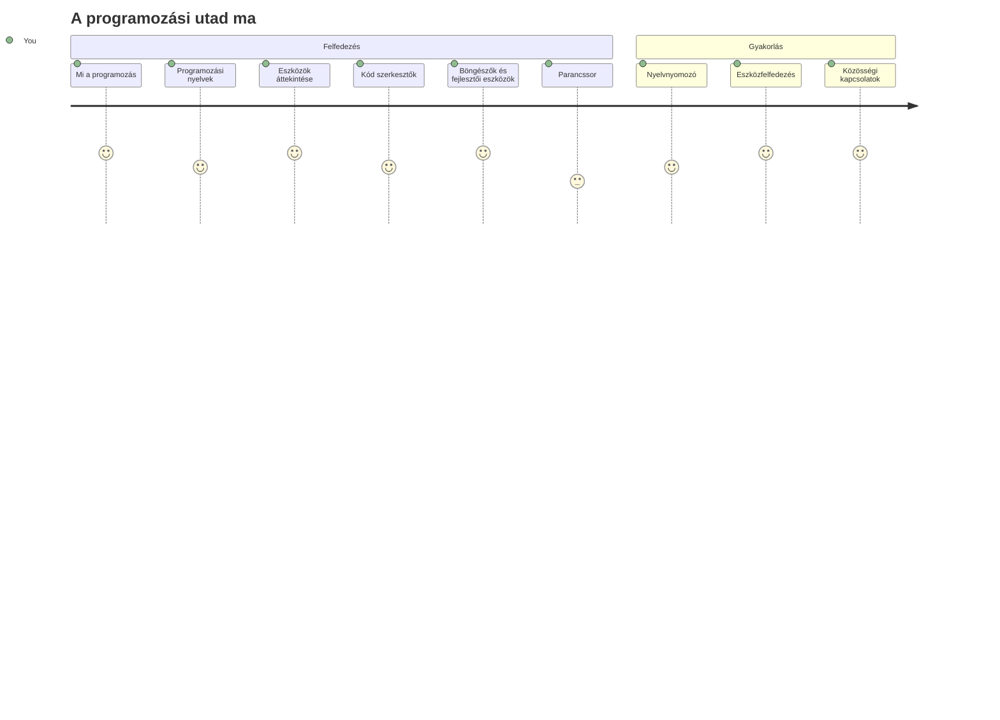
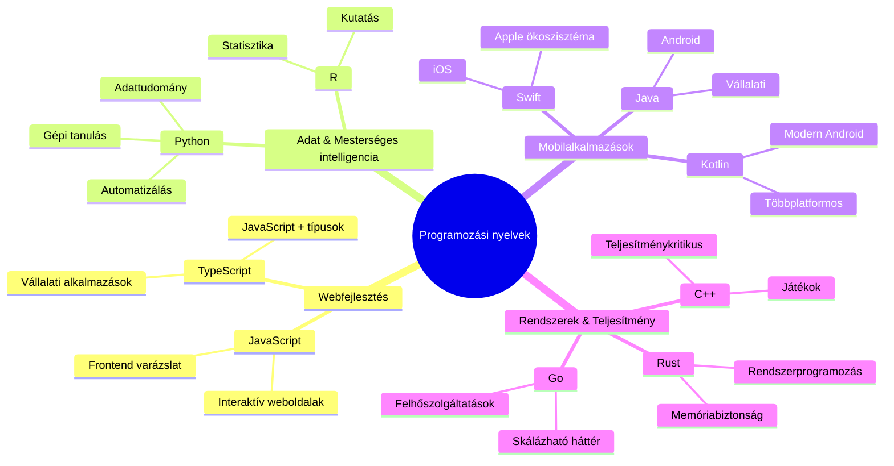
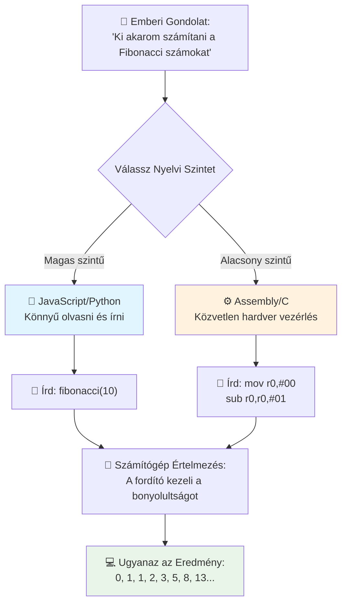
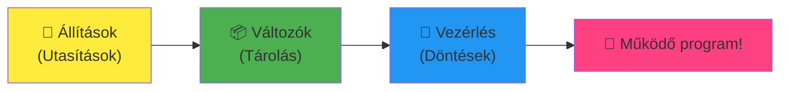
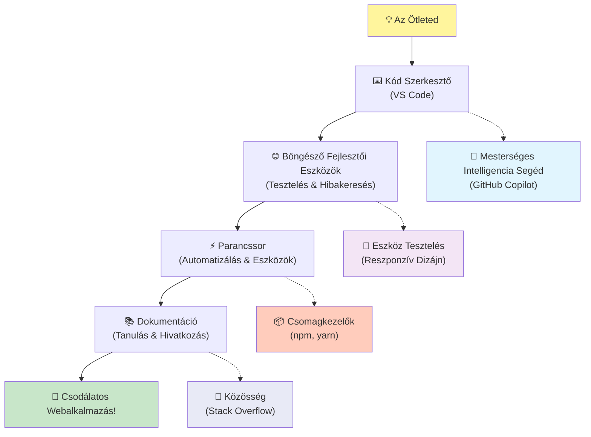
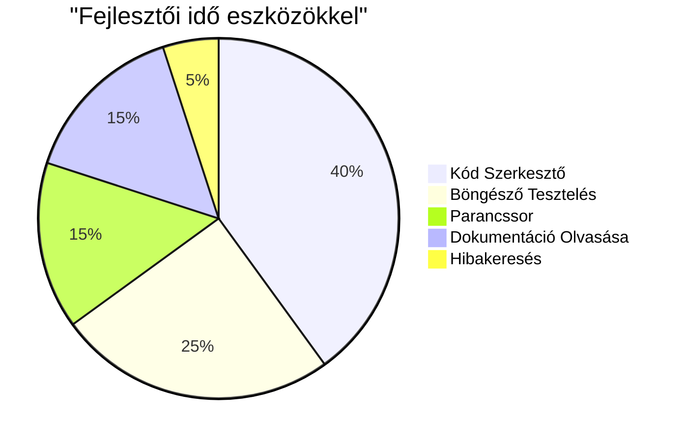
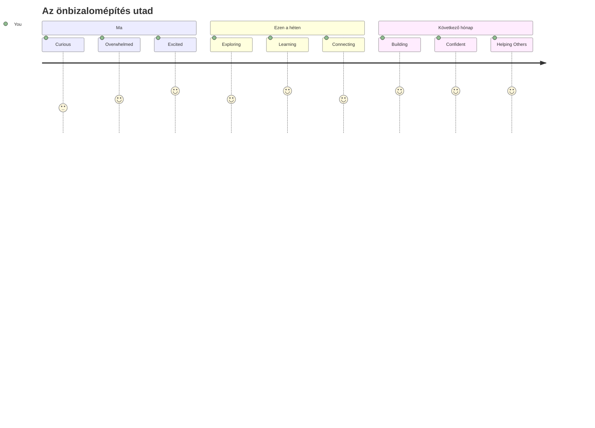

<!--
CO_OP_TRANSLATOR_METADATA:
{
  "original_hash": "d45ddcc54eb9232a76d08328b09d792e",
  "translation_date": "2026-01-07T03:13:27+00:00",
  "source_file": "1-getting-started-lessons/1-intro-to-programming-languages/README.md",
  "language_code": "hu"
}
-->
# Bevezetés a programozási nyelvekbe és a modern fejlesztői eszközökbe
 
Szia, leendő fejlesztő! 👋 Elmondhatok valamit, ami minden egyes nap kiráz a hideg? Most fogod felfedezni, hogy a programozás nemcsak a számítógépekről szól – hanem arról, hogy valódi szuperképességekkel rendelkezel, hogy életre keltsd a legvadabb ötleteidet!

Ismered azt a pillanatot, amikor a kedvenc appodat használod, és minden csak tökéletesen működik? Amikor megnyomsz egy gombot, és történik valami teljesen varázslatos, amin elámulsz, hogy "hű, ezt hogy CSINÁLTÁK?" Nos, valaki, pont olyan, mint te – valószínűleg a kedvenc kávézójában ül éjjel 2-kor a harmadik eszpresszójával – írta azt a kódot, amely létrehozta azt a varázslatot. És itt jön az igazán elképesztő: a tananyag végére nemcsak azt fogod érteni, hogy hogyan tették ezt, hanem alig várni fogod, hogy te magad is kipróbáld!

Tudom, hogy a programozás most még ijesztőnek tűnhet. Amikor én kezdtem, tényleg azt hittem, hogy vagy valami matekzseni kell legyek, vagy már ötéves korom óta kódolnom kell. De ez változtatta meg teljesen a nézőpontomat: a programozás pont olyan, mintha megtanulnál beszélgetni egy új nyelven. Először köszönsz meg azt mondod, hogy "köszönöm," aztán megtanulsz kávét rendelni, és mielőtt észrevennéd, mély filozófiai beszélgetéseket folytatsz! Csak éppenséggel a számítógépekkel beszélgetsz, és őszintén? Ezek a legkitartóbb beszélgetőpartnerek, akikkel valaha találkozhatsz – soha nem ítélik meg a hibáidat, és mindig örömmel próbálkoznak újra!

Ma meg fogjuk nézni azokat a hihetetlen eszközöket, amik nemcsak lehetővé teszik, hanem nagyon addiktívvá teszik a modern webfejlesztést. Pont azokat az editorokat, böngészőket és munkafolyamatokat, amelyeket a Netflix, a Spotify és a kedvenc indie app stúdiód fejlesztői használnak minden nap. És most jön a rész, amire majd örülni fogsz: ezeknek a professzionális, iparági szabvány eszközöknek a többsége teljesen ingyenes!


> Sketchnote készítette [Tomomi Imura](https://twitter.com/girlie_mac)


## Nézzük, mit tudsz már!

Mielőtt belevágnánk a mókába, kíváncsi vagyok – mit tudsz már erről a programozás világáról? És hallgasd csak, ha ezekre a kérdésekre azt gondolod, hogy "nincs semmi fogalmam erről," az nemcsak rendben van, hanem tökéletes! Ez azt jelenti, hogy pontosan a megfelelő helyen vagy. Gondolj erre a kvízre úgy, mint az edzés előtti bemelegítésre – csak melegítjük az agyizmokat!

[Vegyél részt az előzetes kvízen](https://forms.office.com/r/dru4TE0U9n?origin=lprLink)


## Az a kaland, amire együtt indulunk

Jól van, őszintén izgatott vagyok, hogy mit fogunk ma felfedezni! Komolyan, szívesen látnám az arcodat, amikor néhány koncepció végre összeáll. Íme az a hihetetlen utazás, amire együtt indulunk:

- **Mi is valójában a programozás (és miért a legmenőbb dolog a világon!)** – Felfedezzük, hogyan a kód a szinte láthatatlan varázslat, amely mindent hajt körülötted, az ébresztőtől, ami valahogy tudja, hogy hétfő reggel van, egészen a Netflix tökéletes ajánló algoritmusáig
- **A programozási nyelvek és elképesztő személyiségük** – Képzeld el, hogy egy buliba mész, ahol mindenki teljesen más szuperképességekkel és problémamegoldási módszerekkel rendelkezik. Pont ilyen a programozási nyelvek világa, és imádni fogod őket megismerni!
- **Az alapvető építőelemek, amelyek életre keltik a digitális varázslatot** – Gondolj erre, mint a végső kreatív LEGO készletre. Ha megérted, hogyan állnak össze ezek a darabok, rájössz, hogy bármit meg tudsz építeni, amit csak a képzeleted álmodik meg
- **A professzionális eszközök, amelyek úgy érzik veled, mintha most adtak volna egy varázspálcát a kezedbe** – Nem túlozok – ezek az eszközök tényleg szuperképességekkel ruháznak fel, és a legjobb az egészben? Pont ugyanazokat az eszközöket használják a profik!

> 💡 **Egy dolog:** Ne is próbáld meg ma mindenre megjegyezni a választ! Most csak azt szeretném, hogy érezd azt az izgalmat, ami a lehetőségekben rejlik. A részletek természetesen megmaradnak majd, ahogy együtt gyakorlunk – így tanul az ember igazán!

> Ezt a leckét elvégezheted a [Microsoft Learn](https://docs.microsoft.com/learn/modules/web-development-101/introduction-programming/?WT.mc_id=academic-77807-sagibbon) oldalán is!

## Szóval mi is *valójában* a programozás?

Oké, foglalkozzunk a millió dolláros kérdéssel: mi is a programozás igazából?

Mesélek egy történetet, ami teljesen megváltoztatta a róla alkotott képemet. A múlt héten próbáltam elmagyarázni anyukámnak, hogyan kell használni az új okostévénk távirányítóját. Közben azt vettem észre, hogy olyasmiket mondok, hogy "Nyomd meg a piros gombot, de nem a nagy pirosat, hanem a kis pirosat a bal oldalon... nem, a másik bal oldaladat... oké, most tartsd benyomva két másodpercig, nem egyet, nem hármat..." Ismerős? 😅

Ez a programozás! Az a művészet, hogy hihetetlenül részletes, lépésről lépésre szóló utasításokat adj valaminek, ami nagyon erős, de mindent tökéletesen ki kell írnod neki. Csakhogy nem a mamádnak magyarázod (aki megkérdezheti, hogy "melyik piros gomb?!"), hanem egy számítógépnek, ami pontosan azt teszi, amit mondasz, még ha az nem is teljesen az, amit gondoltál.

Ez az, ami elsőre elvarázsolt: a számítógépek tulajdonképpen elég egyszerűek a magjukban. Valójában csak két dolgot értenek meg – az 1-et és a 0-t, ami gyakorlatilag azt jelenti, hogy "igen" meg "nem", vagy "be" és "ki". Ennyi! De itt jön a varázslat – nem kell úgy beszélnünk, mintha a Mátrixban lennénk, az 1-ekkel és 0-kkal. Itt jönnek képbe a **programozási nyelvek**. Olyanok, mint a világ legjobb tolmácsa, aki a teljesen normális emberi gondolataidat átalakítja számítógépes nyelvvé.

És amitől minden reggel megint libabőrös leszek, amikor felébredek: szó szerint *minden* digitális az életedben onnan indult, hogy valaki pont olyan volt, mint te, valószínűleg pizsamában egy kávéval a kezében, kódot gépelve a laptopján. Az az Instagram szűrő, ami hibátlannak mutat? Valaki megírta a kódját. Az az ajánlás, ami elvezetett az új kedvenc dalodhoz? Egy fejlesztő építette azt az algoritmust. Az app, ami segít megosztani a vacsora számlát a barátaiddal? Igen, valaki azt gondolta, "ez idegesítő, ezt meg tudnám oldani," és aztán... megoldotta!

Amikor megtanulsz programozni, nemcsak egy új készséget szerzel, hanem része leszel egy hihetetlen közösségnek, akik a napjaikat azzal töltik, hogy azon gondolkodnak: "Mi lenne, ha olyasmit építhetnék, ami valakinek a napját egy kicsit jobbá teszi?" Őszintén, van ennél menőbb?

✅ **Érdekesség vadászat**: Amikor lesz egy szabad perce, nézz utána ennek – ki volt szerinted a világ első számítógépes programozója? Egy tipp: nem az, akire számítanál! Az ő története abszolút lenyűgöző, és megmutatja, hogy a programozás mindig a kreatív problémamegoldásról és a dobozon kívüli gondolkodásról szólt.

### 🧠 **Állj meg egy pillanatra: hogy érzed magad?**

**Reflektálj egy kicsit:**
- Most már érted, mit jelent "utasításokat adni a számítógépeknek"?
- Tudsz gondolni olyan napi feladatra, amit programozással automatizálnál?
- Milyen kérdések merültek fel benned a programozással kapcsolatban?

> **Ne feledd**: teljesen normális, ha most néhány fogalom kicsit homályos. A programozás olyan, mintha új nyelvet tanulnál – idő kell, hogy az agyad megépítse az idegpályákat. Nagyon jól csinálod!

## A programozási nyelvek olyanok, mint a varázslat különböző ízei

Oké, ez most furcsán fog hangzani, de bízz bennem – a programozási nyelvek nagyon hasonlítanak a különböző zenei stílusokra. Gondolj csak bele: van jazz, ami sima és improvizatív, rock, ami erőteljes és egyenes, klasszikus, ami elegáns és struktúrált, meg hip-hop, ami kreatív és kifejező. Minden stílusnak megvan a maga hangulata, a lelkes rajongó közössége, és mindegyik tökéletes különböző hangulatokhoz és alkalmakhoz.

A programozási nyelvek pont így működnek! Nem használnál ugyanazt a nyelvet egy szórakoztató mobiljáték fejlesztésére, mint amit az óriási mennyiségű klímaadat feldolgozásához használnál, ahogy a death metalt sem játszanád jógán (na jó, a legtöbb jógán nem! 😄).

De ami mindig lenyűgöz: ezek a nyelvek olyanok, mint a világ legkitartóbb, legbriliánsabb tolmáccsal az oldaladon. Ki tudod fejezni az ötleteidet úgy, hogy az természetes legyen az emberi agyadnak, ők pedig elvégzik azt a hihetetlenül komplex munkát, hogy átültessék azt az 1-esekbe és 0-kba, amit a számítógépek beszélnek. Olyan, mintha lenne egy barátod, aki tökéletesen beszéli az "emberi kreativitás" és a "számítógépes logika" nyelvét – és soha nem fárad el, nem kér kávészünetet, és soha nem ítél meg, ha kétszer kérdezel ugyanarról!

### Népszerű programozási nyelvek és hogyan használják őket


| Nyelv | Legjobb erre | Miért népszerű |
|----------|----------|------------------|
| **JavaScript** | Webfejlesztés, felhasználói felületek | Böngészőkben fut, interaktív weboldalakat hajt |
| **Python** | Adattudomány, automatizálás, mesterséges intelligencia | Könnyen olvasható, tanulható, erős könyvtárak |
| **Java** | Vállalati alkalmazások, Android appok | Platformfüggetlen, robosztus nagy rendszerekhez |
| **C#** | Windows alkalmazások, játékfejlesztés | Erős Microsoft ökoszisztéma támogatás |
| **Go** | Felhőszolgáltatások, backend rendszerek | Gyors, egyszerű, modern számítástechnikához tervezett |

### Magas szintű vs. alacsony szintű nyelvek

Oké, ez volt az a koncepció, ami totálisan megzavarta az agyam, amikor először kezdtem tanulni, úgyhogy most megosztom azt a hasonlatot, ami nekem végre bejött – és nagyon remélem, neked is segít majd!

Képzeld el, hogy olyan országban jársz, ahol nem beszéled a nyelvet, és nagyon muszáj megtalálnod a legközelebbi mosdót (mindenki volt már így, nem? 😅):

- **Az alacsony szintű programozás** olyan, mint megtanulni az adott helyi dialektust annyira jól, hogy beszélgetsz a sarkon gyümölcsöt áruló nagymamával kulturális utalásokkal, helyi szlenggel és bennfentes poénokkal, amit csak az értene, aki ott nőtt fel. Szuper impresszív és hihetetlenül hatékony... ha tényleg folyékony vagy! De elég túlterhelő, ha csak mosdót keresel.

- **A magas szintű programozás** olyan, mintha lenne egy szuper helyi barátod, aki tökéletesen ért téged. Egyszerű angolsággal megmondod neki, hogy "Nagyon kellene egy mosdó," és ő lebonyolítja a kulturális fordítást, és olyan útbaigazítást ad, ami tökéletesen érthető a nem helyi agyadnak.

Programozási értelemben:
- **Az alacsony szintű nyelvek** (mint az Assembly vagy a C) lehetővé teszik, hogy hihetetlenül részletesen beszélj a számítógép tényleges hardverével, de gép módjára kell gondolkodnod, ami... hát elég nagy fejben váltás!
- **A magas szintű nyelvek** (mint a JavaScript, Python vagy C#) lehetővé teszik, hogy emberként gondolkodj, miközben megoldják helyetted a gépi nyelvet a háttérben. Ráadásul olyan befogadó közösségeik vannak, tele olyan emberekkel, akik emlékeznek rá, milyen újnak lenni, és tényleg szeretnének segíteni!

Találd ki, melyiket javaslom, hogy kezdd el! 😉 A magas szintű nyelvek olyanok, mint a segédkerekek, amiket soha nem akarod levenni, mert sokkal élvezetesebbé teszik az egész tanulási folyamatot!


### Megmutatom, miért barátságosabbak a magas szintű nyelvek

Rendben, mutatok neked valamit, ami tökéletesen bemutatja, hogy miért szerettem meg a magas szintű nyelveket, de előbb meg kell ígérned valamit. Amikor meglátod az első kódpéldát, ne pánikolj! Félőnek kell kinéznie. Ez a lényeg!

Azonos feladatot fogunk megnézni két teljesen különböző stílusban leírva. Mindkettő a Fibonacci-sorozatot hozza létre – ez egy gyönyörű matematikai minta, ahol minden szám az előző kettő összege: 0, 1, 1, 2, 3, 5, 8, 13... (Érdekesség: ezt a mintát szó szerint mindenütt megtalálod a természetben – napraforgómag spirálokban, fenyőtoboz mintákban, még a galaxisképződésben is!)

Készen állsz, hogy lásd a különbséget? Gyerünk!

**Magas szintű nyelv (JavaScript) – Emberbarát:**

```javascript
// 1. lépés: Alap Fibonacci beállítás
const fibonacciCount = 10;
let current = 0;
let next = 1;

console.log('Fibonacci sequence:');
```

**Ez a kód a következőt csinálja:**
- **Deklarál** egy állandót, ami megadja, hány Fibonacci számot akarunk generálni
- **Inicializál** két változót, hogy követni tudjuk az aktuális és következő számot a sorozatban
- **Beállítja** az induló értékeket (0 és 1), amelyek definiálják a Fibonacci mintát
- **Megjelenít** egy fejléc üzenetet, hogy azonosítsa a kimenetet

```javascript
// 2. lépés: A sorozat generálása ciklussal
for (let i = 0; i < fibonacciCount; i++) {
  console.log(`Position ${i + 1}: ${current}`);
  
  // Számítsa ki a következő számot a sorozatban
  const sum = current + next;
  current = next;
  next = sum;
}
```

**Megnézzük lépésről lépésre, mi történik:**
- **Végigmegyünk** a sorozat minden helyén egy `for` ciklust használva
- **Megjelenít** minden számot a helyével együtt sablon szövegként formázva
- **Kiszámítja** a következő Fibonacci számot az aktuális és a következő érték összeadásával
- **Frissíti** a nyomon követő változókat, hogy továbblépjünk a következő iterációra

```javascript
// 3. lépés: Modern funkcionális megközelítés
const generateFibonacci = (count) => {
  const sequence = [0, 1];
  
  for (let i = 2; i < count; i++) {
    sequence[i] = sequence[i - 1] + sequence[i - 2];
  }
  
  return sequence;
};

// Használati példa
const fibSequence = generateFibonacci(10);
console.log(fibSequence);
```

**Az előbb:**
- **Létrehoztunk** egy újrahasználható függvényt modern nyílfüggvény szintaxissal
- **Építettünk** egy tömböt, hogy a teljes sorozatot tároljuk, nem csupán egyesével jelenítsük meg
- **Használtuk** a tömb indexelést, hogy a korábbi értékekből számítsuk ki az új számokat
- **Visszaadtuk** a teljes sorozatot, hogy más részeken is rugalmasan használható legyen

**Alacsony szintű nyelv (ARM Assembly) – Számítógépbarát:**

```assembly
 area ascen,code,readonly
 entry
 code32
 adr r0,thumb+1
 bx r0
 code16
thumb
 mov r0,#00
 sub r0,r0,#01
 mov r1,#01
 mov r4,#10
 ldr r2,=0x40000000
back add r0,r1
 str r0,[r2]
 add r2,#04
 mov r3,r0
 mov r0,r1
 mov r1,r3
 sub r4,#01
 cmp r4,#00
 bne back
 end
```

Figyeld meg, hogy a JavaScript verzió szinte úgy olvasható, mint az angol utasítások, míg az Assembly verzió titokzatos parancsokat használ, amelyek közvetlenül a számítógép processzorát vezérlik. Mindkettő ugyanazt a feladatot oldja meg, de a magas szintű nyelvet sokkal könnyebb az embereknek érteni, írni és karbantartani.

**Fő különbségek, amik feltűnnek:**
- **Olvashatóság**: a JavaScript leíró neveket használ, például `fibonacciCount`, míg az Assembly titkosított címkéket, mint `r0`, `r1`
- **Megjegyzések**: A magas szintű nyelvek elősegítik az olyan magyarázó megjegyzéseket, amelyekkel a kód önmagát dokumentálja
- **Szerkezet**: A JavaScript logikai folyamata megfelel annak, ahogy az emberek lépésről lépésre gondolkodnak a problémákról
- **Karbantartás**: A JavaScript verzió frissítése különböző követelményekhez egyszerű és világos

✅ **A Fibonacci-sorról**: Ez a gyönyörű szám-minta (ahol minden szám az előző kettő összege: 0, 1, 1, 2, 3, 5, 8...) szinte *mindenütt* megjelenik a természetben! Megtalálod a napraforgó csigavonalában, fenyőtoboz mintázatában, a nautilusz kagylók görbületében, sőt még a faágak növekedésében is. Egészen elképesztő, hogy a matematika és a programozás hogyan segít nekünk megérteni és újraalkotni azokat a mintákat, amelyeket a természet a szépség létrehozásához használ!

## Az építőelemek, amelyek a varázslatot működtetik

Rendben, most, hogy láttad, hogyan néznek ki a programozási nyelvek a gyakorlatban, bontsuk le az alapvető részeket, amelyek szó szerint minden valaha írt programot felépítenek. Gondolj rájuk úgy, mint az alapvető hozzávalók a kedvenc receptedben – ha megérted, mit csinál mindegyik, akkor gyakorlatilag bármilyen nyelven tudsz kódot olvasni és írni!

Ez nagyjából olyan, mintha megtanulnád a programozás nyelvtanát. Emlékszel, amikor az iskolában tanultál a főnévről, igéről és hogy hogyan állítsd össze a mondatokat? A programozásnak is megvan a maga nyelvtana, és őszintén szólva, sokkal logikusabb és megengedőbb, mint az angol nyelvtan valaha is volt! 😄

### Utasítások: Lépésről lépésre szóló instrukciók

Kezdjük az **utasításokkal** – ezek olyanok, mint egyén mondatok egy beszélgetésben a számítógépeddel. Minden utasítás azt mondja meg a számítógépnek, hogy csináljon meg egy konkrét dolgot, olyan, mintha útbaigazítást adnál: „Fordulj erre balra,” „Állj meg a piros lámpánál,” „Parkolj abba a helybe.”

Amiért szeretem az utasításokat, az az, hogy általában mennyire olvashatóak. Nézd csak:

```javascript
// Alapvető utasítások, amelyek egyetlen műveletet hajtanak végre
const userName = "Alex";                    
console.log("Hello, world!");              
const sum = 5 + 3;                         
```

**Ez a kód ezt csinálja:**
- **Deklarál** egy konstans változót egy felhasználói név tárolására
- **Megjelenít** egy üdvözlő üzenetet a konzol kimeneten
- **Kiszámol** és tárol egy matematikai művelet eredményét

```javascript
// Utasítások, amelyek weboldalakkal lépnek kapcsolatba
document.title = "My Awesome Website";      
document.body.style.backgroundColor = "lightblue";
```

**Lépésről lépésre, ez történik:**
- **Módosítja** az oldal címét, ami a böngésző fülön jelenik meg
- **Megváltoztatja** az egész oldal testének háttérszínét

### Változók: A programod memóriarendszere

Rendben, a **változók** az egyik abszolút kedvenc fogalmam tanítani, mert nagyon hasonlítanak azokhoz a dolgokhoz, amiket már nap mint nap használsz!

Gondolj csak a telefonod névjegyzékére egy pillanatra. Nem jegyzed meg mindenki telefonszámát – helyette elmented például „Anya,” „Legjobb Barát,” vagy „Pizza Ház, ami éjfélig szállít,” és a telefonod emlékszik a tényleges számokra. A változók pontosan így működnek! Olyan, mintha címkézett tárolók lennének, ahol a programod képes adatokat tárolni és egy későbbi időpontban elérni egy értelmes név segítségével.

Ami igazán klassz: a változók megváltozhatnak, amíg a program fut (innen ered a "változó" név – érted, mit csinálnak?). Ahogy frissítheted a pizza hely elérhetőségét, mert találsz jobbat, úgy a változók is módosíthatók, amikor a program új információkat tanul vagy a helyzetek változnak!

Megmutatom, milyen egyszerű és gyönyörű ez:

```javascript
// 1. lépés: Alapvető változók létrehozása
const siteName = "Weather Dashboard";        
let currentWeather = "sunny";               
let temperature = 75;                       
let isRaining = false;                      
```

**Ezeknek a fogalmaknak a megértése:**
- **Tárol** változatlan értékeket `const` változókban (például az oldal neve)
- **Használ** `let` változókat olyan értékekhez, amelyek változhatnak a program során
- **Hozzárendel** különböző adattípusokat: sztringeket (szöveg), számokat és booleanokat (igaz/hamis)
- **Választ** beszédes neveket, amelyek elmagyarázzák, hogy mit tartalmaz minden változó

```javascript
// 2. lépés: Objektumok használata az összetartozó adatok csoportosításához
const weatherData = {                       
  location: "San Francisco",
  humidity: 65,
  windSpeed: 12
};
```

**A fenti példa ezt tette:**
- **Létrehozott** egy objektumot az összetartozó időjárási információk csoportosítására
- **Rendszerezett** több adatot egy változónév alatt
- **Használt** kulcs-érték párokat az adatok világos megjelölésére

```javascript
// 3. lépés: Változók használata és frissítése
console.log(`${siteName}: Today is ${currentWeather} and ${temperature}°F`);
console.log(`Wind speed: ${weatherData.windSpeed} mph`);

// Változtatható változók frissítése
currentWeather = "cloudy";                  
temperature = 68;                          
```

**Nézzük meg mindegyik részt:**
- **Megjelenít** információt sablon literálokkal `${}` szintaxissal
- **Hozzáfér** objektum tulajdonságokhoz pont notációval (`weatherData.windSpeed`)
- **Frissít** `let`-tel deklarált változókat, hogy tükrözzék a változó állapotokat
- **Összekapcsol** több változót, hogy értelmes üzeneteket hozzon létre

```javascript
// 4. lépés: Modern destrukturálás a tisztább kódért
const { location, humidity } = weatherData; 
console.log(`${location} humidity: ${humidity}%`);
```

**Amit tudnod kell:**
- **Kivesz** specifikus tulajdonságokat objektumokból destrukturálással
- **Létrehoz** új változókat automatikusan ugyanazzal a névvel, mint az objektum kulcsai
- **Egyszerűsít** kódot ismétlődő pont notáció nélkül

### Vezérlési folyamat: Programod gondolkodásának tanítása

Na most jön az, ahol a programozás tényleg elképesztővé válik! A **vezérlési folyamat** tulajdonképpen annak megtanítása, hogyan hozzon okos döntéseket a programod, pont úgy, ahogy te is nap mint nap anélkül, hogy gondolkodnál rajta.

Képzeld el: ma reggel valószínűleg ilyen gondolatmeneted volt: „Ha esik, viszek esernyőt. Ha hideg van, felveszem a kabátot. Ha elkésnék, kihagyom a reggelit és veszek egy kávét útközben.” Az agyad természetesen követi ezt az ha-akkor logikát naponta százszor!

Ez az, ami miatt a programok intelligensnek és élőnek érződnek, nem pedig egy unalmas, kiszámítható scriptnek. Valóban meg tudják nézni a helyzetet, értékelni, mi történik, és megfelelően reagálni. Ez olyan, mintha agyat adnál a programodnak, ami alkalmazkodni tud és döntéseket hoz!

Látni akarod, milyen szépen működik ez? Megmutatom:

```javascript
// 1. lépés: Alapvető feltételes logika
const userAge = 17;

if (userAge >= 18) {
  console.log("You can vote!");
} else {
  const yearsToWait = 18 - userAge;
  console.log(`You'll be able to vote in ${yearsToWait} year(s).`);
}
```

**Ez a kód ezt csinálja:**
- **Ellenőrzi**, hogy a felhasználó életkora megfelel-e a szavazási követelménynek
- **Végrehajt** különböző kódrészeket a feltétel eredménye alapján
- **Kiszámol** és megjeleníti, mennyi idő van még vissza a szavazati jogig, ha kevesebb, mint 18
- **Ad** specifikus, hasznos visszajelzést az egyes helyzetekre

```javascript
// 2. lépés: Több feltétel logikai operátorokkal
const userAge = 17;
const hasPermission = true;

if (userAge >= 18 && hasPermission) {
  console.log("Access granted: You can enter the venue.");
} else if (userAge >= 16) {
  console.log("You need parent permission to enter.");
} else {
  console.log("Sorry, you must be at least 16 years old.");
}
```

**Ennek a lebontása:**
- **Összekapcsol** több feltételt az `&&` (és) operátorral
- **Készít** feltételi hierarchiát `else if` használatával több forgatókönyvhöz
- **Kezel** minden lehetséges esetet egy végső `else` ággal
- **Ad** egyértelmű, cselekvő visszajelzést az egyes helyzetekhez

```javascript
// 3. lépés: Rövid feltételes kifejezés ternáris operátorral
const votingStatus = userAge >= 18 ? "Can vote" : "Cannot vote yet";
console.log(`Status: ${votingStatus}`);
```

**Ezt érdemes megjegyezni:**
- **Használ** ternáris operátort (`? :`) egyszerű kétválasztásos feltételeknél
- **Írja** elsőként a feltételt, majd `?`, aztán igaz érték, majd `:`, végül hamis érték
- **Alkalmazza** ezt a mintát, ha értékeket kell hozzárendelni feltételek alapján

```javascript
// 4. lépés: Több specifikus eset kezelése
const dayOfWeek = "Tuesday";

switch (dayOfWeek) {
  case "Monday":
  case "Tuesday":
  case "Wednesday":
  case "Thursday":
  case "Friday":
    console.log("It's a weekday - time to work!");
    break;
  case "Saturday":
  case "Sunday":
    console.log("It's the weekend - time to relax!");
    break;
  default:
    console.log("Invalid day of the week");
}
```

**Ez a kód a következőt teszi:**
- **Összehasonlít** egy változó értékét több speciális esettel
- **Csoportosít** hasonló eseteket (hétköznapok vs. hétvégék)
- **Végrehajt** a megfelelőt, ha egyezést talál
- **Tartalmaz** egy `default` esetet váratlan értékekre
- **Használ** `break` utasításokat, hogy megakadályozza a következő eset végrehajtását

> 💡 **Valós példa**: Gondolj a vezérlési folyamatra úgy, mint a világ legpáciensebb GPS-ére, ami útbaigazítást ad. Például: „Ha torlódás van a Fő utcán, inkább menj az autópályán. Ha az útépítés blokkolja az autópályát, válassz egy panorámás utat.” A programok pontosan ilyen feltételes logikát használnak, hogy okosan reagáljanak különböző helyzetekre, mindig a legjobb élményt nyújtva a felhasználóknak.

### 🎯 **Fogalmi ellenőrzés: Az építőelemek mesterfogása**

**Nézzük, hogy állsz az alapokkal:**
- Tudod magadnak elmagyarázni a változó és az utasítás közötti különbséget?
- Gondolj egy valós helyzetre, ahol egy ha-akkor döntést alkalmaznál (például a szavazási példánk)
- Mi az, ami a programozási logikából meglepett téged?

**Gyors önbizalom növelő:**

✅ **Mi jön ezután**: Igazán jól fogjuk magunkat érezni, mélyebben elmerülve ezekben a fogalmakban ezen az elképesztő úton együtt! Most csak arra fókuszálj, hogy érzed a lelkesedést a rengeteg csodás lehetőség miatt, ami előtted áll. A konkrét készségek és technikák természetesen ragadni fognak, ahogy együtt gyakorolunk – ígérem, ez sokkal szórakoztatóbb lesz, mint gondolnád!

## Az eszközök

Nos, ez az a pont, ahol igazán izgatott vagyok, és alig bírom magamban tartani! 🚀 Most azokról az elképesztő eszközökről beszélünk, amelyekkel úgy fogod érezni, mintha épp egy digitális űrhajó kulcsait adnák a kezedbe.

Ismered azt az érzést, amikor egy séfnek tökéletesen kiegyensúlyozott kések vannak, amelyek egyenesen a kezének nyúlnak? Vagy amikor a zenésznek van az az egy gitárja, ami mintha dalolna, amint megérinti? Nos, a fejlesztőknek is megvan a saját verziójuk ezekből a varázslatos eszközökből, és olyasmi következik, ami garantáltan el fog kápráztatni – nagy részük teljesen ingyenes!

Majdnem kiugrom a székemből, annyira örülök, hogy megoszthatom ezt veled, mert teljesen forradalmasították, ahogy szoftvert építünk. Mesterséges intelligencia által támogatott kódoló asszisztensekről beszélünk, amik segítenek írni a kódodat (komolyan!), felhőalapú környezetekről, ahol tényleg bárhonnan fejleszthetsz Wi-Fi-vel, és hibakereső eszközökről, amelyek olyan kifinomultak, mintha röntgenlátásod lenne a programjaidhoz.

És itt az a rész, ami még mindig libabőrös: ezek nem "kezdő eszközök", amiket kinősz majd. Pontosan ugyanolyan professzionális szintű eszközök ezek, amelyeket a Google, a Netflix és az az indie app stúdió, amit szeretsz, használ Pont Most. Olyan profinak fogod érezni magad, miközben ezekkel dolgozol!


### Kódszerkesztők és IDE-k: Az új digitális legjobb barátaid

Beszéljünk a kódszerkesztőkről – ezek nagyon hamar a kedvenc helyeiddé válnak majd! Gondolj rájuk, mint a személyes kódolási szentélyedre, ahol a legtöbbet fogsz tölteni, miközben megalkotod és tökéletesíted digitális műveidet.

De ami igazán varázslatos a modern szerkesztőkben: nem csak sima szövegszerkesztők. Olyanok, mintha a legbrilliánsabb, legsegítőkészebb programozási mentor ülne melletted 24/7-ben. Előre észreveszik a helyesírási hibáidat, javaslatokat tesznek, amelyek úgy mutatnak, mintha zseni lennél, segítenek megérteni minden kódrészlet működését, és néhányan még meg is jósolják, amit gépelni akarsz, ajánlják a gondolataid befejezését!

Emlékszem, amikor először fedeztem fel az automatikus kiegészítést – szó szerint azt éreztem, hogy a jövőben élek. Elkezded gépelni valamit, és a szerkesztőd azt mondja: „Hé, erre a funkcióra gondoltál, ami pont azt csinálja, amire szükséged van?” Olyan, mintha olvasná a gondolataidat a kódoló csapattársad!

**Mi teszi ezeket a szerkesztőket olyan hihetetlenné?**

A modern kódszerkesztők lenyűgöző funkciók közelét kínálják, amelyek segítik a termelékenységedet:

| Funkció | Mit csinál | Miért hasznos |
|---------|------------|---------------|
| **Szintaxis kiemelés** | Különböző részeket színez a kódban | Könnyebbé teszi a kód olvasását és hibák megtalálását |
| **Automatikus kiegészítés** | Javasol kódot gépelés közben | Gyorsabb kódolást és kevesebb helyesírási hibát eredményez |
| **Hibakereső eszközök** | Segít megtalálni és javítani a hibákat | Órákat takarít meg a hibakeresésben |
| **Kiterjesztések** | Speciális funkciókkal bővíthető | Testreszabhatod a szerkesztőt bármilyen technológiához |
| **AI asszisztensek** | Kódötleteket és magyarázatokat ad | Felgyorsítja a tanulást és a termelékenységet |

> 🎥 **Videó forrás**: Szeretnéd látni ezeket az eszközöket akció közben? Nézd meg ezt a [Tools of the Trade videót](https://youtube.com/watch?v=69WJeXGBdxg) egy átfogó áttekintésért.

#### Ajánlott szerkesztők webfejlesztéshez

**[Visual Studio Code](https://code.visualstudio.com/?WT.mc_id=academic-77807-sagibbon)** (Ingyenes)
- A legnépszerűbb a webfejlesztők körében
- Kiváló kiterjesztés ökoszisztéma
- Beépített terminál és Git integráció
- **Kötelező kiterjesztések**:
  - [GitHub Copilot](https://marketplace.visualstudio.com/items?itemName=GitHub.copilot) - AI alapú kódjavaslatok
  - [Live Share](https://marketplace.visualstudio.com/items?itemName=MS-vsliveshare.vsliveshare) - Valós idejű együttműködés
  - [Prettier](https://marketplace.visualstudio.com/items?itemName=esbenp.prettier-vscode) - Automatikus kódformázás
  - [Code Spell Checker](https://marketplace.visualstudio.com/items?itemName=streetsidesoftware.code-spell-checker) - Kódhibák elkapása

**[JetBrains WebStorm](https://www.jetbrains.com/webstorm/)** (Fizetős, diákoknak ingyenes)
- Fejlett hibakereső és tesztelő eszközök
- Intelligens kódkiegészítés
- Beépített verziókezelés

**Felhőalapú IDE-k** (különféle árkategóriák)
- [GitHub Codespaces](https://github.com/features/codespaces) - Teljes VS Code a böngésződben
- [Replit](https://replit.com/) - Remek a tanuláshoz és kódmegosztáshoz
- [StackBlitz](https://stackblitz.com/) - Azonnali, teljes stack webfejlesztés

> 💡 **Kezdő tipp**: Kezdd a Visual Studio Code-dal – ingyenes, iparági szinten széles körben használt, hatalmas közösség készít hozzá hasznos oktatóanyagokat és kiterjesztéseket.


### Webböngészők: A titkos fejlesztői laboratóriumod

Oké, készülj fel, hogy teljesen eláll a lélegzeted! Tudod, hogy böngésződet használtad már közösségi oldalak görgetéséhez és videók nézéséhez? Nos, kiderült, hogy egész idő alatt egy elképesztő titkos fejlesztői laboratóriumot rejtett el előtted, csak arra várva, hogy felfedezd!

Minden egyes alkalommal, amikor jobbklikkelsz egy weboldalon és kiválasztod az „Elem ellenőrzése” lehetőséget, egy rejtett fejlesztői eszköztár nyílik meg előtted, ami őszintén szólva erősebb, mint néhány drága szoftver, amelyért korábban százakat fizettem. Olyan, mint amikor felfedezed, hogy a megszokott konyhád mögött egy professzionális séf laboratóriuma van elrejtve egy titkos panel mögött!
Amikor először mutatták meg nekem a böngésző DevTools-t, úgy három órát töltöttem azzal, hogy kattintgattam ide-oda, és azt mondogattam: „VÁRJ, EZT IS TUDJA?!” Gyakorlatilag bármelyik weboldalt valós időben szerkesztheted, pontosan látod, milyen gyorsan töltődnek be az elemek, tesztelheted, hogyan néz ki az oldal különböző eszközökön, és akár JavaScriptet is hibakereshetsz teljes profi módjára. Egészen elképesztő!

**Ezért titkos fegyvered a böngésző:**

Amikor weboldalt vagy webalkalmazást készítesz, látnod kell, hogyan néz ki és hogyan viselkedik a valóságban. A böngészők nemcsak megjelenítik a munkádat, hanem részletes visszajelzéseket is adnak a teljesítményről, használhatóságról és az esetleges problémákról.

#### Böngésző fejlesztői eszközök (DevTools)

A modern böngészők átfogó fejlesztői csomagokat tartalmaznak:

| Eszközkategória | Mire jó | Példafelhasználás |
|-----------------|---------|-------------------|
| **Elem ellenőrző** | HTML/CSS valós idejű megtekintése és szerkesztése | Stílusok módosítása azonnali eredményért |
| **Konzol** | Hibák megjelenítése és JavaScript tesztelése | Hibák keresése és kód kipróbálása |
| **Hálózati monitor** | Erőforrások betöltődésének követése | Teljesítmény és betöltési idők optimalizálása |
| **Akadálymentesség ellenőrző** | Befogadó dizájn tesztelése | Annak biztosítása, hogy az oldal minden felhasználónak működjön |
| **Eszköz szimulátor** | Megjelenítés különböző képernyőméreteken | Reszponzív dizájn tesztelése eszközök nélkül |

#### Fejlesztéshez ajánlott böngészők

- **[Chrome](https://developers.google.com/web/tools/chrome-devtools/)** – Iparági szabvány DevTools és átfogó dokumentáció
- **[Firefox](https://developer.mozilla.org/docs/Tools)** – Kiváló CSS Grid és akadálymentességi eszközök
- **[Edge](https://docs.microsoft.com/microsoft-edge/devtools-guide-chromium/?WT.mc_id=academic-77807-sagibbon)** – Chromium-alapú a Microsoft fejlesztői erőforrásaival

> ⚠️ **Fontos tesztelési tipp**: Mindig teszteld a weboldalaidat több böngészőben! Ami tökéletesen működik Chrome-ban, az Safari-ban vagy Firefoxban másként nézhet ki. A profi fejlesztők az összes nagyobb böngészőben tesztelnek a konzisztens felhasználói élmény érdekében.


### Parancssori eszközök: Kapud a fejlesztői szuperképességekhez

Oké, most beszéljünk őszintén a parancssorról, mert szeretném, ha azt tényleg tőlem hallanád. Amikor először megláttam – csak egy félelmetes fekete képernyő villogó szöveggel –, szó szerint azt gondoltam: „Az nem, ezt semmiképp! Ez olyan, mint egy 1980-as évekbeli hacker film, és én tutira nem vagyok elég okos ehhez!” 😅

De ezt szeretném, ha most elmondanám neked: a parancssor nem ijesztő – valójában mintha közvetlenül a számítógépeddel beszélgetnél. Gondolj arra, mint az étel rendelésére egy menő, képes és menüs alkalmazásban (ami kényelmes), szemben azzal, amikor bemész a kedvenc helyi éttermedbe, ahol a séf pontosan tudja, mit szeretsz, és csak annyit mondasz, „lepd meg valami elképesztővel”.

A parancssor az a hely, ahol a fejlesztők tényleg varázslónak érzik magukat. Beírsz néhány látszólag varázslatos szót (oké, csak parancsok, de olyan érzés!), lenyomod az Entert, és PUMM – létrehoztál egész projektstruktúrákat, telepítettél erőteljes eszközöket a világ minden tájáról, vagy épp közzétetted az alkalmazásodat az interneten milliók számára. Amint megérzed ezt az erőt, őszintén szólva elég addiktív lesz!

**Miért lesz a parancssor a kedvenc eszközöd:**

Bár a grafikus felületek sok feladathoz kiválóak, a parancssor az automatizálásban, pontosságban és sebességben brillírozik. Sok fejlesztőeszköz elsősorban parancssori interfészeken keresztül működik, és hatékony használatuk drasztikusan növelheti a termelékenységed.

```bash
# 1. lépés: Hozd létre a projekt könyvtárát, majd lépj bele
mkdir my-awesome-website
cd my-awesome-website
```

**Mit csinál ez a kód:**
- **Létrehoz** egy új mappát „my-awesome-website” néven a projekted számára
- **Belép** az újonnan létrehozott mappába, hogy elkezdhess dolgozni

```bash
# 2. lépés: Inicializálja a projektet package.json fájlal
npm init -y

# Telepítse a modern fejlesztői eszközöket
npm install --save-dev vite prettier eslint
npm install --save-dev @eslint/js
```

**Lépésről lépésre, mi történik:**
- **Inicializál** egy új Node.js projektet alapértelmezett beállításokkal az `npm init -y` parancsal
- **Telepíti** a Vite-et modern build eszközként gyors fejlesztéshez és gyártási buildhez
- **Hozzáadja** a Prettier-t automatikus formázáshoz és az ESLint-et kódminőség ellenőrzéshez
- **Használja** a `--save-dev` kapcsolót, hogy csak fejlesztési függőségek legyenek

```bash
# 3. lépés: Projekt struktúra és fájlok létrehozása
mkdir src assets
echo '<!DOCTYPE html><html><head><title>My Site</title></head><body><h1>Hello World</h1></body></html>' > index.html

# Fejlesztő szerver indítása
npx vite
```

**Fentiekben:**
- **Rendszerezte** a projektet külön mappákba a forráskód és az eszközök számára
- **Generált** egy alap HTML fájlt megfelelő dokumentumszerkezettel
- **Elindította** a Vite fejlesztői szervert élő újratöltéssel és hot module replacement-tel

#### Alapvető parancssori eszközök webfejlesztéshez

| Eszköz | Cél | Miért kell |
|--------|-----|------------|
| **[Git](https://git-scm.com/)** | Verziókezelés | Változások nyomon követése, együttműködés, biztonsági mentés |
| **[Node.js & npm](https://nodejs.org/)** | JavaScript futtatókörnyezet és csomagkezelő | JavaScript futtatása böngészőn kívül, modern fejlesztőeszközök telepítése |
| **[Vite](https://vitejs.dev/)** | Build eszköz és fejlesztői szerver | Villámgyors fejlesztés hot module replacement-tel |
| **[ESLint](https://eslint.org/)** | Kódminőség | Problémák automatikus felderítése és javítása JavaScriptben |
| **[Prettier](https://prettier.io/)** | Kódformázás | A kód következetes és olvasható formázása |

#### Platform-specifikus lehetőségek

**Windows:**
- **[Windows Terminal](https://docs.microsoft.com/windows/terminal/?WT.mc_id=academic-77807-sagibbon)** – Modern, funkciógazdag terminál
- **[PowerShell](https://docs.microsoft.com/powershell/?WT.mc_id=academic-77807-sagibbon)** 💻 – Erőteljes szkriptkörnyezet
- **[Command Prompt](https://docs.microsoft.com/windows-server/administration/windows-commands/?WT.mc_id=academic-77807-sagibbon)** 💻 – Hagyományos Windows parancssor

**macOS:**
- **[Terminal](https://support.apple.com/guide/terminal/)** 💻 – Beépített terminál alkalmazás
- **[iTerm2](https://iterm2.com/)** – Fejlettebb terminál haladó funkciókkal

**Linux:**
- **[Bash](https://www.gnu.org/software/bash/)** 💻 – Alapértelmezett Linux shell
- **[KDE Konsole](https://docs.kde.org/trunk5/en/konsole/konsole/index.html)** – Fejlett terminálemulátor

> 💻 = Előre telepített az operációs rendszeren

> 🎯 **Tanulási útvonal**: Kezd az alapvető parancsokkal, mint `cd` (könyvtárváltás), `ls` vagy `dir` (fájlok listázása), és `mkdir` (mappa létrehozása). Gyakorolj modern munkafolyamat parancsokat, például `npm install`, `git status`, és `code .` (megnyitja az aktuális mappát VS Code-ban). Ahogy egyre otthonosabb vagy, természetesen tanulod majd az összetettebb parancsokat és az automatizálási technikákat.


### Dokumentáció: Mindig elérhető tanulótársad

Hadd osszak meg veled egy titkot, ami segít jobban érezni magad kezdőként: még a legtapasztaltabb fejlesztők is rengeteg időt töltenek dokumentáció olvasásával. És nem azért, mert nem tudják, mit csinálnak – ez inkább a bölcsesség jele!

Gondolj a dokumentációra úgy, mint a világ legpáciensebb, legtudatosabb tanáraira, akik éjjel-nappal rendelkezésedre állnak. 2 órakor az éjszaka közepén elakadtál? A dokumentáció ott van egy meleg virtuális öleléssel és pontosan azzal a válasszal, amire szükséged van. Szeretnél megtanulni egy menő, új funkciót, amiről mindenki beszél? A dokumentáció lépésről lépésre segít. Próbálod megérteni, hogy miért úgy működik valami, ahogy? Ugye kitaláltad – a dokumentáció készségesen elmagyarázza, hogy végre megértsd!

Valami, ami teljesen megváltoztatta a nézőpontomat: a webfejlesztés világa rettenetesen gyorsan halad, és senki – tényleg senki! – nem tud mindent kívülről. Láttam 15+ éves tapasztalattal rendelkező senior fejlesztőket is, akik megnéznek alapvető szintaxist, és tudod mit? Ez nem ciki – ez okosság! Nem arról szól, hogy tökéletes a memóriád; arról szól, hogy tudd, hol találsz megbízható válaszokat gyorsan és hogyan alkalmazd azokat.

**A valódi varázslat itt kezdődik:**

A profi fejlesztők jelentős részt töltenek dokumentáció olvasásával – nem mert nem tudják, mit csinálnak, hanem mert a fejlesztés világa folyamatosan változik, és a naprakészség folyamatos tanulást igényel. A jó dokumentáció nemcsak azt segít megérteni, *hogyan* használd egy eszközt, hanem azt is, *miért* és *mikor* érdemes alkalmazni.

#### Fontos dokumentációs források

**[Mozilla Developer Network (MDN)](https://developer.mozilla.org/docs/Web)**
- Az arany sztenderd a webes technológiák dokumentációjában
- Átfogó útmutatók HTML-hez, CSS-hez és JavaScripthez
- Böngésző kompatibilitási információk
- Gyakorlati példák és interaktív demók

**[Web.dev](https://web.dev)** (Google-től)
- Modern webfejlesztési legjobb gyakorlatok
- Teljesítményoptimalizálási útmutatók
- Akadálymentességi és befogadó dizájn elvek
- Esettanulmányok valós projektekről

**[Microsoft fejlesztői dokumentáció](https://docs.microsoft.com/microsoft-edge/#microsoft-edge-for-developers)**
- Edge böngésző fejlesztési források
- Progresszív webalkalmazás útmutatók
- Többplatformos fejlesztési betekintések

**[Frontend Masters tanulási útvonalak](https://frontendmasters.com/learn/)**
- Strukturált tanmenetek
- Videós tanfolyamok iparági szakértőktől
- Gyakorlati kódolási feladatok

> 📚 **Tanulási stratégia**: Ne próbáld „megjegyezni” a dokumentációt – inkább tanuld meg hatékonyan használni. Könyvjelzőzd a gyakran használt forrásokat, és gyakorold a keresőfunkciók használatát az információk gyors megtalálásához.

### 🔧 **Eszközmesteri ellenőrzés: Mi az, ami neked szól?**

**Szánj rá egy pillanatot, hogy átgondold:**
- Melyik eszközt próbálnád ki először a legszívesebben? (Nincs rossz válasz!)
- Mennyire ijeszt még a parancssor, vagy inkább kíváncsivá tett?
- El tudod képzelni, hogy a böngésző DevTools segítségével bepillants a kedvenc weboldalaid kulisszái mögé?


> **Érdekesség**: A fejlesztők körülbelül a munkaidejük 40%-át töltik az editorukban, de figyeld meg, mennyi idő megy el tesztelésre, tanulásra és problémamegoldásra. A programozás nemcsak kódírás – élmények megalkotása!

✅ **Gondolkodtató kérdés**: Íme valami érdekes – szerinted hogyan térnek el egymástól azok az eszközök, amiket weboldalak *fejlesztésére* használsz, és azok, amikkel a weboldalak *dizájnját* készíted? Olyan ez, mintha egy építész tervezi meg a gyönyörű házat, és egy vállalkozó építi meg azt. Mindkettő fontos, de más eszköztár kell! Ez a gondolkodás segít meglátni a nagyobb képet arról, hogyan kelnek életre a weboldalak.

## GitHub Copilot Agent kihívás 🚀

Használd az Agent módot a következő kihívás megoldásához:

**Leírás:** Fedezd fel egy modern kódszerkesztő vagy IDE funkcióit, és mutasd be, hogyan segíti munkafolyamatodat webfejlesztőként.

**Felkérés:** Válassz egy kódszerkesztőt vagy IDE-t (például Visual Studio Code, WebStorm vagy egy felhőalapú IDE). Sorolj fel három olyan funkciót vagy bővítményt, amely segít a kód írásában, hibakeresésében vagy karbantartásában. Mindegyikhez adj rövid magyarázatot arról, hogyan javítja a munkafolyamatod.

---

## 🚀 Kihívás

**Na, nyomozó, készen állsz az első ügyedre?**

Most, hogy megvan ez a szuper alap, egy kaland vár, ami segít meglátni, milyen elképesztően sokszínű és izgalmas a programozás világa. És figyelj – ez még nem kódírásról szól, szóval nincs nyomás! Gondolj magadra úgy, mint programozási nyelv nyomozóra az első izgalmas ügyeden!

**Küldetésed, ha elfogadod:**
1. **Válj nyelvkutatóvá**: Válassz három programozási nyelvet teljesen különböző világokból – lehet egy, ami weboldalakat épít, egy, ami mobilalkalmazásokat készít, és egy, ami adatokat elemez tudósoknak. Keress példákat ugyanarra az egyszerű feladatra mindegyik nyelven. Megígérem, teljesen el leszel kápráztatva, milyen másként néznek ki miközben ugyanazt csinálják!

2. **Fedezd fel a származásukat**: Mi tesz minden nyelvet különlegessé? Egy menő tény – minden programozási nyelvet azért hoztak létre, mert valaki gondolta, „Tudod mit? Ennél jobb mód kell egy adott probléma megoldására.” Meg tudod találni, mik voltak ezek a problémák? Egyes történetek igazán lenyűgözőek!

3. **Ismerd meg a közösségeket**: Nézd meg, mennyire befogadó és lelkes a nyelv közössége. Van, amelyiknek millió fejlesztője van, akik tudást osztanak meg és segítik egymást, mások kisebbek, de nagyon összetartók és támogatóak. Remélem, élvezni fogod látni ezeket a különböző személyiségeket!

4. **Hallgass a megérzéseidre**: Melyik nyelv tűnik most a leginkább megközelíthetőnek számodra? Ne stresszelj a „tökéletes” választáson – csak hallgass az ösztöneidre! Itt tényleg nincs rossz válasz, és mindig felfedezhetsz másokat később is.

**Plusz nyomozói feladat:** Próbáld kideríteni, melyik nagy weboldalak vagy alkalmazások készültek mely nyelvekkel. Garantálom, hogy meg fogsz lepődni, milyen technológiák hajtják az Instagramot, a Netflixet vagy azt a mobiljátékot, amit nem tudsz letenni!

> 💡 **Ne feledd**: Nem az a cél, hogy ma már szakértő legyél ezekben a nyelvekben. Csak ismerkedsz a környezettel, mielőtt eldöntöd, hol kezdesz el dolgozni. Szánj rá időt, szórakozz, és hagyd, hogy a kíváncsiság vezessen!

## Ünnepeljük, amit felfedeztél!

Hú, de sok elképesztő dolgot szívtál magadba ma! Őszintén izgatott vagyok, hogy mennyire maradt meg ebből a fantasztikus utazásból. És ne feledd – ez nem egy teszt, ahol mindent tökéletesen kell csinálni. Ez inkább egy ünnep, hogy mindazt a menő dolgot értékeld, amit megtanultál erről az izgalmas világról, amibe most belevetetted magad!

[Oldd meg az utólagos kvízt](https://ff-quizzes.netlify.app/web/)
## Áttekintés & Önálló tanulás

**Szánj rá időt, fedezd fel és élvezd!**

Ma rengeteget haladtál, és erre igazán büszke lehetsz! Most jön a móka – fedezd fel azokat a témákat, amelyek felkeltették az érdeklődésedet. Ne feledd, ez nem házi feladat – ez egy kaland!

**Mélyedj el abban, ami lelkesít:**

**Próbálj ki programozási nyelveket:**
- Látogasd meg 2-3 olyan nyelv hivatalos weboldalát, amely felkeltette az érdeklődésedet. Mindegyiknek megvan a maga személyisége és története!
- Próbálj ki néhány online kódíró játszóteret, például a [CodePen](https://codepen.io/), [JSFiddle](https://jsfiddle.net/) vagy [Replit](https://replit.com/) oldalakat. Ne félj kísérletezni – semmit sem tudsz elrontani!
- Olvass arról, hogyan jött létre a kedvenc nyelved. Komolyan, néhány eredettörténet lenyűgöző, és segít megérteni, miért működnek a nyelvek úgy, ahogy.

**Ismerkedj meg az új eszközeiddel:**
- Töltsd le a Visual Studio Code-ot, ha még nem tetted meg – ingyenes és imádni fogod!
- Szánj néhány percet az Extensions piactér böngészésére. Olyan, mint egy alkalmazásbolt a kódszerkesztődnek!
- Nyisd meg a böngésződ Fejlesztői Eszközeit, és kattints körbe. Ne aggódj, ha nem értesz mindent – csak ismerkedj a dolgokkal.

**Csatlakozz a közösséghez:**
- Kövess néhány fejlesztői közösséget a [Dev.to](https://dev.to/), [Stack Overflow](https://stackoverflow.com/) vagy [GitHub](https://github.com/) oldalakon. A programozó közösség hihetetlenül befogadó az újoncokkal szemben!
- Nézz meg kezdőknek szóló programozós videókat a YouTube-on. Rengeteg nagyszerű alkotó van, aki emlékszik, milyen volt az elején lenni.
- Fontold meg, hogy csatlakozol helyi találkozókhoz vagy online közösségekhez. Hidd el, a fejlesztők imádnak segíteni az újonnan érkezőknek!

> 🎯 **Figyelj, ezt szeretném, hogy megjegyezd**: Nem várjuk, hogy egyik napról a másikra kódvarázsló váljon belőled! Jelenleg csak ismerkedsz ezzel a csodálatos új világgal, amelynek része leszel. Szánj rá időt, élvezd az utat, és tudd – minden egyes fejlesztő, akit csodálsz, valamikor pontosan ott ült, ahol most te vagy, izgatottan és talán egy kicsit túlterhelten. Ez teljesen normális, és azt jelenti, hogy jól csinálod!


## Feladat

[Olvasd el a dokumentációt](assignment.md)

> 💡 **Egy kis ösztönzés a feladatodhoz**: Nagyon örülnék neki, ha felfedeznél olyan eszközöket, amelyeket még nem érintettünk! Kerüld azokat a szerkesztőket, böngészőket és parancssori eszközöket, amelyeket már említettünk – van egy egész hihetetlen fejlesztői eszköz univerzum, amely felfedezésre vár. Olyanokat keress, amelyek aktívan karbantartottak és élénk, segítőkész közösséggel rendelkeznek (ezeknél a legjobb oktatóanyagokat és a leginkább támogató embereket találod, ha elakadnál, és baráti segítségre lenne szükséged).

---

## 🚀 A programozási utad idővonala

### ⚡ **Mit tehetsz meg a következő 5 percben**
- [ ] Könyvjelzőzz be 2-3 programozási nyelv weboldalt, amelyek felkeltették az érdeklődésedet
- [ ] Töltsd le a Visual Studio Code-ot, ha még nem tetted meg
- [ ] Nyisd meg a böngésződ Fejlesztői Eszközeit (F12), és kattints körbe bármely weboldalon
- [ ] Csatlakozz egy programozói közösséghez (Dev.to, Reddit r/webdev vagy Stack Overflow)

### ⏰ **Mit érhetsz el ezen az órán**
- [ ] Teljesítsd az óra utáni kvízt, és gondolkodj el a válaszaidon
- [ ] Állítsd be a VS Code-ot a GitHub Copilot kiterjesztéssel
- [ ] Próbálj ki egy „Hello World” példát 2 különböző programozási nyelven online
- [ ] Nézz meg egy „Egy fejlesztő egy napja” című videót a YouTube-on
- [ ] Kezdd el a programozási nyelv detektív munkát (a kihívásból)

### 📅 **Heti kalandod**
- [ ] Teljesítsd a feladatot, és fedezz fel 3 új fejlesztői eszközt
- [ ] Kövess 5 fejlesztőt vagy programozási fiókot a közösségi médiában
- [ ] Próbálj meg valami apróságot építeni a CodePen-en vagy a Replit-en (még ha csak egy „Hello, [A neved]!” is)
- [ ] Olvass el egy fejlesztői blogbejegyzést valaki programozói útjáról
- [ ] Csatlakozz egy virtuális találkozóhoz vagy nézz meg egy programozós előadást
- [ ] Kezdd el tanulni a választott nyelved online oktatóanyagokkal

### 🗓️ **Havi átalakulásod**
- [ ] Építsd meg az első kis projektedet (még egy egyszerű weboldal is számít!)
- [ ] Vegyél részt egy nyílt forráskódú projektben (kezd a dokumentáció javításával)
- [ ] Mentorálj valakit, aki most kezdte el a programozói útját
- [ ] Készítsd el a fejlesztői portfólió weboldaladat
- [ ] Kapcsolódj helyi fejlesztői közösségekhez vagy tanulócsoportokhoz
- [ ] Kezdd el tervezni a következő tanulási mérföldkövedet

### 🎯 **Záró visszatekintés**

**Mielőtt továbbmész, szánj egy pillanatot az ünneplésre:**
- Mi az a programozással kapcsolatos dolog, ami ma felkeltette az izgalmadat?
- Melyik eszközt vagy fogalmat szeretnéd először felfedezni?
- Hogy érzed magad a programozói utad megkezdésével kapcsolatban?
- Milyen kérdést tennél fel most egy fejlesztőnek?


> 🌟 **Ne feledd**: Minden szakértő egyszer kezdő volt. Minden szenior fejlesztő pontosan úgy érezte magát, mint most te – izgatottan, talán egy kicsit túlterhelten, és biztosan kíváncsian arra, mi lehetséges. Csodálatos társaságban vagy, és ez az út hihetetlen lesz. Üdv a programozás csodálatos világában! 🎉

---

<!-- CO-OP TRANSLATOR DISCLAIMER START -->
**Jogi nyilatkozat**:  
Jelen dokumentumot az AI fordítószolgáltatás, a [Co-op Translator](https://github.com/Azure/co-op-translator) segítségével fordítottuk le. Bár az igyekszünk a pontosságra, kérjük, vegye figyelembe, hogy az automatikus fordítások hibákat vagy pontatlanságokat tartalmazhatnak. Az eredeti dokumentum az anyanyelvén tekintendő hiteles forrásnak. Kritikus információk esetén professzionális emberi fordítást javaslunk. Nem vállalunk felelősséget a fordítás használatából eredő félreértésekért vagy félreértelmezésekért.
<!-- CO-OP TRANSLATOR DISCLAIMER END -->