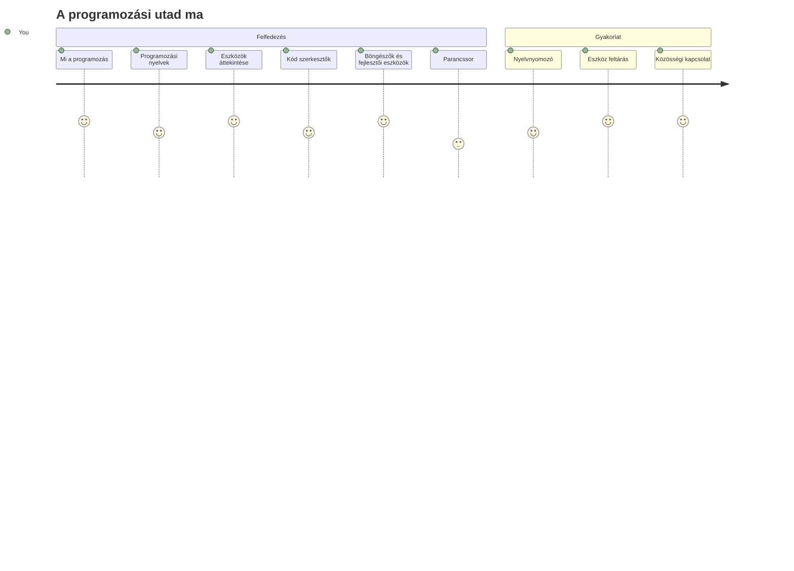
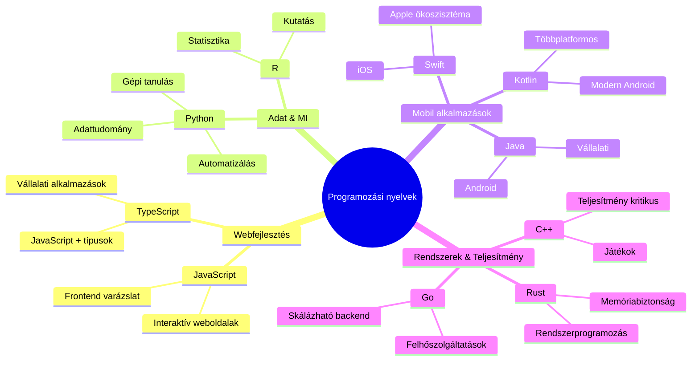
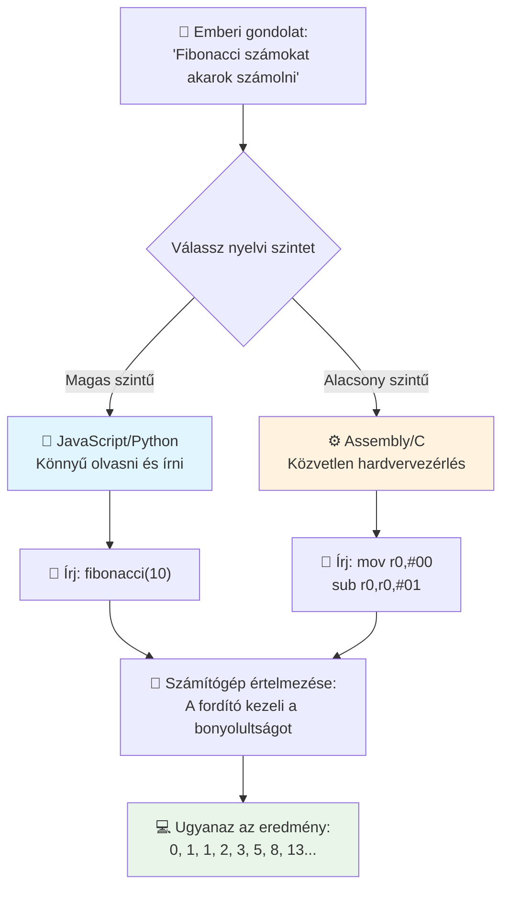
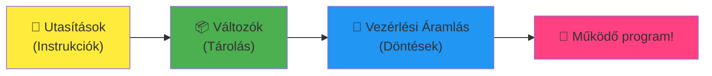
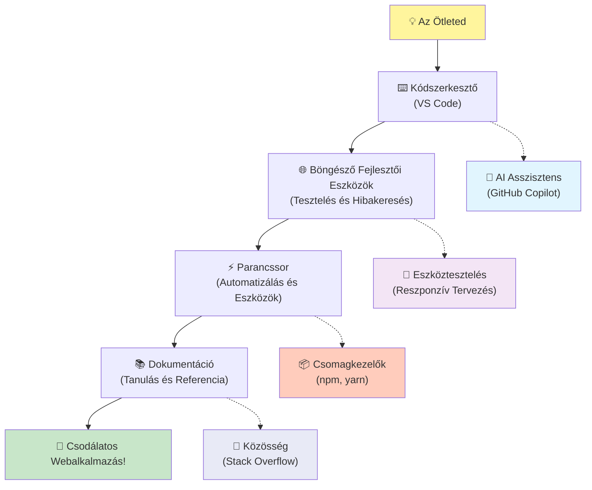
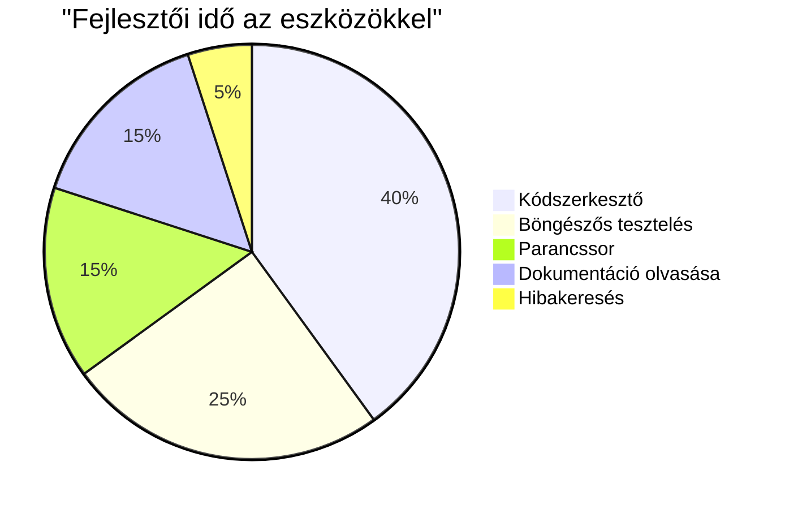
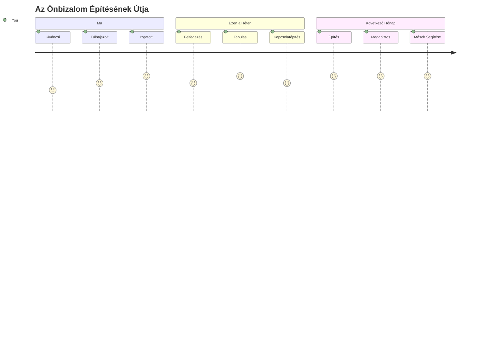

# Bevezetés a programozási nyelvekbe és a modern fejlesztői eszközökbe

Szia, jövőbeli fejlesztő! 👋 Elmondhatok neked valamit, ami nekem nap mint nap libabőrt okoz? Most fogod felfedezni, hogy a programozás nem csak a számítógépekről szól – hanem arról, hogy tényleges szuperképességeid legyenek, hogy a vadabb ötleteidet életre keltsd!

Ismered azt a pillanatot, amikor a kedvenc appodat használod, és minden tökéletesen klappol? Amikor megnyomsz egy gombot, és történik valami igazán varázslatos, amiért azt mondod: "hűha, ezt hogyan CSINÁLTÁK?" Nos, valaki pontosan olyan, mint te – valószínűleg a kedvenc kávézójában egy hajnal kettőkor, a harmadik eszpresszójával – írta azt a kódot, ami ezt a varázslatot megteremtette. És most jön az, ami el fog kápráztatni: a tanóra végére nemcsak meg fogod érteni, hogyan csinálták, hanem alig fogod várni, hogy magad is kipróbáld!

Nézd, teljesen megértem, ha most még ijesztőnek tűnik a programozás. Amikor én kezdtem, őszintén azt hittem, hogy valami matekgéniusz kell hozzá, vagy hogy ötéves korom óta kell kódolnom. De eztán valami teljesen megváltoztatta a nézőpontomat: a programozás pont olyan, mintha egy új nyelven tanulnál beszélgetni. Először csak annyit tudsz, hogy "szia" és "köszönöm", aztán már rendelni tudsz kávét, és az emberfia hamarosan mély filozófiai beszélgetéseket folytat! Csak itt a számítógéppel beszélgetsz, és őszintén? Ők a legelnézőbb beszélgetőpartnerek, amilyeneket el tudsz képzelni – soha nem ítélkeznek a hibáid miatt, és mindig örömmel próbálják újra!

Ma megismerjük az elképesztő eszközöket, amelyek nemcsak lehetővé teszik, hanem komolyan függőséget okoznak a modern webfejlesztést. Pontosan azokat a szerkesztőket, böngészőket és munkafolyamatokat fogjuk nézni, amiket a Netflix, Spotify és a kedvenc indie app stúdiód fejlesztői használnak nap mint nap. És itt jön a legjobb rész, ami boldoggá fog tenni: ezeknek a profi, ipari szabványú eszközöknek a nagy része teljesen ingyenes!


> Sketchnote készítette: [Tomomi Imura](https://twitter.com/girlie_mac)


```mermaid
journey
    title A programozási utad ma
    section Felfedezés
      Mi a programozás: 5: You
      Programozási nyelvek: 4: You
      Eszközök áttekintése: 5: You
    section Felfedezés
      Kód szerkesztők: 4: You
      Böngészők és fejlesztői eszközök: 5: You
      Parancssor: 3: You
    section Gyakorlat
      Nyelvnyomozó: 4: You
      Eszköz feltárás: 5: You
      Közösségi kapcsolat: 5: You
```
## Nézzük meg, mit tudsz már!

Mielőtt belevágnánk a mókába, kíváncsi vagyok – mit tudsz már erről a programozós világról? És hallgasd, ha ezeket a kérdéseket olvasva azt gondolod: "Nekem erről tényleg semmi fogalmam sincs," az nem csak rendben van, hanem tökéletes! Ez azt jelenti, hogy pontosan jó helyen vagy. Gondolj erre a kvízre úgy, mint egy bemelegítésre az edzés előtt – csak a "gondolkodó izmaidat" melegítjük fel!

[Vedd fel az előóra kvízt](https://ff-quizzes.netlify.app/web/)


## Az a kaland, amit együtt fogunk megtapasztalni

Oké, őszintén szólva majd kiugrom a bőrömből az izgalomtól, amit ma tanulni fogunk! Komolyan, bárcsak láthatnám az arcodat, amikor néhány fogalom hirtelen helyére kerül. Itt van az az elképesztő utazás, amire együtt indulunk:

- **Mi is pontosan a programozás (és miért a legmenőbb dolog az egész világon!)** – Felfedezzük, hogyan a kód szó szerint az a láthatatlan varázslat, ami mindent működtet körülötted, az ébresztőtől, ami valahogy tudja, hogy hétfő reggel van, egészen az algoritmusig, ami tökéletesen személyre szabja a Netflix ajánlásaidat.
- **A programozási nyelvek és elképesztő személyiségük** – Képzeld el, hogy belépsz egy buliba, ahol minden embernek teljesen más szuperképességei és problémamegoldó módszerei vannak. Pont ilyen a programozási nyelvek világa, és imádni fogod megismerni őket!
- **Az alapvető építőelemek, amelyek a digitális varázslatot létrehozzák** – Gondolj erre úgy, mint az ultimate kreatív LEGO készletre. Ha egyszer rájössz, ezek az elemek hogyan illeszkednek össze, rá fogsz jönni, hogy szó szerint bármit meg tudsz építeni, amit csak el tudsz képzelni.
- **Professzionális eszközök, amiktől úgy fogod érezni magad, mint egy mágus, akinek most adtak egy varázspálcát** – Nem dramatizálok – ezek az eszközök tényleg arra fognak késztetni, hogy szuperképességeid vannak, és a legjobb az egészben? Ezeket ugyanazokat az eszközöket használják a szakik!

> 💡 **Fontos**: Ne is gondolj arra, hogy ma mindent megjegyezz! Jelenleg csak azt szeretném, hogy érezd azt a lelkes szikrát, hogy mennyi minden lehetséges. A részletek maguktól ragadnak majd rád, ahogy gyakorolunk együtt – így zajlik a valódi tanulás!

> Ezt az órát megtalálod a [Microsoft Learn](https://learn.microsoft.com/en-us/learn/modules/web-development-101/introduction-programming/?WT.mc_id=academic-77807-sagibbon) oldalán is!

## Szóval, mit is jelent *valójában* a programozás?

Rendben, vessünk egy pillantást a millió dolláros kérdésre: mi is pontosan a programozás?

Mesélek egy történetet, ami teljesen megváltoztatta a gondolkodásomat erről. Múlt héten megpróbáltam elmagyarázni anyukámnak, hogyan kell használni az új okostévé távkapcsolónkat. Meghallottam magamban, ahogy mondom: "Nyomd meg a piros gombot, de nem a nagy pirosat, az apró pirosat balra... nem, a másik balodat... oké, most tartsd nyomva két másodpercig, nem egyet, nem hármat..." Ez ismerős? 😅

Ez a programozás! Az a művészet, hogy hihetetlenül részletes, lépésről lépésre szóló utasításokat adsz egy erős dolognak, amihez mindent tökéletesen ki kell fejezni. Csak itt nem anyukádnak magyarázol (aki megkérdezheti: "melyik piros gombot?!"), hanem a számítógépnek, ami pontosan azt csinálja, amit mondasz, még ha amit mondtál, nem is teljesen az, amit gondoltál.

Ami nekem az első tanuláskor teljesen megdöbbentő volt: a számítógépek valójában meglepően egyszerűek. Csak két dolgot értenek meg: 1-et és 0-t, ami nagyjából "igen" és "nem" vagy "bekapcsolva" és "kikapcsolva." Ennyi! De itt jön a varázslat – nekünk nem kell úgy beszélnünk, mint egy Mátrixban játszódó filmben, azaz csak 1-esekkel és 0-kval. Itt segítenek a **programozási nyelvek**. Olyanok, mint a világ legjobb tolmácsai, akik a normális emberi gondolataidat számítógép-nyelvre fordítják.

És eztől ma is minden reggel libabőrös leszek: szó szerint *minden* digitális az életedben onnan indult, hogy valaki, pont olyan, mint te, valószínűleg pizsamában, egy kávéval, gépelte a kódot a laptopján. Az az Instagram filter, ami tökéletessé tesz? Valaki megírta azt a kódot. Az az ajánlás, ami az új kedvenc dalodhoz vezetett? Egy fejlesztő készítette azt az algoritmust. Az az app, ami segít elosztani a vacsora számlát a barátaiddal? Igen, valaki arra gondolt, hogy "ez idegesítő, biztos meg tudom ezt oldani," és aztán... megoldotta!

Amikor megtanulod a programozást, nem csak egy új készséget sajátítasz el – egy elképesztő problémamegoldó közösség tagja leszel, akik nap mint nap azt gondolják: "Mi lenne, ha építenék valamit, ami egy kicsit jobbá teszi valaki napját?" Őszintén, van ennél menőbb dolog?

✅ **Szórakoztató ténykérdezés**: Itt egy szuper dolog, amit nézz meg, ha lesz egy szabad pillanatod – szerinted ki volt a világ első számítógépes programozója? Segítek: nem az, akire először gondolnál! Az ő története abszolút lenyűgöző, és megmutatja, hogy a programozás mindig is kreatív problémamegoldásról és a szokásos gondolkodásmódon túl való gondolkodásról szólt.

### 🧠 **Ellenőrző pont: Hogy érzed magad?**

**Szánj egy pillanatot az átgondolásra:**
- Most már érthető a "utasításokat adni a számítógépeknek" gondolata?
- Tudsz gondolni egy mindennapi feladatra, amit szívesen automatizálnál programozással?
- Milyen kérdések motoszkálnak a fejedben ezzel a programozás témával kapcsolatban?

> **Emlékezz**: Teljesen normális, ha néhány fogalom most még zavarosnak tűnik. A programozás tanulása olyan, mint egy új nyelv tanulása – idő kell, hogy az agyad kialakítsa az idegpályákat. Jól csinálod!

## A programozási nyelvek olyanok, mint a varázslat különböző ízei

Oké, ez furcsán fog hangzani, de maradj velem – a programozási nyelvek sokban hasonlítanak a különböző zenei műfajokra. Gondolj csak bele: van jazz, ami sima és improvizatív, rock, ami erőteljes és egyenes, klasszikus, ami elegáns és struktúrált, és hip-hop, ami kreatív és kifejező. Mindegyiknek megvan a saját hangulata, saját lelkes rajongótábora, és mind tökéletes más-más hangulathoz és alkalomhoz.

A programozási nyelvek is pontosan így működnek! Nem ugyanazt a nyelvet használnád egy szórakoztató mobil játékhoz, amit egy óriási klímadata elemzéshez, ahogy egy jógán sem tolnád a death metált (na, a legtöbb jógán mindenesetre! 😄).

De ami minden alkalommal teljesen leterít, amikor erre gondolok: ezek a nyelvek olyanok, mintha a világ legelnézőbb, legbriliánsabb tolmácsa ülne melletted. Az ötleteidet úgy tudod kifejezni, ahogy az emberi agyad számára természetes, és ők elvégzik azt az elképesztően bonyolult munkát, hogy lefordítsák azt az 1-esekre és 0-kra, amit a számítógépek ténylegesen értenek. Olyan, mintha lenne egy barátod, aki tökéletesen beszéli mind az "emberi kreativitást", mind a "számítógépes logikát" – és soha nem fárad el, soha nem kell kávészünet, és soha nem káromkodik, ha kétszer kérdezel ugyanazt!

### Népszerű programozási nyelvek és felhasználásuk


```mermaid
mindmap
  root((Programozási nyelvek))
    Webfejlesztés
      JavaScript
        Frontend varázslat
        Interaktív weboldalak
      TypeScript
        JavaScript + típusok
        Vállalati alkalmazások
    Adat & MI
      Python
        Adattudomány
        Gépi tanulás
        Automatizálás
      R
        Statisztika
        Kutatás
    Mobil alkalmazások
      Java
        Android
        Vállalati
      Swift
        iOS
        Apple ökoszisztéma
      Kotlin
        Modern Android
        Többplatformos
    Rendszerek & Teljesítmény
      C++
        Játékok
        Teljesítmény kritikus
      Rust
        Memóriabiztonság
        Rendszerprogramozás
      Go
        Felhőszolgáltatások
        Skálázható backend
```
| Nyelv | Legjobb hozzá | Miért népszerű |
|----------|----------|------------------|
| **JavaScript** | Webfejlesztés, felhasználói felületek | Böngészőkben fut, interaktív weboldalakat hajt |
| **Python** | Adattudomány, automatizálás, mesterséges intelligencia | Könnyű olvasni és tanulni, erőteljes könyvtárak |
| **Java** | Vállalati alkalmazások, Android appok | Platformfüggetlen, robusztus nagy rendszerekhez |
| **C#** | Windows alkalmazások, játékfejlesztés | Erős Microsoft támogatás |
| **Go** | Felhőszolgáltatások, backend rendszerek | Gyors, egyszerű, modern számítástechnikának tervezve |

### Magas szintű vs alacsony szintű nyelvek

Oké, őszintén szólva ez volt az a fogalom, ami teljesen összezavart, amikor először kezdtem tanulni, úgyhogy megosztom veled azt az analógiát, ami végül világossá tette számomra – és nagyon remélem, hogy neked is segíteni fog!

Képzeld el, hogy egy olyan országba látogatsz, ahol nem beszéled a nyelvet, és kétségbeesetten keresed a legközelebbi mosdót (mindannyian voltunk már így, ugye? 😅):

- **Az alacsony szintű programozás** olyan, mintha annyira megismernéd a helyi dialektust, hogy tudsz beszélgetni a saroknál gyümölcsöt árusító nagymamával kulturális utalásokkal, helyi szlenggel és belső poénokkal, csak azzal, aki ott nőtt fel. Szuper impresszív és hihetetlenül hatékony… ha véletlenül folyékony vagy! De elég megterhelő, ha csak egy mosdót próbálsz találni.

- **A magas szintű programozás** olyan, mintha meglenne az a csodás helyi barátod, aki egyszerűen megért. Mondhatod neki angolul, hogy "nagyon szükségem van egy mosdóra," és ő intéz minden kulturális fordítást, és olyan irányba mutat, ami teljesen érthető a nem helyi agyadnak.

Programozási értelemben:
- **Alacsony szintű nyelvekkel** (mint az Assembly vagy C) hihetetlenül részletes beszélgetéseket folytathatsz a számítógép tényleges hardverével, de gépként kell gondolkodnod, ami... nos, elég nagy agyi váltás!
- **Magas szintű nyelvekkel** (JavaScript, Python vagy C# például) emberként gondolkodhatsz, miközben ők intézik a gépes nyelvet a háttérben. Ráadásul olyan barátságos közösségek vesznek körül, akik emlékeznek, milyen újonnan kezdeni, és tényleg segíteni akarnak!

Tippeld meg, mivel kezdeném? 😉 A magas szintű nyelvek olyanok, mint a támaszkerek, amiket soha nem akarsz lehúzni, mert sokkal élvezetesebbé teszik az egész élményt!


```mermaid
flowchart TB
    A["👤 Emberi gondolat:<br/>'Fibonacci számokat akarok számolni'"] --> B{Válassz nyelvi szintet}
    
    B -->|Magas szintű| C["🌟 JavaScript/Python<br/>Könnyű olvasni és írni"]
    B -->|Alacsony szintű| D["⚙️ Assembly/C<br/>Közvetlen hardvervezérlés"]
    
    C --> E["📝 Írj: fibonacci(10)"]
    D --> F["📝 Írj: mov r0,#00<br/>sub r0,r0,#01"]
    
    E --> G["🤖 Számítógép értelmezése:<br/>A fordító kezeli a bonyolultságot"]
    F --> G
    
    G --> H["💻 Ugyanaz az eredmény:<br/>0, 1, 1, 2, 3, 5, 8, 13..."]
    
    style C fill:#e1f5fe
    style D fill:#fff3e0
    style H fill:#e8f5e8
```
### Hadd mutassam meg, miért barátságosabbak a magas szintű nyelvek

Rendben, mutatok valamit, ami tökéletesen példázza, miért szerettem meg a magas szintű nyelveket, de először meg kell ígérned valamit. Amikor meglátod az első kódpéldát, ne ess pánikba! Az pont azért tűnik ijesztőnek. Ez az, amit ki akarok emelni!

Megnézünk ugyanazt a feladatot két teljesen különböző stílusban. Mindkettő létrehozza az úgynevezett Fibonacci sorozatot – ez egy gyönyörű matematikai minta, ahol az egyes szám a kettő előző összege: 0, 1, 1, 2, 3, 5, 8, 13... (Érdekesség: ezt a mintát szinte mindenhol megtalálod a természetben – napraforgómag-spirálokban, fenyőtoboz mintákban, még a galaxisok formálódásában is!)

Készen állsz megnézni a különbséget? Gyerünk!

**Magas szintű nyelv (JavaScript) – Emberbarát:**

```javascript
// 1. lépés: Alapvető Fibonacci beállítás
const fibonacciCount = 10;
let current = 0;
let next = 1;

console.log('Fibonacci sequence:');
```

**Ezt csinálja ez a kód:**
- **Deklarál** egy konstans értéket, hogy megadja, hány Fibonacci számot akarunk generálni
- **Inicializál** két változót, hogy kövesse a sorozat aktuális és következő számát
- **Beállítja** a kezdő értékeket (0 és 1), amelyek meghatározzák a Fibonacci mintát
- **Megjelenít** egy fejléc üzenetet, hogy azonosítsa a kimenetet

```javascript
// 2. lépés: A sorozat generálása ciklussal
for (let i = 0; i < fibonacciCount; i++) {
  console.log(`Position ${i + 1}: ${current}`);
  
  // Számítsd ki a sorozat következő számát
  const sum = current + next;
  current = next;
  next = sum;
}
```

**Itt mi történik pontosan:**
- **Bejár** minden pozíciót a sorozatunkban egy `for` ciklus segítségével
- **Megjeleníti** minden számot a helyzetével együtt sablon-karakterlánc formátumban
- **Kiszámolja** a következő Fibonacci számot az aktuális és következő összeadásával
- **Frissíti** a nyomon követő változókat, hogy lépjen a következő iterációra

```javascript
// 3. lépés: Modern funkcionális megközelítés
const generateFibonacci = (count) => {
  const sequence = [0, 1];
  
  for (let i = 2; i < count; i++) {
    sequence[i] = sequence[i - 1] + sequence[i - 2];
  }
  
  return sequence;
};

// Használati példa
const fibSequence = generateFibonacci(10);
console.log(fibSequence);
```

**A fentiekben:**
- **Létrehoztunk** egy újrafelhasználható függvényt modern nyílfüggvény szintaxissal
- **Építettünk** egy tömböt, hogy tároljuk a teljes sorozatot ahelyett, hogy egyenként megjelenítjük
- **Használtuk** a tömb indexelést, hogy kiszámítsuk az új számokat az előzőkből
- **Visszaadtuk** a teljes sorozatot, hogy rugalmasan használhassuk a program más részeiben

**Alacsony szintű nyelv (ARM Assembly) – Számítógépbarát:**

```assembly
 area ascen,code,readonly
 entry
 code32
 adr r0,thumb+1
 bx r0
 code16
thumb
 mov r0,#00
 sub r0,r0,#01
 mov r1,#01
 mov r4,#10
 ldr r2,=0x40000000
back add r0,r1
 str r0,[r2]
 add r2,#04
 mov r3,r0
 mov r0,r1
 mov r1,r3
 sub r4,#01
 cmp r4,#00
 bne back
 end
```

Észreveheted, hogy a JavaScript verzió majdnem úgy olvasható, mint egy angol nyelvű utasítás, míg az Assembly verzió titokzatos parancsokat használ, amelyek közvetlenül vezérlik a számítógép processzorát. Mindkettő ugyanazt a feladatot oldja meg, de a magas szintű nyelvet sokkal könnyebb az embereknek megérteni, írni és karbantartani.

**A legfontosabb különbségek, amiket észre fogsz venni:**
- **Olvashatóság**: A JavaScript leíró neveket használ, mint például `fibonacciCount`, míg az Assembly titkosított címkéket, például `r0`, `r1`
- **Megjegyzések**: A magas szintű nyelvek bátorítják a magyarázó megjegyzéseket, amelyek önmagukat dokumentálóvá teszik a kódot
- **Struktúra**: A JavaScript logikai folyamata megfelel annak, ahogyan az emberek lépésről lépésre gondolkodnak a problémákról
- **Karbantartás**: A JavaScript verzió frissítése különböző követelményekhez egyszerű és világos

✅ **A Fibonacci-sorozatról**: Ez a gyönyörű szám-minta (ahol minden szám az előtte lévő két szám összege: 0, 1, 1, 2, 3, 5, 8...) szó szerint *mindenütt* megjelenik a természetben! Megtalálod a napraforgó spiráljaiban, fenyőtoboz mintákban, a nautilusz kagylók görbületeiben, és még abban is, hogyan nőnek a faágak. Elképesztő, hogy a matematika és a kód hogyan segít megérteni és újrateremteni azokat a mintákat, amelyeket a természet használ a szépség létrehozásához!


## Az építőkövek, amelyek a varázslatot létrehozzák

Rendben, most, hogy láttad, hogy hogyan néznek ki a programozási nyelvek működés közben, bontsuk le az alapvető elemeket, amelyek szó szerint minden valaha írt programot alkotnak. Gondolj ezekre úgy, mint a kedvenc recepted nélkülözhetetlen összetevőire – ha egyszer megérted, hogy melyik mit csinál, képes leszel kódot olvasni és írni gyakorlatilag bármilyen nyelven!

Ez hasonló a programozás nyelvtanának megtanulásához. Emlékszel, amikor az iskolában tanultad a főnevekről, igékről és arról, hogy hogyan épülnek mondatok? A programozásnak is megvan a maga nyelvtana, és őszintén szólva, sokkal logikusabb és engedékenyebb, mint az angol nyelvtan valaha volt! 😄

### Utasítások: Lépésről lépésre szóló parancsok

Kezdjük az **utasításokkal** – ezek olyanok, mint egy-egy mondat a számítógéppel folytatott beszélgetésben. Minden utasítás arra kéri a számítógépet, hogy végezzen el egy meghatározott dolgot, olyasmi mint az útmutatások: „Fordulj balra itt,” „Állj meg a piros lámpánál,” „Parkolj be abba a helybe.”

Amit szeretek az utasításokban, hogy általában mennyire olvashatóak. Nézd csak meg ezt:

```javascript
// Alapvető utasítások, amelyek egyetlen műveletet hajtanak végre
const userName = "Alex";                    
console.log("Hello, world!");              
const sum = 5 + 3;                         
```

**Ez a kód a következőt csinálja:**
- **Deklarál** egy konstans változót a felhasználó nevének tárolására
- **Megjelenít** egy üdvözlő üzenetet a konzol kimeneten
- **Kiszámít** és eltárol egy matematikai művelet eredményét

```javascript
// Utasítások, amelyek weboldalakkal lépnek kapcsolatba
document.title = "My Awesome Website";      
document.body.style.backgroundColor = "lightblue";
```

**Lépésről lépésre, ez történik:**
- **Módosítja** az oldal címét, ami a böngésző fülében jelenik meg
- **Megváltoztatja** az egész oldal háttérszínét

### Változók: A programod memóriarendszere

Oké, a **változók** az egyik abszolút kedvenc koncepcióm tanítani, mert annyira olyanok, mint amiket nap mint nap használsz!

Gondolj egy pillanatra a telefonod névjegyzékére. Nem jegyzed meg minden számot – helyette elmented, hogy „Anyu”, „Legjobb barát”, vagy „Pizzéria, ami 2-ig szállít” és a telefonod emlékszik a tényleges számokra. A változók pontosan így működnek! Olyan címkézett tárolóedények, ahol a programod információkat menthet és később név alapján visszakeresheti azokat.

És ami igazán klassz: a változók a program futása közben változhatnak (innen ered a „változó” név – látod, mit csináltak?). Ahogy frissítheted a pizzéria elérhetőségeit, amikor találsz egy még jobbat, a programod is frissítheti a változókat, ahogy új információkat tanul vagy ahogy a helyzet változik!

Mutatom, milyen gyönyörűen egyszerű lehet ez:

```javascript
// 1. lépés: Alapvető változók létrehozása
const siteName = "Weather Dashboard";        
let currentWeather = "sunny";               
let temperature = 75;                       
let isRaining = false;                      
```

**Ezeknek a fogalmaknak a megértése:**
- **Tárol** állandó értékeket `const` változókban (például az oldal nevét)
- **Használ** `let` változókat olyan értékekhez, amelyek változhatnak a program futása során
- **Társít** különböző adattípusokat: szövegek (stringek), számok és logikai értékek (true/false)
- **Választ** beszédes neveket, amelyek elmagyarázzák, mit tartalmaz az adott változó

```javascript
// 2. lépés: Objektumok használata kapcsolódó adatok csoportosításához
const weatherData = {                       
  location: "San Francisco",
  humidity: 65,
  windSpeed: 12
};
```

**Az előzőben:**
- **Létrehoztunk** egy objektumot, hogy egy csoportba rendezzük az időjárási adatokat
- **Szerveztünk** több adatot egy változónév alatt
- **Használtunk** kulcs-érték párokat az egyes adatdarabok egyértelmű megjelölésére

```javascript
// 3. lépés: Változók használata és frissítése
console.log(`${siteName}: Today is ${currentWeather} and ${temperature}°F`);
console.log(`Wind speed: ${weatherData.windSpeed} mph`);

// Változtatható változók frissítése
currentWeather = "cloudy";                  
temperature = 68;                          
```

**Nézzük meg részletesen:**
- **Megjelenítés** sablon literálok segítségével a `${}` szintaxissal
- **Hozzáférés** objektum tulajdonságaihoz pontozással (`weatherData.windSpeed`)
- **Frissítés** `let` változókkal, hogy tükrözze a változó körülményeket
- **Összekombinálás** több változóból, hogy értelmes üzeneteket alkossunk

```javascript
// 4. lépés: Modern destrukturálás a tisztább kódért
const { location, humidity } = weatherData; 
console.log(`${location} humidity: ${humidity}%`);
```

**Amit tudni kell:**
- **Kinyerés** objektumokból specifikus tulajdonságokat destrukturálással
- **Automatikus** új változók létrehozása ugyanazzal a névvel, mint az objektum kulcsai
- **Egyszerűsítés** a kódon az ismétlődő pontozás elkerülésével

### Vezérlési folyamat: Megtanítani a programot gondolkodni

Oké, itt válik a programozás igazán lenyűgözővé! A **vezérlési folyamat** tulajdonképpen azt jelenti, hogy megtanítod a programodat okosan dönteni, pontosan úgy, ahogy te is teszed nap mint nap gondolkodás nélkül.

Képzeld el: ma reggel valószínűleg valami olyasmit csináltál, hogy „Ha esik, viszek esernyőt. Ha hideg van, kabátot veszek. Ha elkések, kihagyom a reggelit és útközben veszek kávét.” Az agyad automatikusan követi ezt az ha-akkor logikát naponta több tucatszor!

Ez az, ami miatt a programok intelligensnek és élőnek érződnek, nem pedig egy unalmas, kiszámítható forgatókönyvet követnek. Valóban képesek megnézni a helyzetet, kiértékelni, hogy mi történik, és megfelelően reagálni. Olyan, mintha az általad írt programnak agya lenne, ami alkalmazkodni tud és döntéseket hoz!

Szeretnéd látni, milyen gyönyörűen működik ez? Megmutatom:

```javascript
// 1. lépés: Alapvető feltételes logika
const userAge = 17;

if (userAge >= 18) {
  console.log("You can vote!");
} else {
  const yearsToWait = 18 - userAge;
  console.log(`You'll be able to vote in ${yearsToWait} year(s).`);
}
```

**Ez a kód a következőt teszi:**
- **Ellenőrzi**, hogy a felhasználó életkora megfelel-e a szavazati korhatárnak
- **Végrehajt** különböző kódrészleteket a feltétel eredményétől függően
- **Kiszámít** és megjeleníti, mennyi idő van még szavazati jogosultságig, ha az illető 18 alatti
- **Ad** konkrét, hasznos visszajelzést minden esetre

```javascript
// 2. lépés: Több feltétel logikai operátorokkal
const userAge = 17;
const hasPermission = true;

if (userAge >= 18 && hasPermission) {
  console.log("Access granted: You can enter the venue.");
} else if (userAge >= 16) {
  console.log("You need parent permission to enter.");
} else {
  console.log("Sorry, you must be at least 16 years old.");
}
```

**Lépésről lépésre, ez történik:**
- **Egyesít** több feltételt az `&&` (és) operátorral
- **Létrehozza** a feltételek hierarchiáját `else if`-ekkel több forgatókönyvhöz
- **Kezeli** az összes lehetséges esetet egy végső `else` utasítással
- **Ad** világos, cselekvésre ösztönző visszajelzést minden különböző helyzethez

```javascript
// 3. lépés: Tömör feltételes kifejezés ternáris operátorral
const votingStatus = userAge >= 18 ? "Can vote" : "Cannot vote yet";
console.log(`Status: ${votingStatus}`);
```

**Mit érdemes megjegyezni:**
- **Használja** a ternáris operátort (`? :`) egyszerű kétválasztásos feltételekhez
- **Írd** először a feltételt, majd `?`, aztán az igaz eredményt, majd `:`, végül a hamis eredményt
- **Alkalmazd** ezt a mintát, amikor feltételek szerint kell értékeket hozzárendelni

```javascript
// 4. lépés: Több speciális eset kezelése
const dayOfWeek = "Tuesday";

switch (dayOfWeek) {
  case "Monday":
  case "Tuesday":
  case "Wednesday":
  case "Thursday":
  case "Friday":
    console.log("It's a weekday - time to work!");
    break;
  case "Saturday":
  case "Sunday":
    console.log("It's the weekend - time to relax!");
    break;
  default:
    console.log("Invalid day of the week");
}
```

**Ez a kód a következőt éri el:**
- **Összehasonlítja** a változó értékét több konkrét esettel
- **Csoportosít** hasonló eseteket (hétköznapok versus hétvégék)
- **Végrehajtja** a megfelelő kódrészt, ha egyezés van
- **Tartalmaz** egy `default` esetet a váratlan értékek kezelésére
- **Használ** `break` utasításokat, hogy megakadályozza a folytatást a következő esethez

> 💡 **Valós példával**: Gondolj a vezérlési folyamatra úgy, mint a világ legjobb türelmes GPS-ére, ami útbaigazítást ad. A GPS mondhatja: „Ha a Main Street-en forgalom van, inkább menj az autópályán. Ha az autópályát építkezés zárja el, próbáld a panorámás utat.” A programok pontosan ugyanolyan feltételes logikát használnak, hogy intelligensen reagáljanak különböző helyzetekre, és mindig a legjobb felhasználói élményt nyújtsák.

### 🎯 **Fogalomellenőrzés: Az építőelemek mesteri elsajátítása**

**Nézzük, hogyan megy az alapok megértése:**
- Tudod saját szavaiddal elmagyarázni a változó és az utasítás közti különbséget?
- Gondolj egy valós életbeli helyzetre, ahol if-then döntést használnál (például a szavazós példa)
- Mi volt az egyik dolog a programozási logikában, ami meglepett?

**Gyors önbizalom-növelő:**

```mermaid
flowchart LR
    A["📝 Utasítások<br/>(Instrukciók)"] --> B["📦 Változók<br/>(Tárolás)"] --> C["🔀 Vezérlési Áramlás<br/>(Döntések)"] --> D["🎉 Működő program!"]
    
    style A fill:#ffeb3b
    style B fill:#4caf50
    style C fill:#2196f3
    style D fill:#ff4081
```
✅ **Mi következik ezután**: Nagyszerű szórakozás lesz mélyebben belemerülni ezekbe a fogalmakba, miközben közösen folytatjuk ezt a hihetetlen utazást! Most csak arra koncentrálj, hogy érezd azt az izgalmat az összes elképesztő lehetőség miatt, ami előtted áll. A konkrét készségek és technikák természetesen rögzülnek majd, ahogy együtt gyakorolunk – ígérem, sokkal szórakoztatóbb lesz, mint gondolnád!

## A szakma eszközei

Rendben, ez az a pont, ahol őszintén annyira izgatott leszek, hogy alig bírom türtőztetni magam! 🚀 Most arról fogunk beszélni, hogy milyen elképesztő eszközök fognak úgy éreztetni, mintha épp egy digitális űrhajó kulcsait adnák a kezedbe.

Tudod, hogy egy szakácsnak milyen tökéletesen kiegyensúlyozott kések vannak, amelyek szinte a kezének meghosszabbításai? Vagy hogy egy zenésznek van az a gitárja, ami az első érintésre mintha énekelne? Nos, a fejlesztőknek megvan a saját verziójuk ezekből a varázseszközökből, és most elmondom, hogy mi az, ami teljesen el fogja kápráztatni az elmédet – a legtöbbjük teljesen ingyenes!

Szinte ugrálok a székemben, hogy megoszthassam veled ezeket, mert teljesen forradalmasították, ahogy szoftvert építünk. Azokról az AI-alapú kódíró asszisztensekről beszélünk, amik képesek segíteni kódot írni (komolyan!), felhőalapú környezetekről, ahol szinte bárhonnan, Wi-Fi-vel teljes alkalmazásokat építhetsz, és hibakereső eszközökről, amelyek olyan kifinomultak, mint ha röntgenlátásuk lenne a programjaidnak.

És itt jön a rész, ami még mindig libabőrös lesz: ezek nem „kezdő eszközök”, amiket kinősz majd. Ezek pontosan ugyanazok a profi minőségű eszközök, amelyeket a Google, Netflix fejlesztői, és az a kedvenc indie app stúdiód most is használnak. Annyira profinak fogod érezni magad, amikor használod őket!


```mermaid
graph TD
    A["💡 Az Ötleted"] --> B["⌨️ Kódszerkesztő<br/>(VS Code)"] 
    B --> C["🌐 Böngésző Fejlesztői Eszközök<br/>(Tesztelés és Hibakeresés)"]
    C --> D["⚡ Parancssor<br/>(Automatizálás és Eszközök)"]
    D --> E["📚 Dokumentáció<br/>(Tanulás és Referencia)"]
    E --> F["🚀 Csodálatos Webalkalmazás!"]
    
    B -.-> G["🤖 AI Asszisztens<br/>(GitHub Copilot)"]
    C -.-> H["📱 Eszköztesztelés<br/>(Reszponzív Tervezés)"]
    D -.-> I["📦 Csomagkezelők<br/>(npm, yarn)"]
    E -.-> J["👥 Közösség<br/>(Stack Overflow)"]
    
    style A fill:#fff59d
    style F fill:#c8e6c9
    style G fill:#e1f5fe
    style H fill:#f3e5f5
    style I fill:#ffccbc
    style J fill:#e8eaf6
```
### Kód szerkesztők és IDE-k: az új digitális legjobb barátaid

Beszéljünk a kódszerkesztőkről – ezek tényleg a szíved egyik kedvenc helyévé fognak válni! Gondolj rájuk úgy, mint a személyes kódolási szentélyedre, ahol a legtöbb idődet töltöd majd digitális alkotásaid megformálásával és tökéletesítésével.

De ami igazán varázslatos a modern szerkesztőkben: nem csak menő szövegszerkesztők. Olyanok, mintha a legbriliánsabb, legtámogatóbb kódolási mentorod ülne melletted éjjel-nappal. Elkapják az elírásaidat, még mielőtt észrevennéd, javaslatokat tesznek, hogy zseninek tűnj, segítenek megérteni, hogy mit csinál minden kódrészlet, és egyesek még meg is próbálják kitalálni, mit akarsz írni és felajánlják, hogy befejezik a gondolataidat!

Emlékszem, amikor először fedeztem fel az automatikus kiegészítést – szó szerint úgy éreztem, mintha a jövőben élnék. Elkezded gépelni, és a szerkesztőd azt mondja: „Hé, nem ezt a függvényt akartad használni, ami pont azt csinálja, amire szükséged van?” Olyan, mintha egy gondolatolvasó kódoló haverod lenne!

**Mi teszi ezeket a szerkesztőket annyira elképesztővé?**

A modern kódszerkesztők lenyűgöző funkciók széles skáláját kínálják, amelyek növelik a termelékenységedet:

| Funkció | Mit csinál | Miért segít |
|---------|------------|-------------|
| **Szintaxis kiemelés** | Más színeket ad a kód különböző részeinek | Könnyebbé teszi az olvasást és a hibák felismerését |
| **Automatikus kiegészítés** | Javasolja a kódot gépelés közben | Felgyorsítja a kódolást és csökkenti az elírásokat |
| **Hibakereső eszközök** | Segít megtalálni és javítani a hibákat | Órákat spórol a hibák keresésén |
| **Bővítmények** | Speciális funkciókat ad hozzá | Testreszabhatod a szerkesztőt bármilyen technológiához |
| **AI asszisztensek** | Kódot és magyarázatokat javasolnak | Gyorsítja a tanulást és a hatékonyságot |

> 🎥 **Videóforrás**: Szeretnéd látni ezeket az eszközöket működés közben? Nézd meg ezt a [Tools of the Trade videót](https://youtube.com/watch?v=69WJeXGBdxg) egy átfogó bemutatóért.

#### Ajánlott szerkesztők webfejlesztéshez

**[Visual Studio Code](https://code.visualstudio.com/?WT.mc_id=academic-77807-sagibbon)** (Ingyenes)
- A legnépszerűbb a webfejlesztők körében
- Kiváló bővítmény-rendszer
- Beépített terminál és Git integráció
- **Kötelező bővítmények**:
  - [GitHub Copilot](https://marketplace.visualstudio.com/items?itemName=GitHub.copilot) - AI-alapú kódjavaslatok
  - [Live Share](https://marketplace.visualstudio.com/items?itemName=MS-vsliveshare.vsliveshare) - Valós idejű együttműködés
  - [Prettier](https://marketplace.visualstudio.com/items?itemName=esbenp.prettier-vscode) - Automatikus kódformázás
  - [Code Spell Checker](https://marketplace.visualstudio.com/items?itemName=streetsidesoftware.code-spell-checker) - Elírások felismerése a kódban

**[JetBrains WebStorm](https://www.jetbrains.com/webstorm/)** (Fizetős, diákoknak ingyenes)
- Fejlett hibakeresés és tesztelés
- Intelligens kiegészítés
- Beépített verziókezelés

**Felhőalapú IDE-k** (különféle árképzés)
- [GitHub Codespaces](https://github.com/features/codespaces) - Teljes VS Code a böngészőben
- [Replit](https://replit.com/) - Nagyszerű tanuláshoz és megosztáshoz
- [StackBlitz](https://stackblitz.com/) - Azonnali, teljes webfejlesztés

> 💡 **Kezdő tipp**: Kezdd a Visual Studio Code-dal – ingyenes, széles körben használt az iparban, és hatalmas közösség készít hozzá hasznos oktatóanyagokat és bővítményeket.


### Web böngészők: a titkos fejlesztői laboratóriumod

Oké, készülj fel, hogy teljesen elbűvöljön ez! Tudod, hogy böngészőket használsz a közösségi média böngészésére és videók nézésére? Nos, kiderült, hogy egész idő alatt rejtegettek egy elképesztő titkos fejlesztői laboratóriumot, csak arra várva, hogy felfedezd!

Minden alkalommal, amikor az egér jobb gombjával kattintasz egy weboldalon, és kiválasztod az „Elem vizsgálata” lehetőséget, egy rejtett fejlesztői eszközök világát nyitod meg, amelyek őszintén szólva erősebbek, mint néhány drága szoftver, amit korábban száz dollárokért vettem. Olyan, mintha a régi, megszokott konyhád mögött egy profi séf laboratóriuma rejtőzne egy titkos panel mögött!
Amikor először mutatták meg nekem a böngésző fejlesztői eszközeit, olyan három órát töltöttem egyszerű kattintgatással és azon ámuldozva: "VÁRJ, EZT IS TUDJA?!" Szó szerint valós időben szerkeszthetsz bármilyen weboldalt, pontosan láthatod, milyen gyorsan töltődik be minden, tesztelheted, hogyan néz ki az oldal különböző eszközökön, és még JavaScriptet is hibakereshetsz, mint egy profi. Ez egyszerűen hihetetlen!

**Íme, miért titkos fegyvered a böngésző:**

Amikor weboldalt vagy webalkalmazást készítesz, látnod kell, hogy néz ki és hogyan viselkedik a valóságban. A böngészők nemcsak megjelenítik a munkádat, hanem részletes visszajelzést is adnak a teljesítményről, az akadálymentességről és a lehetséges problémákról.

#### Böngésző fejlesztői eszközök (DevTools)

A modern böngészők átfogó fejlesztői csomagokat tartalmaznak:

| Eszközkategória | Mit csinál | Példa használati eset |
|-----------------|------------|-----------------------|
| **Elemellenőrző** | HTML/CSS valós idejű megtekintése és szerkesztése | Stílus módosítása az azonnali eredményhez |
| **Konzol** | Hibák megtekintése és JavaScript tesztelése | Hibák keresése és kód kísérletezés |
| **Hálózatfigyelő** | Követi az erőforrások betöltődését | Teljesítmény és betöltési idők optimalizálása |
| **Akadálymentesség-ellenőrző** | Befogadó dizájn tesztelése | Biztosítja, hogy az oldal mindenki számára működjön |
| **Eszköz szimulátor** | Különböző képernyőméreteken történő előnézet | Reszponzív dizájn tesztelése eszközök nélkül |

#### Ajánlott böngészők fejlesztéshez

- **[Chrome](https://developers.google.com/web/tools/chrome-devtools/)** – Iparági szabványos DevTools széleskörű dokumentációval
- **[Firefox](https://developer.mozilla.org/docs/Tools)** – Kiváló CSS Grid és akadálymentességi eszközök
- **[Edge](https://docs.microsoft.com/microsoft-edge/devtools-guide-chromium/?WT.mc_id=academic-77807-sagibbon)** – Chromium alapú, Microsoft fejlesztői erőforrásokkal

> ⚠️ **Fontos tesztelési tipp**: Mindig teszteld az oldaladat több böngészőben! Ami tökéletesen működik Chrome-ban, az másként nézhet ki Safariban vagy Firefoxban. A profi fejlesztők minden fő böngészőben tesztelnek a következetes felhasználói élmény érdekében.


### Parancssori eszközök: A fejlesztői szupererőd kapuja

Na jól van, legyünk teljesen őszinték a parancssorról, mert szeretném, ha ezt olyan embertől hallanád, aki tényleg érti. Amikor először láttam – csak egy ijesztő fekete képernyő villogó szöveggel – szó szerint azt gondoltam: „Nem, ez nekem túl sok! Ez olyan, mintha egy 1980-as évekbeli hackerfilmből lenne, és én biztosan nem vagyok elég okos ehhez!” 😅

De azt kívánom, valaki akkoriban elmondta volna nekem, és most neked is mondom: a parancssor nem ijesztő – valójában olyan, mintha közvetlenül beszélnél a számítógépeddel. Gondolj rá úgy, mint a különbségre egy menő ételrendelő app képekkel és menükkel (ami kellemes és egyszerű) és az között, amikor bemész a kedvenc helyi éttermedbe, ahol a szakács pontosan tudja, mit szeretsz, és egy „lepd meg valami csodálatossal” mondattal tökéletes fogást készít.

A parancssor az a hely, ahol a fejlesztők úgy érzik magukat, mint az abszolút varázslók. Beírsz néhány látszólag varázslatos szót (oké, csak parancsok, de varázslatosnak érződnek!), megnyomod az entert, és PÁÁÁM – egész projektstruktúrákat hoztál létre, telepítettél hatékony eszközöket a világ minden tájáról, vagy épp élesítettél egy appot az internetre, hogy milliók láthassák. Amint egyszer megkóstolod ezt a hatalmat, őszintén szólva eléggé függővé válik!

**Miért lesz a parancssor a kedvenc eszközöd:**

Bár a grafikus felületek sok feladathoz remekek, a parancssor az automatizálásban, a pontosságban és a sebességben jeleskedik. Sok fejlesztői eszköz elsősorban parancssori felületen működik, és ezek hatékony használatának elsajátítása drámaian javíthatja a termelékenységedet.

```bash
# 1. lépés: Hozd létre a projekt könyvtárat és lépj be oda
mkdir my-awesome-website
cd my-awesome-website
```
  
**Ez a kód mit csinál:**  
- **Új mappát hoz létre** "my-awesome-website" néven a projektednek  
- **Belép** az újonnan létrehozott mappába, hogy elkezdhess dolgozni

```bash
# 2. lépés: Projekt inicializálása package.json fájllal
npm init -y

# Modern fejlesztőeszközök telepítése
npm install --save-dev vite prettier eslint
npm install --save-dev @eslint/js
```
  
**Lépésről lépésre, mi történik:**  
- **Inicializál** egy új Node.js projektet alapértelmezett beállításokkal az `npm init -y` segítségével  
- **Telepíti** a Vite-t modern build eszközként a gyors fejlesztéshez és éles buildhez  
- **Hozzáad** Prettier-t automatikus kódformázáshoz és ESLint-et a kódminőség ellenőrzésére  
- **A** `--save-dev` kapcsolót használja, hogy ezeket csak fejlesztési függőségként jelölje meg

```bash
# 3. lépés: Projektstruktúra és fájlok létrehozása
mkdir src assets
echo '<!DOCTYPE html><html><head><title>My Site</title></head><body><h1>Hello World</h1></body></html>' > index.html

# Indítsa el a fejlesztői szervert
npx vite
```
  
**Az előbbiekben:**  
- **Rendszerezte** a projektet külön mappákkal a forráskódnak és az eszközöknek  
- **Generált** egy alap HTML fájlt megfelelő dokumentumszerkezettel  
- **Elindította** a Vite fejlesztői szervert élő újratöltéssel és hot module replacementtel

#### Nélkülözhetetlen parancssori eszközök webfejlesztéshez

| Eszköz | Célja | Miért van rá szükséged |
|--------|-------|-----------------------|
| **[Git](https://git-scm.com/)** | Verziókezelés | Változások nyomon követése, együttműködés, biztonsági mentés |
| **[Node.js & npm](https://nodejs.org/)** | JavaScript futtató környezet és csomagkezelő | JavaScript futtatása böngészőn kívül, modern eszközök telepítése |
| **[Vite](https://vitejs.dev/)** | Build eszköz és fejlesztői szerver | Villámgyors fejlesztés hot module replacemente |
| **[ESLint](https://eslint.org/)** | Kódminőség | Automatikusan felismeri és javítja a JavaScript problémákat |
| **[Prettier](https://prettier.io/)** | Kódformázás | Konzisztens és olvasható kódot biztosít |

#### Platform-specifikus lehetőségek

**Windows:**  
- **[Windows Terminal](https://docs.microsoft.com/windows/terminal/?WT.mc_id=academic-77807-sagibbon)** – Modern, sok funkciós terminál  
- **[PowerShell](https://docs.microsoft.com/powershell/?WT.mc_id=academic-77807-sagibbon)** 💻 – Erős szkriptnyelvi környezet  
- **[Parancssor](https://docs.microsoft.com/windows-server/administration/windows-commands/?WT.mc_id=academic-77807-sagibbon)** 💻 – Hagyományos Windows parancssor

**macOS:**  
- **[Terminal](https://support.apple.com/guide/terminal/)** 💻 – Beépített terminálalkalmazás  
- **[iTerm2](https://iterm2.com/)** – Fejlettebb terminál további funkciókkal

**Linux:**  
- **[Bash](https://www.gnu.org/software/bash/)** 💻 – Standard Linux shell  
- **[KDE Konsole](https://docs.kde.org/trunk5/en/konsole/konsole/index.html)** – Fejlett terminálemulátor

> 💻 = Előre telepítve az operációs rendszerrel

> 🎯 **Tanulási út**: Kezdd az alap parancsokkal, mint a `cd` (könyvtárváltás), `ls` vagy `dir` (fájlok listázása), és `mkdir` (mappa létrehozása). Gyakorold a modern munkafolyamat-parancsokat, például `npm install`, `git status` és `code .` (megnyitja az aktuális könyvtárat VS Code-ban). Ahogy egyre magabiztosabb leszel, természetesen tanulsz majd fejlettebb parancsokat és automatizálási technikákat is.


### Dokumentáció: Mindig elérhető tanuló mentorod

Nos, megosztok egy kis titkot, ami sokkal jobban fogja érezni magát, aki kezdő: még a legtapasztaltabb fejlesztők is az idejük nagy részét dokumentáció olvasásával töltik. És nem azért, mert nem tudják, mit csinálnak – ez valójában a bölcsesség jele!

Gondolj a dokumentációra úgy, mintha a világ legkedvesebb, legokosabb tanárai lennének, akik 24/7 elérhetőek. Elakadtál egy problémával éjjel 2-kor? A dokumentáció ott van egy virtuális meleg öleléssel és pontosan a választ adja, amire szükséged van. Meg akarsz tanulni egy menő új funkciót, amiről mindenki beszél? A dokumentáció ott van lépésről lépésre példákkal. Megpróbálod megérteni, miért működik valami úgy, ahogy? Innen tudod – a dokumentáció kész elmagyarázni úgy, hogy végre „összeálljon” a kép!

Volt valami, ami teljesen megváltoztatta a látásmódom: a webfejlesztés hihetetlenül gyorsan változik, és senki (értsd: senki!) nem tud mindent kívülről. Láttam 15+ éves tapasztalatú senior fejlesztőket, amint alap szintaxisokat néznek meg, és tudod mit? Ez nem ciki – ez okos dolog! Nem az a lényeg, hogy szupermemóriád legyen; hanem hogy tudd, hol találod gyorsan a megbízható válaszokat, és tudd, hogyan alkalmazd őket.

**Itt történik az igazi varázslat:**

A profi fejlesztők jelentős időt töltenek dokumentáció olvasásával – nem azért, mert nem tudják mit csinálnak, hanem mert a webfejlesztési világ olyan gyorsan változik, hogy a naprakészség folyamatos tanulást igényel. A nagyszerű dokumentáció nemcsak azt mutatja meg, *hogyan* használj valamit, hanem azt is, *miért* és *mikor* érdemes.

#### Alapvető dokumentációs források

**[Mozilla Developer Network (MDN)](https://developer.mozilla.org/docs/Web)**  
- Az aranyszabvány webtechnológiák dokumentációjában  
- Átfogó útmutatók HTML, CSS és JavaScript témában  
- Böngésző kompatibilitási információkkal  
- Gyakorlati példákkal és interaktív demókkal

**[Web.dev](https://web.dev)** (Google-tól)  
- Modern webfejlesztési legjobb gyakorlatok  
- Teljesítmény optimalizációs útmutatók  
- Akadálymentesség és befogadó dizájn elvei  
- Valós projektek esettanulmányai

**[Microsoft Developer Documentation](https://docs.microsoft.com/microsoft-edge/#microsoft-edge-for-developers)**  
- Edge böngésző fejlesztői erőforrásai  
- Progresszív webalkalmazás útmutatók  
- Többplatformos fejlesztési betekintések

**[Frontend Masters Learning Paths](https://frontendmasters.com/learn/)**  
- Strukturált tanulási tanmenetek  
- Ipari szakértők videós kurzusai  
- Gyakorlati kódolási feladatok

> 📚 **Tanulási stratégiák**: Ne próbáld meg memorizálni a dokumentációt – inkább tanuld meg hatékonyan keresni benne. Könyvjelzőzd a gyakran használt referenciaanyagokat, és gyakorold a keresési funkciók használatát, hogy gyorsan megtaláld a konkrét információkat.

### 🔧 **Eszközhasználati teszt: Mi rezonál veled?**

**Szánj egy pillanatot arra, hogy átgondold:**  
- Melyik eszközt próbálnád ki legszívesebben először? (Nincs rossz válasz!)  
- Még mindig ijesztő a parancssor, vagy érdeklődsz iránta?  
- El tudod képzelni, hogy a böngésző DevTools-szal beleshetsz a kedvenc weboldalaid kulisszái mögé?


```mermaid
pie title "Fejlesztői idő az eszközökkel"
    "Kódszerkesztő" : 40
    "Böngészős tesztelés" : 25
    "Parancssor" : 15
    "Dokumentáció olvasása" : 15
    "Hibakeresés" : 5
```  
> **Szórakoztató érdekesség**: A legtöbb fejlesztő mintegy 40%-ot tölt a kódszerkesztőjében, de észreveszed, mennyi idő megy el tesztelésre, tanulásra és problémamegoldásra. A programozás nem csak kódírás – élményalkotás is!

✅ **Elgondolkodtató:** Íme egy érdekes kérdés – hogyan gondolod, a weboldalak készítő eszközei (fejlesztés) miben különböznek a megjelenést alakító eszközöktől (tervezés)? Olyan ez, mintha az építész tervezne egy szép házat, és a kivitelező építené meg azt. Mindkettő fontos, de más eszköztár kell hozzá! Ez a fajta gondolkodás segíteni fog meglátni a nagyobb képet, hogy hogyan kelnek életre a weboldalak.

## GitHub Copilot Agent kihívás 🚀

Használd az Agent módot a következő kihívás teljesítéséhez:

**Leírás:** Fedezd fel egy modern kódszerkesztő vagy IDE funkcióit, és mutasd be, hogyan javíthatja a munkafolyamatodat webfejlesztőként.

**Feladat:** Válassz egy kódszerkesztőt vagy IDE-t (például Visual Studio Code, WebStorm vagy felhőalapú IDE). Sorolj fel három funkciót vagy kiegészítőt, amelyek segítenek hatékonyabban írni, hibakeresni vagy karbantartani a kódot. Mindegyikről adj rövid magyarázatot, hogy hogyan segíti a munkádat.

---

## 🚀 Kihívás

**Na, nyomozó, készen állsz az első ügyedre?**

Most, hogy megvan ez a szuper alapod, egy kaland vár, ami segít meglátni, milyen hihetetlenül változatos és lenyűgöző a programozás világa. És hallgasd: ez még nem a kódírásról szól, szóval nincs nyomás! Gondolj magadra úgy, mint egy programozási nyelv nyomozóra az első izgalmas ügyeden!

**Missziód, ha vállalod:**  
1. **Legyél nyelvkutató:** Válassz három, egymástól teljesen különböző univerzumból származó programozási nyelvet – talán egyet, ami weboldalakat készít, egyet, ami mobil appokat fejleszt, és egyet, ami tudósok adatfeldolgozására szolgál. Keress egyszerű példa feladatot mindegyik nyelven. Megígérem, teljesen el fogsz ámulni, milyen különbözőképpen nézhetnek ki ugyanazt csinálva!

2. **Fedezd fel az eredetüket:** Mi teszi mindegyik nyelvet különlegessé? Egy menő tény: minden egyes programozási nyelvet azért alkottak meg, mert valaki azt gondolta, „Tudod mit? Ennél a konkrét problémánál jobb megoldásnak kell lennie.” Kitalálod, mik voltak ezek a problémák? Néhány történet igazán izgalmas!

3. **Ismerd meg a közösségeket:** Nézd meg, mennyire befogadóak és lelkesek az egyes nyelvek közösségei. Néhány több millió fejlesztőt tömörít, akik megosztják egymással tudásukat és segítik egymást, mások kisebbek, de hihetetlenül összetartóak és támogatóak. Imádni fogod látni, milyen különböző személyiségek alkotják ezeket a közösségeket!

4. **Kövesd az ösztöneidet:** Melyik nyelv tűnik most számodra a legközelebb állónak? Ne stresszelj a „tökéletes” választáson – csak hallgass az ösztöneidre! Őszintén nincs rossz válasz, és mindig felfedezhetsz másokat később.

**Plusz nyomozói feladat:** Próbáld kideríteni, hogy mely nagyobb weboldalak vagy appok készültek az egyes nyelvekkel. Garantálom, hogy megdöbbensz majd, mik hajtják az Instagramot, Netflixet vagy azt a mobiljátékot, amit nem bírsz letenni!

> 💡 **Emlékezz:** Ma nem az a cél, hogy szakértővé válj egyetlen nyelvben sem. Csak ismerkedj meg a „szomszédsággal”, mielőtt eldöntöd, hol akarsz letelepedni. Szánj rá időt, élvezd és hagyd, hogy a kíváncsiságod vezessen!

## Ünnepeljük, amit felfedeztél!

Hú, mennyi hihetetlen információt szívtál magadba ma! Őszintén izgatott vagyok, hogy lássam, mennyi maradt meg ebből a csodás utazásból. És emlékezz – ez nem egy vizsga, ahol mindennek tökéletesnek kell lennie. Ez inkább egy ünneplés mindarról a menő dologról, amit megtanultál erről a lenyűgöző világról, amibe épp most lépsz bele!

[Oldd meg az leckekvízt](https://ff-quizzes.netlify.app/web/)

## Áttekintés & önálló tanulás

**Szánj rá időt, fedezd fel és szórakozz közben!**
Ma sok mindent tanultál, amire büszke lehetsz! Most jön a móka része – azokat a témákat felfedezni, amelyek felkeltették a kíváncsiságodat. Ne feledd, ez nem házi feladat – ez egy kaland!

**Mélyedj el abban, ami izgat:**

**Ismerkedj meg gyakorlatban programozási nyelvekkel:**
- Látogasd meg 2-3 olyan nyelv hivatalos weboldalát, amelyek felkeltették az érdeklődésedet. Mindegyiknek megvan a saját személyisége és története!
- Próbálj ki online kódolási játszótereket, például a [CodePen](https://codepen.io/)-t, a [JSFiddle](https://jsfiddle.net/)-t vagy a [Replit](https://replit.com/)-et. Ne félj kísérletezni – nem tudsz semmit elrontani!
- Olvass a kedvenc nyelved születésének történetéről. Komolyan, ezek az eredettörténetek sokszor lenyűgözőek, és segítenek megérteni, miért működnek úgy a nyelvek, ahogy.

**Ismerkedj meg az új eszközeiddel:**
- Töltsd le a Visual Studio Code-ot, ha még nem tetted meg – ingyenes, és nagyon meg fogod szeretni!
- Tölts pár percet az Extensions piactér böngészésére. Ez olyan, mint egy alkalmazásbolt a kódszerkesztődnek!
- Nyisd meg a böngésződ Fejlesztői Eszközeit, és kattints körbe nyugodtan. Ne aggódj, ha nem értesz mindent – csak ismerkedj meg, mi van ott.

**Csatlakozz a közösséghez:**
- Kövess néhány fejlesztői közösséget a [Dev.to](https://dev.to/), [Stack Overflow](https://stackoverflow.com/) vagy [GitHub](https://github.com/) oldalán. A programozói közösség hihetetlenül barátságos az újoncokkal szemben!
- Nézz kezdőknek szóló kódolási videókat YouTube-on. Rengeteg remek készítő van, aki emlékszik rá, milyen az elején lenni.
- Fontold meg, hogy részt veszel helyi találkozókon vagy online közösségekben. Higgy nekem, a fejlesztők imádnak segíteni az újoncoknak!

> 🎯 **Figyelj, ezt szeretném, ha megjegyeznéd:** Nem várjuk el tőled, hogy egyik napról a másikra programozó zsenivé válj! Most csak ismerkedsz ezzel a csodálatos új világgal, amelynek a része leszel. Szánj időt, élvezd az utat, és emlékezz rá – minden fejlesztő, akit csodálsz, egyszer épp ott ült, ahol te most vagy, izgatottan és talán egy kicsit túlterhelve. Ez teljesen normális, és azt jelenti, hogy jól csinálod!


## Feladat

[Reading the Docs](assignment.md)

> 💡 **Egy kis segítség a feladathoz:** Nagyon örülnék, ha felfedeznél néhány olyan eszközt, amelyről még nem beszéltünk! Hagyjuk ki a már ismert szerkesztőket, böngészőket és parancssoros eszközöket – van ezernyi csodálatos fejlesztői eszköz, amely csak vár arra, hogy felfedezd. Keress olyat, amely aktívan karbantartott, és élénk, segítőkész közössége van (ezeknél általában a legjobb tutorialok és a legbarátságosabb emberek támogatnak, amikor elakadnál és segítséget kérnél).

---

## 🚀 A programozói utad idővonala

### ⚡ **Mit tehetsz meg a következő 5 percben**
- [ ] Könyvjelzőz 2-3 programozási nyelv weboldalát, amelyek felkeltették az érdeklődésedet
- [ ] Töltsd le a Visual Studio Code-ot, ha még nem tetted meg
- [ ] Nyisd meg a böngésződ Fejlesztői Eszközeit (F12), és kattints körbe bármelyik weboldalon
- [ ] Csatlakozz egy programozói közösséghez (Dev.to, Reddit r/webdev vagy Stack Overflow)

### ⏰ **Mit érhetsz el ebben az órában**
- [ ] Fejezd be az óra utáni kvízt, és gondold át a válaszaidat
- [ ] Állítsd be a VS Code-ot a GitHub Copilot kiterjesztéssel
- [ ] Próbálj ki egy "Hello World" példát 2 különböző programozási nyelven online
- [ ] Nézz meg egy "Egy nap egy fejlesztő életében" videót YouTube-on
- [ ] Kezdd el a programozási nyelv detektív munkádat (a kihívásból)

### 📅 **Heti kalandod**
- [ ] Fejezd be a feladatot, és fedezz fel 3 új fejlesztői eszközt
- [ ] Kövess 5 fejlesztőt vagy programozási fiókot a közösségi oldalakon
- [ ] Próbálj meg valamit építeni CodePen-ben vagy Replit-en (még ha csak egy "Hello, [A Neved]!" is!)
- [ ] Olvass el egy fejlesztői blogbejegyzést valakinek a programozásról szóló útjáról
- [ ] Csatlakozz egy virtuális találkozóhoz vagy nézz meg egy programozói előadást
- [ ] Kezdd el tanulni a választott nyelvet online oktatóanyagokkal

### 🗓️ **Havi átalakulásod**
- [ ] Építsd meg az első kis projektedet (még egy egyszerű weboldal is számít!)
- [ ] Adj hozzá egy nyílt forráskódú projekthez (kezdj dokumentációs javításokkal)
- [ ] Segíts tanácsadóként annak, aki most kezd a programozói úton
- [ ] Készítsd el a fejlesztői portfólió weboldaladat
- [ ] Csatlakozz helyi fejlesztői közösségekhez vagy tanulócsoportokhoz
- [ ] Kezdd el tervezni a következő tanulási mérföldkövedet

### 🎯 **Záró önreflexió**

**Mielőtt továbblépnél, szánj időt az ünneplésre:**
- Mi volt ma a programozásban az a dolog, ami a legjobban felkeltette az érdeklődésedet?
- Melyik eszközt vagy fogalmat szeretnéd először felfedezni?
- Hogy érzed magad, hogy elkezdted ezt a programozói utat?
- Milyen kérdést tennél fel most egy fejlesztőnek?


```mermaid
journey
    title Az Önbizalom Építésének Útja
    section Ma
      Kíváncsi: 3: You
      Túlhajszolt: 4: You
      Izgatott: 5: You
    section Ezen a Héten
      Felfedezés: 4: You
      Tanulás: 5: You
      Kapcsolatépítés: 4: You
    section Következő Hónap
      Építés: 5: You
      Magabiztos: 5: You
      Mások Segítése: 5: You
```
> 🌟 **Ne feledd:** Minden szakértő egyszer kezdő volt. Minden tapasztalt fejlesztő pontosan úgy érezte magát egyszer, mint te most – izgatottan, talán egy kicsit túlterhelve, és hatalmas kíváncsisággal, hogy mit rejt a jövő. Csodálatos társaságban vagy, és ez az út fantasztikus lesz. Üdv a csodálatos programozói világban! 🎉

---

<!-- CO-OP TRANSLATOR DISCLAIMER START -->
**Nyilatkozat**:
A jelen dokumentumot az AI fordítószolgáltatás, a [Co-op Translator](https://github.com/Azure/co-op-translator) segítségével fordítottuk. Bár a pontosságra törekszünk, kérjük, vegye figyelembe, hogy az automatikus fordítás hibákat vagy pontatlanságokat tartalmazhat. Az eredeti dokumentum az anyanyelvén tekintendő hivatalos forrásnak. Fontos információk esetén professzionális emberi fordítást javaslunk. Nem vállalunk felelősséget az ebből a fordításból eredő félreértésekért vagy téves értelmezésekért.
<!-- CO-OP TRANSLATOR DISCLAIMER END -->