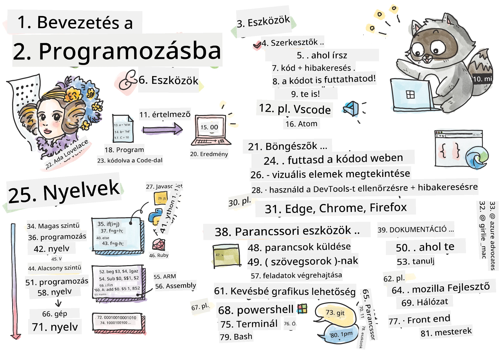
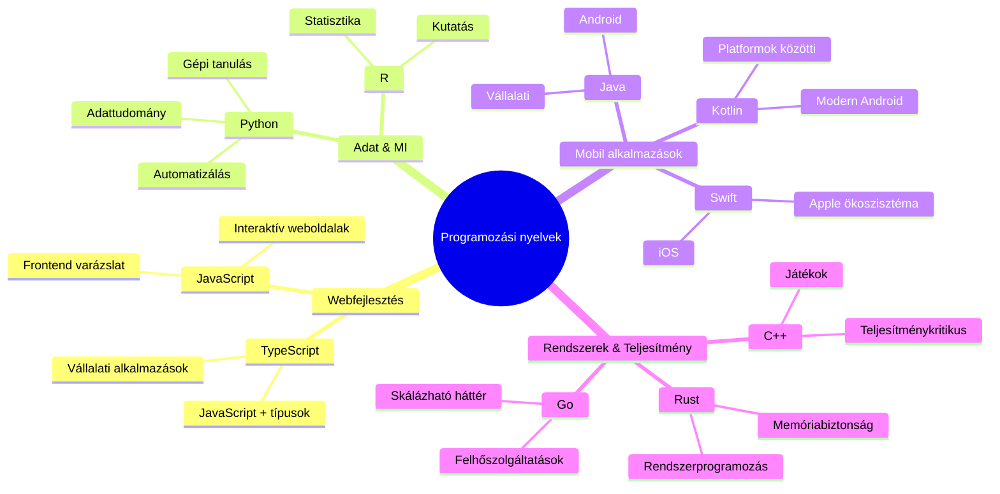
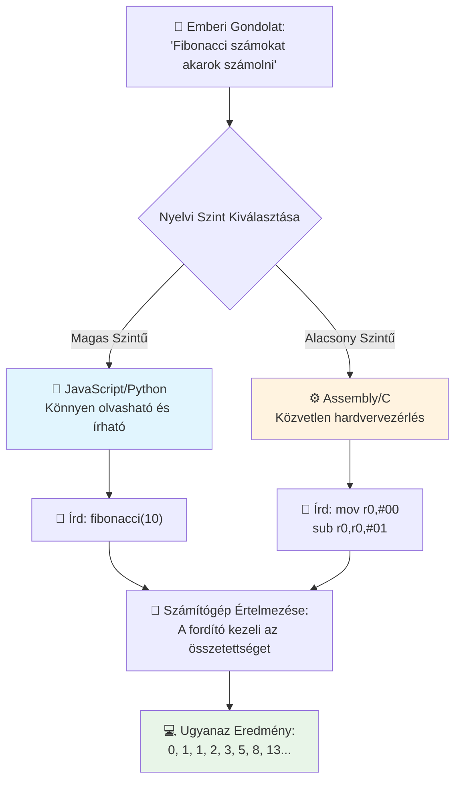
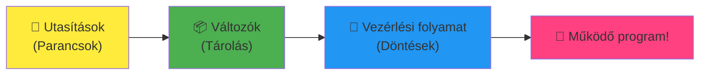
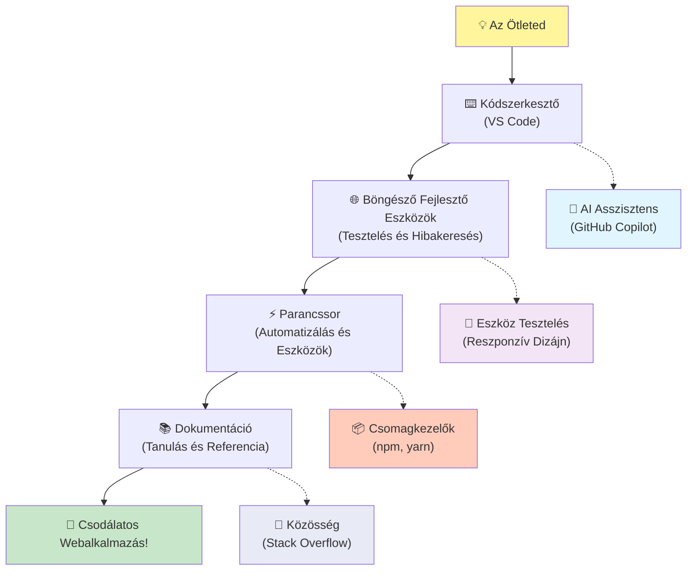
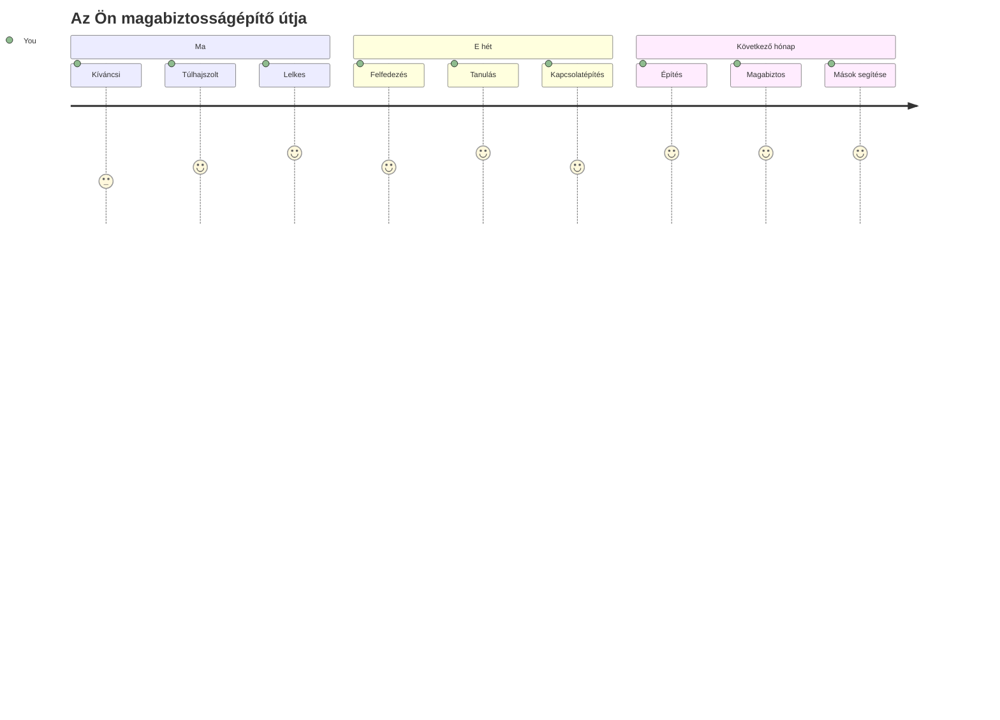

# Bevezetés a programozási nyelvekbe és a modern fejlesztőeszközökbe
 
Szia, jövőbeni fejlesztő! 👋 Mondhatok neked valamit, ami még mindig ráz nálam minden egyes nap? Éppen most fogod felfedezni, hogy a programozás nem csak a számítógépekről szól – hanem valódi szuperképességekről, amikkel életre keltheted a legvadabb ötleteidet!

Ismered azt a pillanatot, amikor a kedvenc alkalmazásodat használod, és minden egyszerűen tökéletesen működik? Amikor megnyomsz egy gombot, és történik valami teljesen varázslatos, amire csak annyit tudsz mondani: "hűha, ezt hogyan CSINÁLTÁK meg?" Nos, valaki pont olyan, mint te – valószínűleg a kedvenc kávézójában ül éjjel 2-kor, harmadik eszpresszóját kortyolgatva – írta azt a kódot, ami ezt a varázslatot létrehozta. És most jön az, ami el fog varázsolni: a lecke végére nemcsak azt fogod érteni, hogyan csinálták, de már alig várod, hogy te magad is kipróbáld!

Nézd, teljesen megértem, ha a programozás most még ijesztőnek tűnik. Amikor én kezdtem, azt hittem, hogy valamilyen matekgéniusz kell hozzá, vagy hogy már ötéves korod óta kódolsz. De van valami, ami teljesen megváltoztatta a szemléletemet: a programozás pontosan olyan, mint megtanulni beszélgetni egy új nyelven. Először csak a "szia" meg a "köszönöm" megy, aztán már kávét rendelsz, és mire észbe kapsz, már mély filozófiai beszélgetéseket folytatsz! Csak itt számítógépekkel beszélgetsz, és őszintén? Ők a legnyugodtabb beszélgetőpartnerek, akiket valaha is fogsz találni – sosem ítélkeznek a hibáidon, és mindig lelkesen próbálkozórak újra!

Ma meg fogjuk nézni azokat a hihetetlen eszközöket, amik a modern webfejlesztést nemcsak lehetővé teszik, hanem komolyan függőséget okoznak. Pont azokat az szerkesztőket, böngészőket és munkafolyamatokat fogom bemutatni, amiket a Netflix, Spotify és a kedvenc indie app stúdiód fejlesztői használnak minden nap. És itt jön az a rész, ami miatt táncra perdülsz: ezeknek a professzionális szintű, ipari szabványos eszközöknek a nagy része teljesen ingyenes!


> Sketchnote készítette: [Tomomi Imura](https://twitter.com/girlie_mac)


```mermaid
journey
    title A programozási utad ma
    section Felfedezés
      Mi a programozás: 5: You
      Programozási nyelvek: 4: You
      Eszközáttekintés: 5: You
    section Felfedezés
      Kódszerkesztők: 4: You
      Böngészők és Fejlesztői eszközök: 5: You
      Parancssor: 3: You
    section Gyakorlás
      Nyelvdetektív: 4: You
      Eszköz felfedezés: 5: You
      Közösségi kapcsolat: 5: You
```
## Nézzük, mit tudsz már!

Mielőtt belevágnánk a mókába, kíváncsi vagyok – mit tudsz már erről a programozós világról? És figyelj, ha éppen ezekre a kérdésekre azt gondolod, "ebből a témából semmit nem tudok," az nemcsak rendben van, hanem tökéletes! Ez azt jelenti, hogy pontosan jó helyen vagy. Gondolj erre a kvízre úgy, mint egy bemelegítésre az edzés előtt – csak bemelegítjük az agyizmokat!

[Vedd fel az előlecke kvízt](https://ff-quizzes.netlify.app/web/)


## Az a kaland, amibe most együtt vágtunk bele

Oké, őszintén annyira izgatott vagyok, hogy mit fogunk ma felfedezni! Komolyan, bárcsak láthatnám az arcodat, amikor néhány fogalom egyszer csak összeáll. Íme az az elképesztő utazás, amit együtt teszünk meg:

- **Mi is az a programozás valójában (és miért a legmenőbb dolog az egész világon!)** – Megtudjuk, hogyan a kód az a láthatatlan varázslat, ami mindent működtet körülötted, az ébresztőtől, ami valahogy tudja, hogy hétfő reggel van, a Netflix tökéletesen személyre szabott ajánló algoritmusáig
- **Programozási nyelvek és csodás személyiségeik** – Képzeld el, hogy belépsz egy buliba, ahol minden embernek teljesen más szuperképességei és problémamegoldó módszerei vannak. Pont ilyen a programozási nyelvek világa, és imádni fogod megismerni őket!
- **Az alapvető építőkockák, amik a digitális varázslatot létrehozzák** – Gondolj ezekre, mint a legjobb kreatív LEGO készletre. Ha megérted, hogyan illeszkednek össze ezek a darabok, rájössz majd, hogy szó szerint bármit felépíthetsz, amire csak a képzeleted képes
- **Professzionális eszközök, amikkel úgy fogod érezni, mintha egy varázspálcát kaptál volna a kezedbe** – Nem túlzok – ezek az eszközök tényleg szuperképességekkel ruháznak fel, és a legjobb hír? Pont ugyanazokat a profi eszközöket használják, amiket a nagyok!

> 💡 **Egy fontos dolog:** Ne is gondolj rá, hogy ma mindent megjegyezz! Most csak azt szeretném, hogy érezd meg azt az izgalmat, ami a lehetőségekhez kötődik. A részletek maguktól ragadnak rád, ahogy együtt gyakorolunk – így zajlik a valódi tanulás!

> Ezt a leckét elvégezheted a [Microsoft Learn-en](https://learn.microsoft.com/en-us/learn/modules/web-development-101/introduction-programming/?WT.mc_id=academic-77807-sagibbon)!

## Szóval, pontosan mi is a programozás?

Rendben, foglalkozzunk a millió dolláros kérdéssel: mi is az a programozás, igazából?

Mesélek egy történetet, ami teljesen megváltoztatta, ahogy erről gondolkodom. Múlt héten próbáltam elmagyarázni anyukámnak, hogyan használja az új okos TV távirányítónkat. Észrevettem, hogy olyanokat mondok, mint: "Nyomd meg a piros gombot, de nem a nagy pirosat, hanem a kicsi pirosat baloldalt... nem, a másik balod... oké, most tartsd lenyomva két másodpercig, nem egy majd három..." Ismerős? 😅

Ez a programozás! Az a művészet, amikor hihetetlenül részletes, lépésenkénti utasításokat adsz valaminek, ami nagyon erős, de mindent tökéletesen ki kell fejezned. Csakhogy nem anyukádnak magyarázol (aki megkérdezheti, "melyik piros gomb?!"), hanem egy számítógépnek, ami pontosan azt csinálja, amit mondasz – még ha az nem is pont az volt, amit gondoltál.

Amitől nekem először leesett az állam: a számítógépek valójában eléggé egyszerűek az alapjaikban. Csak két dolgot értenek meg – az 1-et és a 0-t, ami nagyjából "igen" és "nem" vagy "be" és "ki". Ennyi! De itt jön a varázslat – nem nekünk kell 1-esekkel és 0-kkal beszélni, mint a Mátrixban. Erre vannak a **programozási nyelvek**. Olyanok, mint a világ legjobb fordítója, aki az emberi gondolataidat átülteti a számítógép nyelvére.

És eztől még ma reggel is libabőrös leszek, amikor felébredek: szó szerint *minden* digitális dolog az életedben annak köszönhető, hogy valaki pont olyan volt, mint te, talán pizsamában, egy csésze kávé mellett gépelte a kódot a laptopján. Az az Instagram filter, ami hibátlannak mutat? Valaki kódolta. Az az ajánlás, ami elvezetett az új kedvenc dalodhoz? Egy fejlesztő írta azt az algoritmust. Az az alkalmazás, ami segít a vacsora számláját barátok között elosztani? Igen, valaki azt gondolta, "ez idegesítő, biztos meg tudom csinálni jobban," és aztán... meg is csinálta!

Amikor megtanulsz programozni, nemcsak egy új képességet szerezhetsz – beletartozol egy hihetetlen közösségbe, akik nap mint nap azon gondolkodnak: "Mi lenne, ha építenék valamit, ami egy kicsit jobbá teszi valaki napját?" Őszintén, van ennél menőbb dolog?

✅ **Szórakoztató ténykeresés**: Itt egy nagyon menő feladat, ha van egy szabad perced – szerinted ki volt a világ első számítógép programozója? Segítek: valószínűleg nem az, akire számítanál! A történet erről az emberről abszolút érdekes, és azt mutatja, hogy a programozás mindig is kreatív problémamegoldásról és új utak kereséséről szólt.

### 🧠 **Most egy kis visszacsatolás: Hogy érzed magad?**

**Szánj néhány pillanatot magadra:**
- Most már érted, mit jelent "utasításokat adni a számítógépeknek"?
- Tudsz gondolni egy napi feladatot, amit szeretnél automatizálni programozással?
- Milyen kérdések merülnek fel benned a programozással kapcsolatban?

> **Ne feledd:** Teljesen normális, ha néhány fogalom most még homályos. A programozás olyan, mint egy új nyelv tanulása – idő kell az agynak, hogy kialakítsa az idegpályákat. Nagyon ügyes vagy!

## A programozási nyelvek olyanok, mint a varázslat különböző ízei

Oké, ez furcsán fog hangzani, de maradj velem – a programozási nyelvek nagyon hasonlítanak a különböző zenei stílusokra. Gondolj csak bele: van a jazz, ami lágy és improvizatív; a rock, ami erőteljes és egyenes; a klasszikus, ami elegáns és szervezett; és a hip-hop, ami kreatív és kifejező. Mindegyiknek megvan a maga hangulata, közössége, és a saját alkalmaihoz, hangulataihoz tökéletes.

A programozási nyelvek pont ugyanígy működnek! Nem ugyanazt a nyelvet használnád egy mókás mobil játék megírásához, mint amilyennel hatalmas éghajlati adatokat dolgoznál fel, ahogy jóga órán sem játszanál death metalt (legalábbis a legtöbb jógán nem! 😄).

De amitől mindig leesik az állam, az az, hogy ezek a nyelvek olyanok, mintha a világ legpáciens, legzseniálisabb tolmácsa ülne melletted. Az ötleteidet úgy fejezheted ki, ahogy a te emberi agyadnak természetes, ők pedig elvégzik azt a nagyon összetett munkát, hogy lefordítsák azokat az 1-esekre és 0-kra, amit a számítógépek értenek. Olyan, mintha lenne egy barátod, aki tökéletesen beszéli mind az "emberi kreativitás," mind a "számítógép logikája" nyelvét – sosem fárad el, sosem kell kávészünet, és sosem bírál meg, ha kétszer is megkérdezed ugyanazt!

### Népszerű programozási nyelvek és felhasználási területeik


```mermaid
mindmap
  root((Programozási nyelvek))
    Webfejlesztés
      JavaScript
        Frontend varázslat
        Interaktív weboldalak
      TypeScript
        JavaScript + típusok
        Vállalati alkalmazások
    Adat & MI
      Python
        Adattudomány
        Gépi tanulás
        Automatizálás
      R
        Statisztika
        Kutatás
    Mobil alkalmazások
      Java
        Android
        Vállalati
      Swift
        iOS
        Apple ökoszisztéma
      Kotlin
        Modern Android
        Platformok közötti
    Rendszerek & Teljesítmény
      C++
        Játékok
        Teljesítménykritikus
      Rust
        Memóriabiztonság
        Rendszerprogramozás
      Go
        Felhőszolgáltatások
        Skálázható háttér
```
| Nyelv | Legjobb felhasználásra | Miért népszerű |
|----------|----------|------------------|
| **JavaScript** | Webfejlesztés, felhasználói felületek | Böngészőkben fut, interaktív weboldalakat hajt |
| **Python** | Adattudomány, automatizálás, mesterséges intelligencia | Könnyű olvasni és tanulni, erős könyvtárak |
| **Java** | Vállalati alkalmazások, Android alkalmazások | Platformfüggetlen, nagy rendszerekre robusztus |
| **C#** | Windows alkalmazások, játékkészítés | Erős Microsoft ökoszisztéma támogatás |
| **Go** | Felhőszolgáltatások, backend rendszerek | Gyors, egyszerű, modern számítástechnikához tervezett |

### Magas szintű és alacsony szintű nyelvek

Oké, ez volt az a fogalom, ami igazán összezavart, amikor először kezdtem tanulni, úgyhogy megosztom azt a hasonlatot, ami végül leesett nekem – és remélem, neked is segíteni fog!

Képzeld el, hogy egy olyan országba látogatsz, ahol nem beszéled a nyelvet, és halálosan szükséged van a legközelebbi vécére (mindannyian voltunk már így, ugye? 😅):

- **Alacsony szintű programozás** olyan, mintha annyira megtanulnád a helyi nyelvjárást, hogy már olyan szinten tudsz beszélni a sarki gyümölcsárussal, hogy kulturális utalásokat, helyi szlenget és olyan belső poénokat is értesz, amiket csak az, aki ott nőtt fel. Nagyon impresszív és szuper hatékony... ha folyékony vagy! De elég túlterhelő, ha csak WC-t keresel.

- **Magas szintű programozás** olyan, mintha lenne egy fantasztikus helyi barátod, aki azonnal ért téged. Azt mondod neki angolul: "Nagyon kellene találnom egy vécét," ő pedig elintézi a kulturális fordítást és olyan útbaigazítást ad, ami az idegen agyadnak tökéletesen értelmes.

Programozási értelemben:
- **Alacsony szintű nyelvek** (mint az Assembly vagy C) lehetővé teszik, hogy szuper részletes beszélgetést folytass a számítógép tényleges hardverével, de gép módjára kell gondolkodnod, ami… hát elég nagy agyi váltás!
- **Magas szintű nyelvek** (mint a JavaScript, Python vagy C#) azt engedik, hogy emberként gondolkozz, miközben ők intézik a gépi nyelvet a háttérben. Ráadásul van egy hihetetlenül barátságos közösségük, tele olyan emberekkel, akik emlékeznek, milyen újnak lenni, és tényleg segíteni akarnak!

Tippeld meg, melyiket fogom javasolni, hogy kezdj? 😉 A magas szintű nyelvek olyanok, mint a pótkerekek, amiket soha nem akarsz majd levenni, mert annyira élvezetessé teszik az egészet!


```mermaid
flowchart TB
    A["👤 Emberi Gondolat:<br/>'Fibonacci számokat akarok számolni'"] --> B{Nyelvi Szint Kiválasztása}
    
    B -->|Magas Szintű| C["🌟 JavaScript/Python<br/>Könnyen olvasható és írható"]
    B -->|Alacsony Szintű| D["⚙️ Assembly/C<br/>Közvetlen hardvervezérlés"]
    
    C --> E["📝 Írd: fibonacci(10)"]
    D --> F["📝 Írd: mov r0,#00<br/>sub r0,r0,#01"]
    
    E --> G["🤖 Számítógép Értelmezése:<br/>A fordító kezeli az összetettséget"]
    F --> G
    
    G --> H["💻 Ugyanaz Eredmény:<br/>0, 1, 1, 2, 3, 5, 8, 13..."]
    
    style C fill:#e1f5fe
    style D fill:#fff3e0
    style H fill:#e8f5e8
```
### Hadd mutassam meg, miért sokkal barátságosabbak a magas szintű nyelvek

Oké, mutatok valamit, ami tökéletesen megmutatja, miért is szerettem bele a magas szintű nyelvekbe, de előtte – meg kell ígérned valamit. Amikor meglátod az első kód példát, ne pánikolj! Szándékosan néz ki ijesztően. Pont ez a lényege!

Megnézünk egy ugyanazon feladatot két teljesen különböző stílusban megírva. Mindkettő létrehozza a Fibonacci sorozatot – ez egy gyönyörű matematikai mintázat, ahol minden szám az előző kettő összege: 0, 1, 1, 2, 3, 5, 8, 13... (Jó fej tény: ezt a mintát szó szerint mindenhol megtalálod a természetben – napraforgómag-spirálokban, toboz mintázatában, sőt, a galaxisok alakulásában is!)

Készen állsz, hogy lásd a különbséget? Gyerünk!

**Magas szintű nyelv (JavaScript) – Emberbarát:**

```javascript
// 1. lépés: Alapvető Fibonacci beállítás
const fibonacciCount = 10;
let current = 0;
let next = 1;

console.log('Fibonacci sequence:');
```

**Ezt a kódot csinálja:**
- **Deklarál** egy konstans értéket, hogy megmondja, hány Fibonacci számot akarunk generálni
- **Inicializál** két változót, hogy kövesse az aktuális és a következő számot a sorozatban
- **Beállítja** az induló értékeket (0 és 1), amik meghatározzák a Fibonacci mintázatot
- **Megjelenít** egy fejléc üzenetet az output azonosítására

```javascript
// 2. lépés: Generáljuk a sorozatot egy ciklussal
for (let i = 0; i < fibonacciCount; i++) {
  console.log(`Position ${i + 1}: ${current}`);
  
  // Számítsuk ki a sorozat következő számát
  const sum = current + next;
  current = next;
  next = sum;
}
```

**Részletezve, mi történik itt:**
- **Végigmegy** minden pozíción egy `for` ciklussal a sorozatban
- **Megjelenít** minden számot a helyével, sablon-literal formázással
- **Kiszámolja** a következő Fibonacci számot az aktuális és a következő érték összeadásával
- **Frissíti** a követő változókat, hogy továbblépjen a következő iterációra

```javascript
// 3. lépés: Modern funkcionális megközelítés
const generateFibonacci = (count) => {
  const sequence = [0, 1];
  
  for (let i = 2; i < count; i++) {
    sequence[i] = sequence[i - 1] + sequence[i - 2];
  }
  
  return sequence;
};

// Használati példa
const fibSequence = generateFibonacci(10);
console.log(fibSequence);
```

**Ebben a példában:**
- **Létrehoztunk** egy újrahasználható függvényt modern nyílfüggvény szintaxissal
- **Építettünk** egy tömböt, hogy eltároljuk a teljes sorozatot ahelyett, hogy egyesével jelenítenénk meg
- **Használtunk** tömbindexelést az egyes új számok számításához a korábbi értékekből
- **Visszaadtuk** a komplett sorozatot, hogy rugalmasan használhassuk a program más részein

**Alacsony szintű nyelv (ARM Assembly) – Számítógépbarát:**

```assembly
 area ascen,code,readonly
 entry
 code32
 adr r0,thumb+1
 bx r0
 code16
thumb
 mov r0,#00
 sub r0,r0,#01
 mov r1,#01
 mov r4,#10
 ldr r2,=0x40000000
back add r0,r1
 str r0,[r2]
 add r2,#04
 mov r3,r0
 mov r0,r1
 mov r1,r3
 sub r4,#01
 cmp r4,#00
 bne back
 end
```

Figyeld meg, hogy a JavaScript verzió majdnem úgy olvasható, mint egy angol utasítás, míg az Assembly verzió titokzatos parancsokat használ, amik közvetlenül irányítják a számítógép processzorát. Mindkettő ugyanazt a feladatot végzi el, de a magas szintű nyelv sokkal könnyebb az embereknek megérteni, írni és karbantartani.

**Fontos különbségek, amiket észreveszel majd:**
- **Olvashatóság**: A JavaScript leíró neveket használ, mint például `fibonacciCount`, míg az Assembly titkosított címkéket, mint `r0`, `r1`
- **Kommentárok**: A magas szintű nyelvek bátorítják a magyarázó kommentárokat, amelyek önmagukat dokumentáló kódot eredményeznek
- **Felépítés**: A JavaScript logikai folyamata megfelel annak, ahogyan az emberek lépésről lépésre gondolkodnak problémákról
- **Karbantartás**: A JavaScript-verzió frissítése különböző követelményekhez egyszerű és világos

✅ **A Fibonacci-sorról**: Ez a gyönyörű szám-minta (ahol minden szám megegyezik az előtte álló két szám összegével: 0, 1, 1, 2, 3, 5, 8...) szó szerint *mindenhol* előfordul a természetben! Megtalálod napraforgó spirálokban, toboz mintákban, a nautilusz csigaházak görbületében, és még a faágak növekedésében is. Elképesztő, hogy a matematika és a kód hogyan segít megérteni és újraalkotni azokat a mintákat, amelyeket a természet a szépség létrehozásához használ!


## Az Építőelemek, Amik A Csodát Elkészítik

Rendben, most, hogy láttad, hogyan néznek ki a programozási nyelvek működés közben, bontsuk le az alapvető részeket, amelyek szó szerint minden írott programban megtalálhatók. Gondolj ezekre úgy, mint a kedvenc recepted nélkülözhetetlen összetevőire – ha egyszer megérted, mit csinál mindegyik, tudni fogod, hogyan olvass és írj kódot szinte bármelyik nyelven!

Ez olyan, mintha megtanulnád a programozás nyelvtanát. Emlékszel, amikor iskolában tanultál főnevekről, igékről, és hogyan építsünk mondatokat? A programozásnak is megvan a maga nyelvtana, és őszintén szólva sokkal logikusabb és elnézőbb, mint az angol nyelvtan valaha volt! 😄

### Utasítások: A Lépésről lépésre szóló irányelvek

Kezdjük az **utasításokkal** – ezek olyanok, mint egy beszélgetésben az egyes mondatok a számítógépeddel. Minden utasítás egy konkrét dolgot mond meg a gépnek, olyan mintha irányokat adnál: "Fordulj balra itt", "Állj meg a piros lámpánál", "Parkolj le abban a helyben."

Azt szeretem az utasításokban, hogy általában mennyire olvashatóak. Nézd meg ezt:

```javascript
// Alapvető utasítások, amelyek egyetlen műveletet hajtanak végre
const userName = "Alex";                    
console.log("Hello, world!");              
const sum = 5 + 3;                         
```

**Ez a kód ezt teszi:**
- **Deklarál** egy konstans változót a felhasználó nevének tárolására
- **Megjelenít** egy üdvözlő üzenetet a konzol kimeneten
- **Kiszámolja** és elmenti egy matematikai művelet eredményét

```javascript
// Utasítások, amelyek weboldalakkal lépnek kapcsolatba
document.title = "My Awesome Website";      
document.body.style.backgroundColor = "lightblue";
```

**Lépésről lépésre történik:**
- **Módosítja** az oldal címét, amely megjelenik a böngésző fülén
- **Megváltoztatja** az egész oldal háttérszínét

### Változók: A Programod Memóriarendszere

Rendben, a **változók** őszintén az egyik kedvenc fogalmam tanítani, mert nagyon hasonlítanak arra, amit már nap mint nap használsz!

Gondolj egy pillanatra a telefonod névjegyzékére. Nem jegyzed meg mindenki telefonszámát – inkább elmented "Anya", "Legjobb Barát", vagy "Pizza Ház, ami 2-ig hoz házhoz" néven és hagyod, hogy a telefonod megjegyezze a konkrét számokat. A változók pontosan így működnek! Olyan címkézett tárolóhelyek, ahol a programod információkat tud tárolni és később visszahívni egy logikus név alapján.

Ami igazán menő: a változók változhatnak, miközben a program fut (innen a "változó" elnevezés – érted, hogy gondolták?). Ahogy te frissítheted a pizzahely elérhetőségét, ha találsz még jobb helyet, a változókat is frissítheted, miközben a program új információkat tanul meg vagy változnak a körülmények!

Nézd meg, milyen csodálatosan egyszerű ez:

```javascript
// 1. lépés: Alapvető változók létrehozása
const siteName = "Weather Dashboard";        
let currentWeather = "sunny";               
let temperature = 75;                       
let isRaining = false;                      
```

**Ezek megértése:**
- **Tárolj** állandó értékeket `const` változókban (például az oldal neve)
- **Használj** `let`-et értékekhez, amelyek változhatnak a program futása során
- **Rendelj** különböző adattípusokat: szövegek, számok és igaz/hamis értékek
- **Válassz** leíró neveket, amelyek elmagyarázzák, mit tartalmaz az adott változó

```javascript
// 2. lépés: Objektumokkal való munka az összetartozó adatok csoportosításához
const weatherData = {                       
  location: "San Francisco",
  humidity: 65,
  windSpeed: 12
};
```

**Ebben:**
- **Létrehoztunk** egy objektumot, hogy kapcsolódó időjárási adatokat csoportosítsunk
- **Rendeztünk** több adatot egy változónév alá
- **Használtunk** kulcs-érték párokat, hogy egyértelműen megjelöljük az adatokat

```javascript
// 3. lépés: Változók használata és frissítése
console.log(`${siteName}: Today is ${currentWeather} and ${temperature}°F`);
console.log(`Wind speed: ${weatherData.windSpeed} mph`);

// Változtatható változók frissítése
currentWeather = "cloudy";                  
temperature = 68;                          
```

**Értsük meg mindegyik részt:**
- **Jelenítsük meg** az adatokat `${}`-es sablon literálokkal
- **Érjük el** az objektum tulajdonságait pontozással (`weatherData.windSpeed`)
- **Frissítsük** `let`-tel deklarált változókat a változó feltételeknek megfelelően
- **Kombináljunk** több változót, hogy értelmes üzeneteket készítsünk

```javascript
// 4. lépés: Modern destrukturálás a tisztább kódért
const { location, humidity } = weatherData; 
console.log(`${location} humidity: ${humidity}%`);
```

**Amit tudnod kell:**
- **Vonj ki** adott tulajdonságokat az objektumokból destrukturálással
- **Hozz létre** új változókat ugyanazon nevekkel, mint az objektum kulcsai
- **Egyszerűsítsd** a kódot az ismétlődő pontozás elkerülésével

### Vezérlési Áramlás: Tanítsd Gondolkodni a Programodat

Na, itt válik a programozás igazán elképesztővé! A **vezérlési áramlás** tulajdonképpen azt jelenti, hogy megtanítod a programod okosan dönteni, pont úgy, ahogy te is csinálod ezt minden nap anélkül, hogy gondolkodnál rajta.

Képzeld el: ma reggel valószínűleg azt mondtad magadban, hogy "Ha esik, akkor esernyőt viszek. Ha hideg van, kabátot veszek fel. Ha késésben vagyok, kihagyom a reggelit és útközben veszek kávét." Az agyad természetesen követi ezt az ha-akkor logikát naponta akár többször is!

Ez az, ami a programokat intelligensse és élővé teszi, nem csak egyszerű, unalmas, előre meghatározott parancsokat követnek. Tudnak nézni egy helyzetet, értékelni, mi történik, és megfelelően reagálni. Olyan, mintha adnál a programodnak egy agyat, amely alkalmazkodik és döntéseket hoz!

Látni akarod, milyen szépen működik? Mutatom:

```javascript
// 1. lépés: Alapvető feltételes logika
const userAge = 17;

if (userAge >= 18) {
  console.log("You can vote!");
} else {
  const yearsToWait = 18 - userAge;
  console.log(`You'll be able to vote in ${yearsToWait} year(s).`);
}
```

**Ez a kód ezt csinálja:**
- **Ellenőrzi**, hogy a felhasználó életkora eléri-e a szavazáshoz szükséges minimumot
- **Futtat** különböző kódrészleteket az eredménytől függően
- **Kiszámolja** és megjeleníti, mennyi idő van még a szavazásra jogosultságig, ha kevesebb mint 18
- **Ad** specifikus, hasznos visszajelzést minden szcenárióra

```javascript
// 2. lépés: Több feltétel logikai operátorokkal
const userAge = 17;
const hasPermission = true;

if (userAge >= 18 && hasPermission) {
  console.log("Access granted: You can enter the venue.");
} else if (userAge >= 16) {
  console.log("You need parent permission to enter.");
} else {
  console.log("Sorry, you must be at least 16 years old.");
}
```

**Itt történik:**
- **Összekapcsol** több feltételt a `&&` (és) operátorral
- **Létrehoz** feltétel-hierarchiát `else if` használatával több lehetőséghez
- **Kezeled** az összes esetet egy végső `else` utasítással
- **Biztosít** világos, cselekvő visszajelzést a különböző helyzetekhez

```javascript
// 3. lépés: Tömör feltételes szerkezet a ternáris operátorral
const votingStatus = userAge >= 18 ? "Can vote" : "Cannot vote yet";
console.log(`Status: ${votingStatus}`);
```

**Ezt tartsd észben:**
- **Használj** ternáris operátort (`? :`) egyszerű két feltételes esetekhez
- **Írd** először a feltételt, aztán `?`, az igaz értéket, majd `:`, aztán a hamis értéket
- **Használd** ezt a mintát értékek hozzárendeléséhez feltételek alapján

```javascript
// 4. lépés: Több konkrét eset kezelése
const dayOfWeek = "Tuesday";

switch (dayOfWeek) {
  case "Monday":
  case "Tuesday":
  case "Wednesday":
  case "Thursday":
  case "Friday":
    console.log("It's a weekday - time to work!");
    break;
  case "Saturday":
  case "Sunday":
    console.log("It's the weekend - time to relax!");
    break;
  default:
    console.log("Invalid day of the week");
}
```

**Ez a kód a következőket teszi:**
- **Összeveti** a változó értékét több konkrét esettel
- **Csoportosít** hasonló eseteket (hétköznapok vs. hétvégék)
- **Futtatja** a megfelelő kódrészletet, ha egyezés van
- **Tartalmaz** egy `default` esetet váratlan értékekhez
- **Használ** `break` utasításokat, hogy elkerülje a következő eset futását

> 💡 **Valós példa**: Gondolj a vezérlési áramlásra úgy, mint a világ legtürelmesebb GPS-ére, ami irányokat ad. Lehet, hogy azt mondja: "Ha a Fő utcán dugó van, menj az autópályán. Ha az autópályát útépítés zavarja, próbáld a panorámás útvonalat." A programok pontosan ezt a fajta feltételes logikát használják, hogy intelligensen reagáljanak a különböző helyzetekre, és mindig a legjobb élményt adják a felhasználóknak.

### 🎯 **Fogalmi Ellenőrzés: Az Építőelemek Elsajátítása**

**Nézzük, hogy állsz az alapokkal:**
- Ki tudod fejteni saját szavaiddal, mi a különbség a változó és az utasítás között?
- Gondolj egy valós helyzetre, ahol ha-akkor döntést használnál (mint a szavazás példa)
- Mi az egy dolog a programozási logikában, ami meglepett téged?

**Gyors önbizalom-növelő:**

```mermaid
flowchart LR
    A["📝 Utasítások<br/>(Parancsok)"] --> B["📦 Változók<br/>(Tárolás)"] --> C["🔀 Vezérlési folyamat<br/>(Döntések)"] --> D["🎉 Működő program!"]
    
    style A fill:#ffeb3b
    style B fill:#4caf50
    style C fill:#2196f3
    style D fill:#ff4081
```
✅ **Mi jön ezután**: Elképesztően jól fogjuk érezni magunkat, ahogy egyre mélyebbre ássuk magunkat ezekbe a fogalmakba! Most csak arra összpontosíts, hogy érezd azt az izgalmat a fantasztikus lehetőségek fölött, amik előtted állnak. A konkrét képességek és technikák természetesen rögzülnek majd, ahogy együtt gyakorolunk – ígérem, ez sokkal szórakoztatóbb lesz, mint gondolnád!

## A Szakma Eszközei

Rendben, erre tényleg annyira izgatott vagyok, hogy alig bírom magamban tartani! 🚀 Most arról fogunk beszélni, milyen elképesztő eszközök miatt fogod úgy érezni, mintha most adnák át neked egy digitális űrhajó kulcsait.

Tudod, ahogy egy szakácsnak megvannak a tökéletes, kiegyensúlyozott kései, amelyek olyanok, mintha a kezei meghosszabbításai lennének? Vagy ahogy a zenésznek van az a bizonyos gitárja, ami mintha már a megérintése pillanatában énekelne? Nos, a fejlesztőknek is megvannak a maga varázseszközei, és most jön az, ami teljesen meg fogja döbbenteni a képzeleted – a legtöbb teljesen ingyenes!

Majd ugrálok a székemben, hogy megoszthassam veled ezeket, mert teljesen forradalmasították, hogyan építünk szoftvert. Beszélünk AI-alapú kódíró segítőkről, amelyek segítenek megírni a kódodat (nem viccelek!), felhőalapú környezetekről, ahol akárhonnan, Wi-Fi-vel egész alkalmazásokat fejleszthetsz, és hibajavító eszközökről, amelyek olyan kifinomultak, mintha röntgenlátásuk lenne a programjaidhoz.

És itt jön az a rész, ami még most is libabőrös lesz tőle: ezek nem “kezdő eszközök”, amiket kinősz. Ezek azok a profi szintű eszközök, amelyeket a Google, Netflix fejlesztői és az a független app-stúdió használ, amit imádsz, pont most ebben a pillanatban. Profi leszel, ahogy használod őket!


```mermaid
graph TD
    A["💡 Az Ötleted"] --> B["⌨️ Kódszerkesztő<br/>(VS Code)"] 
    B --> C["🌐 Böngésző Fejlesztő Eszközök<br/>(Tesztelés és Hibakeresés)"]
    C --> D["⚡ Parancssor<br/>(Automatizálás és Eszközök)"]
    D --> E["📚 Dokumentáció<br/>(Tanulás és Referencia)"]
    E --> F["🚀 Csodálatos Webalkalmazás!"]
    
    B -.-> G["🤖 AI Asszisztens<br/>(GitHub Copilot)"]
    C -.-> H["📱 Eszköz Tesztelés<br/>(Reszponzív Dizájn)"]
    D -.-> I["📦 Csomagkezelők<br/>(npm, yarn)"]
    E -.-> J["👥 Közösség<br/>(Stack Overflow)"]
    
    style A fill:#fff59d
    style F fill:#c8e6c9
    style G fill:#e1f5fe
    style H fill:#f3e5f5
    style I fill:#ffccbc
    style J fill:#e8eaf6
```
### Kódszerkesztők és IDE-k: Az Új Digitális Legjobb Barátaid

Beszéljünk a kódszerkesztőkről – ezek a helyek viszonylag hamar a kedvenceid közé fognak tartozni! Gondolj rájuk úgy, mint a személyes kódolási szentélyedre, ahol a legtöbb időt töltöd majd alkotással és finomítással.

De ami igazán varázslatos a modern szerkesztőkben: nem csak csilivili szövegszerkesztők. Olyanok, mintha mondjuk a legbrilliánsabb, segítőkész tanácsadód ülne melletted 0–24-ben. Elcsípik az elgépeléseket, még mielőtt észrevennéd őket, jobbító javaslatokat tesznek, amelyektől zseni leszel, segítenek megérteni a kód minden részét, és némelyikük még azt is meg tudja saccolni, mit akarsz írni, és felajánlja, hogy befejezi a gondolatodat!

Emlékszem, amikor először fedeztem fel az automatikus kiegészítést – szó szerint úgy éreztem, mintha a jövőben élnék. Elkezded gépelni, és a szerkesztőd azt mondja: "Hé, ezt a funkciót akartad? Pont ezt csinálja, amire szükséged van." Olyan, mintha lételemes gondolatolvasó kukucskálna a kódpartnered mögül!

**Mi teszi ezeket a szerkesztőket annyira kiválóvá?**

A modern kódszerkesztők lenyűgöző funkciók sokaságát kínálják, hogy növeljék a termelékenységed:

| Funkció | Mit csinál | Miért hasznos |
|---------|------------|---------------|
| **Szintaxis kiemelés** | Különböző részeit színezi a kódnak | Könnyebb olvasni és hibát találni |
| **Automatikus kiegészítés** | Közbeni kódjavaslatokat ad | Gyorsítja a gépelést és csökkenti az elírásokat |
| **Hibakereső eszközök** | Segít hibákat találni és javítani | Órákat spórol a hibakeresésben |
| **Bővítmények** | Különleges funkciókat ad hozzá | Testre szabhatod a szerkesztőt bármilyen technológiához |
| **AI segítők** | Kódot és magyarázatokat javasol | Gyorsítja a tanulást és a munkát |

> 🎥 **Videó forrás**: Szeretnéd látni ezeket működés közben? Nézd meg ezt a [Tools of the Trade videót](https://youtube.com/watch?v=69WJeXGBdxg) átfogó bemutatóért.

#### Ajánlott szerkesztők webfejlesztéshez

**[Visual Studio Code](https://code.visualstudio.com/?WT.mc_id=academic-77807-sagibbon)** (Ingyenes)
- Legnépszerűbb a webfejlesztők között
- Kiváló bővítmény-rendszer
- Beépített terminál és Git integráció
- **Kötelező bővítmények**:
  - [GitHub Copilot](https://marketplace.visualstudio.com/items?itemName=GitHub.copilot) – AI-alapú kódjavaslatok
  - [Live Share](https://marketplace.visualstudio.com/items?itemName=MS-vsliveshare.vsliveshare) – Valós idejű együttműködés
  - [Prettier](https://marketplace.visualstudio.com/items?itemName=esbenp.prettier-vscode) – Automatikus kódformázás
  - [Code Spell Checker](https://marketplace.visualstudio.com/items?itemName=streetsidesoftware.code-spell-checker) – Kódhibák elkapása

**[JetBrains WebStorm](https://www.jetbrains.com/webstorm/)** (Fizetős, diákoknak ingyenes)
- Fejlett hibakeresés és tesztelési eszközök
- Intelligens kód-kiegészítés
- Beépített verziókezelés

**Felhőalapú IDE-k** (Különböző árak)
- [GitHub Codespaces](https://github.com/features/codespaces) – Teljes VS Code a böngésződben
- [Replit](https://replit.com/) – Nagyszerű tanuláshoz és kódmegosztáshoz
- [StackBlitz](https://stackblitz.com/) – Azonnali, full-stack webfejlesztés

> 💡 **Kezdési tipp**: Kezdd a Visual Studio Code-dal – ingyenes, ipari szinten széles körben használt, és hatalmas közösség támogatja oktatóanyagokkal és bővítményekkel.


### Webböngészők: A Titkos Fejlesztői Laboratóriumod

Rendben, készülj fel, hogy teljesen eldobod az agyad! Tudod, hogyan böngésztél közösségi médiát és néztél videókat böngészőkkel? Nos, kiderült, hogy egész idő alatt rejtegettek egy hihetetlen titkos fejlesztői laboratóriumot, amit csak rád vár, hogy felfedezd!

Minden egyes alkalommal, amikor jobb klikkel kattintasz egy weboldalon és kiválasztod az „Elem vizsgálata” lehetőséget, egy rejtett fejlesztői eszköztár világát nyitod meg, amely őszintén szólva erősebb, mint egyes drága szoftverek, amikért korábban százakat fizettem. Olyan ez, mintha felfedeznéd, hogy a szokásos konyhád mögött egy profi szakács laboratóriuma van egy titkos ajtó mögött!
Amikor először megmutatták nekem a böngésző DevTools-t, úgy három órán át csak kattintgattam és azt mondogattam: "VÁRJ, EZT IS TUDJA?!" Gyakorlatilag valós időben szerkeszthetsz bármilyen weboldalt, pontosan látod, mennyire gyorsan töltődik be minden, tesztelheted, hogyan néz ki az oldalad különböző eszközökön, és még a JavaScript hibáit is profi módon debugolhatod. Egészen elképesztő!

**Ezért titkos fegyvered a böngésző:**

Amikor weboldalt vagy webalkalmazást készítesz, látnod kell, hogyan néz ki és viselkedik a valóságban. A böngészők nem csak megjelenítik a munkádat, hanem részletes visszajelzést adnak a teljesítményről, hozzáférhetőségről és esetleges problémákról.

#### Böngésző fejlesztői eszközök (DevTools)

A modern böngészők átfogó fejlesztői csomagokat tartalmaznak:

| Eszközkategória | Mire jó? | Példa felhasználás |
|-----------------|----------|--------------------|
| **Elemellenőrző** | HTML/CSS valós idejű megtekintése és szerkesztése | Stílusok módosítása azonnali eredményért |
| **Konzol** | Hibák megtekintése és JavaScript tesztelése | Hibakeresés és kód kísérletezés |
| **Hálózati megfigyelő** | Források betöltésének nyomon követése | Teljesítmény és betöltési idők optimalizálása |
| **Akadálymentességi ellenőrző** | Befogadó dizájn tesztelése | Biztosítani, hogy az oldal minden felhasználó számára elérhető legyen |
| **Eszközszimulátor** | Előnézet különböző képernyőméreteken | Reszponzív dizájn tesztelése eszközök nélkül |

#### Fejlesztéshez ajánlott böngészők

- **[Chrome](https://developers.google.com/web/tools/chrome-devtools/)** – Iparági szabvány DevTools sok dokumentációval
- **[Firefox](https://developer.mozilla.org/docs/Tools)** – Kiváló CSS Grid és akadálymentességi eszközök
- **[Edge](https://docs.microsoft.com/microsoft-edge/devtools-guide-chromium/?WT.mc_id=academic-77807-sagibbon)** – Chromium alapú Microsoft fejlesztői erőforrásokkal

> ⚠️ **Fontos tesztelési tipp**: Mindig teszteld a weboldalaidat több böngészőben! Ami Chrome-ban tökéletesen működik, az Safari-ban vagy Firefox-ban másként nézhet ki. A profi fejlesztők az összes jelentős böngészőt ellenőrzik, hogy egységes felhasználói élményt biztosítsanak.

### Parancssori eszközök: A fejlesztői szupererőd kapuja

Rendben, legyen most egy teljesen őszinte pillanat a parancssorról, mert szeretném, ha tényleg úgy hallanád ezt valakitől, aki igazán érti. Amikor először láttam – csak egy ijesztő fekete képernyő villogó szöveggel – szó szerint azt gondoltam: „Nem, ez semmiképp sem! Ez olyan, mint egy 1980-as évekbeli hacker film jelenete, és én biztosan nem elég okos ehhez!” 😅

De mit kívánom, hogy akkor valaki megmondta volna nekem, és most neked mondom: a parancssor nem ijesztő – valójában olyan, mintha közvetlenül beszélnél a számítógépeddel. Gondolj rá úgy, mint a különbségre a menő képekkel és menükkel rendelkező rendelős app és a kedvenc helyi éttermed között, ahol a szakács pontosan tudja, mit szeretsz, és csak annyit mondasz, hogy „lepj meg valamivel” – és tökéletes fogást készít.

A parancssor az a hely, ahol a fejlesztők varázslónak érezhetik magukat. Beírsz néhány látszólag varázslatos szót (rendben, csak parancsok, de tényleg varázslatosnak tűnnek!), megnyomod az entert, és PÁM – létrehoztál teljes projektstruktúrákat, telepítettél erős eszközöket a világ minden tájáról, vagy épp bolygóra küldtél egy alkalmazást több millió embernek. Ha egyszer megkóstolod azt az erőt, őszintén rettentő addiktív!

**Miért lesz a parancssor a kedvenc eszközöd:**

Bár a grafikus felületek sok feladathoz nagyszerűek, a parancssor a legtöbb automatizálásban, precizitásban és sebességben jeleskedik. Számos fejlesztői eszköz elsősorban parancssori felületen keresztül működik, és ezek hatékony használatának elsajátítása drasztikusan növeli a termelékenységedet.

```bash
# 1. lépés: Hozzon létre egy projekt könyvtárat és lépjen be oda
mkdir my-awesome-website
cd my-awesome-website
```

**Ez a kód az alábbiakat csinálja:**
- **Létrehoz** egy új mappát "my-awesome-website" néven a projekted számára
- **Belép** az újonnan létrehozott mappába, hogy elkezdhess dolgozni

```bash
# 2. lépés: Projekt inicializálása package.json fájllal
npm init -y

# Modern fejlesztőeszközök telepítése
npm install --save-dev vite prettier eslint
npm install --save-dev @eslint/js
```

**Lépésről lépésre, ami történik:**
- **Inicializál** egy új Node.js projektet alapértelmezett beállításokkal az `npm init -y` használatával
- **Telepíti** a Vite-ot, mint modern build eszközt gyors fejlesztéshez és gyártásra
- **Hozzáadja** a Prettier-t automatikus kódformázáshoz, valamint az ESLint-et a kódminőség ellenőrzéséhez
- **Használja** a `--save-dev` zászlót, hogy ezek csak fejlesztési függőségek legyenek

```bash
# 3. lépés: Projekt struktúra és fájlok létrehozása
mkdir src assets
echo '<!DOCTYPE html><html><head><title>My Site</title></head><body><h1>Hello World</h1></body></html>' > index.html

# Fejlesztői szerver indítása
npx vite
```

**A fentiekben:**
- **Rendszerezte** a projektet külön forráskód és asset mappák létrehozásával
- **Generált** egy alap HTML fájlt a megfelelő dokumentumszerkezettel
- **Elindította** a Vite fejlesztői szervert élő újratöltéssel és hot module replacement-tel

#### Alapvető parancssori eszközök webfejlesztéshez

| Eszköz | Cél | Miért van rá szükséged? |
|--------|-----|-------------------------|
| **[Git](https://git-scm.com/)** | Verziókezelés | Kövesd a változásokat, dolgozz együtt másokkal, készíts biztonsági mentést |
| **[Node.js & npm](https://nodejs.org/)** | JavaScript futtatókörnyezet és csomagkezelő | Futtass JavaScript-et böngészőn kívül, telepíts modern fejlesztői eszközöket |
| **[Vite](https://vitejs.dev/)** | Build-eszköz és fejlesztői szerver | Villámgyors fejlesztés hot module replacement-tel |
| **[ESLint](https://eslint.org/)** | Kódminőség | Automatikusan megtalálja és javítja a problémákat JavaScript-ben |
| **[Prettier](https://prettier.io/)** | Kódformázás | Egységes és olvasható kódot tart fent |

#### Platform-specifikus opciók

**Windows:**
- **[Windows Terminal](https://docs.microsoft.com/windows/terminal/?WT.mc_id=academic-77807-sagibbon)** – modern, funkciógazdag terminál
- **[PowerShell](https://docs.microsoft.com/powershell/?WT.mc_id=academic-77807-sagibbon)** 💻 – erős szkriptnyelvi környezet
- **[Parancssor](https://learn.microsoft.com/windows-server/administration/windows-commands/windows-commands)** 💻 – hagyományos Windows parancssor

**macOS:**
- **[Terminal](https://support.apple.com/guide/terminal/)** 💻 – beépített terminálalkalmazás
- **[iTerm2](https://iterm2.com/)** – fejlett funkciókkal rendelkező terminál

**Linux:**
- **[Bash](https://www.gnu.org/software/bash/)** 💻 – a szabványos Linux shell
- **[KDE Konsole](https://docs.kde.org/trunk5/en/konsole/konsole/index.html)** – fejlett terminálemulátor

> 💻 = az operációs rendszer előre telepítve tartalmazza

> 🎯 **Tanulási útvonal**: Kezdd az alap parancsokkal, mint a `cd` (könyvtár váltás), `ls` vagy `dir` (fájlok listázása), és a `mkdir` (mappa létrehozás). Gyakorold a modern munkafolyamat parancsokat, mint az `npm install`, `git status`, és a `code .` (megnyitja az aktuális mappát VS Code-ban). Ahogy kényelmesebbé válsz, magától jönnek a haladóbb parancsok és automatizálási technikák.

### Dokumentáció: Az állandóan elérhető tanuló mentorod

Rendben, elárulok egy kis titkot, ami sokkal jobban fogja érezni magát kezdőként: még a legtapasztaltabb fejlesztők is rengeteg időt töltenek dokumentáció olvasásával. És ez nem azért van, mert nem tudják, mit csinálnak – ez igazából a bölcsesség jele!

Gondolj a dokumentációra úgy, mint a világ leggyakorlatiasabb, leggondosabb tanáraira, akik 0-24-ben elérhetők. Bajba kerülsz éjjel 2-kor? A dokumentáció ott van egy meleg virtuális öleléssel és pontosan azzal a válasszal, amire szükséged van. Meg akarsz tanulni egy szuper új funkciót, amiről mindenki beszél? A dokumentáció lépésről lépésre példákkal segít. Meg akarod érteni, miért működik valami úgy, ahogy? Találtál, a dokumentáció elmagyarázza, hogy végre megértsd!

Egy dolog, ami teljesen megváltoztatta a nézőpontomat: a webfejlesztés hihetetlenül gyorsan változik, és senki (de szó szerint senki!) nem tart minden tudást fejben. Láttam 15+ éves tapasztalattal rendelkező szeniort fejlesztőt, hogy alap szintaxist nézzen meg, és tudod mi? Ez nem ciki – ez okos! Nem arról szól, hogy tökéletes memória legyen, hanem hogy tudd, honnan találj gyorsan megbízható válaszokat, és értsd, hogyan alkalmazd azokat.

**Itt történik az igazi varázslat:**

A profi fejlesztők a munkaidejük jelentős részét dokumentáció olvasásával töltik – nem azért, mert nem tudják, mit csinálnak, hanem mert a webfejlesztői környezet olyan gyorsan fejlődik, hogy az aktuális tudás folyamatos tanulást igényel. A nagyszerű dokumentáció nem csak azt segíti megérteni, *hogyan* használd a dolgokat, hanem azt is, *miért* és *mikor*.

#### Alapvető dokumentációs források

**[Mozilla Developer Network (MDN)](https://developer.mozilla.org/docs/Web)**
- Az aranyszabvány webtechnológiai dokumentációban
- Átfogó útmutatók HTML, CSS és JavaScript-hez
- Tartalmaz böngészőkompatibilitási információkat
- Gyakorlati példákat és interaktív demókat kínál

**[Web.dev](https://web.dev)** (Google)
- Modern webfejlesztési best practice-ek
- Teljesítményoptimalizálási útmutatók
- Akadálymentességi és befogadó dizájn elvek
- Valós projekt alapú esettanulmányok

**[Microsoft Developer Documentation](https://docs.microsoft.com/microsoft-edge/#microsoft-edge-for-developers)**
- Edge böngésző fejlesztési források
- Progresszív webalkalmazás útmutatók
- Keresztplatformos fejlesztési betekintések

**[Frontend Masters Learning Paths](https://frontendmasters.com/learn/)**
- Strukturált tanulási tantervek
- Videós kurzusok iparági szakértőktől
- Gyakorlati kódolási feladatok

> 📚 **Tanulási stratégia**: Ne próbáld meg memorizálni a dokumentációt – inkább tanulj meg hatékonyan navigálni benne. Könyvjelzőzd a gyakran használt hivatkozásokat és gyakorold a keresőfunkciókat, hogy gyorsan megtaláld az adott információt.

### 🔧 **Eszközismereti ellenőrzés: Mi az, ami hozzád szól?**

**Gondolkodj el rajta egy pillanatra:**
- Melyik eszközt próbálnád ki először? (Nincs rossz válasz!)
- Mennyire érzed még mindig ijesztőnek a parancssort, vagy inkább kíváncsi vagy rá?
- El tudod képzelni, hogy böngésző DevTools-szal kukkants bele a kedvenc weboldalaid mögé?


```mermaid
pie title "Fejlesztői idő az eszközökkel"
    "Kódszerkesztő" : 40
    "Böngésző tesztelés" : 25
    "Parancssor" : 15
    "Dokumentáció olvasása" : 15
    "Hibakeresés" : 5
```
> **Érdekes tény**: A legtöbb fejlesztő körülbelül 40%-ot tölt a kódszerkesztőjében, de látod, mennyi idő megy tesztelésre, tanulásra és problémamegoldásra. A programozás nem csak kódírás – élmények megalkotásáról szól!

✅ **Elmélkedésre**: Gondolkodj el rajta – szerinted hogyan különböznek egymástól a weboldalak készítésére szolgáló eszközök (fejlesztés) és a kinézetük megtervezésére szolgáló eszközök (design)? Olyan, mint a különbség az építész, aki megtervezi a gyönyörű házat, és a kivitelező között, aki ténylegesen felépíti. Mindkettő nélkülözhetetlen, de más szerszámosládát igényel! Ez a fajta gondolkodás segít meglátni a nagyobb képet, hogyan kelnek életre a weboldalak.

## GitHub Copilot Agent kihívás 🚀

Használd az Agent módot az alábbi kihívás megoldásához:

**Leírás:** Fedezd fel egy modern kódszerkesztő vagy IDE funkcióit, és mutasd be, hogyan javítja a munkafolyamatodat webfejlesztőként.

**Feladat:** Válassz egy kódszerkesztőt vagy IDE-t (például Visual Studio Code, WebStorm vagy felhőalapú IDE). Sorolj fel három olyan funkciót vagy bővítményt, amelyek segítenek hatékonyabban írni, hibakeresni vagy karbantartani a kódot. Mindenből adj egy rövid magyarázatot, hogyan szolgálja a munkafolyamatodat.

---

## 🚀 Kihívás

**Na, nyomozó, készen állsz az első ügyedre?**

Most, hogy megvan ez a fantasztikus alapod, van egy kalandom, ami megmutatja, milyen hihetetlenül sokszínű és lenyűgöző a programozás világa valójában. És figyelj – ez még nem a kódírásról szól, szóval nyugi! Gondolj magadra úgy, mint egy programozási nyelv detektívre az első izgalmas ügyeden!

**A missziód, ha elfogadod:**
1. **Legyél nyelvfelfedező:** Válassz három programozási nyelvet teljesen különböző területekről – talán egyet, amely weboldalakat épít, egyet, ami mobilalkalmazásokat készít, és egyet, ami tudósoknak ad adatfeldolgozó erőt. Keress példákat ugyanarra az egyszerű feladatra mindhárom nyelven. Megfogadom, teljesen elkápráztat majd, mennyire eltérhetnek, miközben ugyanazt csinálják!

2. **Derítsd fel a származástörténetüket:** Mi teszi különlegessé mindegyik nyelvet? Itt egy menő tény: minden programozási nyelvet azért találtak ki, mert valaki azt gondolta, „Tudod mit? Van jobb módja ennek a konkrét problémának a megoldására.” Meg tudod találni, mik voltak ezek a problémák? Néhány történet igazán lenyűgöző!

3. **Ismerd meg a közösségüket:** Nézd meg, mennyire barátságosak és lelkesek az adott nyelv közösségei. Van, amelyiknek több millió fejlesztője osztja meg tudását és segíti egymást, mások kisebbek, de rendkívül összetartóak és támogatóak. Imádni fogod látni a közösségek különböző személyiségeit!

4. **Kövess a megérzéseidet:** Melyik nyelv tűnik számodra jelenleg a legközelebb állónak? Ne stresszelj a „tökéletes” választáson – csak hallgass a megérzéseidre! Tényleg nincs rossz válasz, és később mindig kísérletezhetsz másokkal.

**Bónusz nyomozómunka:** Nézd meg, milyen nagy weboldalak vagy alkalmazások készültek ezekkel a nyelvekkel. Fogadok, meg fogsz lepődni, hogy mi hajtja az Instagramot, a Netflixet vagy azt a mobiljátékot, amin folyton játszol!

> 💡 **Ne feledd:** Nem kell ma mindegyik nyelv szakértőjévé válnod. Csak ismerd meg a környéket, mielőtt eldöntöd, hol akarsz letelepedni. Szánj rá időt, élvezd, és engedd, hogy a kíváncsiság vezessen!

## Ünnepeljük, amit felfedeztél!

Hűha, ma rengeteg hihetetlen információt szívtál magadba! Őszintén izgatott vagyok, hogy megnézzem, mennyi maradt meg ebből a fantasztikus utazásból. És ne feledd – ez nem egy teszt, hogy mindent tökéletesen tudj. Ez inkább az ünneplése annak, mennyi mindent tanultál meg erről a lenyűgöző világról, amibe most fogsz belemerülni!

[Oldd meg az utólagos leckekvízt](https://ff-quizzes.netlify.app/web/)

## Áttekintés és önálló tanulás

**Szánj rá időt, fedezd fel és élvezd!**
Ma rengeteget haladtál, és erre büszke lehetsz! Most jön a móka – fedezd fel azokat a témákat, amelyek felkeltették a kíváncsiságodat. Ne feledd, ez nem házi feladat – ez egy kaland!

**Mélyedj el abban, ami lelkesít:**

**Próbáld ki a programozási nyelveket:**
- Látogass el 2-3 olyan nyelv hivatalos weboldalára, amelyek felkeltették az érdeklődésedet. Mindegyiknek megvan a maga személyisége és története!
- Próbálj ki néhány online kódoló játszóteret, mint például a [CodePen](https://codepen.io/), [JSFiddle](https://jsfiddle.net/) vagy a [Replit](https://replit.com/). Ne félj kísérletezni – nem tudsz elrontani semmit!
- Olvass arról, hogyan jött létre a kedvenc nyelved. Komolyan, néhány eredettörténet lenyűgöző, és segít megérteni, miért működnek úgy a nyelvek, ahogy működnek.

**Ismerkedj meg az új eszközeiddel:**
- Töltsd le a Visual Studio Code-ot, ha még nem tetted meg – ingyenes, és imádni fogod!
- Tölts el pár percet az Extensions áruház böngészésével. Olyan, mint egy alkalmazásbolt a kódszerkesztődnek!
- Nyisd meg a böngésződ Fejlesztői Eszközeit és kattintgass szabadon. Ne aggódj, hogy mindent értesz-e – csak ismerkedj meg vele.

**Csatlakozz a közösséghez:**
- Kövess néhány fejlesztői közösséget a [Dev.to](https://dev.to/), [Stack Overflow](https://stackoverflow.com/) vagy a [GitHub](https://github.com/) oldalakon. A programozói közösség rendkívül befogadó az újoncokkal szemben!
- Nézz meg kezdőknek szóló kódolós videókat a YouTube-on. Rengeteg nagyszerű alkotó van, akik pontosan emlékeznek, milyen volt az elején lenni.
- Fontold meg, hogy részt veszel helyi találkozókon vagy online közösségekben. Higgy nekem, a fejlesztők imádnak segíteni az újoncoknak!

> 🎯 **Figyelj, ezt szeretném, hogy megjegyezd**: Nem várjuk el, hogy egyik napról a másikra kódolómágussá válj! Most csak ismerkedsz ezzel a csodálatos új világgal, amelynek részévé válsz. Ne siess, élvezd az utat, és emlékezz – minden egyes fejlesztő, akit csodálsz, egyszer pont ott ült, ahol most te ülsz, izgatottan és talán egy kicsit túlterhelten. Ez teljesen normális, és azt jelenti, hogy jól csinálod!


## Feladat

[Reading the Docs](assignment.md)

> 💡 **Egy kis lökés a feladatodhoz**: Nagyon örülnék, ha felfedeznél néhány még nem ismert eszközt! Ugord át azokat a szerkesztőket, böngészőket és parancssori eszközöket, amikről már beszéltünk – ott van egy egész elképesztő univerzum fantasztikus fejlesztői eszközökkel, melyek csak arra várnak, hogy felfedezd őket. Olyanokat keress, amelyeket aktívan karbantartanak, és amelyeknek élénk, segítőkész közösségük van (ezeknél általában a legjobb oktatóanyagok és a legtámogatóbb emberek, amikor elakadsz és segítségre van szükséged).

---

## 🚀 A programozói utazásod idővonala

### ⚡ **Mit tehetsz meg a következő 5 percben**
- [ ] Könyvjelzőzz 2-3 programozási nyelv weboldalát, amely felkeltette az érdeklődésedet
- [ ] Töltsd le a Visual Studio Code-ot, ha még nem tetted meg
- [ ] Nyisd meg a böngésződ Fejlesztői Eszközeit (F12) és kattints szabadon bármelyik weboldalon
- [ ] Csatlakozz egy programozói közösséghez (Dev.to, Reddit r/webdev vagy Stack Overflow)

### ⏰ **Mit érhetsz el ezen az órán**
- [ ] Teljesítsd az óra utáni kvízt, és gondolkodj el a válaszaidon
- [ ] Állítsd be a VS Code-ot a GitHub Copilot bővítménnyel
- [ ] Próbálj ki egy "Hello World" példát 2 különböző programozási nyelven online
- [ ] Nézz meg egy "Egy fejlesztő napja" videót a YouTube-on
- [ ] Kezdd el a programozási nyelv nyomozó munkát (a kihívásból)

### 📅 **Heti kalandod**
- [ ] Teljesítsd a feladatot, és fedezz fel 3 új fejlesztői eszközt
- [ ] Kövess 5 fejlesztőt vagy programozási fiókot közösségi médiában
- [ ] Próbálj meg építeni valamit aprót a CodePenben vagy Replitben (még egy „Hello, [a neved]!” is megteszi)
- [ ] Olvass el egy fejlesztői blogbejegyzést valaki kódolói útjáról
- [ ] Csatlakozz egy virtuális meetupra vagy nézz meg egy programozási előadást
- [ ] Kezdd el tanulni a választott nyelved online oktatóanyagokkal

### 🗓️ **Havi átalakulásod**
- [ ] Készítsd el az első kis projektedet (egy egyszerű weboldal is számít!)
- [ ] Adj hozzá egy nyílt forráskódú projekthez (kezdj a dokumentáció javításával)
- [ ] Legyél mentor valakinek, aki épp most kezdi a programozói útját
- [ ] Készítsd el a fejlesztői portfólió oldalad
- [ ] Kapcsolódj helyi fejlesztői közösségekhez vagy tanulócsoportokhoz
- [ ] Kezdd el tervezni a következő tanulási mérföldkövet

### 🎯 **Végső visszatekintés**

**Mielőtt továbblépnél, szánj egy pillanatot az ünneplésre:**
- Mi az a programozással kapcsolatos dolog, ami ma felkeltette az érdeklődésedet?
- Melyik eszközt vagy koncepciót szeretnéd először felfedezni?
- Hogy érzed magad a programozói utazás elkezdése kapcsán?
- Milyen kérdést tennél fel most egy fejlesztőnek?


```mermaid
journey
    title Az Ön magabiztosságépítő útja
    section Ma
      Kíváncsi: 3: You
      Túlhajszolt: 4: You
      Lelkes: 5: You
    section E hét
      Felfedezés: 4: You
      Tanulás: 5: You
      Kapcsolatépítés: 4: You
    section Következő hónap
      Építés: 5: You
      Magabiztos: 5: You
      Mások segítése: 5: You
```
> 🌟 **Emlékezz**: Minden szakértő egyszer kezdő volt. Minden tapasztalt fejlesztő pontosan úgy érezte magát, mint te most – izgatottan, talán egy kicsit túlterhelve, és kíváncsian, hogy mi lehetséges. Csodálatos társaságban vagy, és ez az út fantasztikus lesz. Üdvözlünk a programozás csodálatos világában! 🎉

---

<!-- CO-OP TRANSLATOR DISCLAIMER START -->
**Felelősségkizárás**:  
Ez a dokumentum az [Co-op Translator](https://github.com/Azure/co-op-translator) AI fordító szolgáltatás használatával készült. Bár a pontosságra törekszünk, kérjük, vegye figyelembe, hogy az automatikus fordítások hibákat vagy pontatlanságokat tartalmazhatnak. Az eredeti dokumentum anyanyelven tekintendő hivatalos forrásnak. Kritikus információk esetén profi emberi fordítást javaslunk. Nem vállalunk felelősséget az ebből eredő félreértésekért vagy helytelen értelmezésekért.
<!-- CO-OP TRANSLATOR DISCLAIMER END -->