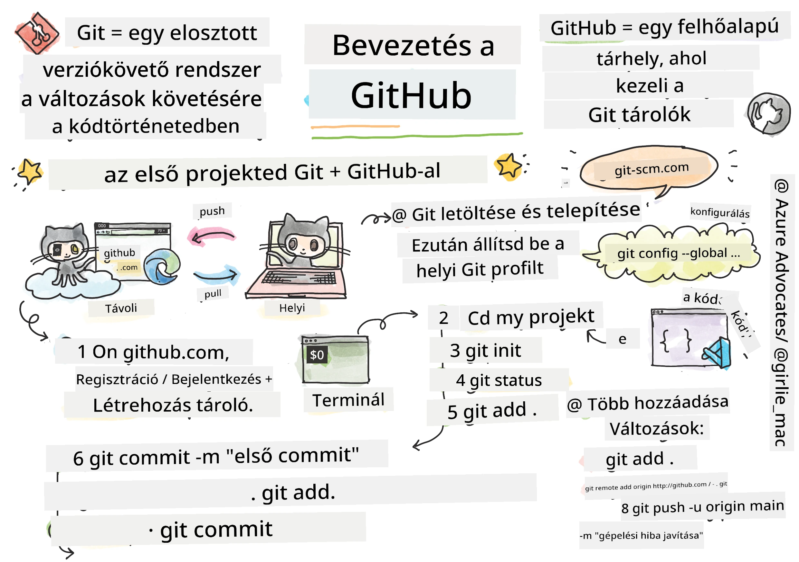
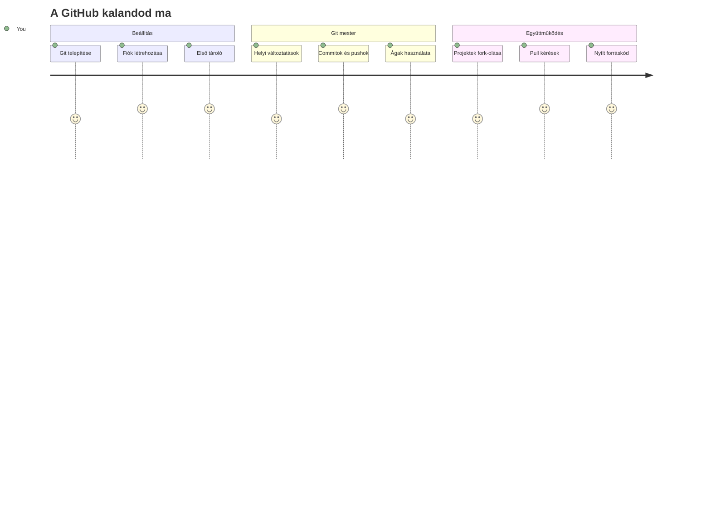
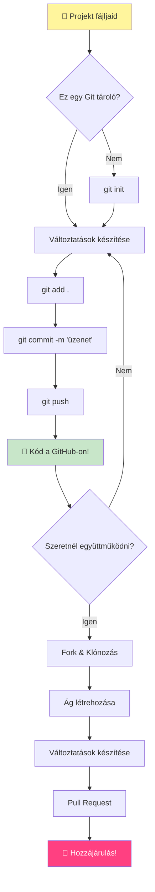
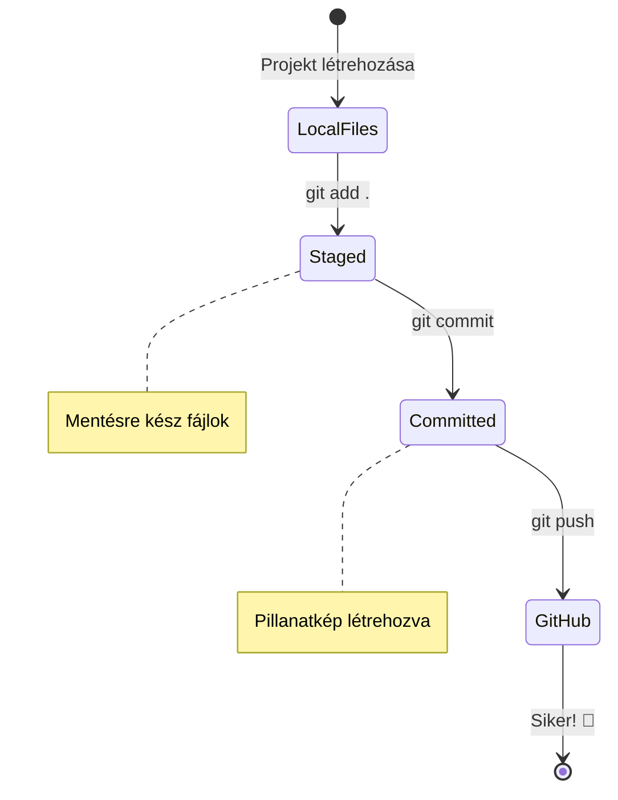
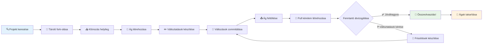
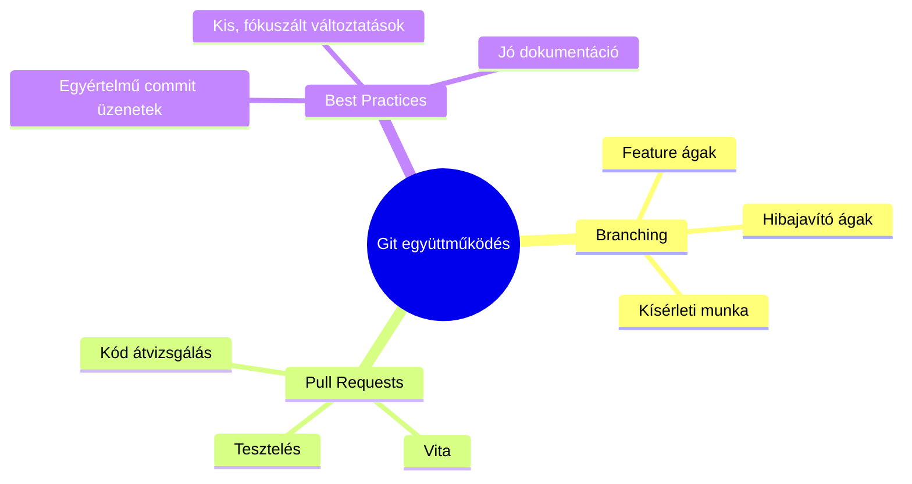
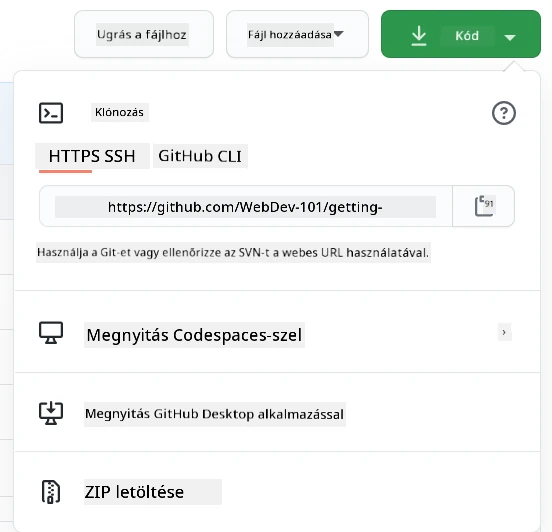
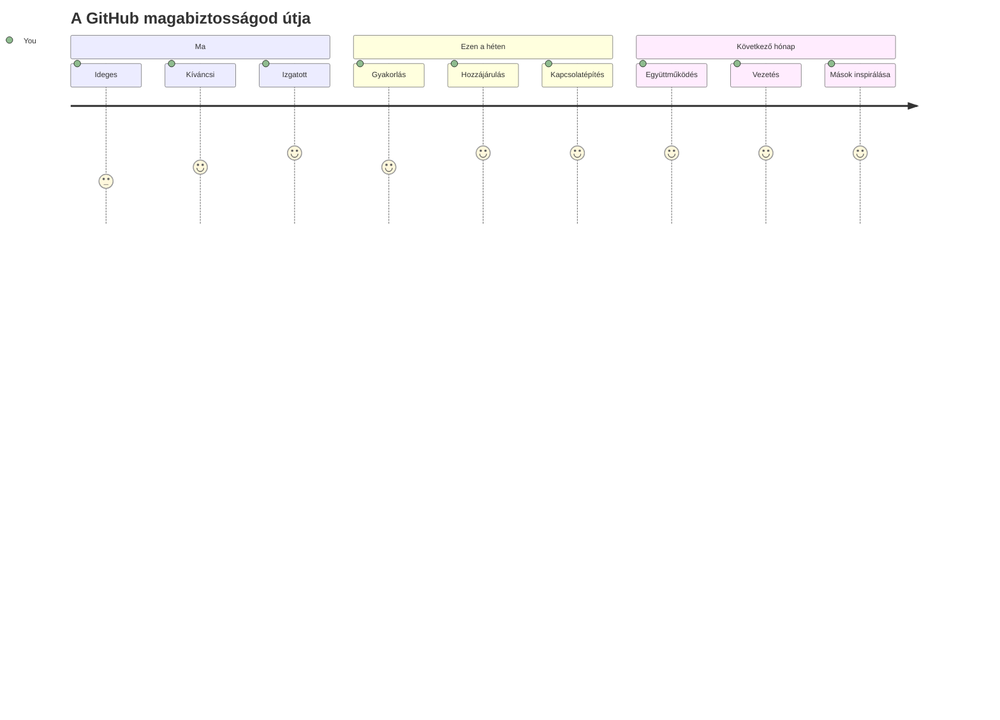

<!--
CO_OP_TRANSLATOR_METADATA:
{
  "original_hash": "5c383cc2cc23bb164b06417d1c107a44",
  "translation_date": "2026-01-07T03:16:48+00:00",
  "source_file": "1-getting-started-lessons/2-github-basics/README.md",
  "language_code": "hu"
}
-->
# Bevezetés a GitHubhoz

Szia, jövőbeli fejlesztő! 👋 Készen állsz, hogy csatlakozz a világ millió programozójához? Nagyon izgatott vagyok, hogy bemutathatom neked a GitHubot – gondolj rá úgy, mint a programozók közösségi média platformjára, csak itt nem az ebéded fotóját osztjuk meg, hanem kódokat, és együtt építünk hihetetlen dolgokat!

Az, ami teljesen lenyűgöz, hogy a telefonodon lévő minden alkalmazás, az összes weboldal, amit felkeresel, és a legtöbb eszköz, amit majd megtanulsz használni, fejlesztők csapata által készült, akik épp ilyen platformokon, mint a GitHub, működnek együtt. Az a zenés alkalmazás, amit szeretsz? Olyan valaki, mint te, hozzájárult hozzá. Az a játék, amit nem tudsz letenni? Igen, valószínűleg GitHub együttműködéssel készült. És most TE fogod megtanulni, hogyan lehetsz része ennek a csodálatos közösségnek!

Tudom, hogy kezdetben soknak tűnhet – emlékszem, hogy az első GitHub oldalamat nézve azt gondoltam: „Mit is jelent ez az egész?” De a lényeg: minden fejlesztő pontosan ott kezdte, ahol most te vagy. A lecke végére lesz saját GitHub tárhelyed (gondolj rá úgy, mint a személyes projektbemutatódra a felhőben), és tudni fogod, hogyan mentsd el a munkádat, hogyan oszd meg másokkal, és hogyan járulj hozzá azokhoz a projektekhez, amelyeket milliók használnak.

Ezt az utat együtt tesszük meg, lépésről lépésre. Nem kell sietni, nincs nyomás – csak te, én és néhány igazán klassz eszköz, amelyek a legjobb barátaiddá válnak!


> Vázlatkép készítette: [Tomomi Imura](https://twitter.com/girlie_mac)


## Előadás előtti kvíz
[Előadás előtti kvíz](https://ff-quizzes.netlify.app)

## Bevezetés

Mielőtt belevágnánk a tényleg izgalmas dolgokba, készítsük fel a gépedet egy kis GitHub varázslatra! Gondolj erre úgy, mint amikor a művészellátóidat rendezed el mielőtt mesterművet alkotnál – ha a megfelelő eszközök kéznél vannak, minden sokkal gördülékenyebb és tényleg szórakoztató lesz.

Én személyesen vezetlek végig minden beállításon, és ígérem, nem olyan félelmetes, mint amilyennek elsőre tűnik. Ha valami nem világos rögtön, az teljesen normális! Emlékszem, amikor az első fejlesztői környezetemet állítottam be, olyan volt, mintha ősi hieroglifákat próbálnék olvasni. Minden fejlesztő pontosan ott volt egyszer, ahol most te vagy, és azon gondolkodott, hogy jól csinálja-e. Előre szólok: ha itt vagy és tanulsz, már most jól csinálod! 🌟

Ebben a leckében megtanuljuk:

- hogyan kövessd nyomon a gépeden végzett munkát
- hogyan dolgozz együtt másokkal projekteken
- hogyan járulj hozzá nyílt forráskódú szoftverekhez

### Előfeltételek

Készüljünk fel a GitHub varázslatra! Ne aggódj – ezt a beállítást csak egyszer kell elvégezned, és utána az egész kódolós utad alatt kész leszel.

Rendben, kezdjük az alapokkal! Először ellenőrizzük, hogy a Git már fent van-e a gépeden. A Git olyan, mint egy szuperokos asszisztens, ami megjegyzi az összes változtatást, amit a kódodon végzel – sokkal jobb, mint kétszer másodpercenként kapkodva menteni (mindenki járt már így!).

Nézzük meg, hogy a Git már telepítve van-e, ha beírod ezt a varázsparancsot a terminálba:
`git --version`

Ha még nincs fent, ne aggódj! Csak látogass el a [git letöltés oldalára](https://git-scm.com/downloads) és töltsd le. Ha telepítetted, be kell mutatnunk a Git-et:

> 💡 **Első beállítás**: Ezek a parancsok megmondják a Gitnek, ki vagy. Ezek az adatok minden egyes commitodhoz (mentésedhez) hozzá lesznek csatolva, ezért válassz olyan nevet és emailt, amit nyilvánosan megosztasz szívesen.

```bash
git config --global user.name "your-name"
git config --global user.email "your-email"
```

A Git beállításának ellenőrzéséhez írd be:
```bash
git config --list
```

Szükséged lesz még egy GitHub fiókra, egy kódszerkesztőre (például Visual Studio Code), és meg kell nyitnod a terminált (vagy parancssort).

Navigálj a [github.com](https://github.com/) oldalra, és hozz létre egy fiókot, ha még nincs, vagy jelentkezz be és töltsd ki a profilodat.

💡 **Modern tipp**: Érdemes beállítani az [SSH kulcsokat](https://docs.github.com/en/authentication/connecting-to-github-with-ssh) vagy használni a [GitHub CLI-t](https://cli.github.com/) a jelszó nélküli egyszerűbb hitelesítés érdekében.

✅ A GitHub nem az egyetlen kódtároló az interneten; vannak mások is, de a GitHub a legismertebb.

### Előkészületek

Szükséged lesz egy helyi gépen tárolt mappára, amelyben egy kódprojekt van (laptopon vagy PC-n), valamint egy nyilvános tárhelyre a GitHubon, ami példaként szolgál, hogyan járulhatsz hozzá mások projektjeihez.

### Kódod biztonságban tartása

Beszéljünk egy pillanatra a biztonságról – de ne aggódj, nem fogunk ijesztő dolgokkal elárasztani! Gondolj ezekre a biztonsági gyakorlatokra úgy, mint amikor bezárod az autód vagy a házad. Ezek egyszerű szokások, amelyek másodlagossá válnak, és megvédik a kemény munkádat.

Már az elején megmutatjuk neked a modern, biztonságos munkavégzési módokat GitHub-bal. Így jó szokásokat alakítasz ki, amelyek hosszú távon szolgálnak majd téged a kódoló karriered során.

A GitHub használatakor fontos, hogy betartsd a legjobb biztonsági gyakorlatokat:

| Biztonsági terület | Legjobb gyakorlat | Miért fontos? |
|--------------------|-------------------|---------------|
| **Hitelesítés** | Használj SSH kulcsokat vagy személyes hozzáférési tokeneket | A jelszavak kevésbé biztonságosak és fokozatosan kivezetik őket |
| **Kétfaktoros hitelesítés** | Kapcsold be a 2FA-t a GitHub fiókodon | Extra védelmi réteget ad a fiókodnak |
| **Tárhely biztonság** | Soha ne commitolj érzékeny adatokat | API kulcsok és jelszavak soha ne legyenek nyilvános tárolókban |
| **Függőségkezelés** | Kapcsold be a Dependabot-ot a frissítésekhez | Biztosítja, hogy függőségeid biztonságosak és naprakészek legyenek |

> ⚠️ **Fontos biztonsági figyelmeztetés**: Soha ne commitolj API kulcsokat, jelszavakat vagy más érzékeny adatokat egyetlen tárhelyre sem. Használj környezeti változókat és `.gitignore` fájlokat az érzékeny adatok védelmére.

**Modern hitelesítési beállítás:**

```bash
# SSH kulcs generálása (modern ed25519 algoritmus)
ssh-keygen -t ed25519 -C "your_email@example.com"

# Állítsd be a Git-et SSH használatára
git remote set-url origin git@github.com:username/repository.git
```

> 💡 **Pro tipp**: Az SSH kulcsok megszüntetik a jelszavak ismételt begépelésének szükségességét, és biztonságosabbak a hagyományos hitelesítési módszereknél.

---

## Kódod professzionális kezelése

Na, EZ az, ahol igazán izgalmassá válik! 🎉 Most megtanuljuk, hogyan kövesd és kezeld a kódodat úgy, mint a profik, és őszintén szólva ez az egyik kedvenc tanítanivalóm, mert nagyon megváltoztatja a dolgokat.

Képzeld el ezt: egy csodálatos történetet írsz, és nyomon akarod követni minden verziót, minden zseniális szerkesztést és minden „várj, ez zseniális!” pillanatot közben. Pontosan ezt teszi a Git a kódoddal! Olyan, mintha lenne egy hihetetlen időutazós jegyzetfüzeted, ami MINDENT megjegyez – minden billentyűleütést, minden változást, minden „hopp, ezzel minden elromlott” pillanatot, amit azonnal visszavonhatsz.

Őszinte leszek – ez az elején túl soknak tűnhet. Amikor elkezdtem, azt hittem: „Miért nem menthetem egyszerűen a fájljaimat, mint normálisan?” De bízz bennem: amikor a Git "megvillan" neked (és meg fog!), lesz egy olyan „aha” pillanatod, amikor azt mondod: „Hogyan is kódoltam nélküle eddig?” Olyan, mintha felfedeznéd, hogy tudsz repülni, miután egész életedben gyalogoltál!

Tegyük fel, hogy van egy mappád a gépeden egy kódprojekttel, és szeretnéd követni a fejlődést git segítségével – ez a verziókezelő rendszer. Egyesek a git használatát úgy hasonlítják, mint ha egy szerelmes levelet írnál a jövőbeli énednek. Ha napokkal, hetekkel vagy hónapokkal később olvasod a commit üzeneteket, emlékezni fogsz, miért hoztál meg egy adott döntést, vagy „visszavonhatsz” egy változtatást – feltéve, ha jó commit üzeneteket írsz.


### Feladat: Hozd létre az első tárhelyedet!

> 🎯 **A küldetésed (és nagyon izgatott vagyok érted!)**: Együtt hozzuk létre az első GitHub tárhelyedet! Mire végeztünk, lesz egy saját kis internetes sarkod, ahol a kódod él, és megtetted az első „commitod” (ez a fejlesztők nyelvén azt jelenti, hogy okosan mentetted a munkádat).
>
> Ez tényleg egy különleges pillanat – most fogsz hivatalosan is csatlakozni a globális fejlesztői közösséghez! Még mindig emlékszem, milyen izgalmas volt az első repo létrehozása, és arra gondoltam: „Hú, tényleg csinálom!”

Menjünk végig együtt ezen a kalandon, lépésről lépésre. Szánj időt minden részre – nincs verseny, és ígérem, minden lépés érthető lesz. Ne feledd, minden kódolósztár, akit csodálsz, egyszer pont ott ült, ahol te most, hogy megalkossa az első tárhelyét. Milyen menő ez, igaz?

> Nézd meg a videót
> 
> [](https://www.youtube.com/watch?v=9R31OUPpxU4)

**Csináljuk meg együtt:**

1. **Hozd létre a tárhelyed a GitHubon**. Látogass el a GitHub.com-ra és keresd a fényesen zöld **New** gombot (vagy a jobb felső sarokban a **+** jelet). Kattints rá, és válaszd az **Új tárhely** opciót.

   Íme, mit kell tenned:
   1. Adj egy nevet a tárhelyednek – legyen valami számodra értelmes!
   1. Adj hozzá leírást, ha szeretnél (ez segít másoknak megérteni, miről szól a projekted)
   1. Döntsd el, hogy nyilvános legyen-e (mindenki láthatja) vagy privát (csak neked)
   1. Ajánlom, hogy jelöld be a README fájl hozzáadását – ez olyan, mint a projekted címlapja
   1. Kattints a **Tárhely létrehozása** gombra, és ünnepeld meg – most hoztad létre az első repódat! 🎉

2. **Navigálj a projekted mappájába**. Most nyisd meg a terminált (ne aggódj, nem olyan ijesztő, mint ahogy kinéz!). Meg kell mondanod a gépednek, hol vannak a projektfájljaid. Írd be ezt a parancsot:

   ```bash
   cd [name of your folder]
   ```

   **Amit itt teszünk:**
   - Alapvetően azt mondjuk a gépnek: „Hé, vigyél el a projektmappámhoz”
   - Ez olyan, mint amikor egy adott mappát nyitsz meg az asztalon, csak itt szöveges parancsokat használunk
   - Cseréld le a `[name of your folder]` részt a projekted mappájának nevére

3. **Alakítsd a mappádat Git tárolóvá**. Itt jön a varázslat! Írd be:

   ```bash
   git init
   ```

   **Itt mi történt (elég klassz dolgok!):**
   - A Git létrehozott egy rejtett `.git` mappát a projektedben – nem fogod látni, de ott van!
   - A rendes mappádból „tárhely” lett, amely nyomon követ minden változást, amit elkövetsz
   - Gondolj rá úgy, mintha a mappád szuperképességeket kapott volna, hogy mindent megjegyezzen

4. **Nézzük meg, mi történik**. Lássuk, mit mond róla most a Git:

   ```bash
   git status
   ```

   **Mit jelent, amit a Git mond neked:**

   Lehet, hogy ilyesmit látsz:

   ```output
   Changes not staged for commit:
   (use "git add <file>..." to update what will be committed)
   (use "git restore <file>..." to discard changes in working directory)

        modified:   file.txt
        modified:   file2.txt
   ```

   **Ne ess pánikba! Ez ezt jelenti:**
   - A **piros** fájlok olyanok, amelyeken van változtatás, de még nem készültek el a mentésre
   - A **zöld** fájlok (amikor megjelennek) készen állnak a mentésre
   - A Git segít neked azzal, hogy megmondja, mit csinálhatsz legközelebb

   > 💡 **Pro tipp**: A `git status` parancs a legjobb barátod! Használd bármikor, amikor nem tudod, mi történik. Olyan, mintha megkérdeznéd a Git-től: „Hé, mi a helyzet most?”

5. **Tedd készen a fájlokat a mentésre** (ezt hívjuk „staging”-nek):

   ```bash
   git add .
   ```

   **Amit most tettünk:**
   - Megmondtuk a Gitnek: „Hé, a következő mentésben AZ ÖSSZES fájlt szeretném benne látni”
   - A `.` azt jelenti: „minden ebben a mappában”
   - Most a fájljaid „staged” állapotban vannak, készen a következő lépésre

   **Szelektívebben szeretnéd?** Csak bizonyos fájlokat is hozzáadhatsz:

   ```bash
   git add [file or folder name]
   ```

   **Miért csinálnád ezt?**
   - Néha szeretnéd a kapcsolódó változtatásokat együtt menteni
   - Segít rendszerezni a munkádat logikus részekre bontva
   - Könnyebb megérteni, mi változott és mikor

   **Meglennél a feladattal?** Semmi gond! Így veheted ki a fájlokat a „készen áll” állapotból:

   ```bash
   # Mindenből vegye le a stage-et
   git reset
   
   # Csak egy fájl stage-jét vegye le
   git reset [file name]
   ```

   Ne aggódj – ez nem törli a munkádat, csak kiveszi a fájlokat a mentésre kész halmazból.

6. **Mentsd el véglegesen a munkádat** (most csinálod az első commitod!):

   ```bash
   git commit -m "first commit"
   ```

   **🎉 Gratulálok! Megtetted az első commitodat!**
   
   **Ez történt éppen:**
   - A Git készített egy „pillanatképet” az összes staged fájlról ezen a ponton
   - A commit üzeneted, „első commit”, megmagyarázza, miről szól ez a mentési pont
   - A Git egyedi azonosítót adott ennek a pillanatképnek, így mindig megtalálhatod később
   - Hivatalosan elindítottad a projekted történetének követését!

   > 💡 **A következő commit üzenetekhez**: Légy leíróbb! Ahelyett, hogy „frissítettem dolgokat” írnál, próbáld így: „Kapcsolati űrlap hozzáadása a főoldalhoz” vagy „Navigációs menü hiba javítása”. A jövőbeli éned meg fogja köszönni!

7. **Kapcsold össze a helyi projektedet a GitHubbal**. Jelenleg a projekted csak a gépeden létezik. Kapcsold össze a GitHub tárhelyeddel, hogy megoszthasd a világgal!

   Először menj a GitHub tárhelyed oldalára, és másold ki az URL-t. Aztán térj vissza ide, és írd be:

   ```bash
   git remote add origin https://github.com/username/repository_name.git
   ```
   
   (Cseréld le ezt az URL-t a saját tárhelyed URL-jére!)

   **Amit most tettünk:**
   - Kapcsolatot hoztunk létre a helyi projekted és a GitHub tárhelyed között
   - Az "origin" csak egy becenév a GitHub tárhelyednek – olyan, mint amikor felveszel egy kontaktot a telefonodba
   - Most a helyi Git tudja, hova küldje a kódodat, amikor meg akarod osztani

   💡 **Könnyebb mód**: Ha telepítve van a GitHub CLI, ezt egy parancsban is megteheted:
   ```bash
   gh repo create my-repo --public --push --source=.
   ```

8. **Küldd fel a kódodat a GitHubra** (a nagy pillanat!):

   ```bash
   git push -u origin main
   ```

   **🚀 Ez az! Feltöltöd a kódodat a GitHubra!**
   
   **Ami történik:**
   - A commitjaid elindulnak a számítógépedről a GitHubra
   - A `-u` kapcsoló tartós kapcsolatot állít be, így a jövőbeli push-ok könnyebbek lesznek
   - A "main" az elsődleges ágad neve (olyan, mint a főmappa)
   - Ezután elég csak beírni, hogy `git push` a jövőbeni feltöltésekhez!

   💡 **Gyors megjegyzés**: Ha más a branch neve (például "master"), használd azt helyette. Lekérdezheted a nevét a `git branch --show-current` paranccsal.

9. **Az új napi kódolási ritmusod** (innen kezd igazán függővé válni!):

   Mostantól, amikor változtatsz a projekten, van egy egyszerű háromlépéses táncod:

   ```bash
   git add .
   git commit -m "describe what you changed"
   git push
   ```

   **Ez lesz a kódolási pulzusod:**
   - Csinálj néhány szuper változtatást a kódodon ✨
   - Állítsd be őket a `git add` paranccsal ("Hé Git, figyelj ezekre a változásokra!")
   - Mentsd el őket `git commit` paranccsal és egy leíró üzenettel (a jövőbeni éned hálás lesz érte!)
   - Oszd meg őket a világgal `git push` segítségével 🚀
   - Ismételd meg – komolyan, ez olyan természetes lesz, mint a légzés!

   Imádom ezt a munkafolyamatot, mert olyan, mintha több mentési pontod lenne egy videojátékban. Megcsináltál egy változtatást, amit szeretsz? Commitold! Kockázatosat próbálnál? Semmi gond – mindig visszaléphetsz az előző commitodhoz, ha valami rosszul sül el!

   > 💡 **Tipp**: Érdemes használni `.gitignore` fájlt, hogy ne kerüljenek olyan fájlok a GitHubra, amiket nem akarsz követni – például az a jegyzettömb fájl, amit ugyanabban a mappában tárolsz, de nincs helye egy nyilvános repositoryban. `.gitignore` sablonokat találsz a [.gitignore templates](https://github.com/github/gitignore) oldalon, vagy készíthetsz egyet a [gitignore.io](https://www.toptal.com/developers/gitignore) segítségével.

### 🧠 **Első repository feltöltés: Hogy érezted magad?**

**Szánj egy pillanatot, hogy ünnepelj és elmélkedj:**
- Milyen érzés volt először látni a kódodat a GitHubon?
- Melyik lépés volt a legzavaróbb, és melyik bizonyult meglepően egyszerűnek?
- Tudnád saját szavaiddal elmagyarázni a különbséget a `git add`, `git commit` és `git push` között?


> **Emlékezz**: Még a tapasztalt fejlesztők is néha elfelejtik a pontos parancsokat. Ez a munkafolyamat izommá válása gyakorlást igényel – nagyszerűen csinálod!

#### Modern Git munkafolyamatok

Érdemes ezeket a modern gyakorlatokat alkalmazni:

- **Hagyományos commitok**: Használj szabványos commit üzenet formátumokat, mint a `feat:`, `fix:`, `docs:`, stb. További információ a [conventionalcommits.org](https://www.conventionalcommits.org/) oldalon.
- **Atomi commitok**: Minden commit csak egyetlen logikai változtatást tartalmazzon
- **Gyakori commitok**: Gyakran commitolj leíró üzenetekkel, ahelyett, hogy ritkán és nagy változtatásokkal tennéd

#### Commit üzenetek

Egy jó Git commit tárgysor befejezni az alábbi mondatot:
Ha alkalmazva lesz, ez a commit <az itt lévő tárgysorod>

A tárgysorban imperatív, jelen idejű igét használj: "change", ne "changed" vagy "changes".
Ahogy a tárgysorban, úgy a szövegtestben (opcionális) is imperatív jelen idejűt használj. A szövegtest magyarázza a változtatás motivációját, és összehasonlítja az előző viselkedéssel. Az okot (`why`) magyarázod, nem a hogyan-t (`how`).

✅ Szánj néhány percet, hogy körülnézz a GitHubon. Találsz egy igazán jó commit üzenetet? Találsz egy igazán minimálist? Milyen információkat tartasz a legfontosabbnak és leghasznosabbnak egy commit üzenetben?

## Munkatársakkal való munka (A jó rész!)

Fogd meg a kalapod, mert ITT válik a GitHub teljesen varázslatossá! 🪄 Már megtanultad kezelni a saját kódodat, de most belemerülünk az abszolút kedvenc részembe – együtt dolgozni csodálatos emberekkel a világ minden tájáról.

Képzeld el: holnap reggel felkelsz, és látod, hogy valaki Tokióban javított a kódodon, miközben aludtál. Aztán egy berlini fejlesztő megold egy hibát, amin te hetek óta dolgoztál. Délutánra pedig egy São Paulói fejlesztő hozzáad egy olyan funkciót, amin eszedbe sem jutott gondolni. Ez nem sci-fi – ez csak egy szimpla kedd a GitHub univerzumban!

Ami igazán izgat az az, hogy az együttműködési készségek, amiket most megtanulsz? Pont olyan munkafolyamatok, amiket a Google, Microsoft és a kedvenc startupjaid csapatai nap mint nap használnak. Nem csak egy menő eszközt tanulsz – egy titkos nyelvet, ami az egész szoftvervilágot összeköti.

Komolyan, amint átérzed azt a lelkesedést, amikor valaki elfogadja az első pull requestedet, megérted, miért olyan szenvedélyesek az open source fejlesztők. Olyan, mintha a világ legnagyobb, legkreatívabb csapatprojektjének része lennél!

> Nézd meg a videót
>
> [](https://www.youtube.com/watch?v=bFCM-PC3cu8)

A legfőbb ok, hogy miért rakták fel a dolgokat a GitHubra, az az volt, hogy lehetővé tegyék a többi fejlesztővel való együttműködést.


A repositorydban navigálj az `Insights > Community` menüponthoz, hogy megnézd, hogyan viszonyul a projekted az ajánlott közösségi szabványokhoz.

Szeretnéd, hogy a repositoryd professzionálisnak és barátságosnak tűnjön? Látogass el a repositorydba, és kattints az `Insights > Community` menüpontra. Ez a menő funkció megmutatja, hogyan viszonyul a projekted ahhoz, amit a GitHub közösség "jó repository gyakorlatnak" tart.

> 🎯 **Irányítsd ragyogásra a projektedet**: Egy jól szervezett repository jó dokumentációval olyan, mint egy tiszta, barátságos üzletfront. Megmutatja, hogy törődsz a munkáddal, és másokat is arra ösztönöz, hogy hozzájáruljanak!

**Ez tesz egy repositoryt naggyá:**

| Mit Adjunk Hozzá | Miért Fontos | Mit Nyújt Neked |
|------------------|--------------|-----------------|
| **Leírás** | Az első benyomás számít! | Azonnal tudják az emberek, mit csinál a projekted |
| **README** | A projekted kezdőoldala | Olyan, mint egy barátságos idegenvezető az új látogatóknak |
| **Contributing irányelvek** | Jelezd, hogy szívesen fogadsz segítséget | Az emberek pontosan tudják, hogyan segíthetnek |
| **Code of Conduct** | Barátságos teret teremt | Mindenki szívesen vesz részt benne |
| **Licenc** | Jogi világosság | Mások tudják, hogyan használhatják a kódodat |
| **Biztonsági szabályzat** | Mutatja, hogy felelősségteljes vagy | Bemutatja a professzionális gyakorlatot |

> 💡 **Pro tipp**: A GitHub sablonokat ad mindezekhez a fájlokhoz. Amikor új repositoryt hozol létre, jelöld be a négyzeteket, hogy automatikusan generálja ezeket a fájlokat.

**Modern GitHub funkciók, amiket érdemes felfedezni:**

🤖 **Automatizálás & CI/CD:**
- **GitHub Actions** automatizált teszteléshez és telepítéshez
- **Dependabot** az automatikus függőségfrissítésekhez

💬 **Közösség & projektmenedzsment:**
- **GitHub Discussions** a közösségi beszélgetésekhez az issue-któl függetlenül
- **GitHub Projects** kanban-stílusú projektkezeléshez
- **Branch védelmi szabályok**, hogy érvényesítsd a kódminőségi elvárásokat


Ezek az eszközök nagyban segítik az új csapattagok beilleszkedését. És tipikusan ezek azok a dolgok, amiket az új hozzájárulók megnéznek, mielőtt egyáltalán a kódhoz nyúlnának, hogy meggyőződjenek arról, hogy a projekt a megfelelő hely az idejüket tölteni.

✅ A README fájlok, bár időt igényelnek az elkészítésükhöz, sokszor elhanyagolják őket a sűrűn dolgozó fenntartók. Találsz egy különösen jó leíró példát? Megjegyzés: vannak [eszközök jól megírt README-k készítéséhez](https://www.makeareadme.com/), amiket érdemes kipróbálni.

### Feladat: Kód egyesítése

A hozzájárulási leírások segítenek az embereknek, hogy hozzájáruljanak a projekthez. Elmagyarázza, milyen hozzájárulásokat vársz, és hogyan működik a folyamat. A hozzájárulók egy sor lépésen mennek keresztül, hogy hozzá tudjanak járulni a GitHub repo-dhoz:

1. **A repo forkolása** Valószínűleg azt szeretnéd, hogy az emberek _forkolják_ a projektedet. A forkolás azt jelenti, hogy létrehoznak egy másolatot a repositorydról a saját GitHub profiljukon.
1. **Klónozás** Ezután a projektet a helyi gépükre klónozzák.
1. **Ág létrehozása** Kérd meg őket, hogy hozzanak létre egy _ágat_ a munkájukhoz.
1. **Változtatás koncentrálása egy területre** Kérd meg a hozzájárulókat, hogy egyszerre csak egy dologra fókuszáljanak – így magasabb a valószínűsége, hogy be tudod majd _merge_-elni a munkájukat. Képzeld el, hogy javítanak egy hibát, hozzáadnak egy új funkciót, és frissítenek néhány tesztet – mi van, ha csak kettőt vagy egyet tudsz megvalósítani a három változtatásból?

✅ Képzeld el, hol kritikusak különösen az ágak a jó kód írásához és szállításához. Milyen használati esetekre gondolsz?

> Jegyezd meg, légy te az a változás, amit látni szeretnél a világban, és hozz létre ágakat a saját munkádhoz is. Bármi commitot teszel, az a jelenleg "checked out" ágadon fog megjelenni. Azt, hogy melyik ág az, a `git status` paranccsal nézheted meg.

Nézzük végig egy hozzájáruló munkafolyamatát. Tegyük fel, hogy a hozzájáruló már _forkolta_ és _klónozta_ a repót, így készen áll arra, hogy a helyi gépén dolgozzon:

1. **Ág létrehozása** Használd a `git branch` parancsot, hogy létrehozz egy ágat, ami tartalmazni fogja a változtatásokat, amiket hozzá szeretne járulni:

   ```bash
   git branch [branch-name]
   ```

   > 💡 **Modern megközelítés**: Egy parancsban létrehozhatod és át is válthatsz az új ágra:
   ```bash
   git switch -c [branch-name]
   ```

1. **Átváltás a munkára szánt ágra** Válts át a megadott ágra, és frissítsd a munkakönyvtárat a `git switch` paranccsal:

   ```bash
   git switch [branch-name]
   ```

   > 💡 **Modern megjegyzés**: A `git switch` a modern alternatívája a `git checkout` parancsnak az átváltásra. Egyértelműbb és biztonságosabb a kezdőknek.

1. **Dolgozz** Ezen a ponton szeretnéd hozzáadni a változtatásaidat. Ne felejtsd el értesíteni a Git-et a következő parancsokkal:

   ```bash
   git add .
   git commit -m "my changes"
   ```

   > ⚠️ **Commit üzenet minősége**: Ügyelj rá, hogy jó nevet adj a commitodnak, a saját és a repo fenntartója érdekében is. Légy specifikus, mit változtattál!

1. **Egyesítsd a munkád a `main` ággal** Egyszer majd végzel a munkával, és össze akarod kapcsolni a munkád a `main` ággal. Elképzelhető, hogy a `main` ág közben változott, ezért először frissítsd erre a legfrissebb állapotra az alábbi parancsokkal:

   ```bash
   git switch main
   git pull
   ```

   Ezen a ponton azt szeretnéd, hogy minden _konfliktus_, amikor a Git nem tudja automatikusan _egyesíteni_ a változtatásokat, a munkád ágában történjen. Ezért futtasd az alábbi parancsokat:

   ```bash
   git switch [branch_name]
   git merge main
   ```

   A `git merge main` parancs behozza a változtatásokat a `main` ágról a te ágadba. Remélhetőleg tovább tudsz menni problémamentesen. Ha nem, a VS Code megmutatja, hol akadt el a Git, és egyszerűen módosítod az érintett fájlokat, hogy melyik tartalom a helyes.

   💡 **Modern alternatíva**: Használhatod a `git rebase` parancsot is a tisztább történelemért:
   ```bash
   git rebase main
   ```
   Ez újrajátssza a commitjaidat a legfrissebb main ág tetején, lineáris történelemhez vezetve.

1. **Küldd el a munkád a GitHubra** A munkád GitHubra küldése két dolgot jelent. Push-olni az ágadat a repo-dba, majd nyitni egy PR-t, pull requestet.

   ```bash
   git push --set-upstream origin [branch-name]
   ```

   A fenti parancs létrehozza az ágat a forkolt repo-dban.

### 🤝 **Együttműködési készségek teszt: Készen állsz másokkal dolgozni?**

**Nézzük meg, hogyan érzed magad az együttműködés ügyében:**
- Most már érthető számodra a forkolás és a pull requestek működése?
- Mi az az egy dolog a branch-ekkel való munkában, amit szeretnél még gyakorolni?
- Mennyire érzed magad komfortosan más projektjéhez való hozzájárulásban?


> **Önbizalom növelő**: Minden egyes fejlesztő, akit csodálsz, egyszer izgult az első pull requestje miatt. A GitHub közösség hihetetlenül befogadó az új tagokkal szemben!

1. **Nyiss egy PR-t** Ezután nyiss egy PR-t. Ezt úgy teszed, hogy a GitHubon a forkolt repo-hoz navigálsz. A GitHub jelzi, hogy szeretnél-e új PR-t létrehozni, rákattintasz, és egy felületre kerülsz, ahol megváltoztathatod a commit üzenet címét, és egy megfelelőbb leírást adhatsz meg. A repo fenntartója, ahonnan forkoltál, látni fogja ezt a PR-t, és _reméljük_, pozitívan értékeli és _merge-eli_ a PR-t. Most már hozzájáruló vagy, hurrá :)

   💡 **Modern tipp**: PR-kat is létrehozhatsz a GitHub CLI-vel:
   ```bash
   gh pr create --title "Your PR title" --body "Description of changes"
   ```

   🔧 **Legjobb gyakorlatok a PR-ekhez**:
   - Kapcsolj hozzá kapcsolódó issue-kat kulcsszavakkal, mint például "Fixes #123"
   - Adj hozzá képernyőképeket UI változtatásokhoz
   - Kérj meg konkrét véleményezőket
   - Használj draft PR-eket folyamatban lévő munkához
   - Győződj meg róla, hogy minden CI teszt sikeres a véleményezés kérés előtt
1. **Takarítás**. Jó gyakorlatnak számít, ha egy PR sikeres egyesítése után _kitakarítasz_. Mind a helyi branchedet, mind azt a branchet, amelyet a GitHubra toltál, érdemes tisztán tartani. Először töröljük helyben az alábbi parancs segítségével:

   ```bash
   git branch -d [branch-name]
   ```

   Ezután menj át a forkolt repo GitHub oldalára, és töröld a távoli branchet, amelyet épp feltoltál.

A `Pull request` kifejezés kicsit furcsán hangzik, mert valójában a változtatásaidat szeretnéd bepusholni a projekthez. De a fenntartónak (projekt tulajdonosának) vagy a core csapatnak meg kell fontolnia a változtatásaidat, mielőtt egyesítené azt a projekt "main" branch-ével, szóval valójában egy fenntartótól kérsz egy változtatási döntést.  

A pull request az a hely, ahol összehasonlíthatod és megvitathatod az egy branch-en bevezetett különbségeket értékelésekkel, megjegyzésekkel, integrált tesztekkel és még sok mással. Egy jó pull request körülbelül ugyanazokat a szabályokat követi, mint egy commit üzenet. Hivatkozást adhatsz egy issue-ra az issue trackerben, például, ha a munkád egy issue-t javít. Ezt egy `#` jelzés és az issue száma követi. Például `#97`.

🤞Keresztezzük az ujjainkat, hogy minden ellenőrzés sikeresen lefusson, és a projekt tulajdonosai egyesítsék a változtatásaidat a projekttel🤞

Frissítsd a helyi munkabranch-edet az összes új commit-tal az adott távoli brancről GitHubon:

`git pull`

## Hozzájárulás a nyílt forráskódú projektekhez (A lehetőséged, hogy hatást gyakorolj!)

Készen állsz valamire, ami teljesen ki fogja ütni az agyadat? 🤯 Beszéljünk a nyílt forráskódú projektekhez való hozzájárulásról – és már most libabőrös vagyok, hogy megoszthatom ezt veled!

Ez a te esélyed arra, hogy valóban részese legyél valami rendkívülinek. Képzeld el, hogy fejleszted azokat az eszközöket, amelyeket millió fejlesztő használ nap mint nap, vagy kijavítasz egy hibát egy olyan appban, amit a barátaid imádnak. Ez nem csak álom – ez az, amiről a nyílt forráskódú hozzájárulás szól!

Ez az, amitől mindig libabőrös leszek, amikor eszembe jut: az összes eszköz, amivel tanultál – a kódszerkesztőd, az általunk felfedezendő keretrendszerek, sőt, még a böngésző, amiben ezt olvasod – egy olyan valaki első hozzájárulásával indult, aki pont olyan volt, mint te. Az a zseniális fejlesztő, aki megírta a kedvenc VS Code bővítményedet? Ő is kezdő volt egyszer, remegő kezekkel kattintva a "create pull request"-re, pont ahogy te most fogsz.

És itt jön a legszebb része: a nyílt forráskódú közösség olyan, mint az internet legnagyobb csoportos ölelése. A legtöbb projekt aktívan keres új hozzájárulókat, és kifejezetten "good first issue" címkével ellátott problémák vannak, pont az olyanoknak, mint te! A fenntartók őszintén örülnek, amikor új hozzájárulókat látnak, mert emlékeznek a saját első lépéseikre.

```mermaid
flowchart TD
    A[🔍 Fedezd fel a GitHubot] --> B[🏷️ Találd meg a "jó első probléma"]
    B --> C[📖 Olvasd el a Hozzájárulási Útmutatót]
    C --> D[🍴 Forkold a Tárolót]
    D --> E[💻 Állítsd be a helyi környezetet]
    E --> F[🌿 Hozz létre egy funkció ágat]
    F --> G[✨ Tedd meg a hozzájárulásodat]
    G --> H[🧪 Teszteld a változtatásaidat]
    H --> I[📝 Írj érthető commitot]
    I --> J[📤 Pushold és hozz létre PR-t]
    J --> K[💬 Vegyél részt a visszajelzésben]
    K --> L[🎉 Egyesítve! Most már hozzájáruló vagy!]
    L --> M[🌟 Találd meg a következő problémát]
    
    style A fill:#e1f5fe
    style L fill:#c8e6c9
    style M fill:#fff59d
```
Itt nem csak kódot tanulsz – egy globális építő családhoz készülsz csatlakozni, akik minden nap arra ébrednek, hogy "Hogyan tehetjük jobbá a digitális világot?" Üdv a klubban! 🌟

Először találjunk egy tárolót (repo-t) GitHubon, ami érdekel, és amelyhez szeretnél változtatást hozzájárulni. Át szeretnéd majd másolni a tartalmát a gépedre.

✅ Jó módszer kezdőbarát repók megtalálására a [good-first-issue címkével való keresés](https://github.blog/2020-01-22-browse-good-first-issues-to-start-contributing-to-open-source/).



Több módja is van a kód átmásolásának. Az egyik módszer a repó tartalmának "klónozása" HTTPS, SSH vagy a GitHub CLI (parancssoros felület) használatával.

Nyisd meg a terminálodat, és így klónozd a repót:
```bash
# HTTPS használata
git clone https://github.com/ProjectURL

# SSH használata (SSH kulcs beállítást igényel)
git clone git@github.com:username/repository.git

# GitHub CLI használata
gh repo clone username/repository
```

A projekten való munkához lépj a megfelelő mappába:
`cd ProjectURL`

A teljes projektet megnyithatod továbbá:
- **[GitHub Codespaces](https://github.com/features/codespaces)** – GitHub felhő alapú fejlesztőkörnyezete VS Code böngészőben
- **[GitHub Desktop](https://desktop.github.com/)** – GUI alkalmazás Git műveletekhez  
- **[GitHub.dev](https://github.dev)** – Nyomd meg a `.` billentyűt bármely GitHub repóban, hogy VS Code-ot nyiss a böngészőben
- **VS Code** a GitHub Pull Requests bővítménnyel

Végül letöltheted a kódot tömörített mappában is.

### Néhány további érdekesség a GitHubról

Bármely nyilvános GitHub tárolót megjelölhetsz csillaggal, figyelheted és/vagy "forkolhatod". A csillaggal jelölt repóidat a jobb felső legördülő menüben találod. Ez olyan, mint a könyvjelző, de kódhoz.

A projekteknek van issue trackere, többnyire GitHubon az "Issues" fül alatt, ahol a projekt kapcsán felmerülő kérdéseket vitatják meg. A Pull Requests fül pedig a változtatások vitájának és értékelésének helyszíne.

A projekteknek lehet fóruma, levelezőlistája vagy chat csatornája is, pl. Slack, Discord vagy IRC.

🔧 **Modern GitHub funkciók**:
- **GitHub Discussions** – Beépített fórum közösségi beszélgetésekhez
- **GitHub Sponsors** – Anyagi támogatás fenntartóknak  
- **Biztonsági fül** – Sérülékenység jelentések és biztonsági tanácsok
- **Actions fül** – Automatizált munkafolyamatok és CI/CD csövek megtekintése
- **Insights fül** – Elemzések a hozzájárulókról, commitokról és a projekt állapotáról
- **Projects fül** – GitHub beépített projektkezelő eszközei

✅ Nézz körül az új GitHub repódban, próbálj ki néhány dolgot, például szerkeszd a beállításokat, adj hozzá információkat a repódhoz, hozz létre egy projektet (pl. Kanban táblát), és állíts be GitHub Actions automatizációt. Sok lehetőség van!

---

## 🚀 Kihívás

Na, itt az idő, hogy próbára tedd az új GitHub szuperképességeidet! 🚀 Itt egy kihívás, ami a lehető legkielégítőbb módon kapcsol össze mindent:

Szerezz egy barátot (vagy azt a családtagot, aki mindig azt kérdezi, mit csinálsz ezzel a "számítógépes izével"), és induljatok közös kódolós kalandra! Itt történik a valódi varázslat – hozz létre egy projektet, hadd fork-olják, csinálj ágakat, és egyesítsétek a változtatásokat, mint az igazi profik, akik lesztek.

Nem fogok hazudni – valószínűleg nevetni fogtok legalább egyszer (különösen, amikor mindketten az ugyanazon sor módosításán dolgoztok), talán vakarjátok majd a fejeteket zavartan, de biztosan lesznek azok a fantasztikus "aha!" pillanatok, amiért megéri tanulni. Plusz van abban valami különleges, amikor megoszthatod valakivel az első sikeres egyesítésedet – ez olyan, mint egy apró ünneplés arról, milyen messzire jutottál!

Még nincs kódoló társad? Semmi gond! A GitHub közössége tele van hihetetlenül befogadó emberekkel, akik emlékeznek, milyen volt újnak lenni. Keress "good first issue" címkével ellátott repókat – ezek lényegében azt mondják: "Hé, kezdők, gyertek tanulni velünk!" Milyen klassz ez már?

## Az előadás utáni kvíz
[Az előadás utáni kvíz](https://ff-quizzes.netlify.app/web/en/)

## Áttekintés és további tanulás

Hűha! 🎉 Nézd csak – fényesen elsajátítottad a GitHub alapokat, mint egy igazi bajnok! Ha most kicsit túlterheltnek érzed magad, az teljesen normális és valójában jó jel. Olyan eszközöket tanultál meg, amelyek nekem hetekig tartottak, hogy kényelmesen használjam, amikor kezdtem.

A Git és a GitHub hihetetlenül erősek (komolyan, nagyon erősek), és minden fejlesztő, akit ismerek – még a mostani "varázslók" is – gyakoroltak és botladoztak egy ideig, mielőtt minden összeállt volna. Az, hogy átvészelted ezt a leckét, azt jelenti, hogy már úton vagy azoknak az eszközöknek a mesteri kezeléséhez, amelyek egy fejlesztő legfontosabb szerszámai közé tartoznak.

Íme néhány nagyszerű forrás, amelyek segítenek gyakorolni és még jobbnak lenni:

- [Útmutató nyílt forráskódú szoftverekhez való hozzájáruláshoz](https://opensource.guide/how-to-contribute/#how-to-submit-a-contribution) – Az utad térképe a változtatáshoz
- [Git gyorssegédlet](https://training.github.com/downloads/github-git-cheat-sheet/) – Tartsd kéznél gyors hivatkozásként!

És emlékezz: a gyakorlás a haladás kulcsa, nem a tökéletesség! Minél többet használod a Git-et és a GitHubot, annál természetesebb lesz. A GitHub nagyszerű interaktív tanfolyamokat hozott létre, amelyekkel biztonságos környezetben gyakorolhatsz:

- [Bevezetés a GitHubra](https://github.com/skills/introduction-to-github)
- [Kommunikáció Markdown használatával](https://github.com/skills/communicate-using-markdown)  
- [GitHub Pages](https://github.com/skills/github-pages)
- [Merge konfliktusok kezelése](https://github.com/skills/resolve-merge-conflicts)

**Kalandvágyó vagy? Próbáld ki ezeket a modern eszközöket:**
- [GitHub CLI dokumentáció](https://cli.github.com/manual/) – Ha parancssoros varázslónak szeretnéd érezni magad
- [GitHub Codespaces dokumentáció](https://docs.github.com/en/codespaces) – Kódolj a felhőben!
- [GitHub Actions dokumentáció](https://docs.github.com/en/actions) – Automatizálj mindent
- [Git legjobb gyakorlatok](https://www.atlassian.com/git/tutorials/comparing-workflows) – Emeld új szintre a munkafolyamataidat

## GitHub Copilot Agent kihívás 🚀

Használd az Agent módot a következő kihívás teljesítéséhez:

**Leírás:** Hozz létre egy közös webfejlesztési projektet, amely bemutatja a GitHub teljes munkafolyamatát, amit ezen a leckén tanultál. Ez a kihívás segít gyakorolni a repó létrehozását, az együttműködési funkciókat és a modern Git munkafolyamatokat valós környezetben.

**Feladat:** Hozz létre egy új nyilvános GitHub repót egy egyszerű "Webfejlesztési erőforrások" projekthez. A repó tartalmazzon egy jól felépített README.md fájlt, amely hasznos webfejlesztési eszközöket és forrásokat listáz kategóriák szerint (HTML, CSS, JavaScript stb.). Állíts be a repóban megfelelő közösségi szabványokat, beleértve licenceket, hozzájárulási útmutatót és magatartási kódexet. Hozz létre legalább két feature branch-et: egyet CSS források hozzáadására, egyet pedig JavaScript forrásokra. Mindkét branch-en készíts leíró commit üzenetekkel commitokat, majd hozz létre pull requesteket, hogy visszaolvaszd a változtatásokat a main branch-re. Engedélyezd a GitHub funkcióit, mint az Issues, Discussions, valamint állíts be egy alapvető GitHub Actions munkafolyamatot az automatizált ellenőrzésekhez.

## Feladat

A küldetésed, ha elfogadod: Teljesítsd az [Introduction to GitHub](https://github.com/skills/introduction-to-github) kurzust a GitHub Skills-en. Ez az interaktív kurzus lehetőséget ad, hogy biztonságos, vezetett környezetben gyakorolj mindent, amit tanultál. Ráadásul kapsz egy menő jelvényt is, ha befejezed! 🏅

**Készen állsz több kihívásra?**
- Állíts be SSH hitelesítést a GitHub fiókodhoz (nincs több jelszó!)
- Próbáld ki a GitHub CLI-t a napi Git műveletekhez
- Hozz létre repót GitHub Actions munkafolyamattal
- Fedezd fel a GitHub Codespaces-t azzal, hogy ebben a repóban felhő alapú szerkesztőben nyitsz meg

---

## 🚀 A GitHub mesteri idővonalad

### ⚡ **Mit tehetsz az elkövetkező 5 percben**
- [ ] Jelölj meg csillaggal ezt a repót és 3 másik érdekes projektet
- [ ] Állítsd be a kétfaktoros hitelesítést a GitHub fiókodon
- [ ] Készíts egy egyszerű README-t az első repódhoz
- [ ] Kövess 5 fejlesztőt, akik inspirálnak

### 🎯 **Mit érhetsz el ezen az órán belül**
- [ ] Teljesítsd az előadás utáni kvízt és reflektálj a GitHubos utadra
- [ ] Állíts be SSH kulcsokat jelszó nélküli GitHub hitelesítéshez
- [ ] Készítsd el az első értelmes commitodat nagyszerű commit üzenettel
- [ ] Fedezd fel a GitHub "Explore" fület, hogy trendi projekteket találj
- [ ] Gyakorold egy repó fork-olását és egy kis módosítását

### 📅 **Hét napos GitHub kalandod**
- [ ] Teljesítsd a GitHub Skills kurzusokat (Bevezetés a GitHubra, Markdown)
- [ ] Tegyél meg az első pull requested egy nyílt forráskódú projekthez
- [ ] Állíts be egy GitHub Pages oldalt, hogy bemutasd a munkádat
- [ ] Csatlakozz GitHub Discussions-hoz az érdeklődő projekteken
- [ ] Hozz létre egy repót megfelelő közösségi szabványokkal (README, Licenc stb.)
- [ ] Próbáld ki a GitHub Codespaces-t felhő alapú fejlesztéshez

### 🌟 **Hónapok alatti átalakulásod**
- [ ] Hozzájárulj 3 különböző nyílt forráskódú projekthez
- [ ] Legyél mentor új GitHub használóknak (adj tovább!)
- [ ] Állíts be automatizált munkafolyamatokat GitHub Actions segítségével
- [ ] Építs portfóliót a GitHub hozzájárulásaidból
- [ ] Vegyél részt Hacktoberfest vagy hasonló közösségi eseményeken
- [ ] Válj fenntartóvá egy saját projektedhez, amelyhez mások is hozzájárulnak

### 🎓 **Végső GitHub mesteri ellenőrzőpont**

**Ünnepeld meg, mennyit fejlődtél:**
- Mi a kedvenc dolog a GitHub használatával kapcsolatban?
- Melyik együttműködési funkció izgat a legjobban?
- Mennyire érzed magad magabiztosnak a nyílt forráskódú hozzájárulásokban?
- Mi az első projekt, amihez hozzá szeretnél járulni?


> 🌍 **Üdvözlünk a globális fejlesztői közösségben!** Most már megvannak az eszközeid, hogy millió fejlesztővel együttműködj világszerte. Az első hozzájárulásod lehet, hogy kicsinek tűnik, de ne feledd – minden nagy nyílt forráskódú projekt valaki első commitjával indult. A kérdés nem az, hogy lesz-e hatásod, hanem hogy melyik csodálatos projekt fog először profitálni az egyedi nézőpontodból! 🚀

Emlékezz: minden szakértő egyszer kezdő volt. Meg tudod csinálni! 💪

---

<!-- CO-OP TRANSLATOR DISCLAIMER START -->
**Jogi nyilatkozat**:  
Ezt a dokumentumot az AI fordítószolgáltatás, a [Co-op Translator](https://github.com/Azure/co-op-translator) segítségével fordítottuk le. Bár igyekszünk pontos fordítást biztosítani, kérjük, vegye figyelembe, hogy az automatikus fordítások hibákat vagy pontatlanságokat tartalmazhatnak. Az eredeti dokumentum, anyanyelvén tekintendő hiteles forrásnak. Fontos információk esetén javasolt szakmai, emberi fordítást igénybe venni. Nem vállalunk felelősséget a fordítás használatából eredő félreértésekért vagy téves értelmezésekért.
<!-- CO-OP TRANSLATOR DISCLAIMER END -->