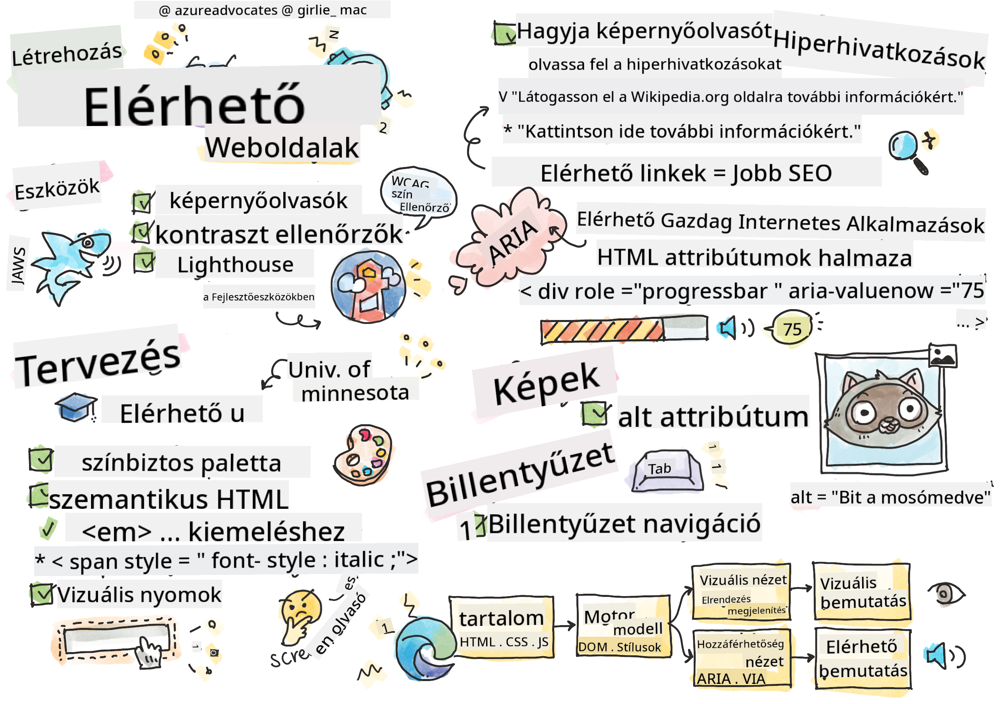

<!--
CO_OP_TRANSLATOR_METADATA:
{
  "original_hash": "e4cd5b1faed4adab5acf720f82798003",
  "translation_date": "2025-08-28T04:33:39+00:00",
  "source_file": "1-getting-started-lessons/3-accessibility/README.md",
  "language_code": "hu"
}
-->
# Hozzáférhető weboldalak létrehozása


> Sketchnote készítette: [Tomomi Imura](https://twitter.com/girlie_mac)

## Előadás előtti kvíz
[Előadás előtti kvíz](https://ff-quizzes.netlify.app/web/quiz/5)

> Az internet ereje az egyetemességében rejlik. Az akadálymentes hozzáférés mindenki számára, a fogyatékosságtól függetlenül, alapvető fontosságú.
>
> \- Sir Timothy Berners-Lee, a W3C igazgatója és a világháló feltalálója

Ez az idézet tökéletesen rávilágít arra, hogy miért fontos akadálymentes weboldalakat készíteni. Egy alkalmazás, amely nem érhető el mindenki számára, definíció szerint kirekesztő. Webfejlesztőként mindig szem előtt kell tartanunk az akadálymentességet. Ha már a kezdetektől erre összpontosítunk, jó úton járunk afelé, hogy mindenki számára elérhetővé tegyük az általunk készített oldalakat. Ebben a leckében megismerheted azokat az eszközöket, amelyek segítenek az akadálymentesség biztosításában, és megtanulhatod, hogyan építsd be ezt a szemléletet a munkádba.

> Ezt a leckét elérheted a [Microsoft Learn](https://docs.microsoft.com/learn/modules/web-development-101/accessibility/?WT.mc_id=academic-77807-sagibbon) oldalán!

## Használható eszközök

### Képernyőolvasók

Az egyik legismertebb akadálymentességi eszköz a képernyőolvasó.

A [képernyőolvasók](https://en.wikipedia.org/wiki/Screen_reader) olyan kliensek, amelyeket leggyakrabban látássérültek használnak. Ahogyan időt szánunk arra, hogy a böngésző megfelelően közvetítse az általunk megosztani kívánt információkat, úgy arra is figyelnünk kell, hogy a képernyőolvasó is helyesen tegye ezt.

A legegyszerűbb formájában a képernyőolvasó felülről lefelé, hallhatóan olvassa fel az oldalt. Ha az oldal csak szövegből áll, az olvasó hasonló módon közvetíti az információkat, mint egy böngésző. Természetesen a weboldalak ritkán állnak csupán szövegből; tartalmazhatnak linkeket, grafikákat, színeket és más vizuális elemeket. Gondoskodni kell arról, hogy ezeket az információkat a képernyőolvasó helyesen olvassa fel.

Minden webfejlesztőnek érdemes megismerkednie egy képernyőolvasóval. Ahogyan ismered a böngészők működését, úgy a képernyőolvasók működését is meg kell tanulnod. Szerencsére a legtöbb operációs rendszerbe beépítve található képernyőolvasó.

Néhány böngészőben beépített eszközök és bővítmények is találhatók, amelyek képesek szöveget felolvasni, vagy alapvető navigációs funkciókat biztosítani, például [ezek az Edge böngésző akadálymentességi eszközei](https://support.microsoft.com/help/4000734/microsoft-edge-accessibility-features). Ezek szintén fontos akadálymentességi eszközök, de működésük jelentősen eltér a képernyőolvasóktól, és nem szabad őket képernyőolvasó-tesztelő eszközökkel összetéveszteni.

✅ Próbálj ki egy képernyőolvasót és egy böngésző szövegfelolvasót. Windows rendszeren a [Narrátor](https://support.microsoft.com/windows/complete-guide-to-narrator-e4397a0d-ef4f-b386-d8ae-c172f109bdb1/?WT.mc_id=academic-77807-sagibbon) alapértelmezetten elérhető, de telepíthető a [JAWS](https://webaim.org/articles/jaws/) és az [NVDA](https://www.nvaccess.org/about-nvda/) is. macOS-en és iOS-en a [VoiceOver](https://support.apple.com/guide/voiceover/welcome/10) alapértelmezetten elérhető.

### Nagyítás

A látássérültek által gyakran használt másik eszköz a nagyítás. A legegyszerűbb típus a statikus nagyítás, amelyet a `Control + plusz jel (+)` billentyűkombinációval vagy a képernyőfelbontás csökkentésével lehet vezérelni. Ez a nagyítás az egész oldalt átméretezi, ezért fontos a [reszponzív dizájn](https://developer.mozilla.org/docs/Learn/CSS/CSS_layout/Responsive_Design) alkalmazása, hogy a felhasználói élmény nagyított nézetben is megfelelő legyen.

Egy másik típusú nagyítás speciális szoftvereket használ, amelyek a képernyő egy adott területét nagyítják fel, és pásztáznak, hasonlóan egy valódi nagyítóhoz. Windows rendszeren a [Nagyító](https://support.microsoft.com/windows/use-magnifier-to-make-things-on-the-screen-easier-to-see-414948ba-8b1c-d3bd-8615-0e5e32204198) beépített eszköz, míg a [ZoomText](https://www.freedomscientific.com/training/zoomtext/getting-started/) egy harmadik féltől származó nagyítószoftver, amely több funkcióval és nagyobb felhasználói bázissal rendelkezik. macOS-en és iOS-en a beépített nagyítószoftver neve [Zoom](https://www.apple.com/accessibility/mac/vision/).

### Kontrasztellenőrzők

A weboldalak színeit gondosan kell megválasztani, hogy megfeleljenek a színtévesztők vagy a gyenge kontrasztú színeket nehezen látók igényeinek.

✅ Tesztelj egy általad kedvelt weboldalt a színek használatára egy böngészőbővítménnyel, például a [WCAG színellenőrzőjével](https://microsoftedge.microsoft.com/addons/detail/wcag-color-contrast-check/idahaggnlnekelhgplklhfpchbfdmkjp?hl=en-US&WT.mc_id=academic-77807-sagibbon). Mit tanultál?

### Lighthouse

A böngésződ fejlesztői eszközei között megtalálod a Lighthouse eszközt. Ez az eszköz fontos, hogy első ránézésre felmérd egy weboldal akadálymentességét (és más elemzéseket is végez). Bár nem szabad kizárólag a Lighthouse-ra hagyatkozni, egy 100%-os eredmény jó kiindulópont.

✅ Keresd meg a Lighthouse-t a böngésződ fejlesztői eszközei között, és futtass elemzést bármelyik weboldalon. Mit fedeztél fel?

## Akadálymentes tervezés

Az akadálymentesség viszonylag nagy téma. Segítségképpen számos forrás áll rendelkezésre.

- [Accessible U - University of Minnesota](https://accessibility.umn.edu/your-role/web-developers)

Bár nem tudunk minden aspektust lefedni az akadálymentes oldalak létrehozásával kapcsolatban, az alábbiakban néhány alapvető elvet ismertetünk, amelyeket érdemes megvalósítani. Egy akadálymentes oldal megtervezése a kezdetektől **mindig** könnyebb, mint egy meglévő oldal utólagos akadálymentesítése.

## Jó megjelenítési elvek

### Színhelyes paletták

Az emberek különböző módon látják a világot, beleértve a színeket is. Amikor színsémát választasz az oldaladhoz, győződj meg róla, hogy az mindenki számára hozzáférhető. Egy nagyszerű [eszköz színpaletták generálásához a Color Safe](http://colorsafe.co/).

✅ Azonosíts egy weboldalt, amely nagyon problémás a színek használatában. Miért?

### Használj megfelelő HTML-t

A CSS és a JavaScript segítségével bármelyik elem bármilyen vezérlőelemmé alakítható. Egy `<span>` lehet egy `<button>`, és egy `<b>` válhat hiperhivatkozássá. Bár ez egyszerűbbé teheti a stílusozást, semmit sem közvetít a képernyőolvasók számára. Használj megfelelő HTML-t, amikor vezérlőelemeket hozol létre egy oldalon. Ha hiperhivatkozást szeretnél, használj `<a>` elemet. A megfelelő HTML használata a megfelelő vezérlőhöz a szemantikus HTML alkalmazásának nevezik.

✅ Látogass el bármelyik weboldalra, és nézd meg, hogy a tervezők és fejlesztők megfelelően használják-e a HTML-t. Találsz olyan gombot, amelynek linknek kellene lennie? Tipp: kattints jobb gombbal, és válaszd a 'Forrás megtekintése' lehetőséget a böngésződben, hogy megnézd az alapul szolgáló kódot.

### Készíts leíró címsorhierarchiát

A képernyőolvasó felhasználók [nagyban támaszkodnak a címsorokra](https://webaim.org/projects/screenreadersurvey8/#finding), hogy információkat találjanak és navigáljanak egy oldalon. A leíró címsortartalom írása és a szemantikus címsorcímkék használata fontos az egyszerűen navigálható oldalak létrehozásához a képernyőolvasó felhasználók számára.

### Használj jó vizuális jeleket

A CSS teljes irányítást biztosít az oldal bármely elemének megjelenése felett. Létrehozhatsz szövegdobozokat körvonal nélkül, vagy hiperhivatkozásokat aláhúzás nélkül. Sajnos ezeknek a jeleknek az eltávolítása megnehezítheti azok felismerését azok számára, akik ezekre támaszkodnak.

## A link szövegének fontossága

A hiperhivatkozások alapvető fontosságúak az interneten való navigációhoz. Ezért biztosítani kell, hogy a képernyőolvasók megfelelően olvassák fel a linkeket, hogy minden felhasználó navigálhasson az oldaladon.

### Képernyőolvasók és linkek

Ahogy várható, a képernyőolvasók ugyanúgy olvassák a link szövegét, mint az oldal bármely más szövegét. Ezt szem előtt tartva az alábbi példák elfogadhatónak tűnhetnek.

> A kis pingvin, más néven tündérpingvin, a világ legkisebb pingvinje. [Kattints ide](https://en.wikipedia.org/wiki/Little_penguin) további információkért.

> A kis pingvin, más néven tündérpingvin, a világ legkisebb pingvinje. Látogasd meg a https://en.wikipedia.org/wiki/Little_penguin oldalt további információkért.

> **MEGJEGYZÉS** Ahogy hamarosan olvasni fogod, **soha** ne hozz létre linkeket, amelyek úgy néznek ki, mint a fenti példák.

Ne feledd, hogy a képernyőolvasók más interfészek, mint a böngészők, és más funkciókkal rendelkeznek.

### A probléma az URL használatával

A képernyőolvasók felolvassák a szöveget. Ha egy URL megjelenik a szövegben, a képernyőolvasó felolvassa az URL-t. Általában az URL nem közvetít értelmes információt, és zavaró lehet. Talán már tapasztaltad ezt, ha a telefonod valaha hangosan felolvasott egy URL-t tartalmazó szöveges üzenetet.

### A probléma a "kattints ide" használatával

A képernyőolvasók képesek csak a hiperhivatkozásokat felolvasni egy oldalon, hasonlóan ahhoz, ahogy egy látó ember átfutja az oldalt linkek után kutatva. Ha a link szövege mindig "kattints ide", a felhasználó csak annyit hall, hogy "kattints ide, kattints ide, kattints ide, kattints ide, kattints ide, ...". Az összes link megkülönböztethetetlenné válik egymástól.

### Jó link szöveg

A jó link szöveg röviden leírja, hogy mi található a link másik oldalán. Az előző példában, amely a kis pingvinekről szól, a link a faj Wikipedia-oldalára mutat. A *kis pingvinek* kifejezés tökéletes link szöveg lenne, mivel egyértelművé teszi, hogy mit tudhat meg valaki, ha rákattint a linkre - a kis pingvinekről.

> A [kis pingvin](https://en.wikipedia.org/wiki/Little_penguin), más néven tündérpingvin, a világ legkisebb pingvinje.

✅ Böngéssz az interneten néhány percig, hogy találj oldalakat, amelyek homályos linkelési stratégiákat használnak. Hasonlítsd össze őket más, jobban linkelt oldalakkal. Mit tanultál?

#### Keresőmotorok megjegyzései

Az akadálymentesség biztosításával nemcsak a felhasználóknak segítesz, hanem a keresőmotoroknak is, hogy könnyebben navigáljanak az oldaladon. A keresőmotorok a link szövegét használják az oldalak témáinak megértéséhez. Tehát a jó link szöveg mindenki számára előnyös!

### ARIA

Képzeld el a következő oldalt:

| Termék       | Leírás            | Rendelés      |
| ------------ | ----------------- | ------------- |
| Widget       | [Leírás](../../../../1-getting-started-lessons/3-accessibility/')     | [Rendelés](../../../../1-getting-started-lessons/3-accessibility/') |
| Szuper widget | [Leírás](../../../../1-getting-started-lessons/3-accessibility/')     | [Rendelés](../../../../1-getting-started-lessons/3-accessibility/') |

Ebben a példában a leírás és rendelés szöveg ismétlése érthető egy böngészőt használó számára. Azonban egy képernyőolvasót használó személy csak a *leírás* és *rendelés* szavakat hallaná ismétlődve, kontextus nélkül.

Az ilyen helyzetek támogatására a HTML támogat egy attribútumkészletet, amelyet [Accessible Rich Internet Applications (ARIA)](https://developer.mozilla.org/docs/Web/Accessibility/ARIA) néven ismerünk. Ezek az attribútumok lehetővé teszik, hogy további információkat adj meg a képernyőolvasók számára.

> **MEGJEGYZÉS**: Mint sok más HTML-funkció esetében, a böngésző- és képernyőolvasó-támogatás változhat. Azonban a legtöbb főbb kliens támogatja az ARIA attribútumokat.

Az `aria-label` segítségével leírhatod a linket, ha az oldal formátuma nem teszi lehetővé. A widget leírása például így állítható be:

``` html
<a href="#" aria-label="Widget description">description</a>
```

✅ Általánosságban elmondható, hogy a fent leírt szemantikus jelölés használata előnyt élvez az ARIA használatával szemben, de néha nincs szemantikus megfelelője bizonyos HTML-widgeteknek. Jó példa erre egy fa (tree). Nincs HTML-egyenérték egy fához, ezért az ilyen elemeket egy általános `<div>`-ként azonosítod a megfelelő szerepkörrel és ARIA-értékekkel. Az [MDN ARIA dokumentációja](https://developer.mozilla.org/docs/Web/Accessibility/ARIA) további hasznos információkat tartalmaz.

```html
<h2 id="tree-label">File Viewer</h2>
<div role="tree" aria-labelledby="tree-label">
  <div role="treeitem" aria-expanded="false" tabindex="0">Uploads</div>
</div>
```

## Képek

Magától értetődik, hogy a képernyőolvasók nem tudják automatikusan elolvasni, mi van egy képen. A képek akadálymentessé tétele nem igényel sok munkát - erre való az `alt` attribútum. Minden jelentőséggel bíró képnek rendelkeznie kell egy `alt` attribútummal, amely leírja, hogy mi van rajta. 
A pusztán dekoratív képek `alt` attribútumát üres karakterláncra kell állítani: `alt=""`. Ez megakadályozza, hogy a képernyőolvasók feleslegesen bejelentsék a dekoratív képet.

✅ Ahogy várható, a keresőmotorok sem képesek megérteni, mi van
Számos kormány rendelkezik törvényekkel az akadálymentességi követelményekről. Tájékozódj saját országod akadálymentességi törvényeiről. Mi tartozik ezek hatálya alá, és mi nem? Például [ez a kormányzati weboldal](https://accessibility.blog.gov.uk/).

## Feladat
 
[Elemezz egy nem akadálymentesített weboldalt](assignment.md)

Köszönet: [Turtle Ipsum](https://github.com/Instrument/semantic-html-sample) az Instrumenttől

---

**Felelősség kizárása**:  
Ez a dokumentum az AI fordítási szolgáltatás [Co-op Translator](https://github.com/Azure/co-op-translator) segítségével lett lefordítva. Bár törekszünk a pontosságra, kérjük, vegye figyelembe, hogy az automatikus fordítások hibákat vagy pontatlanságokat tartalmazhatnak. Az eredeti dokumentum az eredeti nyelvén tekintendő hiteles forrásnak. Kritikus információk esetén javasolt professzionális emberi fordítást igénybe venni. Nem vállalunk felelősséget az ebből a fordításból eredő félreértésekért vagy téves értelmezésekért.