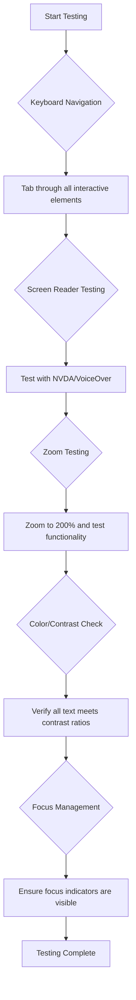
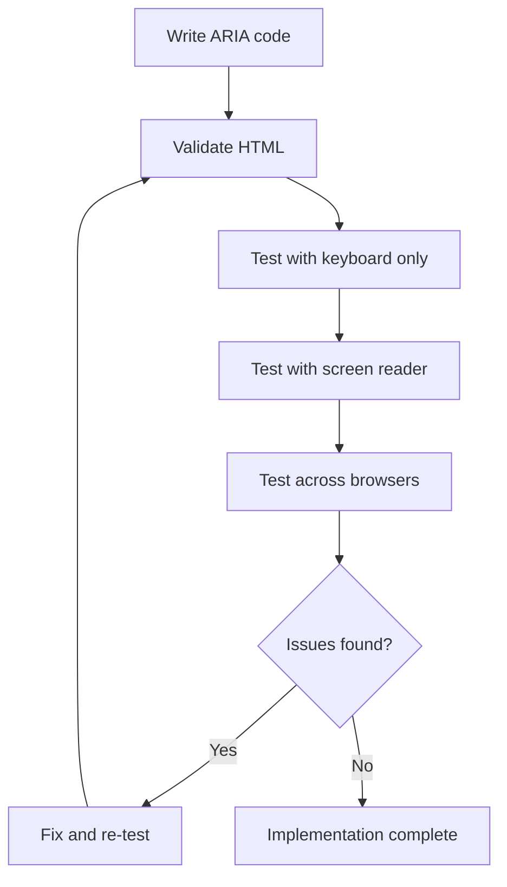

<!--
CO_OP_TRANSLATOR_METADATA:
{
  "original_hash": "90b19cde5b79b29e91babd3138cd8035",
  "translation_date": "2025-10-24T20:01:16+00:00",
  "source_file": "1-getting-started-lessons/3-accessibility/README.md",
  "language_code": "hu"
}
-->
# Hozzáférhető weboldalak létrehozása


> Sketchnote készítette: [Tomomi Imura](https://twitter.com/girlie_mac)

## Előadás előtti kvíz
[Előadás előtti kvíz](https://ff-quizzes.netlify.app/web/)

> A web ereje az egyetemességében rejlik. A hozzáférés mindenki számára, függetlenül a fogyatékosságtól, alapvető szempont.
>
> \- Sir Timothy Berners-Lee, a W3C igazgatója és a World Wide Web feltalálója

Van valami, ami meglephet: amikor hozzáférhető weboldalakat készítesz, nem csak a fogyatékkal élőknek segítesz – valójában mindenki számára jobbá teszed a webet!

Észrevetted már azokat a járdaszegélyeket az utcasarkokon? Eredetileg kerekesszékek számára tervezték őket, de most már segítenek a babakocsis embereknek, a szállítómunkásoknak, akik kézikocsit használnak, az utazóknak gurulós bőröndökkel, és a kerékpárosoknak is. Pontosan így működik a hozzáférhető webdesign – az egyik csoportot segítő megoldások gyakran mindenki számára előnyösek. Elég menő, igaz?

Ebben a leckében azt fogjuk megvizsgálni, hogyan lehet olyan weboldalakat létrehozni, amelyek valóban mindenki számára működnek, függetlenül attól, hogyan böngészik a webet. Felfedezhetsz gyakorlati technikákat, amelyek már beépültek a webes szabványokba, kipróbálhatsz tesztelő eszközöket, és megláthatod, hogyan teszi a hozzáférhetőség a weboldalakat minden felhasználó számára használhatóbbá.

A lecke végére magabiztosan tudod majd a hozzáférhetőséget természetes részévé tenni a fejlesztési munkafolyamatodnak. Készen állsz arra, hogy felfedezd, hogyan nyithatja meg a webet milliárdnyi felhasználó előtt az átgondolt tervezés? Merüljünk el benne!

> Ezt a leckét elérheted a [Microsoft Learn](https://docs.microsoft.com/learn/modules/web-development-101/accessibility/?WT.mc_id=academic-77807-sagibbon) oldalon!

## Az asszisztív technológiák megértése

Mielőtt belevágnánk a kódolásba, szánjunk egy pillanatot arra, hogy megértsük, hogyan tapasztalják meg a webet a különböző képességekkel rendelkező emberek. Ez nem csak elmélet – ezeknek a valós navigációs mintáknak a megértése sokkal jobb fejlesztővé tesz!

Az asszisztív technológiák lenyűgöző eszközök, amelyek segítenek a fogyatékkal élőknek a weboldalakkal való interakcióban, oly módon, ami meglephet téged. Ha egyszer megérted, hogyan működnek ezek a technológiák, a hozzáférhető webes élmények létrehozása sokkal intuitívabbá válik. Olyan, mintha megtanulnád a kódodat valaki más szemével látni.

### Képernyőolvasók

A [képernyőolvasók](https://en.wikipedia.org/wiki/Screen_reader) meglehetősen kifinomult technológiák, amelyek a digitális szöveget beszéddé vagy Braille kimenetté alakítják. Bár elsősorban látássérült emberek használják őket, rendkívül hasznosak tanulási nehézségekkel küzdő felhasználók, például diszlexiások számára is.

Úgy gondolok a képernyőolvasóra, mint egy nagyon okos narrátorra, aki könyvet olvas neked. Logikai sorrendben olvassa fel a tartalmat, bejelenti az interaktív elemeket, mint például "gomb" vagy "link", és billentyűparancsokat biztosít az oldal körüli navigációhoz. De van egy dolog – a képernyőolvasók csak akkor tudják elvégezni a varázslatukat, ha megfelelő struktúrával és értelmes tartalommal építjük fel a weboldalakat. Ez a te feladatod fejlesztőként!

**Népszerű képernyőolvasók különböző platformokon:**
- **Windows**: [NVDA](https://www.nvaccess.org/about-nvda/) (ingyenes és legnépszerűbb), [JAWS](https://webaim.org/articles/jaws/), [Narrator](https://support.microsoft.com/windows/complete-guide-to-narrator-e4397a0d-ef4f-b386-d8ae-c172f109bdb1/?WT.mc_id=academic-77807-sagibbon) (beépített)
- **macOS/iOS**: [VoiceOver](https://support.apple.com/guide/voiceover/welcome/10) (beépített és nagyon hatékony)
- **Android**: [TalkBack](https://support.google.com/accessibility/android/answer/6283677) (beépített)
- **Linux**: [Orca](https://wiki.gnome.org/Projects/Orca) (ingyenes és nyílt forráskódú)

**Hogyan navigálnak a képernyőolvasók a webes tartalomban:**

A képernyőolvasók többféle navigációs módszert kínálnak, amelyek hatékony böngészést tesznek lehetővé a tapasztalt felhasználók számára:
- **Szekvenciális olvasás**: Felülről lefelé olvassa a tartalmat, mint egy könyvet követve
- **Landmark navigáció**: Ugrás az oldal szekciói között (fejléc, navigáció, fő tartalom, lábléc)
- **Fejléc navigáció**: Ugrás a fejlécek között az oldal struktúrájának megértéséhez
- **Linkek listája**: Az összes link listájának generálása gyors hozzáféréshez
- **Űrlapvezérlők**: Közvetlen navigáció a beviteli mezők és gombok között

> 💡 **Egy érdekesség, ami lenyűgözött**: A képernyőolvasó felhasználók 68%-a elsősorban a fejlécek alapján navigál ([WebAIM felmérés](https://webaim.org/projects/screenreadersurvey9/#finding)). Ez azt jelenti, hogy a fejlécstruktúrád olyan, mint egy térkép a felhasználók számára – ha jól csinálod, szó szerint segítesz az embereknek gyorsabban megtalálni a tartalmadat!

### Tesztelési munkafolyamat kiépítése

Van egy jó hír – a hatékony hozzáférhetőségi tesztelés nem kell, hogy túlterhelő legyen! Érdemes kombinálni az automatizált eszközöket (nagyszerűek az egyértelmű problémák észlelésére) némi kézi teszteléssel. Íme egy rendszerezett megközelítés, amely a legtöbb problémát észleli anélkül, hogy az egész napodat felemésztené:

**Alapvető kézi tesztelési munkafolyamat:**



**Lépésről lépésre tesztelési ellenőrzőlista:**
1. **Billentyűzet navigáció**: Csak a Tab, Shift+Tab, Enter, Space és nyílbillentyűket használd
2. **Képernyőolvasó tesztelés**: Kapcsold be az NVDA-t, VoiceOver-t vagy Narrator-t, és navigálj csukott szemmel
3. **Zoom tesztelés**: Teszteld 200% és 400% nagyítási szinteken
4. **Színkontraszt ellenőrzés**: Ellenőrizd az összes szöveget és UI-komponenst
5. **Fókuszjelző tesztelés**: Győződj meg róla, hogy minden interaktív elemnek látható fókuszállapota van

✅ **Kezdd a Lighthouse-szal**: Nyisd meg a böngésződ DevTools-át, futtass egy Lighthouse hozzáférhetőségi auditot, majd használd az eredményeket a kézi tesztelési fókuszterületek irányítására.

### Zoom és nagyítási eszközök

Tudod, amikor néha nagyítasz a telefonodon, mert a szöveg túl kicsi, vagy hunyorogsz a laptop képernyőjén erős napfényben? Sok felhasználó napi szinten támaszkodik nagyítási eszközökre, hogy olvashatóvá tegye a tartalmat. Ez magában foglalja a gyengén látó embereket, az idősebb felnőtteket, és bárkit, aki valaha próbált weboldalt olvasni a szabadban.

A modern nagyítási technológiák túlmutatnak azon, hogy egyszerűen csak nagyobbá teszik a dolgokat. Ha megérted, hogyan működnek ezek az eszközök, olyan reszponzív dizájnokat hozhatsz létre, amelyek bármilyen nagyítási szinten funkcionálisak és vonzóak maradnak.

**Modern böngésző nagyítási képességek:**
- **Oldal nagyítás**: Minden tartalmat arányosan méretez (szöveg, képek, elrendezés) – ez az előnyben részesített módszer
- **Csak szöveg nagyítás**: Növeli a betűméretet, miközben megtartja az eredeti elrendezést
- **Csípéses nagyítás**: Mobil gesztus támogatás ideiglenes nagyításhoz
- **Böngésző támogatás**: Minden modern böngésző támogatja a nagyítást akár 500%-ig anélkül, hogy a funkcionalitás megszakadna

**Speciális nagyítási szoftverek:**
- **Windows**: [Magnifier](https://support.microsoft.com/windows/use-magnifier-to-make-things-on-the-screen-easier-to-see-414948ba-8b1c-d3bd-8615-0e5e32204198) (beépített), [ZoomText](https://www.freedomscientific.com/training/zoomtext/getting-started/)
- **macOS/iOS**: [Zoom](https://www.apple.com/accessibility/mac/vision/) (beépített, fejlett funkciókkal)

> ⚠️ **Tervezési szempont**: A WCAG megköveteli, hogy a tartalom 200%-os nagyításnál is funkcionális maradjon. Ezen a szinten a vízszintes görgetésnek minimálisnak kell lennie, és minden interaktív elemnek hozzáférhetőnek kell maradnia.

✅ **Teszteld a reszponzív dizájnodat**: Nagyítsd a böngésződet 200%-ra és 400%-ra. Az elrendezésed elegánsan alkalmazkodik? Még mindig hozzáférsz minden funkcióhoz túlzott görgetés nélkül?

## Modern hozzáférhetőségi tesztelő eszközök

Most, hogy megértetted, hogyan navigálnak az emberek a weben asszisztív technológiákkal, nézzük meg azokat az eszközöket, amelyek segítenek hozzáférhető weboldalak építésében és tesztelésében.

Gondolj rá így: az automatizált eszközök nagyszerűek az egyértelmű problémák (például hiányzó alt szöveg) észlelésére, míg a kézi tesztelés segít biztosítani, hogy a weboldalad a valós világban is jól használható legyen. Együtt magabiztosságot adnak, hogy a weboldalaid mindenki számára működnek.

### Színkontraszt tesztelés

Van egy jó hír: a színkontraszt az egyik leggyakoribb hozzáférhetőségi probléma, de egyben az egyik legkönnyebben javítható is. A jó kontraszt mindenki számára előnyös – a látássérült felhasználóktól kezdve azokig, akik a telefonjukat próbálják olvasni a strandon.

**WCAG kontraszt követelmények:**

| Szövegtípus | WCAG AA (Minimum) | WCAG AAA (Fokozott) |
|-------------|-------------------|---------------------|
| **Normál szöveg** (18pt alatt) | 4.5:1 kontraszt arány | 7:1 kontraszt arány |
| **Nagy szöveg** (18pt+ vagy 14pt+ félkövér) | 3:1 kontraszt arány | 4.5:1 kontraszt arány |
| **UI komponensek** (gombok, űrlapkeretek) | 3:1 kontraszt arány | 3:1 kontraszt arány |

**Alapvető tesztelő eszközök:**
- [Colour Contrast Analyser](https://www.tpgi.com/color-contrast-checker/) - Asztali alkalmazás színválasztóval
- [WebAIM Contrast Checker](https://webaim.org/resources/contrastchecker/) - Webalapú azonnali visszajelzéssel
- [Stark](https://www.getstark.co/) - Tervezőeszköz plugin Figma, Sketch, Adobe XD számára
- [Accessible Colors](https://accessible-colors.com/) - Hozzáférhető színpaletták keresése

✅ **Hozz létre jobb színpalettákat**: Kezdd a márkád színeivel, és használj kontraszt ellenőrzőket hozzáférhető variációk létrehozásához. Dokumentáld ezeket a tervezési rendszered hozzáférhető szín tokenjeiként.

### Átfogó hozzáférhetőségi auditálás

A leghatékonyabb hozzáférhetőségi tesztelés több megközelítést kombinál. Egyetlen eszköz sem talál meg mindent, így a különböző módszerekkel végzett tesztelési rutin biztosítja az alapos lefedettséget.

**Böngésző alapú tesztelés (beépítve a DevTools-ba):**
- **Chrome/Edge**: Lighthouse hozzáférhetőségi audit + Hozzáférhetőségi panel
- **Firefox**: Hozzáférhetőségi ellenőrző részletes fa nézettel
- **Safari**: Audit fül a Web Inspectorban VoiceOver szimulációval

**Professzionális tesztelő bővítmények:**
- [axe DevTools](https://www.deque.com/axe/devtools/) - Iparági szabvány automatizált tesztelés
- [WAVE](https://wave.webaim.org/extension/) - Vizualis visszajelzés hibakiemeléssel
- [Accessibility Insights](https://accessibilityinsights.io/) - Microsoft átfogó tesztelő csomagja

**Parancssoros és CI/CD integráció:**
- [axe-core](https://github.com/dequelabs/axe-core) - JavaScript könyvtár automatizált teszteléshez
- [Pa11y](https://pa11y.org/) - Parancssoros hozzáférhetőségi tesztelő eszköz
- [Lighthouse CI](https://github.com/GoogleChrome/lighthouse-ci) - Automatizált hozzáférhetőségi pontozás

> 🎯 **Tesztelési cél**: Törekedj egy 95+ Lighthouse hozzáférhetőségi pontszámra alapként. Ne feledd, az automatizált eszközök csak a hozzáférhetőségi problémák körülbelül 30-40%-át találják meg – a kézi tesztelés továbbra is elengedhetetlen!

## Hozzáférhetőség építése az alapoktól

A hozzáférhetőség sikerének kulcsa, hogy már az első naptól beépítsük az alapokba. Tudom, hogy csábító azt gondolni, hogy "később hozzáadom a hozzáférhetőséget", de ez olyan, mintha megpróbálnál rámpát építeni egy házhoz, miután már felépült. Lehetséges? Igen. Könnyű? Nem igazán.

Gondolj a hozzáférhetőségre, mint egy ház tervezésére – sokkal könnyebb a kerekesszékes hozzáférhetőséget beépíteni a kezdeti építészeti tervekbe, mint utólag mindent átalakítani.

### A POUR elvek: A hozzáférhetőség alapja

A Webes Tartalom Hozzáférhetőségi Irányelvek (WCAG) négy alapvető elvre épülnek, amelyek a POUR szót alkotják. Ne aggódj – ezek nem száraz akadémiai fogalmak
A színek erőteljesek a kommunikációban, de soha nem szabad, hogy csak színekkel közvetíts fontos információt. A színeken túlmutató tervezés robusztusabb, befogadóbb élményeket teremt, amelyek több helyzetben működnek.

**Tervezés színlátási különbségekre:**

Körülbelül a férfiak 8%-ának és a nők 0,5%-ának van valamilyen színlátási különbsége (gyakran "színtévesztésnek" nevezik). A leggyakoribb típusok:
- **Deuteranopia**: Nehézség a piros és zöld megkülönböztetésében
- **Protanopia**: A piros halványabbnak tűnik
- **Tritanopia**: Nehézség a kék és sárga megkülönböztetésében (ritka)

**Befogadó színstratégiák:**

```css
/* ❌ Bad: Using only color to indicate status */
.error { color: red; }
.success { color: green; }

/* ✅ Good: Color plus icons and context */
.error {
  color: #d32f2f;
  border-left: 4px solid #d32f2f;
}
.error::before {
  content: "⚠️";
  margin-right: 8px;
}

.success {
  color: #2e7d32;
  border-left: 4px solid #2e7d32;
}
.success::before {
  content: "✅";
  margin-right: 8px;
}
```

**A kontrasztkövetelményeken túl:**
- Teszteld színválasztásaid színtévesztés-szimulátorokkal
- Használj mintákat, textúrákat vagy formákat a színkódolás mellett
- Biztosítsd, hogy az interaktív állapotok szín nélkül is megkülönböztethetők legyenek
- Gondolj arra, hogyan néz ki a design magas kontrasztú módban

✅ **Teszteld a színek hozzáférhetőségét**: Használj eszközöket, mint például a [Coblis](https://www.color-blindness.com/coblis-color-blindness-simulator/), hogy megnézd, hogyan jelenik meg az oldalad különböző színlátási típusokkal rendelkező felhasználóknak.

### Fókuszjelzők és interakciótervezés

A fókuszjelzők a digitális kurzor megfelelői – megmutatják a billentyűzetet használó felhasználóknak, hogy hol vannak az oldalon. Jól megtervezett fókuszjelzők mindenki számára javítják az élményt, mivel egyértelművé és kiszámíthatóvá teszik az interakciókat.

**Modern fókuszjelzők legjobb gyakorlatai:**

```css
/* Enhanced focus styles that work across browsers */
button:focus-visible {
  outline: 2px solid #0066cc;
  outline-offset: 2px;
  box-shadow: 0 0 0 4px rgba(0, 102, 204, 0.25);
}

/* Remove focus outline for mouse users, preserve for keyboard users */
button:focus:not(:focus-visible) {
  outline: none;
}

/* Focus-within for complex components */
.card:focus-within {
  box-shadow: 0 0 0 3px rgba(74, 144, 164, 0.5);
  border-color: #4A90A4;
}

/* Ensure focus indicators meet contrast requirements */
.custom-focus:focus-visible {
  outline: 3px solid #ffffff;
  outline-offset: 2px;
  box-shadow: 0 0 0 6px #000000;
}
```

**Fókuszjelző követelmények:**
- **Láthatóság**: Legalább 3:1 kontrasztarány a környező elemekkel
- **Szélesség**: Minimum 2px vastagság az elem körül
- **Állandóság**: Láthatónak kell maradnia, amíg a fókusz máshová nem kerül
- **Megkülönböztetés**: Vizuálisan különböznie kell más UI állapotoktól

> 💡 **Tervezési tipp**: A nagyszerű fókuszjelzők gyakran kombinálják a körvonalat, box-shadow-t és színváltozásokat, hogy különböző hátterek és kontextusok között is láthatóak legyenek.

✅ **Auditáld a fókuszjelzőket**: Tab-bal navigálj végig az oldaladon, és jegyezd fel, mely elemeknek van egyértelmű fókuszjelzője. Van olyan, amelyik nehezen látható vagy teljesen hiányzik?

### Szemantikus HTML: A hozzáférhetőség alapja

A szemantikus HTML olyan, mintha segítő technológiáknak GPS-t adnál a weboldaladhoz. Ha a megfelelő HTML elemeket használod a rendeltetésüknek megfelelően, gyakorlatilag részletes térképet biztosítasz képernyőolvasóknak, billentyűzeteknek és más eszközöknek, hogy hatékonyan navigáljanak.

Egy analógia, ami igazán megvilágította számomra: a szemantikus HTML olyan, mint egy jól szervezett könyvtár, egyértelmű kategóriákkal és hasznos táblákkal, szemben egy raktárral, ahol a könyvek véletlenszerűen vannak szétszórva. Mindkét helyen ugyanazok a könyvek vannak, de melyikben próbálnál inkább keresni valamit? Pontosan!

**A hozzáférhető oldalstruktúra építőkövei:**

```html
<!-- Landmark elements provide page navigation structure -->
<header>
  <h1>Your Site Name</h1>
  <nav aria-label="Main navigation">
    <ul>
      <li><a href="/home">Home</a></li>
      <li><a href="/about">About</a></li>
      <li><a href="/services">Services</a></li>
    </ul>
  </nav>
</header>

<main>
  <article>
    <header>
      <h1>Article Title</h1>
      <p>Published on <time datetime="2024-10-14">October 14, 2024</time></p>
    </header>
    
    <section>
      <h2>First Section</h2>
      <p>Content that relates to this section...</p>
    </section>
    
    <section>
      <h2>Second Section</h2>
      <p>More related content...</p>
    </section>
  </article>
  
  <aside>
    <h2>Related Links</h2>
    <nav aria-label="Related articles">
      <ul>
        <li><a href="/related-1">First related article</a></li>
        <li><a href="/related-2">Second related article</a></li>
      </ul>
    </nav>
  </aside>
</main>

<footer>
  <p>&copy; 2024 Your Site Name. All rights reserved.</p>
  <nav aria-label="Footer links">
    <ul>
      <li><a href="/privacy">Privacy Policy</a></li>
      <li><a href="/contact">Contact Us</a></li>
    </ul>
  </nav>
</footer>
```

**Miért alakítja át a szemantikus HTML a hozzáférhetőséget:**

| Szemantikus elem | Cél | Képernyőolvasó előny |
|------------------|-----|---------------------|
| `<header>` | Oldal vagy szakasz fejléc | "Banner landmark" - gyors navigáció a tetejére |
| `<nav>` | Navigációs linkek | "Navigation landmark" - navigációs szakaszok listája |
| `<main>` | Elsődleges oldal tartalom | "Main landmark" - közvetlen ugrás a tartalomhoz |
| `<article>` | Önálló tartalom | Bejelenti az cikk határait |
| `<section>` | Tematikus tartalomcsoportok | Tartalmi struktúrát biztosít |
| `<aside>` | Kapcsolódó oldalsáv tartalom | "Complementary landmark" |
| `<footer>` | Oldal vagy szakasz lábléc | "Contentinfo landmark" |

**Képernyőolvasó szuperképességek szemantikus HTML-lel:**
- **Landmark navigáció**: Azonnali ugrás az oldal fő szakaszai között
- **Fejléc vázlatok**: Tartalomjegyzék generálása a fejlécstruktúrából
- **Elem listák**: Linkek, gombok vagy űrlapvezérlők listáinak létrehozása
- **Kontextus tudatosság**: Megérti a tartalmi szakaszok közötti kapcsolatokat

> 🎯 **Gyors teszt**: Próbáld meg navigálni az oldaladat képernyőolvasóval landmark gyorsbillentyűk (D landmarkhoz, H fejléchez, K linkhez NVDA/JAWS-ban) használatával. Logikusnak tűnik a navigáció?

✅ **Auditáld a szemantikus struktúrádat**: Használd a böngésződ DevTools hozzáférhetőségi paneljét, hogy megtekintsd a hozzáférhetőségi fát, és ellenőrizd, hogy a jelölésed logikus struktúrát hoz-e létre.

### Fejléc hierarchia: Logikus tartalomvázlat létrehozása

A fejlécek abszolút kulcsfontosságúak a hozzáférhető tartalomhoz – olyanok, mint a gerinc, amely mindent összetart. A képernyőolvasó felhasználók erősen támaszkodnak a fejlécekre, hogy megértsék és navigálják a tartalmat. Gondolj rá úgy, mint egy tartalomjegyzék biztosítására az oldaladhoz.

**Íme a fejlécek aranyszabálya:**
Soha ne hagyj ki szinteket. Mindig logikusan haladj `<h1>`-től `<h2>`-ig, `<h3>`-ig, és így tovább. Emlékszel, amikor iskolában vázlatokat készítettél? Pontosan ugyanaz az elv – nem ugornál "I. Fő pont"-ról közvetlenül "C. Al-alpont"-ra "A. Al-pont" nélkül, igaz?

**Tökéletes fejlécstruktúra példa:**

```html
<!-- ✅ Excellent: Logical, hierarchical progression -->
<main>
  <h1>Complete Guide to Web Accessibility</h1>
  
  <section>
    <h2>Understanding Screen Readers</h2>
    <p>Introduction to screen reader technology...</p>
    
    <h3>Popular Screen Reader Software</h3>
    <p>NVDA, JAWS, and VoiceOver comparison...</p>
    
    <h3>Testing with Screen Readers</h3>
    <p>Step-by-step testing instructions...</p>
  </section>
  
  <section>
    <h2>Color and Contrast Guidelines</h2>
    <p>Designing with sufficient contrast...</p>
    
    <h3>WCAG Contrast Requirements</h3>
    <p>Understanding the different contrast levels...</p>
    
    <h3>Testing Tools and Techniques</h3>
    <p>Tools for verifying contrast ratios...</p>
  </section>
</main>
```

```html
<!-- ❌ Problematic: Skipping levels, inconsistent structure -->
<h1>Page Title</h1>
<h3>Subsection</h3> <!-- Skipped h2 -->
<h2>This should come before h3</h2>
<h1>Another main heading?</h1> <!-- Multiple h1s -->
```

**Fejléc legjobb gyakorlatok:**
- **Egy `<h1>` oldalanként**: Általában az oldal fő címe vagy elsődleges tartalomfejléc
- **Logikus haladás**: Soha ne hagyj ki szinteket (h1 → h2 → h3, nem h1 → h3)
- **Leíró tartalom**: Tedd a fejléceket értelmessé, ha kontextus nélkül olvassák
- **Vizuális stílus CSS-sel**: Használj CSS-t a megjelenéshez, HTML szinteket a struktúrához

**Képernyőolvasó navigációs statisztikák:**
- A képernyőolvasó felhasználók 68%-a fejléc alapján navigál ([WebAIM felmérés](https://webaim.org/projects/screenreadersurvey9/#finding))
- A felhasználók logikus fejlécvázlatot várnak
- A fejlécek biztosítják a leggyorsabb módot az oldal struktúrájának megértésére

> 💡 **Profi tipp**: Használj böngészőbővítményeket, mint például a "HeadingsMap", hogy vizualizáld a fejlécstruktúrádat. Olyan legyen, mint egy jól szervezett tartalomjegyzék.

✅ **Teszteld a fejlécstruktúrádat**: Használj képernyőolvasó fejléc navigációt (H gomb NVDA-ban), hogy végigugorj a fejléceken. Logikusan meséli el a tartalom történetét?

### Fejlett vizuális hozzáférhetőségi technikák

A kontraszt és színek alapjain túl vannak kifinomult technikák, amelyek valóban befogadó vizuális élményeket teremtenek. Ezek a módszerek biztosítják, hogy a tartalom különböző megtekintési körülmények és segítő technológiák között is működjön.

**Alapvető vizuális kommunikációs stratégiák:**

- **Multimodális visszajelzés**: Kombináld a vizuális, szöveges és néha hangos jelzéseket
- **Progresszív feltárás**: Információ bemutatása emészthető részekben
- **Konzisztens interakciós minták**: Ismert UI konvenciók használata
- **Reszponzív tipográfia**: Szöveg méretezése eszközök között
- **Betöltési és hibastátuszok**: Egyértelmű visszajelzés minden felhasználói művelethez

**CSS segédprogramok a hozzáférhetőség fokozásához:**

```css
/* Screen reader only text - visually hidden but accessible */
.sr-only {
  position: absolute;
  width: 1px;
  height: 1px;
  padding: 0;
  margin: -1px;
  overflow: hidden;
  clip: rect(0, 0, 0, 0);
  white-space: nowrap;
  border: 0;
}

/* Skip link for keyboard navigation */
.skip-link {
  position: absolute;
  top: -40px;
  left: 6px;
  background: #000000;
  color: #ffffff;
  padding: 8px 16px;
  text-decoration: none;
  border-radius: 4px;
  font-weight: bold;
  transition: top 0.3s ease;
  z-index: 1000;
}

.skip-link:focus {
  top: 6px;
}

/* Reduced motion respect */
@media (prefers-reduced-motion: reduce) {
  .skip-link {
    transition: none;
  }
  
  * {
    animation-duration: 0.01ms !important;
    animation-iteration-count: 1 !important;
    transition-duration: 0.01ms !important;
  }
}

/* High contrast mode support */
@media (prefers-contrast: high) {
  .button {
    border: 2px solid;
  }
}
```

> 🎯 **Hozzáférhetőségi minta**: A "skip link" elengedhetetlen a billentyűzetet használók számára. Ez legyen az oldal első fókuszálható eleme, és ugorjon közvetlenül a fő tartalomterületre.

✅ **Valósítsd meg a skip navigációt**: Adj hozzá skip linkeket az oldalaidhoz, és teszteld őket úgy, hogy Tab-ot nyomsz, amint az oldal betöltődik. Meg kell jelenniük, és lehetővé kell tenniük, hogy a fő tartalomhoz ugorj.
5. **Kezdj egyszerűen**: A bonyolult ARIA megvalósítások nagyobb valószínűséggel tartalmaznak hibákat

**🔍 Tesztelési munkafolyamat:**



**🚫 Gyakori ARIA hibák, amelyeket el kell kerülni:**

- **Ellentmondó információk**: Ne mondj ellent a HTML szemantikának
- **Túlzott címkézés**: Túl sok ARIA információ megterheli a felhasználókat
- **Statikus ARIA**: Az ARIA állapotok frissítésének elfelejtése, amikor a tartalom változik
- **Nem tesztelt megvalósítások**: Az ARIA elméletben működik, de gyakorlatban nem
- **Hiányzó billentyűzet támogatás**: ARIA szerepek megfelelő billentyűzet interakciók nélkül

> 💡 **Tesztelési források**: Használj olyan eszközöket, mint az [accessibility-checker](https://www.npmjs.com/package/accessibility-checker) az ARIA automatikus validálásához, de mindig tesztelj valódi képernyőolvasókkal a teljes élmény érdekében.

✅ **Tanulj szakértőktől**: Tanulmányozd az [ARIA Authoring Practices Guide](https://w3c.github.io/aria-practices/) útmutatót, amely bevált mintákat és összetett interaktív widgetek megvalósításait tartalmazza.

## Képek és média hozzáférhetőségének biztosítása

A vizuális és hangalapú tartalom a modern webes élmények alapvető része, de akadályokat okozhat, ha nem gondosan valósítják meg. A cél az, hogy az információ és a média érzelmi hatása minden felhasználóhoz eljusson. Ha egyszer belejössz, természetessé válik.

A különböző típusú médiák eltérő hozzáférhetőségi megközelítést igényelnek. Olyan, mint a főzés—nem bánnál egy finom hallal ugyanúgy, mint egy kiadós steakkel. Ezeknek a különbségeknek a megértése segít a megfelelő megoldás kiválasztásában minden helyzetben.

### Stratégiai kép hozzáférhetőség

Minden kép a weboldaladon egy célt szolgál. Ennek a célnak a megértése segít jobb alternatív szöveget írni és befogadóbb élményeket teremteni.

**A képek négy típusa és az alt szöveg stratégiák:**

**Információs képek** - fontos információt közvetítenek:
```html

```

**Dekoratív képek** - pusztán vizuálisak, nincs információs értékük:
```html

```

**Funkcionális képek** - gombként vagy vezérlőként szolgálnak:
```html
<button>
  
</button>
```

**Összetett képek** - diagramok, infografikák:
```html

<div id="chart-description">
  <p>Detailed description: Sales data shows a steady increase across all quarters...</p>
</div>
```

### Videó és hang hozzáférhetőség

**Videó követelmények:**
- **Feliratok**: A beszélt tartalom és hanghatások szöveges változata
- **Hangos leírások**: A vizuális elemek narrációja vak felhasználók számára
- **Átiratok**: Az összes hang- és vizuális tartalom teljes szöveges változata

```html
<video controls>
  <source src="video.mp4" type="video/mp4">
  <track kind="captions" src="captions.vtt" srclang="en" label="English">
  <track kind="descriptions" src="descriptions.vtt" srclang="en" label="Audio descriptions">
</video>
```

**Hang követelmények:**
- **Átiratok**: Az összes beszélt tartalom szöveges változata
- **Vizuális jelzések**: Csak hangalapú tartalom esetén vizuális jelzéseket biztosíts

### Modern kép technikák

**Dekoratív képek használata CSS-sel:**
```css
.hero-section {
  background-image: url('decorative-hero.jpg');
  /* Decorative images in CSS don't need alt text */
}
```

**Reszponzív képek hozzáférhetőséggel:**
```html
<picture>
  <source media="(min-width: 800px)" srcset="large-chart.png">
  <source media="(min-width: 400px)" srcset="medium-chart.png">
  
</picture>
```

✅ **Teszteld a képek hozzáférhetőségét**: Használj képernyőolvasót egy képeket tartalmazó oldal navigálásához. Kapsz elég információt a tartalom megértéséhez?

## Billentyűzet navigáció és fókusz kezelés

Sok felhasználó kizárólag billentyűzettel navigál a weben. Ide tartoznak a motoros fogyatékossággal élők, azok a felhasználók, akik gyorsabbnak találják a billentyűzetet, mint az egeret, és bárki, akinek az egere nem működik. Az, hogy az oldalad jól működjön billentyűzet bemenettel, alapvető fontosságú, és gyakran mindenki számára hatékonyabbá teszi az oldaladat.

### Alapvető billentyűzet navigációs minták

**Standard billentyűzet interakciók:**
- **Tab**: Fókusz előre mozgatása az interaktív elemek között
- **Shift + Tab**: Fókusz visszafelé mozgatása
- **Enter**: Gombok és linkek aktiválása
- **Space**: Gombok aktiválása, jelölőnégyzetek bejelölése
- **Nyílbillentyűk**: Navigáció komponens csoportokon belül (rádiógombok, menük)
- **Escape**: Modális ablakok, legördülő menük bezárása vagy műveletek megszakítása

### Fókusz kezelés legjobb gyakorlatai

**Látható fókusz jelzők:**
```css
/* Ensure focus is always visible */
button:focus-visible {
  outline: 2px solid #4A90A4;
  outline-offset: 2px;
}

/* Custom focus styles for different components */
.card:focus-within {
  box-shadow: 0 0 0 3px rgba(74, 144, 164, 0.5);
}
```

**Átugró linkek a hatékony navigációhoz:**
```html
<a href="#main-content" class="skip-link">Skip to main content</a>
<a href="#navigation" class="skip-link">Skip to navigation</a>

<nav id="navigation">
  <!-- navigation content -->
</nav>
<main id="main-content">
  <!-- main content -->
</main>
```

**Megfelelő tab sorrend:**
```html
<!-- Use semantic HTML for natural tab order -->
<form>
  <label for="name">Name:</label>
  <input type="text" id="name" tabindex="0">
  
  <label for="email">Email:</label>
  <input type="email" id="email" tabindex="0">
  
  <button type="submit" tabindex="0">Submit</button>
</form>
```

### Fókusz csapdázása modális ablakokban

Modális párbeszédablakok megnyitásakor a fókuszt a modális ablakon belül kell tartani:

```javascript
// Modern focus trap implementation
function trapFocus(element) {
  const focusableElements = element.querySelectorAll(
    'button, [href], input, select, textarea, [tabindex]:not([tabindex="-1"])'
  );
  
  const firstElement = focusableElements[0];
  const lastElement = focusableElements[focusableElements.length - 1];

  element.addEventListener('keydown', (e) => {
    if (e.key === 'Tab') {
      if (e.shiftKey && document.activeElement === firstElement) {
        e.preventDefault();
        lastElement.focus();
      } else if (!e.shiftKey && document.activeElement === lastElement) {
        e.preventDefault();
        firstElement.focus();
      }
    }
    
    if (e.key === 'Escape') {
      closeModal();
    }
  });
  
  // Focus first element when modal opens
  firstElement.focus();
}
```

✅ **Teszteld a billentyűzet navigációt**: Próbáld meg csak a Tab billentyűvel navigálni az oldaladon. Elérheted az összes interaktív elemet? Logikus a fókusz sorrend? Jól láthatóak a fókusz jelzők?

## Űrlap hozzáférhetőség

Az űrlapok kritikusak a felhasználói interakcióhoz, és különös figyelmet igényelnek a hozzáférhetőség szempontjából.

### Címke és űrlap vezérlő társítás

**Minden űrlap vezérlőnek szüksége van egy címkére:**
```html
<!-- Explicit labeling (preferred) -->
<label for="username">Username:</label>
<input type="text" id="username" name="username" required>

<!-- Implicit labeling -->
<label>
  Password:
  <input type="password" name="password" required>
</label>

<!-- Using aria-label when visual label isn't desired -->
<input type="search" aria-label="Search products" placeholder="Search...">
```

### Hibakezelés és validáció

**Hozzáférhető hibaüzenetek:**
```html
<label for="email">Email Address:</label>
<input type="email" id="email" name="email" 
       aria-describedby="email-error" 
       aria-invalid="true" required>
<div id="email-error" role="alert">
  Please enter a valid email address
</div>
```

**Űrlap validáció legjobb gyakorlatai:**
- Használj `aria-invalid` attribútumot az érvénytelen mezők jelzésére
- Nyújts egyértelmű, specifikus hibaüzeneteket
- Használj `role="alert"` attribútumot fontos hiba bejelentésekhez
- Mutasd a hibákat azonnal és az űrlap beküldésekor is

### Mezőcsoportok és csoportosítás

**Kapcsolódó űrlap vezérlők csoportosítása:**
```html
<fieldset>
  <legend>Shipping Address</legend>
  <label for="street">Street Address:</label>
  <input type="text" id="street" name="street">
  
  <label for="city">City:</label>
  <input type="text" id="city" name="city">
</fieldset>

<fieldset>
  <legend>Preferred Contact Method</legend>
  <input type="radio" id="contact-email" name="contact" value="email">
  <label for="contact-email">Email</label>
  
  <input type="radio" id="contact-phone" name="contact" value="phone">
  <label for="contact-phone">Phone</label>
</fieldset>
```

## Az akadálymentességi utazásod: Főbb tanulságok

Gratulálunk! Most már megvan az alapvető tudásod ahhoz, hogy valóban befogadó webes élményeket hozz létre. Ez igazán izgalmas! Az akadálymentesség nem csak a megfelelőségi követelmények kipipálásáról szól—hanem arról, hogy felismerjük, milyen sokféleképpen lépnek kapcsolatba az emberek a digitális tartalommal, és ennek az elképesztő komplexitásnak a tervezéséről.

Most már egy növekvő fejlesztői közösség tagja vagy, amely megérti, hogy a nagyszerű tervezés mindenki számára működik. Üdv a klubban!

**🎯 Az akadálymentességi eszköztárad mostantól tartalmazza:**

| Alapelv | Megvalósítás | Hatás |
|---------|--------------|-------|
| **Szemantikus HTML alapok** | Használj megfelelő HTML elemeket a rendeltetésük szerint | A képernyőolvasók hatékonyan navigálhatnak, a billentyűzetek automatikusan működnek |
| **Befogadó vizuális tervezés** | Megfelelő kontraszt, jelentőségteljes színhasználat, látható fókusz jelzők | Mindenki számára érthető bármilyen fényviszony mellett |
| **Leíró tartalom** | Jelentőségteljes link szöveg, alt szöveg, címsorok | A felhasználók vizuális kontextus nélkül is megértik a tartalmat |
| **Billentyűzet hozzáférhetőség** | Tab sorrend, billentyűzet gyorsbillentyűk, fókusz kezelés | Motoros hozzáférhetőség és hatékonyabb használat |
| **ARIA fejlesztés** | Stratégiai használat a szemantikai hiányosságok kitöltésére | Összetett alkalmazások működnek segítő technológiákkal |
| **Átfogó tesztelés** | Automatikus eszközök + manuális ellenőrzés + valódi felhasználói tesztelés | Hibák elkapása, mielőtt hatással lennének a felhasználókra |

**🚀 Következő lépések:**

1. **Építsd be az akadálymentességet a munkafolyamatodba**: Tedd a tesztelést a fejlesztési folyamat természetes részévé
2. **Tanulj valódi felhasználóktól**: Kérj visszajelzést segítő technológiákat használó emberektől
3. **Maradj naprakész**: Az akadálymentességi technikák az új technológiákkal és szabványokkal fejlődnek
4. **Képviseld a befogadást**: Oszd meg tudásodat, és tedd az akadálymentességet csapat prioritássá

> 💡 **Ne feledd**: Az akadálymentességi korlátok gyakran innovatív, elegáns megoldásokhoz vezetnek, amelyek mindenki számára előnyösek. A járdaszegélyek, feliratok és hangvezérlés mind akadálymentességi funkcióként indultak, és mainstream fejlesztésekké váltak.

**Az üzleti érvek egyértelműek**: Az akadálymentes weboldalak több felhasználót érnek el, jobb helyezést érnek el a keresőmotorokban, alacsonyabb karbantartási költségekkel rendelkeznek, és elkerülik a jogi kockázatokat. De őszintén? Az igazi ok, amiért törődni kell az akadálymentességgel, sokkal mélyebb. Az akadálymentes weboldalak a web legjobb értékeit testesítik meg—nyitottságot, befogadást és azt az elképzelést, hogy mindenki megérdemli az információhoz való egyenlő hozzáférést.

Most már felkészültél arra, hogy megépítsd a jövő befogadó webjét. Minden akadálymentes oldal, amit létrehozol, barátságosabbá teszi az internetet mindenki számára. Ez igazán csodálatos, ha belegondolsz!

## További források

Folytasd az akadálymentességi tanulási utadat ezekkel az alapvető forrásokkal:

**📚 Hivatalos szabványok és irányelvek:**
- [WCAG 2.1 Guidelines](https://www.w3.org/WAI/WCAG21/quickref/) - A hivatalos akadálymentességi szabvány gyors referenciával
- [ARIA Authoring Practices Guide](https://w3c.github.io/aria-practices/) - Átfogó minták interaktív widgetekhez
- [WebAIM Guidelines](https://webaim.org/) - Gyakorlati, kezdőbarát akadálymentességi útmutató

**🛠️ Eszközök és tesztelési források:**
- [axe DevTools](https://www.deque.com/axe/devtools/) - Iparági szabvány akadálymentességi teszteléshez
- [A11y Project Checklist](https://www.a11yproject.com/checklist/) - Lépésről lépésre akadálymentességi ellenőrzés
- [Accessibility Insights](https://accessibilityinsights.io/) - Microsoft átfogó tesztelési csomagja
- [Color Oracle](https://colororacle.org/) - Színvakság szimulátor tervezési teszteléshez

**🎓 Tanulás és közösség:**
- [WebAIM Screen Reader Survey](https://webaim.org/projects/screenreadersurvey9/) - Valódi felhasználói preferenciák és viselkedések
- [Inclusive Components](https://inclusive-components.design/) - Modern akadálymentes komponens minták
- [A11y Coffee](https://a11y.coffee/) - Gyors akadálymentességi tippek és betekintések
- [Web Accessibility Initiative (WAI)](https://www.w3.org/WAI/) - W3C átfogó akadálymentességi forrásai

**🎥 Gyakorlati tanulás:**
- [Accessibility Developer Guide](https://www.accessibility-developer-guide.com/) - Gyakorlati megvalósítási útmutató
- [Deque University](https://dequeuniversity.com/) - Professzionális akadálymentességi képzési kurzusok

## GitHub Copilot Agent Kihívás 🚀

Használd az Agent módot a következő kihívás teljesítéséhez:

**Leírás:** Hozz létre egy akadálymentes modális párbeszédablak komponenst, amely bemutatja a megfelelő fókusz kezelést, ARIA attribútumokat és billentyűzet navigációs mintákat.

**Feladat:** Készíts egy teljes modális párbeszédablak komponenst HTML, CSS és JavaScript segítségével, amely tartalmazza: megfelelő fókusz csapdázás, ESC billentyűvel való bezárás, kattintás kívül a bezáráshoz, ARIA attribútumok képernyőolvasókhoz, és látható fókusz jelzők. A modálisnak tartalmaznia kell egy űrlapot megfelelő címkékkel és hibakezeléssel. Biztosítsd, hogy a komponens megfeleljen a WCAG 2.1 AA szabványoknak.

## 🚀 Kihívás

Vedd ezt a HTML-t, és írd át, hogy a lehető legakadálymentesebb legyen, az általad tanult stratégiák alapján.

```html
<!DOCTYPE html>
<html lang="en">
  <head>
    <meta charset="UTF-8">
    <meta name="viewport" content="width=device-width, initial-scale=1.0">
    <title>Turtle Ipsum - The World's Premier Turtle Fan Club</title>
    <link href='../assets/style.css' rel='stylesheet' type='text/css'>
  </head>
  <body>
    <header class="site-header">
      <h1 class="site-title">Turtle Ipsum</h1>
      <p class="site-subtitle">The World's Premier Turtle Fan Club</p>
    </header>
    
    <nav class="main-nav" aria-label="Main navigation">
      <h2 class="nav-header">Resources</h2>
      <ul class="nav-list">
        <li><a href="https://www.youtube.com/watch?v=CMNry4PE93Y">"I like turtles" video</a></li>
        <li><a href="https://en.wikipedia.org/wiki/Turtle">Basic turtle information</a></li>
        <li><a href="https://en.wikipedia.org/wiki/Turtles_(chocolate)">Chocolate turtles candy</a></li>
      </ul>
    </nav>
    
    <main class="main-content">
      <article>
        <h1>Welcome to Turtle Ipsum</h1>
        <p class="intro">
          <a href="/about">Learn more about our turtle community</a> and discover fascinating facts about these amazing creatures.
        </p>
        <p class="article-text">
          Turtle ipsum dolor sit amet, consectetur adipiscing elit, sed do eiusmod tempor incididunt ut labore et dolore magna aliqua. Ut enim ad minim veniam, quis nostrud exercitation ullamco laboris nisi ut aliquip ex ea commodo consequat. Duis aute irure dolor in reprehenderit in voluptate velit esse cillum dolore eu fugiat nulla pariatur. Excepteur sint occaecat cupidatat non proident, sunt in culpa qui officia deserunt mollit anim id est laborum.
        </p>
      </article>
    </main>
    
    <footer class="footer">
      <section class="newsletter-signup">
        <h2>Stay Updated</h2>
        <button type="button" onclick="showNewsletterForm()">Sign up for turtle news</button>
      </section>
      
      <nav class="footer-nav" aria-label="Footer navigation">
        <h2>Site Pages</h2>
        <ul>
          <li><a href="../">Home</a></li>
          <li><a href="../semantic">Semantic HTML example</a></li>
        </ul>
      </nav>
      
      <p class="footer-copyright">&copy; 2024 Instrument. All rights reserved.</p>
    </footer>
  </body>
</html>
```

**Kulcsfontosságú fejlesztések:**
- Megfelelő szemantikus HTML struktúra hozzáadása
- Címsor hierarchia javítása (egy h1, logikus sorrend)
- Jelentőségteljes link szöveg használata "kattints ide" helyett
- Megfelelő ARIA címkék hozzáadása a navigációhoz
- Lang attribútum és megfelelő meta címkék használata
- Gomb elem használata interaktív elemekhez
- Lábjegyzet tartalom strukturálása megfelelő tájékozódási pontokkal

## Előadás utáni kvíz
[Előadás utáni kvíz](https://ff-quizzes.netlify.app/web/en/)

## Áttekintés és önálló tanulás

Számos kormány rendelkezik törvényekkel az akadálymentességi követelményekről. Olvass utána saját országod akadálymentességi törvényeinek. Mi van lefedve, és mi nincs? Példa erre [ez a kormányzati weboldal](https://accessibility.blog.gov.uk/).

## Feladat
 
[Elemezz egy nem akadálymentes weboldalt](assignment.md)

Kreditek: [Turtle Ipsum](https://github.com/Instrument/semantic-html-sample) az Instrument által

---

**Felelősség kizárása**:  
Ez a dokumentum az [Co-op Translator](https://github.com/Azure/co-op-translator) AI fordítási szolgáltatás segítségével lett lefordítva. Bár törekszünk a pontosságra, kérjük, vegye figyelembe, hogy az automatikus fordítások hibákat vagy pontatlanságokat tartalmazhatnak. Az eredeti dokumentum az eredeti nyelvén tekintendő hiteles forrásnak. Kritikus információk esetén javasolt professzionális emberi fordítást igénybe venni. Nem vállalunk felelősséget semmilyen félreértésért vagy téves értelmezésért, amely a fordítás használatából eredhet.