<!--
CO_OP_TRANSLATOR_METADATA:
{
  "original_hash": "7f2c48e04754724123ea100a822765e5",
  "translation_date": "2026-01-07T03:10:19+00:00",
  "source_file": "1-getting-started-lessons/3-accessibility/README.md",
  "language_code": "hu"
}
-->
# Akadálymentes weboldalak készítése


> Sketchnote [Tomomi Imura](https://twitter.com/girlie_mac) műve

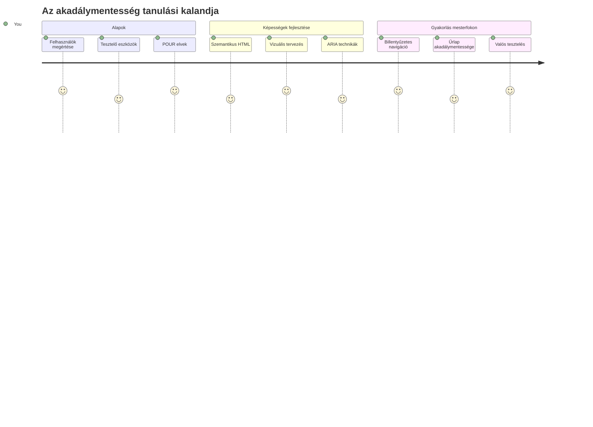
## Előadás előtti kvíz
[Előadás előtti kvíz](https://ff-quizzes.netlify.app/web/)

> A web ereje az egyetemességében rejlik. Az, hogy mindenki hozzáférhessen, függetlenül a fogyatékosságtól, alapvető szempont.
>
> \- Sir Timothy Berners-Lee, a W3C igazgatója és a Világháló feltalálója

Íme valami, ami meglephet: amikor akadálymentes weboldalakat készítesz, nem csak a fogyatékossággal élőknek segítesz — valójában jobbá teszed a webet mindenki számára!

Észrevetted már azokat a járdaszegély-lejtőket az utcák sarkainál? Eredetileg kerekesszékesek számára tervezték, de ma már babakocsisoknak, kéziszerszámokkal dolgozó futároknak, gurulós poggyásszal utazóknak és kerékpárosoknak is segítenek. Pont így működik az akadálymentes webdesign is — azok a megoldások, amelyek egy csoportnak segítenek, gyakran végül mindenki számára hasznosak lesznek. Elég menő, igaz?

Ebben az órában megvizsgáljuk, hogyan készíthetünk olyan weboldalakat, amelyek valóban mindenki számára működnek, bármilyen böngészési módot alkalmazzanak is. Felfedezheted a webes szabványokba beépített gyakorlati technikákat, kipróbálhatsz tesztelő eszközöket, és meglátod, miként teszi az akadálymentesség a weboldalaidat minden felhasználó számára használhatóbbá.

Az óra végére magabiztos leszel abban, hogy az akadálymentességet természetes részeként kezeld a fejlesztési munkafolyamataidnak. Készen állsz felfedezni, hogyan nyithatják meg az átgondolt tervezési döntések a webet milliárdok számára? Vágjunk bele!

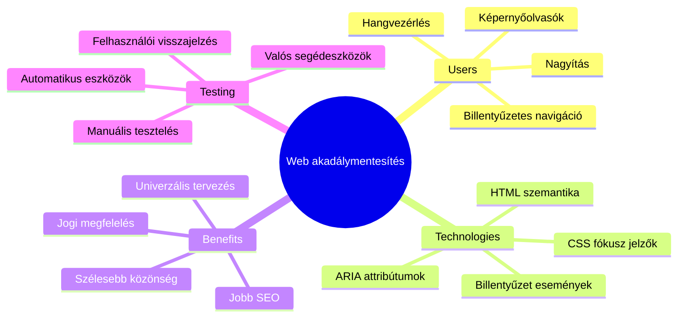
> Ezt az órát elvégezheted a [Microsoft Learn](https://docs.microsoft.com/learn/modules/web-development-101/accessibility/?WT.mc_id=academic-77807-sagibbon) oldalán is!

## Az asszisztív technológiák megértése

Mielőtt kódolásba kezdenénk, szánjunk egy percet arra, hogy megértsük, hogyan tapasztalják meg a webet különböző képességű emberek. Ez nem csak elmélet — ezeknek a valós navigációs mintáknak az ismerete sokkal jobb fejlesztővé tesz!

Az asszisztív technológiák igazán lenyűgöző eszközök, amelyek segítenek a fogyatékossággal élőknek úgy használni a weboldalakat, ami talán meglepő lehet. Amint megérted ezek működését, az akadálymentes webes élmények készítése jóval intuitívabbá válik. Olyan, mintha más szemén keresztül látnád a kódodat.

### Képernyőolvasók

A [képernyőolvasók](https://en.wikipedia.org/wiki/Screen_reader) elég kifinomult technológiák, melyek a digitális szöveget beszéddé vagy braille kimenetté alakítják. Habár elsősorban látássérültek használják őket, nagyon hasznosak a tanulási nehézségekkel, például diszlexiával küzdő felhasználók számára is.

Szeretem úgy elképzelni a képernyőolvasót, mint egy nagyon okos mesélőt, aki neked felolvassa a könyvet. Logikus sorrendben olvassa fel a tartalmat, bejelenti az interaktív elemeket, például „gomb” vagy „hivatkozás”, és lehetővé teszi a gyors billentyűparancsokat, hogy az oldalon könnyen mozogj. De az a lényeg, hogy a képernyőolvasók csak akkor tudják varázslatukat tenni, ha megfelelő szerkezetet és értelmes tartalmat építünk a weboldalakba. Itt jössz te képbe fejlesztőként!

**Népszerű képernyőolvasók különböző platformokon:**
- **Windows**: [NVDA](https://www.nvaccess.org/about-nvda/) (ingyenes és legnépszerűbb), [JAWS](https://webaim.org/articles/jaws/), [Narrator](https://support.microsoft.com/windows/complete-guide-to-narrator-e4397a0d-ef4f-b386-d8ae-c172f109bdb1/?WT.mc_id=academic-77807-sagibbon) (beépített)
- **macOS/iOS**: [VoiceOver](https://support.apple.com/guide/voiceover/welcome/10) (beépített és nagyon hatékony)
- **Android**: [TalkBack](https://support.google.com/accessibility/android/answer/6283677) (beépített)
- **Linux**: [Orca](https://wiki.gnome.org/Projects/Orca) (ingyenes és nyílt forráskódú)

**Hogyan navigálnak a képernyőolvasók webtartalmakon:**

A képernyőolvasók többféle navigációs módszert kínálnak, amelyek hatékony böngészést tesznek lehetővé a tapasztalt felhasználóknak:
- **Sorrendi olvasás**: A tartalmat fentről lefelé olvassa, mint egy könyvet
- **Jelölőpontok közötti navigáció**: Ugrás az oldal különböző részei (fejléc, navigáció, fő tartalom, lábléc) között
- **Címsorok közötti navigáció**: Címsorok közti ugrás a lap szerkezetének megértéséhez
- **Hivatkozások listája**: Az összes hivatkozás felsorolása gyors hozzáféréshez
- **Űrlap vezérlőelemei**: Közvetlen navigáció a bevitel mezők és gombok között

> 💡 **Valami, ami megfogott**: A képernyőolvasó felhasználók 68%-a elsősorban a címsorok segítségével navigál ([WebAIM felmérés](https://webaim.org/projects/screenreadersurvey9/#finding)). Ez azt jelenti, hogy a címsorszerkezet olyan, mint egy térkép a felhasználóknak — ha jól készíted el, szó szerint segítesz nekik gyorsabban eligazodni a tartalomban!

### A tesztelési munkafolyamat kialakítása

Van egy jó hírem — a hatékony akadálymentességi tesztelés nem kell, hogy túlterhelő legyen! Érdemes ötvözni az automatikus eszközöket (amelyek remekül fogják az egyértelmű hibákat) és a kézi tesztelést is. Íme egy rendszerezett módszer, amivel a legtöbb problémát tudod felfedezni anélkül, hogy az egész napodat felemésztené:

**Alapvető kézi tesztelési munkafolyamat:**

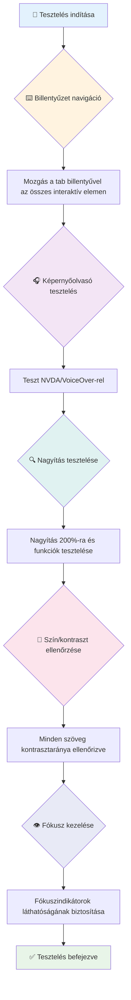
**Lépésenkénti tesztlista:**
1. **Billentyűzetes navigáció**: Csak Tab, Shift+Tab, Enter, Space és nyíl billentyűk használata
2. **Képernyőolvasó tesztelés**: Kapcsold be az NVDA, VoiceOver vagy Narrator programot és navigálj csukott szemmel
3. **Nagyítás tesztelés**: Teszteld 200%-os és 400%-os nagyítási szinteken
4. **Színkontraszt ellenőrzés**: Vizsgáld meg az összes szöveget és felületet
5. **Fókuszjelző tesztelés**: Győződj meg arról, hogy az összes interaktív elem jól látható fókuszállapottal rendelkezik

✅ **Kezdj Lighthouse-szal**: Nyisd meg a böngésződ fejlesztői eszközeit, futtass egy Lighthouse akadálymentességi auditot, majd használd az eredményeket a kézi tesztelési fókuszterületek meghatározásához.

### Nagyító és nagyítási eszközök

Ismered azt, amikor a telefonodon csippentve nagyítasz, mert a szöveg túl kicsi, vagy hunyorogsz a laptopod képernyője felé erős napsütésben? Sok felhasználó minden nap nagyító eszközökre támaszkodik, hogy olvashatóvá tegye a tartalmat. Ez magában foglalja az aliglátó embereket, az időseket és bárkit, aki valaha próbált egy weboldalt kültéren olvasni.

A modern nagyítási technológiák már túlmutatnak azon, hogy egyszerűen nagyobbá teszik a dolgokat. Megérteni, hogyan működnek ezek az eszközök, segít olyan reszponzív dizájnokat létrehozni, amelyek bármilyen nagyítás mellett is funkcionálisak és vonzóak maradnak.

**Modern böngészői nagyítási képességek:**
- **Oldal nagyítása**: Az összes tartalmat arányosan méretezi (szöveg, képek, elrendezés) – ez a preferált módszer
- **Csak szöveg nagyítása**: A betűméret növelése az eredeti elrendezés megtartásával
- **Csippentő nagyítás**: Mobil gesztus a ideiglenes nagyításhoz
- **Böngésző támogatás**: Minden modern böngésző támogatja az akár 500%-os nagyítást anélkül, hogy megtörné a funkcionalitást

**Speciális nagyító szoftverek:**
- **Windows**: [Nagyító](https://support.microsoft.com/windows/use-magnifier-to-make-things-on-the-screen-easier-to-see-414948ba-8b1c-d3bd-8615-0e5e32204198) (beépített), [ZoomText](https://www.freedomscientific.com/training/zoomtext/getting-started/)
- **macOS/iOS**: [Nagyító](https://www.apple.com/accessibility/mac/vision/) (beépített, fejlett funkciókkal)

> ⚠️ **Tervezési megfontolás**: A WCAG előírja, hogy a tartalom működőképes maradjon 200%-os nagyítás mellett. Ezen a szinten a vízszintes görgetés minimális legyen, és az összes interaktív elem legyen hozzáférhető.

✅ **Teszteld a reszponzív dizájnodat**: Nagyítsd a böngésződ 200%-ra és 400%-ra. Az elrendezés szépen alkalmazkodik? Minden funkció elérhető még túlzott görgetés nélkül?

## Modern akadálymentességi tesztelő eszközök

Most, hogy érted, hogyan navigálnak az emberek a weben asszisztív technológiákkal, nézzük meg a segítségül szolgáló eszközöket az akadálymentes weboldalak építésére és tesztelésére.

Gondolj úgy erre, hogy az automatikus eszközök jól fogják az egyértelmű hibákat (például hiányzó alt szöveg), míg a kézi tesztelés segít megbizonyosodni arról, hogy az oldal használata a való életben is kényelmes. Együtt magabiztosabbá tesznek abban, hogy a weboldalaid mindenki számára működnek.

### Színkontraszt tesztelés

Van egy jó hír: a színkontraszt az egyik leggyakoribb akadálymentességi probléma, de egyben az egyik legegyszerűbb is javítani. A jó kontraszt mindenkinek előnyös — a látássérültektől a strandon olvasgató telefonhasználókig.

**WCAG kontrasztkövetelmények:**

| Szöveg típusa | WCAG AA (Minimum) | WCAG AAA (Fokozott) |
|--------------|-------------------|---------------------|
| **Normál szöveg** (18pt alatt) | 4.5:1 kontrasztarány | 7:1 kontrasztarány |
| **Nagy szöveg** (18pt+ vagy 14pt+ félkövér) | 3:1 kontrasztarány | 4.5:1 kontrasztarány |
| **Felületi elemek** (gombok, űrlapszegélyek) | 3:1 kontrasztarány | 3:1 kontrasztarány |

**Alapvető tesztelő eszközök:**
- [Colour Contrast Analyser](https://www.tpgi.com/color-contrast-checker/) – Asztali alkalmazás színválasztóval
- [WebAIM Contrast Checker](https://webaim.org/resources/contrastchecker/) – Webes, azonnali visszajelzéssel
- [Stark](https://www.getstark.co/) – Tervező eszköz plugin Figma, Sketch, Adobe XD-hez
- [Accessible Colors](https://accessible-colors.com/) – Akadálymentes színpaletták keresése

✅ **Készíts jobb színpalettákat**: Kezdd a márkád színeivel, és használd a kontraszt ellenőrzőket akadálymentes variációk létrehozásához. Dokumentáld őket mint a dizájn rendszered akadálymentes színjegyeit.

### Átfogó akadálymentességi auditálás

A leghatékonyabb akadálymentességi tesztelés több megközelítés kombinációja. Egyetlen eszköz sem talál meg mindent, ezért egy tesztelési rutin összeállítása különböző módszerekkel biztosítja a teljes körű lefedettséget.

**Böngészőben elérhető tesztelés (beépítve a fejlesztői eszközökbe):**
- **Chrome/Edge**: Lighthouse akadálymentességi audit + Accessibility panel
- **Firefox**: Accessibility Inspector részletes fa nézettel
- **Safari**: Audit fül a Web Inspectorban VoiceOver szimulációval

**Professzionális tesztelő kiegészítők:**
- [axe DevTools](https://www.deque.com/axe/devtools/) – Iparági szabványú automatikus tesztelés
- [WAVE](https://wave.webaim.org/extension/) – Vizuális visszajelzés hibák kiemelésével
- [Accessibility Insights](https://accessibilityinsights.io/) – Microsoft komplex tesztelő eszközei

**Parancssori és CI/CD integráció:**
- [axe-core](https://github.com/dequelabs/axe-core) – JavaScript könyvtár automatizált teszteléshez
- [Pa11y](https://pa11y.org/) – Parancssori akadálymentességi tesztelő eszköz
- [Lighthouse CI](https://github.com/GoogleChrome/lighthouse-ci) – Automatikus akadálymentességi pontozás

> 🎯 **Tesztelési cél**: Tűzd ki, hogy a Lighthouse akadálymentességi pontszámod elérje a 95+ értéket. Ne feledd, az automatikus eszközök csak a hibák 30-40%-át találják meg – a kézi tesztelés továbbra is elengedhetetlen!

### 🧠 **Tesztelési készségek ellenőrzése: készen állsz, hogy hibákat találj?**

**Nézzük, hogyan érzed magad az akadálymentességi tesztelés kapcsán:**
- Melyik tesztelési módszer tűnik számodra a legmegközelíthetőbbnek most?
- El tudod képzelni, hogy egy teljes napot csak billentyűzettel navigálsz?
- Mi az az egy akadálymentességi akadály, amivel személyesen találkoztál már online?

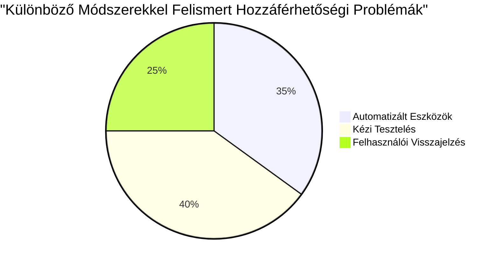
> **Magabiztosság növelő**: A profi akadálymentességi tesztelők pontosan ezt a módszerkombinációt használják. Te is az iparági szabványokat tanulod!

## Az akadálymentesség alapjainak megteremtése

Az akadálymentesség sikerének kulcsa, hogy már az alapoktól építsd be a fejlesztésbe. Tudom, hogy kísértő, hogy úgy gondold: „majd később hozzáadom az akadálymentességet”, de ez olyan, mintha egy lépcsős házhoz utólag próbálnál rámpát építeni. Lehetséges? Igen. Könnyű? Nem igazán.

Gondolj az akadálymentességre úgy, mint egy ház tervezésére — sokkal egyszerűbb már az eredeti építészeti tervbe beépíteni a kerekesszékes hozzáférhetőséget, mint utólag hozzáigazítani mindent.

### A POUR elvei: Az akadálymentességed alapja

A Webes Tartalom Akadálymentességi Irányelvek (WCAG) négy alapvető elven alapulnak, amelyek POUR-t alkotnak. Ne aggódj — ezek nem rideg elméleti fogalmak! Valójában nagyon gyakorlati útmutatók a mindenki számára használható tartalom készítéséhez.

Amint rászoksz a POUR szemléletre, az akadálymentességi döntéshozatal jóval intuitívabbá válik. Olyan, mintha egy mentális ellenőrző listád lenne, amely vezeti a tervezési választásaidat. Nézzük meg:

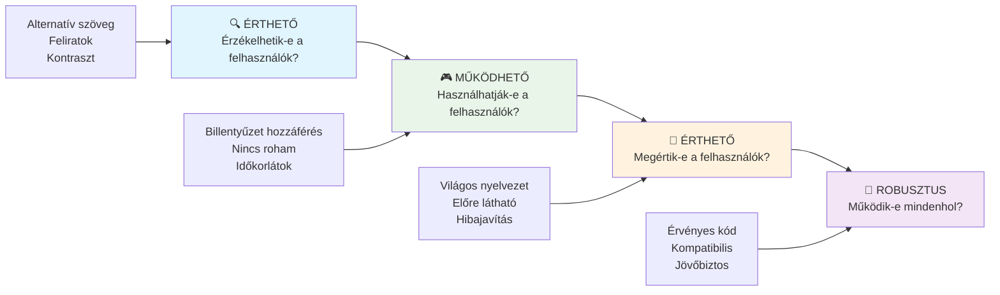
**🔍 Érzékelhető**: Az információnak oly módon kell megjelenni, hogy a felhasználók az elérhető érzékszerveiken keresztül érzékelhessék azt

- Szöveges alternatívákat biztosítani nem szöveges tartalmakhoz (képek, videók, hangok)
- Biztosítani kell a megfelelő színkontrasztot minden szöveg és felület esetén
- Feliratok és leiratok biztosítása multimédiás tartalmakhoz
- Olyan tartalmat tervezni, amely 200%-os nagyítás esetén is működik
- Több érzékszervi jellemző használata (nem csak a szín) az információ közvetítéséhez

**🎮 Használható**: Az összes felületi elemet működtetni kell az elérhető bevitel módokon keresztül

- Minden funkció elérhető legyen billentyűzetről történő navigációval
- Biztosítani kell a felhasználóknak elegendő időt az olvasásra és az interakcióra
- Elkerülni az olyan tartalmat, ami görcsöt vagy vestibuláris zavarokat okozhat
- Segíteni a hatékony navigációt világos szerkezettel és jelölőpontokkal
- Biztosítani, hogy az interaktív elemek célterülete megfelelő méretű legyen (minimum 44px)

**📖 Érthető**: Az információnak és a kezelőfelületnek egyértelműnek és könnyen érthetőnek kell lennie

- Egyértelmű, egyszerű nyelvhasználat a célközönség számára megfelelően
- Biztosítani, hogy a tartalom kiszámíthatóan, következetesen jelenjen meg és működjön
- Világos utasításokat és hibajelzéseket adni a felhasználói bevitelhez
- Segíteni a felhasználókat a hibák megértésében és javításában űrlapoknál
- Logikus olvasási sorrend és információs hierarchia alkalmazása

**💪 Robusztus**: A tartalomnak megbízhatóan működnie kell különböző technológiák és asszisztív eszközök esetén

- **Használj érvényes, szemantikus HTML-t alapként**
- **Biztosíts kompatibilitást a jelenlegi és jövőbeli asszisztív technológiákkal**
- **Kövess webes szabványokat és legjobb gyakorlatokat a jelölés készítésekor**
- **Teszteld különböző böngészőkben, eszközökön és segédeszközökkel**
- **Strukturáld úgy a tartalmat, hogy az fokozatosan degradálódjon, ha az fejlett funkciók nem támogatottak**

### 🎯 **POUR elvek ellenőrzése: Megjegyzés**

**Gyors reflektálás az alapokra:**
- Tudsz mondani olyan weboldal jellemzőt, ami egyik POUR elvet sem tart be?
- Melyik elv tűnik számodra legtermészetesebbnek fejlesztőként?
- Hogyan javíthatják ezek az elvek a tervezést mindenki számára, nem csak a fogyatékkal élőknek?

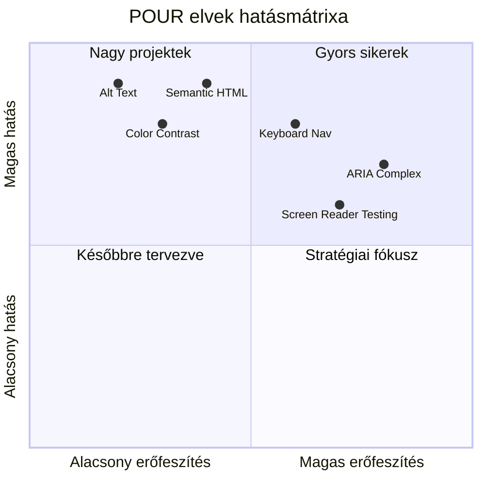
> **Emlékezz**: Kezdj magas hatású, alacsony erőfeszítésű javításokkal. A szemantikus HTML és az alt szöveg adja a legnagyobb akadálymentesítési előnyt a legkisebb erőfeszítéssel!

## Akadálymentes vizuális tervezés létrehozása

A jó vizuális tervezés és az akadálymentesség kéz a kézben jár. Ha akadálymentességet szem előtt tartva tervezel, gyakran fedezel fel tisztább, elegánsabb megoldásokat, amelyek minden felhasználónak előnyösek.

Vizsgáljuk meg, hogyan készíthetünk vizuálisan vonzó terveket, amelyek mindenki számára működnek, függetlenül attól, milyen látási képességekkel rendelkeznek vagy milyen körülmények között nézik a tartalmadat.

### Szín- és vizuális akadálymentességi stratégiák

A szín erős kommunikációs eszköz, de soha ne legyen az egyetlen módja a fontos információ átadásának. A színek túlmutató tervezés erősebb, befogadóbb élményeket hoz létre, amelyek több helyzetben működnek.

**Tervezés a színlátás különbségekhez:**

Körülbelül a férfiak 8%-ának és a nők 0,5%-ának van valamilyen színlátási különbsége (gyakran "színvakságnak" nevezik). A leggyakoribb típusok:
- **Deuteranopia**: Piros és zöld nehéz megkülönböztetése
- **Protanopia**: A piros halványabbnak tűnik
- **Tritanopia**: Kék és sárga felismerési nehézség (ritka)

**Befogadó színstratégiák:**

```css
/* ❌ Bad: Using only color to indicate status */
.error { color: red; }
.success { color: green; }

/* ✅ Good: Color plus icons and context */
.error {
  color: #d32f2f;
  border-left: 4px solid #d32f2f;
}
.error::before {
  content: "⚠️";
  margin-right: 8px;
}

.success {
  color: #2e7d32;
  border-left: 4px solid #2e7d32;
}
.success::before {
  content: "✅";
  margin-right: 8px;
}
```

**Alapvető kontraszt követelményeken túl:**
- Teszteld a színválasztásaidat színvakság szimulátorokkal
- Használj mintákat, textúrákat vagy formákat a szín mellett
- Biztosítsd, hogy az interaktív állapotok színtől függetlenül is megkülönböztethetőek legyenek
- Vedd figyelembe, hogyan néz ki a design magas kontraszt üzemmódban

✅ **Teszteld a szín akadálymentességet**: Használj eszközöket, mint a [Coblis](https://www.color-blindness.com/coblis-color-blindness-simulator/), hogy lásd, hogyan jelenik meg az oldalad különböző színlátású felhasználóknak.

### Fókuszjelzők és interakciótervezés

A fókuszjelzők a digitális kurzor megfelelői — megmutatják a billentyűzetet használóknak, hogy hol vannak az oldalon. A jól megtervezett fókuszjelzők mindenki élményét javítják azzal, hogy egyértelművé és kiszámíthatóvá teszik az interakciókat.

**Modern fókuszjelző legjobb gyakorlatok:**

```css
/* Enhanced focus styles that work across browsers */
button:focus-visible {
  outline: 2px solid #0066cc;
  outline-offset: 2px;
  box-shadow: 0 0 0 4px rgba(0, 102, 204, 0.25);
}

/* Remove focus outline for mouse users, preserve for keyboard users */
button:focus:not(:focus-visible) {
  outline: none;
}

/* Focus-within for complex components */
.card:focus-within {
  box-shadow: 0 0 0 3px rgba(74, 144, 164, 0.5);
  border-color: #4A90A4;
}

/* Ensure focus indicators meet contrast requirements */
.custom-focus:focus-visible {
  outline: 3px solid #ffffff;
  outline-offset: 2px;
  box-shadow: 0 0 0 6px #000000;
}
```

**Fókuszjelző követelmények:**
- **Láthatóság**: Legalább 3:1 kontrasztarány a környező elemekhez képest
- **Szélesség**: Minimum 2 px vastag a teljes elem körül
- **Tartósság**: Látható marad, amíg a fókusz el nem mozdul máshova
- **Megkülönböztetés**: Vizualisan különböznie kell más UI állapotoktól

> 💡 **Tervezési tipp**: A nagyszerű fókuszjelzők gyakran kombinálják a körvonalat, dobozárnyékot és színváltoztatást, hogy minden háttéren és kontextusban látható legyen.

✅ **Ellenőrizd a fókuszjelzőket**: Navigálj a weboldaladon Tab billentyűvel és jegyezd fel, mely elemeknek van egyértelmű fókuszjelzőjük. Vannak-e nehezen látható vagy teljesen hiányzó fókuszjelzők?

### Szemantikus HTML: az akadálymentesség alapja

A szemantikus HTML olyan, mint egy GPS rendszer a segítő technológiák számára a weboldaladon. Ha a megfelelő HTML elemeket használod a rendeltetésüknek megfelelően, akkor tulajdonképpen részletes térképet adsz a képernyőolvasóknak, billentyűzeteknek és más eszközöknek, hogy hatékonyan navigáljanak.

Íme egy analógia, ami nekem nagyon megfogta: a szemantikus HTML olyan, mintha egy jól szervezett könyvtárad lenne világos kategóriákkal és segítő táblákkal szemben egy raktárral, ahol a könyvek össze vannak dobálva. Mindkettőben megvannak ugyanazok a könyvek, de melyikben keresnél szívesebben valamit? Pontosan!

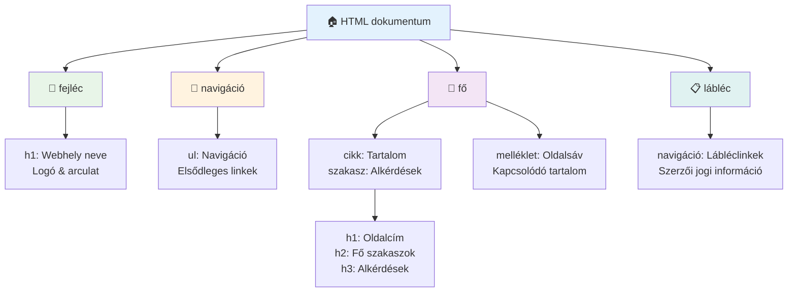
**Az akadálymentes oldalstruktúra építőkövei:**

```html
<!-- Landmark elements provide page navigation structure -->
<header>
  <h1>Your Site Name</h1>
  <nav aria-label="Main navigation">
    <ul>
      <li><a href="/home">Home</a></li>
      <li><a href="/about">About</a></li>
      <li><a href="/services">Services</a></li>
    </ul>
  </nav>
</header>

<main>
  <article>
    <header>
      <h1>Article Title</h1>
      <p>Published on <time datetime="2024-10-14">October 14, 2024</time></p>
    </header>
    
    <section>
      <h2>First Section</h2>
      <p>Content that relates to this section...</p>
    </section>
    
    <section>
      <h2>Second Section</h2>
      <p>More related content...</p>
    </section>
  </article>
  
  <aside>
    <h2>Related Links</h2>
    <nav aria-label="Related articles">
      <ul>
        <li><a href="/related-1">First related article</a></li>
        <li><a href="/related-2">Second related article</a></li>
      </ul>
    </nav>
  </aside>
</main>

<footer>
  <p>&copy; 2024 Your Site Name. All rights reserved.</p>
  <nav aria-label="Footer links">
    <ul>
      <li><a href="/privacy">Privacy Policy</a></li>
      <li><a href="/contact">Contact Us</a></li>
    </ul>
  </nav>
</footer>
```

**Miért alakítja át a szemantikus HTML az akadálymentességet:**

| Szemantikus Elem | Cél | Képernyőolvasó előny |
|------------------|-----|-----------------------|
| `<header>` | Oldal vagy szekció fejléc | "Banner látnivaló" - gyors navigáció a tetejére |
| `<nav>` | Navigációs linkek | "Navigációs látnivaló" - navigációs szekciók listája |
| `<main>` | Elsődleges oldal tartalom | "Fő látnivaló" - közvetlen ugrás a tartalomra |
| `<article>` | Önálló tartalom | Kijelöli a cikk határait |
| `<section>` | Témakörök tartalom | Tartalmi struktúrát biztosít |
| `<aside>` | Kapcsolódó oldalsáv tartalom | "Kiegészítő látnivaló" |
| `<footer>` | Oldal vagy szekció lábléc | "Tartalmi információ látnivaló" |

**Képernyőolvasó szuperképességek szemantikus HTML-lel:**
- **Látnivaló alapú navigáció**: Azonnal ugrás a főbb oldalrészek között
- **Címsorok vázlata**: Tartalomjegyzék generálása a címsorstruktúrából
- **Elem listák**: Minden link, gomb vagy űrlap vezérlő listája készítése
- **Kontekstus tudatosság**: Értelmezi a tartalmi szekciók közötti kapcsolatokat

> 🎯 **Gyors teszt**: Próbáld meg navigálni az oldalad képernyőolvasóval látnivaló gyorsbillentyűkkel (D látnivaló, H címsor, K link NVDA/JAWS alatt). Értelmes a navigáció?

### 🏗️ **Szemantikus HTML mesterellenőrzés: Erős alapok építése**

**Értékeljük a szemantikus tudásodat:**
- Fel tudod ismerni a látnivalókat egy oldalon csak az HTML alapján?
- Hogyan magyaráznád el egy barátnak a `<section>` és a `<div>` közötti különbséget?
- Mi az első dolog, amit megnéznél, ha egy képernyőolvasó felhasználó navigációs problémát jelentene?

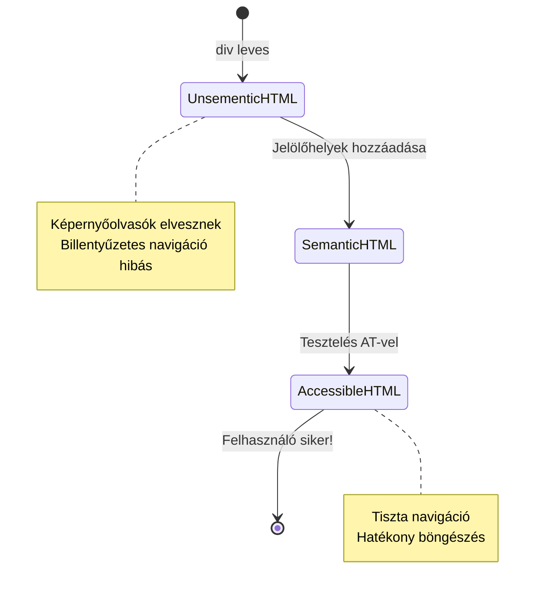
> **Professzionális tipp**: A jó szemantikus HTML automatikusan megoldja az akadálymentességi problémák kb. 70%-át. Ezt az alapot sajátítsd el jól, és jó úton vagy!

✅ **Ellenőrizd a szemantikus struktúrát**: Használd a böngésződ Fejlesztői eszközeiben az Akadálymentességi panelt az akadálymentességi fa megtekintéséhez, és győződj meg róla, hogy a markup logikus szerkezetet eredményez.

### Címsor hierarchia: Logikus tartalomvázlat készítése

A címsorok rendkívül fontosak az akadálymentes tartalomhoz — olyanok, mint a gerinc, ami mindent összetart. A képernyőolvasó felhasználók nagyban támaszkodnak a címsorokra a tartalom megértéséhez és navigálásához. Olyan, mintha tartalomjegyzéket adnál az oldaladhoz.

**Íme a fő szabály a címsorokhoz:**
Soha ne ugorj át szinteket. Mindig haladj logikusan `<h1>`-től `<h2>`-ig, majd `<h3>`-ig, és így tovább. Emlékszel amikor iskolában vázlatokat készítettél? Pont ugyanez az elv: nem ugrándoznál "I. Fő pont"-ról közvetlenül "C. Alpont-al-alponton"-ra "A. Alponton" nélkül, ugye?

**Tökéletes címsor struktúra példa:**

```html
<!-- ✅ Excellent: Logical, hierarchical progression -->
<main>
  <h1>Complete Guide to Web Accessibility</h1>
  
  <section>
    <h2>Understanding Screen Readers</h2>
    <p>Introduction to screen reader technology...</p>
    
    <h3>Popular Screen Reader Software</h3>
    <p>NVDA, JAWS, and VoiceOver comparison...</p>
    
    <h3>Testing with Screen Readers</h3>
    <p>Step-by-step testing instructions...</p>
  </section>
  
  <section>
    <h2>Color and Contrast Guidelines</h2>
    <p>Designing with sufficient contrast...</p>
    
    <h3>WCAG Contrast Requirements</h3>
    <p>Understanding the different contrast levels...</p>
    
    <h3>Testing Tools and Techniques</h3>
    <p>Tools for verifying contrast ratios...</p>
  </section>
</main>
```

```html
<!-- ❌ Problematic: Skipping levels, inconsistent structure -->
<h1>Page Title</h1>
<h3>Subsection</h3> <!-- Skipped h2 -->
<h2>This should come before h3</h2>
<h1>Another main heading?</h1> <!-- Multiple h1s -->
```

**Címsor legjobb gyakorlatok:**
- **Egy `<h1>` oldalanként**: Általában az oldal fő címe vagy elsődleges tartalmi címsora
- **Logikus előrehaladás**: Soha ne hagyj ki szinteket (h1 → h2 → h3, ne h1 → h3)
- **Értelmes tartalom**: A címsorok értelmesek legyenek, ha kontextus nélkül olvassák őket
- **Vizuális stílus CSS-sel**: Megjelenéshez CSS-t használj, a HTML szintjeit a szerkezethez

**Képernyőolvasó navigációs statisztikák:**
- A képernyőolvasó felhasználók 68%-a címsorok alapján navigál ([WebAIM felmérés](https://webaim.org/projects/screenreadersurvey9/#finding))
- A felhasználók logikus címsorvázlatot várnak el
- A címsorok adják az oldal szerkezetének leggyorsabb megértési módját

> 💡 **Professzionális tipp**: Használj böngésző kiegészítőket, például a "HeadingsMap"-et, hogy vizualizáld a címsor struktúrádat. Olyannak kell lennie, mint egy jól szervezett tartalomjegyzék.

✅ **Teszteld a címsor struktúrát**: Használj képernyőolvasó címsor navigációt (H billentyű NVDA-ben), hogy gyorsan ugorj a címsorok között. A haladás logikusan meséli el a tartalom történetét?

### Fejlett vizuális akadálymentességi technikák

A kontraszt és a szín alapjain túl vannak kifinomult technikák, amelyek valóban befogadó vizuális élményt hoznak létre. Ezek a módszerek biztosítják, hogy a tartalmad különböző megtekintési körülmények között és segédeszközökkel is működjön.

**Fontos vizuális kommunikációs stratégiák:**

- **Több módusú visszajelzés**: Kombináld a vizuális, szöveges és néha hang alapú jeleket
- **Fokozatos felfedés**: Tálald az információt könnyen emészthető darabokban
- **Konzisztens interakciós minták**: Használj ismerős UI konvenciókat
- **Reszponzív tipográfia**: Méretezd a szöveget eszközöktől függően
- **Betöltési és hibastátuszok**: Nyújts egyértelmű visszajelzést minden felhasználói művelethez

**CSS segédeszközök az akadálymentességhez:**

```css
/* Screen reader only text - visually hidden but accessible */
.sr-only {
  position: absolute;
  width: 1px;
  height: 1px;
  padding: 0;
  margin: -1px;
  overflow: hidden;
  clip: rect(0, 0, 0, 0);
  white-space: nowrap;
  border: 0;
}

/* Skip link for keyboard navigation */
.skip-link {
  position: absolute;
  top: -40px;
  left: 6px;
  background: #000000;
  color: #ffffff;
  padding: 8px 16px;
  text-decoration: none;
  border-radius: 4px;
  font-weight: bold;
  transition: top 0.3s ease;
  z-index: 1000;
}

.skip-link:focus {
  top: 6px;
}

/* Reduced motion respect */
@media (prefers-reduced-motion: reduce) {
  .skip-link {
    transition: none;
  }
  
  * {
    animation-duration: 0.01ms !important;
    animation-iteration-count: 1 !important;
    transition-duration: 0.01ms !important;
  }
}

/* High contrast mode support */
@media (prefers-contrast: high) {
  .button {
    border: 2px solid;
  }
}
```

> 🎯 **Akadálymentességi minta**: A "skip link" kulcsfontosságú a billentyűzetet használó felhasználók számára. Ennek kell lennie az oldal első fókuszálható elemének, és közvetlenül a fő tartalomra kell ugrania.

✅ **Valósítsd meg a ugró navigációt**: Adj hozzá skip linkeket az oldalakhoz és teszteld őket a Tab megnyomásával az oldal betöltésekor. Meg kell jelenniük és lehetővé kell tenniük a fő tartalomra ugrást.

## Értelmes link szöveg készítése

A linkek gyakorlatilag az internet autópályái, de a rosszul megírt link szöveg olyan, mintha olyan útjelző táblák lennének, amik csak annyit mondanak: "Hely", ahelyett hogy "Chicago belváros" lenne. Nem túl hasznos, igaz?

Valami, ami nagyon meglepett, amikor először tanultam: a képernyőolvasók ki tudják szedni az oldal összes linkjét és egy nagy listaként megmutatni. Képzeld el, ha valaki átadna neked egy címtárat az oldalad összes linkjével. Mindegyik értelmes lenne önmagában? Ez az a teszt, amin a link szövegnek át kell mennie!

### Link navigációs minták megértése

A képernyőolvasók erőteljes link navigációs funkciókat kínálnak, amelyek jó link szövegre épülnek:

**Link navigációs módok:**
- **Sorrendi olvasás**: A linkeket kontextusba helyezve olvassák, mint a tartalom részeit
- **Link lista generálás**: Az oldal összes linkjének kompakt kereshető listája
- **Gyors navigáció**: Ugrás linkek között billentyűparancsokkal (K NVDA-ben)
- **Keresés**: Konkrét linkek megtalálása részleges szöveg beírásával

**Miért számít a kontextus:**
Amikor képernyőolvasó felhasználók link listát generálnak, ilyesmit látnak:
- "Jelentés letöltése"
- "További információ"
- "Kattints ide"
- "Adatvédelmi szabályzat"
- "Kattints ide"

Csak két link ad hasznos információt kontextus nélkül!

> 📊 **Felhasználói hatás**: A képernyőolvasó felhasználók link listákat átnézve próbálják gyorsan érteni az oldal tartalmát. Az általános link szöveg miatt vissza kell menniük minden link kontextusához, ami jelentősen lassítja a böngészést.

### Elkerülendő gyakori link szöveg hibák

Az, hogy mit ne csináljunk, segít felismerni és javítani az akadálymentességi problémákat a már meglévő tartalomban.

**❌ Általános link szöveg, ami nem ad kontextust:**

```html
<!-- Meaningless when read from a link list -->
<p>Our sustainability efforts are detailed in our recent report. 
   <a href="/sustainability-2024.pdf">Click here</a> to view it.</p>

<!-- Repeated generic text throughout the page -->
<div class="article-card">
  <h3>Web Accessibility Guide</h3>
  <p>Learn the fundamentals...</p>
  <a href="/accessibility-guide">Read more</a>
</div>
<div class="article-card">
  <h3>Color Contrast Tips</h3>
  <p>Improve your design...</p>
  <a href="/color-contrast">Read more</a>
</div>

<!-- URLs as link text (difficult for screen readers to announce) -->
<p>Visit https://www.w3.org/WAI/WCAG21/quickref/ for WCAG guidelines.</p>

<!-- Vague action words -->
<a href="/contact">Go</a> | <a href="/about">See</a> | <a href="/help">View</a>
```

**Miért buknak el ezek a minták:**
- **"Kattints ide"** nem mond semmit a célról
- **"Olvass tovább"** többször ismételve zavaró
- **Nyers URL-ek** nehezen érthetőek és kiejthetőek képernyőolvasóval
- **Egyetlen szavak**, mint a "Menj" vagy "Nézd" leírás nélküli kontextus nélkül

### Kiváló link szöveg írása

A leíró link szöveg mindenkinek előnyös — látó felhasználó gyorsan átfuthatja a linkeket, képernyőolvasó felhasználó azonnal megérti a célt.

**✅ Tiszta, leíró link szöveg példák:**

```html
<!-- Descriptive text that explains the destination -->
<p>Our comprehensive <a href="/sustainability-2024.pdf">2024 sustainability report (PDF, 2.1MB)</a> details our environmental initiatives.</p>

<!-- Specific, unique link text for each card -->
<div class="article-card">
  <h3>Web Accessibility Guide</h3>
  <p>Learn the fundamentals of inclusive design...</p>
  <a href="/accessibility-guide">Read our complete web accessibility guide</a>
</div>
<div class="article-card">
  <h3>Color Contrast Tips</h3>
  <p>Improve your design with better color choices...</p>
  <a href="/color-contrast">Explore color contrast best practices</a>
</div>

<!-- Meaningful text instead of raw URLs -->
<p>The <a href="https://www.w3.org/WAI/WCAG21/quickref/">WCAG 2.1 Quick Reference guide</a> provides comprehensive accessibility guidelines.</p>

<!-- Descriptive action links -->
<a href="/contact">Contact our support team</a> | 
<a href="/about">About our company</a> | 
<a href="/help">Get help with your account</a>
```

**Link szöveg legjobb gyakorlatok:**
- **Légy specifikus**: "A negyedéves pénzügyi jelentés letöltése" vs. "Letöltés"
- **Tüntesd fel a fájl típusát és méretét**: "(PDF, 1,2MB)" letölthető fájloknál
- **Jelöld, ha a link külső ablakban nyílik meg**: "(új ablakban nyílik)" ahol szükséges
- **Használj aktív nyelvezetet**: "Lépj kapcsolatba velünk" vs. "Kapcsolat oldal"
- **Tartsd tömören**: Törekedj 2-8 szó között, ha lehetséges

### Fejlett link akadálymentességi minták

Néha a vizuális tervezési korlátok vagy technikai követelmények speciális megoldásokat igényelnek. Íme kifinomult technikák tipikus kihívásokra:

**ARIA használata a kontextus erősítésére:**

```html
<!-- When button text must be short but needs more context -->
<a href="/report.pdf" 
   aria-label="Download 2024 annual financial report, PDF format, 2.3MB">
  Download Report
</a>

<!-- When the full context comes from surrounding content -->
<h3 id="sustainability-heading">Sustainability Initiative</h3>
<p>Our efforts to reduce environmental impact...</p>
<a href="/sustainability-details" 
   aria-labelledby="sustainability-heading"
   aria-describedby="sustainability-summary">
  Learn more
</a>
<p id="sustainability-summary">Detailed breakdown of our 2024 environmental goals and achievements</p>
```

**Fájltípus és külső cél jelölése:**

```html
<!-- Method 1: Include information in visible link text -->
<a href="/annual-report.pdf">
  Download our 2024 annual report (PDF, 2.3MB)
</a>

<!-- Method 2: Use screen reader-only text for file details -->
<a href="/annual-report.pdf">
  Download our 2024 annual report
  <span class="sr-only">(PDF format, 2.3MB)</span>
</a>

<!-- Method 3: External link indication -->
<a href="https://example.com" 
   target="_blank" 
   aria-describedby="external-link-warning">
  Visit external resource
</a>
<span id="external-link-warning" class="sr-only">
  (opens in new window)
</span>

<!-- Method 4: Using CSS for visual indicators -->
<a href="https://example.com" class="external-link">
  External resource
</a>
```

```css
/* Visual indicator for external links */
.external-link::after {
  content: " ↗";
  font-size: 0.8em;
  color: #666;
}

/* Screen reader announcement for external links */
.external-link::before {
  content: "External link: ";
  position: absolute;
  left: -10000px;
  width: 1px;
  height: 1px;
  overflow: hidden;
}
```

> ⚠️ **Fontos**: Ha `target="_blank"`-et használsz, mindig tájékoztasd a felhasználókat, hogy a link új ablakban vagy fülön nyílik meg. A váratlan navigációváltozás zavaró lehet.

✅ **Teszteld a link kontextust**: Használd a böngésződ fejlesztői eszközeit, hogy készíts listát az oldal összes linkjéről. Érted az egyes linkek célját kontextus nélkül is?

## ARIA: HTML akadálymentesség felpörgetése

[Accessible Rich Internet Applications (ARIA)](https://developer.mozilla.org/docs/Web/Accessibility/ARIA) olyan, mint egy univerzális fordító a komplex webalkalmazásaid és a segítő technológiák között. Amikor a HTML önmagában nem képes kifejezni mindent, amit az interaktív komponenseid csinálnak, az ARIA lép be, hogy kitöltse ezeket a réseket.

Szeretem az ARIA-t úgy elképzelni, mint hasznos megjegyzéseket a HTML-edhez — olyasmi, mint a színpadi utasítások egy színdarabban, amik segítik a színészeket a szerepük és kapcsolataik megértésében.

**A legfontosabb szabály az ARIA kapcsán**: Mindig először használj szemantikus HTML-t, majd adj hozzá ARIA-t a javításhoz. Gondolj az ARIA-ra fűszerként, nem főételként. Javítania kell és kiegészítenie a HTML szerkezetet, soha nem helyettesítenie. Az alapot először jól csináld meg!

### Stratégiai ARIA alkalmazás

Az ARIA hatékony, de a hatalom felelősséggel jár. Hibás ARIA rosszabbá teheti az akadálymentességet, mint ha nem lenne ARIA. Íme, mikor és hogyan használd hatékonyan:

**✅ Használd az ARIA-t, amikor:**
- Egyedi interaktív vezérlőket készítesz (akkordions, fülek, karusszelek)
- Dinamikus tartalmat építesz, amely oldalfrissítés nélkül változik
- További kontextust adsz bonyolult UI kapcsolatokhoz
- Betöltési állapotokat vagy élő tartalom frissítéseket jelezel
- Alkalmazásszerű felületeket építesz egyedi vezérlőkkel

**❌ Kerüld az ARIA használatát, amikor:**
- A szabványos HTML elemek már megadják a szükséges szemantikát
- Nem vagy biztos a helyes implementációban
- Az információt megismétli, amit a szemantikus HTML már tartalmaz
- Nem tesztelted valódi segítő technológiával

> 🎯 **ARIA aranyszabály**: "Ne változtass szemantikán, hacsak nem muszáj, mindig biztosíts billentyűzetes hozzáférhetőséget, és tesztelj valós segédeszközzel."
**Az ARIA öt kategóriája:**

1. **Szerepek**: Mi ez az elem? (`button`, `tab`, `dialog`)
2. **Tulajdonságok**: Mik a jellemzői? (`aria-required`, `aria-haspopup`)
3. **Állapotok**: Mi az aktuális állapota? (`aria-expanded`, `aria-checked`)
4. **Térképek**: Hol helyezkedik el az oldal szerkezetében? (`banner`, `navigation`, `main`)
5. **Élő régiók**: Hogyan kell bejelenteni a változásokat? (`aria-live`, `aria-atomic`)

### Alapvető ARIA minták modern webalkalmazásokhoz

Ezek a minták megoldják az interaktív webalkalmazások leggyakoribb akadálymentesítési kihívásait:

**Elemerk elnevezése és leírása:**

```html
<!-- aria-label: Provides accessible name when visible text isn't sufficient -->
<button aria-label="Close newsletter subscription dialog">×</button>

<!-- aria-labelledby: References existing text as the accessible name -->
<section aria-labelledby="news-heading">
  <h2 id="news-heading">Latest News</h2>
  <!-- news content -->
</section>

<!-- aria-describedby: Links to additional descriptive text -->
<input type="password" 
       aria-describedby="pwd-requirements pwd-strength"
       required>
<div id="pwd-requirements">
  Password must contain at least 8 characters, including uppercase, lowercase, and numbers.
</div>
<div id="pwd-strength" aria-live="polite">
  <!-- Dynamic password strength indicator -->
</div>
```

**Élő régiók dinamikus tartalomhoz:**

```html
<!-- Polite announcements (don't interrupt current speech) -->
<div aria-live="polite" id="status-updates">
  <!-- Status messages appear here -->
</div>

<!-- Assertive announcements (interrupt and announce immediately) -->
<div aria-live="assertive" id="urgent-alerts">
  <!-- Error messages and critical alerts -->
</div>

<!-- Loading states with live regions -->
<button id="submit-btn" aria-describedby="loading-status">
  Submit Application
</button>
<div id="loading-status" aria-live="polite" aria-atomic="true">
  <!-- "Processing your application..." appears here -->
</div>
```

**Interaktív widget példa (accordion):**

```html
<div class="accordion">
  <h3>
    <button aria-expanded="false" 
            aria-controls="panel-1" 
            id="accordion-trigger-1"
            class="accordion-trigger">
      Accessibility Guidelines
    </button>
  </h3>
  <div id="panel-1" 
       role="region"
       aria-labelledby="accordion-trigger-1" 
       hidden>
    <p>WCAG 2.1 provides comprehensive guidelines...</p>
  </div>
</div>
```

```javascript
// JavaScript az akordeon állapotának kezelésére
function toggleAccordion(trigger) {
  const panel = document.getElementById(trigger.getAttribute('aria-controls'));
  const isExpanded = trigger.getAttribute('aria-expanded') === 'true';
  
  // Állapotok váltása
  trigger.setAttribute('aria-expanded', !isExpanded);
  panel.hidden = isExpanded;
  
  // Változás bejelentése képernyőolvasóknak
  const status = document.getElementById('status-updates');
  status.textContent = isExpanded ? 'Section collapsed' : 'Section expanded';
}
```

### ARIA megvalósítás legjobb gyakorlatai

Az ARIA hatékony, de gondos megvalósítást igényel. Ezek a irányelvek segítenek biztosítani, hogy az ARIA inkább javítsa, semmint akadályozza az akadálymentességet:

**🛡️ Alapelvek:**

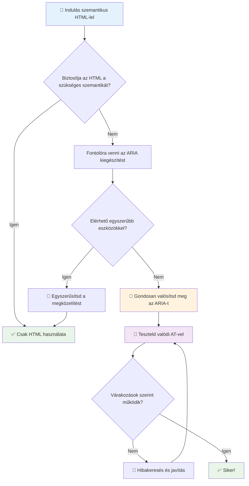
1. **Elsődlegesen szemantikus HTML**: Mindig részesítsd előnyben a `<button>` elemet a `<div role="button">` helyett
2. **Ne törj meg szemantikát**: Soha ne írj felül meglévő HTML jelentést (kerüld a `<h1 role="button">` használatát)
3. **Tartsd meg a billentyűzetes elérhetőséget**: Minden interaktív ARIA elemnek teljesen billentyűzetesen elérhetőnek kell lennie
4. **Tesztelj valós felhasználókkal**: Az ARIA támogatása jelentősen eltér a segédeszközök között
5. **Kezdj egyszerűen**: A bonyolult ARIA megvalósítások nagyobb valószínűséggel hibásak

**🔍 Tesztelési munkafolyamat:**

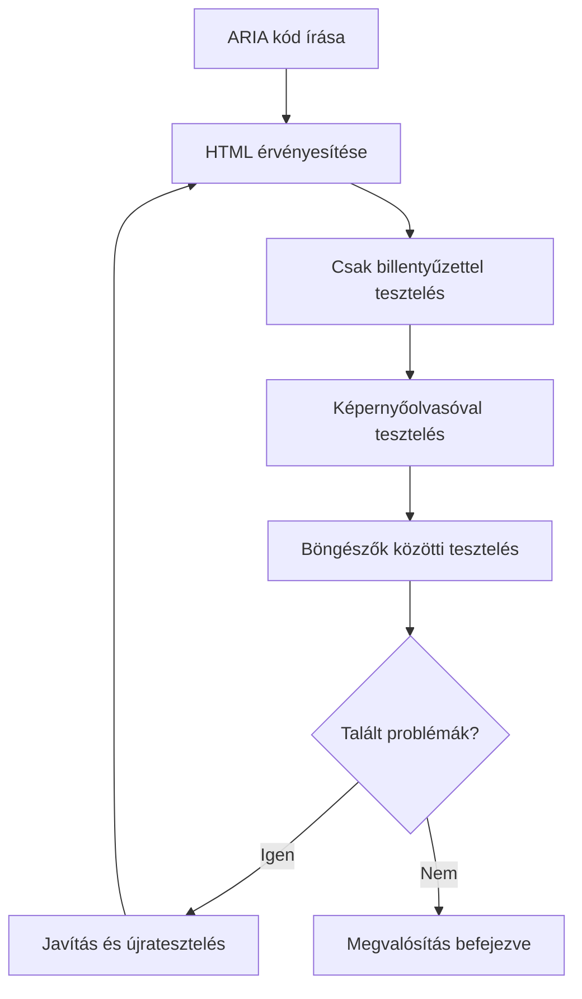
**🚫 Gyakori ARIA hibák, amelyeket el kell kerülni:**

- **Ellenmondó információk**: Ne legyen ellentmondás a HTML szemantikával
- **Túlzott címkézés**: Túl sok ARIA információ eláraszthatja a felhasználókat
- **Statikus ARIA**: Ne feledd frissíteni az ARIA állapotokat, amikor a tartalom változik
- **Nem tesztelt megvalósítások**: Elméletben működő ARIA, amely a gyakorlatban hibás
- **Hiányzó billentyűzet támogatás**: ARIA szerepek billentyűzetes interakció nélkül

> 💡 **Tesztelési források**: Használj olyan eszközöket, mint az [accessibility-checker](https://www.npmjs.com/package/accessibility-checker) az automatikus ARIA érvényesítéshez, de mindig tesztelj valós képernyőolvasókkal a teljes élményért.

### 🎭 **ARIA Készségek Ellenőrzése: Készen állsz a bonyolult interakciókra?**

**Mérd fel ARIA magabiztosságodat:**
- Mikor választanád az ARIA-t a szemantikus HTML helyett? (Tip: szinte soha!)
- Meg tudod magyarázni, miért rosszabb általában a `<div role="button">`, mint a `<button>`?
- Mi a legfontosabb dolog, amit az ARIA tesztelésről meg kell jegyezni?

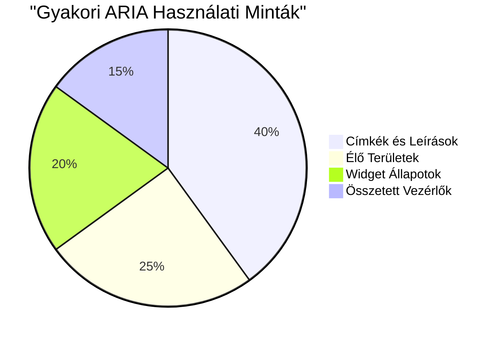
> **Kulcsfontosságú meglátás**: Az ARIA használatának többsége címkézésre és elemek leírására szolgál. A bonyolult widget minták sokkal ritkábbak, mint gondolnád!

✅ **Tanulj szakértőktől**: Tanulmányozd az [ARIA Authoring Practices Guide](https://w3c.github.io/aria-practices/) oldalát a kipróbált minták és bonyolult interaktív widgetek megvalósításaiért.

## Képek és média akadálymentesítése

A vizuális és hang alapú tartalmak a modern webélmények alapvető részei, de akadályokat jelenthetnek, ha nem gondosan valósítják meg őket. A cél, hogy a média információi és érzelmi hatása minden felhasználóhoz eljusson. Ha egyszer ráérzel, az második természeteddé válik.

Különböző típusú média különböző akadálymentesítési megközelítést igényel. Olyan, mint a főzés — egy törékeny halat nem úgy kezelsz, mint egy szaftos steaket. Ezeknek a különbségeknek a megértése segít megtalálni a megfelelő megoldást minden helyzetre.

### Stratégiai kép akadálymentesítés

Az oldalodon található minden képnek célja van. E cél megértése segít jobb helyettesítő szöveget írni, és inkluzívabb élményeket létrehozni.

**A négy kép típus és azok alt szöveg stratégiái:**

**Tájékoztató képek** - fontos információt közvetítenek:
```html

```

**Dekoratív képek** - kizárólag vizuálisak, információértékkel nem bírnak:
```html

```

**Funkcionális képek** - gombként vagy vezérlőként szolgálnak:
```html
<button>
  
</button>
```

**Összetett képek** - diagramok, grafikonok, infografikák:
```html

<div id="chart-description">
  <p>Detailed description: Sales data shows a steady increase across all quarters...</p>
</div>
```

### Videó és hang akadálymentessége

**Videó követelmények:**
- **Feliratok**: A beszéd és hanghatások szöveges változata
- **Hangos leírások**: Vizualitás narrációja vak felhasználók számára
- **Átiratok**: Teljes szöveges változat az audio és vizuális tartalomról

```html
<video controls>
  <source src="video.mp4" type="video/mp4">
  <track kind="captions" src="captions.vtt" srclang="en" label="English">
  <track kind="descriptions" src="descriptions.vtt" srclang="en" label="Audio descriptions">
</video>
```

**Hang követelmények:**
- **Átiratok**: Minden beszéd szöveges változata
- **Vizuális jelzések**: Csak hang esetén biztosíts vizuális jeleket

### Modern kép technikák

**CSS használata dekoratív képekhez:**
```css
.hero-section {
  background-image: url('decorative-hero.jpg');
  /* Decorative images in CSS don't need alt text */
}
```

**Reszponzív képek akadálymentességgel:**
```html
<picture>
  <source media="(min-width: 800px)" srcset="large-chart.png">
  <source media="(min-width: 400px)" srcset="medium-chart.png">
  
</picture>
```

✅ **Teszteld a képek akadálymentességét**: Használj képernyőolvasót, és böngéssz egy képekkel teleoldalt. Megkapsz elég információt a tartalom megértéséhez?

## Billentyűzetes navigáció és fókusz kezelés

Sok felhasználó kizárólag billentyűzettel navigál az interneten. Ide tartoznak a mozgáskorlátozottak, a hatékony felhasználók, akiknek gyorsabb a billentyűzet az egérnél, és mindenki, akinek az egere nem működik. Fontos, hogy az oldalad jól működjön billentyűzetes bevitel esetén, hiszen ez gyakran hatékonyabbá is teszi az oldalt mindenki számára.

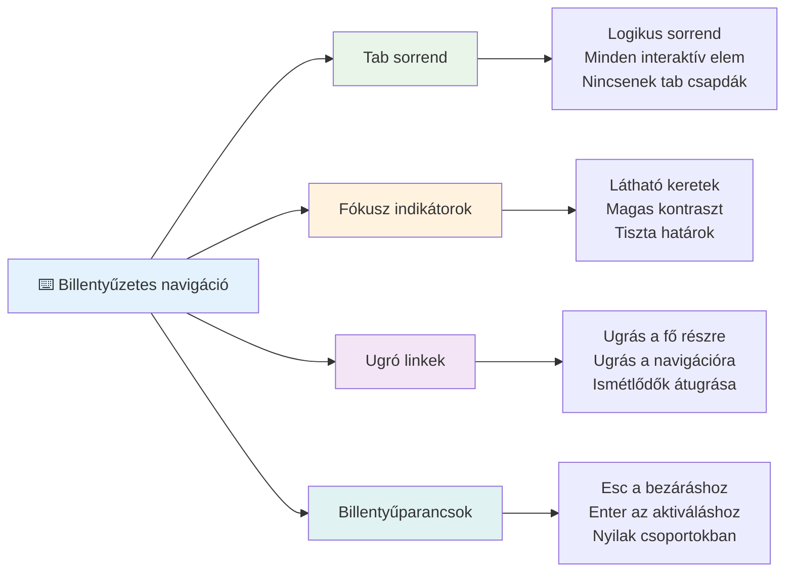
### Alapvető billentyűzet navigációs minták

**Szokásos billentyűzet interakciók:**
- **Tab**: Fókusz előre mozgatása az interaktív elemek között
- **Shift + Tab**: Fókusz hátrafelé mozgása
- **Enter**: Gombok és linkek aktiválása
- **Space**: Gombok aktiválása, jelölőnégyzetek be- és kikapcsolása
- **Nyilak**: Komponenscsoportokon belüli navigáció (rádiógombok, menük)
- **Escape**: Modalok, legördülő menük bezárása, műveletek megszakítása

### Fókuszkezelés legjobb gyakorlatai

**Látható fókusz indikátorok:**
```css
/* Ensure focus is always visible */
button:focus-visible {
  outline: 2px solid #4A90A4;
  outline-offset: 2px;
}

/* Custom focus styles for different components */
.card:focus-within {
  box-shadow: 0 0 0 3px rgba(74, 144, 164, 0.5);
}
```

**Ugró linkek a gyors navigációhoz:**
```html
<a href="#main-content" class="skip-link">Skip to main content</a>
<a href="#navigation" class="skip-link">Skip to navigation</a>

<nav id="navigation">
  <!-- navigation content -->
</nav>
<main id="main-content">
  <!-- main content -->
</main>
```

**Megfelelő tab sorrend:**
```html
<!-- Use semantic HTML for natural tab order -->
<form>
  <label for="name">Name:</label>
  <input type="text" id="name" tabindex="0">
  
  <label for="email">Email:</label>
  <input type="email" id="email" tabindex="0">
  
  <button type="submit" tabindex="0">Submit</button>
</form>
```

### Fókusz csapda modaloknál

Modal dialógusok megnyitásakor a fókuszt a modalon belül kell rögzíteni:

```javascript
// Modern fókusz csapda megvalósítás
function trapFocus(element) {
  const focusableElements = element.querySelectorAll(
    'button, [href], input, select, textarea, [tabindex]:not([tabindex="-1"])'
  );
  
  const firstElement = focusableElements[0];
  const lastElement = focusableElements[focusableElements.length - 1];

  element.addEventListener('keydown', (e) => {
    if (e.key === 'Tab') {
      if (e.shiftKey && document.activeElement === firstElement) {
        e.preventDefault();
        lastElement.focus();
      } else if (!e.shiftKey && document.activeElement === lastElement) {
        e.preventDefault();
        firstElement.focus();
      }
    }
    
    if (e.key === 'Escape') {
      closeModal();
    }
  });
  
  // Az első elem fókuszálása, amikor a modális megnyílik
  firstElement.focus();
}
```

✅ **Teszteld a billentyűzetes navigációt**: Próbálj meg kizárólag a Tab billentyűvel navigálni az oldaladon. Eléred az összes interaktív elemet? Logikus a fókusz sorrend? Egyértelműek a fókusz indikátorok?

## Űrlap akadálymentessége

Az űrlapok kritikusak a felhasználói interakciókhoz, különös figyelmet igényelnek az akadálymentesség szempontjából.

### Címkék és űrlapvezérlők kapcsolata

**Minden űrlapmezőnek kell címke:**
```html
<!-- Explicit labeling (preferred) -->
<label for="username">Username:</label>
<input type="text" id="username" name="username" required>

<!-- Implicit labeling -->
<label>
  Password:
  <input type="password" name="password" required>
</label>

<!-- Using aria-label when visual label isn't desired -->
<input type="search" aria-label="Search products" placeholder="Search...">
```

### Hibakezelés és érvényesítés

**Akadálymentes hibaüzenetek:**
```html
<label for="email">Email Address:</label>
<input type="email" id="email" name="email" 
       aria-describedby="email-error" 
       aria-invalid="true" required>
<div id="email-error" role="alert">
  Please enter a valid email address
</div>
```

**Űrlap érvényesítés legjobb gyakorlatai:**
- Használd az `aria-invalid`-et érvénytelen mezők jelzésére
- Adj világos, specifikus hibaüzeneteket
- Használj `role="alert"`-et fontos hiba bejelentésekhez
- Mutasd meg a hibákat azonnal és az űrlap beküldésekor is

### Mezőcsoportok és csoportosítás

**Csoportosítsd a kapcsolódó űrlapmezőket:**
```html
<fieldset>
  <legend>Shipping Address</legend>
  <label for="street">Street Address:</label>
  <input type="text" id="street" name="street">
  
  <label for="city">City:</label>
  <input type="text" id="city" name="city">
</fieldset>

<fieldset>
  <legend>Preferred Contact Method</legend>
  <input type="radio" id="contact-email" name="contact" value="email">
  <label for="contact-email">Email</label>
  
  <input type="radio" id="contact-phone" name="contact" value="phone">
  <label for="contact-phone">Phone</label>
</fieldset>
```

## Az akadálymentességi utad legfontosabb tanulságai

Gratulálunk! Most szerezted meg az alapvető tudást igazán inkluzív webélmények létrehozásához. Ez igazán izgalmas dolog! A web akadálymentesség nem pusztán megfelelőség ellenőrzése – arról szól, hogy felismerjük, milyen sokféleképpen lépnek kapcsolatba az emberek a digitális tartalommal, és ennek a fantasztikus összetettségnek megfelelően tervezünk.

Most már egy növekvő fejlesztői közösség tagja vagy, amely megérti, hogy a nagyszerű tervezés mindenkinek működik. Üdv a klubban!

**🎯 Az akadálymentességi eszköztárad mostantól tartalmazza:**

| Alapelv | Megvalósítás | Hatás |
|----------------|----------------|---------|
| **Szemantikus HTML alap** | Megfelelő HTML elemek használata a rendeltetésüknek megfelelően | A képernyőolvasók hatékonyan navigálnak, a billentyűzet pedig automatikusan működik |
| **Inkluzív vizuális dizájn** | Kellő kontraszt, értelmes színhasználat, látható fókusz jelölők | Világos mindenki számára bármilyen fényviszony mellett |
| **Leíró tartalom** | Értelmes link szövegek, alt szövegek, címsorok | A felhasználók értik a tartalmat vizuális kontextus nélkül is |
| **Billentyűzetes elérhetőség** | Tab sorrend, billentyűparancsok, fókuszkezelés | Mozgáskorlátozottak és haladó felhasználók hatékonysága |
| **ARIA kibővítés** | Stratégiai használat szemantikai hiányosságok kitöltésére | Bonyolult alkalmazások működése segédeszközökkel |
| **Átfogó tesztelés** | Automatikus eszközök + manuális ellenőrzés + valós felhasználói tesztelés | Hibák kiszűrése még mielőtt a felhasználókhoz jutnának |

**🚀 Következő lépések:**

1. **Építsd be az akadálymentességet a munkafolyamatodba**: Tedd a tesztelést a fejlesztési folyamat természetes részévé
2. **Tanulj valós felhasználóktól**: Kérj visszajelzést segédeszközöket használóktól
3. **Maradj naprakész**: Az akadálymentességi technikák fejlődnek az új technológiákkal és szabványokkal
4. **Légy az inklúzió támogatója**: Oszd meg tudásod, és tedd az akadálymentességet csapatod prioritásává

> 💡 **Ne feledd**: Az akadálymentességi korlátok gyakran innovatív, elegáns megoldásokhoz vezetnek, amelyek mindenki számára előnyösek. A rámpák, feliratok és hangvezérlés mind eredetileg akadálymentesítő funkcióként kezdődtek, majd általános fejlesztéssé váltak.

**Az üzleti megfontolás kristálytiszta**: Az akadálymentes weboldalak több felhasználót érnek el, jobban rangsorolnak a keresőkben, alacsonyabb karbantartási költséggel járnak és elkerülik a jogi kockázatokat. De őszintén? Az igazán mély ok, ami miatt fontos az akadálymentesség, az a web legjobb értékeinek megtestesítése — nyitottság, befogadás és az az elképzelés, hogy mindenkinek egyenlő hozzáférése van az információkhoz.

Most felvérteztél a jövő inkluzív webének építéséhez. Minden akadálymentes oldallal, amit létrehozol, barátságosabbá teszed az internetet mindenki számára. Ez igazán nagyszerű dolog, ha belegondolsz!

## További források

Folytasd akadálymentességi tanulmányaidat ezekkel az alapvető forrásokkal:

**📚 Hivatalos szabványok és irányelvek:**
- [WCAG 2.1 Irányelvek](https://www.w3.org/WAI/WCAG21/quickref/) - A hivatalos akadálymentességi szabvány gyors áttekintéssel
- [ARIA Authoring Practices Guide](https://w3c.github.io/aria-practices/) - Átfogó minták interaktív widgetekhez
- [WebAIM Irányelvek](https://webaim.org/) - Gyakorlati, kezdőknek szóló akadálymentességi útmutatás

**🛠️ Eszközök és tesztelési források:**
- [axe DevTools](https://www.deque.com/axe/devtools/) - Iparági szabvány akadálymentességi teszteléshez
- [A11y Project Ellenőrzőlista](https://www.a11yproject.com/checklist/) - Lépésről lépésre akadálymentességi ellenőrzés
- [Accessibility Insights](https://accessibilityinsights.io/) - A Microsoft átfogó tesztelő eszköze
- [Color Oracle](https://colororacle.org/) - Színvak szimulátor dizájn teszteléshez

**🎓 Tanulás és közösség:**
- [WebAIM Képernyőolvasó Felmérés](https://webaim.org/projects/screenreadersurvey9/) - Valós felhasználói preferenciák és viselkedés
- [Inclusive Components](https://inclusive-components.design/) - Modern akadálymentes komponensminták
- [A11y Coffee](https://a11y.coffee/) - Gyors akadálymentességi tippek és meglátások
- [Web Accessibility Initiative (WAI)](https://www.w3.org/WAI/) - A W3C átfogó akadálymentességi erőforrásai

**🎥 Gyakorlati tanulás:**
- [Accessibility Developer Guide](https://www.accessibility-developer-guide.com/) - Gyakorlati megvalósítási útmutató
- [Deque University](https://dequeuniversity.com/) - Professzionális akadálymentességi képzések

## GitHub Copilot Agent Kihívás 🚀

Használd az Agent módot a következő kihívás elvégzéséhez:

**Leírás:** Készíts egy akadálymentes modális dialógus komponenst, amely bemutatja a megfelelő fókuszkezelést, ARIA attribútumokat és billentyűzetes navigációs mintákat.

**Prompt:** Építs egy teljes modális dialógus komponenst HTML, CSS és JavaScript használatával, amely tartalmazza: megfelelő fókusz csapdázást, ESC billentyűvel való bezárást, kívülre kattintásra való bezárást, képernyőolvasók számára ARIA attribútumokat és látható fókusz indikátorokat. A modal tartalmazzon egy űrlapot a megfelelő címkékkel és hibakezeléssel. Gondoskodj róla, hogy a komponens megfeleljen a WCAG 2.1 AA szabványoknak.


## 🚀 Kihívás

Vedd ezt a HTML-t, és írd át a lehető legakadálymentesebbre a tanult stratégiák alapján.

```html
<!DOCTYPE html>
<html lang="en">
  <head>
    <meta charset="UTF-8">
    <meta name="viewport" content="width=device-width, initial-scale=1.0">
    <title>Turtle Ipsum - The World's Premier Turtle Fan Club</title>
    <link href='../assets/style.css' rel='stylesheet' type='text/css'>
  </head>
  <body>
    <header class="site-header">
      <h1 class="site-title">Turtle Ipsum</h1>
      <p class="site-subtitle">The World's Premier Turtle Fan Club</p>
    </header>
    
    <nav class="main-nav" aria-label="Main navigation">
      <h2 class="nav-header">Resources</h2>
      <ul class="nav-list">
        <li><a href="https://www.youtube.com/watch?v=CMNry4PE93Y">"I like turtles" video</a></li>
        <li><a href="https://en.wikipedia.org/wiki/Turtle">Basic turtle information</a></li>
        <li><a href="https://en.wikipedia.org/wiki/Turtles_(chocolate)">Chocolate turtles candy</a></li>
      </ul>
    </nav>
    
    <main class="main-content">
      <article>
        <h1>Welcome to Turtle Ipsum</h1>
        <p class="intro">
          <a href="/about">Learn more about our turtle community</a> and discover fascinating facts about these amazing creatures.
        </p>
        <p class="article-text">
          Turtle ipsum dolor sit amet, consectetur adipiscing elit, sed do eiusmod tempor incididunt ut labore et dolore magna aliqua. Ut enim ad minim veniam, quis nostrud exercitation ullamco laboris nisi ut aliquip ex ea commodo consequat. Duis aute irure dolor in reprehenderit in voluptate velit esse cillum dolore eu fugiat nulla pariatur. Excepteur sint occaecat cupidatat non proident, sunt in culpa qui officia deserunt mollit anim id est laborum.
        </p>
      </article>
    </main>
    
    <footer class="footer">
      <section class="newsletter-signup">
        <h2>Stay Updated</h2>
        <button type="button" onclick="showNewsletterForm()">Sign up for turtle news</button>
      </section>
      
      <nav class="footer-nav" aria-label="Footer navigation">
        <h2>Site Pages</h2>
        <ul>
          <li><a href="../">Home</a></li>
          <li><a href="../semantic">Semantic HTML example</a></li>
        </ul>
      </nav>
      
      <p class="footer-copyright">&copy; 2024 Instrument. All rights reserved.</p>
    </footer>
  </body>
</html>
```

**Főbb javítások:**
- Megfelelő szemantikus HTML struktúra hozzáadva
- Címsor hierarchia javítva (egyetlen h1, logikus előrehaladás)
- Értelmes link szöveg beillesztése "kattints ide" helyett
- Megfelelő ARIA címkék hozzáadása a navigációhoz
- lang attribútum és megfelelő meta tagek hozzáadása
- Interaktív elemekhez button elem használata
- Látható lábléc tartalom megfelelő térképekkel strukturálva

## Előadás utáni kvíz
[Előadás utáni kvíz](https://ff-quizzes.netlify.app/web/en/)

## Áttekintés és önálló tanulás

Sok kormányzat törvényekkel rendelkezik az akadálymentességi követelményekről. Ismerd meg az otthoni országod akadálymentességi törvényeit. Mi van lefedve és mi nincs? Egy példa erre [ez a kormányzati weboldal](https://accessibility.blog.gov.uk/).

## Házi feladat

[Elemezz egy nem akadálymentes weboldalt](assignment.md)

Köszönet: [Turtle Ipsum](https://github.com/Instrument/semantic-html-sample) től Instrument

---

## 🚀 Az akadálymentesség mesterfokú idővonala

### ⚡ **Mit tudsz megtenni a következő 5 percben?**
- [ ] Telepítsd az axe DevTools bővítményt a böngésződbe
- [ ] Fuss egy Lighthouse akadálymentességi auditot a kedvenc weboldaladon
- [ ] Próbálj meg bármelyik weboldalon kizárólag a Tab billentyűt használva navigálni
- [ ] Teszteld a böngésződ beépített képernyőolvasóját (Narrator/VoiceOver)

### 🎯 **Mit érhetsz el ezen az órán?**
- [ ] Töltsd ki az utólagos kvízt és gondolkodj el az akadálymentességi tanulságokon
- [ ] Gyakorold 10 különböző kép megfelelő alt szövegének írását
- [ ] Auditáld egy weboldal címsorszerkezetét a HeadingsMap bővítménnyel
- [ ] Javítsd ki az akadálymentességi hibákat, amelyeket a kihívás HTML-jében találsz
- [ ] Teszteld a színkontrasztot a jelenlegi projekteden a WebAIM eszközével

### 📅 **Heti akadálymentességi feladataid**
- [ ] Fejezd be a feladatot, amely egy nem akadálymentes weboldal elemzése
- [ ] Állítsd be a fejlesztőkörnyezeted akadálymentességi tesztelő eszközökkel
- [ ] Gyakorold a billentyűzetes navigációt 5 különböző, összetett webhelyen
- [ ] Építs egy egyszerű űrlapot megfelelő címkékkel, hibakezeléssel és ARIA-val
- [ ] Csatlakozz egy akadálymentesítési közösséghez (A11y Slack, WebAIM fórum)
- [ ] Figyelj meg valós fogyatékkal élő felhasználókat, ahogy weboldalakat navigálnak (a YouTube-on nagyszerű példák vannak)

### 🌟 **Az egyhónapos átalakulásod**
- [ ] Integráld az akadálymentesítési tesztelést a fejlesztési munkafolyamatodba
- [ ] Adj hozzájárulást egy nyílt forráskódú projekthez akadálymentesítési hibák javításával
- [ ] Végezz használhatósági tesztelést valakivel, aki segédeszközt használ
- [ ] Építs akadálymentes komponenskönyvtárat a csapatod számára
- [ ] Lépj fel az akadálymentesítésért a munkahelyeden vagy a közösségedben
- [ ] Mentorálj valakit, aki most ismerkedik az akadálymentesítési koncepciókkal

### 🏆 **Végső akadálymentesítési bajnok ellenőrzés**

**Ünnepeld meg az akadálymentesítési utadat:**
- Mi volt a legmeglepőbb dolog, amit megtanultál arról, hogyan használják az emberek a webet?
- Melyik akadálymentesítési elv rezonál leginkább a fejlesztési stílusoddal?
- Hogyan változtatta meg az akadálymentesítés megismerése a tervezéshez való hozzáállásodat?
- Mi az első akadálymentesítési fejlesztés, amit egy valódi projekten szeretnél megvalósítani?

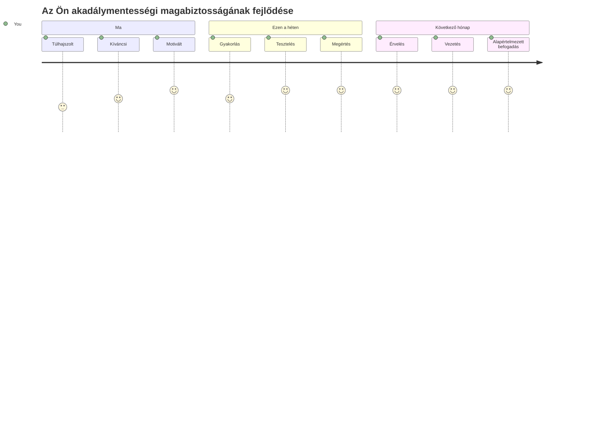
> 🌍 **Most már akadálymentesítési bajnok vagy!** Érted, hogy a remek webes élmények mindenki számára működnek, függetlenül attól, hogyan férnek hozzá a webhez. Minden akadálymentes funkció, amit építesz, befogadóbbá teszi az internetet. A webnek olyan fejlesztőkre van szüksége, mint te, akik az akadálymentesítést nem megszorításként, hanem lehetőségként látják arra, hogy jobb élményeket teremtsenek minden felhasználó számára. Üdv a mozgalomban! 🎉

---

<!-- CO-OP TRANSLATOR DISCLAIMER START -->
**Felmentés**:
Ezt a dokumentumot az [Co-op Translator](https://github.com/Azure/co-op-translator) mesterséges intelligencia fordító szolgáltatással fordítottuk. Bár törekszünk a pontosságra, kérjük, vegye figyelembe, hogy az automatikus fordítások hibákat vagy pontatlanságokat tartalmazhatnak. Az eredeti dokumentum anyanyelvén tekintendő hiteles forrásnak. Fontos információk esetén profi emberi fordítást javaslunk. Nem vállalunk felelősséget a fordítás használatából eredő félreértésekért vagy téves értelmezésekért.
<!-- CO-OP TRANSLATOR DISCLAIMER END -->