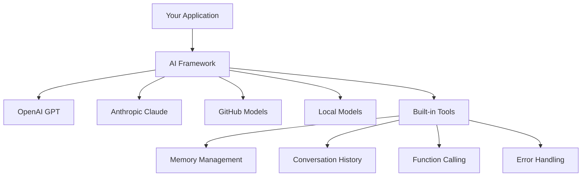
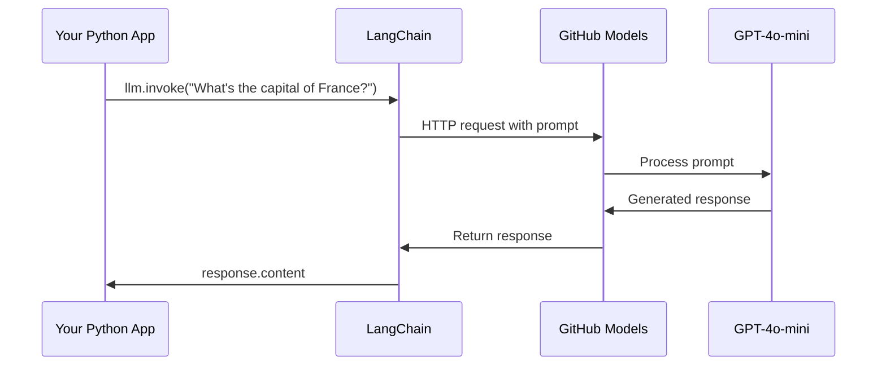
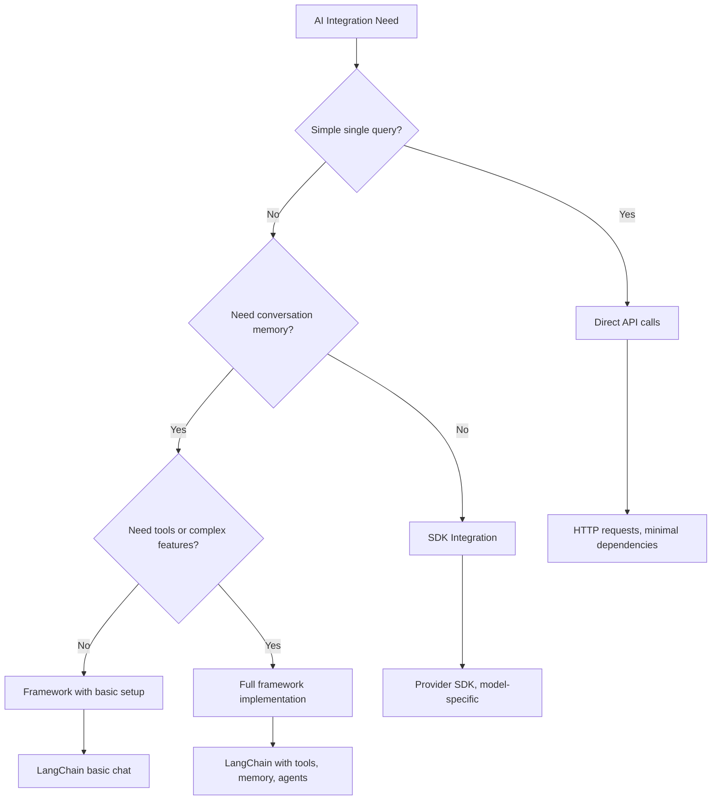

<!--
CO_OP_TRANSLATOR_METADATA:
{
  "original_hash": "e2c4ae5688e34b4b8b09d52aec56c79e",
  "translation_date": "2025-10-24T20:07:20+00:00",
  "source_file": "10-ai-framework-project/README.md",
  "language_code": "hu"
}
-->
# AI Keretrendszer

Valaha is túlterheltnek érezted magad, amikor nulláról próbáltál AI alkalmazásokat építeni? Nem vagy egyedül! Az AI keretrendszerek olyanok, mint egy svájci bicska az AI fejlesztéshez - erőteljes eszközök, amelyek időt és fejfájást takarítanak meg, miközben intelligens alkalmazásokat építesz. Gondolj egy AI keretrendszerre úgy, mint egy jól szervezett könyvtárra: előre elkészített komponenseket, szabványosított API-kat és okos absztrakciókat biztosít, hogy a problémák megoldására koncentrálhass, ahelyett hogy a megvalósítás részleteivel küzdenél.

Ebben a leckében megvizsgáljuk, hogyan alakíthatják át a keretrendszerek, mint például a LangChain, a korábban bonyolult AI integrációs feladatokat tiszta, olvasható kóddá. Felfedezheted, hogyan kezelheted a valós kihívásokat, mint például a beszélgetések nyomon követése, eszközök hívása és különböző AI modellek egyesített interfészen keresztüli kezelése.

Mire végeztünk, tudni fogod, mikor érdemes keretrendszereket használni a nyers API hívások helyett, hogyan használhatod hatékonyan az absztrakcióikat, és hogyan építhetsz valós használatra kész AI alkalmazásokat. Nézzük meg, mit tehetnek az AI keretrendszerek a projektjeidért.

## Miért válassz keretrendszert?

Tehát készen állsz egy AI alkalmazás építésére - szuper! De itt van a dolog: több különböző út áll előtted, és mindegyiknek megvannak a maga előnyei és hátrányai. Ez olyan, mint választani, hogy gyalog, biciklivel vagy autóval jutsz el valahová - mindegyik eljuttat a célhoz, de az élmény (és az erőfeszítés) teljesen más lesz.

Nézzük meg az AI integráció három fő módját a projektjeidben:

| Megközelítés | Előnyök | Legjobb felhasználás | Megfontolások |
|--------------|---------|----------------------|---------------|
| **Közvetlen HTTP kérések** | Teljes kontroll, nincs függőség | Egyszerű lekérdezések, alapok tanulása | Bőbeszédű kód, manuális hibakezelés |
| **SDK integráció** | Kevesebb sablonkód, modell-specifikus optimalizáció | Egyetlen modell alkalmazások | Korlátozott specifikus szolgáltatókra |
| **AI keretrendszerek** | Egységes API, beépített absztrakciók | Több modell alkalmazások, összetett munkafolyamatok | Tanulási görbe, esetleges túlzott absztrakció |

### Keretrendszerek gyakorlati előnyei



**Miért fontosak a keretrendszerek:**
- **Egységesíti** több AI szolgáltatót egy interfészen keresztül
- **Automatikusan kezeli** a beszélgetési memóriát
- **Kész eszközöket biztosít** gyakori feladatokhoz, mint például beágyazások és funkcióhívások
- **Kezeli** a hibakezelést és az újrapróbálkozási logikát
- **Átalakítja** az összetett munkafolyamatokat olvasható metódushívásokká

> 💡 **Profi tipp**: Használj keretrendszereket, amikor különböző AI modellek között váltasz, vagy összetett funkciókat, mint például ügynökök, memória vagy eszközök hívása építesz. Maradj a közvetlen API-knál, amikor az alapokat tanulod vagy egyszerű, fókuszált alkalmazásokat építesz.

**Lényeg**: Mint választani egy mesterember speciális eszközei és egy teljes műhely között, ez arról szól, hogy az eszközt a feladathoz igazítsuk. A keretrendszerek kiválóak összetett, funkciókban gazdag alkalmazásokhoz, míg a közvetlen API-k jól működnek egyszerűbb esetekben.

## Bevezetés

Ebben a leckében megtanuljuk:

- Egy közös AI keretrendszer használatát.
- Gyakori problémák megoldását, mint például chat beszélgetések, eszközhasználat, memória és kontextus.
- Hogyan használhatjuk ezt AI alkalmazások építésére.

## Az első AI kérdésed

Kezdjük az alapokkal, és hozzuk létre az első AI alkalmazásodat, amely kérdést küld és választ kap. Mint ahogy Arkhimédész felfedezte a vízkiszorítás elvét a fürdőjében, néha a legegyszerűbb megfigyelések vezetnek a legerőteljesebb felismerésekhez - és a keretrendszerek hozzáférhetővé teszik ezeket a felismeréseket.

### LangChain beállítása GitHub Modellek használatával

A LangChain-t fogjuk használni, hogy csatlakozzunk a GitHub Modellekhez, ami elég szuper, mert ingyenes hozzáférést biztosít különböző AI modellekhez. A legjobb rész? Csak néhány egyszerű konfigurációs paraméterre van szükséged a kezdéshez:

```python
from langchain_openai import ChatOpenAI
import os

llm = ChatOpenAI(
    api_key=os.environ["GITHUB_TOKEN"],
    base_url="https://models.github.ai/inference",
    model="openai/gpt-4o-mini",
)

# Send a simple prompt
response = llm.invoke("What's the capital of France?")
print(response.content)
```

**Nézzük meg, mi történik itt:**
- **Létrehoz egy** LangChain klienst a `ChatOpenAI` osztály használatával - ez az AI kapud!
- **Konfigurálja** a kapcsolatot a GitHub Modellekhez az autentikációs tokeneddel
- **Meghatározza**, melyik AI modellt használja (`gpt-4o-mini`) - gondolj erre úgy, mint az AI asszisztensed kiválasztására
- **Elküldi** a kérdésed az `invoke()` metódus használatával - itt történik a varázslat
- **Kinyeri** és megjeleníti a választ - és voilà, beszélgetsz az AI-val!

> 🔧 **Beállítási megjegyzés**: Ha GitHub Codespaces-t használsz, szerencséd van - a `GITHUB_TOKEN` már be van állítva! Helyben dolgozol? Ne aggódj, csak létre kell hoznod egy személyes hozzáférési tokent a megfelelő jogosultságokkal.

**Várható kimenet:**
```text
The capital of France is Paris.
```



## Beszélgető AI építése

Az első példa bemutatja az alapokat, de ez csak egyetlen csere - kérdezel valamit, kapsz egy választ, és ennyi. A valós alkalmazásokban azt szeretnéd, hogy az AI emlékezzen arra, miről beszéltetek, mint ahogy Watson és Holmes építették fel nyomozási beszélgetéseiket az idő múlásával.

Itt válik különösen hasznossá a LangChain. Különböző üzenettípusokat biztosít, amelyek segítenek strukturálni a beszélgetéseket, és lehetővé teszik, hogy személyiséget adj az AI-nak. Olyan chat élményeket fogsz építeni, amelyek megőrzik a kontextust és a karaktert.

### Üzenettípusok megértése

Gondolj ezekre az üzenettípusokra úgy, mint különböző "kalapokra", amelyeket a beszélgetés résztvevői viselnek. A LangChain különböző üzenet osztályokat használ, hogy nyomon kövesse, ki mit mond:

| Üzenettípus | Cél | Példa felhasználás |
|-------------|-----|--------------------|
| `SystemMessage` | Meghatározza az AI személyiségét és viselkedését | "Te egy segítőkész kódolási asszisztens vagy" |
| `HumanMessage` | A felhasználói bemenetet képviseli | "Magyarázd el, hogyan működnek a függvények" |
| `AIMessage` | Az AI válaszait tárolja | Korábbi AI válaszok a beszélgetésben |

### Az első beszélgetés létrehozása

Hozzunk létre egy beszélgetést, ahol az AI egy konkrét szerepet vállal. Legyen például Jean-Luc Picard kapitány - egy karakter, aki diplomatikus bölcsességéről és vezetői képességeiről ismert:

```python
messages = [
    SystemMessage(content="You are Captain Picard of the Starship Enterprise"),
    HumanMessage(content="Tell me about you"),
]
```

**A beszélgetés beállításának részletezése:**
- **Meghatározza** az AI szerepét és személyiségét a `SystemMessage` segítségével
- **Biztosítja** a kezdeti felhasználói kérdést a `HumanMessage` segítségével
- **Alapot teremt** a többfordulós beszélgetéshez

A teljes kód az alábbiak szerint néz ki:

```python
from langchain_core.messages import HumanMessage, SystemMessage
from langchain_openai import ChatOpenAI
import os

llm = ChatOpenAI(
    api_key=os.environ["GITHUB_TOKEN"],
    base_url="https://models.github.ai/inference",
    model="openai/gpt-4o-mini",
)

messages = [
    SystemMessage(content="You are Captain Picard of the Starship Enterprise"),
    HumanMessage(content="Tell me about you"),
]


# works
response  = llm.invoke(messages)
print(response.content)
```

Egy hasonló eredményt kell látnod:

```text
I am Captain Jean-Luc Picard, the commanding officer of the USS Enterprise (NCC-1701-D), a starship in the United Federation of Planets. My primary mission is to explore new worlds, seek out new life and new civilizations, and boldly go where no one has gone before. 

I believe in the importance of diplomacy, reason, and the pursuit of knowledge. My crew is diverse and skilled, and we often face challenges that test our resolve, ethics, and ingenuity. Throughout my career, I have encountered numerous species, grappled with complex moral dilemmas, and have consistently sought peaceful solutions to conflicts.

I hold the ideals of the Federation close to my heart, believing in the importance of cooperation, understanding, and respect for all sentient beings. My experiences have shaped my leadership style, and I strive to be a thoughtful and just captain. How may I assist you further?
```

A beszélgetés folytonosságának fenntartásához (ahelyett, hogy minden alkalommal újraindítanád a kontextust), folyamatosan hozzá kell adnod a válaszokat az üzenetlistádhoz. Mint az orális hagyományok, amelyek generációkon keresztül megőrizték a történeteket, ez a megközelítés tartós memóriát épít:

```python
from langchain_core.messages import HumanMessage, SystemMessage
from langchain_openai import ChatOpenAI
import os

llm = ChatOpenAI(
    api_key=os.environ["GITHUB_TOKEN"],
    base_url="https://models.github.ai/inference",
    model="openai/gpt-4o-mini",
)

messages = [
    SystemMessage(content="You are Captain Picard of the Starship Enterprise"),
    HumanMessage(content="Tell me about you"),
]


# works
response  = llm.invoke(messages)

print(response.content)

print("---- Next ----")

messages.append(response)
messages.append(HumanMessage(content="Now that I know about you, I'm Chris, can I be in your crew?"))

response  = llm.invoke(messages)

print(response.content)

```

Elég klassz, igaz? Ami itt történik, az az, hogy kétszer hívjuk meg az LLM-et - először csak az első két üzenetünkkel, majd újra a teljes beszélgetési történelemmel. Olyan, mintha az AI tényleg követné a beszélgetésünket!

Amikor futtatod ezt a kódot, egy második választ kapsz, ami valahogy így hangzik:

```text
Welcome aboard, Chris! It's always a pleasure to meet those who share a passion for exploration and discovery. While I cannot formally offer you a position on the Enterprise right now, I encourage you to pursue your aspirations. We are always in need of talented individuals with diverse skills and backgrounds. 

If you are interested in space exploration, consider education and training in the sciences, engineering, or diplomacy. The values of curiosity, resilience, and teamwork are crucial in Starfleet. Should you ever find yourself on a starship, remember to uphold the principles of the Federation: peace, understanding, and respect for all beings. Your journey can lead you to remarkable adventures, whether in the stars or on the ground. Engage!
```

Ezt talán elfogadom válaszként ;)

## Streaming válaszok

Észrevetted már, hogy a ChatGPT "valós időben" gépelni látszik a válaszait? Ez a streaming működése. Mint amikor egy ügyes kalligráfus dolgozik - látni, ahogy a karakterek vonásról vonásra jelennek meg, nem pedig azonnal - a streaming természetesebbé teszi az interakciót, és azonnali visszajelzést nyújt.

### Streaming megvalósítása LangChain-nel

```python
from langchain_openai import ChatOpenAI
import os

llm = ChatOpenAI(
    api_key=os.environ["GITHUB_TOKEN"],
    base_url="https://models.github.ai/inference",
    model="openai/gpt-4o-mini",
    streaming=True
)

# Stream the response
for chunk in llm.stream("Write a short story about a robot learning to code"):
    print(chunk.content, end="", flush=True)
```

**Miért nagyszerű a streaming:**
- **Megmutatja** a tartalmat, amint létrejön - nincs több kínos várakozás!
- **Érezteti** a felhasználókkal, hogy valami tényleg történik
- **Gyorsabbnak tűnik**, még ha technikailag nem is az
- **Lehetővé teszi**, hogy a felhasználók elkezdjenek olvasni, miközben az AI még "gondolkodik"

> 💡 **Felhasználói élmény tipp**: A streaming igazán akkor ragyog, amikor hosszabb válaszokkal dolgozol, mint például kódmagyarázatok, kreatív írás vagy részletes oktatóanyagok. A felhasználóid imádni fogják látni a haladást, ahelyett hogy egy üres képernyőt bámulnának!

## Prompt sablonok

A prompt sablonok olyanok, mint a klasszikus szónoklatban használt retorikai struktúrák - gondolj arra, hogyan alkalmazta Cicero a beszédmintáit különböző közönségekhez, miközben megtartotta ugyanazt a meggyőző keretet. Lehetővé teszik, hogy újrahasználható promptokat hozz létre, ahol különböző információkat cserélhetsz ki anélkül, hogy mindent újraírnál. Miután beállítottad a sablont, csak ki kell töltened a változókat a szükséges értékekkel.

### Újrahasználható promptok létrehozása

```python
from langchain_core.prompts import ChatPromptTemplate

# Define a template for code explanations
template = ChatPromptTemplate.from_messages([
    ("system", "You are an expert programming instructor. Explain concepts clearly with examples."),
    ("human", "Explain {concept} in {language} with a practical example for {skill_level} developers")
])

# Use the template with different values
questions = [
    {"concept": "functions", "language": "JavaScript", "skill_level": "beginner"},
    {"concept": "classes", "language": "Python", "skill_level": "intermediate"},
    {"concept": "async/await", "language": "JavaScript", "skill_level": "advanced"}
]

for question in questions:
    prompt = template.format_messages(**question)
    response = llm.invoke(prompt)
    print(f"Topic: {question['concept']}\n{response.content}\n---\n")
```

**Miért fogod szeretni a sablonok használatát:**
- **Konzisztenssé teszi** a promptjaidat az egész alkalmazásban
- **Nincs többé** rendetlen szövegösszefűzés - csak tiszta, egyszerű változók
- **Az AI-d** kiszámíthatóan viselkedik, mert a struktúra változatlan marad
- **Frissítések** egyszerűek - változtasd meg a sablont egyszer, és mindenhol javítva van

## Strukturált kimenet

Valaha frusztráltál már, amikor az AI válaszai rendezetlen szövegként érkeztek vissza? A strukturált kimenet olyan, mintha megtanítanád az AI-t, hogy kövesse a rendszerezett megközelítést, amelyet Linnaeus használt a biológiai osztályozáshoz - szervezett, kiszámítható és könnyen kezelhető. Kérhetsz JSON-t, specifikus adatstruktúrákat vagy bármilyen formátumot, amire szükséged van.

### Kimeneti sémák meghatározása

```python
from langchain_core.prompts import ChatPromptTemplate
from langchain_core.output_parsers import JsonOutputParser
from pydantic import BaseModel, Field

class CodeReview(BaseModel):
    score: int = Field(description="Code quality score from 1-10")
    strengths: list[str] = Field(description="List of code strengths")
    improvements: list[str] = Field(description="List of suggested improvements")
    overall_feedback: str = Field(description="Summary feedback")

# Set up the parser
parser = JsonOutputParser(pydantic_object=CodeReview)

# Create prompt with format instructions
prompt = ChatPromptTemplate.from_messages([
    ("system", "You are a code reviewer. {format_instructions}"),
    ("human", "Review this code: {code}")
])

# Format the prompt with instructions
chain = prompt | llm | parser

# Get structured response
code_sample = """
def calculate_average(numbers):
    return sum(numbers) / len(numbers)
"""

result = chain.invoke({
    "code": code_sample,
    "format_instructions": parser.get_format_instructions()
})

print(f"Score: {result['score']}")
print(f"Strengths: {', '.join(result['strengths'])}")
```

**Miért változtatja meg a játékot a strukturált kimenet:**
- **Nincs többé** találgatás, hogy milyen formátumot kapsz vissza - mindig következetes
- **Közvetlenül csatlakozik** az adatbázisaidhoz és API-jaidhoz extra munka nélkül
- **Elkapja** a furcsa AI válaszokat, mielőtt azok tönkretennék az alkalmazásodat
- **Tisztábbá teszi** a kódodat, mert pontosan tudod, mivel dolgozol

## Eszközök hívása

Most elérkeztünk az egyik legerőteljesebb funkcióhoz: az eszközök. Ez az, ahogyan gyakorlati képességeket adsz az AI-nak a beszélgetésen túl. Mint ahogy a középkori céhek speciális eszközöket fejlesztettek ki konkrét mesterségekhez, te is felszerelheted az AI-t fókuszált eszközökkel. Leírod, milyen eszközök állnak rendelkezésre, és amikor valaki olyasmit kér, ami megfelel, az AI cselekedhet.

### Python használata

Adjunk hozzá néhány eszközt így:

```python
from typing_extensions import Annotated, TypedDict

class add(TypedDict):
    """Add two integers."""

    # Annotations must have the type and can optionally include a default value and description (in that order).
    a: Annotated[int, ..., "First integer"]
    b: Annotated[int, ..., "Second integer"]

tools = [add]

functions = {
    "add": lambda a, b: a + b
}
```

Mi történik itt? Létrehozunk egy tervet egy `add` nevű eszközhöz. Az `TypedDict` öröklésével és ezekkel a divatos `Annotated` típusokkal az `a` és `b` esetében egyértelmű képet adunk az LLM-nek arról, hogy mit csinál ez az eszköz, és mire van szüksége. A `functions` szótár olyan, mint a szerszámosládánk - megmondja a kódunknak, pontosan mit kell tennie, amikor az AI úgy dönt, hogy használ egy adott eszközt.

Nézzük meg, hogyan hívjuk meg az LLM-et ezzel az eszközzel:

```python
llm = ChatOpenAI(
    api_key=os.environ["GITHUB_TOKEN"],
    base_url="https://models.github.ai/inference",
    model="openai/gpt-4o-mini",
)

llm_with_tools = llm.bind_tools(tools)
```

Itt a `bind_tools`-t hívjuk meg a `tools` tömbünkkel, és így az LLM `llm_with_tools` most már ismeri ezt az eszközt.

Ennek az új LLM-nek a használatához a következő kódot írhatjuk:

```python
query = "What is 3 + 12?"

res = llm_with_tools.invoke(query)
if(res.tool_calls):
    for tool in res.tool_calls:
        print("TOOL CALL: ", functions[tool["name"]](../../../10-ai-framework-project/**tool["args"]))
print("CONTENT: ",res.content)
```

Most, hogy az új LLM-en hívjuk meg az `invoke`-t, amely eszközökkel rendelkezik, lehet, hogy a `tool_calls` tulajdonságot kitöltve látjuk. Ha igen, bármely azonosított eszköznek van egy `name` és `args` tulajdonsága, amely azonosítja, hogy melyik eszközt kell hívni és milyen argumentumokkal. A teljes kód így néz ki:

```python
from langchain_core.messages import HumanMessage, SystemMessage
from langchain_openai import ChatOpenAI
import os
from typing_extensions import Annotated, TypedDict

class add(TypedDict):
    """Add two integers."""

    # Annotations must have the type and can optionally include a default value and description (in that order).
    a: Annotated[int, ..., "First integer"]
    b: Annotated[int, ..., "Second integer"]

tools = [add]

functions = {
    "add": lambda a, b: a + b
}

llm = ChatOpenAI(
    api_key=os.environ["GITHUB_TOKEN"],
    base_url="https://models.github.ai/inference",
    model="openai/gpt-4o-mini",
)

llm_with_tools = llm.bind_tools(tools)

query = "What is 3 + 12?"

res = llm_with_tools.invoke(query)
if(res.tool_calls):
    for tool in res.tool_calls:
        print("TOOL CALL: ", functions[tool["name"]](../../../10-ai-framework-project/**tool["args"]))
print("CONTENT: ",res.content)
```

A kód futtatásakor hasonló kimenetet kell látnod:

```text
TOOL CALL:  15
CONTENT: 
```

Az AI megvizsgálta a "Mi az 3 + 12" kérdést, és felismerte ezt egy `add` eszköz feladataként. Mint ahogy egy ügyes könyvtáros tudja, melyik referenciát kell konzultálnia a kérdés típusától függően, ezt a döntést az eszköz neve, leírása és mezőspecifikációi alapján hozta meg. A 15-ös eredmény a `functions` szótárunkból származik, amely végrehajtja az eszközt:

```python
print("TOOL CALL: ", functions[tool["name"]](../../../10-ai-framework-project/**tool["args"]))
```

### Egy érdekesebb eszköz, amely webes API-t hív

A számok összeadása bemutatja a koncepciót, de a valódi eszközök általában összetettebb műveleteket végeznek, például webes API-k hívását. Bő
3. **Személyre szabott tanulás**: Használj rendszerüzeneteket a válaszok különböző készségszintekhez való igazításához  
4. **Válaszformázás**: Valósíts meg strukturált kimenetet kvízkérdésekhez  

### Megvalósítási lépések  

**1. lépés: Állítsd be a környezeted**  
```bash
pip install langchain langchain-openai
```
  
**2. lépés: Alapvető chat funkciók**  
- Hozz létre egy `StudyAssistant` osztályt  
- Valósítsd meg a beszélgetési memóriát  
- Adj hozzá személyiségkonfigurációt oktatási támogatáshoz  

**3. lépés: Oktatási eszközök hozzáadása**  
- **Kódmagyarázó**: Érthető részekre bontja a kódot  
- **Kvízgenerátor**: Kérdéseket készít programozási fogalmakról  
- **Haladáskövető**: Nyomon követi a lefedett témákat  

**4. lépés: Fejlett funkciók (opcionális)**  
- Valósíts meg streaming válaszokat a jobb felhasználói élmény érdekében  
- Adj hozzá dokumentum betöltést a tananyagok beépítéséhez  
- Hozz létre beágyazásokat hasonlóság-alapú tartalomkereséshez  

### Értékelési kritériumok  

| Funkció | Kiváló (4) | Jó (3) | Kielégítő (2) | Fejlesztésre szorul (1) |  
|---------|------------|--------|----------------|--------------------------|  
| **Beszélgetési folyamat** | Természetes, kontextusra érzékeny válaszok | Jó kontextusmegőrzés | Alapvető beszélgetés | Nincs memória az üzenetek között |  
| **Eszközintegráció** | Több hasznos eszköz zökkenőmentesen működik | 2+ eszköz helyesen implementálva | 1-2 alapvető eszköz | Az eszközök nem működnek |  
| **Kódminőség** | Tiszta, jól dokumentált, hibakezelés | Jó struktúra, némi dokumentáció | Alapvető funkcionalitás működik | Rossz struktúra, nincs hibakezelés |  
| **Oktatási érték** | Valóban segíti a tanulást, adaptív | Jó tanulási támogatás | Alapvető magyarázatok | Korlátozott oktatási haszon |  

### Példa kódstruktúra  

```python
class StudyAssistant:
    def __init__(self, skill_level="beginner"):
        # Initialize LLM, tools, and conversation memory
        pass
    
    def explain_code(self, code, language):
        # Tool: Explain how code works
        pass
    
    def generate_quiz(self, topic, difficulty):
        # Tool: Create practice questions
        pass
    
    def chat(self, user_input):
        # Main conversation interface
        pass

# Example usage
assistant = StudyAssistant(skill_level="intermediate")
response = assistant.chat("Explain how Python functions work")
```
  
**Bónusz kihívások:**  
- Adj hozzá hangbemeneti/kimeneti képességeket  
- Valósíts meg webes felületet Streamlit vagy Flask segítségével  
- Hozz létre tudásbázist tananyagokból beágyazásokkal  
- Adj hozzá haladáskövetést és személyre szabott tanulási útvonalakat  

## Összefoglaló  

🎉 Mostanra elsajátítottad az AI keretrendszer fejlesztés alapjait, és megtanultad, hogyan építs kifinomult AI alkalmazásokat LangChain segítségével. Mint egy átfogó tanulóidőszakot befejezve, jelentős eszköztárat szereztél. Nézzük át, mit értél el.  

### Amit megtanultál  

**Alapvető keretrendszer fogalmak:**  
- **Keretrendszer előnyei**: Megérteni, mikor érdemes keretrendszereket választani közvetlen API-hívások helyett  
- **LangChain alapok**: AI modellkapcsolatok beállítása és konfigurálása  
- **Üzenettípusok**: `SystemMessage`, `HumanMessage` és `AIMessage` használata strukturált beszélgetésekhez  

**Fejlett funkciók:**  
- **Eszköz hívás**: Egyedi eszközök létrehozása és integrálása az AI képességek bővítéséhez  
- **Beszélgetési memória**: Kontextus megőrzése több beszélgetési forduló során  
- **Streaming válaszok**: Valós idejű válaszok megvalósítása  
- **Prompt sablonok**: Újrahasználható, dinamikus promptok létrehozása  
- **Strukturált kimenet**: Konzisztens, elemezhető AI válaszok biztosítása  
- **Beágyazások**: Szemantikus keresés és dokumentumfeldolgozási képességek létrehozása  

**Gyakorlati alkalmazások:**  
- **Teljes alkalmazások építése**: Több funkció kombinálása gyártásra kész alkalmazásokba  
- **Hibakezelés**: Robusztus hibakezelés és validáció megvalósítása  
- **Eszközintegráció**: Egyedi eszközök létrehozása, amelyek bővítik az AI képességeket  

### Fő tanulságok  

> 🎯 **Emlékezz**: Az AI keretrendszerek, mint a LangChain, alapvetően a komplexitást elrejtő, funkciókkal teli legjobb barátaid. Tökéletesek, ha beszélgetési memóriára, eszköz hívásra van szükséged, vagy több AI modellel szeretnél dolgozni anélkül, hogy elveszítenéd a józan eszed.  

**Döntési keretrendszer az AI integrációhoz:**  


  
### Hogyan tovább?  

**Kezdj el építeni most:**  
- Vedd ezeket a fogalmakat, és építs valamit, ami izgat téged!  
- Játssz különböző AI modellekkel LangChain segítségével - olyan, mintha egy AI modellek játszóterén lennél  
- Hozz létre eszközöket, amelyek valódi problémákat oldanak meg a munkádban vagy projektjeidben  

**Készen állsz a következő szintre?**  
- **AI ügynökök**: Építs AI rendszereket, amelyek önállóan képesek összetett feladatokat tervezni és végrehajtani  
- **RAG (Retrieval-Augmented Generation)**: Kombináld az AI-t saját tudásbázisoddal szupererős alkalmazásokhoz  
- **Multi-Modal AI**: Dolgozz szöveggel, képekkel és hanggal együtt - a lehetőségek végtelenek!  
- **Gyártási telepítés**: Tanuld meg, hogyan skálázd az AI alkalmazásaidat, és hogyan monitorozd őket a való világban  

**Csatlakozz a közösséghez:**  
- A LangChain közösség fantasztikus, hogy naprakész maradj és megtanuld a legjobb gyakorlatokat  
- A GitHub Models hozzáférést biztosít a legmodernebb AI képességekhez - tökéletes kísérletezéshez  
- Gyakorolj különböző felhasználási esetekkel - minden projekt valami újat tanít  

Most már megvan a tudásod ahhoz, hogy intelligens, beszélgető alkalmazásokat építs, amelyek valódi problémák megoldásában segítenek az embereknek. Mint a reneszánsz mesterek, akik művészi látásmódot ötvöztek technikai készségekkel, most már te is képes vagy az AI képességeket gyakorlati alkalmazással kombinálni. A kérdés az: mit fogsz létrehozni? 🚀  

## GitHub Copilot Agent kihívás 🚀  

Használd az Agent módot a következő kihívás teljesítéséhez:  

**Leírás:** Építs egy fejlett AI-alapú kódellenőrző asszisztenst, amely több LangChain funkciót kombinál, beleértve az eszköz hívást, strukturált kimenetet és beszélgetési memóriát, hogy átfogó visszajelzést nyújtson a kódbeadásokkal kapcsolatban.  

**Prompt:** Hozz létre egy CodeReviewAssistant osztályt, amely megvalósítja:  
1. Egy eszközt a kód komplexitásának elemzésére és fejlesztési javaslatok adására  
2. Egy eszközt a kód legjobb gyakorlatoknak való megfelelésének ellenőrzésére  
3. Strukturált kimenetet Pydantic modellek segítségével a konzisztens ellenőrzési formátumhoz  
4. Beszélgetési memóriát az ellenőrzési ülések nyomon követésére  
5. Egy fő chat felületet, amely képes kezelni a kódbeadásokat és részletes, cselekvésre alkalmas visszajelzést adni  

Az asszisztensnek képesnek kell lennie több programozási nyelv kódjának ellenőrzésére, kontextust megőrizni több kódbeadás során egy munkamenetben, és mind összefoglaló pontszámokat, mind részletes fejlesztési javaslatokat nyújtani.  

További információ az [agent mode](https://code.visualstudio.com/blogs/2025/02/24/introducing-copilot-agent-mode) használatáról itt található.  

---

**Felelősség kizárása**:  
Ez a dokumentum az [Co-op Translator](https://github.com/Azure/co-op-translator) AI fordítási szolgáltatás segítségével lett lefordítva. Bár törekszünk a pontosságra, kérjük, vegye figyelembe, hogy az automatikus fordítások hibákat vagy pontatlanságokat tartalmazhatnak. Az eredeti dokumentum az eredeti nyelvén tekintendő hiteles forrásnak. Kritikus információk esetén javasolt professzionális emberi fordítást igénybe venni. Nem vállalunk felelősséget semmilyen félreértésért vagy téves értelmezésért, amely a fordítás használatából eredhet.