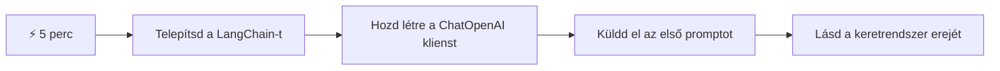
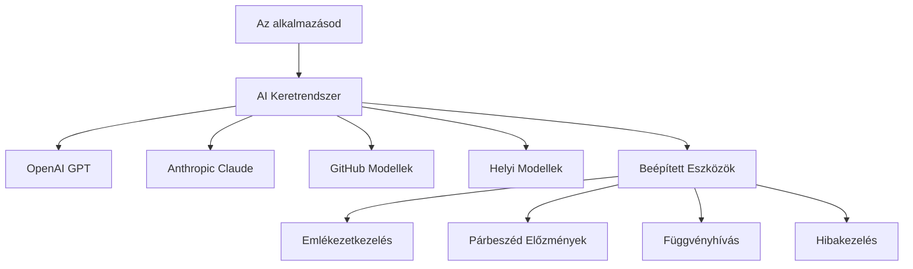
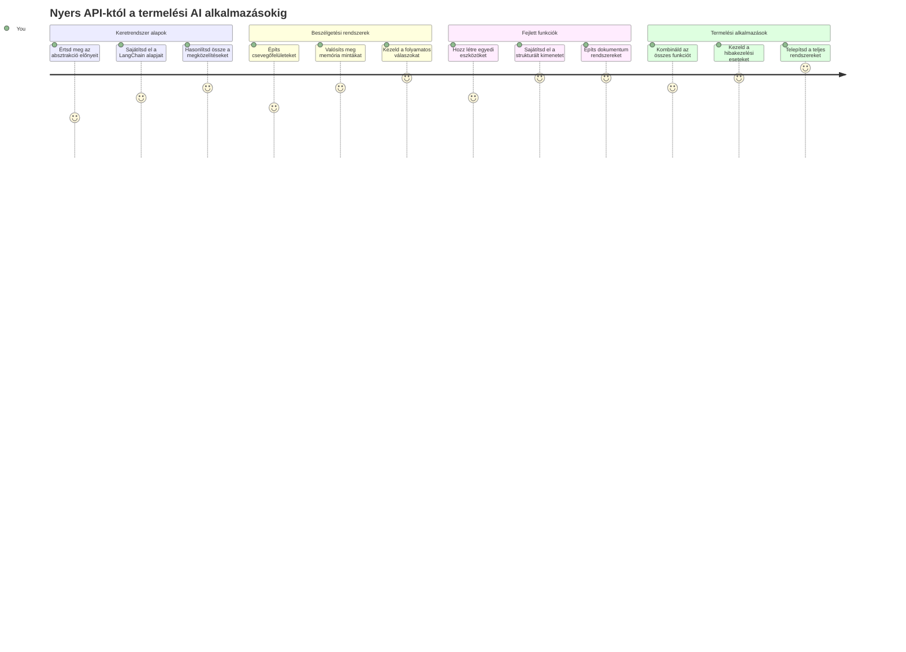
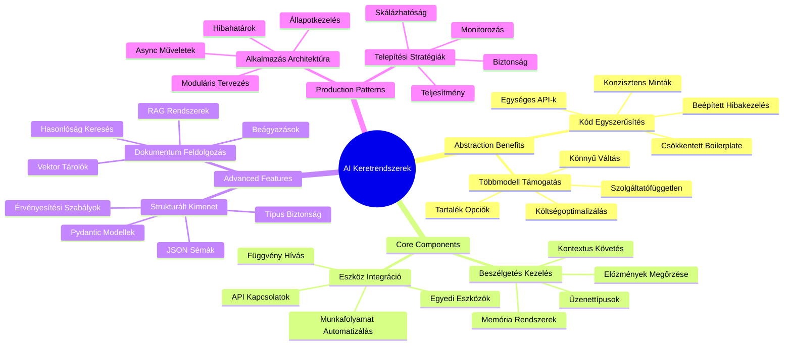
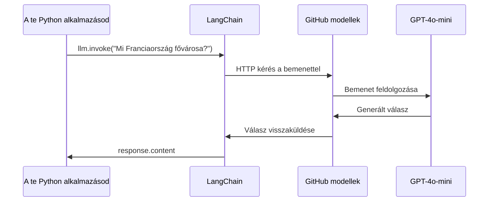
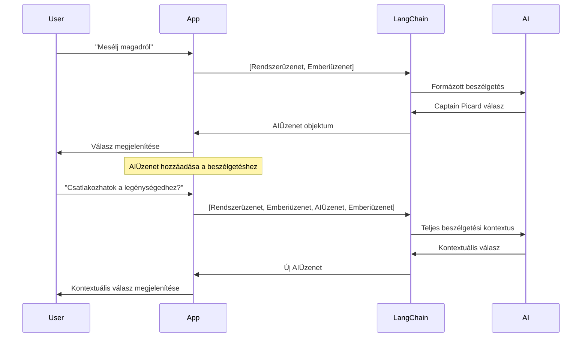
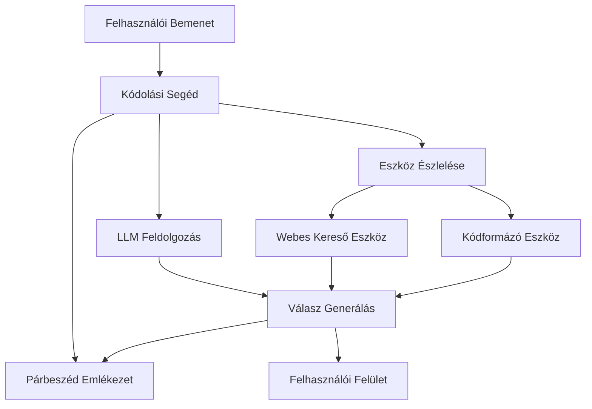
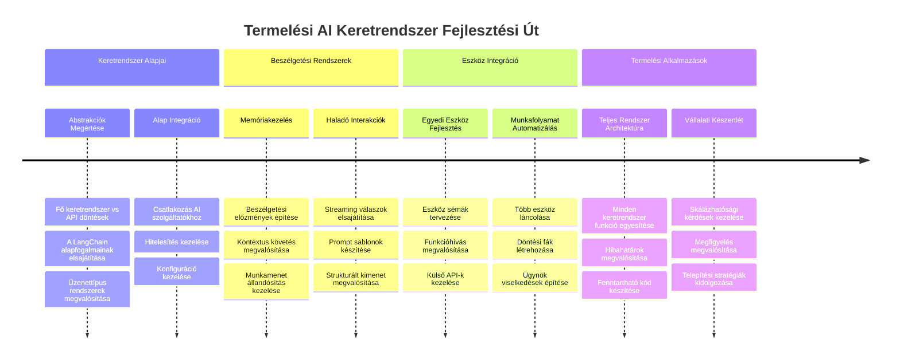
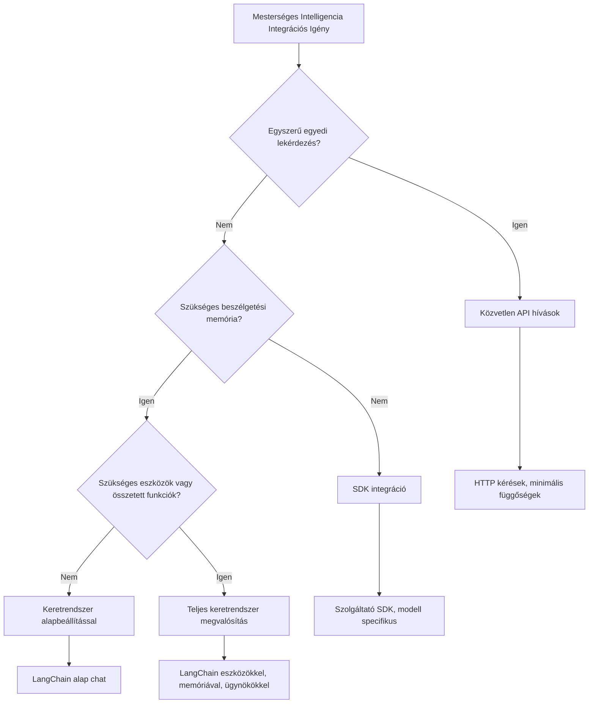

# AI keretrendszer

Érezted már úgy, hogy elárasztanak az AI-alkalmazások fejlesztésével járó feladatok? Nem vagy egyedül! Az AI-keretrendszerek olyanok, mint egy svájci bicska az AI fejlesztéshez – erőteljes eszközök, amelyek időt és fejfájást spórolhatnak meg, amikor intelligens alkalmazásokat építesz. Gondolj egy AI-keretrendszerre úgy, mint egy jól szervezett könyvtárra: előre elkészített összetevőket, szabványosított API-kat és okos absztrakciókat kínál, így probléma megoldására koncentrálhatsz ahelyett, hogy az implementációs részletekkel küzdenél.

Ebben a leckében felfedezzük, hogyan alakíthatnak olyan keretrendszerek, mint a LangChain, a korábban bonyolult AI integrációs feladatokat tiszta, olvasható kóddá. Megtanulod, hogyan kezeld a valós problémákat, mint a beszélgetések követése, eszközhívás megvalósítása és különböző AI modellek kezelése egy egységes felületen keresztül.

A végére tudni fogod, mikor érdemes keretrendszert használni a nyers API-hívások helyett, hogyan használd hatékonyan az absztrakciókat, és hogyan építs valós használatra kész AI alkalmazásokat. Nézzük meg, mit tehetnek az AI-keretrendszerek a projektjeidért.

## ⚡ Amit az elkövetkezendő 5 percben megtehetsz

**Gyors indulási útvonal elfoglalt fejlesztőknek**


- **1. perc**: Telepítsd a LangChain-t: `pip install langchain langchain-openai`
- **2. perc**: Állítsd be a GitHub tokened és importáld a ChatOpenAI klienst
- **3. perc**: Hozz létre egy egyszerű beszélgetést rendszer- és emberi üzenetekkel
- **4. perc**: Adj hozzá egy alapvető eszközt (például egy összeadó függvényt), és próbáld ki az AI eszközhívást
- **5. perc**: Tapasztald meg a nyers API hívások és a keretrendszer absztrakció közti különbséget

**Gyors tesztkód**:
```python
from langchain_openai import ChatOpenAI
from langchain_core.messages import SystemMessage, HumanMessage

llm = ChatOpenAI(
    api_key=os.environ["GITHUB_TOKEN"],
    base_url="https://models.github.ai/inference",
    model="openai/gpt-4o-mini"
)

response = llm.invoke([
    SystemMessage(content="You are a helpful coding assistant"),
    HumanMessage(content="Explain Python functions briefly")
])
print(response.content)
```

**Miért fontos ez?**: 5 perc alatt megtapasztalod, hogyan alakítják az AI-keretrendszerek a bonyolult AI integrációt egyszerű metódushívássá. Ez az alapja a produkciós AI alkalmazások működésének.

## Miért válassz keretrendszert?

Szóval készen állsz egy AI alkalmazás elkészítésére – szuper! De itt a helyzet: többféle út közül választhatsz, és mindegyiknek megvannak a maga előnyei és hátrányai. Olyan ez, mint ha gyalog, biciklivel vagy autóval mennél valahova – mindegyik eljuttat oda, de az élmény (és az erőfeszítés) teljesen más lesz.

Nézzük meg a három fő módját, ahogy AI-t integrálhatsz a projektjeidbe:

| Megközelítés | Előnyök | Leginkább alkalmas | Figyelembe veendők |
|-------------|---------|--------------------|--------------------|
| **Közvetlen HTTP kérések** | Teljes kontroll, nincs függőség | Egyszerű lekérdezések, alapok tanulása | Részletesebb kód, manuális hibakezelés |
| **SDK integráció** | Kevesebb ismétlődő kód, modell-specifikus optimalizáció | Egymodell-es alkalmazások | Kizárólag adott szolgáltatókra korlátozva |
| **AI keretrendszerek** | Egységes API, beépített absztrakciók | Többmodell-es appok, összetett munkafolyamatok | Tanulási görbe, esetleges túlszabályozás |

### A keretrendszerek előnyei a gyakorlatban


**Miért számítanak a keretrendszerek:**
- **Egységesíti** több AI szolgáltató interfészét
- **Automatikusan kezeli** a beszélgetés emlékezetét
- **Kész eszközöket kínál** gyakori feladatokra, mint a beágyazások és függvényhívások
- **Kezeli** a hibakezelést és ismétléseket
- **Átalakítja** az összetett munkafolyamatokat olvasható metódushívásokká

> 💡 **Pro Tipp**: Használj keretrendszert, amikor különböző AI modellek között váltasz, vagy összetett funkciókat, mint agentek, memória vagy eszközhívás építesz. API-t közvetlenül akkor használj, ha az alapokat tanulod vagy egyszerű, fókuszált alkalmazást építesz.

**Összefoglalva**: Mint amikor a mesterségbeli szerszámok vagy egy teljes műhely között döntesz, az eszközt a feladathoz kell igazítani. A keretrendszerek kiválóak összetett, funkciógazdag alkalmazásokhoz, míg a közvetlen API-k jól működnek egyszerű esetekben.

## 🗺️ Tanulási utad az AI keretrendszer mesterségben


**Úticélod**: A lecke végére mesteri szinten fogod használni az AI keretrendszer fejlesztést, és képes leszel kifinomult, produkciós AI alkalmazásokat építeni, melyek felveszik a versenyt a kereskedelmi AI asszisztensekkel.

## Bevezetés

Ebben a leckében megtanuljuk:

- Hogyan használj egy általános AI keretrendszert.
- Hogyan oldj meg gyakori problémákat, mint a chat beszélgetések, eszközhasználat, memória és kontextus.
- Hogyan használd ezt AI alkalmazások építésére.

## 🧠 AI keretrendszer fejlesztési ökoszisztéma


**Alapelv**: Az AI keretrendszerek elvonatkoztatják a bonyolultságot, miközben erőteljes absztrakciókat nyújtanak beszélgetés-kezeléshez, eszköz-integrációhoz és dokumentumfeldolgozáshoz, lehetővé téve a fejlesztők számára, hogy kifinomult AI alkalmazásokat építsenek tiszta, könnyen karbantartható kóddal.

## Az első AI promptod

Kezdjük az alapokkal, hozz létre egy olyan AI alkalmazást, amely kérdést küld és választ kap vissza. Akárcsak Arkhimédész, aki felfedezte a vízkiszorítás törvényét a fürdőjében, néha a legegyszerűbb megfigyelések vezetnek a legerősebb felismerésekhez – a keretrendszerek pedig elérhetővé teszik ezeket az felismeréseket.

### LangChain beállítása GitHub modellekhez

A LangChain segítségével csatlakozunk a GitHub modellekhez, ami nagyszerű, mert ingyenes hozzáférést ad különféle AI modellekhez. A legjobb az egészben, hogy csak néhány egyszerű konfigurációs paraméterre van szükséged a kezdéshez:

```python
from langchain_openai import ChatOpenAI
import os

llm = ChatOpenAI(
    api_key=os.environ["GITHUB_TOKEN"],
    base_url="https://models.github.ai/inference",
    model="openai/gpt-4o-mini",
)

# Küldj egy egyszerű utasítást
response = llm.invoke("What's the capital of France?")
print(response.content)
```

**Nézzük meg, mi történik itt:**
- **Létrehozza** a LangChain klienst a `ChatOpenAI` osztállyal – ez az AI kapud!
- **Beállítja** a GitHub Modellekhez való kapcsolatot az autentikációs tokeneddel
- **Megadja**, hogy mely AI modellt használd (`gpt-4o-mini`) – mintha az AI asszisztensedet választanád ki
- **Elküldi** a kérdésed az `invoke()` metódussal – itt történik a varázslat
- **Kinyeri** és megjeleníti a választ – és voilà, beszélgetsz az AI-val!

> 🔧 **Beállítási megjegyzés**: Ha GitHub Codespaces-t használsz, szerencséd van – a `GITHUB_TOKEN` már be van állítva! Lokálisan dolgozol? Semmi gond, csak hozz létre egy személyes hozzáférési tokent a megfelelő jogosultságokkal.

**Várt kimenet:**
```text
The capital of France is Paris.
```


## Beszélgető AI építése

Az első példa megmutatja az alapokat, de ez csak egyetlen váltás – kérdezel, választ kapsz, és kész. Valós alkalmazásokban szeretnéd, ha az AI emlékezne arra, miről beszéltetek, ahogy Watson és Holmes építették nyomozási beszélgetéseiket idővel.

Itt válik igazán hasznossá a LangChain. Különböző üzenettípusokat kínál, amelyek segítenek a beszélgetések struktúrázásában, és lehetőséget adnak az AI egyedi személyiségének megadására. Olyan chat élményeket építesz majd, amelyek fenntartják a kontextust és a karaktert.

### Az üzenettípusok megértése

Gondolj ezekre az üzenettípusokra úgy, mint különböző "kalapokra", amelyeket a résztvevők viselnek egy beszélgetésben. A LangChain különböző üzenetosztályokat használ, hogy nyomon kövesse, ki mit mond:

| Üzenettípus | Célja | Példahasználat |
|-------------|--------|----------------|
| `SystemMessage` | Meghatározza az AI személyiségét és viselkedését | "Te egy segítőkész kódoló asszisztens vagy" |
| `HumanMessage` | Felhasználói bemenetet képvisel | "Magyarázd el, hogyan működnek a függvények" |
| `AIMessage` | Tárolja az AI válaszokat | Korábbi AI válaszok a beszélgetésben |

### Első beszélgetés létrehozása

Hozzunk létre egy beszélgetést, ahol az AI egy konkrét szerepet vesz fel. Most Captain Picardot alakítja majd – egy karaktert, aki híres diplomáciai bölcsességéről és vezetői képességeiről:

```python
messages = [
    SystemMessage(content="You are Captain Picard of the Starship Enterprise"),
    HumanMessage(content="Tell me about you"),
]
```

**A beszélgetés beállításának elemzése:**
- **Meghatározza** az AI szerepét és személyiségét a `SystemMessage` segítségével
- **Megadja** az alap felhasználói kérdést `HumanMessage`-ben
- **Alapot teremt** a többszörös fordulós beszélgetéshez

A teljes kód ehhez az példához így néz ki:

```python
from langchain_core.messages import HumanMessage, SystemMessage
from langchain_openai import ChatOpenAI
import os

llm = ChatOpenAI(
    api_key=os.environ["GITHUB_TOKEN"],
    base_url="https://models.github.ai/inference",
    model="openai/gpt-4o-mini",
)

messages = [
    SystemMessage(content="You are Captain Picard of the Starship Enterprise"),
    HumanMessage(content="Tell me about you"),
]


# működik
response  = llm.invoke(messages)
print(response.content)
```

Ilyen eredményt kellene látnod:

```text
I am Captain Jean-Luc Picard, the commanding officer of the USS Enterprise (NCC-1701-D), a starship in the United Federation of Planets. My primary mission is to explore new worlds, seek out new life and new civilizations, and boldly go where no one has gone before. 

I believe in the importance of diplomacy, reason, and the pursuit of knowledge. My crew is diverse and skilled, and we often face challenges that test our resolve, ethics, and ingenuity. Throughout my career, I have encountered numerous species, grappled with complex moral dilemmas, and have consistently sought peaceful solutions to conflicts.

I hold the ideals of the Federation close to my heart, believing in the importance of cooperation, understanding, and respect for all sentient beings. My experiences have shaped my leadership style, and I strive to be a thoughtful and just captain. How may I assist you further?
```

A beszélgetés folytonosságának megtartásához (a kontextus minden futtatáskor való törlése helyett) folyamatosan hozzá kell adnod a válaszokat az üzenetek listájához. Ahogy az orális hagyományok generációkon át őrizték a történeteket, ez az megközelítés tartós memóriát épít:

```python
from langchain_core.messages import HumanMessage, SystemMessage
from langchain_openai import ChatOpenAI
import os

llm = ChatOpenAI(
    api_key=os.environ["GITHUB_TOKEN"],
    base_url="https://models.github.ai/inference",
    model="openai/gpt-4o-mini",
)

messages = [
    SystemMessage(content="You are Captain Picard of the Starship Enterprise"),
    HumanMessage(content="Tell me about you"),
]


# működik
response  = llm.invoke(messages)

print(response.content)

print("---- Next ----")

messages.append(response)
messages.append(HumanMessage(content="Now that I know about you, I'm Chris, can I be in your crew?"))

response  = llm.invoke(messages)

print(response.content)

```

Elég menő, igaz? Az történik, hogy az LLM-et kétszer hívjuk meg – először csak az első két üzenettel, majd a teljes beszélgetési előzménnyel. Olyan, mintha az AI tényleg követné a beszélgetést!

Amikor futtatod ezt a kódot, egy második válasz fog érkezni, ami valahogy így hangzik:

```text
Welcome aboard, Chris! It's always a pleasure to meet those who share a passion for exploration and discovery. While I cannot formally offer you a position on the Enterprise right now, I encourage you to pursue your aspirations. We are always in need of talented individuals with diverse skills and backgrounds. 

If you are interested in space exploration, consider education and training in the sciences, engineering, or diplomacy. The values of curiosity, resilience, and teamwork are crucial in Starfleet. Should you ever find yourself on a starship, remember to uphold the principles of the Federation: peace, understanding, and respect for all beings. Your journey can lead you to remarkable adventures, whether in the stars or on the ground. Engage!
```


Ezt biztosan "talán"-nak veszem ;)

## Streaming válaszok

Tudtad, hogy a ChatGPT mintha "gépelné" a válaszait valós időben? Ez a streaming. Olyan, mintha egy ügyes kalligráfus munkáját figyelnéd – a karakterek vonalanként jelennek meg, nem egyszerre –, a streaming természetesebbé teszi az interakciót és azonnali visszajelzést ad.

### Streaming megvalósítása LangChain-nel

```python
from langchain_openai import ChatOpenAI
import os

llm = ChatOpenAI(
    api_key=os.environ["GITHUB_TOKEN"],
    base_url="https://models.github.ai/inference",
    model="openai/gpt-4o-mini",
    streaming=True
)

# A válasz folyamatos továbbítása
for chunk in llm.stream("Write a short story about a robot learning to code"):
    print(chunk.content, end="", flush=True)
```

**Miért nagyszerű a streaming:**
- **Megjeleníti** a tartalmat amint létrejön – nincs több várakozás!
- **Élőbbé teszi** a felhasználói élményt, érződik, hogy történik valami
- **Gyorsabbnak tűnik**, még ha technikailag nem is az
- **Lehetővé teszi**, hogy a felhasználók már olvassák, míg az AI "gondolkodik"

> 💡 **Felhasználói élmény tipp**: A streaming különösen hasznos hosszabb válaszoknál, mint kódmagyarázatok, kreatív írás vagy részletes oktatóanyagok. A felhasználóid imádni fogják, hogy látják az előrehaladást ahelyett, hogy egy üres képernyőt bámulnak!

### 🎯 Pedagógiai ellenőrzőpont: A keretrendszer absztrakció előnyei

**Állj meg egy pillanatra és gondolkozz:** Most tapasztaltad meg az AI keretrendszerek absztrakcióinak erejét. Hasonlítsd össze, amit tanultál a korábbi leckék nyers API hívásaival.

**Gyors önértékelés**:
- El tudod magyarázni, hogyan egyszerűsíti a LangChain a beszélgetés kezelését a manuális üzenetkövetéssel szemben?
- Mi a különbség az `invoke()` és `stream()` metódusok között, és mikor használnád őket?
- Hogyan javítja az üzenettípus rendszer a kód szervezettségét?

**Valós kapcsolódás**: Az általad tanult absztrakciós mintákat (üzenettípusok, streaming interfészek, beszélgetés memória) minden jelentős AI alkalmazás használja – a ChatGPT felületétől a GitHub Copilot kódsegítéséig. Ugyanazokat az architekturális mintákat sajátítod el, mint a profi AI fejlesztő csapatok.

**Kihívó kérdés**: Hogyan terveznél egy keretrendszer absztrakciót az eltérő AI modell szolgáltatók (OpenAI, Anthropic, Google) egységes kezelésére? Gondold át az előnyöket és kompromisszumokat.

## Prompt sablonok

A prompt sablonok olyanok, mint a klasszikus szónoki retorikai struktúrák – gondolj arra, hogyan alkalmazta Cicero beszédmintáit különböző közönségekhez miközben megtartotta a meggyőző keretet. Lehetővé teszik, hogy újrahasználható promptokat hozz létre, ahol különböző információ darabokat cserélhetsz anélkül, hogy mindent újraírnál. Ha egyszer beállítod a sablont, csak a változókat töltöd ki a szükséges értékekkel.

### Újrahasználható promptok létrehozása

```python
from langchain_core.prompts import ChatPromptTemplate

# Definiálj egy sablont a kódmagyarázatokhoz
template = ChatPromptTemplate.from_messages([
    ("system", "You are an expert programming instructor. Explain concepts clearly with examples."),
    ("human", "Explain {concept} in {language} with a practical example for {skill_level} developers")
])

# Használd a sablont különböző értékekkel
questions = [
    {"concept": "functions", "language": "JavaScript", "skill_level": "beginner"},
    {"concept": "classes", "language": "Python", "skill_level": "intermediate"},
    {"concept": "async/await", "language": "JavaScript", "skill_level": "advanced"}
]

for question in questions:
    prompt = template.format_messages(**question)
    response = llm.invoke(prompt)
    print(f"Topic: {question['concept']}\n{response.content}\n---\n")
```

**Miért fogod szeretni a sablonokat:**
- **Konzisztenssé teszi** a promptokat az egész alkalmazásodban
- **Nincs többé** kusza string összefűzés – csak tiszta, egyszerű változók
- **Az AI** kiszámíthatóan viselkedik, mert a struktúra ugyanaz marad
- **Frissítések** egyszerűek – egy helyen módosítod, és az mindenhova érvényes

## Strukturált kimenet

Előfordult már, hogy bosszantott, amikor az AI válaszai rendezetlen szövegként érkeztek? A strukturált kimenet olyan, mintha a Linnaeus által használt biológiai osztályozás rendszerszerű megközelítését tanítanád az AI-nak – rendezett, kiszámítható és könnyen kezelhető. JSON-t, specifikus adatszerkezeteket vagy bármilyen formát kérhetsz.

### Kimeneti sémák definiálása

```python
from langchain_core.prompts import ChatPromptTemplate
from langchain_core.output_parsers import JsonOutputParser
from pydantic import BaseModel, Field

class CodeReview(BaseModel):
    score: int = Field(description="Code quality score from 1-10")
    strengths: list[str] = Field(description="List of code strengths")
    improvements: list[str] = Field(description="List of suggested improvements")
    overall_feedback: str = Field(description="Summary feedback")

# Állítsa be az elemzőt
parser = JsonOutputParser(pydantic_object=CodeReview)

# Készítsen kérést formátum utasításokkal
prompt = ChatPromptTemplate.from_messages([
    ("system", "You are a code reviewer. {format_instructions}"),
    ("human", "Review this code: {code}")
])

# Formázza meg a kérést utasításokkal
chain = prompt | llm | parser

# Szerezze be a strukturált választ
code_sample = """
def calculate_average(numbers):
    return sum(numbers) / len(numbers)
"""

result = chain.invoke({
    "code": code_sample,
    "format_instructions": parser.get_format_instructions()
})

print(f"Score: {result['score']}")
print(f"Strengths: {', '.join(result['strengths'])}")
```

**Miért játékváltó a strukturált kimenet:**
- **Nem kell többé találgatni**, milyen formát kapsz vissza – mindig konzisztens
- **Közvetlenül** csatlakozik az adatbázisokhoz és API-khoz extra munka nélkül
- **Elkapja** a furcsa AI válaszokat, mielőtt tönkretennék az appot
- **Tisztábbá teszi** a kódodat, mert pontosan tudod, mivel dolgozol

## Eszközhívás

Most elérkeztünk az egyik legerősebb funkcióhoz: az eszközökhöz. Ez az, ahogyan tényleges képességeket adsz az AI-nak a beszélgetésen túl. Ahogy a középkori céhek speciális eszközöket fejlesztettek adott mesterségekhez, te is felszerelheted az AI-t fókuszált eszközökkel. Leírod, milyen eszközök érhetők el, és ha valaki olyan kér valamit, ami megfelel, az AI cselekszik.

### Használat Pythonban

Adjunk hozzá néhány eszközt így:

```python
from typing_extensions import Annotated, TypedDict

class add(TypedDict):
    """Add two integers."""

    # Az annotációknak rendelkezniük kell típussal, és opcionálisan tartalmazhatnak alapértelmezett értéket és leírást (ebben a sorrendben).
    a: Annotated[int, ..., "First integer"]
    b: Annotated[int, ..., "Second integer"]

tools = [add]

functions = {
    "add": lambda a, b: a + b
}
```

Mi történik itt? Egy `add` nevű eszköz tervrajzát készítjük el. A `TypedDict` örökléssel és a `a` és `b` paraméterekhez rendelt `Annotated` típusokkal világos képet adunk az LLM-nek, hogy mit csinál ez az eszköz és mire van szüksége. A `functions` szótár a szerszámosládánk – megmondja a kódnak pontosan, mit csináljon, ha az AI használni akar egy adott eszközt.

Nézzük meg, hogyan hívjuk meg az LLM-et ezzel az eszközzel:

```python
llm = ChatOpenAI(
    api_key=os.environ["GITHUB_TOKEN"],
    base_url="https://models.github.ai/inference",
    model="openai/gpt-4o-mini",
)

llm_with_tools = llm.bind_tools(tools)
```

Itt a `bind_tools`-t hívjuk meg a `tools` tömbbel, így az LLM `llm_with_tools` megtanulja ezt az eszközt.

Az új LLM használatát a következő kóddal csinálhatjuk:

```python
query = "What is 3 + 12?"

res = llm_with_tools.invoke(query)
if(res.tool_calls):
    for tool in res.tool_calls:
        print("TOOL CALL: ", functions[tool["name"]](../../../10-ai-framework-project/**tool["args"]))
print("CONTENT: ",res.content)
```

Most, hogy meghívjuk az `invoke`-t ezen az új, eszközökkel kibővített LLM-en, elképzelhető, hogy a `tool_calls` tulajdonság ki lesz töltve. Ha igen, a megtalált eszközöknek lesz `name` és `args` tulajdonsága, ami az eszköz nevét és a hívás argumentumait határozza meg. A teljes kód így néz ki:

```python
from langchain_core.messages import HumanMessage, SystemMessage
from langchain_openai import ChatOpenAI
import os
from typing_extensions import Annotated, TypedDict

class add(TypedDict):
    """Add two integers."""

    # Az annotációknak meg kell határozniuk a típust, és opcionálisan tartalmazhatnak alapértelmezett értéket és leírást (ebben a sorrendben).
    a: Annotated[int, ..., "First integer"]
    b: Annotated[int, ..., "Second integer"]

tools = [add]

functions = {
    "add": lambda a, b: a + b
}

llm = ChatOpenAI(
    api_key=os.environ["GITHUB_TOKEN"],
    base_url="https://models.github.ai/inference",
    model="openai/gpt-4o-mini",
)

llm_with_tools = llm.bind_tools(tools)

query = "What is 3 + 12?"

res = llm_with_tools.invoke(query)
if(res.tool_calls):
    for tool in res.tool_calls:
        print("TOOL CALL: ", functions[tool["name"]](../../../10-ai-framework-project/**tool["args"]))
print("CONTENT: ",res.content)
```

Ennek a kódnak a futtatásakor hasonló kimenetet kell látnod:

```text
TOOL CALL:  15
CONTENT: 
```

Az AI megvizsgálta, hogy „Mi az 3 + 12” és felismerte, hogy ez az `add` eszköz feladata. Ahogy egy képzett könyvtáros tudja, melyik referenciát kell használni a kérdés típusától függően, az eszköz neve, leírása és mezőspecifikációi alapján döntött. A 15 eredmény az általunk definiált `functions` szótárban lefuttatott eszköz eredménye:

```python
print("TOOL CALL: ", functions[tool["name"]](../../../10-ai-framework-project/**tool["args"]))
```

### Egy érdekesebb eszköz, amely web API-t hív meg
A számok hozzáadása bemutatja a koncepciót, de a valós eszközök általában összetettebb műveleteket végeznek, például webes API-k hívását. Bővítsük példánkat úgy, hogy az AI az internetről szerezzen tartalmat – hasonlóan ahhoz, ahogy a távírászok egykor távoli helyszíneket kötöttek össze:

```python
class joke(TypedDict):
    """Tell a joke."""

    # Az annotációknak rendelkezniük kell típussal, és opcionálisan tartalmazhatnak alapértelmezett értéket és leírást (ebben a sorrendben).
    category: Annotated[str, ..., "The joke category"]

def get_joke(category: str) -> str:
    response = requests.get(f"https://api.chucknorris.io/jokes/random?category={category}", headers={"Accept": "application/json"})
    if response.status_code == 200:
        return response.json().get("value", f"Here's a {category} joke!")
    return f"Here's a {category} joke!"

functions = {
    "add": lambda a, b: a + b,
    "joke": lambda category: get_joke(category)
}

query = "Tell me a joke about animals"

# a kód többi része ugyanaz
```

Ha most lefuttatod ezt a kódot, egy olyan választ kapsz, ami valami ilyesmit mond:

```text
TOOL CALL:  Chuck Norris once rode a nine foot grizzly bear through an automatic car wash, instead of taking a shower.
CONTENT:  
```

```mermaid
flowchart TD
    A[Felhasználói kérés: "Mondj egy állatos viccet"] --> B[LangChain elemzés]
    B --> C{Eszköz elérhető?}
    C -->|Igen| D[Vicc eszköz kiválasztása]
    C -->|Nem| E[Közvetlen válasz generálása]
    
    D --> F[Paraméterek kinyerése]
    F --> G[Vicc hívása(kategória="állatok")]
    G --> H[API kérés a chucknorris.io-hoz]
    H --> I[Vicc tartalmának visszaadása]
    I --> J[Kijelzés a felhasználónak]
    
    E --> K[AI által generált válasz]
    K --> J
    
    subgraph "Eszköz definíciós réteg"
        L[TypedDict séma]
        M[Függvény megvalósítása]
        N[Paraméter ellenőrzés]
    end
    
    D --> L
    F --> N
    G --> M
```
Íme a kód teljes egészében:

```python
from langchain_openai import ChatOpenAI
import requests
import os
from typing_extensions import Annotated, TypedDict

class add(TypedDict):
    """Add two integers."""

    # Az annotációknak rendelkezniük kell típussal, és választhatóan tartalmazhatnak alapértelmezett értéket és leírást (ebben a sorrendben).
    a: Annotated[int, ..., "First integer"]
    b: Annotated[int, ..., "Second integer"]

class joke(TypedDict):
    """Tell a joke."""

    # Az annotációknak rendelkezniük kell típussal, és választhatóan tartalmazhatnak alapértelmezett értéket és leírást (ebben a sorrendben).
    category: Annotated[str, ..., "The joke category"]

tools = [add, joke]

def get_joke(category: str) -> str:
    response = requests.get(f"https://api.chucknorris.io/jokes/random?category={category}", headers={"Accept": "application/json"})
    if response.status_code == 200:
        return response.json().get("value", f"Here's a {category} joke!")
    return f"Here's a {category} joke!"

functions = {
    "add": lambda a, b: a + b,
    "joke": lambda category: get_joke(category)
}

llm = ChatOpenAI(
    api_key=os.environ["GITHUB_TOKEN"],
    base_url="https://models.github.ai/inference",
    model="openai/gpt-4o-mini",
)

llm_with_tools = llm.bind_tools(tools)

query = "Tell me a joke about animals"

res = llm_with_tools.invoke(query)
if(res.tool_calls):
    for tool in res.tool_calls:
        # print("ESZKÖZHÍVÁS: ", tool)
        print("TOOL CALL: ", functions[tool["name"]](../../../10-ai-framework-project/**tool["args"]))
print("CONTENT: ",res.content)
```

## Beágyazások és dokumentumfeldolgozás

A beágyazások a modern MI egyik legkifinomultabb megoldását képviselik. Képzeld el, hogy bármilyen szöveget képes lennél numerikus koordinátákra alakítani, amelyek megragadják annak értelmét. Pontosan ezt teszik a beágyazások – a szöveget pontokká alakítják egy többdimenziós térben, ahol a hasonló fogalmak összevándorolnak. Olyan ez, mintha lenne egy koordináta-rendszer az ötletek számára, hasonlóan ahhoz, ahogy Mendelejev rendezte az időszakos táblázatot az atomtulajdonságok alapján.

### Beágyazások létrehozása és használata

```python
from langchain_openai import OpenAIEmbeddings
from langchain_community.vectorstores import FAISS
from langchain_community.document_loaders import TextLoader
from langchain.text_splitter import CharacterTextSplitter

# Inicializálja az beágyazásokat
embeddings = OpenAIEmbeddings(
    api_key=os.environ["GITHUB_TOKEN"],
    base_url="https://models.github.ai/inference",
    model="text-embedding-3-small"
)

# Dokumentumok betöltése és felosztása
loader = TextLoader("documentation.txt")
documents = loader.load()

text_splitter = CharacterTextSplitter(chunk_size=1000, chunk_overlap=0)
texts = text_splitter.split_documents(documents)

# Vektor tároló létrehozása
vectorstore = FAISS.from_documents(texts, embeddings)

# Hasonlósági keresés végrehajtása
query = "How do I handle user authentication?"
similar_docs = vectorstore.similarity_search(query, k=3)

for doc in similar_docs:
    print(f"Relevant content: {doc.page_content[:200]}...")
```

### Dokumentumbetöltők különböző formátumokhoz

```python
from langchain_community.document_loaders import (
    PyPDFLoader,
    CSVLoader,
    JSONLoader,
    WebBaseLoader
)

# Különböző dokumentumtípusok betöltése
pdf_loader = PyPDFLoader("manual.pdf")
csv_loader = CSVLoader("data.csv")
json_loader = JSONLoader("config.json")
web_loader = WebBaseLoader("https://example.com/docs")

# Minden dokumentum feldolgozása
all_documents = []
for loader in [pdf_loader, csv_loader, json_loader, web_loader]:
    docs = loader.load()
    all_documents.extend(docs)
```

**Mit tehetsz beágyazásokkal:**
- **Keresést építhetsz**, ami ténylegesen érti, mit szeretnél, nem csak kulcsszavas egyezést keres
- **AI-t hozhatsz létre**, ami képes kérdésekre válaszolni a dokumentumaidról
- **Ajánlórendszereket készíthetsz**, melyek valóban releváns tartalmat javasolnak
- **Automatikusan** rendszerezheted és kategorizálhatod a tartalmaidat

```mermaid
flowchart LR
    A[Dokumentumok] --> B[Szövegfelosztó]
    B --> C[Beágyazások létrehozása]
    C --> D[Vektortár]
    
    E[Felhasználói lekérdezés] --> F[Lekérdezés beágyazása]
    F --> G[Hasonlóság keresése]
    G --> D
    D --> H[Releváns dokumentumok]
    H --> I[Mesterséges intelligencia válasza]
    
    subgraph "Vektortér"
        J[Dokumentum A: [0.1, 0.8, 0.3...]]
        K[Dokumentum B: [0.2, 0.7, 0.4...]]
        L[Lekérdezés: [0.15, 0.75, 0.35...]]
    end
    
    C --> J
    C --> K
    F --> L
    G --> J
    G --> K
```
## Teljes AI alkalmazás építése

Most integráljuk mindazt, amit tanultál, egy átfogó alkalmazásba – egy kódolási asszisztensbe, amely kérdésekre válaszol, eszközöket használ, és megőrzi a beszélgetési memóriát. Ahogy a nyomtatás ötvözte a létező technológiákat (mozgatható betűtípust, tintát, papírt és nyomást) egy áttörő eszközben, úgy mi is egy gyakorlati és hasznos AI komponensekből álló rendszert hozunk létre.

### Teljes alkalmazás példa

```python
from langchain_openai import ChatOpenAI, OpenAIEmbeddings
from langchain_core.prompts import ChatPromptTemplate
from langchain_core.messages import HumanMessage, SystemMessage, AIMessage
from langchain_community.vectorstores import FAISS
from typing_extensions import Annotated, TypedDict
import os
import requests

class CodingAssistant:
    def __init__(self):
        self.llm = ChatOpenAI(
            api_key=os.environ["GITHUB_TOKEN"],
            base_url="https://models.github.ai/inference",
            model="openai/gpt-4o-mini"
        )
        
        self.conversation_history = [
            SystemMessage(content="""You are an expert coding assistant. 
            Help users learn programming concepts, debug code, and write better software.
            Use tools when needed and maintain a helpful, encouraging tone.""")
        ]
        
        # Eszközök definiálása
        self.setup_tools()
    
    def setup_tools(self):
        class web_search(TypedDict):
            """Search for programming documentation or examples."""
            query: Annotated[str, "Search query for programming help"]
        
        class code_formatter(TypedDict):
            """Format and validate code snippets."""
            code: Annotated[str, "Code to format"]
            language: Annotated[str, "Programming language"]
        
        self.tools = [web_search, code_formatter]
        self.llm_with_tools = self.llm.bind_tools(self.tools)
    
    def chat(self, user_input: str):
        # Felhasználói üzenet hozzáadása a beszélgetéshez
        self.conversation_history.append(HumanMessage(content=user_input))
        
        # AI válasz lekérése
        response = self.llm_with_tools.invoke(self.conversation_history)
        
        # Eszközhívások kezelése, ha vannak
        if response.tool_calls:
            for tool_call in response.tool_calls:
                tool_result = self.execute_tool(tool_call)
                print(f"🔧 Tool used: {tool_call['name']}")
                print(f"📊 Result: {tool_result}")
        
        # AI válasz hozzáadása a beszélgetéshez
        self.conversation_history.append(response)
        
        return response.content
    
    def execute_tool(self, tool_call):
        tool_name = tool_call['name']
        args = tool_call['args']
        
        if tool_name == 'web_search':
            return f"Found documentation for: {args['query']}"
        elif tool_name == 'code_formatter':
            return f"Formatted {args['language']} code: {args['code'][:50]}..."
        
        return "Tool execution completed"

# Használati példa
assistant = CodingAssistant()

print("🤖 Coding Assistant Ready! Type 'quit' to exit.\n")

while True:
    user_input = input("You: ")
    if user_input.lower() == 'quit':
        break
    
    response = assistant.chat(user_input)
    print(f"🤖 Assistant: {response}\n")
```

**Alkalmazás architektúra:**


**Megvalósított kulcsjellemzők:**
- **Emlékszik** az egész beszélgetésedre a kontextus megőrzéséhez
- **Műveleteket hajt végre** eszközök hívásán keresztül, nem csak beszélget
- **Követi** a kiszámítható interakciós mintákat
- **Kezeli** automatikusan a hibákat és az összetett munkafolyamatokat

### 🎯 Pedagógiai Ellenőrzőpont: Termelési szintű AI architektúra

**Az architektúra megértése**: Komplett AI alkalmazást építettél, amely ötvözi a beszélgetéskezelést, az eszközhívást és a strukturált munkafolyamatokat. Ez már termelési szintű AI alkalmazásfejlesztés.

**Elsajátított kulcsfogalmak**:
- **Osztály-alapú architektúra**: szervezett, karbantartható AI alkalmazás felépítés
- **Eszköz integráció**: egyedi funkciók a beszélgetésen túl
- **Memóriakezelés**: tartós beszélgetési kontextus
- **Hibakezelés**: megbízható alkalmazás viselkedés

**Iparági kapcsolat**: Az általad megvalósított architektúra minták (beszélgetési osztályok, eszközrendszerek, memóriakezelés) ugyanazok, amelyeket vállalati AI alkalmazásoknál használnak, mint például a Slack AI asszisztense, a GitHub Copilot vagy a Microsoft Copilot. Professzionális szintű architekturális gondolkodással dolgozol.

**Elmélkedési kérdés**: Hogyan bővítenéd ezt az alkalmazást, hogy több felhasználót kezeljen, állandó tárhelyet biztosítson, vagy integráljon külső adatbázisokat? Gondolj a skálázhatóságra és az állapotkezelés kihívásaira.

## Feladat: Építsd meg a saját AI-alapú tanulási asszisztensedet

**Cél:** Készíts egy AI alkalmazást, amely segíti a diákokat a programozási fogalmak elsajátításában magyarázatokkal, kódpéldákkal és interaktív kvízekkel.

### Követelmények

**Alapvető jellemzők (kötelező):**
1. **Beszélgetési felület**: Valósíts meg egy csevegőrendszert, amely megtartja a kontextust több kérdésen át
2. **Oktató eszközök**: Hozz létre legalább két eszközt a tanulás támogatására:
   - Kódmagyarázó eszköz
   - Fogalmi kvíz generátor
3. **Személyre szabott tanulás**: Rendszerüzenetekkel igazítsd a válaszokat különböző képességi szintekre
4. **Válaszformázás**: Alakíts ki strukturált kimenetet a kvízkérdésekhez

### Megvalósítás lépései

**1. lépés: Állítsd be a környezeted**
```bash
pip install langchain langchain-openai
```

**2. lépés: Alapvető csevegő funkció**
- Készíts egy `StudyAssistant` osztályt
- Valósítsd meg a beszélgetési memóriát
- Adj hozzá személyiség konfigurációt az oktatási támogatáshoz

**3. lépés: Oktató eszközök hozzáadása**
- **Kódmagyarázó**: Lebontja a kódot érthető részekre
- **Kvízgenerátor**: Programozási fogalmakról készít kérdéseket
- **Haladáskövető**: Nyomon követi a lefedett témákat

**4. lépés: Fejlett funkciók (opcionális)**
- Valósíts meg streaming válaszokat jobb felhasználói élményért
- Adj dokumentumbetöltést a tananyagok bevonásához
- Készíts beágyazásokat hasonlóság alapú tartalomkereséshez

### Értékelési kritériumok

| Jellemző | Kitűnő (4) | Jó (3) | Elfogadható (2) | Fejlesztendő (1) |
|---------|--------------|--------|-----------------|------------------|
| **Beszélgetési folyamat** | Természetes, kontextusérzékeny válaszok | Jó kontextusmegőrzés | Alap beszélgetés | Nincs memória az interakciók között |
| **Eszköz integráció** | Több hasznos eszköz zavartalan működéssel | 2+ eszköz helyesen megvalósítva | 1-2 alap eszköz | Nem működő eszközök |
| **Kódminőség** | Tiszta, jól dokumentált, hibakezeléssel | Jó szerkezet, némi dokumentáció | Alap működés | Gyenge szerkezet, hibakezelés nélkül |
| **Oktatási érték** | Igazán hasznos a tanulásban, alkalmazkodó | Jó tanulástámogatás | Alapszintű magyarázatok | Korlátozott oktatási haszon |

### Minta kódszerkezet

```python
class StudyAssistant:
    def __init__(self, skill_level="beginner"):
        # Inicializálja az LLM-et, az eszközöket és a beszélgetés memóriáját
        pass
    
    def explain_code(self, code, language):
        # Eszköz: Magyarázza el, hogyan működik a kód
        pass
    
    def generate_quiz(self, topic, difficulty):
        # Eszköz: Hozzon létre gyakorló kérdéseket
        pass
    
    def chat(self, user_input):
        # Fő beszélgetési felület
        pass

# Példafelhasználás
assistant = StudyAssistant(skill_level="intermediate")
response = assistant.chat("Explain how Python functions work")
```

**Bónusz kihívások:**
- Hangbemenet/kimenet képességek hozzáadása
- Webes felület megvalósítása Streamlit vagy Flask segítségével
- Tudásbázis létrehozása beágyazások használatával a tananyagokból
- Haladáskövetés és személyre szabott tanulási utak

## 📈 Az AI keretrendszer fejlesztési mesterséged idővonala


**🎓 Diploma mérföldkő**: Sikeresen elsajátítottad az AI keretrendszer fejlesztést ugyanazokkal az eszközökkel és mintákkal, amik a modern AI alkalmazásokat működtetik. Ezek a készségek az AI alkalmazásfejlesztés legmodernebb szintjét képviselik, és felkészítenek vállalati minőségű intelligens rendszerek építésére.

**🔄 Következő szintű képességek**:
- Készen állsz fejlett AI architektúrák (ügynökök, többügynökös rendszerek) felfedezésére
- Fel vagy készülve RAG rendszerek építésére vektor adatbázisokkal
- Képes vagy többmodalitású AI alkalmazásokat létrehozni
- Alapokat szereztél AI alkalmazás skálázáshoz és optimalizáláshoz

## Összefoglaló

🎉 Most már elsajátítottad az AI keretrendszer fejlesztés alapjait, és megtanultad, hogyan építs kifinomult AI alkalmazásokat LangChain segítségével. Olyan, mintha egy átfogó tanoncfeladatot teljesítettél volna, és egy széles körű képességkészlettel gazdagodtál. Nézzük, mit értél el.

### Amit tanultál

**Alap framework fogalmak:**
- **Keretrendszer előnyei**: Mikor érdemes keretrendszereket választani az API-hívások helyett
- **LangChain alapok**: AI modell kapcsolatok beállítása és konfigurálása
- **Üzenettípusok**: `SystemMessage`, `HumanMessage` és `AIMessage` használata strukturált beszélgetésekhez

**Fejlett funkciók:**
- **Eszköz hívás**: Egyedi eszközök létrehozása és integrálása bővített MI képességekhez
- **Beszélgetési memória**: Kontextus megőrzése több beszélgetési körön át
- **Streaming válaszok**: Valós idejű válaszszolgáltatás megvalósítása
- **Prompt sablonok**: Újrahasznosítható, dinamikus promptok létrehozása
- **Strukturált kimenet**: Konzekvens, feldolgozható MI válaszok biztosítása
- **Beágyazások**: Szemantikus keresés és dokumentumfeldolgozás képességei

**Gyakorlati alkalmazások:**
- **Teljes alkalmazások építése**: Több funkció kombinálása termelési kész alkalmazásokba
- **Hibakezelés**: Robusztus hibakezelés és validáció megvalósítása
- **Eszköz integráció**: Egyedi eszközök létrehozása, amelyek kiterjesztik az AI képességeit

### Fő tanulságok

> 🎯 **Emlékezz**: Az olyan AI keretrendszerek, mint a LangChain, tulajdonképpen a bonyolultságot elrejtő, funkciókban gazdag legjobb barátaid. Tökéletesek, ha szükséged van beszélgetési memóriára, eszközhívásra, vagy több AI modell együttes használatára anélkül, hogy az őrületbe kerülnél.

**Döntési keretrendszer AI integrációhoz:**


### Merre tovább innen?

**Kezdj el építeni most rögtön:**
- Vidd tovább ezeket a koncepciókat, és alkoss valami téged lelkesítőt!
- Játssz különböző AI modellekkel a LangChain segítségével – olyan, mintha egy AI modellekből álló játszótéren lennél
- Készíts eszközöket, amelyek valódi problémákat oldanak meg a munkádban vagy projektjeidben

**Készen állsz a következő szintre?**
- **AI ügynökök**: Építs AI rendszereket, amelyek képesek önállóan megtervezni és végrehajtani összetett feladatokat
- **RAG (Kivonatolt Tudás alapján Generáló)**: Kombináld az AI-t a saját tudásbázisaiddal szupererős alkalmazásokért
- **Többmodalitású AI**: Dolgozz egyszerre szöveggel, képekkel és hanggal – a lehetőségek végtelenek!
- **Termelési bevetés**: Tanuld meg, hogyan skálázd az AI alkalmazásokat és kövesd nyomon őket éles környezetben

**Csatlakozz a közösséghez:**
- A LangChain közösség remek hely a naprakészségre és a legjobb gyakorlatok elsajátítására
- A GitHub Models hozzáférést biztosít a legmodernebb AI képességekhez – tökéletes a kísérletezéshez
- Gyakorolj különböző felhasználási esetekkel – minden projekt tanít valami újat

Most már megvan a tudásod ahhoz, hogy intelligens, beszélgetős alkalmazásokat építs, amelyek embereknek segítenek valós problémákat megoldani. Ahogy a reneszánsz mesterek összekapcsolták a művészi látomást és a technikai tudást, most te is ötvözheted az AI képességeket a gyakorlati alkalmazásokkal. A kérdés: mit fogsz alkotni? 🚀

## GitHub Copilot Ügynök kihívás 🚀

Használd az Ügynök módot a következő kihívás teljesítéséhez:

**Leírás:** Építs egy fejlett, AI-alapú kódellenőrző asszisztenst, amely ötvözi a LangChain több funkcióját, beleértve az eszközhívást, a strukturált kimenetet és a beszélgetési memóriát, hogy átfogó visszajelzést adjon a kódbeküldésekhez.

**Prompt:** Készíts egy CodeReviewAssistant osztályt, amely megvalósítja:
1. Egy eszközt a kód komplexitásának elemzésére és fejlesztési javaslatok nyújtására
2. Egy eszközt a kód legjobb gyakorlatok szerinti ellenőrzésére
3. Strukturált kimenetet Pydantic modellek használatával az egységes értékeléshez
4. Beszélgetési memóriát a felülvizsgálati munkamenetek nyomon követésére
5. Egy fő csevegőfelületet, amely kezeli a kódbeküldéseket és részletes, megvalósítható visszajelzést ad

Az asszisztensnek képesnek kell lennie több programozási nyelv kódjának áttekintésére, a kontextus megőrzésére több kódbeküldésen át egy munkamenetben, valamint összegző pontszámokat és részletes fejlesztési javaslatokat nyújtania.

Tudj meg többet az [ügynök módról](https://code.visualstudio.com/blogs/2025/02/24/introducing-copilot-agent-mode) itt.

---

<!-- CO-OP TRANSLATOR DISCLAIMER START -->
**Nyilatkozat**:  
Ezt a dokumentumot az AI fordító szolgáltatás, a [Co-op Translator](https://github.com/Azure/co-op-translator) használatával fordítottuk. Bár igyekszünk a pontosságra, kérjük, vegye figyelembe, hogy az automatikus fordítások hibákat vagy pontatlanságokat tartalmazhatnak. Az eredeti dokumentum, az anyanyelvén, tekintendő a hiteles forrásnak. Kritikus információk esetén szakmai emberi fordítást javaslunk. Nem vállalunk felelősséget az ebből eredő félreértésekért vagy téves értelmezésekért.
<!-- CO-OP TRANSLATOR DISCLAIMER END -->