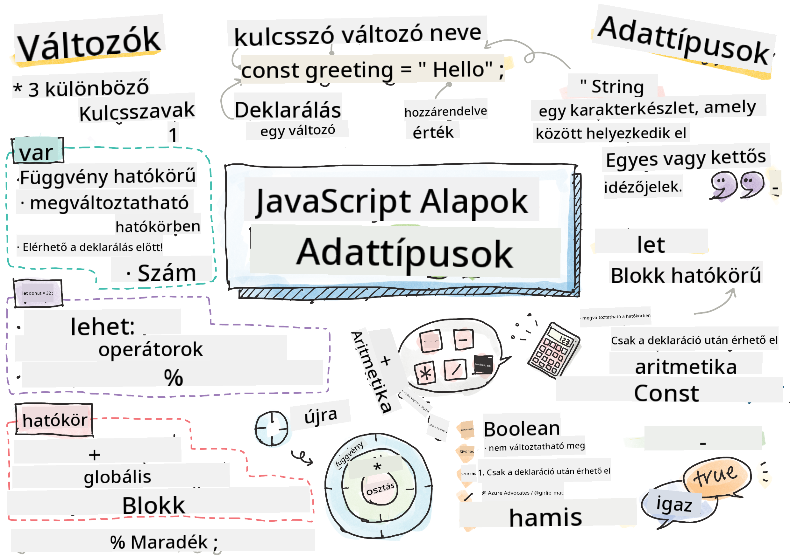

<!--
CO_OP_TRANSLATOR_METADATA:
{
  "original_hash": "b95fdd8310ef467305015ece1b0f9411",
  "translation_date": "2025-08-29T10:31:43+00:00",
  "source_file": "2-js-basics/1-data-types/README.md",
  "language_code": "hu"
}
-->
# JavaScript Alapok: Adattípusok


> Sketchnote készítette: [Tomomi Imura](https://twitter.com/girlie_mac)

## Előadás előtti kvíz
[Előadás előtti kvíz](https://ff-quizzes.netlify.app/web/)

Ez a lecke a JavaScript alapjait tárgyalja, amely a webes interaktivitást biztosítja.

> Ezt a leckét elérheted a [Microsoft Learn](https://docs.microsoft.com/learn/modules/web-development-101-variables/?WT.mc_id=academic-77807-sagibbon) oldalon!

[](https://youtube.com/watch?v=JNIXfGiDWM8 "Változók a JavaScriptben")

[](https://youtube.com/watch?v=AWfA95eLdq8 "Adattípusok a JavaScriptben")

> 🎥 Kattints a fenti képekre, hogy megnézd a változókról és adattípusokról szóló videókat!

Kezdjük a változókkal és az őket kitöltő adattípusokkal!

## Változók

A változók olyan értékeket tárolnak, amelyeket a kódodban használhatsz és megváltoztathatsz.

Egy változó **deklarálása** a következő szintaxist követi: **[kulcsszó] [név]**. Ez két részből áll:

- **Kulcsszó**. A kulcsszavak lehetnek `let` vagy `var`.  

✅ A `let` kulcsszót az ES6 vezette be, és úgynevezett _blokk szintű scope_-ot ad a változónak. Ajánlott a `let` használata a `var` helyett. A blokk szintű scope-okat részletesebben a későbbi részekben tárgyaljuk.
- **A változó neve**, amelyet te választasz meg.

### Feladat - változókkal dolgozás

1. **Deklarálj egy változót**. Deklaráljunk egy változót a `let` kulcsszóval:

    ```javascript
    let myVariable;
    ```

   A `myVariable` most már deklarálva lett a `let` kulcsszóval. Jelenleg nincs értéke.

1. **Érték hozzárendelése**. Tárolj egy értéket egy változóban az `=` operátorral, amelyet az elvárt érték követ.

    ```javascript
    myVariable = 123;
    ```

   > Megjegyzés: az `=` használata ebben a leckében azt jelenti, hogy egy "hozzárendelési operátort" használunk, amely egy értéket rendel egy változóhoz. Ez nem az egyenlőséget jelenti.

   A `myVariable` most már *inicializálva* lett a 123 értékkel.

1. **Refaktorálás**. Cseréld le a kódodat a következő utasításra:

    ```javascript
    let myVariable = 123;
    ```

    A fentieket _explicit inicializálásnak_ nevezzük, amikor egy változót deklarálnak és egy értéket rendelnek hozzá egyszerre.

1. **Változó értékének megváltoztatása**. Változtasd meg a változó értékét a következő módon:

   ```javascript
   myVariable = 321;
   ```

   Miután egy változót deklaráltál, bármikor megváltoztathatod az értékét a kódodban az `=` operátorral és az új értékkel.

   ✅ Próbáld ki! Írhatsz JavaScriptet közvetlenül a böngésződben. Nyiss meg egy böngészőablakot, és navigálj a Fejlesztői Eszközökhöz. A konzolban találsz egy promptot; írd be `let myVariable = 123`, nyomj Entert, majd írd be `myVariable`. Mi történik? Megjegyzés: ezekről a fogalmakról többet tanulsz a következő leckékben.

## Konstansok

Egy konstans deklarálása és inicializálása ugyanazokat az alapelveket követi, mint egy változóé, azzal a különbséggel, hogy a `const` kulcsszót használjuk. A konstansokat általában nagybetűkkel deklarálják.

```javascript
const MY_VARIABLE = 123;
```

A konstansok hasonlóak a változókhoz, két kivétellel:

- **Kötelező értékkel rendelkezniük**. A konstansokat inicializálni kell, különben hiba lép fel a kód futtatásakor.
- **A hivatkozás nem változtatható meg**. A konstans hivatkozása nem változtatható meg az inicializálás után, különben hiba lép fel a kód futtatásakor. Nézzünk két példát:
   - **Egyszerű érték**. A következő NEM megengedett:
   
      ```javascript
      const PI = 3;
      PI = 4; // not allowed
      ```
 
   - **Objektum hivatkozása védett**. A következő NEM megengedett.
   
      ```javascript
      const obj = { a: 3 };
      obj = { b: 5 } // not allowed
      ```

    - **Objektum értéke nincs védve**. A következő MEGENGEDETT:
    
      ```javascript
      const obj = { a: 3 };
      obj.a = 5;  // allowed
      ```

      A fenti példában az objektum értékét változtatod meg, nem pedig a hivatkozást, ezért ez megengedett.

   > Megjegyzés: a `const` azt jelenti, hogy a hivatkozás védett az újrahozzárendeléstől. Az érték azonban nem _változtathatatlan_ (immutable), és megváltozhat, különösen, ha egy összetett konstrukcióról, például egy objektumról van szó.

## Adattípusok

A változók különböző típusú értékeket tárolhatnak, például számokat és szövegeket. Ezeket a különböző értéktípusokat nevezzük **adattípusoknak**. Az adattípusok fontos szerepet játszanak a szoftverfejlesztésben, mert segítenek a fejlesztőknek eldönteni, hogyan kell megírni a kódot és hogyan kell működnie a szoftvernek. Ezenkívül néhány adattípusnak egyedi jellemzői vannak, amelyek segítenek átalakítani vagy további információkat kinyerni egy értékből.

✅ Az adattípusokat JavaScript adatprimitíveknek is nevezik, mivel ezek a nyelv által biztosított legalacsonyabb szintű adattípusok. 7 primitív adattípus létezik: string, number, bigint, boolean, undefined, null és symbol. Gondolj bele, mit képviselhet mindegyik. Mi az a `zebra`? És a `0`? `true`?

### Számok

Az előző részben a `myVariable` értéke egy szám adattípus volt.

`let myVariable = 123;`

A változók mindenféle számot tárolhatnak, beleértve a tizedeseket vagy negatív számokat is. A számok aritmetikai operátorokkal is használhatók, amelyeket a [következő részben](../../../../2-js-basics/1-data-types) tárgyalunk.

### Aritmetikai operátorok

Számos operátort használhatsz aritmetikai műveletek végrehajtására, ezek közül néhány itt található:

| Szimbólum | Leírás                                                                 | Példa                           |
| --------- | --------------------------------------------------------------------- | ------------------------------- |
| `+`       | **Összeadás**: Két szám összegét számítja ki                          | `1 + 2 //várt eredmény: 3`      |
| `-`       | **Kivonás**: Két szám különbségét számítja ki                         | `1 - 2 //várt eredmény: -1`     |
| `*`       | **Szorzás**: Két szám szorzatát számítja ki                           | `1 * 2 //várt eredmény: 2`      |
| `/`       | **Osztás**: Két szám hányadosát számítja ki                           | `1 / 2 //várt eredmény: 0.5`    |
| `%`       | **Maradék**: Két szám osztásából származó maradékot számítja ki       | `1 % 2 //várt eredmény: 1`      |

✅ Próbáld ki! Próbálj ki egy aritmetikai műveletet a böngésződ konzoljában. Meglepnek az eredmények?

### Szövegek (Strings)

A szövegek karakterek halmazai, amelyek egyes vagy dupla idézőjelek között helyezkednek el.

- `'Ez egy szöveg'`
- `"Ez is egy szöveg"`
- `let myString = 'Ez egy szövegérték, amelyet egy változóban tárolunk';`

Ne felejts el idézőjeleket használni, amikor szöveget írsz, különben a JavaScript változónévként értelmezi.

### Szövegek formázása

A szövegek szövegesek, és időnként formázásra szorulnak.

Két vagy több szöveg **összefűzéséhez**, vagyis összekapcsolásához használd a `+` operátort.

```javascript
let myString1 = "Hello";
let myString2 = "World";

myString1 + myString2 + "!"; //HelloWorld!
myString1 + " " + myString2 + "!"; //Hello World!
myString1 + ", " + myString2 + "!"; //Hello, World!

```

✅ Miért van az, hogy JavaScriptben `1 + 1 = 2`, de `'1' + '1' = 11`? Gondolkodj el rajta. Mi a helyzet a `'1' + 1`-gyel?

A **template literálok** egy másik módot kínálnak a szövegek formázására, kivéve, hogy idézőjelek helyett backtick-et használnak. Minden, ami nem egyszerű szöveg, a `${ }` helyőrzők közé kell kerüljön. Ez magában foglalja azokat a változókat is, amelyek szövegek lehetnek.

```javascript
let myString1 = "Hello";
let myString2 = "World";

`${myString1} ${myString2}!` //Hello World!
`${myString1}, ${myString2}!` //Hello, World!
```

A formázási céljaidat bármelyik módszerrel elérheted, de a template literálok tiszteletben tartják a szóközöket és a sortöréseket.

✅ Mikor használnál template literált egy egyszerű szöveg helyett?

### Booleans

A Booleans csak két értéket vehet fel: `true` vagy `false`. A Booleans segíthet eldönteni, hogy bizonyos kódsorok fussanak-e, amikor bizonyos feltételek teljesülnek. Sok esetben az [operátorok](../../../../2-js-basics/1-data-types) segítenek a Boolean értékének beállításában, és gyakran észreveszed, hogy változókat inicializálnak vagy értékeiket operátorral frissítik.

- `let myTrueBool = true`
- `let myFalseBool = false`

✅ Egy változó "igaznak" (truthy) tekinthető, ha Boolean `true`-ra értékelődik ki. Érdekes módon JavaScriptben [minden érték igaznak számít, kivéve, ha hamisnak van definiálva](https://developer.mozilla.org/docs/Glossary/Truthy).

---

## 🚀 Kihívás

A JavaScript hírhedt a meglepő módon kezelt adattípusai miatt. Kutass egy kicsit ezekről a "csapdákról". Például: a kis- és nagybetű érzékenység problémát okozhat! Próbáld ki ezt a konzolban: `let age = 1; let Age = 2; age == Age` (az eredmény `false` -- miért?). Milyen más csapdákat találsz?

## Előadás utáni kvíz
[Előadás utáni kvíz](https://ff-quizzes.netlify.app)

## Áttekintés és önálló tanulás

Nézd meg [ezt a JavaScript gyakorlófeladatok listát](https://css-tricks.com/snippets/javascript/), és próbálj ki egyet. Mit tanultál?

## Feladat

[Adattípusok gyakorlása](assignment.md)

---

**Felelősségkizárás**:  
Ez a dokumentum az [Co-op Translator](https://github.com/Azure/co-op-translator) AI fordítási szolgáltatás segítségével készült. Bár törekszünk a pontosságra, kérjük, vegye figyelembe, hogy az automatikus fordítások hibákat vagy pontatlanságokat tartalmazhatnak. Az eredeti dokumentum az eredeti nyelvén tekintendő hiteles forrásnak. Kritikus információk esetén javasolt a professzionális, emberi fordítás igénybevétele. Nem vállalunk felelősséget a fordítás használatából eredő félreértésekért vagy téves értelmezésekért.