<!--
CO_OP_TRANSLATOR_METADATA:
{
  "original_hash": "672b0bb6e8b431075f3bdb7130590d2d",
  "translation_date": "2026-01-07T02:30:30+00:00",
  "source_file": "2-js-basics/1-data-types/README.md",
  "language_code": "hu"
}
-->
# JavaScript alapok: Adattípusok


> Sketchnote készítette: [Tomomi Imura](https://twitter.com/girlie_mac)

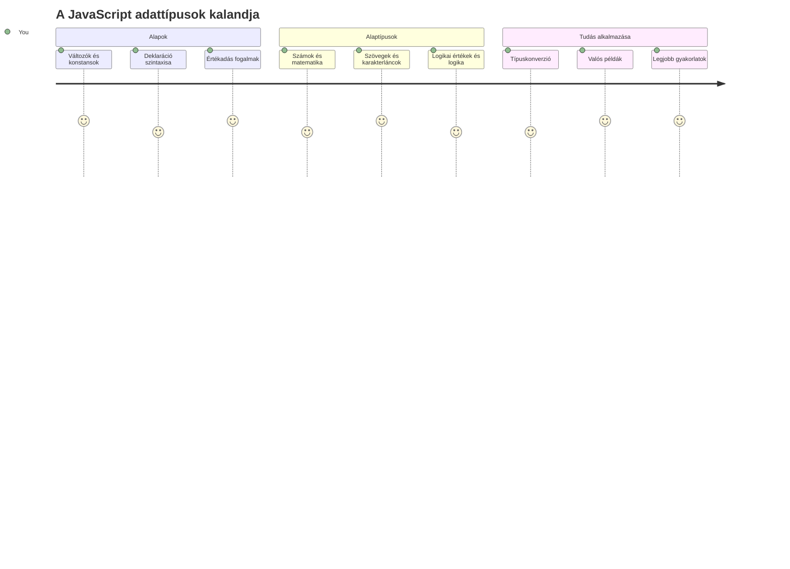
Az adattípusok a JavaScript egyik alapvető fogalma, amivel minden általad írt programban találkozol. Gondolj az adattípusokra úgy, mint az alexandriai ősi könyvtárosok által használt iratrendszerre – külön helyük volt a költészetről, matematikáról és történelmi feljegyzésekről szóló tekercseknek. A JavaScript hasonló módon rendezi az információkat, külön kategóriákba sorolva az adat különböző fajtáit.

Ebben az órában megismerkedünk a JavaScript működéséhez szükséges alapvető adattípusokkal. Megtanulod, hogyan kezeld a számokat, a szöveget, az igaz/hamis értékeket, és megérted, miért fontos a helyes típus kiválasztása a programjaidhoz. Ezek a fogalmak elsőre elvontnak tűnhetnek, de gyakorlással másodlagos természetté válnak.

Az adattípusok megértése sokkal átláthatóbbá teszi a JavaScript többi részét. Ahogy az építészeknek is ismerniük kell az építőanyagokat, mielőtt katedrálist emelnek, ezek az alapok támogatják az összes későbbi munkádat.

## Előadás előtti kvíz
[Előadás előtti kvíz](https://ff-quizzes.netlify.app/web/)

Ez az óra a JavaScript alapjait fedi le, amely a weben az interaktivitást biztosítja.

> Ezt az órát elvégezheted a [Microsoft Learn](https://docs.microsoft.com/learn/modules/web-development-101-variables/?WT.mc_id=academic-77807-sagibbon) oldalon is!

[](https://youtube.com/watch?v=JNIXfGiDWM8 "Változók JavaScriptben")

[](https://youtube.com/watch?v=AWfA95eLdq8 "Adattípusok JavaScriptben")

> 🎥 Kattints a fenti képekre a változók és adattípusok videóiért

Kezdjük a változókkal és az őket kitöltő adattípusokkal!

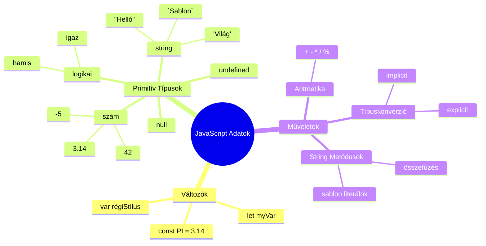
## Változók

A változók a programozás alapvető építőelemei. Mint a középkori alkimisták által használt felcímkézett üvegek, amelyekben különféle anyagokat tároltak, a változók lehetővé teszik az információ tárolását, és egy leíró nevet adnak neki, hogy később hivatkozhass rá. Szeretnéd megjegyezni valakinek az életkorát? Tárold egy `age` nevű változóban. Követnéd egy felhasználó nevét? Tartsd egy `userName` nevű változóban.

A modern változólétrehozási megközelítésre koncentrálunk JavaScriptben. Az itt tanult technikák a nyelv évek során lezajlott fejlődésének és a programozói közösség jó gyakorlataiban fejlesztett módszereknek az eredményei.

Változó létrehozásának és **deklarálásának** szintaxisa a következő **[kulcsszó] [név]**. Két részből áll:

- **Kulcsszó.** Használd a `let`-et változókhoz, amelyek értéke változhat, vagy a `const`-ot olyan értékekhez, amik állandóak.
- **A változó neve**, egy általad választott leíró név.

✅ A `let` kulcsszót az ES6 vezette be, és lehetővé teszi a változó számára az úgynevezett _blokkszintű hatókört_. Ajánlott `let`-et vagy `const`-ot használni a régebbi `var` helyett. A blokkszintű hatóköröket a későbbi részekben részletesebben tárgyaljuk.

### Feladat – változókkal való munka

1. **Deklarálj egy változót!** Kezdjük az első változónk létrehozásával:

    ```javascript
    let myVariable;
    ```

   **Ez mit eredményez:**
   - Ez megmondja a JavaScriptnek, hogy hozzon létre egy `myVariable` nevű tárolóhelyet
   - A JavaScript lefoglal helyet a memóriában ehhez a változóhoz
   - A változó jelenleg nincs értéke (undefined)

2. **Adj neki értéket!** Most töltsük fel valamilyen értékkel a változót:

    ```javascript
    myVariable = 123;
    ```

   **Az értékadás működése:**
   - Az `=` operátor értéket rendel a változóhoz, jelen esetben 123-at
   - A változó most már az adott értéket tartalmazza, nem undefined
   - A `myVariable` segítségével a kódodban hivatkozhatsz erre az értékre

   > Megjegyzés: az `=` használata ebben az órában egy "értékadó operátort" jelent, amelyet érték hozzárendelésére használunk. Nem egyenlőséget jelöl.

3. **Csináld okosan!** Valójában egyesítsük ezt a két lépést:

    ```javascript
    let myVariable = 123;
    ```

    **Ez a megközelítés hatékonyabb:**
    - Egyszerre deklarálod a változót és rendelsz hozzá értéket
    - Ez a fejlesztők által használt szokásos gyakorlat
    - Csökkenti a kód hosszát, miközben megőrzi az átláthatóságot

4. **Gondolj újra!** Mi van, ha más számot szeretnénk tárolni?

   ```javascript
   myVariable = 321;
   ```

   **Az újraértékadás megértése:**
   - A változó most 321-et tartalmaz az eredeti 123 helyett
   - Az előző érték felülíródik – a változók egyszerre csak egy értéket tárolnak
   - Ez a változtathatóság a `let`-tel deklarált változók kulcsjellemzője

   ✅ Próbáld ki! Böngésződben írhatsz közvetlenül JavaScriptet. Nyisd meg a böngésző eszközfejlesztőit, a konzolban találsz promptot; írd be: `let myVariable = 123`, nyomj entert, majd írd be: `myVariable`. Mi történik? Figyelem, ezekről a fogalmakról többet tanulsz a következő leckékben.

### 🧠 **Változók jártassági ellenőrzése**

**Lássuk, hogy állsz a változókkal:**
- Tudod magyarázni a különbséget a deklarálás és az értékadás között?
- Mi történik, ha használni próbálsz egy változót, mielőtt deklarálnád?
- Mikor választanád a `let`-et a `const` helyett egy változóhoz?

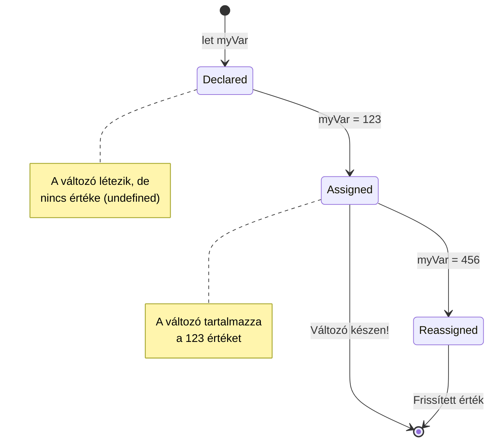
> **Gyors tipp**: Gondolj a változókra úgy, mint felcímkézett tárolódobozokra. Létrehozod a dobozt (`let`), teszel bele valamit (`=`), és később kicserélheted a tartalmát, ha szükséges!

## Konstansok

Néha olyan információt kell tárolni, ami nem változhat a program futása alatt. Gondolj a konstansokra, mint az ókori Görögországban Eukleidész által megalkotott matematikai alapelvekre – egyszer bebizonyították és dokumentálták, azok későbbi hivatkozásig változatlanok maradtak.

A konstansok hasonlóan működnek, mint a változók, de egy fontos korlátozással: az értékük egyszer hozzárendelve, nem változtatható. Ez az állandóság megakadályozza a kritikus értékek véletlen módosítását a programodban.

A konstans deklarálás és inicializálás ugyanazokat az alapelveket követi, mint a változóké, azzal a különbséggel, hogy a `const` kulcsszót használjuk. A konstansokat általában nagybetűvel nevezzük el.

```javascript
const MY_VARIABLE = 123;
```

**Ez a kód mit csinál:**
- **Létrehoz** egy `MY_VARIABLE` nevű konstansot, amely értéke 123
- **Használ** nagybetűs konvenciót a konstansokhoz
- **Megakadályoz** bármilyen későbbi változtatást az értéken

A konstansokra két fő szabály vonatkozik:

- **Azonnal értéket kell adni nekik** – nem lehet üres konstans!
- **Az érték soha nem változtatható meg** – ha megpróbálod, JavaScript hibát dob. Nézzük, mire gondolok:

   **Egyszerű érték** – A következők NEM megengedettek:
   
      ```javascript
      const PI = 3;
      PI = 4; // nem megengedett
      ```

   **Ezt jegyezd meg:**
   - A konstans újraértékadási kísérlete hibát okoz
   - Megvédi a fontos értékeket a véletlen változtatásoktól
   - Garantálja, hogy az érték következetes marad a program során
 
   **Objektum hivatkozás védett** – A következő NEM engedélyezett:
   
      ```javascript
      const obj = { a: 3 };
      obj = { b: 5 } // nem megengedett
      ```

   **Ezt jelenti:**
   - Megakadályozza, hogy az egész objektumot egy újra cseréljük
   - Védi az eredeti objektum hivatkozását
   - Fenntartja az objektum identitását a memóriában

    **Objektum érték nem védett** – A következő MEGENGEDHETŐ:
    
      ```javascript
      const obj = { a: 3 };
      obj.a = 5;  // engedélyezett
      ```

      **Ez történik itt:**
      - Módosítja az objektumon belüli tulajdonság értékét
      - Megtartja az objektum azonos hivatkozását
      - Mutatja, hogy az objektum tartalma változhat, miközben a hivatkozás állandó marad

   > Megjegyzés: a `const` azt jelenti, hogy a hivatkozás védett az újraértékadástól. Az érték nem _immobilis_, és változhat, különösen, ha összetett struktúráról, például objektumról van szó.

## Adattípusok

A JavaScript különböző kategóriákba sorolja az információt, amelyeket adattípusoknak hívunk. Ez a fogalom hasonló az ókori tudósok tudásrendszerezéséhez – Arisztotelész például különbséget tett az érvelés típusai között, felismerve, hogy a logikai elveket nem lehet egyformán alkalmazni költészetre, matematikára és természetfilozófiára.

Az adattípusok azért fontosak, mert különböző műveletek különböző típusú információkkal működnek. Ahogy nem lehet számítást végezni egy ember nevével, vagy matematikai egyenletet ábécé sorrendbe rendezni, a JavaScript is igényli az adott műveletnek megfelelő adattípust. Ennek megértése hibák elkerülését segíti, és megbízhatóbbá teszi a kódodat.

A változók sokféle értéket tárolhatnak, például számokat vagy szöveget. Ezeket az értékek különböző típusait hívjuk **adattípusnak**. Az adattípusok fontosak a szoftverfejlesztésben, mert segítik a fejlesztőt a kódírás és a program futásának módjának megválasztásában. Ezen felül egyes adattípusok különleges jellemzőket is hordozhatnak, amelyek segítségével egy érték további információira lehet következtetni vagy átalakítani azt.

✅ Az adattípusokat JavaScript adatprimitíveknek is hívják, mert ezek a nyelv alacsony szintű adattípusai. Hét primitív adattípus van: string, number, bigint, boolean, undefined, null és symbol. Szánj egy percet arra, hogy elképzeld, mit jelenthet mindegyik. Mi az a `zebra`? És mi a `0`? Vagy a `true`?

### Számok

A számok a legegyszerűbb adattípus a JavaScriptben. Legyen szó egész számról, mint a 42, tizedes tört értékről, mint a 3.14, vagy negatív számról, mint az -5, a JavaScript ezeket egységesen kezeli.

Emlékszel az előző változónkra? Amelyikbe 123-at tároltunk? Az valójában egy szám adattípus volt:

```javascript
let myVariable = 123;
```

**Fő jellemzők:**
- A JavaScript automatikusan felismeri a numerikus értékeket
- Matematikai műveleteket végezhetsz ezekkel a változókkal
- Nem szükséges külön típusdeklaráció

A változók bármilyen számot tárolhatnak, beleértve tizedeseket vagy negatív számokat is. A számok aritmetikai operátorokkal is használhatók, erről a [következő részben](../../../../2-js-basics/1-data-types) olvashatsz.

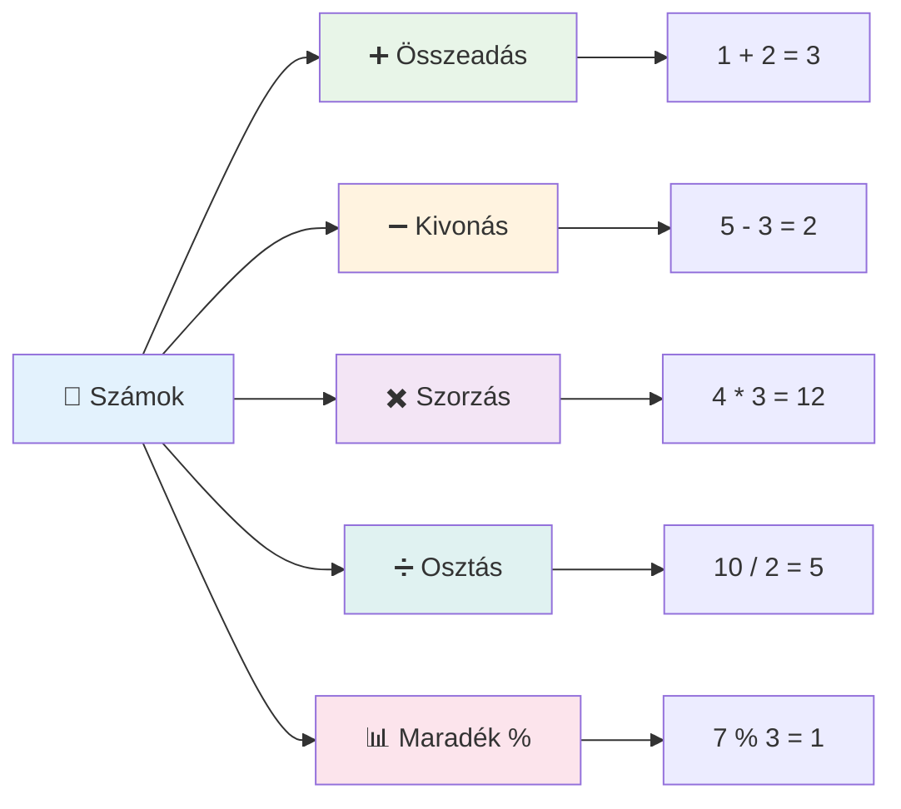
### Aritmetikai operátorok

Az aritmetikai operátorok lehetővé teszik a matematikai számításokat JavaScriptben. Ezek az operátorok ugyanazokat az alapelveket követik, amelyeket a matematikusok évszázadokon át használtak – ugyanazok a jelek szerepeltek tudósok, például Al-Khwarizmi írásaiban, aki az algebrai jelölést fejlesztette ki.

Az operátorok úgy működnek, ahogy a hagyományos matematikában elvárható: a plusz az összeadást, a mínusz a kivonást, és így tovább jelenti.

Számos típusú operátor létezik aritmetikai funkciók elvégzéséhez, itt néhány közülük:

| Szimbólum | Leírás                                                               | Példa                             |
| --------- | ------------------------------------------------------------------- | -------------------------------- |
| `+`       | **Összeadás**: két szám összegének kiszámítása                      | `1 + 2 //a várt válasz 3`        |
| `-`       | **Kivonás**: két szám különbségének kiszámítása                     | `1 - 2 //a várt válasz -1`       |
| `*`       | **Szorzás**: két szám szorzatának kiszámítása                       | `1 * 2 //a várt válasz 2`        |
| `/`       | **Osztás**: két szám hányadosának kiszámítása                       | `1 / 2 //a várt válasz 0.5`      |
| `%`       | **Maradékosztás**: két szám osztásának maradékának kiszámítása     | `1 % 2 //a várt válasz 1`        |

✅ Próbáld ki! Végezhetsz aritmetikai műveletet az böngésző konzoljában. Meglepnek a kapott eredmények?

### 🧮 **Matematikai tudás ellenőrzése: Biztos számítás**

**Teszteld az aritmetikai ismereteidet:**
- Mi a különbség a `/` (osztás) és a `%` (maradékosztás) operátorok között?
- Meg tudod jósolni, hogy mennyi a `10 % 3` eredménye? (Tipp: nem 3.33...)
- Miért lehet hasznos a maradékosztás programozásban?

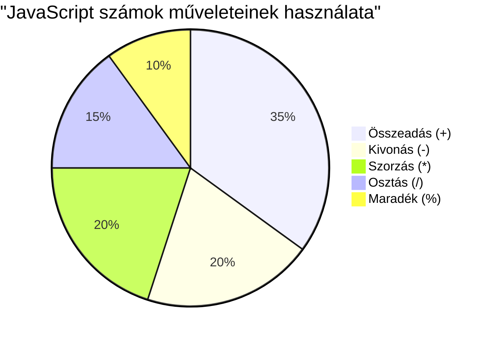
> **Valós példa**: A maradékosztás (%) nagyon hasznos, ha meg akarod vizsgálni, hogy egy szám páros vagy páratlan, mintákat hozol létre, vagy tömbök között ciklikusan lépkedsz!

### Szövegek (Strings)

A JavaScriptben a szöveges adatokat stringek (karaktersorozatok) reprezentálják. A "string" kifejezés onnan ered, hogy olyan karaktereket jelöl, amelyeket egymás mögé fűznek, hasonlóan a középkori remeték által készített kéziratok betűinek összekapcsolásához, hogy szókat és mondatokat alkossanak.

A stringek alapvetőek a webfejlesztésben. A weboldalon megjelenő minden szövegrészlet – felhasználónevek, gombfeliratok, hibaüzenetek, tartalom – stringként van kezelve. A stringek ismerete létfontosságú a funkcionális felhasználói felületek készítéséhez.

A stringek olyan karakterek halmaza, amelyeket egyetlen vagy dupla idézőjel között helyezünk el.

```javascript
'This is a string'
"This is also a string"
let myString = 'This is a string value stored in a variable';
```

**Ezeket kell tudni:**
- String definícióhoz használhatsz egyedi `'` vagy dupla `"` idézőjeleket
- Szöveges adatokat tárol, amelyek tartalmazhatnak betűket, számokat és szimbólumokat
- A string értékeket változókhoz rendelheted későbbi felhasználásra
- Idézőjeleket kell használni, hogy megkülönböztesd a szöveget a változónévktől

Ne feledd, mindig idézőjeleket használj string írásakor, különben a JavaScript változónévként fogja értelmezni.

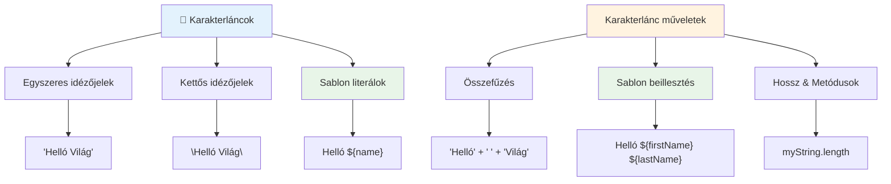
### Stringek formázása

A string manipuláció lehetővé teszi, hogy szöveg elemeket összefűzz, változókat illess be, és dinamikus tartalmat hozz létre, amely a program állapotának megfelelően változik. Ez a technika lehetővé teszi a szöveg programozott összeállítását.

Gyakran szükség van több string összefűzésére – ezt hívjuk konkatenációnak.
A **két vagy több sztring összefűzéséhez**, vagy összekapcsolásához használjuk a `+` operátort.

```javascript
let myString1 = "Hello";
let myString2 = "World";

myString1 + myString2 + "!"; //HellóVilág!
myString1 + " " + myString2 + "!"; //Helló Világ!
myString1 + ", " + myString2 + "!"; //Helló, Világ!
```

**Lépésről lépésre, ez történik:**
- **Összekapcsol** több sztringet a `+` operátor segítségével
- **Összefűzi** a sztringeket közvetlenül szóközök nélkül az első példában
- **Beszúr** szóközöket `" "` a sztringek közé az olvashatóság érdekében
- **Beilleszt** írásjeleket, például vesszőket a megfelelő formázás érdekében

✅ Miért igaz az, hogy JavaScriptben `1 + 1 = 2`, de `'1' + '1' = 11`? Gondolkodj el rajta. És mi a helyzet a `'1' + 1`-gyel?

**Sablon literálok** egy másik módja a sztringek formázásának, amikor a idézőjelek helyett fordított idézőjelet (backtick) használunk. Bármi, ami nem sima szöveg, helyezkedjen el `${ }` helyettesítő jelölők között. Ez vonatkozik bármilyen változókra is, amelyek sztringek lehetnek.

```javascript
let myString1 = "Hello";
let myString2 = "World";

`${myString1} ${myString2}!` //Helló Világ!
`${myString1}, ${myString2}!` //Helló, Világ!
```

**Értsük meg minden részletét:**
- **Használja** a hátidézőjelet `` ` `` az egyszerű idézőjelek helyett sablon literálok létrehozásához
- **Beágyazza** a változókat közvetlenül a `${}` helyettesítő jel segítségével
- **Megőrzi** a szóközöket és formázást pontosan úgy, ahogy írva van
- **Könnyebbé teszi** a változókat tartalmazó bonyolult sztringek létrehozását

Bármelyik módszerrel elérheted a kívánt formázást, de a sablon literálok tiszteletben tartják a szóközöket és a sortöréseket.

✅ Mikor használnád szívesebben a sablon literált, mint az egyszerű sztringet?

### 🔤 **Sztring Mesterteszt: Szövegmanipulációs Biztonság**

**Értékeld sztring ismereteidet:**
- El tudod magyarázni, miért egyenlő `'1' + '1'` `'11'`-gyel ahelyett, hogy `2` lenne?
- Melyik sztring metódust találod olvashatóbbnak: az összefűzést vagy a sablon literálokat?
- Mi történik, ha elfelejted az idézőjeleket egy sztring körül?

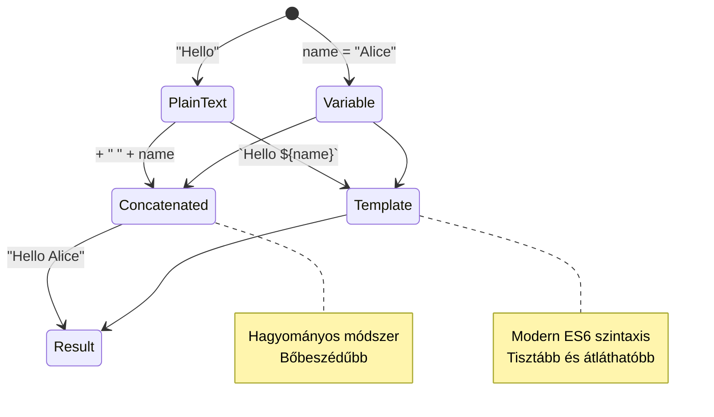
> **Pro tipp**: A sablon literálokat általában bonyolultabb sztringépítéshez ajánlják, mert olvashatóbbak és szépen kezelik a többsoros sztringeket!

### Booleánok

A booleánok az adatok legegyszerűbb formáját képviselik: csak két értékük lehet – `true` vagy `false`. Ez a bináris logikai rendszer George Boole, egy 19. századi matematikus munkájára vezethető vissza, aki kidolgozta a Boole-algebrát.

Egyszerűségük ellenére a booleán értékek alapvetőek a programlogikában. Lehetővé teszik a kód számára, hogy döntéseket hozzon feltételek alapján – például hogy egy felhasználó be van-e jelentkezve, megnyomták-e egy gombot, vagy teljesülnek-e bizonyos kritériumok.

A booleánok csak két értéket vehetnek fel: `true` vagy `false`. Segítségükkel eldönthető, hogy bizonyos kódsorok lefutnak-e, ha adott feltételek teljesülnek. Sok esetben az [operátorok](../../../../2-js-basics/1-data-types) segítenek beállítani egy booleán értékét, és gyakran figyelhetjük meg, hogy változók inicializálása vagy értékük frissítése operátorral történik.

```javascript
let myTrueBool = true;
let myFalseBool = false;
```

**A fenti példában:**
- **Létrehoztunk** egy változót, amely a `true` booleán értéket tárolja
- **Bemutattuk**, hogyan tároljuk el a `false` booleán értéket
- **Használtuk** a pontos `true` és `false` kulcsszavakat (idézőjelek nélkül)
- **Felhasználtuk** ezeket a változókat feltételes utasításokban való alkalmazásra

✅ Egy változó „igazságosnak” tekinthető, ha az értéke a booleán `true`-nak felel meg. Érdekesség, hogy JavaScriptben [minden érték igazságos, hacsak nem hamisnak definiálják](https://developer.mozilla.org/docs/Glossary/Truthy).

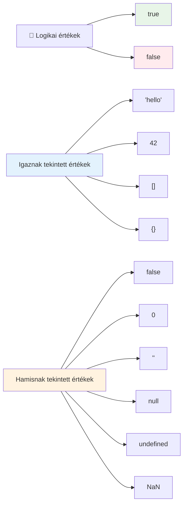
### 🎯 **Booleán logika teszt: Döntéshozatali képességek**

**Teszteld booleán ismereteidet:**
- Miért gondolod, hogy JavaScriptnek „igazságos” és „hamis” értékei is vannak az egyszerű `true` és `false` mellett?
- Meg tudod tippelni, melyik az alábbiak közül hamis érték: `0`, `"0"`, `[]`, `"false"`?
- Hogyan lehetnek a booleánok hasznosak a programfolyamat szabályozásában?

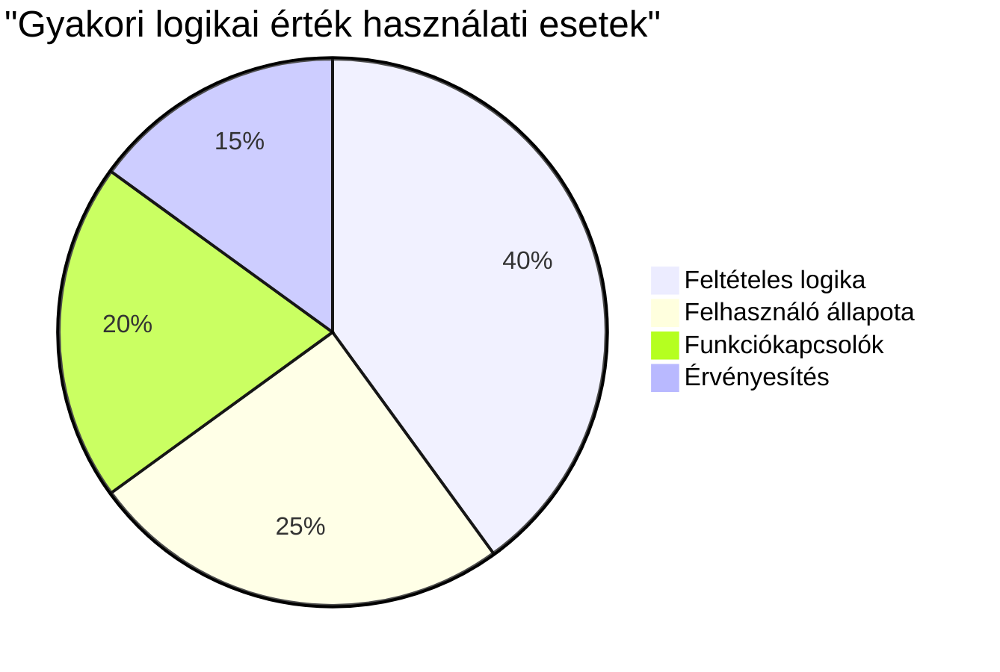
> **Emlékeztető**: JavaScriptben csak 6 érték hamis: `false`, `0`, `""`, `null`, `undefined` és `NaN`. Minden más igazságos!

---

## 📊 **Az adatok típusainak összefoglalója**

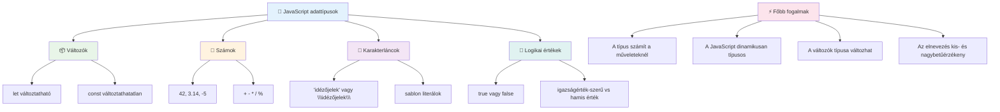
## GitHub Copilot Ügynök kihívás 🚀

Használd az Agent módot az alábbi kihívás teljesítéséhez:

**Leírás:** Készíts egy személyes információkezelő alkalmazást, amely bemutatja a tanult JavaScript adattípusokat valós adatkezelési helyzetekben.

**Feladat:** Írj egy JavaScript programot, amely létrehoz egy felhasználói profil objektumot, amely tartalmazza: a személy nevét (string), életkorát (szám), tanulói státuszt (boolean), kedvenc színeit tömbként, és egy cím objektumot utcával, várossal és irányítószámmal. Tartalmazzon funkciókat a profil információk megjelenítésére és egyéni mezők frissítésére. Mutasd be a sztring összefűzést, sablon literálokat, aritmetikai műveleteket az életkorral, és booleán logikát a tanulói státusz kezeléséhez.

További információ az [agent módáról](https://code.visualstudio.com/blogs/2025/02/24/introducing-copilot-agent-mode).

## 🚀 Kihívás

A JavaScriptnek vannak olyan viselkedési sajátosságai, amelyek meglephetik a fejlesztőket. Itt egy klasszikus példa: próbáld ki a böngésződ konzoljában: `let age = 1; let Age = 2; age == Age` és figyeld meg az eredményt. Ez `false` értéket ad – meg tudod mondani, miért?

Ez csak egy a sok JavaScript viselkedési jellemző közül, amit érdemes megérteni. Ezek ismerete segít megbízhatóbb kód írásában és a hibák hatékonyabb felderítésében.

## Előadás utáni kvíz
[Előadás utáni kvíz](https://ff-quizzes.netlify.app)

## Áttekintés & Önálló tanulás

Nézd meg [ezt a JavaScript gyakorlatsort](https://css-tricks.com/snippets/javascript/) és próbálj ki egy feladatot. Mit tanultál?

## Feladat

[Adattípusok gyakorlása](assignment.md)

## 🚀 JavaScript adattípus mesterkurzus idővonalad

### ⚡ **Mit tehetsz meg a következő 5 percben**
- [ ] Nyisd meg a böngésző konzolt és hozz létre 3 változót különböző adattípusokkal
- [ ] Próbáld ki a kihívást: `let age = 1; let Age = 2; age == Age` és derítsd ki, miért hamis az eredmény
- [ ] Gyakorold sztring összefűzéssel a neved és kedvenc számod összekapcsolását
- [ ] Teszteld, mi történik, ha számot adsz hozzá sztringhez

### 🎯 **Mit érhetsz el ezen az órán**
- [ ] Teljesítsd az előadás utáni kvízt és ismételd át az összetettebb témákat
- [ ] Készíts egy mini kalkulátort, ami összead, kivon, szoroz és oszt két számot
- [ ] Írj egy egyszerű névformázót sablon literálokkal
- [ ] Fedezd fel a `==` és `===` összehasonlító operátorok közötti különbségeket
- [ ] Gyakorold az adattípusok közötti konvertálást

### 📅 **Heti alap JavaScript feladatok**
- [ ] Készítsd el a feladatot magabiztosan és kreatívan
- [ ] Hozz létre egy személyes profil objektumot az összes tanult adattípussal
- [ ] Gyakorolj a [CSS-Tricks JavaScript feladatokkal](https://css-tricks.com/snippets/javascript/)
- [ ] Készíts egy egyszerű űrlap ellenőrzőt booleán logikával
- [ ] Kísérletezz tömb és objektum adattípusokkal (a következő leckék előzetese)
- [ ] Csatlakozz egy JavaScript közösséghez és kérdezz az adattípusokról

### 🌟 **Havi fejlődési terv**
- [ ] Integráld az adattípus-ismereteket nagyobb programozási projektekbe
- [ ] Értsd meg, mikor és miért érdemes az adott adattípust használni valós alkalmazásokban
- [ ] Segíts más kezdőknek megérteni a JavaScript alapjait
- [ ] Készíts egy kis alkalmazást, amely különféle felhasználói adatokat kezel
- [ ] Fedezd fel a fejlett adattípus fogalmakat, mint a típuskonverzió és a szigorú egyenlőség
- [ ] Közreműködj nyílt forráskódú JavaScript projektek dokumentációjának fejlesztésében

### 🧠 **Záró adattípus mester teszt**

**Ünnepeld meg JavaScript alapjaidat:**
- Melyik adattípus viselkedése lepett meg a legjobban?
- Mennyire érzed magad kényelmesen, amikor változókat és konstansokat magyarázol egy barátnak?
- Mi volt a legérdekesebb dolog, amit a JavaScript típus rendszeréről fedeztél fel?
- Milyen valós alkalmazást tudsz elképzelni ezek alapján?

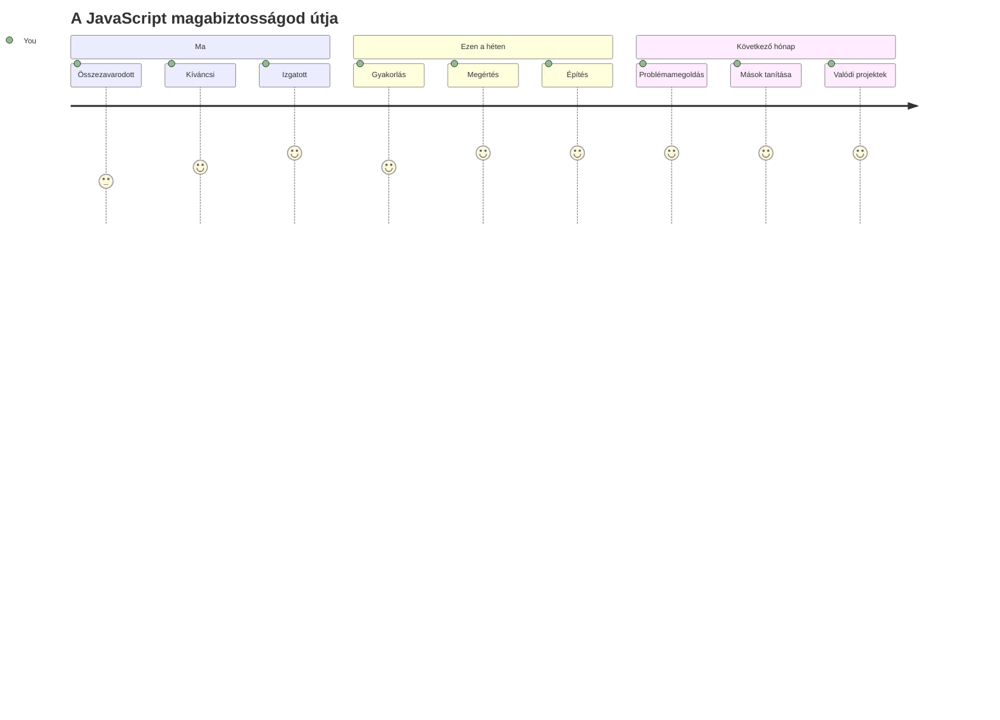
> 💡 **Megépítetted az alapokat!** Az adattípusok megértése olyan, mint az ábécé megtanulása történetíráshoz. Minden JavaScript program, amit valaha írni fogsz, használni fogja ezeket az alapvető fogalmakat. Most már megvannak az eszközeid interaktív weboldalak, dinamikus alkalmazások létrehozásához és valós problémák kód általi megoldásához. Üdv a JavaScript csodálatos világában! 🎉

---

<!-- CO-OP TRANSLATOR DISCLAIMER START -->
**Jó tudni**:
Ezt a dokumentumot az AI fordító szolgáltatás [Co-op Translator](https://github.com/Azure/co-op-translator) segítségével fordítottuk. Bár az pontosságra törekszünk, kérjük, vegye figyelembe, hogy az automatikus fordítások hibákat vagy pontatlanságokat tartalmazhatnak. Az eredeti dokumentum a saját nyelvén tekintendő hivatalos forrásnak. Kritikus információk esetén szakmai, emberi fordítást javaslunk. Nem vállalunk felelősséget az ebből eredő félreértésekért vagy félreértelmezésekért.
<!-- CO-OP TRANSLATOR DISCLAIMER END -->