# JavaScript Alapok: Metódusok és Függvények

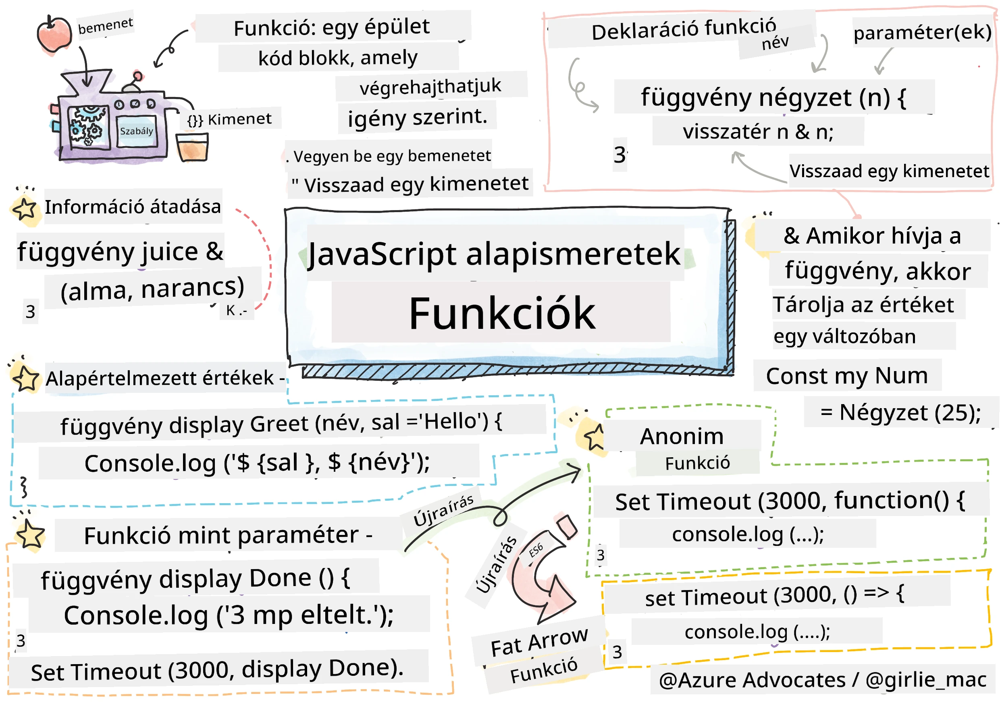
> Vázlat Tomomi Imura tollából ([Tomomi Imura](https://twitter.com/girlie_mac))

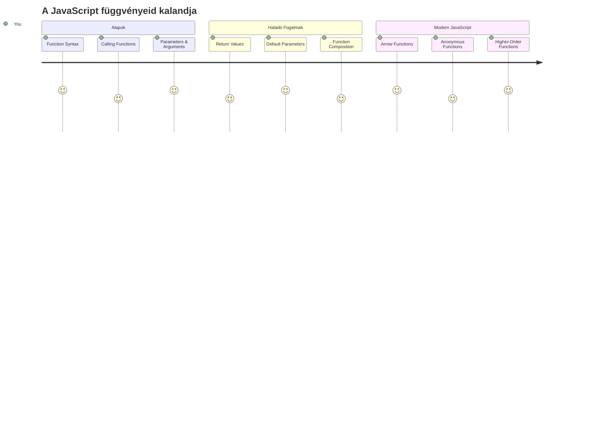
## Előadás Előtti Kvíz
[Előadás előtti kvíz](https://ff-quizzes.netlify.app)

Ugyanannak a kódnak az ismételt írása az egyik leggyakoribb frusztráció a programozásban. A függvények ezt a problémát oldják meg azzal, hogy lehetővé teszik a kód újrahasznosítható blokkokba csomagolását. Gondolj a függvényekre úgy, mint azokra a szabványosított alkatrészekre, amelyek Henry Ford futószalagját forradalmivá tették – ha egyszer létrehozol egy megbízható elemet, bárhol használhatod, anélkül, hogy újra kellene építened.

A függvények lehetővé teszik, hogy a kód egy darabját összecsomagold, és aztán újra felhasználd a programod során. Ahelyett, hogy mindenhol ugyanazt a logikát másolnád be, egyszer létrehozod a függvényt, és hívod, amikor szükséges. Ez a megközelítés rendezetté teszi a kódod, és sokkal egyszerűbbé válik a frissítés.

Ebben a leckében megtanulod, hogyan készíts saját függvényeket, hogyan adj át nekik információt, és hogyan kapj vissza hasznos eredményeket. Megismered a függvények és metódusok közötti különbséget, tanulsz modern szintaxisokat, és meglátod, hogyan működhetnek együtt a függvények. Lépésről lépésre átvezetünk ezeken a fogalmakon.

[](https://youtube.com/watch?v=XgKsD6Zwvlc "Metódusok és Függvények")

> 🎥 Kattints a fenti képre, hogy megnézz egy videót a metódusokról és függvényekről.

> Ezt a leckét elvégezheted a [Microsoft Learn oldalán](https://docs.microsoft.com/learn/modules/web-development-101-functions/?WT.mc_id=academic-77807-sagibbon)!

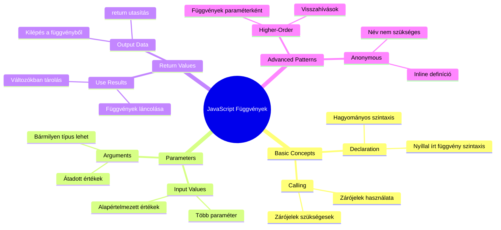
## Függvények

A függvény egy önállóan zárt kódblokk, amely egy adott feladatot végez el. Olyan logikát foglal magába, amit előhívhatsz, amikor csak szükség van rá.

Ahelyett, hogy ugyanazt a kódot több helyen írnád meg a programban, csomagold be egy függvénybe, és hívd meg a függvényt, amikor szükséges. Ez a megközelítés megtisztítja a kódod, és a módosításokat sokkal könnyebbé teszi. Gondolj csak bele, milyen nehéz lenne karbantartani, ha egy logikát 20 különböző helyen kellene megváltoztatnod a kódbázisban.

Fontos, hogy leíró neveket adj a függvényeidnek. Egy jól elnevezett függvény világosan kommunikálja a célját – amikor például a `cancelTimer()`-t látod, azonnal érted, mit tesz, ahogyan egy egyértelműen felcímkézett gomb is pontosan megmutatja, mi történik, ha rákattintasz.

## Függvény létrehozása és meghívása

Nézzük meg, hogyan lehet létrehozni egy függvényt. A szintaxis egy következetes mintát követ:

```javascript
function nameOfFunction() { // függvény definíció
 // függvény definíció/törzs
}
```

Bontsuk le ezt:
- A `function` kulcsszó jelzi a JavaScriptnek: „Hé, most egy függvényt hozok létre!”
- A `nameOfFunction` helyére adhatod a függvényed leíró nevét
- A zárójelek `()` paraméterek helye (erről majd hamarosan szó lesz)
- A kapcsos zárójelek `{}` tartalmazzák a tényleges kódot, ami akkor fut le, amikor meghívod a függvényt

Most készítsünk egy egyszerű üdvözlő függvényt, hogy lássuk ezt a gyakorlatban:

```javascript
function displayGreeting() {
  console.log('Hello, world!');
}
```

Ez a függvény kiírja a "Hello, world!" üzenetet a konzolra. Miután definiáltad, bármennyiszer használhatod.

A függvény végrehajtásához (vagyis a "meghívásához") írd le a nevét, majd tedd utána a zárójeleket. A JavaScript megengedi, hogy a függvényt a hívás előtt vagy után definiáld – a JavaScript motor kezeli a végrehajtási sorrendet.

```javascript
// a függvényünk hívása
displayGreeting();
```

Ennek a sor futtatásakor lefut az összes kód a `displayGreeting` függvényen belül, és a böngésző konzolján megjelenik a "Hello, world!" üzenet. Ezt a függvényt többször is meghívhatod.

### 🧠 **Függvény Alapismeretek Ellenőrzése: Az Első Függvényeid Felépítése**

**Nézzük, hogy állsz az alapokkal:**
- Meg tudod magyarázni, miért használunk kapcsos zárójeleket `{}` a függvénydefinícióban?
- Mi történik, ha a `displayGreeting`-et írod ki zárójelek nélkül?
- Miért lehet hasznos ugyanazt a függvényt többször meghívni?

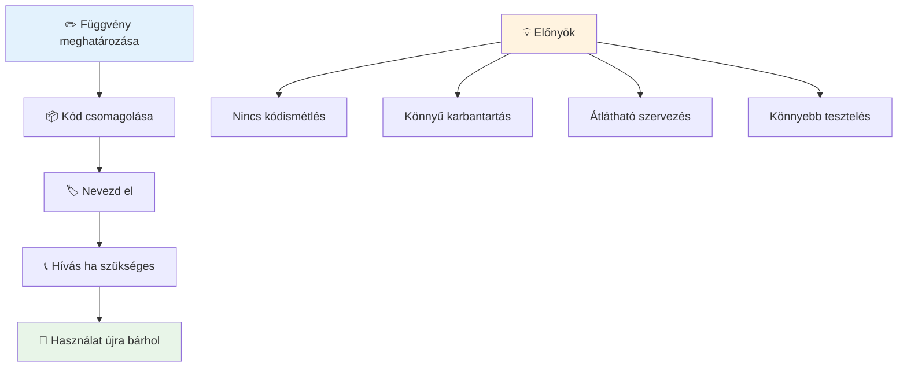
> **Megjegyzés:** Ezekben a leckékben **metódusokat** is használtál. A `console.log()` egy metódus – lényegében egy olyan függvény, amely a `console` objektumhoz tartozik. A legfőbb különbség, hogy a metódusok objektumokhoz kötöttek, míg a függvények önállóan léteznek. Sok fejlesztő ezeket a kifejezéseket beszélgetésekben szinonimaként használja.

### Függvényírás legjobb gyakorlatai

Íme néhány tipp, hogy nagyszerű függvényeket írj:

- Adj a függvényeidnek világos, leíró neveket – később hálás leszel magadnak!
- Használj **camelCase** írásmódot többszavas nevekhez (például `calculateTotal` a `calculate_total` helyett)
- Törekedj arra, hogy minden függvény egyetlen dolgot csináljon jól

## Információ átvitele függvénynek

A `displayGreeting` függvényünk korlátozott – csak mindenki számára "Hello, world!"-öt tud megjeleníteni. A paraméterek lehetővé teszik, hogy a függvény rugalmasabb és hasznosabb legyen.

A **paraméterek** olyan helyőrzők, ahová minden futtatáskor különböző értékeket adhatsz, így ugyanaz a függvény különböző információkkal dolgozhat.

A paramétereket a zárójelek között sorolod fel a függvény definiálásakor, vesszővel elválasztva:

```javascript
function name(param, param2, param3) {

}
```

Minden paraméter úgy viselkedik, mint egy helyőrző – amikor valaki meghívja a függvényed, ő majd megadja azokat a tényleges értékeket, amelyek ezekbe a helyekbe kerülnek.

Frissítsük az üdvözlő függvényünket úgy, hogy elfogadjon valaki nevét:

```javascript
function displayGreeting(name) {
  const message = `Hello, ${name}!`;
  console.log(message);
}
```

Láthatod, hogy hogyan használunk backtickeket (`` ` ``) és `${}`-t, hogy közvetlenül az üzenetbe illesszük be a nevet – ez egy ún. template literal, ami nagyon kényelmes módja a változókat tartalmazó szövegek építésének.

Most már amikor meghívjuk a függvényt, bármilyen nevet átadhatunk neki:

```javascript
displayGreeting('Christopher');
// a program futtatásakor megjeleníti, hogy "Hello, Christopher!"
```

A JavaScript a `'Christopher'` stringet a `name` paraméterhez rendeli, így személyre szabott üzenetet hoz létre: "Hello, Christopher!"

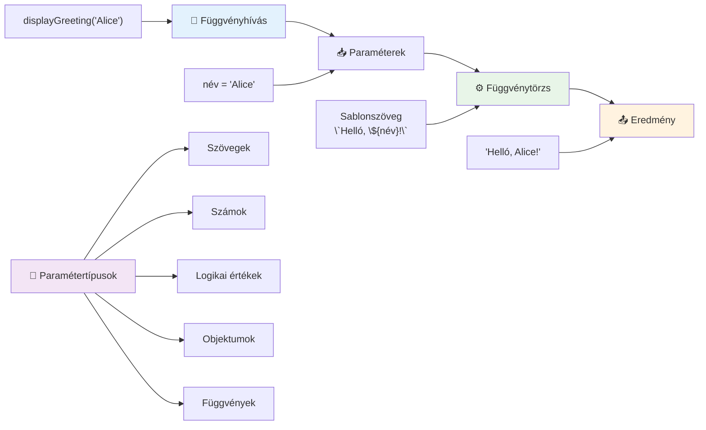
## Alapértelmezett értékek

Mi van akkor, ha néhány paramétert opcionálissá szeretnénk tenni? Itt jönnek jól az alapértelmezett értékek!

Tegyük fel, hogy meg akarjuk engedni, hogy a köszönés szavát testre szabják, de ha valaki nem ad meg egyet, akkor alapból "Hello"-t használunk. Alapértelmezett értéket az egyenlőségjellel tudsz megadni, hasonlóan egy változó értékadásához:

```javascript
function displayGreeting(name, salutation='Hello') {
  console.log(`${salutation}, ${name}`);
}
```

Itt a `name` még mindig kötelező, de a `salutation` rendelkezik egy tartalék értékkel `'Hello'`, ha senki nem ad meg más köszöntést.

Most kétféleképpen is meghívhatjuk ezt a függvényt:

```javascript
displayGreeting('Christopher');
// kiírja, hogy "Hello, Christopher"

displayGreeting('Christopher', 'Hi');
// kiírja, hogy "Hi, Christopher"
```

Az első híváskor a JavaScript az alapértelmezett "Hello" szót használja, mivel nem adtunk meg köszöntést. A második híváskor a saját "Hi" köszönésünk jelenik meg. Ez a rugalmasság teszi a függvényeket alkalmazkodóvá különböző helyzetekhez.

### 🎛️ **Paraméterek Mesterellenőrzése: Függvények Rugalmasabbá Tétele**

**Teszteld a paraméterek ismeretét:**
- Mi a különbség egy paraméter és egy argumentum között?
- Miért hasznosak az alapértelmezett értékek a valós programozásban?
- Meg tudod jósolni, mi történik, ha több argumentumot adsz át, mint amennyi paraméter?

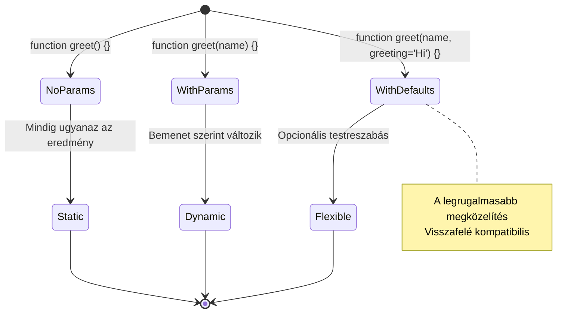
> **Pro tipp**: Az alapértelmezett paraméterek felhasználóbarátabbá teszik a függvényeidet. A felhasználók gyorsan elkezdhetik használni azokat ésszerű alapértékekkel, és mégis testre szabhatják, ha kell!

## Visszatérési értékek

Eddig a függvényeink csak üzeneteket írtak ki a konzolra, de mi van, ha azt szeretnéd, hogy egy függvény számoljon ki valamit és adja vissza az eredményt?

Itt jönnek képbe a **visszatérési értékek**. Ahelyett, hogy csak megjelenítene valamit, a függvény visszaadhat egy értéket, amit eltárolhatsz egy változóban vagy más kódrészekben felhasználhatsz.

Érték visszaadásához használd a `return` kulcsszót, majd írd meg, mit szeretnél visszaadni:

```javascript
return myVariable;
```

Fontos megjegyezni: amikor egy függvény eléri a `return` utasítást, azonnal leáll, és visszaküldi az értéket annak, aki meghívta.

Alakítsuk át az üdvözlő függvényt úgy, hogy ne írja ki az üzenetet, hanem adja vissza:

```javascript
function createGreetingMessage(name) {
  const message = `Hello, ${name}`;
  return message;
}
```

Most nem írja ki az üdvözlést, hanem létrehozza az üzenetet és visszaadja nekünk.

A visszaadott értéket el tudjuk tárolni egy változóban, mint bármely más értéket:

```javascript
const greetingMessage = createGreetingMessage('Christopher');
```

Most a `greetingMessage` változó tartalmazza a "Hello, Christopher" szöveget, és bárhol használhatjuk – megjeleníthetjük egy weboldalon, beilleszthetjük egy emailbe vagy átadhatjuk másik függvénynek.

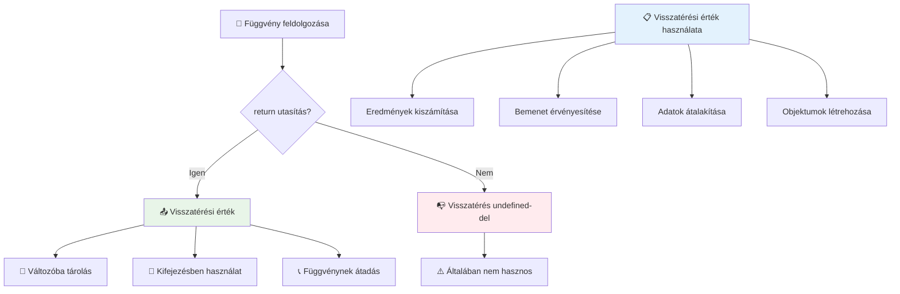
### 🔄 **Visszatérési Értékek Ellenőrzése: Eredmények Visszakapása**

**Értékeld a visszatérési értékek ismeretét:**
- Mi történik a függvény visszatérési utasítása után lévő kóddal?
- Miért jobb gyakran visszaadni értékeket, mint csak kiírni őket a konzolra?
- Tud egy függvény különböző típusú értékeket (sztring, szám, logikai) visszaadni?

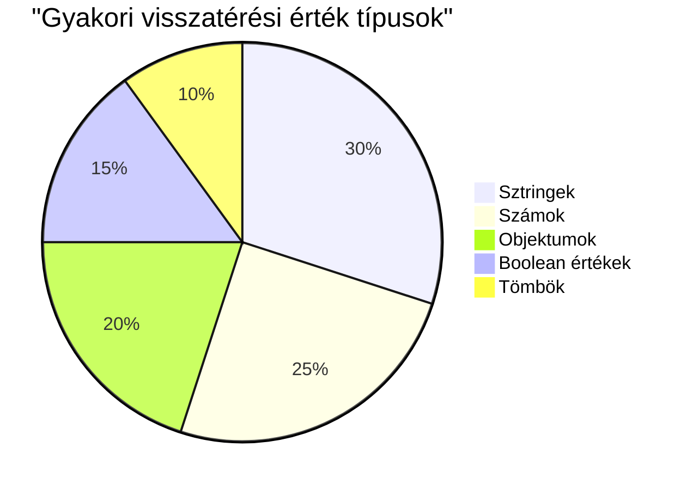
> **Fontos megfigyelés**: Azok a függvények, amelyek visszatérési értékeket adnak, sokoldalúbbak, mert a hívó dönti el, mi történjen az eredménnyel. Ez modulárisabbá és újrahasználhatóbbá teszi a kódod!

## Függvények paraméterként függvényeknek

Függvényeket átadhatsz paraméterként más függvényeknek. Ez a fogalom eleinte bonyolultnak tűnhet, de egy erős eszköz, amely rugalmas programozási mintákat tesz lehetővé.

Ezt a mintát gyakran használjuk olyan helyeken, ahol azt mondjuk, hogy „amikor valami történik, csináld meg ezt a másik dolgot”. Például: „amikor a számláló végzett, futtasd ezt a kódot”, vagy „amikor a felhasználó rákattint a gombra, hívd ezt a függvényt”.

Nézzük a `setTimeout`-ot, ami beépített függvény: vár egy adott időt, majd lefuttat egy kódot. Meg kell mondanunk, milyen kódot futtasson – erre tökéletes egy függvény átadása!

Próbáld ki ezt a kódot – 3 másodperc múlva egy üzenetet fogsz látni:

```javascript
function displayDone() {
  console.log('3 seconds has elapsed');
}
// az időzítő értéke milliszekundumban van
setTimeout(displayDone, 3000);
```

Figyeld meg, hogy a `displayDone`-t (zárójelek nélkül) adjuk át a `setTimeout`-nak. Nem mi hívjuk meg a függvényt, hanem átadjuk a `setTimeout`-nak, hogy „3 másodperc múlva hívd ezt meg”.

### Név nélküli (anonim) függvények

Néha szükség van egy függvényre csak egyetlen alkalommal, és nem akarsz nevet adni neki. Gondolj csak bele – ha csak egyszer használod, miért ne hagynád a kódod tisztán anélkül, hogy egy extra névvel bonyolítanád?

A JavaScript lehetővé teszi, hogy **anonim függvényeket** hozz létre – olyan függvényeket, amelyeknek nincs nevük, és ott definiálod őket, ahol éppen szükséged van rájuk.

Így néz ki, ha átírod a számláló példánkat anonim függvénnyel:

```javascript
setTimeout(function() {
  console.log('3 seconds has elapsed');
}, 3000);
```

Ugyanazt az eredményt éri el, de a függvény közvetlenül a `setTimeout` hívásában van definiálva, így nem kell külön függvénydeklaráció.

### Nyílfüggvények (fat arrow functions)

A modern JavaScript-ben van egy még rövidebb írásmód a függvényekhez, az úgynevezett **nyílfüggvények**. Ezek `=>` jelölést használnak (ami egy nyílra hasonlít – érted?), és nagyon népszerűek a fejlesztők körében.

A nyílfüggvényekkel kihagyhatod a `function` kulcsszót, és tömörebb kódot írhatsz.

Íme a számláló példa nyílfüggvénnyel:

```javascript
setTimeout(() => {
  console.log('3 seconds has elapsed');
}, 3000);
```

A `()` a paraméterek helye (itt üres), utána jön a nyíl `=>`, majd a függvény törzse kapcsos zárójelben. Ez ugyanazt a funkciót biztosítja, tömörebb szintaxissal.

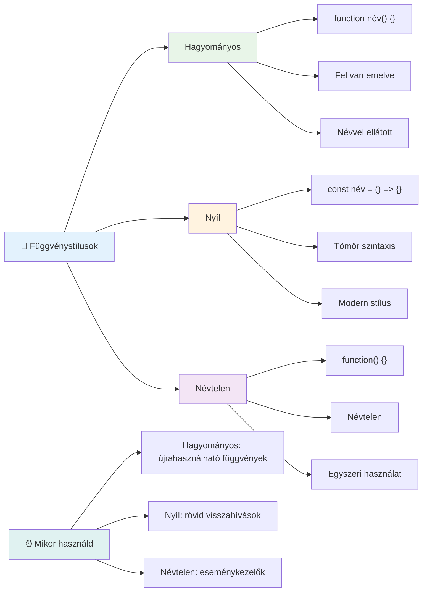
### Mikor melyiket használjuk?

Mikor használd az egyes megoldásokat? Egy praktikus iránymutatás: ha többször is használni fogod a függvényt, adj neki nevet és definiáld külön. Ha csak egy konkrét, egyszeri célra kell, fontold meg az anonim függvényt. A nyílfüggvények és a hagyományos szintaxis is helyes választás, bár a nyílfüggvények egyre elterjedtebbek a modern JavaScript kódbázisokban.

### 🎨 **Függvény Stílusok Ellenőrzése: A Megfelelő Szintaxis Kiválasztása**

**Teszteld a szintaxis ismereted:**
- Mikor előnyösebb a nyílfüggvény a hagyományossal szemben?
- Mi az anonim függvények fő előnye?
- Tudsz olyan helyzetet mondani, amikor egy névvel ellátott függvény jobb, mint egy anonim?

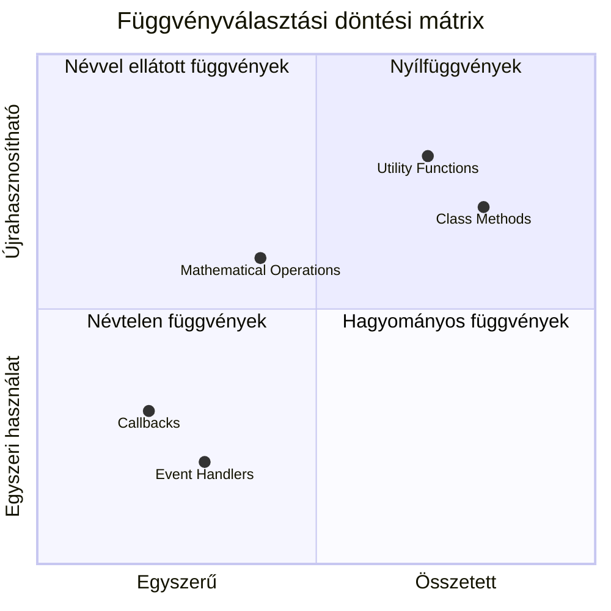
> **Modern trend**: A nyílfüggvények egyre inkább az alapértelmezett választássá válnak sok fejlesztőnél, a tömör szintaxisuk miatt, de a hagyományos függvényeknek is megvan a helyük!

---


## 🚀 Feladat

Meg tudod fogalmazni egy mondatban a függvények és metódusok közti különbséget? Próbáld meg!

## GitHub Copilot Agent Feladat 🚀

Használd az Agent módot az alábbi kihívás teljesítéséhez:

**Leírás:** Készíts egy hasznos matematikai függvénykönyvtárat, amely bemutatja a leckében tárgyalt különböző függvényfogalmakat, beleértve a paramétereket, alapértelmezett értékeket, visszatérési értékeket és a nyílfüggvényeket.

**Prompt:** Hozz létre egy `mathUtils.js` nevű JavaScript fájlt, amely a következő függvényeket tartalmazza:
1. Egy `add` nevű függvény, amely két paramétert fogad és visszaadja az összegüket
2. Egy `multiply` nevű függvény alapértelmezett paraméterértékekkel (a második paraméter alapértelmezettként 1)
3. Egy `square` nevű nyílfüggvény, amely egy számot fogad és visszaadja annak négyzetét
4. Egy `calculate` nevű függvény, amely paraméterként másik függvényt és két számot fogad, majd alkalmazza a függvényt ezekre a számokra
5. Mutasd be minden függvény hívását megfelelő tesztesetekkel

További információk az [agent módról](https://code.visualstudio.com/blogs/2025/02/24/introducing-copilot-agent-mode).

## Előadás Utáni Kvíz
[Előadás utáni kvíz](https://ff-quizzes.netlify.app)

## Áttekintés & Önálló tanulás

Érdemes többet olvasni a [nyílfüggvényekről](https://developer.mozilla.org/docs/Web/JavaScript/Reference/Functions/Arrow_functions), mert egyre inkább használatosak a kódbázisokban. Gyakorold, hogy először egy függvényt írsz, aztán újraírjátok ezt a szintaxist használva.

## Házi feladat

[Fun with Functions](assignment.md)

---

## 🧰 **A JavaScript Függvények Eszköztára Összefoglaló**

```mermaid
graph TD
    A["🎯 JavaScript Függvények"] --> B["📋 Függvénydeklaráció"]
    A --> C["📥 Paraméterek"]
    A --> D["📤 Visszatérési értékek"]
    A --> E["🎨 Modern szintaxis"]
    
    B --> B1["function name() {}"]
    B --> B2["Leíró elnevezés"]
    B --> B3["Újrafelhasználható kódrészek"]
    
    C --> C1["Bemeneti adatok"]
    C --> C2["Alapértelmezett értékek"]
    C --> C3["Több paraméter"]
    
    D --> D1["return utasítás"]
    D --> D2["Függvény kilépés"]
    D --> D3["Adat visszaadása"]
    
    E --> E1["Arrow függvények: () =>"]
    E --> E2["Névtelen függvények"]
    E --> E3["Magasabb rendű függvények"]
    
    F["⚡ Fő előnyök"] --> F1["Kód újrafelhasználhatóság"]
    F --> F2["Jobb szervezés"]
    F --> F3["Egyszerűbb tesztelés"]
    F --> F4["Moduláris tervezés"]
    
    style A fill:#e3f2fd
    style B fill:#e8f5e8
    style C fill:#fff3e0
    style D fill:#f3e5f5
    style E fill:#e0f2f1
    style F fill:#fce4ec
```
---

## 🚀 A JavaScript Függvények Mesteri Használatának Idővonala

### ⚡ **Mit Tudsz Megtenni a Következő 5 Percben**
- [ ] Írj egy egyszerű függvényt, ami visszaadja a kedvenc számodat
- [ ] Készíts egy függvényt, aminek két paramétere van, és összeadja azokat
- [ ] Próbáld meg átalakítani egy hagyományos függvényt arrow function szintaxisra  
- [ ] Gyakorold a kihívást: magyarázd el a függvények és metódusok közötti különbséget  

### 🎯 **Mit érhetsz el ezen az órán**  
- [ ] Fejezd be az óra utáni kvízt, és nézd át az esetleg zavaros fogalmakat  
- [ ] Építsd meg a matematikai segédfüggvények könyvtárát a GitHub Copilot kihívás alapján  
- [ ] Hozz létre egy függvényt, amely paraméterként egy másik függvényt használ  
- [ ] Gyakorold alapértelmezett paraméterekkel írt függvények írását  
- [ ] Kísérletezz template literálokkal a függvények visszatérési értékeiben  

### 📅 **Hét napos függvény mesterkurzusod**  
- [ ] Fejezd be a „Szórakozás a függvényekkel” feladatot kreatív módon  
- [ ] Refaktorálj ismétlődő kódot, amit írtál, újrahasználható függvényekké  
- [ ] Építs egy kis számológépet kizárólag függvények használatával (globális változók nélkül)  
- [ ] Gyakorold az arrow function-öket tömbmódszerekkel, mint a `map()` és `filter()`  
- [ ] Hozz létre egy hasznos segédfüggvény gyűjteményt gyakori feladatokhoz  
- [ ] Tanulmányozd a magasabb rendű függvényeket és a funkcionális programozás fogalmait  

### 🌟 **Hónapos átalakulásod**  
- [ ] Sajátítsd el a haladó függvényfogalmakat, mint a closures és scope  
- [ ] Építs egy projektet, amely erősen használ függvénykompozíciót  
- [ ] Járulj hozzá open source projektekhez a függvény dokumentációk fejlesztésével  
- [ ] Taníts meg másokat a függvényekről és a különböző szintaxis stílusokról  
- [ ] Fedezd fel a funkcionális programozási paradigmákat JavaScriptben  
- [ ] Készíts egy személyes, újrahasználható függvény könyvtárat jövőbeli projektekhez  

### 🏆 **Végső Függvények Bajnoka Ellenőrzés**

**Ünnepeld meg függvénymesterséged:**  
- Mi a leghasznosabb függvény, amit eddig létrehoztál?  
- Hogyan változtatta meg a függvények tanulása a kód szervezéséhez való hozzáállásodat?  
- Melyik függvényszintaxist részesíted előnyben, és miért?  
- Milyen valós problémát oldanál meg egy függvény megírásával?  

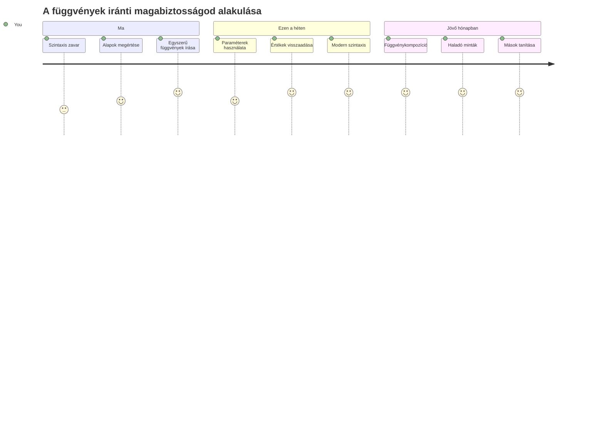
> 🎉 **Mesterévé váltál a programozás egyik legerősebb fogalmának!** A függvények nagyobb programok építőkövei. Minden alkalmazás, amit valaha készítesz, használni fogja a függvényeket a kód szervezésére, újrahasználatára és strukturálására. Most már érted, hogyan csomagolhatod a logikát újrahasználható komponensekbe, így hatékonyabb és eredményesebb programozóvá válsz. Üdvözlünk a moduláris programozás világában! 🚀

---

<!-- CO-OP TRANSLATOR DISCLAIMER START -->
**Felelősségkizárás**:
Ez a dokumentum az AI fordító szolgáltatás, a [Co-op Translator](https://github.com/Azure/co-op-translator) segítségével készült. Bár igyekszünk a pontosságra, kérjük, vegye figyelembe, hogy az automatikus fordítások hibákat vagy pontatlanságokat tartalmazhatnak. Az eredeti, anyanyelven készült dokumentumot kell tekinteni a hivatalos forrásnak. Fontos információk esetén professzionális, humán fordítást javaslunk. Nem vállalunk felelősséget a fordítás használatából eredő félreértésekért vagy félrefordításokért.
<!-- CO-OP TRANSLATOR DISCLAIMER END -->