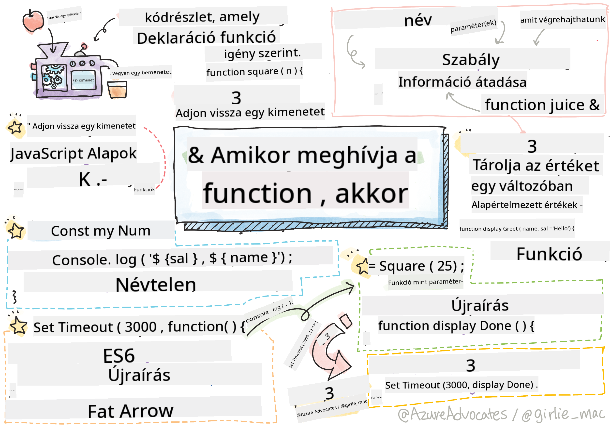

<!--
CO_OP_TRANSLATOR_METADATA:
{
  "original_hash": "b4612bbb9ace984f374fcc80e3e035ad",
  "translation_date": "2025-08-28T04:04:39+00:00",
  "source_file": "2-js-basics/2-functions-methods/README.md",
  "language_code": "hu"
}
-->
# JavaScript alapok: Metódusok és függvények


> Sketchnote készítette: [Tomomi Imura](https://twitter.com/girlie_mac)

## Előadás előtti kvíz
[Előadás előtti kvíz](https://ff-quizzes.netlify.app/web/quiz/9)

Amikor kódot írunk, mindig arra törekszünk, hogy az olvasható legyen. Bár ez elsőre ellentmondásosnak tűnhet, a kódot sokkal többször olvassák, mint írják. Az egyik alapvető eszköz a fejlesztők számára az olvasható és karbantartható kód biztosításához a **függvény**.

[](https://youtube.com/watch?v=XgKsD6Zwvlc "Metódusok és függvények")

> 🎥 Kattints a fenti képre a metódusokról és függvényekről szóló videóért.

> Ezt a leckét elérheted a [Microsoft Learn](https://docs.microsoft.com/learn/modules/web-development-101-functions/?WT.mc_id=academic-77807-sagibbon) oldalán!

## Függvények

A függvény alapvetően egy kódrészlet, amelyet igény szerint végrehajthatunk. Ez tökéletes olyan helyzetekben, amikor ugyanazt a feladatot többször kell elvégezni; ahelyett, hogy a logikát több helyen megismételnénk (ami nehézkessé tenné a frissítést), egy helyre központosíthatjuk, és akkor hívhatjuk meg, amikor szükség van rá – sőt, függvényeket más függvényekből is meghívhatunk!

Ugyanilyen fontos a függvény elnevezése. Bár ez triviálisnak tűnhet, a név gyors módot biztosít a kód egy részének dokumentálására. Ezt úgy is elképzelhetjük, mint egy gomb címkéjét. Ha rákattintok egy "Időzítő törlése" feliratú gombra, tudom, hogy az megállítja az órát.

## Függvény létrehozása és meghívása

A függvény szintaxisa a következőképpen néz ki:

```javascript
function nameOfFunction() { // function definition
 // function definition/body
}
```

Ha szeretnék létrehozni egy függvényt, amely üdvözlő szöveget jelenít meg, az így nézhet ki:

```javascript
function displayGreeting() {
  console.log('Hello, world!');
}
```

Amikor meg akarjuk hívni (vagy aktiválni) a függvényt, a függvény nevét követjük `()`-kal. Érdemes megjegyezni, hogy a függvényt definiálhatjuk azelőtt vagy azután, hogy meghívnánk; a JavaScript fordító megtalálja nekünk.

```javascript
// calling our function
displayGreeting();
```

> **NOTE:** Létezik egy speciális típusú függvény, amelyet **metódusnak** nevezünk, és amit már használtál is! Valójában láttuk ezt a fenti példában, amikor a `console.log`-ot használtuk. A metódus abban különbözik a függvénytől, hogy egy objektumhoz van csatolva (például a `console`-hoz), míg a függvény szabadon lebeg. Sok fejlesztő ezeket a kifejezéseket felcserélve használja.

### Függvények legjobb gyakorlatai

Néhány jó tanács, amit érdemes szem előtt tartani függvények létrehozásakor:

- Mindig használj beszédes neveket, hogy tudd, mit csinál a függvény
- Használj **camelCase**-t a szavak összekapcsolásához
- Tartsd a függvényeket egy adott feladatra fókuszálva

## Információ átadása függvényeknek

Ahhoz, hogy egy függvény rugalmasabb legyen, gyakran szeretnénk információt átadni neki. Ha a fenti `displayGreeting` példát nézzük, az csak **Hello, world!**-ot jelenít meg. Ez nem a leghasznosabb függvény, amit létrehozhatunk. Ha egy kicsit rugalmasabbá szeretnénk tenni, például lehetővé tenni, hogy megadjuk az üdvözlendő személy nevét, hozzáadhatunk egy **paramétert**. A paraméter (néha **argumentumnak** is nevezik) egy kiegészítő információ, amelyet a függvénynek küldünk.

A paramétereket a definícióban zárójelek között soroljuk fel, vesszővel elválasztva, például így:

```javascript
function name(param, param2, param3) {

}
```

Frissíthetjük a `displayGreeting` függvényt, hogy elfogadjon egy nevet, és azt jelenítse meg.

```javascript
function displayGreeting(name) {
  const message = `Hello, ${name}!`;
  console.log(message);
}
```

Amikor meg akarjuk hívni a függvényt, és átadni a paramétert, azt a zárójelekben adjuk meg.

```javascript
displayGreeting('Christopher');
// displays "Hello, Christopher!" when run
```

## Alapértelmezett értékek

Még rugalmasabbá tehetjük a függvényt, ha több paramétert adunk hozzá. De mi van akkor, ha nem akarjuk, hogy minden értéket kötelezően meg kelljen adni? Az üdvözlő példánál maradva, a nevet kötelezővé tehetjük (hiszen tudnunk kell, kit üdvözlünk), de az üdvözlés szövegét opcionálissá tehetjük. Ha valaki nem akarja testre szabni, alapértelmezett értéket adunk meg. Az alapértelmezett értéket úgy állítjuk be, mint egy változó értékét - `parameterName = 'defaultValue'`. Egy teljes példa:

```javascript
function displayGreeting(name, salutation='Hello') {
  console.log(`${salutation}, ${name}`);
}
```

Amikor meghívjuk a függvényt, eldönthetjük, hogy megadunk-e értéket a `salutation` paraméternek.

```javascript
displayGreeting('Christopher');
// displays "Hello, Christopher"

displayGreeting('Christopher', 'Hi');
// displays "Hi, Christopher"
```

## Visszatérési értékek

Eddig a függvényünk mindig a [konzolra](https://developer.mozilla.org/docs/Web/API/console) írt ki. Néha ez pontosan az, amit keresünk, különösen akkor, amikor olyan függvényeket hozunk létre, amelyek más szolgáltatásokat hívnak meg. De mi van akkor, ha egy segédfüggvényt szeretnék létrehozni, amely egy számítást végez, és visszaadja az értéket, hogy máshol felhasználhassam?

Ezt úgy érhetjük el, hogy **visszatérési értéket** használunk. A visszatérési értéket a függvény adja vissza, és ugyanúgy tárolhatjuk egy változóban, mint egy szöveget vagy számot.

Ha egy függvény visszaad valamit, akkor a `return` kulcsszót használjuk. A `return` kulcsszó egy értéket vagy hivatkozást vár, amit visszaadunk, például így:

```javascript
return myVariable;
```  

Létrehozhatunk egy függvényt, amely üdvözlő üzenetet készít, és visszaadja az értéket a hívónak.

```javascript
function createGreetingMessage(name) {
  const message = `Hello, ${name}`;
  return message;
}
```

Amikor meghívjuk ezt a függvényt, az értéket egy változóban tároljuk. Ez ugyanaz, mint amikor egy változót statikus értékre állítunk (például `const name = 'Christopher'`).

```javascript
const greetingMessage = createGreetingMessage('Christopher');
```

## Függvények függvények paramétereként

Ahogy haladsz a programozói pályádon, találkozni fogsz olyan függvényekkel, amelyek más függvényeket fogadnak paraméterként. Ez a trükk gyakran akkor hasznos, amikor nem tudjuk, mikor fog valami megtörténni vagy befejeződni, de tudjuk, hogy egy műveletet végre kell hajtanunk válaszként.

Például a [setTimeout](https://developer.mozilla.org/docs/Web/API/WindowOrWorkerGlobalScope/setTimeout), amely elindít egy időzítőt, és kódot hajt végre, amikor az lejár. Meg kell mondanunk neki, milyen kódot akarunk végrehajtani. Ez tökéletes feladat egy függvény számára!

Ha futtatod az alábbi kódot, 3 másodperc múlva megjelenik az üzenet: **3 másodperc eltelt**.

```javascript
function displayDone() {
  console.log('3 seconds has elapsed');
}
// timer value is in milliseconds
setTimeout(displayDone, 3000);
```

### Névtelen függvények

Nézzük meg újra, amit építettünk. Létrehozunk egy függvényt névvel, amelyet csak egyszer fogunk használni. Ahogy az alkalmazásunk bonyolultabbá válik, láthatjuk, hogy sok olyan függvényt hozunk létre, amelyet csak egyszer hívunk meg. Ez nem ideális. Mint kiderül, nem mindig kell nevet adnunk!

Amikor egy függvényt paraméterként adunk át, elkerülhetjük, hogy előre létrehozzuk, és helyette a paraméter részeként építhetjük meg. Ugyanazt a `function` kulcsszót használjuk, de a paraméter részeként építjük meg.

Írjuk át a fenti kódot névtelen függvény használatára:

```javascript
setTimeout(function() {
  console.log('3 seconds has elapsed');
}, 3000);
```

Ha futtatod az új kódot, ugyanazt az eredményt kapod. Létrehoztunk egy függvényt, de nem kellett nevet adnunk neki!

### Fat arrow függvények

Sok programozási nyelvben (beleértve a JavaScriptet is) gyakori rövidítés az úgynevezett **arrow** vagy **fat arrow** függvények használata. Ez egy speciális `=>` jelölést használ, amely egy nyílra hasonlít – innen a név! Az `=>` használatával kihagyhatjuk a `function` kulcsszót.

Írjuk át a kódot még egyszer, hogy fat arrow függvényt használjunk:

```javascript
setTimeout(() => {
  console.log('3 seconds has elapsed');
}, 3000);
```

### Mikor melyik stratégiát használjuk?

Most láttad, hogy három módja van annak, hogy függvényt adjunk át paraméterként, és talán azon gondolkodsz, mikor melyiket használjuk. Ha tudod, hogy a függvényt többször fogod használni, hozd létre normál módon. Ha csak egy helyen fogod használni, általában a névtelen függvény a legjobb választás. Hogy fat arrow függvényt vagy a hagyományos `function` szintaxist használod, az rajtad múlik, de észre fogod venni, hogy a modern fejlesztők többsége az `=>`-t részesíti előnyben.

---

## 🚀 Kihívás

Meg tudod fogalmazni egy mondatban a különbséget a függvények és a metódusok között? Próbáld meg!

## Előadás utáni kvíz
[Előadás utáni kvíz](https://ff-quizzes.netlify.app/web/quiz/10)

## Áttekintés és önálló tanulás

Érdemes [további információkat olvasni a fat arrow függvényekről](https://developer.mozilla.org/docs/Web/JavaScript/Reference/Functions/Arrow_functions), mivel egyre gyakrabban használják őket a kódokban. Gyakorold egy függvény írását, majd írd át ezt a szintaxist használva.

## Feladat

[Szórakozás a függvényekkel](assignment.md)

---

**Felelősség kizárása**:  
Ez a dokumentum az AI fordítási szolgáltatás [Co-op Translator](https://github.com/Azure/co-op-translator) segítségével lett lefordítva. Bár törekszünk a pontosságra, kérjük, vegye figyelembe, hogy az automatikus fordítások hibákat vagy pontatlanságokat tartalmazhatnak. Az eredeti dokumentum az eredeti nyelvén tekintendő hiteles forrásnak. Kritikus információk esetén javasolt professzionális emberi fordítást igénybe venni. Nem vállalunk felelősséget semmilyen félreértésért vagy téves értelmezésért, amely a fordítás használatából eredhet.