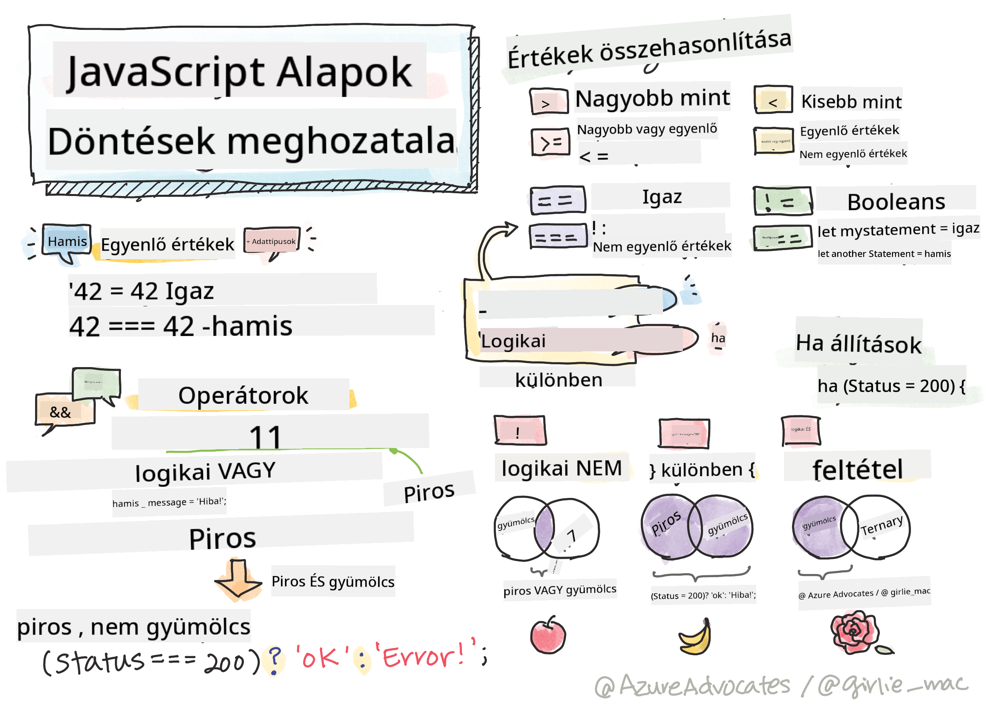

<!--
CO_OP_TRANSLATOR_METADATA:
{
  "original_hash": "888609c48329c280ca2477d2df40f2e5",
  "translation_date": "2025-08-28T04:06:33+00:00",
  "source_file": "2-js-basics/3-making-decisions/README.md",
  "language_code": "hu"
}
-->
# JavaScript Alapok: Döntéshozatal



> Sketchnote készítette: [Tomomi Imura](https://twitter.com/girlie_mac)

## Előadás előtti kvíz

[Előadás előtti kvíz](https://ashy-river-0debb7803.1.azurestaticapps.net/quiz/11)

A döntéshozatal és a kód futási sorrendjének irányítása újrahasznosíthatóvá és robusztussá teszi a kódot. Ez a rész bemutatja a JavaScript adatfolyamának irányításához szükséges szintaxist, valamint annak jelentőségét a Boolean adattípusokkal való használat során.

[](https://youtube.com/watch?v=SxTp8j-fMMY "Döntéshozatal")

> 🎥 Kattints a fenti képre a döntéshozatalról szóló videóért.

> Ezt a leckét elérheted a [Microsoft Learn](https://docs.microsoft.com/learn/modules/web-development-101-if-else/?WT.mc_id=academic-77807-sagibbon) oldalon!

## Rövid áttekintés a Booleans-ról

A Booleans csak két értéket vehet fel: `true` vagy `false`. A Booleans segít eldönteni, hogy melyik kódsor fusson le, amikor bizonyos feltételek teljesülnek.

Állítsd be a Boolean értékét `true` vagy `false` értékre így:

`let myTrueBool = true`  
`let myFalseBool = false`

✅ A Booleans az angol matematikusról, filozófusról és logikusról, George Boole-ról (1815–1864) kapta a nevét.

## Összehasonlító operátorok és Booleans

Az operátorokat arra használjuk, hogy feltételeket értékeljünk ki, összehasonlításokat végezzünk, amelyek Boolean értéket hoznak létre. Az alábbiakban néhány gyakran használt operátor található.

| Szimbólum | Leírás                                                                                                                                                     | Példa              |
| --------- | ---------------------------------------------------------------------------------------------------------------------------------------------------------- | ------------------ |
| `<`       | **Kisebb mint**: Összehasonlít két értéket, és `true` Boolean adattípust ad vissza, ha a bal oldali érték kisebb, mint a jobb oldali                        | `5 < 6 // true`    |
| `<=`      | **Kisebb vagy egyenlő**: Összehasonlít két értéket, és `true` Boolean adattípust ad vissza, ha a bal oldali érték kisebb vagy egyenlő, mint a jobb oldali   | `5 <= 6 // true`   |
| `>`       | **Nagyobb mint**: Összehasonlít két értéket, és `true` Boolean adattípust ad vissza, ha a bal oldali érték nagyobb, mint a jobb oldali                      | `5 > 6 // false`   |
| `>=`      | **Nagyobb vagy egyenlő**: Összehasonlít két értéket, és `true` Boolean adattípust ad vissza, ha a bal oldali érték nagyobb vagy egyenlő, mint a jobb oldali | `5 >= 6 // false`  |
| `===`     | **Szigorú egyenlőség**: Összehasonlít két értéket, és `true` Boolean adattípust ad vissza, ha a jobb és bal oldali értékek egyenlők ÉS azonos adattípusúak  | `5 === 6 // false` |
| `!==`     | **Egyenlőtlenség**: Összehasonlít két értéket, és az ellenkező Boolean értéket adja vissza, mint amit a szigorú egyenlőség operátor adna                     | `5 !== 6 // true`  |

✅ Ellenőrizd a tudásodat úgy, hogy néhány összehasonlítást írsz a böngésződ konzoljába. Meglepett valamelyik visszaadott adat?

## If utasítás

Az if utasítás lefuttatja a kódot a blokkjai között, ha a feltétel igaz.

```javascript
if (condition) {
  //Condition is true. Code in this block will run.
}
```

Logikai operátorokat gyakran használnak a feltétel kialakításához.

```javascript
let currentMoney;
let laptopPrice;

if (currentMoney >= laptopPrice) {
  //Condition is true. Code in this block will run.
  console.log("Getting a new laptop!");
}
```

## If..Else utasítás

Az `else` utasítás lefuttatja a kódot a blokkjai között, amikor a feltétel hamis. Ez opcionális az `if` utasítással.

```javascript
let currentMoney;
let laptopPrice;

if (currentMoney >= laptopPrice) {
  //Condition is true. Code in this block will run.
  console.log("Getting a new laptop!");
} else {
  //Condition is false. Code in this block will run.
  console.log("Can't afford a new laptop, yet!");
}
```

✅ Teszteld a kód megértését úgy, hogy futtatod a böngésző konzoljában. Változtasd meg a currentMoney és laptopPrice változók értékeit, hogy megváltoztasd a visszaadott `console.log()`-ot.

## Switch utasítás

A `switch` utasítást arra használjuk, hogy különböző feltételek alapján különböző műveleteket hajtsunk végre. Használd a `switch` utasítást, hogy kiválaszd, melyik kódblokkot kell végrehajtani.

```javascript
switch (expression) {
  case x:
    // code block
    break;
  case y:
    // code block
    break;
  default:
  // code block
}
```

```javascript
// program using switch statement
let a = 2;

switch (a) {
  case 1:
    a = "one";
    break;
  case 2:
    a = "two";
    break;
  default:
    a = "not found";
    break;
}
console.log(`The value is ${a}`);
```

✅ Teszteld a kód megértését úgy, hogy futtatod a böngésző konzoljában. Változtasd meg az `a` változó értékét, hogy megváltoztasd a visszaadott `console.log()`-ot.

## Logikai operátorok és Booleans

A döntésekhez több összehasonlításra is szükség lehet, amelyeket logikai operátorokkal lehet összefűzni, hogy Boolean értéket kapjunk.

| Szimbólum | Leírás                                                                                     | Példa                                                                 |
| --------- | ------------------------------------------------------------------------------------------- | --------------------------------------------------------------------- |
| `&&`      | **Logikai ÉS**: Összehasonlít két Boolean kifejezést. Csak akkor ad vissza true értéket, ha mindkét oldal igaz | `(5 > 6) && (5 < 6 ) //Az egyik oldal hamis, a másik igaz. Visszaad false-t` |
| `\|\|`    | **Logikai VAGY**: Összehasonlít két Boolean kifejezést. Akkor ad vissza true értéket, ha legalább az egyik oldal igaz | `(5 > 6) \|\| (5 < 6) //Az egyik oldal hamis, a másik igaz. Visszaad true-t` |
| `!`       | **Logikai NEM**: A Boolean kifejezés ellentétes értékét adja vissza                         | `!(5 > 6) // 5 nem nagyobb, mint 6, de a "!" visszaad true-t`         |

## Feltételek és döntések logikai operátorokkal

Logikai operátorokat használhatunk feltételek kialakítására if..else utasításokban.

```javascript
let currentMoney;
let laptopPrice;
let laptopDiscountPrice = laptopPrice - laptopPrice * 0.2; //Laptop price at 20 percent off

if (currentMoney >= laptopPrice || currentMoney >= laptopDiscountPrice) {
  //Condition is true. Code in this block will run.
  console.log("Getting a new laptop!");
} else {
  //Condition is true. Code in this block will run.
  console.log("Can't afford a new laptop, yet!");
}
```

### Negációs operátor

Eddig láthattad, hogyan használhatod az `if...else` utasítást feltételes logika létrehozására. Bármi, ami az `if`-be kerül, true/false értékre kell kiértékelődjön. A `!` operátor használatával _tagadhatod_ a kifejezést. Ez így néz ki:

```javascript
if (!condition) {
  // runs if condition is false
} else {
  // runs if condition is true
}
```

### Ternáris kifejezések

Az `if...else` nem az egyetlen módja a döntési logika kifejezésének. Használhatsz úgynevezett ternáris operátort is. Ennek szintaxisa így néz ki:

```javascript
let variable = condition ? <return this if true> : <return this if false>
```

Az alábbiakban egy kézzelfoghatóbb példa látható:

```javascript
let firstNumber = 20;
let secondNumber = 10;
let biggestNumber = firstNumber > secondNumber ? firstNumber : secondNumber;
```

✅ Szánj egy percet arra, hogy többször elolvasd ezt a kódot. Érted, hogyan működnek ezek az operátorok?

A fentiek azt mondják ki:

- ha `firstNumber` nagyobb, mint `secondNumber`
- akkor rendeld hozzá a `firstNumber`-t a `biggestNumber`-hez
- különben rendeld hozzá a `secondNumber`-t.

A ternáris kifejezés csak egy tömör módja annak, hogy az alábbi kódot megírjuk:

```javascript
let biggestNumber;
if (firstNumber > secondNumber) {
  biggestNumber = firstNumber;
} else {
  biggestNumber = secondNumber;
}
```

---

## 🚀 Kihívás

Hozz létre egy programot, amelyet először logikai operátorokkal írsz meg, majd írd át ternáris kifejezéssel. Melyik szintaxist részesíted előnyben?

---

## Előadás utáni kvíz

[Előadás utáni kvíz](https://ashy-river-0debb7803.1.azurestaticapps.net/quiz/12)

## Áttekintés és önálló tanulás

Olvass többet a felhasználó számára elérhető számos operátorról [az MDN-en](https://developer.mozilla.org/docs/Web/JavaScript/Reference/Operators).

Nézd át Josh Comeau csodálatos [operátor keresőjét](https://joshwcomeau.com/operator-lookup/)!

## Feladat

[Operátorok](assignment.md)

---

**Felelősség kizárása**:  
Ez a dokumentum az AI fordítási szolgáltatás, a [Co-op Translator](https://github.com/Azure/co-op-translator) segítségével lett lefordítva. Bár törekszünk a pontosságra, kérjük, vegye figyelembe, hogy az automatikus fordítások hibákat vagy pontatlanságokat tartalmazhatnak. Az eredeti dokumentum az eredeti nyelvén tekintendő hiteles forrásnak. Kritikus információk esetén javasolt professzionális emberi fordítást igénybe venni. Nem vállalunk felelősséget semmilyen félreértésért vagy téves értelmezésért, amely a fordítás használatából eredhet.