<!--
CO_OP_TRANSLATOR_METADATA:
{
  "original_hash": "c688385d15dd3645e924ea0ffee8967f",
  "translation_date": "2026-01-07T02:32:24+00:00",
  "source_file": "2-js-basics/3-making-decisions/README.md",
  "language_code": "hu"
}
-->
# JavaScript Alapok: Döntéshozás


> Sketchnote készítője: [Tomomi Imura](https://twitter.com/girlie_mac)

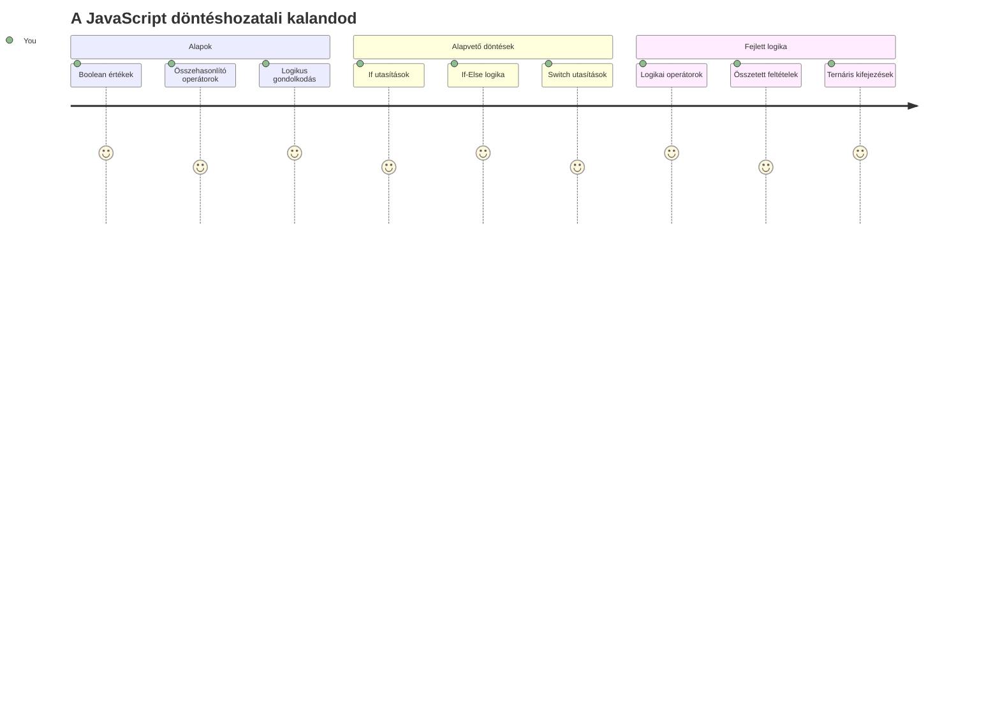
Gondolkodtál már azon, hogyan hoznak az alkalmazások okos döntéseket? Például, hogyan választja ki egy navigációs rendszer a leggyorsabb útvonalat, vagy hogyan dönt egy termosztát arról, mikor kapcsolja be a fűtést? Ez a döntéshozatal alapvető fogalma a programozásban.

Ahogy Charles Babbage Analitikus Gépét is úgy tervezték, hogy különböző műveletsorozatokat hajtson végre feltételek alapján, a modern JavaScript programoknak is döntéseket kell hozniuk változó körülmények között. Ez a képesség, hogy elágaznak és döntenek, az, ami a statikus kódot válaszadó, intelligens alkalmazásokká alakítja.

Ebben a leckében megtanulod, hogyan valósítsd meg a feltételes logikát a programjaidban. Megvizsgáljuk a feltételes utasításokat, összehasonlító operátorokat, és logikai kifejezéseket, amelyek lehetővé teszik, hogy a kódod értékelje a helyzeteket és megfelelően reagáljon.

## Előzetes kvíz

[Előzetes kvíz](https://ff-quizzes.netlify.app/web/quiz/11)

A döntéshozatal képessége és a programfolyamat irányítása alapvető aspektusa a programozásnak. Ebben a részben arról lesz szó, hogyan vezérelheted JavaScript programjaid végrehajtási útját Boole értékek és feltételes logika használatával.

[](https://youtube.com/watch?v=SxTp8j-fMMY "Döntéshozás")

> 🎥 Kattints a fenti képre, ha megnéznéd a döntéshozásról szóló videót.

> Ezt a leckét elvégezheted a [Microsoft Learn](https://docs.microsoft.com/learn/modules/web-development-101-if-else/?WT.mc_id=academic-77807-sagibbon) platformon is!

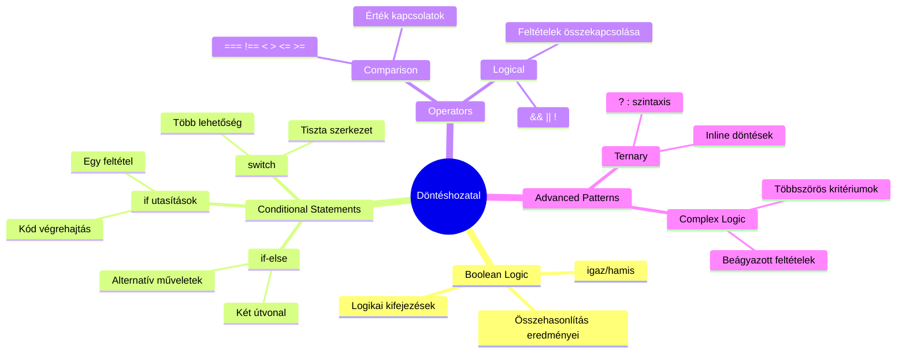
## Rövid ismétlés a Booleanokról

Mielőtt mélyebben belemennénk a döntéshozatalba, nézzük át újra a Boole értékeket az előző leckénkből. Az angol matematikusról, George Boole-ról elnevezett értékek bináris állapotokat képviselnek – vagy `true` vagy `false`. Nincs köztes érték.

Ezek a bináris értékek alkotják az összes számítástechnikai logika alapját. Minden döntés, amit a programod hoz, végső soron egy Boolean kiértékelésre vezethető vissza.

Boolean változókat így hozhatsz létre:

```javascript
let myTrueBool = true;
let myFalseBool = false;
```

Ez két változót hoz létre explicit Boolean értékekkel.

✅ A Booleanokat az angol matematikus, filozófus és logikus George Boole (1815–1864) után nevezték el.

## Összehasonlító operátorok és Boole-ok

A gyakorlatban ritkán állítasz be Boolean értékeket manuálisan. Inkább feltételek kiértékelésével generálod őket: „Ez a szám nagyobb-e annál?” vagy „Ezek az értékek egyenlőek?”

Az összehasonlító operátorok teszik lehetővé ezeket az értékeléseket. Két értéket hasonlítanak össze, és a két operandus kapcsolatától függően Boolean eredményt adnak vissza.

| Szimbólum | Leírás                                                                                                                                                      | Példa               |
| --------- | ---------------------------------------------------------------------------------------------------------------------------------------------------------- | ------------------- |
| `<`       | **Kisebb mint**: Összehasonlít két értéket, és `true` Boolean értéket ad vissza, ha a bal oldali érték kisebb, mint a jobb oldali                         | `5 < 6 // true`     |
| `<=`      | **Kisebb vagy egyenlő**: Összehasonlít két értéket, és `true` Boolean értéket ad vissza, ha a bal oldali érték kisebb vagy egyenlő a jobb oldalinál       | `5 <= 6 // true`    |
| `>`       | **Nagyobb mint**: Összehasonlít két értéket, és `true` Boolean értéket ad vissza, ha a bal oldali érték nagyobb, mint a jobb oldali                         | `5 > 6 // false`    |
| `>=`      | **Nagyobb vagy egyenlő**: Összehasonlít két értéket, és `true` Boolean értéket ad vissza, ha a bal oldali érték nagyobb vagy egyenlő a jobb oldalinál       | `5 >= 6 // false`   |
| `===`     | **Szigorú egyenlőség**: Összehasonlít két értéket, és `true` Boolean értéket ad vissza, ha a jobb és bal oldali értékek egyenlőek ÉS azonos típusúak       | `5 === 6 // false`  |
| `!==`     | **Nem egyenlő**: Összehasonlít két értéket, és a szigorú egyenlőség ellentétes Boolean értékét adja vissza                                                  | `5 !== 6 // true`   |

✅ Teszteld tudásodat néhány összehasonlítás írásával a böngésződ konzoljában. Lepnek meg valamelyik visszakapott értékek?

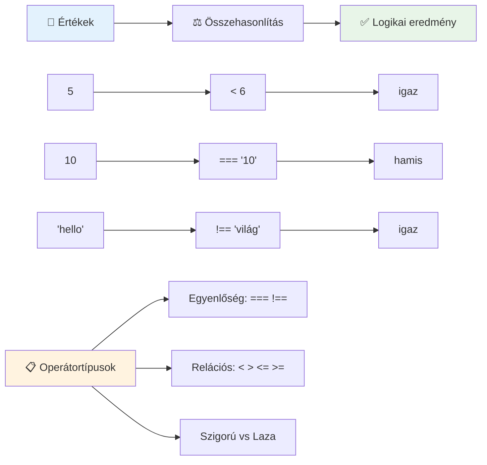
### 🧠 **Összehasonlító Mesterpróba: A Boolean Logika Megértése**

**Teszteld összehasonlítási tudásodat:**
- Miért gondolod, hogy a `===` (szigorú egyenlőség) általában előnyösebb, mint a `==` (laza egyenlőség)?
- El tudod-e képzelni, hogy mi a visszatérési értéke a `5 === '5'` kifejezésnek? És a `5 == '5'`-nek?
- Mi a különbség a `!==` és a `!=` között?

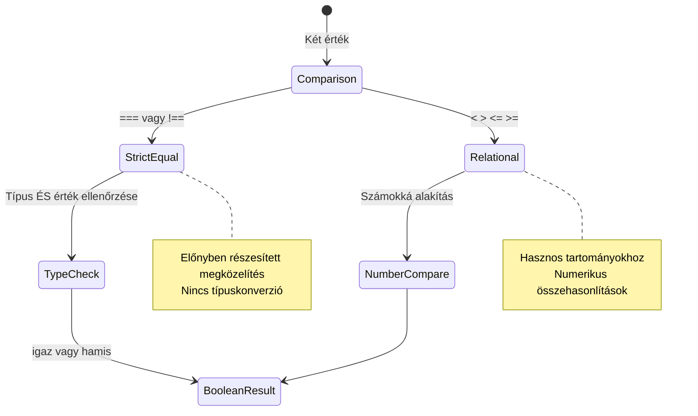
> **Hasznos tipp**: Mindig használd a `===` és `!==` operátorokat az egyenlőség ellenőrzésére, kivéve, ha kifejezetten szükséged van típuskonverzióra. Ez megakadályozza a váratlan viselkedést!

## If utasítás

Az `if` utasítás olyan, mint ha kérdést tennél fel a kódodban. "Ha ez a feltétel igaz, akkor csináld ezt a dolgot." Valószínűleg ez a legfontosabb eszköz, amit a döntéshozáshoz használsz JavaScript-ben.

Így működik:

```javascript
if (condition) {
  // A feltétel igaz. A blokkban lévő kód végrehajtódik.
}
```

A feltétel a zárójelek között van, és ha az `true`, a JavaScript lefuttatja a kapcsos zárójelek között lévő kódot. Ha pedig `false`, a JavaScript egyszerűen kihagyja az egész blokkot.

Gyakran használsz összehasonlító operátorokat a feltételek létrehozásához. Nézzünk egy gyakorlati példát:

```javascript
let currentMoney = 1000;
let laptopPrice = 800;

if (currentMoney >= laptopPrice) {
  // A feltétel igaz. A blokkban lévő kód futni fog.
  console.log("Getting a new laptop!");
}
```

Mivel `1000 >= 800` eredménye `true`, a blokkban lévő kód végrehajtódik, és a konzolon megjelenik az "Laptop vásárlása!" üzenet.

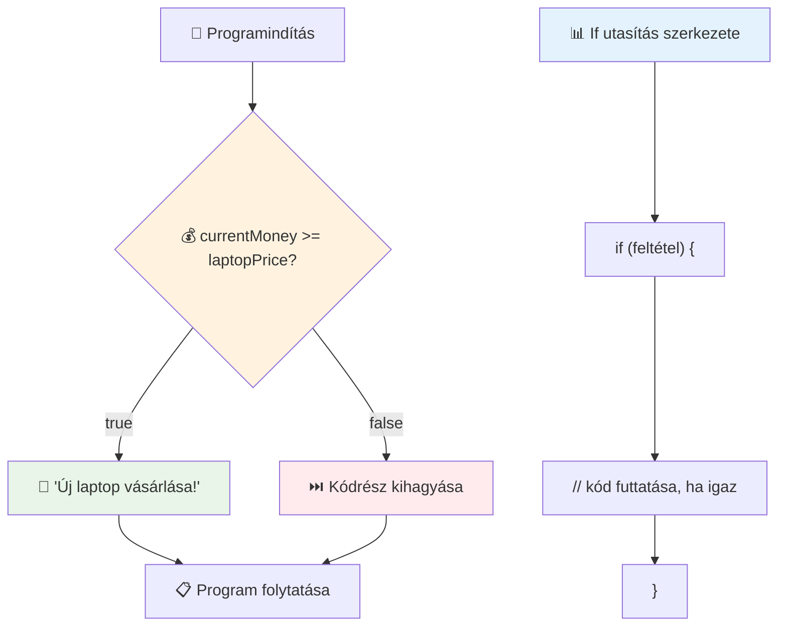
## If..Else utasítás

De mi történik, ha azt akarod, hogy a program más dolgot csináljon, amikor a feltétel hamis? Erre szolgál az `else` – olyan, mintha lenne egy tartalék terved.

Az `else` utasítás lehetőséget ad arra, hogy azt mond, "ha ez a feltétel nem igaz, akkor csináld inkább ezt."

```javascript
let currentMoney = 500;
let laptopPrice = 800;

if (currentMoney >= laptopPrice) {
  // A feltétel igaz. Ebben a blokkban lévő kód futni fog.
  console.log("Getting a new laptop!");
} else {
  // A feltétel hamis. Ebben a blokkban lévő kód futni fog.
  console.log("Can't afford a new laptop, yet!");
}
```

Most mivel a `500 >= 800` értéke `false`, a JavaScript kihagyja az első blokkot, és helyette lefuttatja az `else` blokkot. A konzolon megjelenik a "Még nem engedhetem meg magamnak az új laptopot!" üzenet.

✅ Teszteld ennek a kódnak és a következő kódnak a működését a böngésző konzoljában. Módosítsd a currentMoney és laptopPrice változók értékeit, hogy megváltoztasd a `console.log()`-ban megjelenő üzenetet.

### 🎯 **If-Else logika ellenőrzés: Elágazó utak**

**Értékeld felül feltételes logikád:**
- Mi történik, ha a `currentMoney` pontosan egyenlő a `laptopPrice`-szal?
- Tudsz gondolni olyan valós életbeli helyzetre, ahol hasznos lenne az if-else logika?
- Hogyan terjeszthetnéd ki ezt több árkategória kezelésére?

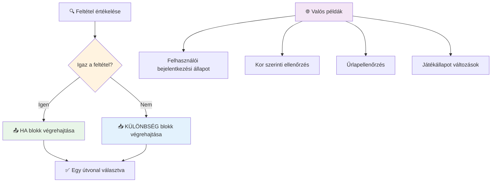
> **Kulcsfontosságú meglátás**: Az if-else biztosítja, hogy pontosan egy útvonal legyen végrehajtva. Ez garantálja, hogy a programod mindig válaszol bármely feltételre!

## Switch utasítás

Néha egy értéket több lehetőséggel kell összehasonlítani. Habár több `if..else`-t is láncolhatnál, ez az eljárás túl bonyolulttá válhat. A `switch` utasítás tisztább struktúrát nyújt több diszkrét érték kezelésére.

A koncepció hasonlít az első telefonközpontokban használt mechanikus kapcsoló rendszerhez – egy bemeneti érték határozza meg, melyik specifikus útvonalon halad a végrehajtás.

```javascript
switch (expression) {
  case x:
    // kódrészlet
    break;
  case y:
    // kódrészlet
    break;
  default:
    // kódrészlet
}
```

Így van felépítve:
- A JavaScript egyszer értékeli ki a kifejezést
- Megkeresi az egyes `case` ágakat, hogy találjon egyezést
- Ha talál egyezést, lefuttatja az adott kódblokkot
- A `break` megmondja a JavaScriptnek, hogy álljon meg és lépjen ki a switch-ből
- Ha egyik eset sem egyezik, lefuttatja az `default` blokkot (ha van)

```javascript
// Program kapcsoló utasítással a hét napjának kezelésére
let dayNumber = 2;
let dayName;

switch (dayNumber) {
  case 1:
    dayName = "Monday";
    break;
  case 2:
    dayName = "Tuesday";
    break;
  case 3:
    dayName = "Wednesday";
    break;
  default:
    dayName = "Unknown day";
    break;
}
console.log(`Today is ${dayName}`);
```

Ebben a példában a JavaScript látja, hogy `dayNumber` értéke `2`, megkeresi az ehhez tartozó `case 2`-t, beállítja a `dayName` értékét "Tuesday"-re, majd kilép a switch-ből. Az eredmény? "Today is Tuesday" jelenik meg a konzolon.

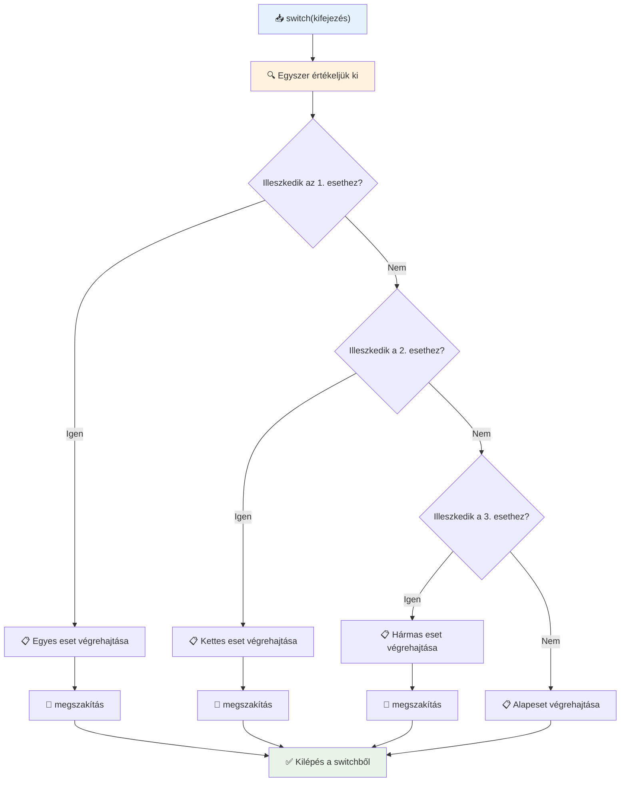
✅ Teszteld ennek a kódnak és a következő kódnak a működését a böngésző konzoljában. Módosítsd az `a` változó értékét, hogy megváltoztasd a `console.log()` visszatérő üzenetét.

### 🔄 **Switch utasítás mesteri szintű elsajátítása: Több lehetőség**

**Teszteld switch ismereteidet:**
- Mi történik, ha elfelejtesz egy `break` utasítást?
- Mikor használnád a `switch`-et többszörös `if-else` helyett?
- Miért hasznos a `default` eset akkor is, ha úgy gondolod, hogy minden lehetőséget lefedtél?

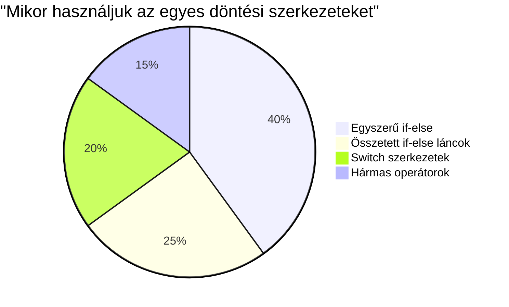
> **Legjobb gyakorlat**: Használd a `switch`-et, amikor egy változót több speciális értékkel hasonlítasz össze. Használd az `if-else`-t tartományok vagy bonyolult feltételek esetén!

## Logikai operátorok és Boole-ok

Az összetett döntések gyakran több feltétel egyidejű kiértékelését igénylik. Ahogyan a Boole algebra lehetővé teszi a matematikusok számára a logikai kifejezések összekapcsolását, a programozás is biztosít logikai operátorokat több Boole feltétel összekapcsolására.

Ezek az operátorok kifinomult feltételes logikát tesznek lehetővé az egyszerű igaz/hamis értékelések kombinálásával.

| Szimbólum | Leírás                                                                                         | Példa                                                                                   |
| --------- | --------------------------------------------------------------------------------------------- | --------------------------------------------------------------------------------------- |
| `&&`      | **Logikai ÉS**: Két Boolean kifejezést hasonlít össze. Csak akkor ad vissza igazat, ha mindkettő igaz | `(5 > 3) && (5 < 10) // Mindkét oldal igaz. Visszatér igaz`                           |
| `\|\|`    | **Logikai VAGY**: Két Boolean kifejezést hasonlít össze. Igazat ad vissza, ha legalább az egyik igaz   | `(5 > 10) \|\| (5 < 10) // Az egyik oldal hamis, a másik igaz. Visszatér igaz`        |
| `!`       | **Logikai NEM**: Egy Boolean kifejezés ellentétes értékét adja vissza                                  | `!(5 > 10) // 5 nem nagyobb mint 10, tehát "!" miatt igaz lesz`                        |

Ezek az operátorok lehetővé teszik, hogy hasznos módokon kombináld a feltételeket:
- ÉS (`&&`) azt jelenti, mindkét feltételnek igaznak kell lennie
- VAGY (`||`) azt jelenti, legalább az egyik feltételnek igaznak kell lennie  
- NEM (`!`) megfordítja az igaz értéket hamisra (és fordítva)

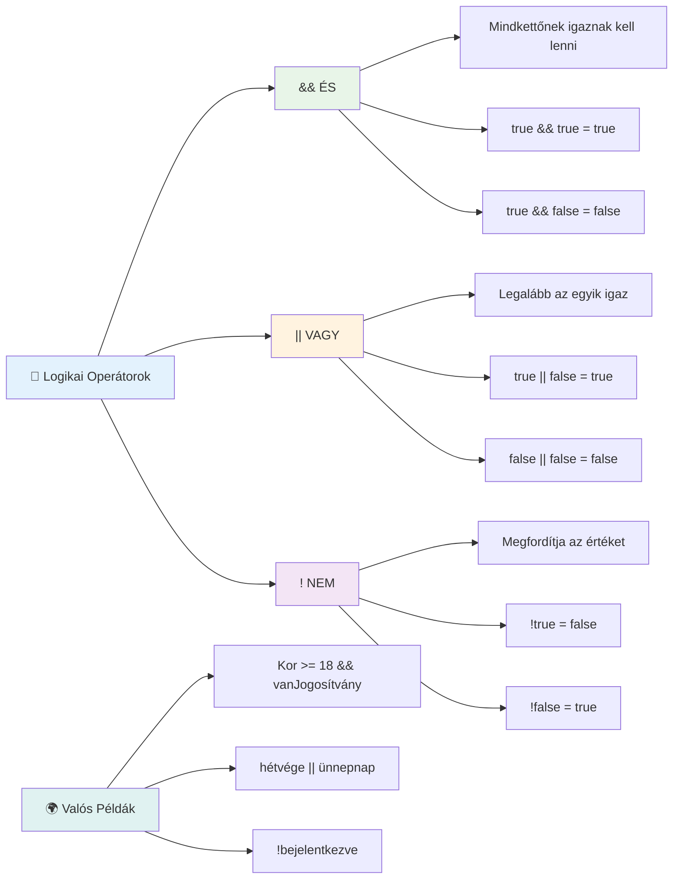
## Feltételek és döntések logikai operátorokkal

Nézzük meg ezeket az operátorokat egy reálisabb példán keresztül:

```javascript
let currentMoney = 600;
let laptopPrice = 800;
let laptopDiscountPrice = laptopPrice - (laptopPrice * 0.2); // Laptop ár 20% kedvezménnyel

if (currentMoney >= laptopPrice || currentMoney >= laptopDiscountPrice) {
  // A feltétel igaz. A blokkban lévő kód lefut.
  console.log("Getting a new laptop!");
} else {
  // A feltétel hamis. A blokkban lévő kód lefut.
  console.log("Can't afford a new laptop, yet!");
}
```

Ebben a példában kiszámolunk egy 20%-os kedvezményes árat (640), majd értékeljük, hogy a rendelkezésre álló pénz fedezi-e a teljes árat VAGY a kedvezményes árat. Mivel 600 eléri a 640 kedvezményes ár küszöböt, a feltétel igazra értékelődik.

### 🧮 **Logikai operátorok ellenőrzése: Feltételek kombinálása**

**Teszteld logikai operátor ismereted:**
- Az `A && B` kifejezésben mi történik, ha A hamis? B-t egyáltalán kiértékeli?
- Tudsz gondolni olyan helyzetet, amikor mindhárom operátorra (&&, ||, !) szükséged lenne egyszerre?
- Mi a különbség a `!user.isActive` és a `user.isActive !== true` között?

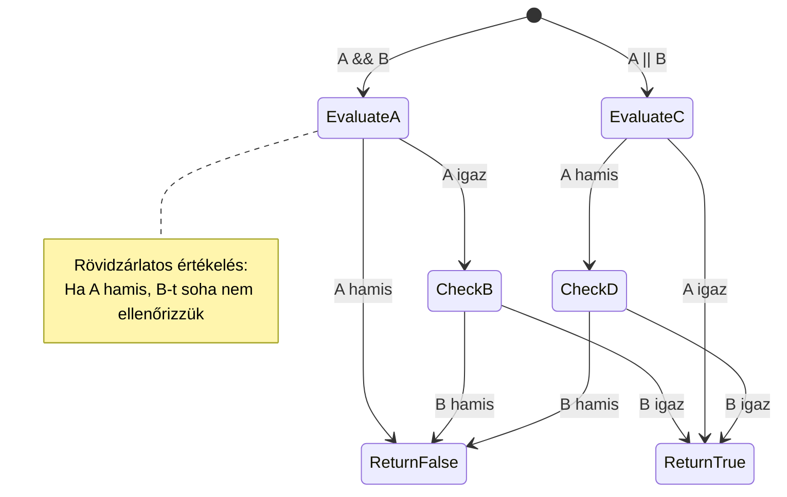
> **Teljesítmény tipp**: JavaScript "rövidzáras kiértékelést" használ - `A && B` esetén, ha A hamis, B-t nem értékeli ki. Használd ezt előnyödre!

### Negációs operátor

Néha könnyebb arról gondolkodni, mikor NEM igaz valami. Például ahelyett, hogy azt kérdeznéd: „Be van-e jelentkezve a felhasználó?”, inkább azt kérdezheted: „NEM jelentkezett be a felhasználó?” Az felkiáltójeles (`!`) operátor megfordítja helyetted a logikát.

```javascript
if (!condition) {
  // lefut, ha a feltétel hamis
} else {
  // lefut, ha a feltétel igaz
}
```

A `!` operátor olyan, mintha azt mondanád: „ellentéte…”, ha valami `true`, a `!` `false`-ra váltja, és fordítva.

### Ternáris kifejezések

Egyszerű feltételes hozzárendelésekhez a JavaScript egy **ternáris operátort** biztosít. Ez a tömör szintaxis lehetővé teszi, hogy egy sorban írj feltételes kifejezést, hasznos, ha két érték közül az egyiket kell feltétel alapján hozzárendelni.

```javascript
let variable = condition ? returnThisIfTrue : returnThisIfFalse;
```

Olyan, mintha kérdés lenne: „Ez a feltétel igaz? Ha igen, használd ezt az értéket. Ha nem, azt az értéket.”

Lentebb egy kézzelfoghatóbb példa:

```javascript
let firstNumber = 20;
let secondNumber = 10;
let biggestNumber = firstNumber > secondNumber ? firstNumber : secondNumber;
```

✅ Szánj pár percet arra, hogy többször elolvasd ezt a kódot. Érted, hogyan működnek ezek az operátorok?

Ez az egy sor azt mondja: „A `firstNumber` nagyobb-e, mint a `secondNumber`? Ha igen, a `firstNumber` kerül a `biggestNumber` változóba. Ha nem, a `secondNumber`.”

A ternáris operátor csak egy rövidebb módja a hagyományos `if..else` utasításnak:

```javascript
let biggestNumber;
if (firstNumber > secondNumber) {
  biggestNumber = firstNumber;
} else {
  biggestNumber = secondNumber;
}
```

Mindkét megközelítés azonos eredményt ad. A ternáris operátor tömörebb, míg a hagyományos if-else szerkezet olvashatóbb lehet bonyolultabb feltételek esetén.

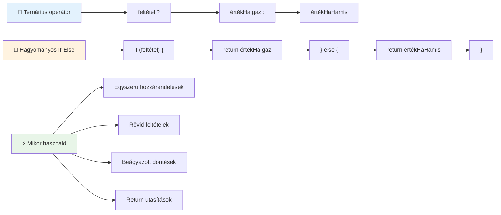
---


## 🚀 Kihívás

Készíts egy programot, amit először logikai operátorokkal írsz meg, majd írj át egy ternáris kifejezéssel. Melyik szintaxist preferálod?

---

## GitHub Copilot Ügynök Kihívás 🚀

Használd az Ügynök módot a következő kihívás teljesítésére:

**Leírás:** Készíts egy átfogó jegyszámoló programot, amely bemutatja a lecke több döntéshozatali fogalmát, beleértve az if-else utasításokat, switch utasításokat, logikai operátorokat és ternáris kifejezéseket.

**Prompt:** Írj egy JavaScript programot, amely egy hallgató számszerű pontszámát (0-100) veszi be, és meghatározza a betűjegyét az alábbi kritériumok szerint:
- A: 90-100
- B: 80-89  
- C: 70-79
- D: 60-69
- F: 60 alatt

Követelmény:
1. Használj if-else utasítást a betűjegy meghatározásához
2. Használj logikai operátorokat annak ellenőrzésére, hogy a diák átment-e (jegy >= 60) ÉS kiváló eredményt ért-e el (jegy >= 90)
3. Használj switch utasítást, hogy konkrét visszajelzést adj minden betűs jegyhez
4. Használj ternáris operátort annak meghatározására, hogy a diák jogosult-e a következő kurzusra (jegy >= 70)
5. Tegyél be bemeneti érvényesítést, hogy a pontszám 0 és 100 között legyen

Teszteld a programodat különböző pontszámokkal, beleértve a szélsőértékeket, például 59, 60, 89, 90, és érvénytelen bemeneteket.

Tudj meg többet az [agent mode](https://code.visualstudio.com/blogs/2025/02/24/introducing-copilot-agent-mode)-ról itt.


## Előadás utáni kvíz

[Előadás utáni kvíz](https://ff-quizzes.netlify.app/web/quiz/12)

## Áttekintés és önálló tanulás

Olvass bővebben a felhasználók rendelkezésére álló sok operátorról [az MDN-en](https://developer.mozilla.org/docs/Web/JavaScript/Reference/Operators).

Nézd meg Josh Comeau csodálatos [operátor-keresőjét](https://joshwcomeau.com/operator-lookup/)!

## Házi feladat

[Operátorok](assignment.md)

---

## 🧠 **Döntéshozó eszköztárad összefoglalója**

```mermaid
graph TD
    A["🎯 JavaScript Döntések"] --> B["🔍 Logikai Értékek"]
    A --> C["📊 Feltételes Utasítások"]
    A --> D["🔗 Logikai Operátorok"]
    A --> E["⚡ Fejlett Minták"]
    
    B --> B1["true/false értékek"]
    B --> B2["Összehasonlító operátorok"]
    B --> B3["Igazság értelmezés"]
    
    C --> C1["if utasítások"]
    C --> C2["if-else láncok"]
    C --> C3["switch utasítások"]
    
    D --> D1["&& (ÉS)"]
    D --> D2["|| (VAGY)"]
    D --> D3["! (NEM)"]
    
    E --> E1["Három operandusú operátor"]
    E --> E2["Rövidzárlat értékelés"]
    E --> E3["Összetett feltételek"]
    
    F["💡 Kulcsfontosságú Elvek"] --> F1["Világos, olvasható feltételek"]
    F --> F2["Következetes összehasonlítási stílus"]
    F --> F3["Megfelelő operátorrend"]
    F --> F4["Hatékony értékelési sorrend"]
    
    style A fill:#e3f2fd
    style B fill:#e8f5e8
    style C fill:#fff3e0
    style D fill:#f3e5f5
    style E fill:#e0f2f1
    style F fill:#fce4ec
```
---

## 🚀 A JavaScript döntéshozói tudásod ütemterve

### ⚡ **Mit tudsz elvégezni az elkövetkező 5 percben**
- [ ] Gyakorold a relációs operátorokat a böngésződ konzoljában
- [ ] Írj egy egyszerű if-else utasítást, ami ellenőrzi a korodat
- [ ] Próbáld ki a kihívást: írd át az if-else-t ternáris operátor használatával
- [ ] Teszteld, mi történik különböző „igaznak” és „hamisnak” vett értékekkel

### 🎯 **Mit érhetsz el ezen az órán**
- [ ] Teljesítsd az előadás utáni kvízt és ismételd át az összetett fogalmakat
- [ ] Építsd meg a GitHub Copilot kihívásából a részletes jegyszámítót
- [ ] Készíts egy egyszerű döntési fát egy valós példára (például mit vegyél fel)
- [ ] Gyakorold több feltétel kombinálását logikai operátorokkal
- [ ] Kísérletezz switch utasításokkal különböző felhasználási esetekhez

### 📅 **Heti logikai mesterkurzusod**
- [ ] Teljesítsd az operátorokkal kapcsolatos házi feladatot kreatív példákkal
- [ ] Készíts egy mini kvíz alkalmazást különböző feltételkezelési szerkezetekkel
- [ ] Építs egy űrlapérvényesítőt, ami több feltételt ellenőriz
- [ ] Gyakorold Josh Comeau [operátor-kereső](https://joshwcomeau.com/operator-lookup/) gyakorlatait
- [ ] Írd át a meglévő kódot jobban illeszkedő feltételes szerkezetekre
- [ ] Tanulmányozd a rövidzárlatos értékelést és a teljesítménybeli hatásokat

### 🌟 **Havi átalakulásod**
- [ ] Sajátítsd el a bonyolult, egymásba ágyazott feltételeket és tartsd meg az olvashatóságot
- [ ] Építs olyan alkalmazást, amely kifinomult döntéshozói logikát használ
- [ ] Adj közre nyílt forráskódú projekteket a feltételes logika fejlesztésében
- [ ] Taníts valaki mást a különböző feltételes szerkezetekről és alkalmazási helyzeteikről
- [ ] Fedezd fel a funkcionális programozás megközelítéseit feltételes logikával kapcsolatban
- [ ] Készíts egy személyes útmutatót a feltételes legjobb gyakorlatokról

### 🏆 **Végső döntéshozói bajnok ellenőrzés**

**Ünnepeld meg a logikus gondolkodásodat:**
- Melyik volt a legsokoldalúbb döntési logika, amit sikeresen megvalósítottál?
- Melyik feltételes szerkezet tűnik a legtermészetesebbnek számodra és miért?
- Hogyan változtatta meg a problémamegoldó megközelítésedet a logikai operátorok megismerése?
- Milyen valós alkalmazás profitálna kifinomult döntéshozói logikából?

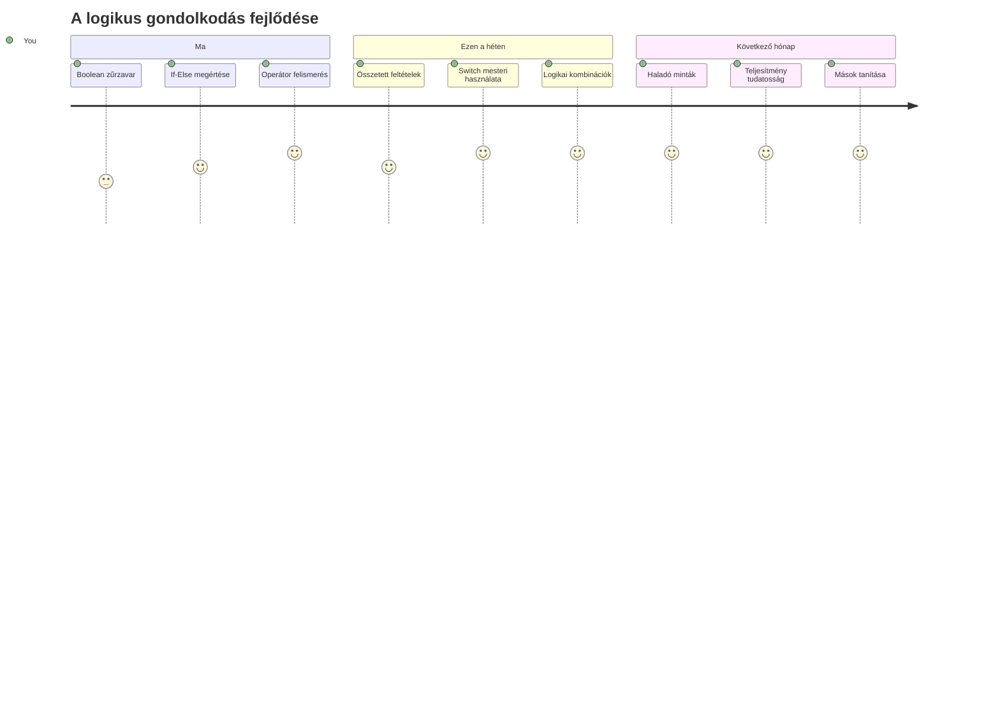
> 🧠 **Mesteri szinten sajátítottad el a digitális döntéshozatalt!** Minden interaktív alkalmazás feltételes logikára támaszkodik, hogy intelligensen reagáljon a felhasználói műveletekre és a változó körülményekre. Most már érted, hogyan kell programjaidat gondolkodtatni, értékelni és megfelelő válaszokat választani. Ez a logikai alap erőt ad minden dinamikus alkalmazásnak, amit építesz! 🎉

---

<!-- CO-OP TRANSLATOR DISCLAIMER START -->
**Jogi nyilatkozat**:
Ezt a dokumentumot az AI fordító szolgáltatás, a [Co-op Translator](https://github.com/Azure/co-op-translator) segítségével fordítottuk le. Bár a pontosságra törekszünk, kérjük, vegye figyelembe, hogy az automatikus fordítások hibákat vagy pontatlanságokat tartalmazhatnak. Az eredeti dokumentum az anyanyelvén tekintendő hiteles forrásnak. Fontos információk esetén professzionális, emberi fordítást javaslunk. Nem vállalunk felelősséget a fordítás használatából eredő félreértésekért vagy félreértelmezésekért.
<!-- CO-OP TRANSLATOR DISCLAIMER END -->