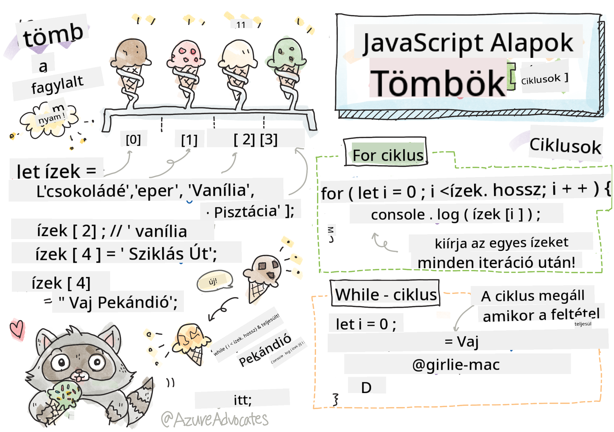

<!--
CO_OP_TRANSLATOR_METADATA:
{
  "original_hash": "9029f96b0e034839c1799f4595e4bb66",
  "translation_date": "2025-08-29T10:32:22+00:00",
  "source_file": "2-js-basics/4-arrays-loops/README.md",
  "language_code": "hu"
}
-->
# JavaScript Alapok: Tömbök és Ciklusok


> Sketchnote készítette: [Tomomi Imura](https://twitter.com/girlie_mac)

## Előadás előtti kvíz
[Előadás előtti kvíz](https://ff-quizzes.netlify.app/web/quiz/13)

Ez a lecke a JavaScript alapjait mutatja be, amely a weben az interaktivitást biztosítja. Ebben a leckében megtanulod a tömbök és ciklusok használatát, amelyek az adatok kezelésére szolgálnak.

[](https://youtube.com/watch?v=1U4qTyq02Xw "Tömbök")

[](https://www.youtube.com/watch?v=Eeh7pxtTZ3k "Ciklusok")

> 🎥 Kattints a fenti képekre a tömbökről és ciklusokról szóló videók megtekintéséhez.

> Ezt a leckét elérheted a [Microsoft Learn](https://docs.microsoft.com/learn/modules/web-development-101-arrays/?WT.mc_id=academic-77807-sagibbon) oldalon!

## Tömbök

Az adatokkal való munka minden programozási nyelvben gyakori feladat, és sokkal egyszerűbb, ha az adatok strukturált formátumban, például tömbökben vannak tárolva. A tömbök segítségével az adatok egy listához hasonló struktúrában tárolhatók. A tömbök egyik nagy előnye, hogy különböző típusú adatokat is tárolhatunk egy tömbben.

✅ A tömbök mindenhol körülvesznek minket! Tudsz mondani egy valós példát egy tömbre, például egy napelem tömbre?

A tömb szintaxisa egy pár szögletes zárójel.

```javascript
let myArray = [];
```

Ez egy üres tömb, de a tömbök már eleve adatokkal feltöltve is deklarálhatók. A tömbben lévő értékeket vesszővel választjuk el egymástól.

```javascript
let iceCreamFlavors = ["Chocolate", "Strawberry", "Vanilla", "Pistachio", "Rocky Road"];
```

A tömb értékeihez egyedi érték, az úgynevezett **index** van hozzárendelve, amely egy egész szám, és a tömb elejétől való távolság alapján van meghatározva. A fenti példában a "Chocolate" sztring érték indexe 0, míg a "Rocky Road" indexe 4. Az indexet szögletes zárójelekkel használhatjuk az értékek lekérésére, módosítására vagy hozzáadására.

✅ Meglep, hogy a tömbök indexe nullával kezdődik? Néhány programozási nyelvben az indexek 1-től kezdődnek. Ennek érdekes története van, amelyről [olvashatsz a Wikipédián](https://en.wikipedia.org/wiki/Zero-based_numbering).

```javascript
let iceCreamFlavors = ["Chocolate", "Strawberry", "Vanilla", "Pistachio", "Rocky Road"];
iceCreamFlavors[2]; //"Vanilla"
```

Az indexet felhasználhatjuk egy érték módosítására, például így:

```javascript
iceCreamFlavors[4] = "Butter Pecan"; //Changed "Rocky Road" to "Butter Pecan"
```

Új értéket is hozzáadhatunk egy adott indexhez, például így:

```javascript
iceCreamFlavors[5] = "Cookie Dough"; //Added "Cookie Dough"
```

✅ Gyakoribb módja az értékek hozzáadásának egy tömbhöz az olyan tömb operátorok használata, mint az array.push()

Ha meg szeretnéd tudni, hány elem van egy tömbben, használd a `length` tulajdonságot.

```javascript
let iceCreamFlavors = ["Chocolate", "Strawberry", "Vanilla", "Pistachio", "Rocky Road"];
iceCreamFlavors.length; //5
```

✅ Próbáld ki magad! Használd a böngésződ konzolját, hogy létrehozz és manipulálj egy saját tömböt.

## Ciklusok

A ciklusok lehetővé teszik, hogy ismétlődő vagy **iteratív** feladatokat hajtsunk végre, és rengeteg időt és kódot takaríthatunk meg velük. Minden iteráció változhat a változókban, értékekben és feltételekben. A JavaScriptben különböző típusú ciklusok léteznek, amelyek mindegyike apró eltérésekkel ugyanazt a célt szolgálja: adatokon való iterálást.

### For ciklus

A `for` ciklusnak 3 része van az iterációhoz:
- `számláló` Egy változó, amelyet általában egy számmal inicializálnak, és az iterációk számát számolja
- `feltétel` Olyan kifejezés, amely összehasonlító operátorokat használ, és akkor állítja le a ciklust, amikor `false`
- `iterációs kifejezés` Minden iteráció végén fut, általában a számláló értékének megváltoztatására használják
  
```javascript
// Counting up to 10
for (let i = 0; i < 10; i++) {
  console.log(i);
}
```

✅ Futtasd ezt a kódot a böngésződ konzoljában. Mi történik, ha apró változtatásokat végzel a számlálón, feltételen vagy iterációs kifejezésen? Tudsz visszafelé futtatni egy visszaszámlálást?

### While ciklus

A `for` ciklus szintaxisával ellentétben a `while` ciklusoknak csak egy feltételre van szükségük, amely leállítja a ciklust, amikor a feltétel `false` lesz. A ciklusok feltételei általában más értékeken, például számlálókon alapulnak, és ezeket a ciklus során kezelni kell. A számlálók kezdőértékeit a cikluson kívül kell létrehozni, és minden olyan kifejezést, amely megfelel a feltételnek, beleértve a számláló módosítását, a cikluson belül kell fenntartani.

```javascript
//Counting up to 10
let i = 0;
while (i < 10) {
 console.log(i);
 i++;
}
```

✅ Miért választanál for ciklust a while ciklus helyett? 17 ezer nézőnek volt ugyanez a kérdése a StackOverflow-n, és néhány vélemény [érdekes lehet számodra](https://stackoverflow.com/questions/39969145/while-loops-vs-for-loops-in-javascript).

## Ciklusok és tömbök

A tömböket gyakran használják ciklusokkal, mert a legtöbb feltétel a tömb hosszát igényli a ciklus leállításához, és az index lehet a számláló értéke is.

```javascript
let iceCreamFlavors = ["Chocolate", "Strawberry", "Vanilla", "Pistachio", "Rocky Road"];

for (let i = 0; i < iceCreamFlavors.length; i++) {
  console.log(iceCreamFlavors[i]);
} //Ends when all flavors are printed
```

✅ Kísérletezz egy saját tömbbel, és iterálj rajta a böngésződ konzoljában.

---

## 🚀 Kihívás

A tömbökön való iterálásnak vannak más módjai is, mint a for és while ciklusok. Ilyenek például a [forEach](https://developer.mozilla.org/docs/Web/JavaScript/Reference/Global_Objects/Array/forEach), [for-of](https://developer.mozilla.org/docs/Web/JavaScript/Reference/Statements/for...of), és [map](https://developer.mozilla.org/docs/Web/JavaScript/Reference/Global_Objects/Array/map). Írd át a tömböd ciklusát ezek egyikének használatával.

## Előadás utáni kvíz
[Előadás utáni kvíz](https://ff-quizzes.netlify.app/web/quiz/14)

## Áttekintés és önálló tanulás

A JavaScript tömbjeihez számos módszer kapcsolódik, amelyek rendkívül hasznosak az adatok manipulálásában. [Olvass ezekről a módszerekről](https://developer.mozilla.org/docs/Web/JavaScript/Reference/Global_Objects/Array), és próbálj ki néhányat (például push, pop, slice és splice) egy saját tömbön.

## Feladat

[Tömb iterálása](assignment.md)

---

**Felelősségkizárás**:  
Ez a dokumentum az [Co-op Translator](https://github.com/Azure/co-op-translator) AI fordítási szolgáltatás segítségével készült. Bár törekszünk a pontosságra, kérjük, vegye figyelembe, hogy az automatikus fordítások hibákat vagy pontatlanságokat tartalmazhatnak. Az eredeti dokumentum az eredeti nyelvén tekintendő hiteles forrásnak. Kritikus információk esetén javasolt a professzionális, emberi fordítás igénybevétele. Nem vállalunk felelősséget a fordítás használatából eredő félreértésekért vagy téves értelmezésekért.