<!--
CO_OP_TRANSLATOR_METADATA:
{
  "original_hash": "1710a50a519a6e4a1b40a5638783018d",
  "translation_date": "2026-01-07T02:34:25+00:00",
  "source_file": "2-js-basics/4-arrays-loops/README.md",
  "language_code": "hu"
}
-->
# JavaScript Alapok: Tömbök és Ciklusok


> Sketchnote készítette: [Tomomi Imura](https://twitter.com/girlie_mac)

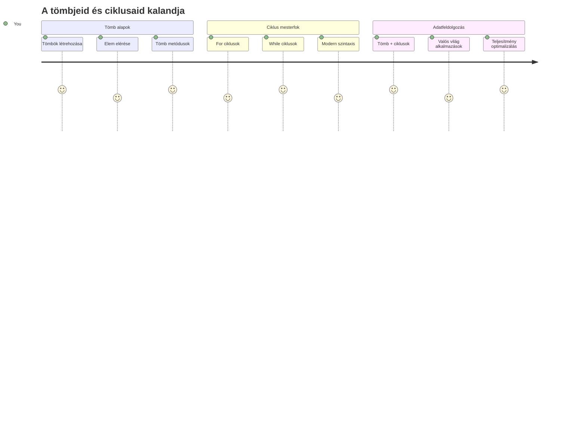
## Előadás előtti kvíz
[Előadás előtti kvíz](https://ff-quizzes.netlify.app/web/quiz/13)

Gondolkodtál már azon, hogyan tartják számon a weboldalak a kosárban lévő termékeket, vagy hogyan jelenítik meg a barátlistádat? Itt jönnek képbe a tömbök és a ciklusok. A tömbök olyan digitális tárolók, amelyek több információt is magukban tartanak, míg a ciklusok lehetővé teszik, hogy az összes adatot hatékonyan kezeld ismétlődő kód nélkül.

Ezek a két fogalom együtt alapját képezik az információkezelésnek a programjaidban. Megtanulod, hogyan menj el a minden lépést kézzel leíró módszertől egy okos, hatékony kód kialakításáig, ami akár százakat vagy ezreket is képes gyorsan feldolgozni.

A lecke végére megérted, hogyan lehet összetett adatfeldolgozási feladatokat néhány sor kóddal megoldani. Fedezzük fel ezeket az alapvető programozási fogalmakat!

[](https://youtube.com/watch?v=1U4qTyq02Xw "Arrays")

[](https://www.youtube.com/watch?v=Eeh7pxtTZ3k "Loops")

> 🎥 Kattints a fenti képekre a tömbökről és ciklusokról szóló videókért.

> Ezt a leckét elvégezheted a [Microsoft Learn-en](https://docs.microsoft.com/learn/modules/web-development-101-arrays/?WT.mc_id=academic-77807-sagibbon)!

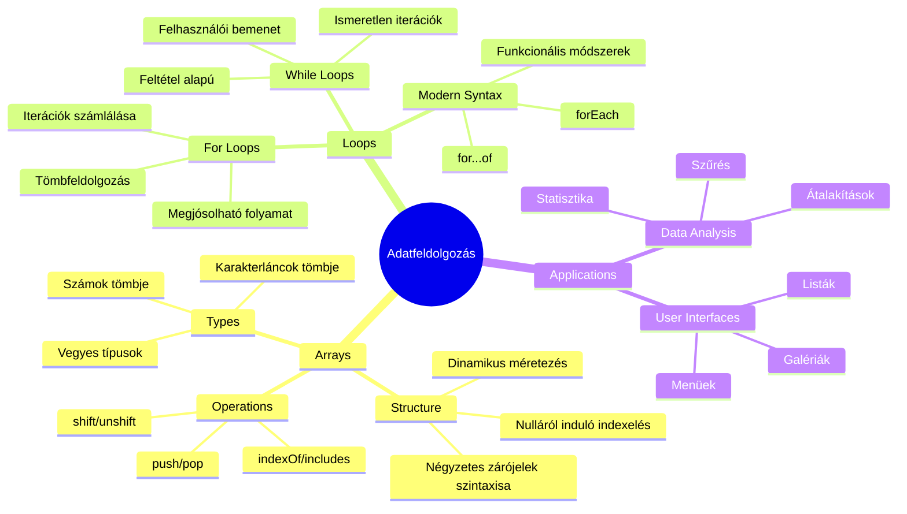
## Tömbök

Gondolj a tömbökre úgy, mint egy digitális iratszekrényre – ahelyett, hogy egy fiókban csak egy dokumentumot tárolnál, több kapcsolódó elemet rendezhetsz egyetlen, strukturált tárolóban. Programozási értelemben a tömbök lehetővé teszik, hogy több információt tárolj egy rendezett csomagban.

Akár egy fényképgalériát építesz, teendőlistát kezelsz, vagy egy játék magas pontszámait tartod nyilván, a tömbök az adatkezelés alapját adják. Nézzük meg, hogyan működnek.

✅ Mindenütt ott vannak a tömbök! Tudsz mondani egy valós példát egy tömbre, például egy napelem tömböt?

### Tömbök létrehozása

A tömb létrehozása szuper egyszerű – csak használj szögletes zárójeleket!

```javascript
// Üres tömb - olyan, mint egy üres bevásárlókocsi, amely várja a termékeket
const myArray = [];
```

**Mi történik itt?**
Épp most hoztál létre egy üres tárolót ezekkel a szögletes zárójelekkel `[]`. Gondolj rá úgy, mint egy üres könyvespolcra – készen áll arra, hogy bármilyen könyvet rendszerezz benne.

Tömbödet kezdettől fogva töltheted kezdeti értékekkel is:

```javascript
// A fagyizó ízválasztéka
const iceCreamFlavors = ["Chocolate", "Strawberry", "Vanilla", "Pistachio", "Rocky Road"];

// Egy felhasználó profiladatai (különböző típusú adatok keveréke)
const userData = ["John", 25, true, "developer"];

// Kedvenc tantárgyad dolgozatai
const scores = [95, 87, 92, 78, 85];
```

**Érdekes dolgok, amikre figyelj:**
- A tömbben tárolhatsz szöveget, számokat, vagy akár igaz/hamis értékeket is
- Csak vesszővel válaszd el az elemeket – könnyű!
- A tömbök tökéletesek kapcsolódó adatok egyben tartására

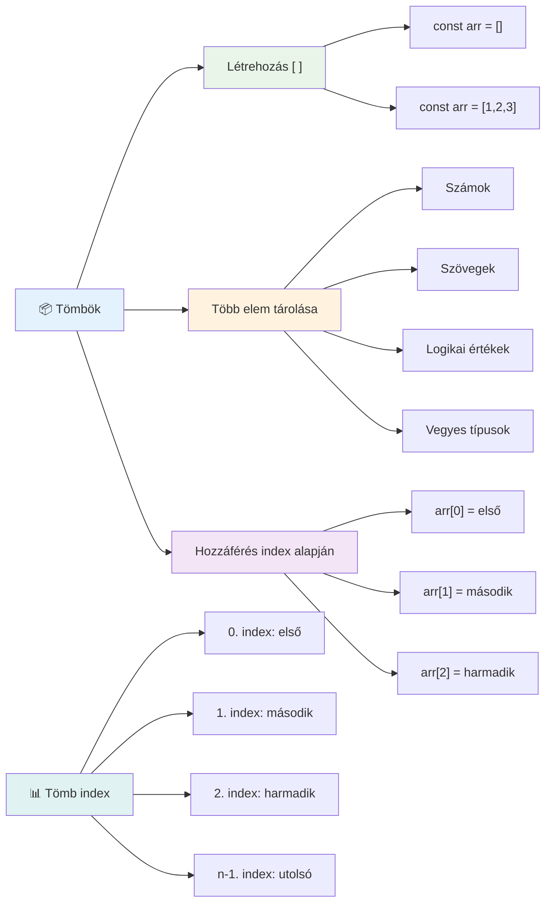
### Tömb indexelése

Itt van valami, ami elsőre furcsa lehet: a tömbök az elemeket 0-tól számozzák, nem 1-től. Ez a nullával kezdődő indexelés a számítógép memóriájának működéséből ered – régi programozói konvenció, ami már a korai C nyelvű programozás idején is létezett. Minden helyhez a tömbben tartozik egy saját címszám, amelyet **index**-nek hívunk.

| Index | Érték | Leírás |
|-------|-------|-------------|
| 0 | "Csokoládé" | Első elem |
| 1 | "Eper" | Második elem |
| 2 | "Vanília" | Harmadik elem |
| 3 | "Pisztácia" | Negyedik elem |
| 4 | "Rocky Road" | Ötödik elem |

✅ Meglep, hogy a tömbök nullás indextől indulnak? Néhány programozási nyelvben 1-től kezdik az indexelést. Érdekes története van ennek, amit elolvashatsz a [Wikipédián](https://en.wikipedia.org/wiki/Zero-based_numbering).

**Tömb elemeinek elérése:**

```javascript
const iceCreamFlavors = ["Chocolate", "Strawberry", "Vanilla", "Pistachio", "Rocky Road"];

// Egyedi elemek elérése zárójel notációval
console.log(iceCreamFlavors[0]); // "Csokoládé" - első elem
console.log(iceCreamFlavors[2]); // "Vanília" - harmadik elem
console.log(iceCreamFlavors[4]); // "Rocky Road" - utolsó elem
```

**Levezetés, mi történik itt:**
- **Használ** szögletes zárójelezést az indexszel az elemek eléréséhez
- **Visszatér** a tömb adott pozícióján tárolt értékkel
- **0-tól kezd** számlálni, így az első elem indexe 0

**Tömb elemeinek módosítása:**

```javascript
// Egy létező érték megváltoztatása
iceCreamFlavors[4] = "Butter Pecan";
console.log(iceCreamFlavors[4]); // "Vajdió"

// Új elem hozzáadása a végén
iceCreamFlavors[5] = "Cookie Dough";
console.log(iceCreamFlavors[5]); // "Süti Tészta"
```

**Az előző példában:**
- **Módosítottuk** az 4-es indexű elemet "Rocky Road"-ról "Butter Pecan"-ra
- **Beszúrtunk** egy új elemet "Cookie Dough" néven az 5-ös indexen
- **Automatikusan** megnöveltük a tömb hosszát, amikor a határon túl bővítettünk

### Tömb hossza és gyakori metódusok

A tömbök beépített tulajdonságokkal és metódusokkal rendelkeznek, amik megkönnyítik az adatkezelést.

**Tömb hosszának lekérdezése:**

```javascript
const iceCreamFlavors = ["Chocolate", "Strawberry", "Vanilla", "Pistachio", "Rocky Road"];
console.log(iceCreamFlavors.length); // 5

// A hossz automatikusan frissül, ahogy a tömb változik
iceCreamFlavors.push("Mint Chip");
console.log(iceCreamFlavors.length); // 6
```

**Fontos tudnivalók:**
- **Visszaadja** az elemek összes számát a tömbben
- **Automatikusan frissül**, amikor elemeket adsz hozzá vagy törölsz
- **Dinamikus számlálást ad**, ami hasznos ciklusokhoz és ellenőrzéshez

**Lényeges tömb metódusok:**

```javascript
const fruits = ["apple", "banana", "orange"];

// Elemek hozzáadása
fruits.push("grape");           // Hozzáadás a végéhez: ["alma", "banán", "narancs", "szőlő"]
fruits.unshift("strawberry");   // Hozzáadás az elejére: ["eper", "alma", "banán", "narancs", "szőlő"]

// Elemek eltávolítása
const lastFruit = fruits.pop();        // Eltávolítja és visszaadja a "szőlőt"
const firstFruit = fruits.shift();     // Eltávolítja és visszaadja az "epert"

// Elemek keresése
const index = fruits.indexOf("banana"); // Visszaadja az 1-et ("banán" pozíciója)
const hasApple = fruits.includes("apple"); // Visszaadja az igaz értéket
```

**Ezekről a metódusokról tudnod kell:**
- **Hozzáad** elemeket a `push()` (végén) és az `unshift()` (elején)
- **Eltávolít** elemeket a `pop()` (végén) és a `shift()` (elején)
- **Megkeres** elemeket az `indexOf()` segítségével, és ellenőrzi a létezésüket az `includes()`-zal
- **Visszaad** hasznos értékeket, mint eltávolított elemek vagy pozíciók

✅ Próbáld ki! Használd böngésződ konzolját, hogy létrehozz és kezelj egy saját tömböt.

### 🧠 **Tömb alapok ellenőrzése: Adatok rendszerezése**

**Teszteld a tömbös tudásod:**
- Miért gondolod, hogy a tömbök 0-tól számolnak és nem 1-től?
- Mi történik, ha olyan indexet próbálsz elérni, ami nem létezik (pl. `arr[100]` egy 5 elemű tömbben)?
- Tudsz mondani három valós példát, ahol a tömbök hasznosak lehetnek?

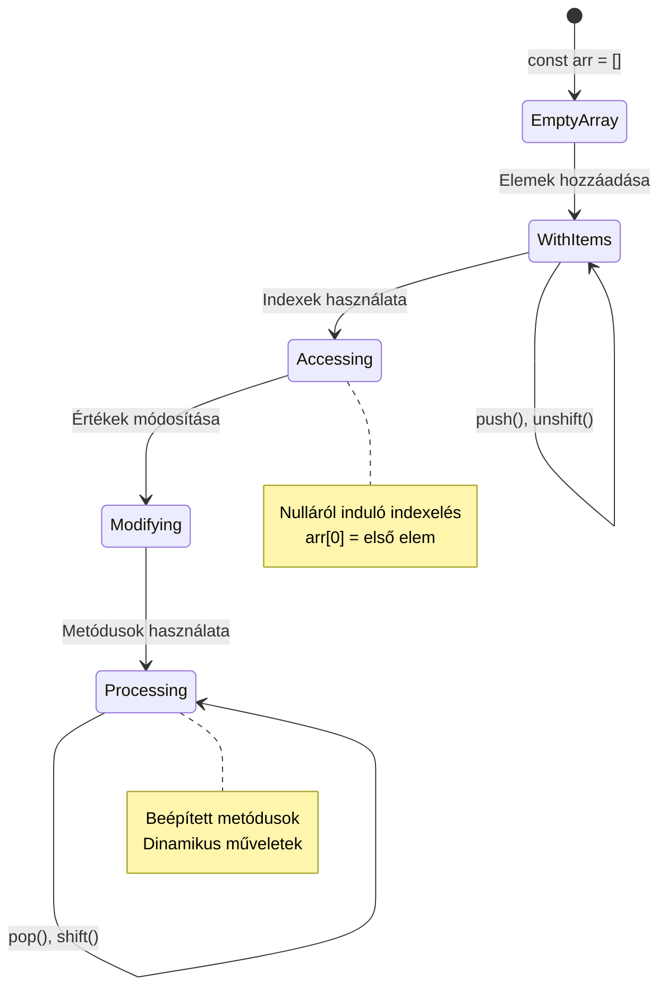
> **Valós tapasztalat**: A programozásban a tömbök mindenhol jelen vannak! Közösségi média hírfolyamok, bevásárlókosarak, képgalériák, lejátszási listák - ezek mind tömbök a háttérben!

## Ciklusok

Gondolj arra a hírhedt büntetésre Charles Dickens regényeiben, ahol a diákoknak többszörös sorokban kellett ugyanazt írogatniuk táblára. Képzeld el, ha valaki csak annyit mondhatna, hogy „írd le ezt a mondatot 100-szor”, és az meg is történne automatikusan. Pont ezt csinálják a ciklusok a kódoddal.

A ciklusok olyanok, mint egy kitartó asszisztens, aki hibátlanul ismételheti el a feladatokat. Akár a bevásárlókosár minden elemét leellenőriznéd, vagy az összes képet megmutatnád egy albumban, a ciklusok hatékonyan kezelik az ismétlődést.

A JavaScript többféle ciklustípust kínál. Nézzük meg mindegyiket, és értsük meg, hogy mikor érdemes használni őket.

```mermaid
flowchart TD
    A["🔄 Ciklustípusok"] --> B["For ciklus"]
    A --> C["While ciklus"]
    A --> D["For...of ciklus"]
    A --> E["forEach metódus"]
    
    B --> B1["Ismert iterációk"]
    B --> B2["Számláló alapú"]
    B --> B3["for(init; feltétel; növelés)"]
    
    C --> C1["Ismeretlen iterációk"]
    C --> C2["Feltétel alapú"]
    C --> C3["while(feltétel)"]
    
    D --> D1["Modern ES6+"]
    D --> D2["Tömb iteráció"]
    D --> D3["for(elem a tömbön)"]
    
    E --> E1["Funkcionális stílus"]
    E --> E2["Tömb metódus"]
    E --> E3["tömb.forEach(visszahívás)"]
    
    F["⏰ Mikor használjuk"] --> F1["For: Számlálás, indexek"]
    F --> F2["While: Felhasználói bevitel, keresés"]
    F --> F3["For...of: Egyszerű iteráció"]
    F --> F4["forEach: Funkcionális programozás"]
    
    style A fill:#e3f2fd
    style B fill:#e8f5e8
    style C fill:#fff3e0
    style D fill:#f3e5f5
    style E fill:#e0f2f1
    style F fill:#fce4ec
```
### For ciklus

A `for` ciklus olyan, mintha időzítőt állítanál be – pontosan tudod, hányszor akarod, hogy valami megtörténjen. Nagyon szervezett és kiszámítható, ami tökéletessé teszi tömbökkel való munkához vagy amikor számolnod kell.

**For ciklus szerkezete:**

| Része | Célja | Példa |
|-----------|---------|----------|
| **Inicializálás** | Kezdőérték beállítása | `let i = 0` |
| **Feltétel** | Mikor folytatódjon | `i < 10` |
| **Inkrementálás** | Hogyan frissít | `i++` |

```javascript
// Számolás 0-tól 9-ig
for (let i = 0; i < 10; i++) {
  console.log(`Count: ${i}`);
}

// Gyakoribb példa: pontszámok feldolgozása
const testScores = [85, 92, 78, 96, 88];
for (let i = 0; i < testScores.length; i++) {
  console.log(`Student ${i + 1}: ${testScores[i]}%`);
}
```

**Lépésről lépésre, mi történik:**
- **Inicializálja** az `i` számlálót 0 értékkel
- **Ellenőrzi** az `i < 10` feltételt minden iteráció elején
- **Végrehajtja** a kódblokkot, ha a feltétel igaz
- **Növeli** `i` értékét 1-gyel az `i++` kifejezéssel minden iteráció után
- **Megáll**, mikor a feltétel hamissá válik (amikor `i` eléri a 10-et)

✅ Futtasd ezt a kódot a böngésző konzoljában! Mi történik, ha kicsit módosítasz az számláló, feltétel vagy az iteráció kifejezésen? Tudod-e visszafelé futtatni, számolás visszafele készítésével?

### 🗓️ **For ciklus tudáspróba: Kontrollált ismétlés**

**Értékeld for ciklusos tudásod:**
- Mik a for ciklus három része, és mit csinál mindegyik?
- Hogyan iterálnál végig egy tömbön visszafelé?
- Mi történik, ha elfelejted az inkrementálást (`i++`)?

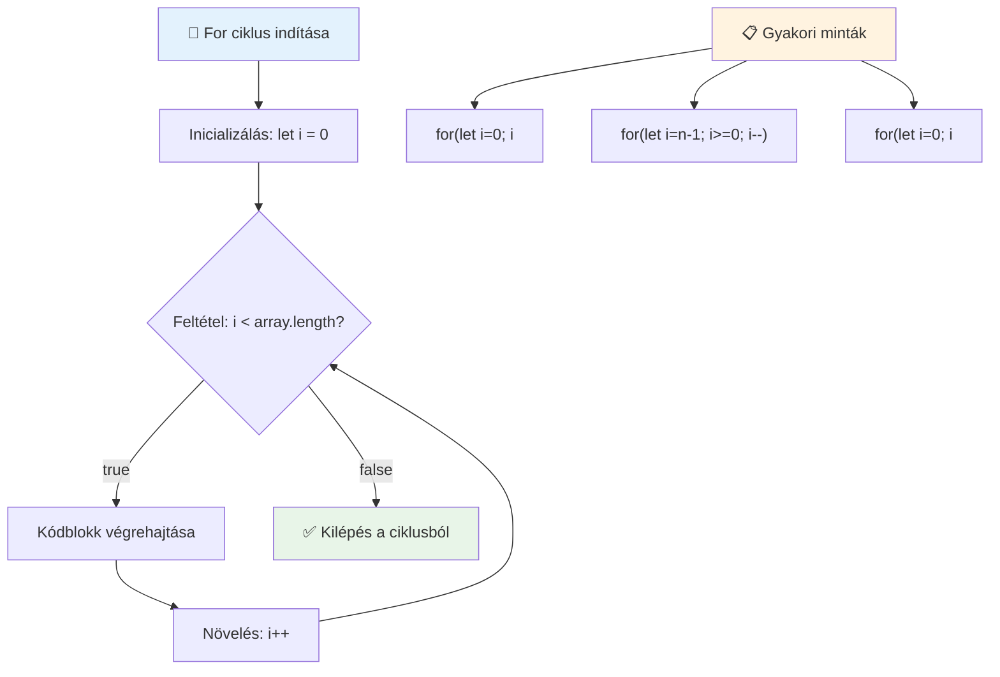
> **Ciklus bölcsesség**: A for ciklusok tökéletesek, ha pontosan tudod, hányszor kell megismételni valamit. A leggyakoribb választás tömbök feldolgozásához!

### While ciklus

A `while` ciklus egy „csináld ezt, amíg…” típusú ciklus, amely esetében lehet, hogy nem tudod előre, hányszor fog lefutni, de azt tudod, mikor kell megállnia. Tökéletes például akkor, ha a felhasználótól vársz adatot, amíg meg nem kapod, vagy keresel egy adatot egészen addig, amíg meg nem találod.

**While ciklus jellemzői:**
- **Folyamatosan fut**, amíg a feltétel igaz
- **Manuális kezelést** igényel a számláló változókra
- **Feltételt ellenőriz** minden iteráció előtt
- **Veszélye** a végtelen ciklus, ha a feltétel sosem válik hamissá

```javascript
// Alap számlálási példa
let i = 0;
while (i < 10) {
  console.log(`While count: ${i}`);
  i++; // Ne felejtsd el növelni!
}

// Gyakorlati példa: felhasználói bemenet feldolgozása
let userInput = "";
let attempts = 0;
const maxAttempts = 3;

while (userInput !== "quit" && attempts < maxAttempts) {
  userInput = prompt(`Enter 'quit' to exit (attempt ${attempts + 1}):`);
  attempts++;
}

if (attempts >= maxAttempts) {
  console.log("Maximum attempts reached!");
}
```

**Ezeket a példákat értsd meg:**
- **Kezeli** a számláló változót `i` kézzel a ciklus törzsén belül
- **Növeli** a számlálót a végtelen ciklus megelőzéséhez
- **Bemutat** gyakorlati esetet felhasználói bevitel gyorsítására és próbálkozások korlátozására
- **Tartalmaz** biztonsági mechanizmusokat végtelen futás ellen

### ♾️ **While ciklus tudáspróba: Feltétel alapú ismétlés**

**Teszteld a while ciklus tudásodat:**
- Mi a legnagyobb veszély while ciklusok használatakor?
- Mikor választanál while ciklust egy for ciklus helyett?
- Hogyan lehet megakadályozni a végtelen ciklust?

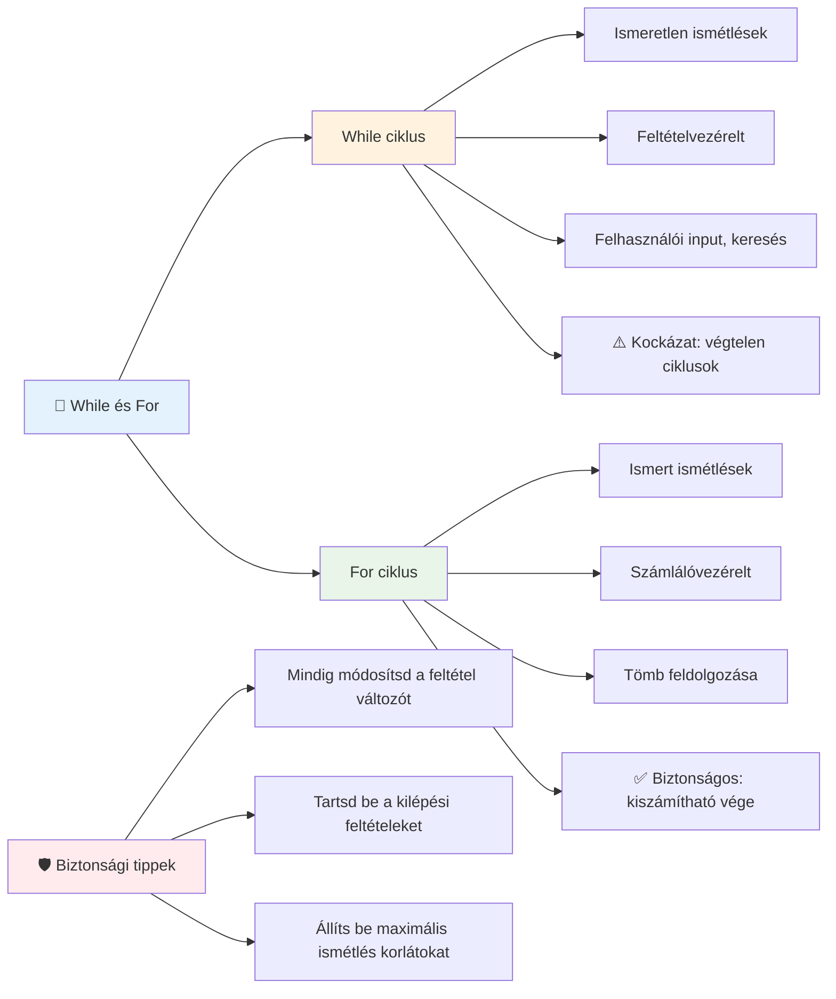
> **Biztonság először**: A while ciklusok erősek, de gondos feltételvezérlést igényelnek. Mindig gondoskodj arról, hogy a feltétel idővel hamissá váljon!

### Modern ciklus alternatívák

A JavaScript modern ciklus szintaxist kínál, mely olvashatóbb és kevesebb hibalehetőséget ad.

**For...of ciklus (ES6+):**

```javascript
const colors = ["red", "green", "blue", "yellow"];

// Modern megközelítés - tisztább és biztonságosabb
for (const color of colors) {
  console.log(`Color: ${color}`);
}

// Összehasonlítás a hagyományos for ciklussal
for (let i = 0; i < colors.length; i++) {
  console.log(`Color: ${colors[i]}`);
}
```

**A for...of előnyei:**
- **Eltünteti** az index kezelést és a hibalehetőségeket
- **Közvetlen hozzáférést** biztosít a tömb elemeihez
- **Javítja** a kód olvashatóságát és csökkenti a szintaxishibákat

**forEach metódus:**

```javascript
const prices = [9.99, 15.50, 22.75, 8.25];

// forEach használata funkcionális programozási stílusban
prices.forEach((price, index) => {
  console.log(`Item ${index + 1}: $${price.toFixed(2)}`);
});

// forEach nyíl függvényekkel egyszerű műveletekhez
prices.forEach(price => console.log(`Price: $${price}`));
```

**A forEach-ről tudnod kell:**
- **Minden tömbelemen** futtat egy függvényt
- **Átadja** az elem értékét és indexét paraméterként
- **Nem állítható meg idő előtt** (ellentétben a hagyományos ciklusokkal)
- **Nem ad vissza új tömböt** (undefined eredményt ad)

✅ Miért választanál for ciklust a while helyett? 17 ezer ember tette fel ugyanezt a kérdést a StackOverflow-n, és néhány vélemény [érdekes lehet számodra](https://stackoverflow.com/questions/39969145/while-loops-vs-for-loops-in-javascript).

### 🎨 **Modern ciklus szintaxis tudáspróba: Az ES6+ elfogadása**

**Értékeld modern JavaScript tudásodat:**
- Mik a for...of előnyei a hagyományos for ciklusokhoz képest?
- Mikor részesítenéd mégis előnyben a hagyományos for ciklust?
- Mi a különbség a forEach és a map között?

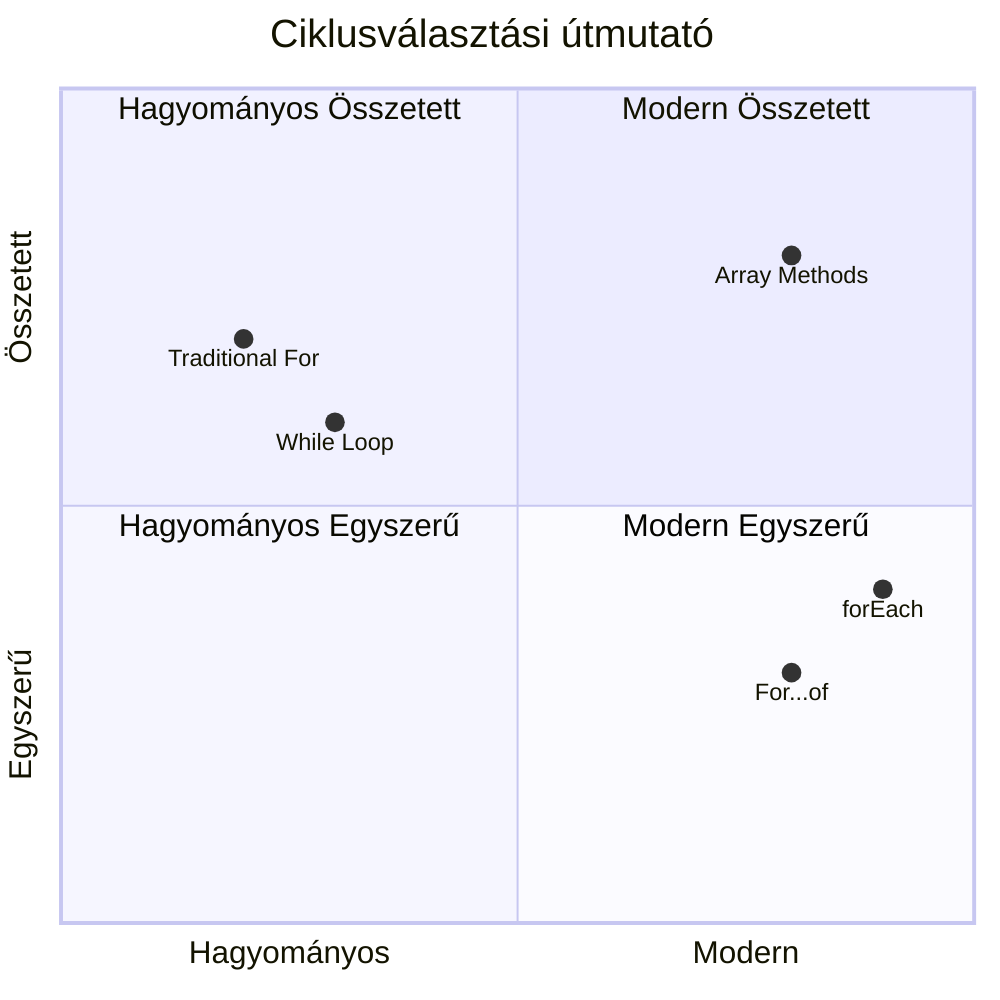
> **Modern trend**: Az ES6+ szintaxisok, mint a `for...of` és a `forEach` egyre gyakrabban használtak, mert tisztábbak és kevesebb hibához vezetnek!

## Ciklusok és tömbök

A tömbök és ciklusok kombinációja hatékony adatfeldolgozást tesz lehetővé. Ez a páros az alapja sok programozási feladatnak, legyen szó listák megjelenítéséről vagy statisztikák számításáról.

**Hagyományos tömb feldolgozás:**

```javascript
const iceCreamFlavors = ["Chocolate", "Strawberry", "Vanilla", "Pistachio", "Rocky Road"];

// Klasszikus for ciklus megközelítés
for (let i = 0; i < iceCreamFlavors.length; i++) {
  console.log(`Flavor ${i + 1}: ${iceCreamFlavors[i]}`);
}

// Modern for...of megközelítés
for (const flavor of iceCreamFlavors) {
  console.log(`Available flavor: ${flavor}`);
}
```

**Értelmezzük a megközelítéseket:**
- **Használja** a tömb hosszát a ciklus határának meghatározására
- **Index alapján** éri el az elemeket hagyományos for ciklusokban
- **Közvetlenül** hozzáfér az elemekhez for...of ciklusban
- **Egyszer** dolgozza fel minden elemet

**Gyakorlati adatfeldolgozás példa:**

```javascript
const studentGrades = [85, 92, 78, 96, 88, 73, 89];
let total = 0;
let highestGrade = studentGrades[0];
let lowestGrade = studentGrades[0];

// Az összes értékelés feldolgozása egyetlen ciklussal
for (let i = 0; i < studentGrades.length; i++) {
  const grade = studentGrades[i];
  total += grade;
  
  if (grade > highestGrade) {
    highestGrade = grade;
  }
  
  if (grade < lowestGrade) {
    lowestGrade = grade;
  }
}

const average = total / studentGrades.length;
console.log(`Average: ${average.toFixed(1)}`);
console.log(`Highest: ${highestGrade}`);
console.log(`Lowest: ${lowestGrade}`);
```

**Így működik ez a kód:**
- **Inicializál** változókat összeg és extrém értékek követésére
- **Feldolgozza** az összes jegyet egy hatékony ciklusban
- **Összegzi** az értékeket az átlag kiszámításához
- **Nyomon követi** a legmagasabb és legalacsonyabb értékeket
- **Kiszámolja** a végső statisztikákat a ciklus után

✅ Kísérletezz saját tömböddel a böngésződ konzoljában!

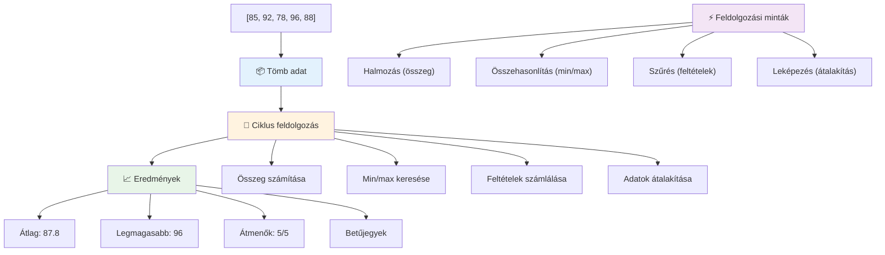
---

## GitHub Copilot Ügynök kihívás 🚀

Használd az Ügynök módot a következő kihívás teljesítéséhez:

**Leírás:** Készíts egy átfogó adatfeldolgozó függvényt, amely tömböket és ciklusokat egyesít, hogy elemezzen egy adathalmazt és jelentős betekintéseket generáljon.

**Feladat:** Hozz létre egy `analyzeGrades` nevű függvényt, amely tömböt fogad diákjegyek objektumaival (mindegyik neve és pontszáma), és visszaad egy objektumot statisztikákkal, beleértve a legmagasabb és legalacsonyabb pontszámot, az átlagot, a vizsgát teljesítők számát (pontszám >= 70), valamint az átlagnál jobb eredményt elért diákok neveit tömb formájában. Használj minimum két különböző ciklust a megoldásban.

További információ az [ügynök módról](https://code.visualstudio.com/blogs/2025/02/24/introducing-copilot-agent-mode) itt.

## 🚀 Kihívás
A JavaScript több modern tömbmetódust kínál, amelyek egyes feladatok esetén kiválthatják a hagyományos ciklusokat. Fedezd fel a [forEach](https://developer.mozilla.org/docs/Web/JavaScript/Reference/Global_Objects/Array/forEach), [for-of](https://developer.mozilla.org/docs/Web/JavaScript/Reference/Statements/for...of), [map](https://developer.mozilla.org/docs/Web/JavaScript/Reference/Global_Objects/Array/map), [filter](https://developer.mozilla.org/docs/Web/JavaScript/Reference/Global_Objects/Array/filter) és [reduce](https://developer.mozilla.org/docs/Web/JavaScript/Reference/Global_Objects/Array/reduce) metódusokat.

**A te kihívásod:** Refaktoráld a diákok jegyeinek példáját legalább három különböző tömbmetódussal. Figyeld meg, milyen sokkal tisztább és olvashatóbb lesz a kód a modern JavaScript szintaxissal.

## Előadás utáni kvíz
[Előadás utáni kvíz](https://ff-quizzes.netlify.app/web/quiz/14)


## Áttekintés & Önálló tanulás

A JavaScript tömbjeihez számos nagyon hasznos adatmanipulációs metódus kapcsolódik. [Ismerkedj meg ezekkel a metódusokkal](https://developer.mozilla.org/docs/Web/JavaScript/Reference/Global_Objects/Array), és próbálj ki néhányat (például a push, pop, slice és splice) egy általad létrehozott tömbön.

## Feladat

[Tömb bejárása ciklussal](assignment.md)

---

## 📊 **A tömbök és ciklusok eszköztárának összefoglalója**

```mermaid
graph TD
    A["🎯 Tömbök és ciklusok mesterfokon"] --> B["📦 Tömbök alapjai"]
    A --> C["🔄 Ciklustípusok"]
    A --> D["🔗 Adatfeldolgozás"]
    A --> E["🎨 Modern technikák"]
    
    B --> B1["Létrehozás: [ ]"]
    B --> B2["Indexelés: arr[0]"]
    B --> B3["Metódusok: push, pop"]
    B --> B4["Tulajdonságok: length"]
    
    C --> C1["For: ismert ismétlések"]
    C --> C2["While: feltétel alapú"]
    C --> C3["For...of: közvetlen hozzáférés"]
    C --> C4["forEach: funkcionális"]
    
    D --> D1["Statisztika számítás"]
    D --> D2["Adatátalakítás"]
    D --> D3["Szűrés és keresés"]
    D --> D4["Valós idejű feldolgozás"]
    
    E --> E1["Nyílfüggvények"]
    E --> E2["Metódus láncolás"]
    E --> E3["Destrukturálás"]
    E --> E4["Sablonszövegek"]
    
    F["💡 Fő előnyök"] --> F1["Hatékony adatkezelés"]
    F --> F2["Csökkentett kódsokszorosítás"]
    F --> F3["Skálázható megoldások"]
    F --> F4["Tiszta szintaxis"]
    
    style A fill:#e3f2fd
    style B fill:#e8f5e8
    style C fill:#fff3e0
    style D fill:#f3e5f5
    style E fill:#e0f2f1
    style F fill:#fce4ec
```
---

## 🚀 A tömbök és ciklusok elsajátításának idővonala

### ⚡ **Mit tudsz tenni a következő 5 percben**
- [ ] Készíts egy kedvenc filmjeidből álló tömböt, és érj el konkrét elemeket
- [ ] Írj egy for ciklust, amely 1-től 10-ig számol
- [ ] Próbáld ki a leckéből származó modern tömbmetódus kihívást
- [ ] Gyakorold a tömbindexelést a böngésződ konzoljában

### 🎯 **Mit érhetsz el ezen az órán**
- [ ] Teljesítsd az előadás utáni kvízt, és nézd át az esetleges nehéz témákat
- [ ] Építsd meg a GitHub Copilot kihívásából származó átfogó jegy-elemzőt
- [ ] Készíts egy egyszerű bevásárlókosarat, amely hozzáad és eltávolít tételeket
- [ ] Gyakorold a különböző ciklustípusok közötti átalakítást
- [ ] Kísérletezz olyan tömbmetódusokkal, mint a `push`, `pop`, `slice` és `splice`

### 📅 **Az egész hetes adatfeldolgozási utad**
- [ ] Teljesítsd a "Tömb bejárása ciklussal" feladatot kreatív továbbfejlesztésekkel
- [ ] Építs egy teendőlista alkalmazást tömbök és ciklusok segítségével
- [ ] Készíts egy egyszerű statisztika kalkulátort numerikus adatokhoz
- [ ] Gyakorold a [MDN tömbmetódusokat](https://developer.mozilla.org/docs/Web/JavaScript/Reference/Global_Objects/Array)
- [ ] Építs fotógaléria vagy zenei lejátszási lista felületet
- [ ] Fedezd fel a funkcionális programozást a `map`, `filter` és `reduce` segítségével

### 🌟 **A hónapos átalakulásod**
- [ ] Sajátítsd el a haladó tömbműveleteket és a teljesítményoptimalizálást
- [ ] Építs meg egy teljes adatvizualizációs irányítópultot
- [ ] Vegyél részt nyílt forráskódú projektekben, amelyek adatfeldolgozással foglalkoznak
- [ ] Taníts meg másokat a tömbökre és ciklusokra gyakorlati példákon keresztül
- [ ] Készíts személyes könyvtárat újrahasznosítható adatfeldolgozó függvényekből
- [ ] Fedezd fel az algoritmusokat és adatstruktúrákat, amelyek tömb alapúak

### 🏆 **A végső adatfeldolgozás bajnoki ellenőrzése**

**Ünnepeld meg a tömbök és ciklusok elsajátítását:**
- Melyik a leghasznosabb tömbművelet, amit a valós alkalmazásokhoz tanultál?
- Melyik ciklustípus érzed a legtermészetesebbnek, és miért?
- Hogyan változtatta meg a tömbök és ciklusok ismerete az adatkezeléshez való hozzáállásodat?
- Milyen összetett adatfeldolgozási feladatot szeretnél legközelebb megoldani?

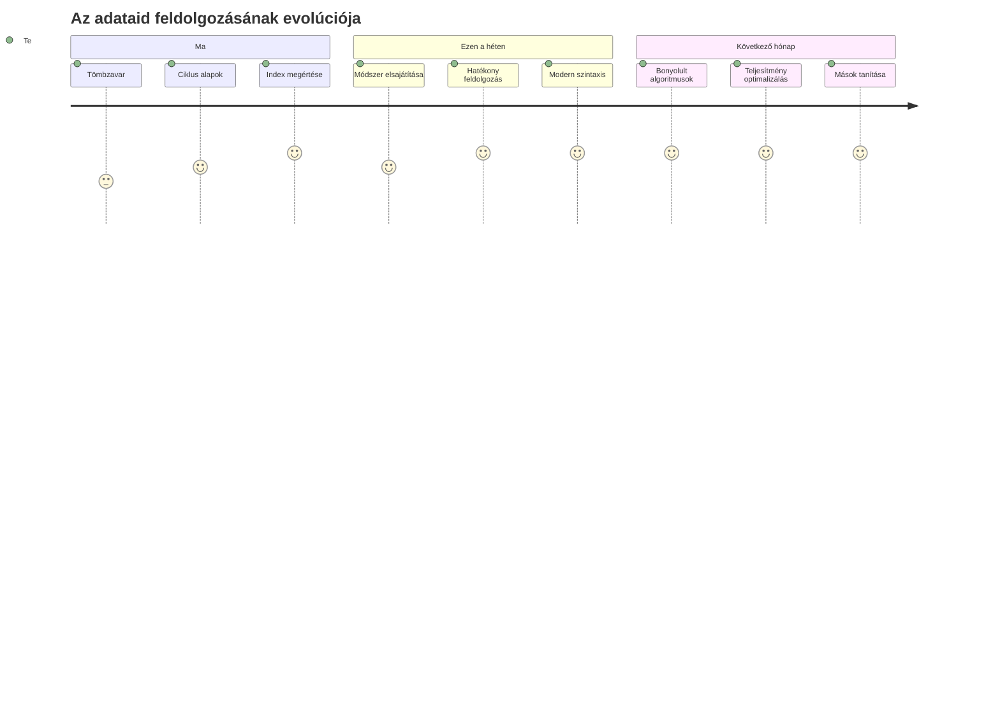
> 📦 **Megnyitottad az adatszervezés és -feldolgozás erejét!** A tömbök és ciklusok majdnem minden általad valaha építendő alkalmazás alapját képezik. Az egyszerű listáktól a bonyolult adatelemzésig most már megvannak az eszközeid az adatok hatékony és elegáns kezeléséhez. Minden dinamikus weboldal, mobilalkalmazás és adatvezérelt alkalmazás ezekre az alapfogalmakra támaszkodik. Üdvözlünk a skálázható adatfeldolgozás világában! 🎉

---

<!-- CO-OP TRANSLATOR DISCLAIMER START -->
**Jogi nyilatkozat**:  
Ez a dokumentum az AI fordítási szolgáltatás, a [Co-op Translator](https://github.com/Azure/co-op-translator) használatával készült. Bár a pontosságra törekszünk, kérjük, vegye figyelembe, hogy az automatikus fordítások tartalmazhatnak hibákat vagy pontatlanságokat. Az eredeti dokumentum anyanyelvén tekintendő hivatalos forrásnak. Fontos információk esetén professzionális emberi fordítást javaslunk. Nem vállalunk felelősséget a fordítás használatából eredő félreértésekért vagy félreértelmezésekért.
<!-- CO-OP TRANSLATOR DISCLAIMER END -->