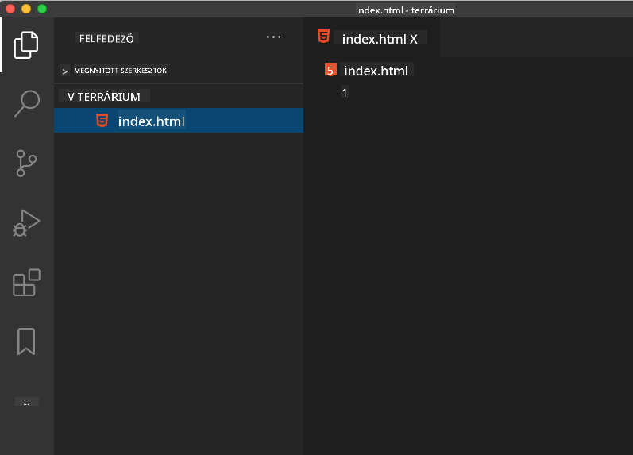

<!--
CO_OP_TRANSLATOR_METADATA:
{
  "original_hash": "20c72cf2e5b0050d38ca3cb14a75a9df",
  "translation_date": "2025-10-24T20:16:30+00:00",
  "source_file": "3-terrarium/1-intro-to-html/README.md",
  "language_code": "hu"
}
-->
# Terrárium Projekt 1. rész: Bevezetés a HTML-be


> Sketchnote készítette: [Tomomi Imura](https://twitter.com/girlie_mac)

A HTML, vagy HyperText Markup Language, minden weboldal alapja, amit valaha meglátogattál. Gondolj a HTML-re úgy, mint a weboldalak vázára – meghatározza, hogy hova kerül a tartalom, hogyan van szervezve, és mit képvisel minden egyes elem. Míg a CSS később "felöltözteti" a HTML-t színekkel és elrendezésekkel, a JavaScript pedig interaktivitást ad hozzá, a HTML biztosítja azt az alapvető struktúrát, amely lehetővé teszi a többi funkciót.

Ebben a leckében létrehozod egy virtuális terrárium felület HTML struktúráját. Ez a gyakorlati projekt megtanítja neked az alapvető HTML fogalmakat, miközben valami vizuálisan vonzót építesz. Megtanulod, hogyan szervezd a tartalmat szemantikus elemekkel, hogyan dolgozz képekkel, és hogyan hozd létre egy interaktív webalkalmazás alapját.

A lecke végére lesz egy működő HTML oldalad, amely növényi képeket jelenít meg rendezett oszlopokban, készen arra, hogy a következő leckében stílusokat adj hozzá. Ne aggódj, ha eleinte egyszerűnek tűnik – pontosan ez a HTML feladata, mielőtt a CSS hozzáadja a vizuális csiszolást.

## Előzetes kvíz

[Előzetes kvíz](https://ff-quizzes.netlify.app/web/quiz/15)

> 📺 **Nézd meg és tanulj**: Nézd meg ezt a hasznos videóáttekintést
> 
> [](https://www.youtube.com/watch?v=1TvxJKBzhyQ)

## Projekt beállítása

Mielőtt belevágunk a HTML kódba, állítsuk be a megfelelő munkaterületet a terrárium projekthez. Az elejétől kezdve egy rendezett fájlszerkezet létrehozása kulcsfontosságú szokás, amely végigkísér majd a webfejlesztési utadon.

### Feladat: Hozd létre a projekt struktúráját

Hozz létre egy dedikált mappát a terrárium projekthez, és adj hozzá egy első HTML fájlt. Két megközelítést használhatsz:

**1. lehetőség: Visual Studio Code használata**
1. Nyisd meg a Visual Studio Code-ot
2. Kattints a "File" → "Open Folder" menüpontra, vagy használd a `Ctrl+K, Ctrl+O` (Windows/Linux) vagy `Cmd+K, Cmd+O` (Mac) billentyűkombinációt
3. Hozz létre egy új mappát `terrarium` néven, és válaszd ki
4. Az Explorer panelen kattints az "Új fájl" ikonra
5. Nevezd el a fájlt `index.html`-nek



**2. lehetőség: Terminál parancsok használata**
```bash
mkdir terrarium
cd terrarium
touch index.html
code index.html
```

**Ezeket a parancsokat hajtják végre:**
- **Létrehoz** egy új `terrarium` nevű könyvtárat a projekthez
- **Belép** a terrárium könyvtárba
- **Létrehoz** egy üres `index.html` fájlt
- **Megnyitja** a fájlt szerkesztésre a Visual Studio Code-ban

> 💡 **Profi tipp**: Az `index.html` fájlnév különleges a webfejlesztésben. Amikor valaki meglátogat egy weboldalt, a böngészők automatikusan az `index.html` fájlt keresik, hogy azt jelenítsék meg alapértelmezett oldalként. Ez azt jelenti, hogy egy olyan URL, mint például `https://mysite.com/projects/`, automatikusan az `index.html` fájlt fogja megjeleníteni a `projects` mappából anélkül, hogy a fájlnevet meg kellene adni az URL-ben.

## A HTML dokumentum struktúrájának megértése

Minden HTML dokumentum egy specifikus struktúrát követ, amelyet a böngészőknek meg kell érteniük és helyesen megjeleníteniük. Gondolj erre a struktúrára úgy, mint egy hivatalos levélre – vannak kötelező elemei egy adott sorrendben, amelyek segítenek a címzettnek (jelen esetben a böngészőnek) megfelelően feldolgozni a tartalmat.

Kezdjük azzal, hogy hozzáadjuk az alapvető elemeket, amelyekre minden HTML dokumentumnak szüksége van.

### A DOCTYPE deklaráció és a gyökérelem

Minden HTML fájl első két sora a dokumentum "bemutatkozása" a böngésző számára:

```html
<!DOCTYPE html>
<html></html>
```

**Mit csinál ez a kód:**
- **Deklarálja** a dokumentum típusát HTML5-ként a `<!DOCTYPE html>` segítségével
- **Létrehozza** a gyökér `<html>` elemet, amely tartalmazza az összes oldal tartalmát
- **Megállapítja** a modern webes szabványokat a megfelelő böngészőmegjelenítéshez
- **Biztosítja** az egységes megjelenítést különböző böngészők és eszközök között

> 💡 **VS Code tipp**: Vigye az egeret bármelyik HTML címkére a VS Code-ban, hogy hasznos információkat lásson az MDN Web Docs-tól, beleértve a használati példákat és a böngészőkompatibilitási részleteket.

> 📚 **További információ**: A DOCTYPE deklaráció megakadályozza, hogy a böngészők "quirks mode"-ba lépjenek, amelyet nagyon régi weboldalak támogatására használtak. A modern webfejlesztés az egyszerű `<!DOCTYPE html>` deklarációt használja a [szabványos megjelenítés](https://developer.mozilla.org/docs/Web/HTML/Quirks_Mode_and_Standards_Mode) biztosítására.

## Alapvető dokumentum metaadatok hozzáadása

A HTML dokumentum `<head>` szekciója tartalmazza azokat a kulcsfontosságú információkat, amelyekre a böngészőknek és a keresőmotoroknak szükségük van, de amelyeket a látogatók közvetlenül nem látnak az oldalon. Gondolj rá úgy, mint a "színfalak mögötti" információra, amely segít az oldalad megfelelő működésében és megjelenésében különböző eszközökön és platformokon.

Ez a metaadat megmondja a böngészőknek, hogyan jelenítsék meg az oldaladat, milyen karakterkódolást használjanak, és hogyan kezeljék a különböző képernyőméreteket – mindez elengedhetetlen a professzionális, hozzáférhető weboldalak létrehozásához.

### Feladat: Add hozzá a dokumentum fejét

Illeszd be ezt a `<head>` szekciót a nyitó és záró `<html>` címkék közé:

```html
<head>
	<title>Welcome to my Virtual Terrarium</title>
	<meta charset="utf-8" />
	<meta http-equiv="X-UA-Compatible" content="IE=edge" />
	<meta name="viewport" content="width=device-width, initial-scale=1" />
</head>
```

**Mit ér el minden elem:**
- **Beállítja** az oldal címét, amely megjelenik a böngésző lapjain és a keresési eredményekben
- **Megadja** a UTF-8 karakterkódolást a megfelelő szövegmegjelenítéshez világszerte
- **Biztosítja** a kompatibilitást a modern Internet Explorer verziókkal
- **Konfigurálja** a reszponzív dizájnt az eszköz szélességéhez igazított nézetablak beállításával
- **Szabályozza** a kezdeti nagyítási szintet, hogy a tartalom természetes méretben jelenjen meg

> 🤔 **Gondolkodj el ezen**: Mi történne, ha egy ilyen nézetablak meta címkét állítanál be: `<meta name="viewport" content="width=600">`? Ez arra kényszerítené az oldalt, hogy mindig 600 pixel széles legyen, megszakítva a reszponzív dizájnt! Tudj meg többet a [megfelelő nézetablak konfigurációról](https://developer.mozilla.org/docs/Web/HTML/Viewport_meta_tag).

## A dokumentum törzsének felépítése

A `<body>` elem tartalmazza a weboldalad minden látható tartalmát – mindent, amit a felhasználók látnak és amivel interakcióba lépnek. Míg a `<head>` szekció utasításokat adott a böngészőnek, a `<body>` szekció tartalmazza a tényleges tartalmat: szövegeket, képeket, gombokat és más elemeket, amelyek létrehozzák a felhasználói felületet.

Adjunk hozzá a törzs struktúráját, és értsük meg, hogyan működnek együtt a HTML címkék, hogy értelmes tartalmat hozzanak létre.

### A HTML címkék struktúrájának megértése

A HTML páros címkéket használ az elemek meghatározására. A legtöbb címkének van egy nyitó címkéje, mint például `<p>`, és egy záró címkéje, mint például `</p>`, a tartalom pedig közéjük kerül: `<p>Hello, világ!</p>`. Ez létrehoz egy bekezdés elemet, amely tartalmazza a "Hello, világ!" szöveget.

### Feladat: Add hozzá a törzs elemet

Frissítsd a HTML fájlodat, hogy tartalmazza a `<body>` elemet:

```html
<!DOCTYPE html>
<html>
	<head>
		<title>Welcome to my Virtual Terrarium</title>
		<meta charset="utf-8" />
		<meta http-equiv="X-UA-Compatible" content="IE=edge" />
		<meta name="viewport" content="width=device-width, initial-scale=1" />
	</head>
	<body></body>
</html>
```

**Mit biztosít ez a teljes struktúra:**
- **Létrehozza** az alapvető HTML5 dokumentum keretrendszert
- **Tartalmazza** az alapvető metaadatokat a megfelelő böngészőmegjelenítéshez
- **Létrehoz egy üres törzset**, amely készen áll a látható tartalomhoz
- **Követi** a modern webfejlesztési legjobb gyakorlatokat

Most készen állsz arra, hogy hozzáadd a terrárium látható elemeit. `<div>` elemeket fogunk használni konténerekként a tartalom különböző szekcióinak szervezéséhez, és `` elemeket a növényi képek megjelenítéséhez.

### Képek és elrendezési konténerek használata

A képek különlegesek a HTML-ben, mert "önzáró" címkéket használnak. Az olyan elemekkel ellentétben, mint a `<p></p>`, amelyek tartalmat ölelnek körül, az `` címke minden szükséges információt tartalmaz a címkén belül, például a `src` attribútumot a kép fájlútvonalához és az `alt` attribútumot a hozzáférhetőséghez.

Mielőtt képeket adnál hozzá a HTML-hez, megfelelően kell szervezned a projekt fájlokat, létrehozva egy képek mappát, és hozzáadva a növényi grafikákat.

**Először állítsd be a képeket:**
1. Hozz létre egy `images` nevű mappát a terrárium projekt mappájában
2. Töltsd le a növényi képeket a [megoldás mappából](../../../../3-terrarium/solution/images) (összesen 14 növényi kép)
3. Másold az összes növényi képet az új `images` mappába

### Feladat: Hozd létre a növényi megjelenítési elrendezést

Most add hozzá a növényi képeket két oszlopba rendezve a `<body></body>` címkék közé:

```html
<div id="page">
	<div id="left-container" class="container">
		<div class="plant-holder">
			
		</div>
		<div class="plant-holder">
			
		</div>
		<div class="plant-holder">
			
		</div>
		<div class="plant-holder">
			
		</div>
		<div class="plant-holder">
			
		</div>
		<div class="plant-holder">
			
		</div>
		<div class="plant-holder">
			
		</div>
	</div>
	<div id="right-container" class="container">
		<div class="plant-holder">
			
		</div>
		<div class="plant-holder">
			
		</div>
		<div class="plant-holder">
			
		</div>
		<div class="plant-holder">
			
		</div>
		<div class="plant-holder">
			
		</div>
		<div class="plant-holder">
			
		</div>
		<div class="plant-holder">
			
		</div>
	</div>
</div>
```

**Lépésről lépésre, mit csinál ez a kód:**
- **Létrehoz** egy főoldali konténert `id="page"` az összes tartalom számára
- **Létrehoz** két oszlop konténert: `left-container` és `right-container`
- **Rendez** 7 növényt a bal oszlopba és 7 növényt a jobb oszlopba
- **Körülvesz** minden növényi képet egy `plant-holder` divvel az egyedi pozícionáláshoz
- **Alkalmaz** egységes osztályneveket a CSS stílusozáshoz a következő leckében
- **Hozzárendel** egyedi azonosítókat minden növényi képhez a későbbi JavaScript interakcióhoz
- **Tartalmazza** a megfelelő fájlútvonalakat, amelyek az images mappára mutatnak

> 🤔 **Gondolj bele**: Figyeld meg, hogy jelenleg minden képnek ugyanaz az alt szövege van: "plant". Ez nem ideális a hozzáférhetőség szempontjából. A képernyőolvasót használók 14-szer hallanák, hogy "plant", anélkül hogy tudnák, melyik konkrét növényt mutatja az egyes képek. Tudsz jobb, leíróbb alt szöveget kitalálni minden képhez?

> 📝 **HTML elem típusok**: A `<div>` elemek "blokkszintűek" és teljes szélességet foglalnak el, míg a `<span>` elemek "inline" és csak a szükséges szélességet foglalják el. Mi történne, ha az összes `<div>` címkét `<span>` címkékre cserélnéd?

Ezzel a jelöléssel a növények megjelennek a képernyőn, bár még nem néznek ki kifinomultan – erre való a CSS a következő leckében! Egyelőre van egy szilárd HTML alapod, amely megfelelően szervezi a tartalmat és követi a hozzáférhetőségi legjobb gyakorlatokat.

## Szemantikus HTML használata a hozzáférhetőség érdekében

A szemantikus HTML azt jelenti, hogy az elemeket azok jelentése és célja alapján választjuk ki, nem csak a megjelenésük alapján. Ha szemantikus jelölést használsz, akkor a tartalom szerkezetét és jelentését közvetíted a böngészőknek, keresőmotoroknak és a képernyőolvasóknak.

Ez a megközelítés hozzáférhetőbbé teszi a weboldalakat a fogyatékkal élő felhasználók számára, és segít a keresőmotoroknak jobban megérteni a tartalmat. Ez a modern webfejlesztés alapelve, amely jobb élményeket teremt mindenki számára.

### Szemantikus oldal cím hozzáadása

Adj hozzá egy megfelelő címsort a terrárium oldaladhoz. Illeszd be ezt a sort közvetlenül a nyitó `<body>` címke után:

```html
<h1>My Terrarium</h1>
```

**Miért fontos a szemantikus jelölés:**
- **Segíti** a képernyőolvasókat az oldal szerkezetének navigálásában és megértésében
- **Javítja** a keresőmotor optimalizálást (SEO) azáltal, hogy tisztázza a tartalom hierarchiáját
- **Növeli** a hozzáférhetőséget a látássérült vagy kognitív különbségekkel élő felhasználók számára
- **Jobb felhasználói élményt teremt** minden eszközön és platformon
- **Követi** a webes szabványokat és a professzionális fejlesztési legjobb gyakorlatokat

**Példák szemantikus vs. nem szemantikus választásokra:**

| Cél | ✅ Szemantikus választás | ❌ Nem szemantikus választás |
|-----|-------------------------|----------------------------|
| Főcím | `<h1>Cím</h1>` | `<div class="big-text">Cím</div>` |
| Navigáció | `<nav><ul><li></li></ul></nav>` | `<div class="menu"><div></div></div>` |
| Gomb | `<button>Kattints ide</button>` | `<span onclick="...">Kattints ide</span>` |
| Cikk tartalom | `<article><p></p></article>` | `<div class="content"><div></div></div>` |

> 🎥 **Nézd meg működés közben**: Nézd meg, [hogyan lépnek interakcióba a képernyőolvasók a weboldalakkal](https://www.youtube.com/watch?v=OUDV1gqs9GA), hogy megértsd, miért fontos a szemantikus jelölés. Figyeld meg, hogyan segíti a megfelelő HTML struktúra a felhasználókat az oldal hatékony navigálásában.

##
**Prompt:** Készíts egy szemantikus HTML szekciót, amely tartalmaz egy fő címet "Növényápolási útmutató", három alfejezetet "Öntözés", "Fényigények" és "Talajápolás" címmel, mindegyikben egy bekezdésnyi információval a növényápolásról. Használj megfelelő szemantikus HTML tageket, mint például `<section>`, `<h2>`, `<h3>`, és `<p>` a tartalom megfelelő strukturálásához.

Tudj meg többet az [agent mode](https://code.visualstudio.com/blogs/2025/02/24/introducing-copilot-agent-mode) funkcióról itt.

## HTML Történeti Kihívás Felfedezése

**A web fejlődésének megismerése**

Az HTML jelentős fejlődésen ment keresztül, mióta Tim Berners-Lee 1990-ben megalkotta az első webböngészőt a CERN-nél. Néhány régebbi tag, mint például a `<marquee>`, ma már elavultnak számít, mivel nem felel meg a modern akadálymentességi szabványoknak és a reszponzív tervezési elveknek.

**Próbáld ki ezt a kísérletet:**
1. Ideiglenesen csomagold be az `<h1>` címedet egy `<marquee>` tagbe: `<marquee><h1>Az én terráriumom</h1></marquee>`
2. Nyisd meg az oldaladat egy böngészőben, és figyeld meg a görgetési hatást
3. Gondold át, miért lett ez a tag elavult (tipp: gondolj a felhasználói élményre és az akadálymentességre)
4. Távolítsd el a `<marquee>` taget, és térj vissza a szemantikus jelöléshez

**Reflexiós kérdések:**
- Hogyan befolyásolhatja egy görgető cím a látássérült vagy mozgásérzékeny felhasználókat?
- Milyen modern CSS technikák érhetnek el hasonló vizuális hatásokat akadálymentesebben?
- Miért fontos a jelenlegi webes szabványok használata az elavult elemek helyett?

Tudj meg többet az [elavult és megszüntetett HTML elemekről](https://developer.mozilla.org/docs/Web/HTML/Element#Obsolete_and_deprecated_elements), hogy megértsd, hogyan fejlődnek a webes szabványok a felhasználói élmény javítása érdekében.


## Előadás utáni kvíz

[Előadás utáni kvíz](https://ff-quizzes.netlify.app/web/quiz/16)

## Áttekintés és önálló tanulás

**Mélyítsd el HTML tudásodat**

Az HTML több mint 30 éve a web alapja, egy egyszerű dokumentumjelölő nyelvből egy interaktív alkalmazások építésére szolgáló kifinomult platformmá fejlődött. Ennek az evolúciónak a megértése segít jobban értékelni a modern webes szabványokat és jobb fejlesztési döntéseket hozni.

**Ajánlott tanulási útvonalak:**

1. **HTML története és fejlődése**
   - Kutass a HTML 1.0-tól HTML5-ig terjedő idővonalról
   - Fedezd fel, miért váltak bizonyos tagek elavulttá (akadálymentesség, mobilbarátság, karbantarthatóság)
   - Vizsgáld meg az új HTML funkciókat és javaslatokat

2. **Szemantikus HTML mélyreható tanulmányozása**
   - Tanulmányozd a teljes [HTML5 szemantikus elemek listáját](https://developer.mozilla.org/docs/Web/HTML/Element)
   - Gyakorold, mikor használj `<article>`, `<section>`, `<aside>` és `<main>` tageket
   - Ismerd meg az ARIA attribútumokat a fokozott akadálymentesség érdekében

3. **Modern webfejlesztés**
   - Fedezd fel a [reszponzív weboldalak építését](https://docs.microsoft.com/learn/modules/build-simple-website/?WT.mc_id=academic-77807-sagibbon) a Microsoft Learn-en
   - Értsd meg, hogyan integrálódik az HTML a CSS-sel és a JavaScripttel
   - Tanulj a webes teljesítményről és SEO legjobb gyakorlatokról

**Reflexiós kérdések:**
- Mely elavult HTML tageket fedeztél fel, és miért távolították el őket?
- Milyen új HTML funkciókat javasolnak a jövőbeli verziókhoz?
- Hogyan járul hozzá a szemantikus HTML a webes akadálymentességhez és SEO-hoz?


## Feladat

[Gyakorold az HTML-t: Készíts egy blog makettet](assignment.md)

---

**Felelősség kizárása**:  
Ez a dokumentum az AI fordítási szolgáltatás [Co-op Translator](https://github.com/Azure/co-op-translator) segítségével lett lefordítva. Bár törekszünk a pontosságra, kérjük, vegye figyelembe, hogy az automatikus fordítások hibákat vagy pontatlanságokat tartalmazhatnak. Az eredeti dokumentum az eredeti nyelvén tekintendő hiteles forrásnak. Fontos információk esetén javasolt professzionális emberi fordítást igénybe venni. Nem vállalunk felelősséget semmilyen félreértésért vagy téves értelmezésért, amely a fordítás használatából eredhet.