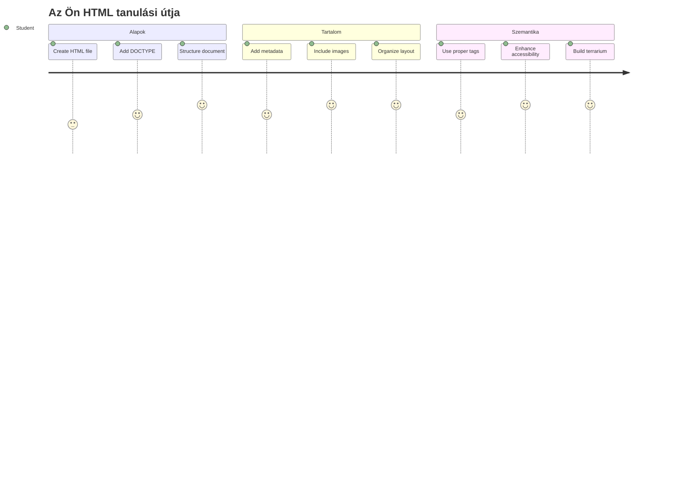
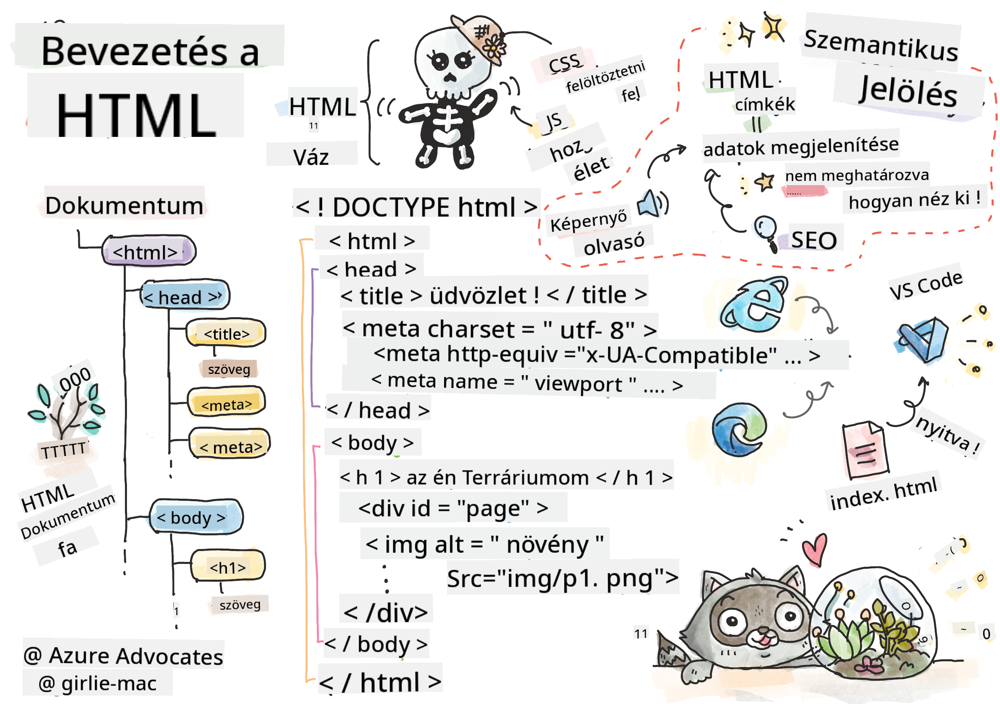
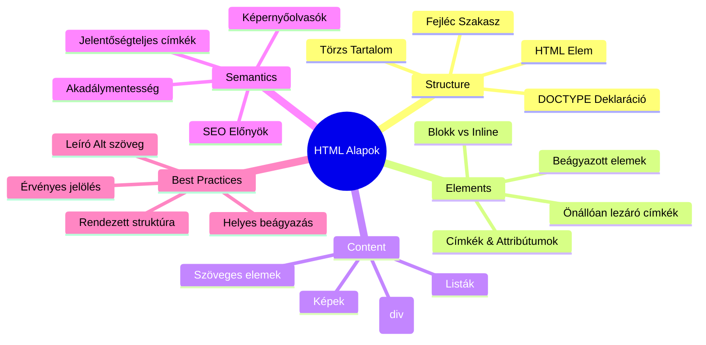
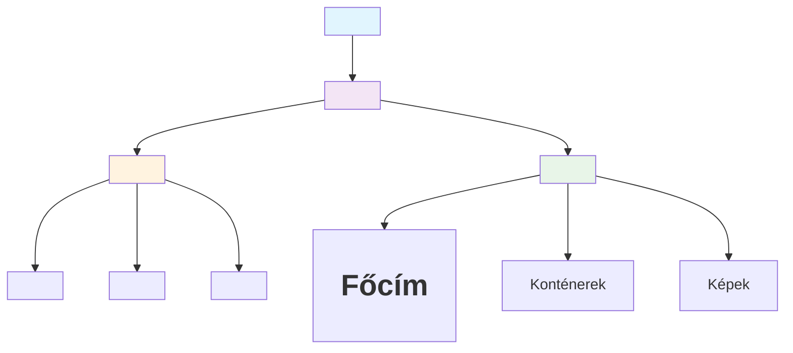
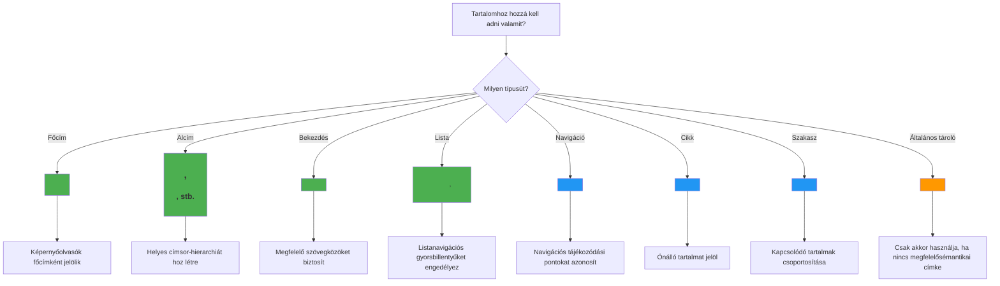
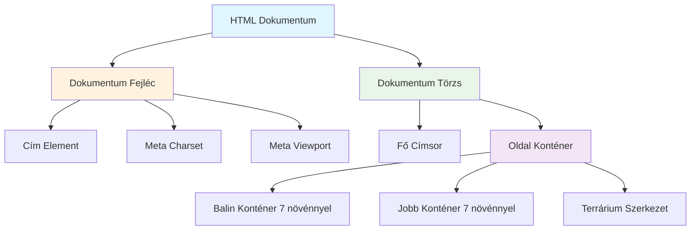
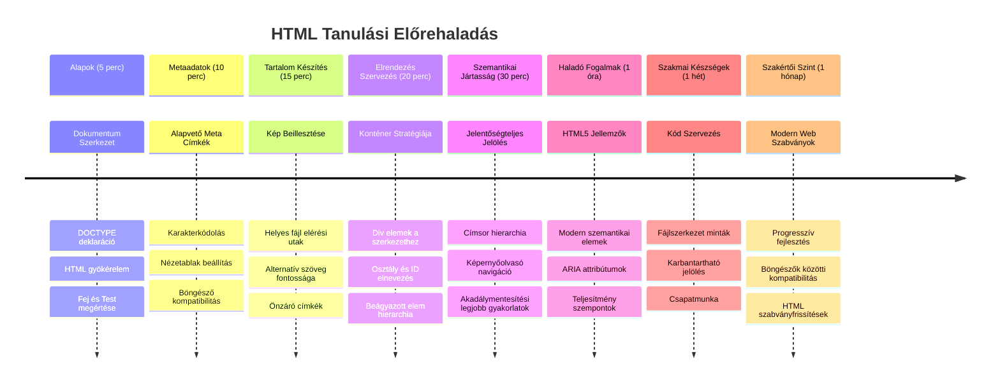

<!--
CO_OP_TRANSLATOR_METADATA:
{
  "original_hash": "3fcfa99c4897e051b558b5eaf1e8cc74",
  "translation_date": "2026-01-07T03:05:00+00:00",
  "source_file": "3-terrarium/1-intro-to-html/README.md",
  "language_code": "hu"
}
-->
# Terrárium Projekt 1. rész: Bevezetés az HTML-be



> Sketchnote készítette [Tomomi Imura](https://twitter.com/girlie_mac)

Az HTML, vagyis a HyperText Markup Language, minden általad valaha látogatott weboldal alapja. Gondolj az HTML-re úgy, mint a weboldalak vázára – ez határozza meg, hogy hová kerül a tartalom, hogyan van szervezve, és mit jelképez minden egyes elem. Míg a CSS később „felöltözteti” az HTML-t színekkel és elrendezéssel, és a JavaScript életre kelti interaktivitással, az HTML biztosítja azt az alapvető szerkezetet, amely minden mást lehetővé tesz.

Ebben a leckében elkészíted egy virtuális terrárium felületének HTML szerkezetét. Ez a gyakorlati projekt megtanítja az alapvető HTML fogalmakat, miközben valami vizuálisan vonzó dolgot építesz. Megtanulod, hogyan szervezz tartalmat szemantikus elemek segítségével, hogyan dolgozz képekkel, és hogyan hozd létre az interaktív webalkalmazás alapját.

A lecke végére rendelkezel majd egy működő HTML oldallal, amely növényképeket jelenít meg rendezett oszlopokban, készen a következő leckében történő stílusozásra. Ne aggódj, ha elsőre egyszerűnek tűnik – pontosan ilyennek kell lennie az HTML-nek, mielőtt a CSS ráteszi a vizuális fényét.


## Előadás előtti kvíz

[Előadás előtti kvíz](https://ff-quizzes.netlify.app/web/quiz/15)

> 📺 **Nézd meg és tanulj**: Nézd meg ezt a hasznos videós összefoglalót
> 
> [](https://www.youtube.com/watch?v=1TvxJKBzhyQ)

## A projekt beállítása

Mielőtt belevágnánk az HTML kódba, állítsuk be a megfelelő munkakörnyezetet a terrárium projektedhez. Egy rendezett fájlszerkezet létrehozása már az elejétől fogva egy fontos szokás, amely jól fog szolgálni a webfejlesztési utadon.

### Feladat: Készítsd el a projekt szerkezetét

Létrehozol egy külön mappát a terrárium projekthez, és hozzáadod az első HTML fájlodat. Két megközelítést használhatsz:

**1. lehetőség: Visual Studio Code használata**
1. Nyisd meg a Visual Studio Code-ot
2. Kattints a „Fájl” → „Mappa megnyitása” vagy használd a `Ctrl+K, Ctrl+O` (Windows/Linux) vagy `Cmd+K, Cmd+O` (Mac) billentyűkombinációt
3. Hozz létre egy új mappát `terrarium` néven, és válaszd ki
4. Az Explorer panelen kattints az „Új fájl” ikonra
5. Nevezd el a fájlt `index.html`-nek


**2. lehetőség: Parancssoros parancsok használata**
```bash
mkdir terrarium
cd terrarium
touch index.html
code index.html
```

**Ezek a parancsok a következőket végzik el:**
- **Létrehoz** egy új könyvtárat `terrarium` néven a projekthez
- **Belép** a terrarium könyvtárba
- **Létrehoz** egy üres `index.html` fájlt
- **Megnyitja** a fájlt szerkesztésre a Visual Studio Code-ban

> 💡 **Pro tipp**: Az `index.html` fájlnév különleges a webfejlesztésben. Amikor valaki meglátogat egy weboldalt, a böngészők automatikusan keresik az `index.html` fájlt, mint az alapértelmezett megjelenítendő oldalt. Ez azt jelenti, hogy egy olyan URL, mint `https://mysite.com/projects/`, automatikusan az `index.html` fájlt szolgálja ki a `projects` mappából anélkül, hogy a fájlnevet meg kellene adni az URL-ben.

## Az HTML dokumentum szerkezetének megértése

Minden HTML dokumentum egy meghatározott szerkezetet követ, amelyet a böngészőknek érteniük kell a helyes megjelenítés érdekében. Gondolj erre a szerkezetre úgy, mint egy hivatalos levélre – vannak előírt elemek meghatározott sorrendben, amelyek segítik a címzettet (jelen esetben a böngészőt) a tartalom helyes feldolgozásában.


Kezdjük az alapvető alapokkal, amelyek minden HTML dokumentumnak szükségesek.

### A DOCTYPE deklaráció és a gyökérelem

Egy HTML fájl első két sora a dokumentum „bevezetője” a böngésző számára:

```html
<!DOCTYPE html>
<html></html>
```

**Mit is csinál ez a kód?**
- **Deklarálja** a dokumentum típusát HTML5-ként a `<!DOCTYPE html>` használatával
- **Létrehozza** a gyökér `<html>` elemet, amely tartalmazza az összes oldaltartalmat
- **Megteremti** a modern webes sztenderdeket a helyes böngészői megjelenítéshez
- **Biztosítja** a konzisztens megjelenést különböző böngészőkben és eszközökön

> 💡 **VS Code tipp**: Ha az egérrel fölé viszed az egymelyik HTML címkének a VS Code-ban, akkor hasznos információkat láthatsz az MDN Web Docs-ból, köztük használati példákat és böngésző kompatibilitási adatokat.

> 📚 **Tudj meg többet**: A DOCTYPE deklaráció megakadályozza, hogy a böngészők „quirks mode”-ba lépjenek, amelyet nagyon régi weboldalak támogatására használtak. A modern webfejlesztés az egyszerű `<!DOCTYPE html>` deklarációt használja az [szabványkövető megjelenítés](https://developer.mozilla.org/docs/Web/HTML/Quirks_Mode_and_Standards_Mode) biztosítására.

### 🔄 **Pedagógiai ellenőrzőpont**
**Állj meg és gondold át**: Mielőtt folytatnád, győződj meg róla, hogy érted:
- ✅ Miért van szükség minden HTML dokumentumban a DOCTYPE deklarációra
- ✅ Mit tartalmaz a `<html>` gyökérelem
- ✅ Hogyan segíti ez a szerkezet a böngészők helyes oldaltervezését

**Gyors önellenőrzés**: Tudnád saját szavaiddal elmagyarázni, mit jelent a „szabványkövető megjelenítés”?

## Alapvető dokumentum metaadatok hozzáadása

Egy HTML dokumentum `<head>` része tartalmazza azokat a fontos információkat, amelyekre a böngészőknek és keresőmotoroknak szükségük van, de amelyeket a látogatók nem látnak közvetlenül az oldalon. Gondolj rá úgy, mint a „kulisszák mögötti” információra, amely segíti az oldalad helyes működését és megjelenését különféle eszközökön és platformokon.

Ez a metaadat megmondja a böngészőknek, hogyan jelenítsék meg az oldalt, milyen karakterkódolást használjanak, és hogyan kezeljék a különböző képernyőméreteket – ezek mind elengedhetetlenek a professzionális, elérhető weboldalak létrehozásához.

### Feladat: Add hozzá a dokumentum fejlécét

Helyezd be ezt a `<head>` részt az `<html>` nyitó és záró címkék közé:

```html
<head>
	<title>Welcome to my Virtual Terrarium</title>
	<meta charset="utf-8" />
	<meta http-equiv="X-UA-Compatible" content="IE=edge" />
	<meta name="viewport" content="width=device-width, initial-scale=1" />
</head>
```

**Mit csinálnak ezek az elemek?**
- **Beállítja** az oldal címét, amely a böngészőfülekben és keresési találatokban megjelenik
- **Megadja** az UTF-8 karakterkódolást a szövegek helyes megjelenítéséhez világszerte
- **Biztosítja** a kompatibilitást a modern Internet Explorer verziókkal
- **Konfigurálja** a reszponzív dizájnt úgy, hogy a nézetablak illeszkedjen az eszköz szélességéhez
- **Szabályozza** a kezdeti nagyítási szintet, hogy a tartalom természetes méretben jelenjen meg

> 🤔 **Gondolkodj el rajta**: Mi történne, ha ezt a viewport meta taget állítanád be: `<meta name="viewport" content="width=600">`? Ez arra kényszerítené az oldalt, hogy mindig 600 pixeles szélességű legyen, ami megtöri a reszponzív tervezést! Tudj meg többet a [helyes viewport beállításról](https://developer.mozilla.org/docs/Web/HTML/Viewport_meta_tag).

## A dokumentum törzsének felépítése

A `<body>` elem tartalmaz minden látható tartalmat az oldalon – mindent, amit a felhasználók meglátnak és amellyel interakcióba lépnek. Míg a `<head>` rész utasításokat adott a böngészőnek, a `<body>` rész tartalmazza a tényleges tartalmat: szövegeket, képeket, gombokat és egyéb elemeket, amelyek létrehozzák a felhasználói felületet.

Adjunk hozzá a törzs szerkezetét, és értsük meg, hogyan működnek az HTML címkék együtt a jelentésteli tartalmak létrehozásához.

### Az HTML címke szerkezet megértése

Az HTML párosított címkéket használ az elemek meghatározásához. A legtöbb címke egy nyitó címkéből áll, pl. `<p>`, és egy záró címkéből, pl. `</p>`, közrefogva a tartalmat: `<p>Hello, világ!</p>`. Ez egy bekezdés elemet hoz létre a "Hello, világ!" szöveggel.

### Feladat: Add hozzá a törzs elemet

Frissítsd az HTML fájlodat úgy, hogy tartalmazza a `<body>` elemet:

```html
<!DOCTYPE html>
<html>
	<head>
		<title>Welcome to my Virtual Terrarium</title>
		<meta charset="utf-8" />
		<meta http-equiv="X-UA-Compatible" content="IE=edge" />
		<meta name="viewport" content="width=device-width, initial-scale=1" />
	</head>
	<body></body>
</html>
```

**Ez a teljes szerkezet a következőt biztosítja:**
- **Létrehozza** az alapvető HTML5 dokumentum keretet
- **Tartalmazza** a szükséges metaadatokat a helyes böngészői megjelenítéshez
- **Létrehoz** egy üres törzset, készen a látható tartalomhoz
- **Követi** a modern webfejlesztési jó gyakorlatokat

Most készen állsz hozzáadni a terrárium látható elemeit. `<div>` elemeket fogunk konténerekként használni a tartalom különböző részeinek szervezéséhez, és `` elemeket a növényképek megjelenítéséhez.

### Képek és elrendezési konténerek használata

A képek speciálisak az HTML-ben, mert „önzáró” címkéket használnak. Ellentétben például a `<p></p>`, amelyek körülveszik a tartalmat, az `` címke az összes szükséges információt magában hordozza a címkében attribútumok segítségével, mint például a `src` a kép fájlútvonalához és az `alt` az akadálymentesség miatt.

Mielőtt képeket adnál a HTML-hez, megfelelően kell szervezned a projekt fájlokat azáltal, hogy létrehozol egy képek mappát és belehelyezed a növény grafikai fájlokat.

**Elsőként állítsd be a képeket:**
1. Hozz létre egy `images` nevű mappát a terrárium projekt mappájában
2. Töltsd le a növény képeket a [megoldás mappából](../../../../3-terrarium/solution/images) (összesen 14 növénykép)
3. Másolj át minden növényképet az új `images` mappádba

### Feladat: Hozd létre a növény megjelenítő elrendezést

Most add hozzá a növény képeket, rendszerezve két oszlopba a `<body></body>` címkék között:

```html
<div id="page">
	<div id="left-container" class="container">
		<div class="plant-holder">
			
		</div>
		<div class="plant-holder">
			
		</div>
		<div class="plant-holder">
			
		</div>
		<div class="plant-holder">
			
		</div>
		<div class="plant-holder">
			
		</div>
		<div class="plant-holder">
			
		</div>
		<div class="plant-holder">
			
		</div>
	</div>
	<div id="right-container" class="container">
		<div class="plant-holder">
			
		</div>
		<div class="plant-holder">
			
		</div>
		<div class="plant-holder">
			
		</div>
		<div class="plant-holder">
			
		</div>
		<div class="plant-holder">
			
		</div>
		<div class="plant-holder">
			
		</div>
		<div class="plant-holder">
			
		</div>
	</div>
</div>
```

**Lépésenként ez történik a kódban:**
- **Létrehoz** egy fő oldal konténert `id="page"` az összes tartalom tárolására
- **Létrehoz** két oszlop konténert: `left-container` és `right-container`
- **Szervez** 7 növényt a bal oldali oszlopba és 7 növényt a jobb oldali oszlopba
- **Befoglal** minden egyes növény képet egy `plant-holder` divbe az egyedi pozícionáláshoz
- **Alkalmaz** egységes osztályneveket a CSS stilizáláshoz a következő leckében
- **Hozzárendel** egyedi azonosítókat minden növény képhez a JavaScript interakciókhoz később
- **Tartalmaz** helyes fájlútvonalakat, amelyek a képek mappára mutatnak

> 🤔 **Gondold át**: Észrevetted, hogy minden képnek jelenleg ugyanaz az alt szövege: „plant”? Ez nem ideális az akadálymentesség szempontjából. A képernyőolvasó használók négyszer hallanák a „plant” szót anélkül, hogy tudnák, melyik konkrét növényt mutatja az adott kép. Tudsz jobb, leíróbb alt szöveget kitalálni minden képhez?

> 📝 **HTML elem típusok**: A `<div>` elemek „blokkszintűek” és teljes szélességet foglalnak el, míg a `<span>` elemek „inline” jellegűek és csak a szükséges szélességet foglalják el. Mit gondolsz, mi történne, ha az összes `<div>` címkét `<span>`-re változtatnád?

### 🔄 **Pedagógiai ellenőrzőpont**
**Szerkezet megértése**: Szánj egy pillanatot az HTML szerkezet átnézésére:
- ✅ Fel tudod ismerni a fő konténereket az elrendezésedben?
- ✅ Megérted, miért kap minden kép egyedi azonosítót?
- ✅ Hogyan írnád le a `plant-holder` div-ek szerepét?

**Vizuális ellenőrzés**: Nyisd meg az HTML fájlt egy böngészőben. Látnod kell:
- Egy egyszerű listát a növényképekből
- A képeket két oszlopba rendezve
- Egyszerű, stílus nélküli elrendezést

**Ne feledd**: Ez a letisztult megjelenés pontosan olyan, amilyennek az HTML-nek lennie kell, mielőtt a CSS hozzáteszi a stílust!

Ezzel a jelöléssel megjelennek majd a növények, bár még nem lesznek csinosak – erre való a következő leckében a CSS! Egyelőre egy stabil HTML alapot kaptál, amely megfelelően szervezi a tartalmaidat és követi az akadálymentességi jó gyakorlatokat.

## Szemantikus HTML használata az akadálymentességért

A szemantikus HTML azt jelenti, hogy az elemeket jelentésük és céljuk szerint választjuk, nem pusztán a megjelenésük alapján. Ha szemantikus jelölést használsz, akkor a weboldalad szerkezetét és jelentését kommunikálod a böngészők, keresőmotorok és segítő technológiák, például képernyőolvasók felé.


Ez a megközelítés webhelyeidet hozzáférhetőbbé teszi mozgáskorlátozott felhasználók számára, és segíti a keresőmotorokat a tartalom jobb megértésében. Ez a modern webfejlesztés alapelve, amely jobb élményeket teremt mindenkinek.

### Semantikus oldal cím hozzáadása

Adjunk hozzá egy megfelelő címet a terrárium oldaladhoz. Illeszd be ezt a sort közvetlenül a `<body>` nyitó címke után:

```html
<h1>My Terrarium</h1>
```

**Miért fontos a szemantikus jelölés:**
- **Segíti** a képernyőolvasókat az oldal szerkezetének navigálásában és megértésében
- **Javítja** a keresőoptimalizálást (SEO) a tartalmi hierarchia tisztázásával
- **Fokozza** az akadálymentességet látássérült vagy kognitív különbségekkel élő felhasználók számára
- **Jobb felhasználói élményt teremt** minden eszközön és platformon
- **Követi** a webes szabványokat és a szakmai fejlesztési legjobb gyakorlatokat

**Példák szemantikus és nem szemantikus választásokra:**

| Cél | ✅ Szemantikus választás | ❌ Nem szemantikus választás |
|---------|-------------------|------------------------|
| Főcím | `<h1>Title</h1>` | `<div class="big-text">Title</div>` |
| Navigáció | `<nav><ul><li></li></ul></nav>` | `<div class="menu"><div></div></div>` |
| Gomb | `<button>Click me</button>` | `<span onclick="...">Click me</span>` |
| Cikk tartalma | `<article><p></p></article>` | `<div class="content"><div></div></div>` |

> 🎥 **Lásd működés közben**: Nézd meg, hogyan navigálnak a képernyőolvasók a weboldalakon [itt](https://www.youtube.com/watch?v=OUDV1gqs9GA), hogy megértsd, miért kulcsfontosságú a szemantikus jelölés az akadálymentességhez. Figyeld meg, hogyan segít a megfelelő HTML szerkezet a felhasználóknak a hatékony navigációban.

## A terrárium konténer létrehozása

Most adjuk hozzá a terrárium HTML szerkezetét – az üvegburát, ahová a növények majd elhelyezésre kerülnek. Ez a szakasz egy fontos fogalmat mutat be: az HTML biztosítja a szerkezetet, de CSS stílus nélkül ezek az elemek még nem lesznek láthatóak.

A terrárium jelölés leíró osztályneveket használ, amelyek a következő leckében intuitív és könnyen karbantartható CSS stílusokat tesznek lehetővé.

### Feladat: Add hozzá a terrárium szerkezetét

Illeszd be ezt a jelölést az utolsó `</div>` címke elé (az oldal konténer záró címkéje előtt):

```html
<div id="terrarium">
	<div class="jar-top"></div>
	<div class="jar-walls">
		<div class="jar-glossy-long"></div>
		<div class="jar-glossy-short"></div>
	</div>
	<div class="dirt"></div>
	<div class="jar-bottom"></div>
</div>
```

**A terrárium szerkezetét érthetően:**
- **Létrehoz** egy fő terrárium konténert egyedi azonosítóval a stílusozáshoz
- **Meghatározza** a különálló elemeket minden vizuális komponenshez (felső rész, falak, föld, alsó rész)
- **Tartalmaz** beágyazott elemeket az üveg tükröződési hatásaihoz (fényes elemek)
- **Használ** leíró osztályneveket, amelyek egyértelműen jelzik az egyes elemek célját
- **Előkészíti** a szerkezetet a CSS stílushoz, ami megteremti az üveg terrárium megjelenését

> 🤔 **Észrevettél valamit?**: Bár hozzáadtad ezt a jelölést, mégsem látsz semmi újat az oldalon! Ez tökéletesen szemlélteti, hogy a HTML a szerkezetet adja, míg a CSS a megjelenést biztosítja. Ezek az `<div>` elemek léteznek, de még nincs hozzájuk vizuális stílus – az a következő leckében érkezik!


### 🔄 **Pedagógiai ellenőrzés**
**HTML szerkezet elsajátítása**: Mielőtt továbblépnél, bizonyosodj meg, hogy tudod:
- ✅ Elmagyarázni a különbséget a HTML szerkezete és a vizuális megjelenés között
- ✅ Meghatározni a szemantikus és nem szemantikus HTML elemeket
- ✅ Leírni, hogyan segíti a megfelelő jelölés a hozzáférhetőséget
- ✅ Felismerni a teljes dokumentumfán alapuló szerkezetet

**Tudásod tesztelése**: Próbáld meg megnyitni az HTML fájlodat egy JavaScript nélküli, CSS nélküli böngészőben. Ez megmutatja a létrehozott tiszta szemantikus szerkezetet!

---

## GitHub Copilot ügynök kihívás

Használd az Agent módot a következő kihívás megoldásához:

**Leírás:** Hozz létre egy szemantikus HTML szerkezetet egy növénygondozási útmutató szakaszhoz, amit hozzá lehet adni a terrárium projekthez.

**Utasítás:** Készíts egy szemantikus HTML szakaszt, amely tartalmaz egy főcímet "Növénygondozási útmutató", három alrészt a "Öntözés", "Fényigény" és "Talajápolás" címmel, mindegyikben egy-egy bekezdéssel növénygondozási információkkal. Használj megfelelő szemantikus HTML címkéket, mint a `<section>`, `<h2>`, `<h3>`, és `<p>`, hogy helyesen strukturáld a tartalmat.

További információ az [agent mód használatáról](https://code.visualstudio.com/blogs/2025/02/24/introducing-copilot-agent-mode).

## HTML történet kihívás

**Tanulás a web fejlődéséről**

A HTML jelentősen fejlődött, mióta Tim Berners-Lee 1990-ben elkészítette az első böngészőt a CERN-ben. Néhány régebbi címke, mint a `<marquee>`, már elavult, mert nem illeszkedik jól a modern hozzáférhetőségi szabványokhoz és reszponzív tervezési elvekhez.

**Próbáld ki ezt a kísérletet:**
1. Ideiglenesen csomagold be a `<h1>` címed egy `<marquee>` címkébe: `<marquee><h1>My Terrarium</h1></marquee>`
2. Nyisd meg az oldaladat egy böngészőben, és figyeld meg a gördülő hatást
3. Gondolkodj el azon, miért vált elavulttá ez a címke (tipp: gondolj a felhasználói élményre és a hozzáférhetőségre)
4. Távolítsd el a `<marquee>` címkét, és térj vissza a szemantikus jelöléshez

**Elmélkedő kérdések:**
- Hogyan befolyásolhat egy gördülő címke látássérült vagy mozgásérzékeny felhasználókat?
- Milyen modern CSS technikákkal érhető el hasonló vizuális hatás hozzáférhetőbb módon?
- Miért fontos a jelenlegi webes szabványok használata az elavult elemek helyett?

Ismerd meg jobban az [elavult és elvetett HTML elemeket](https://developer.mozilla.org/docs/Web/HTML/Element#Obsolete_and_deprecated_elements), hogy megértsd, hogyan fejlődnek a webes szabványok a jobb felhasználói élményért.

## Előadás utáni kvíz

[Előadás utáni kvíz](https://ff-quizzes.netlify.app/web/quiz/16)

## Áttekintés és önálló tanulás

**Mélységes HTML-ismeretek**

A HTML több mint 30 éve a web alapja, fejlődve az egyszerű dokumentumjelölő nyelvtől egy fejlett, interaktív alkalmazások építését támogató platformig. Ennek az evolúciónak az ismerete segít megérteni a modern webes szabványokat, és jobb fejlesztési döntéseket hozni.

**Ajánlott tanulási útvonalak:**

1. **HTML története és fejlődése**
   - Tanulmányozd az HTML 1.0-tól az HTML5-ig terjedő idővonalat
   - Fedezd fel, miért váltak elavulttá bizonyos címkék (hozzáférhetőség, mobilbarát tervezés, karbantarthatóság)
   - Vizsgáld meg a felmerülő HTML funkciókat és javaslatokat

2. **Szemantikus HTML mélyebben**
   - Tanulmányozd a [HTML5 szemantikus elemek teljes listáját](https://developer.mozilla.org/docs/Web/HTML/Element)
   - Gyakorold, mikor használj `<article>`, `<section>`, `<aside>`, és `<main>` elemeket
   - Ismerd meg az ARIA attribútumokat a jobb hozzáférhetőségért

3. **Modern webfejlesztés**
   - Fedezd fel a [reszponzív weboldalak készítését](https://docs.microsoft.com/learn/modules/build-simple-website/?WT.mc_id=academic-77807-sagibbon) a Microsoft Learn oldalán
   - Értsd meg a HTML, CSS és JavaScript együttműködését
   - Tanulj webes teljesítményoptimalizálást és SEO legjobb gyakorlatokat

**Elmélkedő kérdések:**
- Mely elavult HTML címkéket fedezted fel, és miért távolították el őket?
- Milyen új HTML funkciók vannak javaslat alatt a jövőbeni verziókhoz?
- Hogyan segít a szemantikus HTML a web hozzáférhetőségében és SEO-jában?

### ⚡ **Mit tehetsz a következő 5 percben**
- [ ] Nyisd meg a DevTools-t (F12), és vizsgáld meg kedvenc weboldalad HTML szerkezetét
- [ ] Hozz létre egy egyszerű HTML fájlt alapvető címkékkel: `<h1>`, `<p>`, és ``
- [ ] Ellenőrizd HTML-edet a W3C HTML Validator online eszközével
- [ ] Próbálj kommentárt hozzáadni HTML-hez `<!-- comment -->` szintaxissal

### 🎯 **Mit érhetsz el ezalatt az órában**
- [ ] Teljesítsd az előadás utáni kvízt és ismételd át a szemantikus HTML fogalmakat
- [ ] Készíts egy egyszerű személyes weboldalt megfelelő HTML szerkezettel
- [ ] Kísérletezz különböző címszintekkel és szövegformázó címkékkel
- [ ] Adj hozzá képeket és linkeket a multimédia integráció gyakorlásához
- [ ] Kutass HTML5 funkciókat, amelyeket még nem próbáltál

### 📅 **HTML heted: egyhetes tanulmányi terv**
- [ ] Fejezd be a terrárium projektet szemantikus jelöléssel
- [ ] Készíts elérhető weboldalt ARIA címkékkel és szerepekkel
- [ ] Gyakorold az űrlapok készítését különféle beviteli típusokkal
- [ ] Fedezd fel a HTML5 API-kat, például a localStorage-t vagy a geolokációt
- [ ] Tanulmányozd a reszponzív HTML mintákat és a mobile-first tervezést
- [ ] Tekintsd át más fejlesztők HTML kódját a legjobb gyakorlatokért

### 🌟 **HTML hónapod: egyhónapos alapok**
- [ ] Építs portfólió weboldalt, amely bemutatja HTML tudásodat
- [ ] Tanulj meg HTML sablonozást egy keretrendszerrel, mint a Handlebars
- [ ] Vegyél részt nyílt forráskódú projektekben HTML dokumentáció fejlesztésével
- [ ] Sajátítsd el a haladó HTML fogalmakat, például az egyedi elemeket
- [ ] Integráld a HTML-t CSS keretrendszerekkel és JavaScript könyvtárakkal
- [ ] Légy mentor mások számára, akik a HTML alapjait tanulják

## 🎯 A HTML-mesteri idővonalad


### 🛠️ HTML eszköztárad összefoglalója

A lecke elvégzése után most a kezedben van:
- **Dokumentum szerkezet**: Teljes HTML5 alap megfelelő DOCTYPE használattal
- **Szemantikus jelölés**: Értelmes címkék, amik javítják a hozzáférhetőséget és SEO-t
- **Képintegráció**: Megfelelő fájlszervezés és alt szöveg használat
- **Elrendezési konténerek**: Stratégiai div használat leíró osztálynevekkel
- **Hozzáférhetőségi tudatosság**: Képernyőolvasó navigációjának megértése
- **Modern szabványok**: Jelenlegi HTML5 gyakorlatok és elavult címkék ismerete
- **Projekt alapja**: Szilárd alap a CSS stílushoz és JavaScript interaktivitáshoz

**Következő lépések**: HTML szerkezeted készen áll a CSS stílusozásra! Az általad felépített szemantikus alap megkönnyíti a következő lecke megértését.

## Feladat

[Gyakorold a HTML-ed: készíts blog-makettet](assignment.md)

---

<!-- CO-OP TRANSLATOR DISCLAIMER START -->
**Jogi Nyilatkozat**:
Ezt a dokumentumot az AI alapú fordító szolgáltatás, a [Co-op Translator](https://github.com/Azure/co-op-translator) segítségével fordítottuk. Bár a pontosságra törekszünk, kérjük, vegye figyelembe, hogy az automatikus fordítások hibákat vagy pontatlanságokat tartalmazhatnak. Az eredeti dokumentum anyanyelvén tekintendő hiteles forrásnak. Fontos információk esetén javasolt professzionális emberi fordítást igénybe venni. Nem vállalunk felelősséget a fordítás használatából eredő félreértésekért vagy téves értelmezésekért.
<!-- CO-OP TRANSLATOR DISCLAIMER END -->