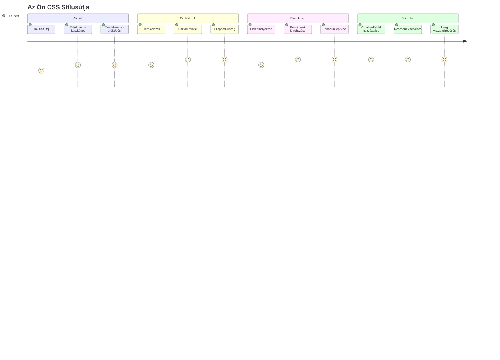
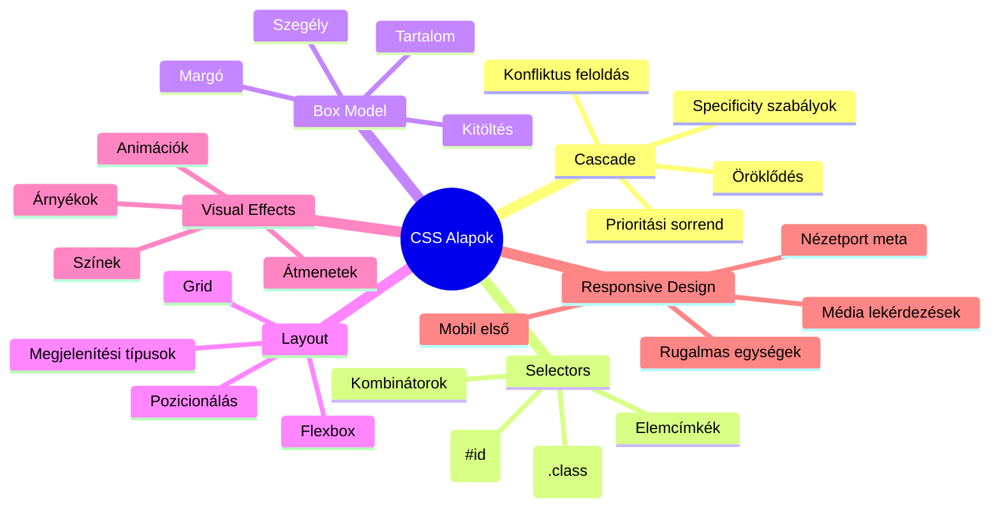
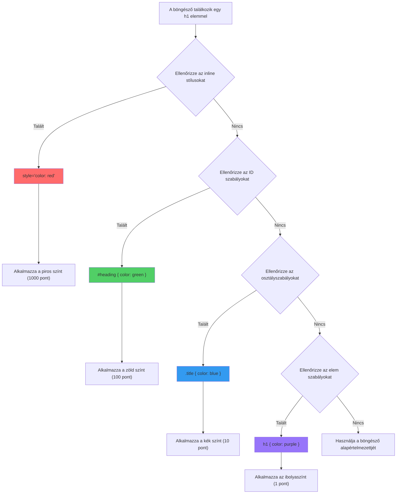
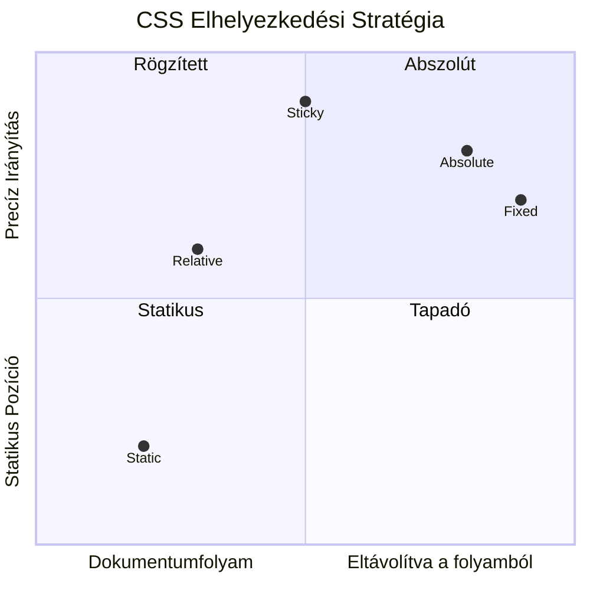
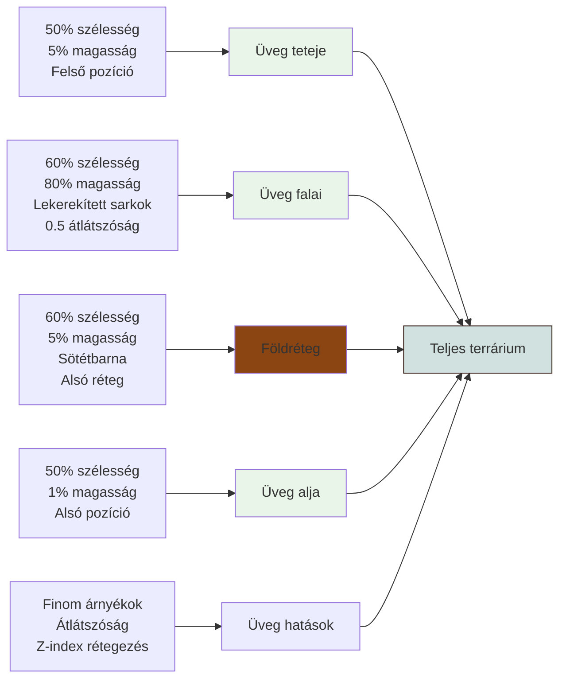
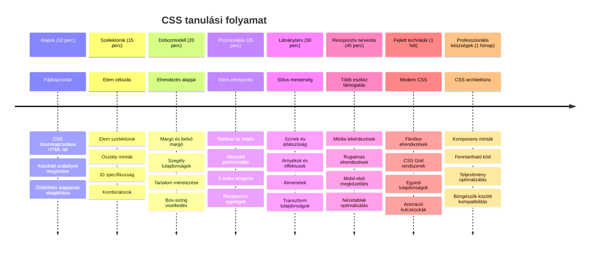

<!--
CO_OP_TRANSLATOR_METADATA:
{
  "original_hash": "e39f3a4e3bcccf94639e3af1248f8a4d",
  "translation_date": "2026-01-07T03:08:45+00:00",
  "source_file": "3-terrarium/2-intro-to-css/README.md",
  "language_code": "hu"
}
-->
# Terrarium Project 2. rész: Bemutatás a CSS-hez



> Sketchnote szerzője: [Tomomi Imura](https://twitter.com/girlie_mac)

Emlékszel, hogy a HTML terráriumod meglehetősen egyszerűnek tűnt? A CSS az, ahol azt az egyszerű szerkezetet vizuálisan vonzóvá alakítjuk.

Ha a HTML olyan, mint egy ház keretének megépítése, akkor a CSS mindaz, ami otthonossá teszi – a festék színei, a bútorok elrendezése, a világítás és a helyiségek közötti áramlás. Gondoljunk arra, hogy a Versailles-i Palota egyszerű vadászházként kezdődött, de a gondos dekoráció és elrendezés a világ egyik leglenyűgözőbb épületévé tette.

Ma a terráriumodat a funkcionálistól a kifinomultig alakítjuk át. Megtanulod, hogyan helyezd el az elemeket pontosan, hogyan reagáljanak a különböző képernyőméretekhez az elrendezések, és hogyan teremtsd meg a vizuális vonzerőt, amely leköti a webhelyek látogatóit.

A lecke végére meglátod, hogyan javíthatja drámaian a projektedet a stratégiai CSS-stílusadás. Adjunk stílust a terráriumodnak.


## Előzetes kvíz

[Előzetes kvíz](https://ff-quizzes.netlify.app/web/quiz/17)

## Kezdés a CSS-sel

A CSS-t gyakran csak „szépítésnek” gondolják, de sokkal szélesebb célt szolgál. A CSS olyan, mintha film rendezője lennél – nem csak azt szabályozod, hogy minden hogyan néz ki, hanem azt is, hogy mozog, hogyan reagál az interakciókra, és hogyan alkalmazkodik különböző helyzetekhez.

A modern CSS rendkívül sokoldalú. Írhatsz olyan kódot, ami automatikusan igazítja az elrendezéseket telefonokhoz, tabletekhez és asztali gépekhez. Létrehozhatsz sima animációkat, amelyek irányítják a felhasználók figyelmét, ahol éppen szükséges. Az eredmények lenyűgözőek lehetnek, ha minden együtt működik.

> 💡 **Pro Tipp**: A CSS folyamatosan fejlődik új funkciókkal és képességekkel. Mindig ellenőrizd a [CanIUse.com](https://caniuse.com) oldalt, hogy meggyőződj a böngészők támogatásáról az új CSS-funkciók használata előtt.

**Amit ebben a leckében elérünk:**
- **Készítünk** egy teljes vizuális tervezést a terráriumodhoz modern CSS technikákkal
- **Felfedezünk** alapfogalmakat, mint a kaskád, öröklődés és CSS szelektorok
- **Megvalósítunk** reszponzív pozicionálást és elrendezési stratégiákat
- **Megépítjük** a terrárium konténert CSS alakzatokkal és stílusokkal

### Előfeltétel

El kell készülnöd a terráriumod HTML szerkezetével az előző leckéből, hogy készen álljon a stílusozásra.

> 📺 **Videó forrás**: Nézd meg ezt a hasznos videós áttekintőt
>
> [](https://www.youtube.com/watch?v=6yIdOIV9p1I)

### A CSS fájl beállítása

Mielőtt megkezdhetnénk a stílusozást, csatlakoztatnunk kell a CSS-t a HTML-hez. Ez a kapcsolat mondja meg a böngészőnek, hol találhatók a terrárium stílusai.

A terrárium mappádban hozz létre egy új fájlt `style.css` néven, majd linkeld be a HTML dokumentumod `<head>` részében:

```html
<link rel="stylesheet" href="./style.css" />
```

**Ezt a funkciót látja el ez a kód:**
- **Kapcsolatot teremt** a HTML és CSS fájlok között
- **Mondja meg** a böngészőnek, hogy töltse be és alkalmazza a `style.css` stílusokat
- **Használja** a `rel="stylesheet"` attribútumot, jelezve, hogy CSS fájlról van szó
- **Hivatkozik** a fájl elérési útjára a `href="./style.css"`-sel

## A CSS kaskád megértése

Gondolkodtál már rajta, hogy miért hívják a CSS-t Kaskád Stíluslapoknak? A stílusok olyanok, mint egy vízesés, lefelé folynak, és néha ütköznek egymással.

Vegyük például a katonai parancsrendszert – egy tábornoki parancs mondhatja, hogy „minden katona zöldet viseljen,” de az adott egységednek kiadott külön parancs „viseljék az ünnepi kék egyenruhát.” A specifikusabb utasítás élvez elsőbbséget. A CSS hasonló logikát követ, és ennek a hierarchiának megértése sokkal könnyebbé teszi a hibakeresést.

### Kísérlet a kaskád prioritásával

Nézzük meg a kaskádot akcióban, egy stílusütközés létrehozásával. Először adj egy inline stílust a `<h1>` címkéhez:

```html
<h1 style="color: red">My Terrarium</h1>
```

**Mit tesz ez a kód:**
- **Közvetlenül alkalmaz** piros színt a `<h1>` elemre inline stílus segítségével
- **Használja** a `style` attribútumot, hogy CSS-t közvetlenül a HTML-ben ágyazzon be
- **Létrehoz** ezzel a legmagasabb prioritású stílus szabályt erre az adott elemre

Ezután add hozzá ezt a szabályt a `style.css` fájlodhoz:

```css
h1 {
  color: blue;
}
```

**Ebben a részben:**
- **Meghatározunk** egy CSS szabályt, amely az összes `<h1>` elemet célozza
- **Beállítjuk** a szöveg színét kékre egy külső stíluslap segítségével
- **Alacsonyabb prioritású szabályt hoztunk létre** az inline stílusokhoz képest

✅ **Tudásellenőrzés**: Milyen szín jelenik meg a webalkalmazásodban? Miért ez a szín győz? Tudsz olyan helyzeteket elképzelni, amikor felül szeretnéd írni a stílusokat?


> 💡 **CSS prioritási sorrend (legmagasabbtól legalacsonyabbig):**
> 1. **Inline stílusok** (style attribútum)
> 2. **ID-k** (#myId)
> 3. **Osztályok** (.myClass) és attribútumok
> 4. **Elem szelektorok** (h1, div, p)
> 5. **Böngésző alapértelmezettek**

## CSS öröklődés működés közben

A CSS öröklődés olyan, mint a genetika – az elemek bizonyos tulajdonságokat örökölnek a szülőelemeiktől. Ha a `body` elemre beállítod a betűtípust, az összes benne lévő szöveg automatikusan azt a betűtípust használja. Ez hasonló ahhoz, amikor a Habsburg család jellegzetes álla generációkon keresztül jelent meg, anélkül hogy minden egyedinek külön meg kellett volna mondani.

Azonban nem minden öröklődik. A betűtípusokhoz és színekhez hasonló szövegstílusok öröklődnek, de az elrendezés tulajdonságai, mint a margók és határok nem. Ahogy a gyerekek örökölhetnek fizikai jegyeket, de nem feltétlenül ruházati ízlést a szüleiktől.

### A betűtípus öröklődésének megfigyelése

Nézzük meg az öröklődést azzal, hogy beállítunk egy betűtípust a `<body>` elemre:

```css
body {
  font-family: 'Segoe UI', Tahoma, Geneva, Verdana, sans-serif;
}
```

**Mit történik itt:**
- **Beállítjuk** az egész oldal betűtípusát a `<body>` elem célzásával
- **Használunk** betűhalmazt (font stack) tartalék opciókkal a jobb böngésző-kompatibilitásért
- **Alkalmazunk** modern rendszerbetűket, amelyek jól néznek ki több operációs rendszeren is
- **Biztosítjuk**, hogy minden gyermekelem örökölje ezt a betűtípust, kivéve, ha máshogy van kijelölve

Nyisd meg a böngésződ fejlesztői eszközeit (F12), menj az Elements fülre, és nézd meg a `<h1>` elemedet. Láthatod, hogy a betűtípust a `body`-tól örökli:


✅ **Kísérlet**: Próbálj meg más öröklődő tulajdonságokat is beállítani a `<body>`-n, mint a `color`, `line-height` vagy `text-align`. Mi történik a címmel és más elemekkel?

> 📝 **Öröklődő tulajdonságok**: `color`, `font-family`, `font-size`, `line-height`, `text-align`, `visibility`
>
> **Nem öröklődő tulajdonságok**: `margin`, `padding`, `border`, `width`, `height`, `position`

### 🔄 **Pedagógiai ellenőrzőpont**
**CSS alapok megértése**: Mielőtt a szelektorokra lépnél, győződj meg, hogy:
- ✅ Képes vagy elmagyarázni a kaskád és öröklődés közötti különbséget
- ✅ Meg tudod jósolni, melyik stílus nyer túlzott specifikusság esetén
- ✅ Ismered, mely tulajdonságok öröklődnek a szülőelemtől
- ✅ Helyesen tudod a CSS fájlokat csatolni a HTML-hez

**Gyors teszt**: Ha ezek a stílusok léteznek, milyen színű lesz egy `<h1>` egy `<div class="special">`-en belül?
```css
div { color: blue; }
.special { color: green; }
h1 { color: red; }
```
*Válasz: Piros (elem szelektor közvetlenül célozza a h1-et)*

## A CSS szelektorok mestersége

A CSS szelektorok segítségével célzottan választhatsz ki konkrét elemeket stílusozásra. Olyanok, mint a pontos instrukciók – ahelyett, hogy azt mondanád „az a ház,” mondhatod azt, hogy „a kék ház, aminek piros ajtaja van a Maple utcában.”

A CSS többféle módot kínál a részletességre, és a megfelelő szelekció kiválasztása olyan, mintha a munkához való eszközt választanád ki. Néha minden ajtót meg kell stílusoznod a környéken, máskor csak egy konkrét ajtót.

### Elem szelektorok (címkék)

Az elem szelektorok az HTML-elemeket a címkéjük neve alapján célozzák meg. Tökéletesek az alapstílusok beállítására, amelyek széles körben alkalmazhatók az oldalon:

```css
body {
  font-family: 'Segoe UI', Tahoma, Geneva, Verdana, sans-serif;
  margin: 0;
  padding: 0;
}

h1 {
  color: #3a241d;
  text-align: center;
  font-size: 2.5rem;
  margin-bottom: 1rem;
}
```

**Ezeknek a stílusoknak a magyarázata:**
- **Egységes tipográfiát állít be** az oldalon a `body` szelektorral
- **Eltávolítja** az alap böngészői margókat és paddingokat jobb vezérlésért
- **Stílusozza** az összes címsort színnel, igazítással és távolsággal
- **`rem` egységeket használ** méretezhető, akadálymentes betűméretezéshez

Bár az elem szelektorok jól működnek az általános stílusokhoz, szükséged lesz konkrétabb szelektorokra az egyes terráriumi növényekhez.

### ID szelektorok egyedi elemekhez

Az ID szelektorok a `#` jellel kezdődnek, és az `id` attribútummal rendelkező egyedi elemeket célozzák. Az ID-k egy oldalon egyediek kell legyenek, ezért tökéletesek egyedi, különleges elemek, például a bal és jobb növénytartók stílusozására.

Készítsük el a terrárium oldal konténereinek stílusát, ahol a növények laknak:

```css
#left-container {
  background-color: #f5f5f5;
  width: 15%;
  left: 0;
  top: 0;
  position: absolute;
  height: 100vh;
  padding: 1rem;
  box-sizing: border-box;
}

#right-container {
  background-color: #f5f5f5;
  width: 15%;
  right: 0;
  top: 0;
  position: absolute;
  height: 100vh;
  padding: 1rem;
  box-sizing: border-box;
}
```

**Mit tesz ez a kód:**
- **Az abszolút pozicionálás segítségével** a konténereket a bal és jobb szélekre helyezi
- **A `vh` (viewport magasság) egységet használja**, hogy az elemek magassága reagáljon a képernyő méretére
- **Alkalmazza a `box-sizing: border-box`-ot**, hogy a padding is beletartozzon a teljes szélességbe
- **Eltávolítja a szükségtelen `px` egységeket nullánál** a tisztább kódért
- **Beállít egy finom háttérszínt**, amely kevésbé zavaró, mint az élénk szürke

✅ **Kódminőség kihívás**: Figyeld meg, hogy ez a CSS megsérti a DRY (Don't Repeat Yourself) elvet. Tudod úgy átalakítani, hogy ID és osztály kombinációját használod?

**Javított megoldás:**
```html
<div id="left-container" class="container"></div>
<div id="right-container" class="container"></div>
```

```css
.container {
  background-color: #f5f5f5;
  width: 15%;
  top: 0;
  position: absolute;
  height: 100vh;
  padding: 1rem;
  box-sizing: border-box;
}

#left-container {
  left: 0;
}

#right-container {
  right: 0;
}
```

### Osztály szelektorok újrafelhasználható stílusokhoz

Az osztály szelektorok a `.` jellel kezdődnek, és akkor használatosak, ha ugyanazt a stílust több elemhez akarod alkalmazni. Az ID-kkel ellentétben az osztályok ismételhetőek a HTML-ben, ezért ideálisak egységes stílusmintákhoz.

A terráriumunkban minden növény hasonló stílust igényel, de egyedi elhelyezést is. Osztályokat használunk az általános stílushoz, és ID-ket az egyedi pozicionáláshoz.

**Az egyes növények HTML szerkezete:**
```html
<div class="plant-holder">
  
</div>
```

**Fontos elemek magyarázata:**
- **`class="plant-holder"`**: egységes konténer stílus minden növény számára
- **`class="plant"`**: közös kép-stílus és viselkedés
- **`id="plant1"`**: egyedi pozíció és JavaScript interakció
- **Leíró alternatív szöveg** a képernyőolvasók számára

Most add hozzá ezt a stílust a `style.css` fájlodhoz:

```css
.plant-holder {
  position: relative;
  height: 13%;
  left: -0.6rem;
}

.plant {
  position: absolute;
  max-width: 150%;
  max-height: 150%;
  z-index: 2;
  transition: transform 0.3s ease;
}

.plant:hover {
  transform: scale(1.05);
}
```

**Stílusok magyarázata:**
- **Relatív pozicionálást állít be** a növénytartóra, hogy pozíciós kontextust biztosítson
- **Minden növénytartót 13% magasságúra állít**, hogy a növények függőlegesen elférjenek görgetés nélkül
- **Kicsit balra tolja el a tartókat**, hogy jobban középre kerüljenek a növények
- **Engedi, hogy a növények arányosan méreteződjenek** a `max-width` és `max-height` tulajdonságokkal
- **`z-index` használatával** a növényeket más elemek fölé helyezi a terráriumban
- **Finom lebegési effektet ad** CSS átmenetekkel jobb felhasználói élményért

✅ **Kritikus gondolkodás**: Miért van szükségünk mind a `.plant-holder`, mind a `.plant` szelektorokra? Mi történne, ha csak egyet használnánk?

> 💡 **Tervezési minta**: A konténer (`.plant-holder`) kezeli az elrendezést és pozíciót, míg a tartalom (`.plant`) az megjelenést és méretezést. Ez a szétválasztás fenntarthatóbbá és rugalmasabbá teszi a kódot.

## A CSS pozicionálás megértése

A CSS pozicionálás olyan, mint egy színdarab rendezője – megmondod, hol álljanak a szereplők és hogyan mozogjanak a színpadon. Egyes szereplők követik az alapelrendezést, míg másoknak speciális pozicionálás kell a drámai hatáshoz.

Ha megérted a pozicionálást, sok elrendezési kihívás kezelhetővé válik. Szükséged van egy navigációs sávra, amely a tetején marad görgetés közben? Ezt a pozicionálás megoldja. Egy tooltipet szeretnél egy adott helyen megjeleníteni? Ez is pozicionálás.

### Az öt pozíció érték


| Pozíció érték | Viselkedés | Használati eset |
|----------------|------------|-----------------|
| `static` | Alapértelmezett áramlás, figyelmen kívül hagyja a top/left/right/bottom értékeket | Normál dokumentum elrendezés |
| `relative` | Az eredeti helyéhez képest pozíciózott | Kis módosítások, pozícionálási kontextus létrehozása |
| `absolute` | A legközelebbi pozícionált őstől függő pozíció | Pontos elhelyezés, rétegezés |
| `fixed` | A viewporthoz képest rögzített pozíció | Navigációs sávok, lebegő elemek |
| `sticky` | Görgetés alapján vált `relative` és `fixed` érték között | Fejlécek, melyek ragadnak görgetéskor |

### Pozicionálás a terráriumunkban

A terráriumunk tudatosan használja a pozíciótípusok kombinációját az elrendezés megvalósításához:

```css
/* Container positioning */
.container {
  position: absolute; /* Removes from normal flow */
  /* ... other styles ... */
}

/* Plant holder positioning */
.plant-holder {
  position: relative; /* Creates positioning context */
  /* ... other styles ... */
}

/* Plant positioning */
.plant {
  position: absolute; /* Allows precise placement within holder */
  /* ... other styles ... */
}
```

**A pozicionálási stratégiát megértve:**
- **Az abszolút konténerek** elkerülnek a normál dokumentum áramlásából és a képernyő szélére kerülnek
- **A relatív növénytartók** pozíciós kontextust biztosítanak, miközben a dokumentum részei maradnak
- **Az abszolút növények** pontosan pozícionálhatóak relatív tartóikon belül
- **Ez a kombináció** lehetővé teszi, hogy a növények egymás fölé kerüljenek és egyénileg is pozícionálhatóak legyenek

> 🎯 **Miért fontos ez?** A növény elemeknek abszolút pozíciós érték kell a következő leckében történő húzhatósághoz. Az abszolút pozicionálás kivonja őket a normál elrendezési áramlásból, lehetővé téve a drag-and-drop interakciókat.

✅ **Kísérlet**: Próbáld meg megváltoztatni a pozíciós értékeket, és figyeld meg az eredményt:
- Mi történik, ha a `.container` pozícióját átállítod `absolute`-ról `relative`-re?
- Hogyan változik a elrendezés, ha a `.plant-holder` `relative` helyett `absolute`-ot használ?
- Mi történik, ha a `.plant` pozícionálását `relative`-re állítod?

### 🔄 **Pedagógiai állapotfelmérés**
**CSS pozícionálás mesterfokon**: Állj meg egy pillanatra és ellenőrizd a megértésedet:
- ✅ El tudod magyarázni, miért szükséges a növényeknek az abszolút pozícionálás a drag-and-drop funkcióhoz?
- ✅ Érted, hogyan hoznak létre a relatív konténerek pozíciós kontextust?
- ✅ Miért használnak oldal konténerek abszolút pozícionálást?
- ✅ Mi történne, ha teljesen eltávolítanád a pozíció deklarációkat?

**Valós kapcsolat**: Gondolkodj el rajta, hogyan tükrözi a CSS pozícionálás a valós világ elrendezését:
- **Statikus**: Könyvek a polcon (természetes sorrend)
- **Relatív**: Egy könyv kis elmozgatása, de a helyének megtartása
- **Abszolút**: Könyvjelző elhelyezése pontos oldalszámnál
- **Fix**: Egy ragacsos jegyzet, ami látható marad, miközben lapozol

## Üvegpohár (terrárium) építése CSS-sel

Most építsünk fel egy üvegedényt csak CSS segítségével – nem kell képek vagy grafikai szoftver.

Az üveg, árnyékok és mélységrealizmus létrehozása pozícionálással és áttetszőséggel demonstrálja a CSS vizuális képességeit. Ez a megközelítés hasonló, mint ahogy a Bauhaus mozgalom építészei egyszerű geometriai formákkal hoztak létre bonyolult, szép szerkezeteket. Ha megérted ezeket az alapelveket, felismered a CSS technikákat számos webdesign mögött.


### Az Üvegpohár Alkatrészeinek Létrehozása

Építsük fel a terrárium üveget darabonként. Minden rész abszolút pozícionálást és százalékos méretezést használ a responsív dizájn érdekében:

```css
.jar-walls {
  height: 80%;
  width: 60%;
  background: #d1e1df;
  border-radius: 1rem;
  position: absolute;
  bottom: 0.5%;
  left: 20%;
  opacity: 0.5;
  z-index: 1;
  box-shadow: inset 0 0 2rem rgba(0, 0, 0, 0.1);
}

.jar-top {
  width: 50%;
  height: 5%;
  background: #d1e1df;
  position: absolute;
  bottom: 80.5%;
  left: 25%;
  opacity: 0.7;
  z-index: 1;
  border-radius: 0.5rem 0.5rem 0 0;
}

.jar-bottom {
  width: 50%;
  height: 1%;
  background: #d1e1df;
  position: absolute;
  bottom: 0;
  left: 25%;
  opacity: 0.7;
  border-radius: 0 0 0.5rem 0.5rem;
}

.dirt {
  width: 60%;
  height: 5%;
  background: #3a241d;
  position: absolute;
  border-radius: 0 0 1rem 1rem;
  bottom: 1%;
  left: 20%;
  opacity: 0.7;
  z-index: -1;
}
```

**A terrárium építésének megértése:**
- **Százalék alapú** méreteket használ a minden képernyőméreten való adaptív méretezéshez
- **Abszolút pozícionálással** helyezi el az elemeket, hogy pontosan egymásra kerüljenek és helyezkedjenek el
- **Különböző átlátszóságokat** alkalmaz az üveghatás létrehozásához
- **`z-index` rétegzést** valósít meg, hogy a növények a poháron belül jelenjenek meg
- **Finom dobozárnyékot** és lekerekített széleket ad a valószerűbb megjelenésért

### Responsív tervezés százalékszámítással

Vedd észre, hogy minden méret százalékos, nem fix pixel érték:

**Miért fontos ez:**
- **Biztosítja**, hogy a terrárium arányosan méreteződik bármilyen képernyőméreten
- **Megőrzi** a vizuális kapcsolatokat az üveg alkatrészei között
- **Konzisztens élményt** nyújt mobiltelefontól a nagy asztali monitorokig
- **Lehetővé teszi**, hogy a dizájn alkalmazkodjon anélkül, hogy összetörné a vizuális elrendezést

### CSS egységek használatban

A `border-radius`-hoz `rem` mértékegységet használunk, ami a gyökér betűmérethez viszonyítva skálázódik. Ez hozzáférhetőbb tervezéseket eredményez, amelyek tiszteletben tartják a felhasználói betűméret beállítást. Tudj meg többet a [CSS relációs egységekről](https://www.w3.org/TR/css-values-3/#font-relative-lengths) a hivatalos specifikációban.

✅ **Vizuális kísérletezés**: Próbáld meg módosítani ezeket az értékeket, és figyeld meg a hatásokat:
- Módosítsd a pohár átlátszóságát 0.5-ről 0.8-ra – hogyan változik az üveg megjelenése?
- Állítsd át a föld színét `#3a241d`-ről `#8B4513`-ra – milyen vizuális hatás érvényesül?
- Változtasd meg a föld `z-index` értékét 2-re – mi történik a rétegzéssel?

### 🔄 **Pedagógiai állapotfelmérés**
**CSS vizuális tervezés megértése**: Ellenőrizd a CSS látványtervezési ismereteidet:
- ✅ Hogyan hoznak létre a százalékos méretek responsív dizájnt?
- ✅ Miért hoz létre az átlátszóság üveghatást?
- ✅ Milyen szerepe van a `z-index`-nek az elemek rétegzésében?
- ✅ Hogyan formálják a `border-radius` értékek a pohár alakját?

**Tervezési elv**: Vedd észre, hogy bonyolult képi elemeket egyszerű formákból építünk fel:
1. **Téglalapok** → **Lekerekített téglalapok** → **Pohár alkatrészek**
2. **Egyszínű felületek** → **Átlátszóság** → **Üveghatás**
3. **Egyedi elemek** → **Rétegezett kompozíció** → **3D megjelenés**

---

## GitHub Copilot Agent kihívás 🚀

Használd az Agent módot a következő kihívás teljesítéséhez:

**Leírás:** Készíts egy CSS animációt, amely lágyan ringatja a terrárium növényeit, mintha enyhe szél fújna. Ez segít gyakorolni a CSS animációkat, transzformációkat és kulcskockákat, miközben növeli a terrárium vizuális vonzerejét.

**Feladat:** Adj CSS kulcskocka animációkat, hogy a terrárium növényei enyhén jobbra-balra ringjanak. Készíts egy ringató animációt, amely mindegyik növényt kicsit (2-3 fokkal) jobbra-balra forgat 3-4 másodperces időtartammal, majd alkalmazd a `.plant` osztályra. Gondoskodj róla, hogy az animáció végtelenül fusson és legyen egy sima, természetes mozgást utánzó easing funkciója.

Tudj meg többet az [agent módról](https://code.visualstudio.com/blogs/2025/02/24/introducing-copilot-agent-mode).

## 🚀 Kihívás: Üveg fényvisszaverődések hozzáadása

Készen állsz élethű üveg fényvisszaverődésekkel gazdagítani a terráriumot? Ez a technika mélységet és realizmust ad a tervhez.

Finom fénypontokat készítesz, amelyek szimulálják, hogyan tükröződik a fény az üvegfelületen. Ez hasonló ahhoz, ahogy a reneszánsz festők, például Jan van Eyck fénnyel és visszatükröződéssel teszik térhatásúvá az üvegvázlatokat. Itt egy cél, amit meg akarsz valósítani:


**A kihívásod:**
- **Hozz létre** finom, fehér vagy világos ovális alakzatokat az üveg fényvisszaverődéséhez
- **Helyezd el** őket stratégiailag a pohár bal oldalán
- **Alkalmazz** megfelelő áttetszőséget és elmosódást az élethű fénytükröződéshez
- **Használj** `border-radius`-t az organikus, buborékszerű formák létrehozásához
- **Kísérletezz** átmenetekkel vagy dobozárnyékokkal a nagyobb realizmus érdekében

## Előadás utáni kvíz

[Előadás utáni kvíz](https://ff-quizzes.netlify.app/web/quiz/18)

## Bővítsd CSS tudásod

A CSS elsőre bonyolultnak tűnhet, de ezeknek az alapelveknek a megértése szilárd alapot ad fejlettebb technikákhoz.

**Következő CSS tanulási területek:**
- **Flexbox** – leegyszerűsíti az elemek igazítását és elosztását
- **CSS Grid** – hatékony eszközök a komplex elrendezésekhez
- **CSS változók** – csökkenti az ismétlést, javítja a karbantartást
- **Reszponzív tervezés** – biztosítja, hogy az oldalak különböző képernyőkön jól működjenek

### Interaktív tanulási források

Gyakorold ezeket a fogalmakat ezekkel az élvezetes, gyakorlati játékokkal:
- 🐸 [Flexbox Froggy](https://flexboxfroggy.com/) – Tanuld meg a Flexboxot szórakoztató kihívásokon keresztül
- 🌱 [Grid Garden](https://codepip.com/games/grid-garden/) – Tanulj CSS Gridet virtuális sárgarépa termesztése közben
- 🎯 [CSS Battle](https://cssbattle.dev/) – Teszteld CSS tudásod kódolási kihívásokon

### További tanulás

Átfogó CSS alapokért végezd el ezt a Microsoft Learn modult: [Stilizáld HTML alkalmazásod CSS-sel](https://docs.microsoft.com/learn/modules/build-simple-website/4-css-basics/?WT.mc_id=academic-77807-sagibbon)

### ⚡ **Mit tehetsz az elkövetkező 5 percben**
- [ ] Nyisd meg az DevTools-t, és vizsgáld meg bármely weboldal CSS stílusait az Elements panelen
- [ ] Készíts egy egyszerű CSS fájlt és csatold egy HTML oldalhoz
- [ ] Próbálj ki különböző színváltoztatási módokat: hex, RGB és név szerinti színek
- [ ] Gyakorold a dobozmodellt padding és margin hozzáadásával egy div-hez

### 🎯 **Mit érhetsz el ebben az órában**
- [ ] Fejezd be az előadás utáni kvízt és ismételd át a CSS alapokat
- [ ] Stílusozd HTML oldalad betűtípusokkal, színekkel és távolságokkal
- [ ] Készíts egyszerű elrendezést flexbox vagy grid segítségével
- [ ] Kísérletezz CSS átmenetekkel a sima hatásokért
- [ ] Gyakorold a responsív tervezést médiakérdésekkel

### 📅 **Hét napos CSS kalandod**
- [ ] Fejezd be a terrárium stílusozási feladatot kreatív megoldásokkal
- [ ] Sajátítsd el a CSS Gridet képgaléria elrendezésének megépítésével
- [ ] Tanuld meg a CSS animációkat, hogy életre keltsd tervezéseidet
- [ ] Fedezd fel a CSS preprocessorokat, mint a Sass vagy Less
- [ ] Tanulmányozd a tervezési elveket és alkalmazd a CSS-ben
- [ ] Elemezd és másold le az érdekes online terveket

### 🌟 **Hónapra szóló tervezési mesterkedésed**
- [ ] Építs teljes reszponzív webdesign rendszert
- [ ] Tanuld meg a CSS-in-JS vagy utility-first keretrendszereket, például Tailwind-et
- [ ] Vegyél részt nyílt forráskódú projektekben CSS fejlesztésekkel
- [ ] Sajátítsd el a haladó CSS koncepciókat, mint az egyéni tulajdonságok és konténment
- [ ] Alkoss újrahasznosítható komponenskönyvtárakat moduláris CSS-sel
- [ ] Mentoráld CSS-t tanulókat és osszd meg tervezési tudásod

## 🎯 CSS mesteri ütemterved


### 🛠️ CSS szerszámosládád összefoglalója

Az óra elvégzése után már rendelkezel:
- **Kaszkád megértéssel**: Hogyan öröklődnek és írhatók felül a stílusok egymást
- **Szelektorok mesterfogásával**: Precíz célzás elemekre, osztályokra és ID-kre
- **Pozícionálási képességekkel**: Stratégiai elem elhelyezés és rétegzés
- **Vizuális tervezéssel**: Üveg effektusok, árnyékok és áttetszőség létrehozása
- **Reszponzív technikákkal**: Százalékos elrendezések, amelyek alkalmazkodnak bármilyen képernyőhöz
- **Kód szervezéssel**: Tiszta, karbantartható CSS struktúra
- **Modern gyakorlatokkal**: Relatív egységek és hozzáférhető tervezési minták használata

**Következő lépések**: A terráriumod most már rendelkezik struktúrával (HTML) és stílussal (CSS). Az utolsó óra interaktivitást ad hozzá JavaScripttel!

## Feladat

[CSS refaktorálás](assignment.md)

---

<!-- CO-OP TRANSLATOR DISCLAIMER START -->
**Jogi nyilatkozat**:  
Ezt a dokumentumot az AI fordító szolgáltatás, a [Co-op Translator](https://github.com/Azure/co-op-translator) használatával fordítottuk. Bár a pontosságra törekszünk, kérjük, vegye figyelembe, hogy az automatikus fordítások tartalmazhatnak hibákat vagy pontatlanságokat. Az eredeti dokumentum az eredeti nyelven tekintendő hivatalos forrásnak. Kritikus információk esetén professzionális emberi fordítást javasolunk. Nem vállalunk felelősséget az ebből a fordításból eredő félreértésekért vagy félreértelmezésekért.
<!-- CO-OP TRANSLATOR DISCLAIMER END -->