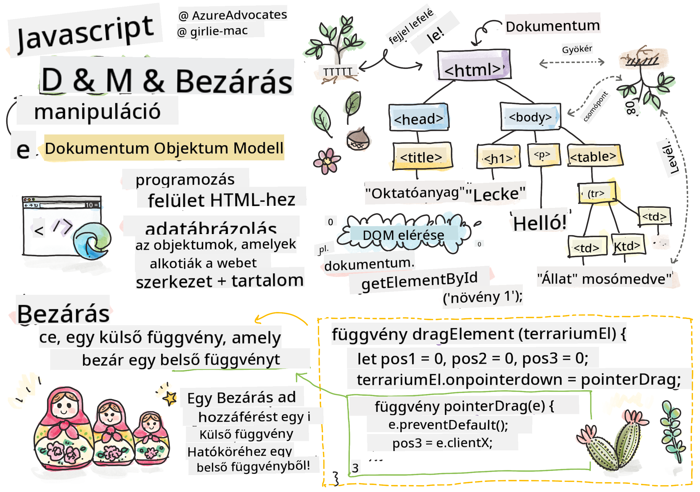
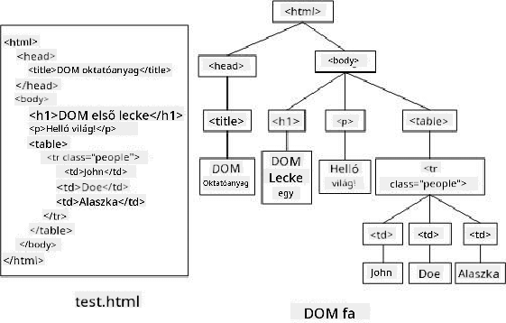

<!--
CO_OP_TRANSLATOR_METADATA:
{
  "original_hash": "30f8903a1f290e3d438dc2c70fe60259",
  "translation_date": "2025-08-28T04:19:22+00:00",
  "source_file": "3-terrarium/3-intro-to-DOM-and-closures/README.md",
  "language_code": "hu"
}
-->
# Terrárium Projekt 3. rész: DOM Manipuláció és Zárvány


> Sketchnote készítette: [Tomomi Imura](https://twitter.com/girlie_mac)

## Előadás Előtti Kvíz

[Előadás előtti kvíz](https://ashy-river-0debb7803.1.azurestaticapps.net/quiz/19)

### Bevezetés

A DOM, vagyis a "Document Object Model" manipulálása a webfejlesztés egyik kulcsfontosságú aspektusa. Az [MDN](https://developer.mozilla.org/docs/Web/API/Document_Object_Model/Introduction) szerint: "A Document Object Model (DOM) a weben található dokumentumok szerkezetét és tartalmát alkotó objektumok adatábrázolása." A DOM manipulációjával kapcsolatos kihívások gyakran vezettek ahhoz, hogy JavaScript keretrendszereket használjunk ahelyett, hogy tiszta JavaScriptet alkalmaznánk a DOM kezelésére, de mi most saját magunk fogjuk megoldani!

Ezenkívül ebben a leckében bevezetjük a [JavaScript zárvány](https://developer.mozilla.org/docs/Web/JavaScript/Closures) fogalmát, amelyet úgy képzelhetsz el, mint egy olyan függvényt, amelyet egy másik függvény zár körül, így a belső függvény hozzáférhet a külső függvény hatóköréhez.

> A JavaScript zárványok egy hatalmas és összetett téma. Ez a lecke csak az alapötletet érinti, miszerint a terrárium kódjában található egy zárvány: egy belső és egy külső függvény, amelyek úgy vannak felépítve, hogy a belső függvény hozzáférjen a külső függvény hatóköréhez. Ha többet szeretnél megtudni arról, hogyan működik ez, látogasd meg az [alapos dokumentációt](https://developer.mozilla.org/docs/Web/JavaScript/Closures).

Egy zárványt fogunk használni a DOM manipulálására.

Gondolj a DOM-ra úgy, mint egy fára, amely a weboldal dokumentumának minden manipulálható módját ábrázolja. Különböző API-k (Application Program Interfaces) készültek, hogy a programozók a választott programozási nyelvük segítségével hozzáférhessenek a DOM-hoz, és szerkeszthessék, módosíthassák, átrendezhetik, vagy más módon kezelhessék azt.



> A DOM és a hozzá tartozó HTML jelölés ábrázolása. Forrás: [Olfa Nasraoui](https://www.researchgate.net/publication/221417012_Profile-Based_Focused_Crawler_for_Social_Media-Sharing_Websites)

Ebben a leckében befejezzük az interaktív terrárium projektünket azzal, hogy létrehozzuk a JavaScriptet, amely lehetővé teszi a felhasználó számára, hogy manipulálja az oldalon található növényeket.

### Előfeltétel

A terráriumod HTML-jének és CSS-ének már készen kell lennie. A lecke végére képes leszel a növényeket a terráriumba mozgatni és onnan kivenni, azokat húzással.

### Feladat

A terrárium mappádban hozz létre egy új fájlt `script.js` néven. Importáld ezt a fájlt a `<head>` szekcióba:

```html
	<script src="./script.js" defer></script>
```

> Megjegyzés: használd a `defer` attribútumot, amikor egy külső JavaScript fájlt importálsz a HTML fájlba, hogy a JavaScript csak akkor fusson le, amikor a HTML fájl teljesen betöltődött. Használhatnád az `async` attribútumot is, amely lehetővé teszi a szkript futtatását a HTML fájl elemzése közben, de a mi esetünkben fontos, hogy a HTML elemek teljesen elérhetők legyenek a húzáshoz, mielőtt a húzási szkriptet végrehajtanánk.
---

## A DOM elemek

Az első dolog, amit meg kell tenned, hogy létrehozol hivatkozásokat azokra az elemekre, amelyeket manipulálni szeretnél a DOM-ban. A mi esetünkben ezek a 14 növény, amelyek jelenleg az oldalsávokban várakoznak.

### Feladat

```html
dragElement(document.getElementById('plant1'));
dragElement(document.getElementById('plant2'));
dragElement(document.getElementById('plant3'));
dragElement(document.getElementById('plant4'));
dragElement(document.getElementById('plant5'));
dragElement(document.getElementById('plant6'));
dragElement(document.getElementById('plant7'));
dragElement(document.getElementById('plant8'));
dragElement(document.getElementById('plant9'));
dragElement(document.getElementById('plant10'));
dragElement(document.getElementById('plant11'));
dragElement(document.getElementById('plant12'));
dragElement(document.getElementById('plant13'));
dragElement(document.getElementById('plant14'));
```

Mi történik itt? A dokumentumot hivatkozod meg, és annak DOM-jában keresel egy adott Id-vel rendelkező elemet. Emlékszel, hogy az első HTML leckében egyedi Id-ket adtál minden növényképnek (`id="plant1"`)? Most hasznát veszed ennek az erőfeszítésnek. Miután azonosítottad az egyes elemeket, átadod azokat egy `dragElement` nevű függvénynek, amelyet hamarosan megépítesz. Így az adott HTML elem húzhatóvá válik, vagy hamarosan azzá válik.

✅ Miért hivatkozunk az elemekre Id alapján? Miért nem a CSS osztályuk alapján? Emlékezz vissza a CSS leckére, hogy megválaszold ezt a kérdést.

---

## A Zárvány

Most készen állsz a `dragElement` zárvány létrehozására, amely egy külső függvény, amely egy vagy több belső függvényt zár körül (a mi esetünkben három lesz).

A zárványok hasznosak, amikor egy vagy több függvénynek hozzá kell férnie egy külső függvény hatóköréhez. Íme egy példa:

```javascript
function displayCandy(){
	let candy = ['jellybeans'];
	function addCandy(candyType) {
		candy.push(candyType)
	}
	addCandy('gumdrops');
}
displayCandy();
console.log(candy)
```

Ebben a példában a `displayCandy` függvény körülvesz egy olyan függvényt, amely egy új cukortípust ad hozzá egy már létező tömbhöz. Ha futtatnád ezt a kódot, a `candy` tömb undefined lenne, mivel ez egy lokális változó (a zárványhoz lokális).

✅ Hogyan tehetnéd elérhetővé a `candy` tömböt? Próbáld meg a zárványon kívülre helyezni. Így a tömb globálissá válik, ahelyett, hogy csak a zárvány lokális hatókörében maradna.

### Feladat

A `script.js` fájlban az elemek deklarációi alatt hozz létre egy függvényt:

```javascript
function dragElement(terrariumElement) {
	//set 4 positions for positioning on the screen
	let pos1 = 0,
		pos2 = 0,
		pos3 = 0,
		pos4 = 0;
	terrariumElement.onpointerdown = pointerDrag;
}
```

A `dragElement` a `terrariumElement` objektumot a szkript tetején lévő deklarációkból kapja. Ezután néhány lokális pozíciót állít be `0` értékre az adott függvénybe átadott objektumhoz. Ezek azok a lokális változók, amelyeket minden egyes elemhez manipulálni fogsz, miközben húzási és ejtési funkcionalitást adsz hozzá a zárványon belül. A terráriumot ezekkel a húzott elemekkel fogod feltölteni, így az alkalmazásnak nyomon kell követnie, hogy hova helyezték őket.

Ezenkívül a `terrariumElement`, amelyet átadsz ennek a függvénynek, egy `pointerdown` eseményt kap, amely a [web API-k](https://developer.mozilla.org/docs/Web/API) része, és a DOM kezelésére lett tervezve. Az `onpointerdown` akkor fut le, amikor egy gombot megnyomnak, vagy a mi esetünkben egy húzható elemet megérintenek. Ez az eseménykezelő mind [webes, mind mobilböngészőkön](https://caniuse.com/?search=onpointerdown) működik, néhány kivétellel.

✅ Az [onclick eseménykezelő](https://developer.mozilla.org/docs/Web/API/GlobalEventHandlers/onclick) sokkal szélesebb körű támogatottsággal rendelkezik a böngészők között; miért nem használod itt? Gondolj arra, hogy pontosan milyen típusú képernyőinterakciót próbálsz létrehozni.

---

## A Pointerdrag függvény

A `terrariumElement` készen áll arra, hogy húzható legyen; amikor az `onpointerdown` esemény lefut, a `pointerDrag` függvény hívódik meg. Add hozzá ezt a függvényt közvetlenül az alábbi sor alá: `terrariumElement.onpointerdown = pointerDrag;`:

### Feladat 

```javascript
function pointerDrag(e) {
	e.preventDefault();
	console.log(e);
	pos3 = e.clientX;
	pos4 = e.clientY;
}
```

Több dolog történik. Először is, megakadályozod az alapértelmezett eseményeket, amelyek normálisan pointerdown esetén történnének, az `e.preventDefault();` használatával. Így nagyobb kontrollt kapsz a felület viselkedése felett.

> Térj vissza ehhez a sorhoz, amikor teljesen megépítetted a szkript fájlt, és próbáld ki `e.preventDefault()` nélkül - mi történik?

Másodszor, nyisd meg az `index.html` fájlt egy böngészőablakban, és vizsgáld meg a felületet. Amikor rákattintasz egy növényre, láthatod, hogyan rögzíti az 'e' esemény az adatokat. Nézd meg az eseményt, hogy lásd, mennyi információt gyűjt egy pointer down esemény!

Ezután vedd észre, hogyan állítod be a lokális `pos3` és `pos4` változókat az `e.clientX` értékére. Ezek az értékek rögzítik a növény x és y koordinátáit abban a pillanatban, amikor rákattintasz vagy megérinted. Finomhangolásra lesz szükséged a növények viselkedésének irányításához, amikor kattintasz és húzod őket, ezért nyomon követed a koordinátáikat.

✅ Kezd világosabbá válni, miért épül az egész alkalmazás egy nagy zárványra? Ha nem így lenne, hogyan tartanád fenn a hatókört mind a 14 húzható növényhez?

Fejezd be az inicializáló függvényt azzal, hogy hozzáadsz még két pointer esemény manipulációt a `pos4 = e.clientY` alá:

```html
document.onpointermove = elementDrag;
document.onpointerup = stopElementDrag;
```
Most azt jelzed, hogy a növényt a pointerrel együtt akarod húzni, amikor mozgatod, és hogy a húzási gesztusnak meg kell állnia, amikor elengeded a növényt. Az `onpointermove` és `onpointerup` ugyanannak az API-nak a részei, mint az `onpointerdown`. A felület most hibákat fog dobni, mivel még nem definiáltad az `elementDrag` és a `stopElementDrag` függvényeket, ezért építsd ki azokat következő lépésként.

## Az elementDrag és stopElementDrag függvények

A zárványodat két további belső függvénnyel fogod befejezni, amelyek kezelik, mi történik, amikor egy növényt húzol, és amikor abbahagyod a húzását. Az a viselkedés, amit el akarsz érni, hogy bármikor húzhatsz egy növényt, és bárhová elhelyezheted az oldalon. Ez a felület meglehetősen szabad (például nincs ejtési zóna), hogy lehetővé tegye számodra a terráriumod szabad tervezését azáltal, hogy növényeket adsz hozzá, távolítasz el, és helyezel át.

### Feladat

Add hozzá az `elementDrag` függvényt közvetlenül a `pointerDrag` záró kapcsos zárójele után:

```javascript
function elementDrag(e) {
	pos1 = pos3 - e.clientX;
	pos2 = pos4 - e.clientY;
	pos3 = e.clientX;
	pos4 = e.clientY;
	console.log(pos1, pos2, pos3, pos4);
	terrariumElement.style.top = terrariumElement.offsetTop - pos2 + 'px';
	terrariumElement.style.left = terrariumElement.offsetLeft - pos1 + 'px';
}
```
Ebben a függvényben sokat módosítasz azokon a kezdeti pozíciókon (1-4), amelyeket lokális változóként állítottál be a külső függvényben. Mi történik itt?

Húzás közben újra hozzárendeled a `pos1`-et úgy, hogy egyenlővé teszed a `pos3`-mal (amit korábban `e.clientX`-ként állítottál be), mínusz az aktuális `e.clientX` értékkel. Hasonló műveletet végzel a `pos2`-vel is. Ezután újra beállítod a `pos3` és `pos4` értékét az elem új X és Y koordinátáira. Ezeket a változásokat figyelheted a konzolban húzás közben. Ezután módosítod a növény CSS stílusát, hogy beállítsd az új pozícióját az `offsetTop` és `offsetLeft` alapján.

> Az `offsetTop` és `offsetLeft` CSS tulajdonságok, amelyek egy elem pozícióját állítják be a szülőjéhez képest; a szülő bármely olyan elem lehet, amely nincs `static` pozícióban.

Ez az újrapozícionálás lehetővé teszi, hogy finomhangold a terrárium és a növények viselkedését.

### Feladat 

Az utolsó feladat a felület befejezéséhez az, hogy hozzáadd a `stopElementDrag` függvényt az `elementDrag` záró kapcsos zárójele után:

```javascript
function stopElementDrag() {
	document.onpointerup = null;
	document.onpointermove = null;
}
```

Ez a kis függvény visszaállítja az `onpointerup` és `onpointermove` eseményeket, hogy újraindíthasd a növény mozgatását, vagy elkezdhess egy új növényt húzni.

✅ Mi történik, ha nem állítod nullára ezeket az eseményeket?

Most befejezted a projektedet!

🥇Gratulálunk! Elkészítetted a gyönyörű terráriumodat! 

---

## 🚀Kihívás

Adj új eseménykezelőt a zárványodhoz, hogy valami mást is csináljon a növényekkel; például dupla kattintással hozd előre egy növényt. Légy kreatív!

## Előadás Utáni Kvíz

[Előadás utáni kvíz](https://ashy-river-0debb7803.1.azurestaticapps.net/quiz/20)

## Áttekintés és Önálló Tanulás

Bár az elemek húzása a képernyőn triviálisnak tűnhet, számos módja van ennek, és sok buktatója lehet, attól függően, hogy milyen hatást szeretnél elérni. Valójában létezik egy teljes [drag and drop API](https://developer.mozilla.org/docs/Web/API/HTML_Drag_and_Drop_API), amelyet kipróbálhatsz. Nem használtuk ezt az API-t ebben a modulban, mert a kívánt hatás kissé eltérő volt, de próbáld ki ezt az API-t egy saját projekteden, és nézd meg, mit érhetsz el.

További információkat találhatsz a pointer eseményekről a [W3C dokumentációban](https://www.w3.org/TR/pointerevents1/) és az [MDN webes dokumentációban](https://developer.mozilla.org/docs/Web/API/Pointer_events).

Mindig ellenőrizd a böngésző képességeit a [CanIUse.com](https://caniuse.com/) segítségével.

## Feladat

[Dolgozz egy kicsit többet a DOM-mal](assignment.md)

---

**Felelősség kizárása**:  
Ez a dokumentum az AI fordítási szolgáltatás, a [Co-op Translator](https://github.com/Azure/co-op-translator) segítségével lett lefordítva. Bár törekszünk a pontosságra, kérjük, vegye figyelembe, hogy az automatikus fordítások hibákat vagy pontatlanságokat tartalmazhatnak. Az eredeti dokumentum az eredeti nyelvén tekintendő hiteles forrásnak. Kritikus információk esetén javasolt professzionális emberi fordítást igénybe venni. Nem vállalunk felelősséget semmilyen félreértésért vagy téves értelmezésért, amely a fordítás használatából eredhet.