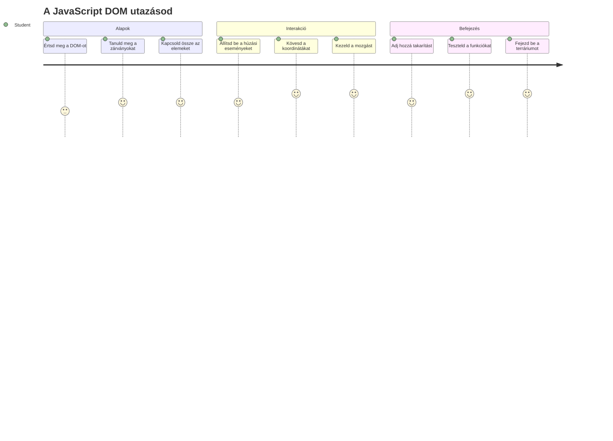
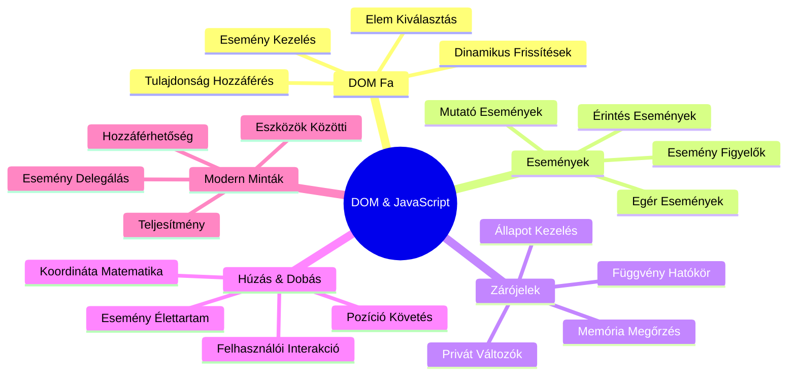
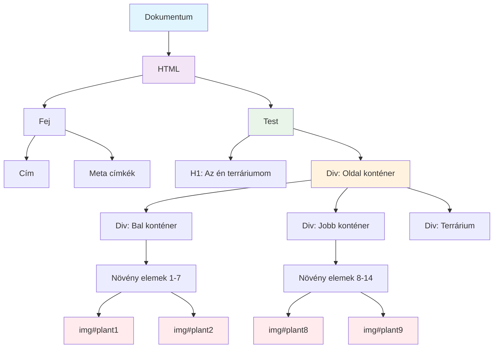
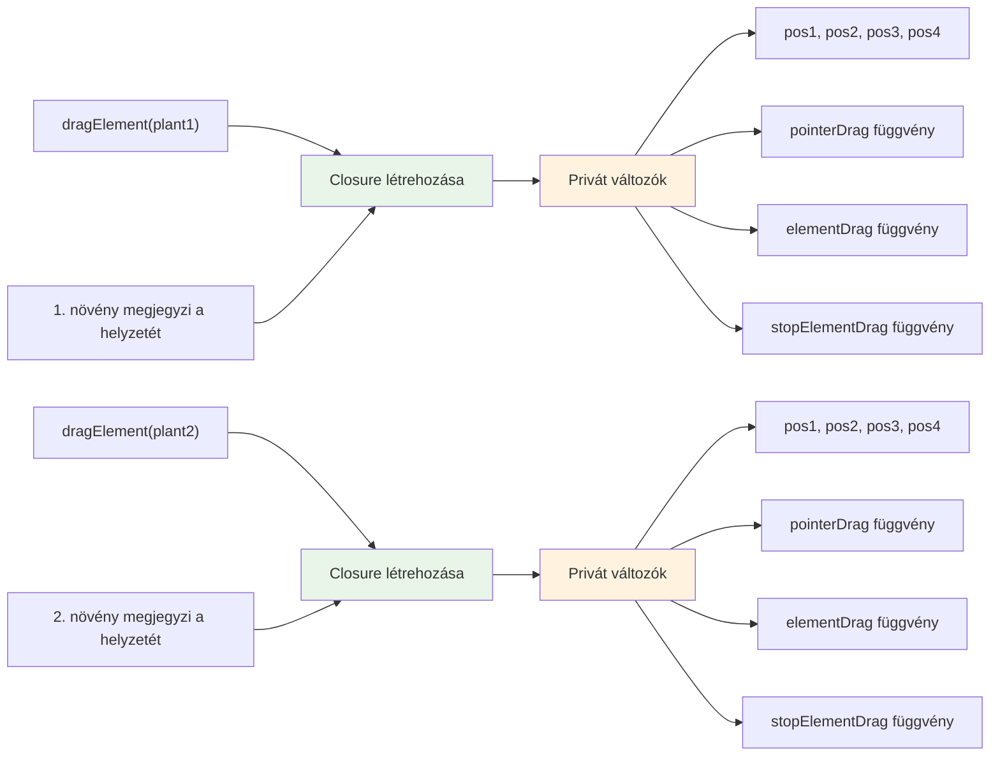
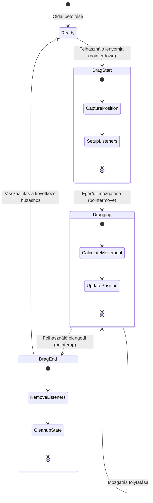
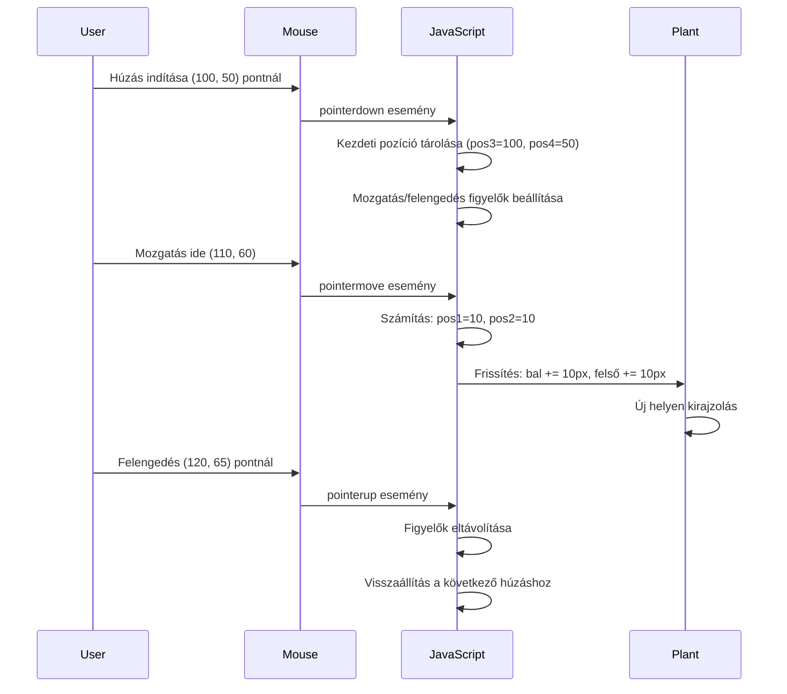
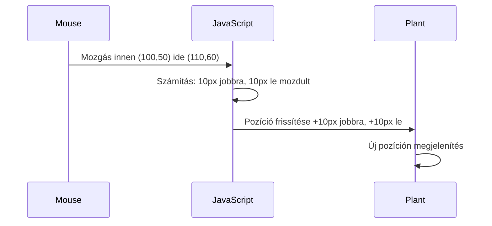
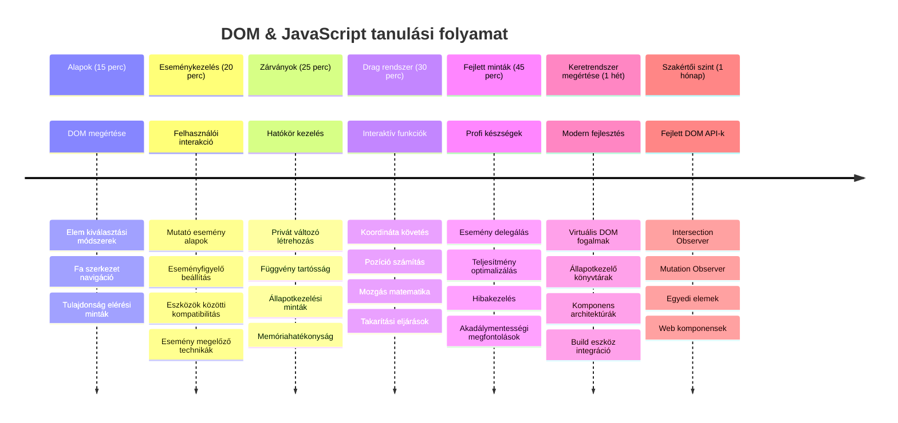

<!--
CO_OP_TRANSLATOR_METADATA:
{
  "original_hash": "973e48ad87d67bf5bb819746c9f8e302",
  "translation_date": "2026-01-07T03:06:35+00:00",
  "source_file": "3-terrarium/3-intro-to-DOM-and-closures/README.md",
  "language_code": "hu"
}
-->
# Terrárium projekt 3. rész: DOM manipuláció és JavaScript closure-ök



> Vázlatrajz készítette [Tomomi Imura](https://twitter.com/girlie_mac)

Üdvözlünk a webfejlesztés egyik legizgalmasabb részénél – a dolgok interaktívvá tételénél! A Document Object Model (DOM) olyan, mint egy híd az HTML-ed és a JavaScript-ed között, és ma ezt fogjuk használni, hogy életre keltsük a terráriumodat. Amikor Tim Berners-Lee megalkotta az első webböngészőt, egy olyan webet képzelt el, ahol a dokumentumok dinamikusak és interaktívak lehetnek – a DOM teszi lehetővé ezt a látomást.

A JavaScript closure-ökbe is belekóstolunk, ami először talán ijesztőnek hangzik. Gondolj a closure-ökre úgy, hogy "memóriazsebeket" hoznak létre, ahol a függvényeid fontos információkat tudnak megjegyezni. Olyan, mintha minden növénynek a terráriumodban saját adatrekordja lenne, amely nyomon követi a pozícióját. A lecke végére megérted, milyen természetesek és hasznosak ezek.

Itt van, amit építünk: egy terráriumot, ahol a felhasználók bárhová áthúzhatják a növényeket, ahová csak akarják. Megtanulod a DOM manipuláció technikáit, amelyek működtetik mind a drag-and-drop fájlfeltöltést, mind az interaktív játékokat. Éledjessük meg a terráriumodat!


## Előadás előtti kvíz

[Előadás előtti kvíz](https://ff-quizzes.netlify.app/web/quiz/19)

## A DOM megértése: az interaktív weboldalak kapuja

A Document Object Model (DOM) az, ahogyan a JavaScript kommunikál a HTML elemeiddel. Amikor a böngésződ betölt egy HTML oldalt, egy strukturált reprezentációt hoz létre az oldalról a memóriában – ez a DOM. Gondolj rá úgy, mint egy családfára, ahol minden HTML elem egy családtag, amelyhez a JavaScript hozzáférhet, módosíthatja vagy átrendezheti.

A DOM manipuláció átalakítja a statikus oldalakat interaktív webhelyekké. Minden alkalommal, amikor egy gomb színe változik egér fölé vitt állapotban, tartalom frissül oldalfrissítés nélkül, vagy olyan elemeket látsz, amelyeket húzni lehet, ez a DOM manipuláció eredménye.




> A DOM és az azt hivatkozó HTML jelölés ábrázolása. Forrás: [Olfa Nasraoui](https://www.researchgate.net/publication/221417012_Profile-Based_Focused_Crawler_for_Social_Media-Sharing_Websites)

**Ez teszi a DOM-ot erőssé:**
- **Biztosít** egy strukturált módot, hogy hozzáférj az oldal bármely eleméhez
- **Lehetővé teszi** a dinamikus tartalomfrissítést oldalfrissítés nélkül
- **Valós idejű választ tesz lehetővé** a felhasználói interakciókra, mint a kattintás és a húzás
- **Alapot teremt** a modern interaktív webalkalmazásokhoz

## JavaScript closure-ök: rendezett, erőteljes kód létrehozása

A [JavaScript closure](https://developer.mozilla.org/docs/Web/JavaScript/Closures) olyan, mintha egy függvény saját privát munkaterületet kapna állandó memóriával. Gondolj arra, ahogy Darwin galápagosi pintyei mind specializált csőröket fejlesztettek ki a saját környezetük szerint – a closure-ök hasonlóak, speciális függvényeket hoznak létre, amelyek „emlékeznek” a saját kontextusukra még azután is, hogy a szülő függvény lefutott.

A mi terráriumunkban a closure-ök segítenek minden növénynek megjegyezni a saját pozícióját függetlenül. Ez a minta széles körben jelen van a profi JavaScript fejlesztésben, ezért fontos megérteni.


> 💡 **Closure-ök megértése**: A closure-ök jelentős téma a JavaScript-ben, és sok fejlesztő évekig használja őket anélkül, hogy minden elméleti részletet teljesen átlátna. Ma a gyakorlati alkalmazásra fókuszálunk – meglátod, hogy a closure-ök természetes módon jelennek meg, miközben interaktív funkciókat építünk. A megértés fejlődni fog, miközben látod, hogyan oldanak meg valódi problémákat.


> A DOM és az azt hivatkozó HTML jelölés ábrázolása. Forrás: [Olfa Nasraoui](https://www.researchgate.net/publication/221417012_Profile-Based_Focused_Crawler_for_Social_Media-Sharing_Websites)

Ebben a leckében befejezzük az interaktív terrárium projekthez szükséges JavaScript megírását, amely lehetővé teszi a felhasználó számára, hogy mozgatni tudja a növényeket az oldalon.

## Mielőtt elkezdenénk: Sikerre való előkészület

Szükséged lesz a korábbi terrárium leckékből származó HTML és CSS fájlokra – most tesszük interaktívvá azt a statikus designt. Ha most csatlakozol először, az előző leckék elvégzése fontos háttérinformációkat ad.

Amit építeni fogunk:
- **Simított drag-and-drop** az összes terrárium növényhez
- **Koordináta-követés**, hogy a növények megjegyezzék a helyüket
- **Teljes interaktív felület** natív JavaScript használatával
- **Tiszta, rendezett kód** closure mintákkal

## JavaScript fájl beállítása

Hozzuk létre azt a JavaScript fájlt, amely interaktívvá teszi a terráriumodat.

**1. lépés: Hozd létre a script fájlodat**

A terrárium mappádban készíts egy új fájlt `script.js` néven.

**2. lépés: Kapcsold össze a JavaScript-et a HTML-lel**

Add hozzá ezt a script taget az `index.html` fájl `<head>` részéhez:

```html
<script src="./script.js" defer></script>
```

**Miért fontos a `defer` attribútum:**
- **Biztosítja**, hogy a JavaScript megvárja, amíg az összes HTML betöltődik
- **Megakadályozza** az olyan hibákat, amikor a JavaScript olyan elemeket keres, amelyek még nem készültek el
- **Garantálja**, hogy az összes növény elem működésre kész legyen
- **Jobb teljesítményt** nyújt, mint a szkriptek oldal aljára helyezése

> ⚠️ **Fontos megjegyzés**: A `defer` attribútum megakadályozza a gyakori időzítési problémákat. Enélkül a JavaScript megpróbálhat olyan HTML elemekhez hozzáférni, amelyek még nem töltődtek be, ami hibákat okozhat.

---

## JavaScript kapcsolódása a HTML elemekhez

Mielőtt az elemeket húzhatóvá tennénk, a JavaScriptnek meg kell találnia őket a DOM-ban. Gondolj erre úgy, mint egy könyvtári katalógusrendszerre – ha megvan a katalógusszám, pontosan megtalálhatod a szükséges könyvet, és hozzáférhetsz minden tartalmához.

A `document.getElementById()` metódust fogjuk használni erre a kapcsolódásra. Ez olyan, mintha pontos iktatórendszered lenne – megadsz egy azonosítót, és pontosan megtalálja a HTML-ben a szükséges elemet.

### Minden növény húzhatóságának engedélyezése

Add ezt a kódot a `script.js` fájlodba:

```javascript
// Engedélyezze a húzási funkciót mind a 14 növényhez
dragElement(document.getElementById('plant1'));
dragElement(document.getElementById('plant2'));
dragElement(document.getElementById('plant3'));
dragElement(document.getElementById('plant4'));
dragElement(document.getElementById('plant5'));
dragElement(document.getElementById('plant6'));
dragElement(document.getElementById('plant7'));
dragElement(document.getElementById('plant8'));
dragElement(document.getElementById('plant9'));
dragElement(document.getElementById('plant10'));
dragElement(document.getElementById('plant11'));
dragElement(document.getElementById('plant12'));
dragElement(document.getElementById('plant13'));
dragElement(document.getElementById('plant14'));
```

**Ez a kód mit tesz:**
- **Megkeresi** a DOM-ban minden növényt az egyedi azonosítójuk alapján
- **JavaScript referencia** szerzése a HTML elemekhez
- **Átadja** ezeket az elemeket a `dragElement` függvénynek (amit hamarosan megírunk)
- **Előkészíti** minden növényt az drag-and-drop interakcióra
- **Összekapcsolja** a HTML szerkezetedet a JavaScript funkciókkal

> 🎯 **Miért azonosítókat (ID-ket) használunk az osztályok helyett?** Az ID-k egyedi azonosítók a konkrét elemekhez, míg a CSS osztályok csoportos stílusok megadására valók. Ha a JavaScriptnek egyedi elemeket kell kezelnie, az ID-k adják meg a pontosságot és teljesítményt.

> 💡 **Professzionális tipp**: Vedd észre, hogy a `dragElement()` minden növényre külön hívjuk meg. Ez biztosítja, hogy minden növény saját, önálló húzási viselkedést kapjon, ami elengedhetetlen a zavartalan felhasználói élményhez.

### 🔄 **Pedagógiai ellenőrzés**
**DOM kapcsolódás megértése**: Mielőtt továbblépnénk a húzás funkcióra, ellenőrizd, hogy:
- ✅ El tudod magyarázni, hogyan találja meg a `document.getElementById()` a HTML elemeket
- ✅ Megérted, miért használunk egyedi ID-ket minden növényhez
- ✅ El tudod mondani, mi a célja a `defer` attribútumnak a script tagekben
- ✅ Felismered, hogyan kapcsolódik a JavaScript a HTML-hez a DOM-on keresztül

**Gyors önellenőrzés**: Mi történne, ha két elemnek ugyanaz az ID-je lenne? Miért ad vissza a `getElementById()` csak egy elemet?
*Válasz: Az ID-knek egyedinek kell lenniük; ha ismétlődnek, csak az első elemet adja vissza*

---

## A dragElement closure megalkotása

Most megalkotjuk a húzási funkcionalitás szívét: egy closure-t, amely kezeli a húzás logikáját minden növény esetében. Ez a closure több belső függvényt tartalmaz majd, amelyek együtt dolgoznak az egérmozgás követésén és az elemek pozíciójának frissítésén.

A closure-ök tökéletesek erre a feladatra, mert lehetővé teszik, hogy „privát” változókat hozzunk létre, amelyek megmaradnak a függvényhívások között, így minden növénynek saját, önálló koordináta-követő rendszere lesz.

### Closure-ök megértése egy egyszerű példán keresztül

Hadd mutassam be a closure-öket egy egyszerű példán, amely illusztrálja a koncepciót:

```javascript
function createCounter() {
    let count = 0; // Ez olyan, mint egy privát változó
    
    function increment() {
        count++; // A belső függvény emlékszik a külső változóra
        return count;
    }
    
    return increment; // Visszaadjuk a belső függvényt
}

const myCounter = createCounter();
console.log(myCounter()); // 1
console.log(myCounter()); // 2
```

**Ez történik ebben a closure mintában:**
- **Létrehoz** egy privát `count` változót, amely csak ebben a closure-ben létezik
- **A belső függvény** hozzáférhet és módosíthatja ezt a külső változót (closure mechanizmus)
- **Amikor visszaadjuk** a belső függvényt, megőrzi a kapcsolatot azzal a privát adattal
- **Még akkor is**, amikor a `createCounter()` befejezi a végrehajtást, a `count` változó megmarad és emlékszik az értékére

### Miért tökéletesek a closure-ök a húzás funkcióhoz

A terráriumunkban minden növénynek meg kell jegyeznie az aktuális pozíciójának koordinátáit. A closure-ök tökéletes megoldást nyújtanak:

**Fő előnyök a projektünkben:**
- **Megőrzik** a privát pozícióváltozókat minden növény számára külön-külön
- **Fenntartják** a koordináta-adatokat a húzás események között
- **Megakadályozzák** a változóütközéseket a különböző húzható elemek között
- **Tiszta, rendezett kódszerkezetet** hoznak létre

> 🎯 **Tanulási cél**: Nem kell most azonnal minden closure aspektust elsajátítanod. Koncentrálj arra, hogy lássad, hogyan segítenek a kód szervezésében és állapot megőrzésében a húzási funkcionalitásunkhoz.


### A dragElement függvény létrehozása

Most építsük meg a fő függvényt, amely kezeli a húzás logikáját. Add hozzá ezt a függvényt a növény elemek deklarációja alá:

```javascript
function dragElement(terrariumElement) {
    // Pozíciókövető változók inicializálása
    let pos1 = 0,  // Előző egér X pozíciója
        pos2 = 0,  // Előző egér Y pozíciója
        pos3 = 0,  // Jelenlegi egér X pozíciója
        pos4 = 0;  // Jelenlegi egér Y pozíciója
    
    // Kezdeti húzás eseményfigyelő beállítása
    terrariumElement.onpointerdown = pointerDrag;
}
```

**A pozíciókövető rendszer megértése:**
- **`pos1` és `pos2`**: Elmentik az egér új és régi pozíciója közti különbséget
- **`pos3` és `pos4`**: Követik az aktuális egérkoordinátákat
- **`terrariumElement`**: A konkrét növény elem, amelyet húzhatóvá teszünk
- **`onpointerdown`**: Az esemény, amely akkor indul, amikor a felhasználó elkezdi a húzást

**Így működik a closure minta:**
- **Privát pozícióváltozókat hoz létre** minden növény elemhez
- **Fenntartja** ezeket a változókat a húzás teljes időtartama alatt
- **Biztosítja**, hogy minden növény önállóan kövesse a koordinátáit
- **Tiszta felületet** nyújt a `dragElement` függvényen keresztül

### Miért használjuk a pointer eseményeket?

Talán azon tűnődsz, miért az `onpointerdown`-t használjuk az ismertebb `onclick` helyett. A gondolatmenet:

| Esemény típusa | Mire a legjobb | Hátrány |
|------------|----------|-------------|
| `onclick` | Egyszerű gombkattintások | Nem kezeli a húzást (csak kattintás és felengedés) |
| `onpointerdown` | Egér és érintés egyaránt | Újabb, de manapság jól támogatott |
| `onmousedown` | Csak asztali egér | Kihagyja a mobil felhasználókat |

**Miért tökéletesek a pointer események a mi funkciónkhoz:**
- **Jól működnek** legyen az egér, ujj vagy akár stylus
- **Ugyanolyan érzetet adnak** laptopon, táblagépen vagy telefonon
- **Kezelik az tényleges húzást** (nem csak kattintást és felengedést)
- **Zavartalan élményt biztosítanak**, amit a modern webes appoktól várunk

> 💡 **Jövőbiztosítás**: A pointer események a modern módja a felhasználói interakciók kezelésének. Egyszerre kapsz egér és érintés kezelést külön kód írása nélkül. Elég praktikus, nem igaz?

### 🔄 **Pedagógiai ellenőrzés**
**Eseménykezelés megértése**: Állj meg egy pillanatra, és ellenőrizd a tudásod:
- ✅ Miért pointer eseményeket használunk az egér események helyett?
- ✅ Hogyan maradnak meg a closure változók a függvényhívások között?
- ✅ Mi a `preventDefault()` szerepe a sima húzásban?
- ✅ Miért a dokumentszinten kötjük az eseményfigyelőket, nem az egyes elemekhez?

**Reális példa**: Gondolj az általad napi szinten használt drag-and-drop felületekre:
- **Fájl feltöltések**: fájlok húzása böngészőablakra
- **Kanban táblák**: feladatok mozgatása oszlopok között
- **Képgalériák**: fényképek sorrendjének átrendezése
- **Mobil felületek**: érintéses húzás és görgetés

---

## A pointerDrag függvény: A húzás indításának rögzítése

Amikor a felhasználó rányom egy növényre (akár egér kattintással vagy ujj érintésével), a `pointerDrag` függvény lép működésbe. Ez a függvény rögzíti a kezdő koordinátákat és beállítja a húzási rendszert.

Add ezt a függvényt a `dragElement` closure belsejébe, közvetlenül az után a sor után, hogy `terrariumElement.onpointerdown = pointerDrag;`:

```javascript
function pointerDrag(e) {
    // Megelőzi az alapértelmezett böngésző viselkedést (például szöveg kijelölés)
    e.preventDefault();
    
    // Rögzíti a kezdeti egér/érintés pozíciót
    pos3 = e.clientX;  // Az X koordináta, ahol az áthúzás kezdődött
    pos4 = e.clientY;  // Az Y koordináta, ahol az áthúzás kezdődött
    
    // Eseményfigyelők beállítása az áthúzási folyamatra
    document.onpointermove = elementDrag;
    document.onpointerup = stopElementDrag;
}
```

**Lépésről lépésre, mi történik:**
- **Megakadályozza** az alapértelmezett böngésző viselkedéseket, amelyek zavarhatnák a húzást
- **Elmenti** a pontos koordinátákat, ahol a felhasználó elkezdte a húzást
- **Létrehoz** eseményfigyelőket a húzás közbeni egérmozgás követéséhez
- **Előkészíti** a rendszert, hogy az egér/ujj mozgását az egész dokumentum területén kövesse

### Az esemény megelőzése (event prevention) megértése

Az `e.preventDefault()` sor kritikus a zavartalan húzáshoz:

**Megelőzés nélkül a böngészők:**
- **Kiválaszthatnak szöveget**, miközben áthúzol az oldalon
- **Kontekstusmenüket indíthatnak** jobb klikkes húzással
- **Zavarhatják** a saját egyedi húzási műveletünket
- **Vizuális hibákat okozhatnak** a húzás során

> 🔍 **Gyakorlat**: A lecke elvégzése után próbáld meg eltávolítani az `e.preventDefault()`-öt, és nézd meg, hogyan változik a húzás élménye. Gyorsan meg fogod érteni, miért elengedhetetlen ez a sor!

### Koordináta követő rendszer

Az `e.clientX` és `e.clientY` tulajdonságok pontos egér/érintés koordinátákat adnak nekünk:

| Tulajdonság | Mit mér | Használati eset |
|----------|------------------|----------|
| `clientX` | Vízszintes pozíció a nézetablakhoz képest | Bal-jobb mozgás követése |
| `clientY` | Függőleges pozíció a nézetablakhoz képest | Fel-le mozgás követése |
**E koordináták megértése:**
- **Pontos** pixelhelyzet-információt nyújt
- **Valós időben frissül**, ahogy a felhasználó mozgatja a mutatót
- **Konzisztens** marad különböző képernyőméretek és nagyítási szintek esetén
- **Lehetővé teszi** a sima, reszponzív húzó műveleteket

### Dokumentumszintű eseményfigyelők beállítása

Figyeld meg, hogyan csatoljuk a mozgatás és a leállítás eseményeket az egész `document`-hez, nem csak a növény elemhez:

```javascript
document.onpointermove = elementDrag;
document.onpointerup = stopElementDrag;
```

**Miért a dokumentumhoz csatoljuk:**
- **Folytatja** a nyomon követést még akkor is, ha az egér elhagyja a növény elemet
- **Megakadályozza** a húzás megszakítását, ha a felhasználó gyorsan mozog
- **Biztosítja** a sima húzást az egész képernyőn
- **Kezeli** az élő eseteket, amikor a kurzor kilép a böngészőablakból

> ⚡ **Teljesítmény megjegyzés**: A húzás leállásakor eltávolítjuk ezeket a dokumentumszintű eseményfigyelőket, hogy elkerüljük a memória szivárgást és teljesítményproblémákat.

## A húzó rendszer befejezése: Mozgás és takarítás

Most hozzáadjuk a két hiányzó függvényt, amelyek a tényleges húzási mozgást kezelik, és a takarítást végzik a húzás leállásakor. Ezek a függvények együttműködnek, hogy sima, reszponzív növénymozgást valósítsanak meg a terráriumban.

### Az elementDrag függvény: Mozgás követése

Add hozzá az `elementDrag` függvényt közvetlenül a `pointerDrag` záró kapcsos zárójelét követően:

```javascript
function elementDrag(e) {
    // Számolja ki a megtett távolságot az utolsó esemény óta
    pos1 = pos3 - e.clientX;  // Vízszintes megtett távolság
    pos2 = pos4 - e.clientY;  // Függőleges megtett távolság
    
    // Frissítse az aktuális pozíció követését
    pos3 = e.clientX;  // Új aktuális X pozíció
    pos4 = e.clientY;  // Új aktuális Y pozíció
    
    // Alkalmazza a mozgást az elem pozíciójára
    terrariumElement.style.top = (terrariumElement.offsetTop - pos2) + 'px';
    terrariumElement.style.left = (terrariumElement.offsetLeft - pos1) + 'px';
}
```

**A koordináta-matematika megértése:**
- **`pos1` és `pos2`**: Kiszámolják, mennyit mozdult az egér az utolsó frissítés óta
- **`pos3` és `pos4`**: Tárolják az aktuális egérpozíciót a következő számításhoz
- **`offsetTop` és `offsetLeft`**: Lekérik az elem aktuális helyzetét az oldalon
- **Kivonás logika**: Ugyanannyira mozgatja az elemet, amennyit az egér mozdult


**A mozgás számítás részletes bontása:**
1. **Méri** a régi és új egérpozíció közti különbséget
2. **Kiszámolja** mennyit kell az elemen mozgatni az egérmozgás alapján
3. **Valós időben frissíti** az elem CSS pozíció tulajdonságait
4. **Elmenti** az új pozíciót kiindulópontként a következő mozgás számításhoz

### A matematika vizuális ábrázolása


### A stopElementDrag függvény: Takarítás

Add hozzá a takarító függvényt az `elementDrag` záró kapcsos zárójelét követően:

```javascript
function stopElementDrag() {
    // Távolítsa el a dokumentumszintű eseményfigyelőket
    document.onpointerup = null;
    document.onpointermove = null;
}
```

**Miért elengedhetetlen a takarítás:**
- **Megakadályozza** a memóriaszivárgást a megmaradt eseményfigyelők miatt
- **Leállítja** a húzó viselkedést, amikor a felhasználó elengedi a növényt
- **Lehetővé teszi** más elemek független húzását
- **Újraindítja** a rendszert a következő húzási művelethez

**Mi történik takarítás nélkül:**
- Az eseményfigyelők tovább futnak a húzás után is
- A teljesítmény romlik, ahogy a használaton kívüli figyelők gyűlnek
- Váratlan viselkedés más elemekkel való interakció esetén
- A böngésző erőforrásai feleslegesen fogynak eseménykezelésre

### A CSS pozíció tulajdonságok megértése

A húzó rendszerünk két kulcsfontosságú CSS tulajdonságot manipulál:

| Tulajdonság | Mit szabályoz | Hogyan használjuk |
|-------------|---------------|-------------------|
| `top` | Távolság a felső élhez | Függőleges pozicionálás húzás közben |
| `left` | Távolság a bal élhez | Vízszintes pozicionálás húzás közben |

**Fontos tudnivalók az offset tulajdonságokról:**
- **`offsetTop`**: Aktuális távolság a pozicionált szülő elem tetejétől
- **`offsetLeft`**: Aktuális távolság a pozicionált szülő elem bal oldalától
- **Pozicionálási kontextus**: Ezek az értékek a legközelebbi pozicionált őshöz viszonyítva értendők
- **Valós idejű frissítés**: Az értékek azonnal változnak, ha módosítjuk a CSS tulajdonságokat

> 🎯 **Tervezési filozófia**: Ez a húzó rendszer szándékosan rugalmas – nincsenek "lerakó zónák" vagy korlátozások. A felhasználók bárhová elhelyezhetik a növényeket, teljes kreatív szabadságot adva a terrárium kialakításához.

## Összegezve: Az egész húzó rendszer

Gratulálunk! Éppen most építettél egy kifinomult húzás-és-ejtműködés rendszert tiszta JavaScript-tel. A teljes `dragElement` függvényed most egy erőteljes zárványt tartalmaz, amely kezeli:

**Mit valósít meg a zárványod:**
- **Fenntartja** az egyedi pozícióváltozókat minden növényhez függetlenül
- **Kezeli** a teljes húzási életciklust az indulástól a befejezésig
- **Biztosítja** a sima, reszponzív mozgást az egész képernyőn
- **Megfelelően takarít** az erőforrások lefoglalása után, hogy megelőzze a memória szivárgást
- **Egyszerű, kreatív felületet teremt** a terrárium tervezéséhez

### Interaktív terrárium tesztelése

Most teszteld az interaktív terráriumodat! Nyisd meg az `index.html` fájlodat egy webböngészőben, és próbáld ki a funkciókat:

1. **Kattints és tarts le** bármely növényen a húzás elkezdéséhez
2. **Mozgasd az egeret vagy az ujjad**, nézd, hogy a növény simán követi
3. **Engedd el**, hogy az új helyén lerakd a növényt
4. **Kísérletezz** különböző elrendezésekkel, hogy felfedezd az interfészt

🥇 **Teljesítmény**: Teljes értékű, webes alkalmazást készítettél, a professzionális fejlesztők által naponta használt alapelvek segítségével. Ez a húzás-és-ejtés funkció ugyanazokon az elveken alapul, mint például a fájlfeltöltések, kanban táblák és számos más interaktív felület.

### 🔄 **Pedagógiai ellenőrzőpont**
**Teljes rendszermegértés**: Ellenőrizd tudásod a komplett húzó rendszerről:
- ✅ Hogyan tartják fenn a zárványok az egyedi állapotot minden növényhez?
- ✅ Miért szükséges a koordináta számítás a sima mozgáshoz?
- ✅ Mi történne, ha elfelejtenénk eltávolítani az eseményfigyelőket?
- ✅ Hogyan skálázódik ez a minta bonyolultabb interakciókra?

**Kódminőség önértékelés**: Tekintsd át a teljes megoldásodat:
- **Moduláris tervezés**: Minden növény saját zárványpéldányt kap
- **Jó eseménykezelés**: Megfelelő beállítás és takarítás
- **Eszközök közötti támogatás**: Asztali és mobil támogatás
- **Teljesítménytudatosság**: Nincs memóriaszivárgás vagy fölösleges számítás


---

## GitHub Copilot Agent kihívás 🚀

Használd az Agent módot az alábbi kihívás befejezéséhez:

**Leírás:** Fejleszd tovább a terrárium projektet egy alaphelyzetbe állító funkció hozzáadásával, amely visszaállítja az összes növényt eredeti pozíciójába sima animációk segítségével.

**Feladat:** Hozz létre egy reset gombot, amely megnyomásakor az összes növényt CSS átmenetekkel visszaviszi az eredeti oldalsáv helyzetükre. A függvénynek el kell tárolnia az eredeti pozíciókat az oldal betöltődésekor, és simán vissza kell mozgatnia a növényeket 1 másodperc alatt a reset gomb megnyomásakor.

További részletek az [agent mód](https://code.visualstudio.com/blogs/2025/02/24/introducing-copilot-agent-mode) használatáról.

## 🚀 További kihívás: Fejleszd képességeid

Készen állsz, hogy szintet lépj a terráriumoddal? Próbáld ki ezeket a fejlesztéseket:

**Kreatív bővítések:**
- **Dupla kattintás** egy növényre, hogy előtérbe hozza (z-index manipuláció)
- **Adj vizuális visszajelzést**, például finom ragyogást a növényeken, amikor föléjük viszed az egeret
- **Alkalmazz határokat**, hogy megakadályozd a növények terráriumon kívüli húzását
- **Készíts mentés funkciót**, amely eltárolja a növény helyzetét localStorage-ban
- **Adj hanghatásokat** növény felvételéhez és lerakásához

> 💡 **Tanulási lehetőség**: Ezek a kihívások mind új aspektusokat tanítanak a DOM manipulációból, esemény kezelésből és felhasználói élmény tervezésből.

## Előadás utáni kvíz

[Előadás utáni kvíz](https://ff-quizzes.netlify.app/web/quiz/20)

## Áttekintés & Önálló tanulás: Mélyítsd el a tudásod

Már elsajátítottad a DOM manipuláció és a zárványok alapjait, de mindig van mit felfedezni! Íme néhány irány, ahol tovább fejlesztheted tudásod és képességeid.

### Alternatív húzás-eldobás megközelítések

Pointer eseményeket használtunk a maximális rugalmasságért, de a webfejlesztés többféle módszert kínál:

| Megközelítés | Milyen célra legjobb | Tanulási érték |
|--------------|---------------------|---------------|
| [HTML Drag and Drop API](https://developer.mozilla.org/docs/Web/API/HTML_Drag_and_Drop_API) | Fájlfeltöltések, formális húzó zónák | A böngésző natív képességeinek megértése |
| [Touch Events](https://developer.mozilla.org/docs/Web/API/Touch_events) | Mobil specifikus interakciók | Mobil első fejlesztési minták |
| CSS `transform` tulajdonságok | Simább animációk | Teljesítmény optimalizálási technikák |

### Haladó DOM manipuláció témák

**Következő tanulási lépések:**
- **Esemény delegálás**: Több elem eseményeinek hatékony kezelése
- **Intersection Observer**: Észlelés, amikor elemek belépnek vagy elhagyják a nézetet
- **Mutation Observer**: A DOM struktúra változásainak figyelése
- **Web komponensek**: Újrahasznosítható, kapszulázott UI elemek létrehozása
- **Virtual DOM koncepciók**: Keretrendszerek DOM frissítésének optimalizálása

### Fontos források a folyamatos tanuláshoz

**Technikai dokumentáció:**
- [MDN Pointer Events útmutató](https://developer.mozilla.org/docs/Web/API/Pointer_events) – Átfogó pointer esemény referenciák
- [W3C Pointer Events specifikáció](https://www.w3.org/TR/pointerevents1/) – Hivatalos szabvány dokumentáció
- [JavaScript zárványok részletesen](https://developer.mozilla.org/docs/Web/JavaScript/Closures) – Fejlett zárvány minták

**Böngésző kompatibilitás:**
- [CanIUse.com](https://caniuse.com/) – Funkció támogatás böngészők között
- [MDN kompatibilitási adatok](https://github.com/mdn/browser-compat-data) – Részletes kompatibilitási információ

**Gyakorlati lehetőségek:**
- **Készíts** puzzle játékot hasonló húzó mechanikával
- **Alkoss** kanban táblát húzásos feladathoz
- **Tervezd meg** egy kép galériát húzható fotó elrendezéssel
- **Kísérletezz** érintés gesztusokkal mobil interfészen

> 🎯 **Tanulási stratégia**: Ezeknek az elveknek a legjobb elsajátítása gyakorlással történik. Építs változatokat húzható felületekből – minden projekt új tanulságot ad a felhasználói interakcióról és DOM kezelőről.

### ⚡ **Mit csinálhatsz az elkövetkező 5 percben**
- [ ] Nyisd meg a böngésző fejlesztői eszközeit és gépeld be a konzolba: `document.querySelector('body')`
- [ ] Próbálj meg változtatni egy weboldal szövegén `innerHTML` vagy `textContent` segítségével
- [ ] Adj hozzá kattintás eseményfigyelőt egy gombhoz vagy linkhez a weboldalon
- [ ] Nézd meg a DOM fa szerkezetét az Elements panelen

### 🎯 **Mit érhetsz el ezen az órán belül**
- [ ] Töltsd ki az előadás utáni kvízt és ismételd át a DOM manipulációs fogalmakat
- [ ] Készíts interaktív weboldalt, amely reagál a felhasználó kattintásaira
- [ ] Gyakorold az eseménykezelést különféle eseménytípusokkal (kattintás, egér föléviteli, billentyűleütés)
- [ ] Építs egy egyszerű teendőlistát vagy számlálót DOM manipulációval
- [ ] Fedezd fel a HTML elemek és JavaScript objektumok kapcsolatát

### 📅 **Heti JavaScript útmutatód**
- [ ] Készítsd el az interaktív terrárium projektet húzás-és-ejtés funkcióval
- [ ] Sajátítsd el az esemény delegálást a hatékony eseménykezelésért
- [ ] Tanulj az eseményhurokról és az aszinkron JavaScriptről
- [ ] Gyakorold a zárványokat modulok építésével privát állapottal
- [ ] Ismerkedj meg a modern DOM API-kkal, például az Intersection Observer-rel
- [ ] Építs interaktív komponenseket keretrendszerek nélkül

### 🌟 **Havi JavaScript mesterséged**
- [ ] Alkoss komplex egyoldalas alkalmazást tiszta JavaScript-tel
- [ ] Tanulj meg egy modern keretrendszert (React, Vue, Angular), és hasonlítsd össze a tiszta DOM-mal
- [ ] Vegyél részt nyílt forráskódú JavaScript projektekben
- [ ] Sajátíts el fejlett koncepciókat, mint a webkomponensek és egyedi elemek
- [ ] Készíts teljesítményorientált webes alkalmazásokat optimális DOM mintákkal
- [ ] Taníts másokat DOM manipulációról és JavaScript alapokról

## 🎯 JavaScript DOM Mesteri Idővonalad


### 🛠️ JavaScript eszköztár összefoglaló

A tanfolyam elvégzése után most már rendelkezel:
- **DOM jártasság**: Elem kiválasztás, tulajdonság manipuláció, fa navigáció
- **Esemény szakértelem**: Eszközök közti interakció kezelése pointer eseményekkel
- **Zárvány megértés**: Privát állapotkezelés és függvények megőrzése
- **Interaktív rendszerek**: Komplett húzás- és ejtés megvalósítás a nulláról
- **Teljesítménytudatosság**: Események helyes takarítása és memória menedzsment
- **Modern minták**: Az ipari fejlesztésben használt kód szervezési technikák
- **Felhasználói élmény**: Intuitív, reszponzív interfészek létrehozása

**Szakmai készségek, amiket megszereztél**: Olyan technikákat használtál, mint a:
- **Trello/Kanban táblák**: kártyahúzás oszlopok között
- **Fájlfeltöltő rendszerek**: húzás-és-ejtés alapú fájl kezelés
- **Képgalériák**: fotó elrendező felületek
- **Mobil appok**: érintés alapú interakciós minták

**Következő szint**: Készen állsz, hogy modern keretrendszereket tanulj, mint a React, Vue vagy Angular, amelyek ezekre a DOM manipuláció alapokra építenek!

## Feladat

[Dolgozz tovább a DOM-mal](assignment.md)

---

<!-- CO-OP TRANSLATOR DISCLAIMER START -->
**Jogi nyilatkozat**:
Ezt a dokumentumot az AI fordítószolgáltatás, a [Co-op Translator](https://github.com/Azure/co-op-translator) segítségével fordítottuk le. Bár a pontosságra törekszünk, kérjük, vegye figyelembe, hogy az automatikus fordítások hibákat vagy pontatlanságokat tartalmazhatnak. Az eredeti dokumentum anyanyelven készült változatát kell tekinteni hivatalos forrásnak. Kritikus információk esetén szakmai, emberi fordítást javaslunk. Nem vállalunk felelősséget ezen fordítás használatából eredő félreértésekért vagy félreértelmezésekért.
<!-- CO-OP TRANSLATOR DISCLAIMER END -->