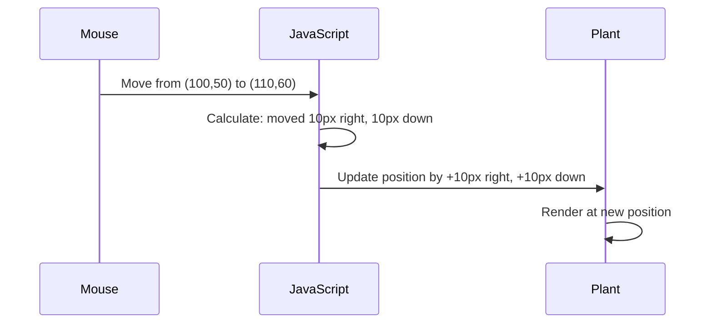

<!--
CO_OP_TRANSLATOR_METADATA:
{
  "original_hash": "bc93f6285423033ebf5b8abeb5282888",
  "translation_date": "2025-10-24T20:12:57+00:00",
  "source_file": "3-terrarium/3-intro-to-DOM-and-closures/README.md",
  "language_code": "hu"
}
-->
# Terrárium Projekt 3. rész: DOM Manipuláció és JavaScript Zárványok


> Sketchnote készítette: [Tomomi Imura](https://twitter.com/girlie_mac)

Üdvözlünk a webfejlesztés egyik legizgalmasabb aspektusában - az interaktivitás megteremtésében! A Document Object Model (DOM) olyan, mint egy híd a HTML és a JavaScript között, és ma ezt fogjuk használni, hogy életre keltsük a terráriumodat. Amikor Tim Berners-Lee megalkotta az első webböngészőt, egy olyan webet képzelt el, ahol a dokumentumok dinamikusak és interaktívak lehetnek - a DOM teszi ezt a víziót lehetővé.

Emellett megismerkedünk a JavaScript zárványokkal is, amelyek elsőre talán ijesztőnek tűnhetnek. Gondolj a zárványokra úgy, mint "memória zsebekre", ahol a függvények megjegyezhetnek fontos információkat. Olyan, mintha minden növény a terráriumodban saját adatlapot kapna, hogy nyomon kövesse a pozícióját. A lecke végére megérted, milyen természetesek és hasznosak ezek.

Ezt fogjuk elkészíteni: egy terráriumot, ahol a felhasználók bárhová elhúzhatják és elhelyezhetik a növényeket. Megtanulod azokat a DOM manipulációs technikákat, amelyek mindent működtetnek a drag-and-drop fájlfeltöltésektől az interaktív játékokig. Keltsük életre a terráriumodat!

## Előadás előtti kvíz

[Előadás előtti kvíz](https://ff-quizzes.netlify.app/web/quiz/19)

## A DOM megértése: Kapud az interaktív weboldalakhoz

A Document Object Model (DOM) az a mód, ahogyan a JavaScript kommunikál a HTML elemekkel. Amikor a böngésződ betölt egy HTML oldalt, létrehoz egy strukturált reprezentációt az oldalról a memóriában - ez a DOM. Gondolj rá úgy, mint egy családfára, ahol minden HTML elem egy családtag, amelyet a JavaScript elérhet, módosíthat vagy átrendezhet.

A DOM manipuláció átalakítja a statikus oldalakat interaktív weboldalakká. Minden alkalommal, amikor egy gomb színe megváltozik, amikor rámutatsz, a tartalom frissül anélkül, hogy az oldal újratöltődne, vagy elemeket húzhatsz körbe - ez mind a DOM manipuláció eredménye.


> A DOM és a HTML markup, amely hivatkozik rá. Forrás: [Olfa Nasraoui](https://www.researchgate.net/publication/221417012_Profile-Based_Focused_Crawler_for_Social_Media-Sharing_Websites)

**Ami a DOM-ot erőteljessé teszi:**
- **Lehetővé teszi** bármely elem strukturált elérését az oldalon
- **Dinamikus tartalomfrissítést tesz lehetővé** oldal újratöltése nélkül
- **Valós idejű válaszokat biztosít** a felhasználói interakciókra, mint például kattintások és húzások
- **Megteremti** a modern interaktív webalkalmazások alapját

## JavaScript Zárványok: Szervezett, Erőteljes Kód Létrehozása

A [JavaScript zárvány](https://developer.mozilla.org/docs/Web/JavaScript/Closures) olyan, mintha egy függvény saját privát munkaterületet kapna tartós memóriával. Gondolj Darwin pintyére a Galápagos-szigeteken, amelyek mindegyike specializált csőrt fejlesztett ki a saját környezetének megfelelően - a zárványok hasonlóan működnek, specializált függvényeket hoznak létre, amelyek "emlékeznek" a saját kontextusukra, még akkor is, ha a szülőfüggvény már befejezte a működését.

A terráriumunkban a zárványok segítenek minden növénynek megjegyezni a saját pozícióját függetlenül. Ez a minta a professzionális JavaScript fejlesztés során gyakran előfordul, így értékes koncepció megérteni.

> 💡 **A Zárványok Megértése**: A zárványok jelentős témát jelentenek a JavaScriptben, és sok fejlesztő évekig használja őket, mielőtt teljesen megértené az összes elméleti aspektust. Ma a gyakorlati alkalmazásra összpontosítunk - látni fogod, hogy a zárványok természetesen megjelennek, miközben interaktív funkciókat építünk. Az értés fokozatosan fejlődik, ahogy látod, hogyan oldják meg a valós problémákat.


> A DOM és a HTML markup, amely hivatkozik rá. Forrás: [Olfa Nasraoui](https://www.researchgate.net/publication/221417012_Profile-Based_Focused_Crawler_for_Social_Media-Sharing_Websites)

Ebben a leckében befejezzük az interaktív terrárium projektünket azzal, hogy létrehozzuk a JavaScriptet, amely lehetővé teszi a felhasználó számára, hogy manipulálja az oldal növényeit.

## Mielőtt elkezdenénk: Felkészülés a sikerre

Szükséged lesz az előző terrárium leckék HTML és CSS fájljaira - most fogjuk interaktívvá tenni azt a statikus dizájnt. Ha most csatlakozol, érdemes először elvégezni azokat a leckéket, hogy megértsd az alapokat.

Ezt fogjuk elkészíteni:
- **Zökkenőmentes drag-and-drop** az összes terrárium növényhez
- **Koordináta követés**, hogy a növények megjegyezzék a pozíciójukat
- **Teljes interaktív felület** vanilla JavaScript használatával
- **Tiszta, szervezett kód** zárvány minták alkalmazásával

## JavaScript fájl beállítása

Hozzuk létre azt a JavaScript fájlt, amely interaktívvá teszi a terráriumodat.

**1. lépés: Hozd létre a script fájlt**

A terrárium mappádban hozz létre egy új fájlt `script.js` néven.

**2. lépés: Kapcsold össze a JavaScriptet a HTML-lel**

Add hozzá ezt a script tag-et az `index.html` fájl `<head>` szekciójához:

```html
<script src="./script.js" defer></script>
```

**Miért fontos a `defer` attribútum:**
- **Biztosítja**, hogy a JavaScript megvárja, amíg az összes HTML betöltődik
- **Megelőzi** azokat a hibákat, amikor a JavaScript olyan elemeket keres, amelyek még nem állnak készen
- **Garantálja**, hogy az összes növény elem elérhető legyen az interakcióhoz
- **Jobb teljesítményt nyújt**, mint a script-ek oldal aljára helyezése

> ⚠️ **Fontos Megjegyzés**: A `defer` attribútum megelőzi a gyakori időzítési problémákat. Nélküle a JavaScript megpróbálhat hozzáférni a HTML elemekhez, mielőtt azok betöltődnének, ami hibákat okozhat.

---

## JavaScript összekapcsolása a HTML elemekkel

Mielőtt az elemeket húzhatóvá tennénk, a JavaScriptnek meg kell találnia őket a DOM-ban. Gondolj erre úgy, mint egy könyvtári katalógusrendszerre - ha megvan a katalógusszám, pontosan megtalálhatod a szükséges könyvet, és hozzáférhetsz az összes tartalmához.

A `document.getElementById()` metódust fogjuk használni ezekhez a kapcsolatokhoz. Ez olyan, mint egy precíz iktatórendszer - megadod az ID-t, és pontosan megtalálja a szükséges elemet a HTML-ben.

### Húzás funkció engedélyezése az összes növényhez

Add hozzá ezt a kódot a `script.js` fájlodhoz:

```javascript
// Enable drag functionality for all 14 plants
dragElement(document.getElementById('plant1'));
dragElement(document.getElementById('plant2'));
dragElement(document.getElementById('plant3'));
dragElement(document.getElementById('plant4'));
dragElement(document.getElementById('plant5'));
dragElement(document.getElementById('plant6'));
dragElement(document.getElementById('plant7'));
dragElement(document.getElementById('plant8'));
dragElement(document.getElementById('plant9'));
dragElement(document.getElementById('plant10'));
dragElement(document.getElementById('plant11'));
dragElement(document.getElementById('plant12'));
dragElement(document.getElementById('plant13'));
dragElement(document.getElementById('plant14'));
```

**Ez a kód a következőket éri el:**
- **Megkeresi** az egyes növény elemeket a DOM-ban az egyedi ID-jük segítségével
- **Lekéri** a JavaScript referencia az egyes HTML elemekhez
- **Átadja** az egyes elemeket egy `dragElement` függvénynek (amit hamarosan létrehozunk)
- **Előkészíti** minden növényt a drag-and-drop interakcióra
- **Összekapcsolja** a HTML struktúrát a JavaScript funkcióval

> 🎯 **Miért használjunk ID-kat osztályok helyett?** Az ID-k egyedi azonosítókat biztosítanak konkrét elemekhez, míg a CSS osztályok csoportok stílusozására szolgálnak. Amikor a JavaScriptnek egyedi elemeket kell manipulálnia, az ID-k biztosítják a szükséges pontosságot és teljesítményt.

> 💡 **Profi Tipp**: Figyeld meg, hogy egyenként hívjuk meg a `dragElement()` függvényt minden növényre. Ez az eljárás biztosítja, hogy minden növény saját független húzási viselkedést kapjon, ami elengedhetetlen a zökkenőmentes felhasználói interakcióhoz.

---

## A Drag Element Zárvány Létrehozása

Most létrehozzuk a húzási funkció szívét: egy zárványt, amely kezeli az egyes növények húzási viselkedését. Ez a zárvány több belső függvényt fog tartalmazni, amelyek együttműködnek az egérmozgások nyomon követésében és az elemek pozíciójának frissítésében.

A zárványok tökéletesek erre a feladatra, mert lehetővé teszik "privát" változók létrehozását, amelyek megmaradnak a függvényhívások között, így minden növény saját független koordináta követési rendszert kap.

### Zárványok megértése egy egyszerű példával

Hadd mutassam be a zárványokat egy egyszerű példával, amely illusztrálja a koncepciót:

```javascript
function createCounter() {
    let count = 0; // This is like a private variable
    
    function increment() {
        count++; // The inner function remembers the outer variable
        return count;
    }
    
    return increment; // We're giving back the inner function
}

const myCounter = createCounter();
console.log(myCounter()); // 1
console.log(myCounter()); // 2
```

**Ez történik ebben a zárvány mintában:**
- **Létrehoz egy privát `count` változót**, amely csak ebben a zárványban létezik
- **A belső függvény** hozzáférhet és módosíthatja ezt a külső változót (a zárvány mechanizmus)
- **Amikor visszatérünk** a belső függvényhez, az megőrzi a kapcsolatát ehhez a privát adathoz
- **Még azután is**, hogy a `createCounter()` befejezi a végrehajtást, a `count` megmarad és emlékszik az értékére

### Miért tökéletesek a zárványok a húzási funkcióhoz

A terráriumunkban minden növénynek meg kell jegyeznie a jelenlegi pozíció koordinátáit. A zárványok tökéletes megoldást nyújtanak:

**Kulcsfontosságú előnyök a projektünk számára:**
- **Fenntartja** a privát pozíció változókat minden növény számára függetlenül
- **Megőrzi** a koordináta adatokat a húzási események között
- **Megelőzi** a változó konfliktusokat a különböző húzható elemek között
- **Tiszta, szervezett kódstruktúrát hoz létre**

> 🎯 **Tanulási cél**: Nem szükséges most minden aspektusát elsajátítani a zárványoknak. Koncentrálj arra, hogy lásd, hogyan segítenek a kód szervezésében és az állapot fenntartásában a húzási funkcióhoz.

### A dragElement függvény létrehozása

Most építsük meg a fő függvényt, amely kezeli az összes húzási logikát. Add hozzá ezt a függvényt a növény elem deklarációk alá:

```javascript
function dragElement(terrariumElement) {
    // Initialize position tracking variables
    let pos1 = 0,  // Previous mouse X position
        pos2 = 0,  // Previous mouse Y position  
        pos3 = 0,  // Current mouse X position
        pos4 = 0;  // Current mouse Y position
    
    // Set up the initial drag event listener
    terrariumElement.onpointerdown = pointerDrag;
}
```

**A pozíció követési rendszer megértése:**
- **`pos1` és `pos2`**: Tárolja a különbséget a régi és az új egérpozíció között
- **`pos3` és `pos4`**: Nyomon követi az aktuális egérkoordinátákat
- **`terrariumElement`**: Az adott növény elem, amelyet húzhatóvá teszünk
- **`onpointerdown`**: Az esemény, amely akkor aktiválódik, amikor a felhasználó elkezdi a húzást

**Így működik a zárvány minta:**
- **Létrehoz** privát pozíció változókat minden növény elem számára
- **Fenntartja** ezeket a változókat a húzási életciklus során
- **Biztosítja**, hogy minden növény saját koordinátáit függetlenül kövesse
- **Tiszta interfészt biztosít** a `dragElement` függvényen keresztül

### Miért használjunk Pointer Eseményeket?

Felmerülhet a kérdés, miért használjuk az `onpointerdown`-t a megszokottabb `onclick` helyett. Íme az okok:

| Eseménytípus | Legjobb felhasználás | Hátrány |
|--------------|----------------------|---------|
| `onclick` | Egyszerű gombkattintások | Nem kezeli a húzást (csak kattintás és elengedés) |
| `onpointerdown` | Egér és érintés egyaránt | Újabb, de manapság jól támogatott |
| `onmousedown` | Csak asztali egér | Kizárja a mobil felhasználókat |

**Miért tökéletesek a pointer események ahhoz, amit építünk:**
- **Remekül működik**, akár egérrel, ujjal vagy tollal használják
- **Ugyanolyan érzés** laptopon, tableten vagy telefonon
- **Kezeli** a tényleges húzási mozgást (nem csak kattintás és kész)
- **Zökkenőmentes élményt teremt**, amit a felhasználók elvárnak a modern webalkalmazásoktól

> 💡 **Jövőbiztosítás**: A pointer események a modern módja a felhasználói interakciók kezelésének. Ahelyett, hogy külön kódot írnánk egérre és érintésre, mindkettőt egyszerre kapjuk meg. Elég menő, igaz?

---

## A pointerDrag függvény: A húzás kezdetének rögzítése

Amikor egy felhasználó lenyom egy növényt (akár egérkattintással, akár érintéssel), a `pointerDrag` függvény lép működésbe. Ez a függvény rögzíti a kezdeti koordinátákat, és beállítja a húzási rendszert.

Add hozzá ezt a függvényt a `dragElement` zárványon belül, közvetlenül a `terrariumElement.onpointerdown = pointerDrag;` sor után:

```javascript
function pointerDrag(e) {
    // Prevent default browser behavior (like text selection)
    e.preventDefault();
    
    // Capture the initial mouse/touch position
    pos3 = e.clientX;  // X coordinate where drag started
    pos4 = e.clientY;  // Y coordinate where drag started
    
    // Set up event listeners for the dragging process
    document.onpointermove = elementDrag;
    document.onpointerup = stopElementDrag;
}
```

**Lépésről lépésre, ez történik:**
- **Megelőzi** az alapértelmezett böngésző viselkedéseket, amelyek zavarhatják a húzást
- **Rögzíti** a pontos koordinátákat, ahol a felhasználó elkezdte a húzási mozdulatot
- **Beállítja** az eseményfigyelőket a folyamatban lévő húzási mozgáshoz
- **Előkészíti** a rendszert az egér/ujj mozgásának nyomon követésére az egész dokumentumon keresztül

### Esemény Megelőzésének Megértése

Az `e.preventDefault()` sor kulcsfontosságú a zökkenőmentes húzáshoz:

**Megelőzés nélkül a böngészők:**
- **Kijelölhetik** a szöveget, amikor az oldalon húzást végzünk
- **Kontekstus menüket indíthatnak** jobb kattintásos húzáskor
- **Zavarhatják** az egyedi húzási viselkedésünket
- **Vizualis artefaktokat hozhatnak létre** a húzási művelet során

> 🔍 **Kísérlet**: Miután befejezted ezt a leckét, próbáld meg eltávolítani az `e.preventDefault()`-t, és nézd meg, hogyan befoly
- **`pos3` és `pos4`**: Az aktuális egérpozíció tárolása a következő számításhoz
- **`offsetTop` és `offsetLeft`**: Az elem aktuális pozíciójának lekérése az oldalon
- **Kivonási logika**: Az elem ugyanannyit mozdul el, amennyit az egér mozdult

**A mozgás számításának részletezése:**
1. **Méri** a különbséget a régi és az új egérpozíció között
2. **Kiszámítja**, hogy mennyit kell mozgatni az elemet az egér mozgása alapján
3. **Frissíti** az elem CSS pozíciós tulajdonságait valós időben
4. **Tárolja** az új pozíciót alapként a következő mozgás számításához

### A matematikai logika vizuális ábrázolása



### A stopElementDrag függvény: Takarítás

Adja hozzá a takarító függvényt az `elementDrag` záró kapcsos zárójele után:

```javascript
function stopElementDrag() {
    // Remove the document-level event listeners
    document.onpointerup = null;
    document.onpointermove = null;
}
```

**Miért fontos a takarítás:**
- **Megakadályozza** a memóriaszivárgást a megmaradó eseményfigyelők miatt
- **Leállítja** a húzási viselkedést, amikor a felhasználó elengedi a növényt
- **Lehetővé teszi**, hogy más elemeket függetlenül lehessen húzni
- **Visszaállítja** a rendszert a következő húzási művelethez

**Mi történik takarítás nélkül:**
- Az eseményfigyelők tovább futnak, még akkor is, ha a húzás leállt
- A teljesítmény romlik, ahogy a nem használt figyelők felhalmozódnak
- Váratlan viselkedés más elemekkel való interakció során
- A böngésző erőforrásai felesleges eseménykezelésre pazarolódnak

### A CSS pozíciós tulajdonságok megértése

Húzási rendszerünk két kulcsfontosságú CSS tulajdonságot manipulál:

| Tulajdonság | Mit szabályoz | Hogyan használjuk |
|-------------|---------------|-------------------|
| `top` | Távolság a felső szélétől | Függőleges pozícionálás húzás közben |
| `left` | Távolság a bal szélétől | Vízszintes pozícionálás húzás közben |

**Fontos tudnivalók az offset tulajdonságokról:**
- **`offsetTop`**: Aktuális távolság a pozícionált szülőelem tetejétől
- **`offsetLeft`**: Aktuális távolság a pozícionált szülőelem bal oldalától
- **Pozícionálási kontextus**: Ezek az értékek a legközelebbi pozícionált őshöz viszonyítottak
- **Valós idejű frissítések**: Azonnal változnak, amikor módosítjuk a CSS tulajdonságokat

> 🎯 **Tervezési filozófia**: Ez a húzási rendszer szándékosan rugalmas – nincsenek "ledobási zónák" vagy korlátozások. A felhasználók bárhová elhelyezhetik a növényeket, teljes kreatív kontrollt biztosítva terráriumuk kialakításában.

## Összefoglalás: Teljes húzási rendszer

Gratulálunk! Most építettél egy kifinomult húzási rendszert vanilla JavaScript segítségével. A teljes `dragElement` függvényed most egy erőteljes closure-t tartalmaz, amely kezeli:

**Mit ér el a closure:**
- **Fenntartja** a privát pozíciós változókat minden növényhez függetlenül
- **Kezeli** a teljes húzási életciklust az elejétől a végéig
- **Biztosítja** a sima, reszponzív mozgást az egész képernyőn
- **Takarítja** az erőforrásokat megfelelően, hogy elkerülje a memóriaszivárgást
- **Létrehoz** egy intuitív, kreatív felületet a terrárium tervezéséhez

### Interaktív terrárium tesztelése

Most teszteld az interaktív terráriumot! Nyisd meg az `index.html` fájlt egy böngészőben, és próbáld ki a funkcionalitást:

1. **Kattints és tartsd lenyomva** bármelyik növényt a húzás megkezdéséhez
2. **Mozgasd az egeret vagy az ujjadat**, és figyeld, ahogy a növény simán követi
3. **Engedd el**, hogy a növény új pozícióba kerüljön
4. **Kísérletezz** különböző elrendezésekkel, hogy felfedezd a felületet

🥇 **Eredmény**: Létrehoztál egy teljesen interaktív webalkalmazást, amely a profi fejlesztők által naponta használt alapfogalmakat alkalmazza. Ez a húzási funkció ugyanazokat az elveket használja, mint a fájlfeltöltések, kanban táblák és sok más interaktív felület.


---

## GitHub Copilot Agent kihívás 🚀

Használd az Agent módot a következő kihívás teljesítéséhez:

**Leírás:** Fejleszd tovább a terrárium projektet egy visszaállítási funkcióval, amely minden növényt visszahelyez az eredeti pozíciójába sima animációval.

**Feladat:** Hozz létre egy visszaállítás gombot, amelyre kattintva minden növény visszatér az eredeti oldalsáv pozíciójába CSS átmenetek segítségével. A funkciónak tárolnia kell az eredeti pozíciókat az oldal betöltésekor, és simán vissza kell helyeznie a növényeket ezekre a pozíciókra 1 másodperc alatt, amikor a visszaállítás gombot megnyomják.

További információ az [agent mode](https://code.visualstudio.com/blogs/2025/02/24/introducing-copilot-agent-mode) funkcióról itt.

## 🚀 További kihívás: Bővítsd a tudásodat

Készen állsz arra, hogy a terráriumot a következő szintre emeld? Próbáld ki ezeket a fejlesztéseket:

**Kreatív bővítések:**
- **Dupla kattintás** egy növényre, hogy előtérbe kerüljön (z-index manipuláció)
- **Adj vizuális visszajelzést**, például finom fényt, amikor az egér a növények fölé kerül
- **Határozz meg korlátokat**, hogy megakadályozd a növények húzását a terráriumon kívülre
- **Hozz létre mentési funkciót**, amely megjegyzi a növények pozícióit localStorage segítségével
- **Adj hanghatásokat** a növények felvételéhez és elhelyezéséhez

> 💡 **Tanulási lehetőség**: Minden egyes kihívás új aspektusokat tanít a DOM manipulációról, eseménykezelésről és felhasználói élménytervezésről.

## Utólagos kvíz

[Utólagos kvíz](https://ff-quizzes.netlify.app/web/quiz/20)

## Áttekintés és önálló tanulás: Mélyítsd el a tudásodat

Elsajátítottad a DOM manipuláció és a closure alapjait, de mindig van mit felfedezni! Íme néhány útvonal, hogy bővítsd tudásodat és készségeidet.

### Alternatív húzási megközelítések

A maximális rugalmasság érdekében pointer eseményeket használtunk, de a webfejlesztés több megközelítést kínál:

| Megközelítés | Legjobb felhasználási terület | Tanulási érték |
|--------------|-------------------------------|----------------|
| [HTML Drag and Drop API](https://developer.mozilla.org/docs/Web/API/HTML_Drag_and_Drop_API) | Fájl feltöltések, formális húzási zónák | A böngésző natív képességeinek megértése |
| [Touch Events](https://developer.mozilla.org/docs/Web/API/Touch_events) | Mobil-specifikus interakciók | Mobil-első fejlesztési minták |
| CSS `transform` tulajdonságok | Sima animációk | Teljesítményoptimalizálási technikák |

### Haladó DOM manipulációs témák

**Következő lépések a tanulási utadon:**
- **Eseménydelegálás**: Események hatékony kezelése több elem esetén
- **Intersection Observer**: Érzékelés, amikor elemek belépnek/kilépnek a nézetből
- **Mutation Observer**: Figyelés a DOM struktúra változásaira
- **Web Components**: Újrafelhasználható, kapszulázott UI elemek létrehozása
- **Virtuális DOM koncepciók**: Megértés, hogyan optimalizálják a keretrendszerek a DOM frissítéseket

### Alapvető források a folyamatos tanuláshoz

**Technikai dokumentáció:**
- [MDN Pointer Events Guide](https://developer.mozilla.org/docs/Web/API/Pointer_events) - Átfogó pointer esemény referencia
- [W3C Pointer Events Specification](https://www.w3.org/TR/pointerevents1/) - Hivatalos szabvány dokumentáció
- [JavaScript Closures Deep Dive](https://developer.mozilla.org/docs/Web/JavaScript/Closures) - Haladó closure minták

**Böngésző kompatibilitás:**
- [CanIUse.com](https://caniuse.com/) - Funkció támogatás ellenőrzése böngészők között
- [MDN Browser Compatibility Data](https://github.com/mdn/browser-compat-data) - Részletes kompatibilitási információk

**Gyakorlási lehetőségek:**
- **Építs** egy puzzle játékot hasonló húzási mechanikával
- **Hozz létre** egy kanban táblát húzási és feladatkezelési funkcióval
- **Tervezd meg** egy képgalériát húzható fotóelrendezésekkel
- **Kísérletezz** érintési gesztusokkal mobil felületekhez

> 🎯 **Tanulási stratégia**: A legjobb módja ezeknek a fogalmaknak a megszilárdítására a gyakorlás. Próbálj meg különböző húzható felületeket építeni – minden projekt valami újat tanít a felhasználói interakcióról és a DOM manipulációról.

## Feladat

[Dolgozz egy kicsit többet a DOM-mal](assignment.md)

---

**Felelősség kizárása**:  
Ez a dokumentum az AI fordítási szolgáltatás [Co-op Translator](https://github.com/Azure/co-op-translator) segítségével lett lefordítva. Bár törekszünk a pontosságra, kérjük, vegye figyelembe, hogy az automatikus fordítások hibákat vagy pontatlanságokat tartalmazhatnak. Az eredeti dokumentum az eredeti nyelvén tekintendő hiteles forrásnak. Fontos információk esetén javasolt professzionális emberi fordítást igénybe venni. Nem vállalunk felelősséget semmilyen félreértésért vagy téves értelmezésért, amely a fordítás használatából eredhet.