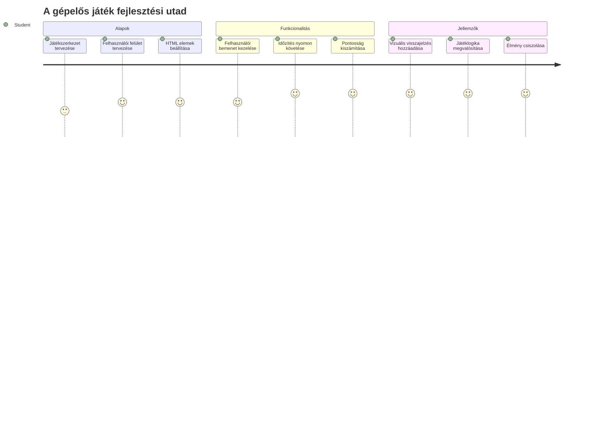
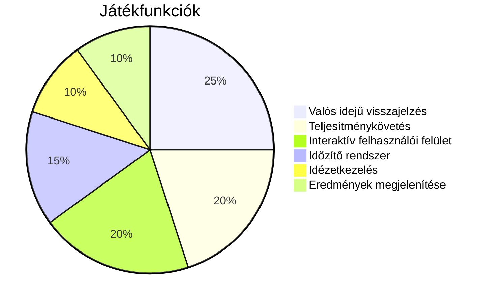
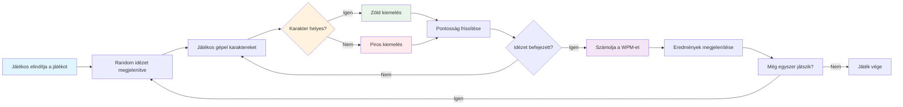
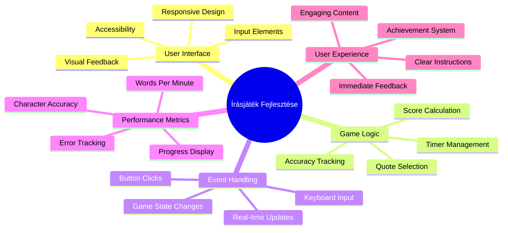
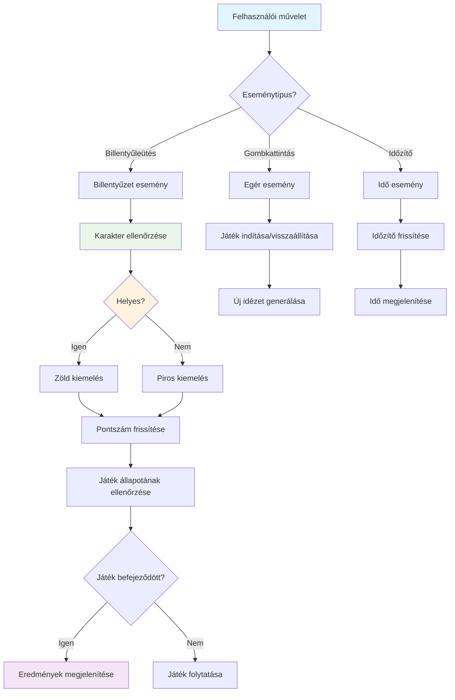
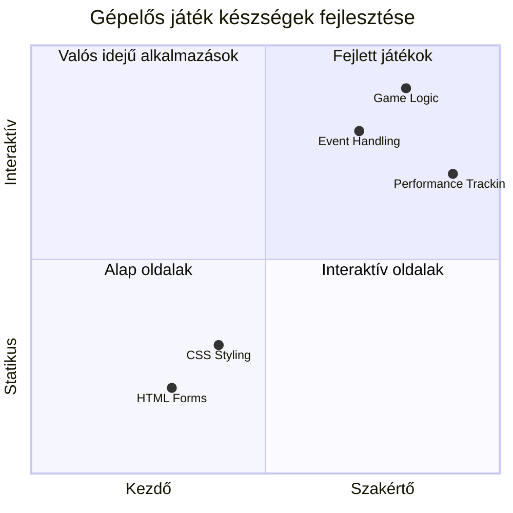
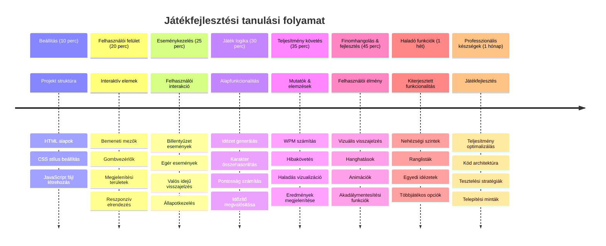

<!--
CO_OP_TRANSLATOR_METADATA:
{
  "original_hash": "efa2ab875b8bb5a7883816506da6b6d2",
  "translation_date": "2026-01-07T02:21:04+00:00",
  "source_file": "4-typing-game/README.md",
  "language_code": "hu"
}
-->
# Eseményvezérelt programozás - Készíts egy gépelős játékot

## Bevezetés

Itt van valami, amit minden fejlesztő tud, de ritkán beszél róla: gyorsan gépelni egy szuperképesség! 🚀 Gondolj csak bele – minél gyorsabban tudod az ötleteidet az agyadból a kódszerkesztőbe juttatni, annál jobban áramolhat a kreativitásod. Olyan, mintha közvetlen csővezeték lenne a gondolataid és a képernyő között.

Szeretnéd tudni a legjobb módszerek egyikét ennek a képességnek a fejlesztésére? Kitaláltad – készítünk egy játékot!

> Készítsünk együtt egy szuper gépelős játékot!

Készen állsz arra, hogy az összes eddig tanult JavaScript, HTML és CSS tudásodat bevetd? Olyan gépelős játékot fogunk készíteni, amely véletlenszerű idézetekkel tesztel téged a legendás detektív [Sherlock Holmes](https://en.wikipedia.org/wiki/Sherlock_Holmes) tollából. A játék követni fogja, milyen gyorsan és pontosan tudsz gépelni – és hidd el, ez sokkal addiktívabb, mint gondolnád!

## Amiket Tudnod Kell

Mielőtt belevágnánk, győződj meg róla, hogy ezekkel a fogalmakkal magabiztosan bánsz (ne aggódj, ha egy kis gyors ismétlés kell – mindannyian jártunk már így!):

- Szövegbeviteli mezők és gombok létrehozása
- CSS és osztályokkal történő stílusbeállítás  
- JavaScript alapok
  - Tömb létrehozása
  - Véletlenszám generálása
  - Aktuális idő lekérése

Ha valamelyik kicsit rozsdásnak tűnik, az teljesen rendben van! Néha a legjobb módja annak, hogy megszilárdítsd a tudásod, ha belevágsz egy projektbe, és menet közben fedezed fel a dolgokat.

### 🔄 **Pedagógiai ellenőrzés**
**Alapok felmérése**: Fejlesztés megkezdése előtt győződj meg róla, hogy érted a következőket:
- ✅ Hogyan működnek a HTML űrlapok és beviteli elemek
- ✅ CSS osztályok és dinamikus stílusok
- ✅ JavaScript eseményfigyelők és kezelők
- ✅ Tömb-kezelés és véletlenszerű kiválasztás
- ✅ Időmérés és számítások

**Gyors önellenőrzés**: El tudod magyarázni, hogyan működnek ezek a fogalmak együtt egy interaktív játékban?
- **Események** aktiválódnak, amikor a felhasználók interakcióba lépnek az elemekkel
- **Kezelők** feldolgozzák ezeket az eseményeket és frissítik a játék állapotát
- **CSS** vizuális visszajelzést ad a felhasználói műveletekre
- **Időzítés** lehetővé teszi a teljesítmény mérését és a játék előrehaladását

## Álljunk neki!

[Gépelős játék készítése eseményvezérelt programozással](./typing-game/README.md)

### ⚡ **Mit tehetsz az elkövetkező 5 percben**
- [ ] Nyisd meg a böngésző konzolt és próbálj meg billentyűzet eseményeket figyelni `addEventListener` segítségével
- [ ] Készíts egy egyszerű HTML oldalt egy beviteli mezővel, és teszteld a gépelés észlelését
- [ ] Gyakorold a szöveg manipulálását a begépelt és a célszöveg összehasonlításával
- [ ] Kísérletezz a `setTimeout`-tal, hogy megértsd az időzítő funkciókat

### 🎯 **Mit érhetsz el ebben az órában**
- [ ] Fejezd be az utólagos kvízt, és értsd meg az eseményvezérelt programozást
- [ ] Építsd fel a gépelős játék alapváltozatát szavas validációval
- [ ] Adj vizuális visszajelzést helyes és hibás gépelésre
- [ ] Valósíts meg egy egyszerű pontszám rendszert a sebesség és pontosság alapján
- [ ] Stílusold a játékot CSS segítségével, hogy vizuálisan vonzó legyen

### 📅 **Hétközbeni játékfejlesztés**
- [ ] Fejezd be a teljes gépelős játékot minden funkcióval és csiszolással
- [ ] Adj hozzá nehézségi szinteket változó szóbonyolultsággal
- [ ] Valósíts meg felhasználói statisztika követést (szavak per perc, pontosság az idő múlásával)
- [ ] Készíts hanghatásokat és animációkat a jobb felhasználói élményért
- [ ] Tedd mobilra optimalizálttá érintőképernyős eszközökhöz
- [ ] Oszd meg a játékod online, és gyűjts visszajelzést a felhasználóktól

### 🌟 **Hónapos interaktív fejlesztés**
- [ ] Építs több játékot, amelyek különböző interakciós mintákat vizsgálnak
- [ ] Tanulj meg játék ciklusokról, állapotkezelésről és teljesítmény-optimalizálásról
- [ ] Vegyél részt nyílt forráskódú játékfejlesztési projektekben
- [ ] Sajátítsd el az előrehaladott időzítési koncepciókat és a sima animációkat
- [ ] Hozz létre egy portfóliót, ami különféle interaktív alkalmazásokat mutat be
- [ ] Mentorálj másokat, akik érdeklődnek a játékfejlesztés és felhasználói interakció iránt

## 🎯 A gépelős játék mesteri ütemezése

### 🛠️ Játékfejlesztő eszköztárad összefoglalója

A projekt befejezése után elsajátítod:
- **Eseményvezérelt programozás**: Reagáló felhasználói felületek, amelyek válaszolnak a bemenetre
- **Valós idejű visszajelzés**: Azonnali vizuális és teljesítménybeli frissítések
- **Teljesítménymérés**: Pontos időzítés és pontozási rendszerek
- **Játékmenet állapotkezelés**: Az alkalmazás folyamatának és felhasználói élményének irányítása
- **Interaktív dizájn**: Lekötő, függőséget okozó felhasználói élmények készítése
- **Modern webes API-k**: Böngésző képességek kihasználása gazdag interakciókhoz
- **Akadálymentesítési minták**: Minden felhasználó számára befogadó tervezés

**Valós alkalmazási területek**: Ezek a képességek közvetlenül alkalmazhatók
- **Webes alkalmazások**: Bármilyen interaktív felület vagy irányítópult
- **Oktatási szoftverek**: Tanulási platformok és készségfelmérő eszközök
- **Hatékonyságnövelő eszközök**: Szövegszerkesztők, IDE-k és együttműködési szoftverek
- **Játékipar**: Böngészős játékok és interaktív szórakoztatás
- **Mobilfejlesztés**: Érintőképernyős felületek és gesztuskezelés

**Következő lépés**: Készen állsz, hogy felfedezd a fejlett játékszkripteket, valós idejű többszereplős rendszereket, vagy összetett interaktív alkalmazásokat!

## Köszönetnyilvánítás

Szerző: ♥️ [Christopher Harrison](http://www.twitter.com/geektrainer)

---

<!-- CO-OP TRANSLATOR DISCLAIMER START -->
**Jogi nyilatkozat**:
Ez a dokumentum az [Co-op Translator](https://github.com/Azure/co-op-translator) mesterséges intelligencia fordítószolgáltatásával készült. Bár a pontosságra törekszünk, kérjük, vegye figyelembe, hogy az automatikus fordítások hibákat vagy pontatlanságokat tartalmazhatnak. Az eredeti, anyanyelvi dokumentum tekintendő a hiteles forrásnak. Fontos információk esetén professzionális, emberi fordítást javasolunk. Nem vállalunk felelősséget az ebből eredő félreértésekért vagy téves értelmezésekért.
<!-- CO-OP TRANSLATOR DISCLAIMER END -->