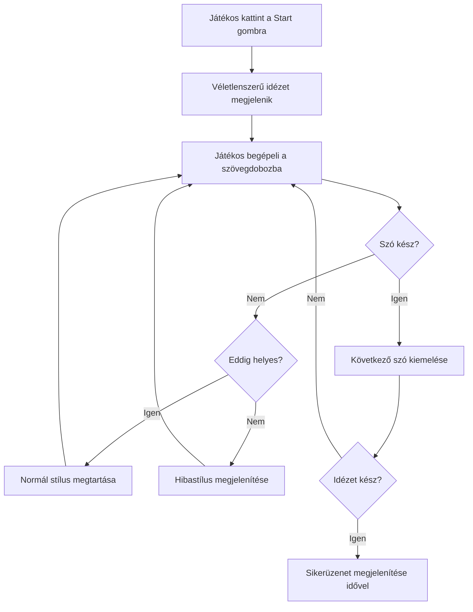
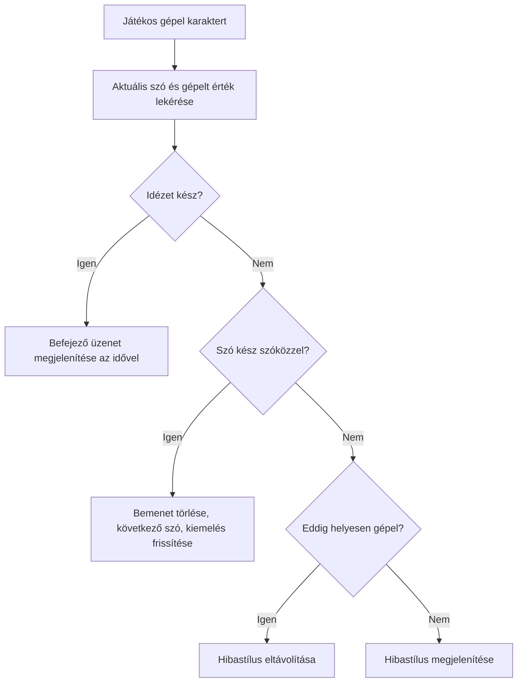
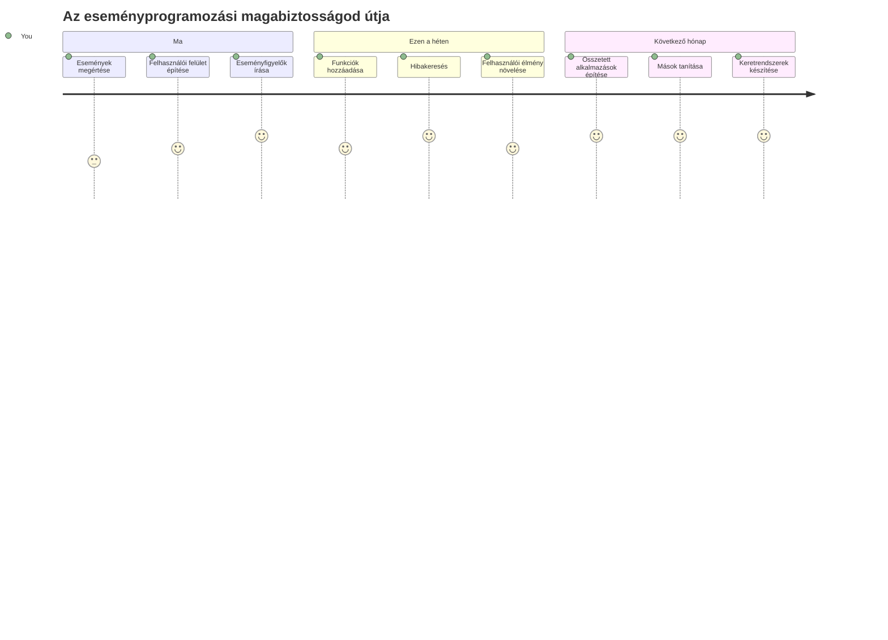

<!--
CO_OP_TRANSLATOR_METADATA:
{
  "original_hash": "da8bc72041a2bb3826a54654ee1a8844",
  "translation_date": "2026-01-07T03:03:13+00:00",
  "source_file": "4-typing-game/typing-game/README.md",
  "language_code": "hu"
}
-->
# Egy játék létrehozása eseményekkel

Gondolkodtál már valaha azon, hogyan tudják a weboldalak, mikor kattintasz egy gombra vagy gépelsz egy szövegdobozba? Ez az eseményvezérelt programozás varázsa! Mi lehet jobb módja ennek az alapvető készségnek az elsajátítására, mint egy hasznos dolog készítése – egy gépelési sebesség játék, amely minden billentyűleütésedre reagál.

Első kézből fogod látni, hogyan „beszélgetnek” a webböngészők a JavaScript kódoddal. Minden kattintás, gépelés vagy egérmozgás alkalmával a böngésző apró üzeneteket (ezeket nevezzük eseményeknek) küld a kódodnak, és te döntheted el, hogyan válaszolsz!

Amikor végeztünk, egy valódi gépelős játékot fogsz készíteni, amely méri a sebességedet és a pontosságodat. Ami még fontosabb, megérted azokat az alapvető fogalmakat, amelyeket minden interaktív weboldal használ, amit valaha használtál. Vágjunk bele!

## Előadás előtti kvíz

[Előadás előtti kvíz](https://ff-quizzes.netlify.app/web/quiz/21)

## Eseményvezérelt programozás

Gondolj a kedvenc alkalmazásodra vagy weboldaladra – mi teszi élővé és reagálóképessé? Minden arról szól, hogyan reagál arra, amit csinálsz! Minden érintés, kattintás, húzás vagy billentyűleütés eseményt hoz létre, és itt történik meg a webfejlesztés valódi varázsa.

Ez teszi a webes programozást különösen érdekessé: soha nem tudhatjuk, mikor kattintanak valakinek arra a gombra vagy kezdi el gépelni egy szövegdobozban. Azonnal kattinthatnak, várhatnak öt percet, vagy talán soha nem is kattintanak! Ez a kiszámíthatatlanság miatt másképp kell gondolkodnunk a kód írásáról.

Ahelyett, hogy a kódot fentről lefelé futó receptként írnánk meg, olyan kódot írunk, ami türelmesen várakozik, hogy valami megtörténjen. Ez hasonló ahhoz, ahogy az 1800-as években a távírógépesek ültek a gépük mellett, készen arra, hogy azonnal reagáljanak, amint üzenet érkezik a dróton keresztül.

De mi is az az „esemény”? Egyszerűen valami, ami történik! Amikor rákattintasz egy gombra – az egy esemény. Amikor beütöd egy betűt – az egy esemény. Amikor mozgatod az egeret – az is egy esemény.

Az eseményvezérelt programozás lehetővé teszi, hogy a kódunk hallgasson és reagáljon. Különleges függvényeket hozunk létre, amelyeket **eseményfigyelőknek** hívunk, és ezek türelmesen várnak, hogy bizonyos dolgok történjenek, majd akcióba lendülnek, amikor megtörténnek.

Gondolj az eseményfigyelőkre úgy, mint egy csengő a kódodhoz. Beállítod a csengőt (`addEventListener()`), megmondod neki, milyen hangot figyeljen (például 'click' vagy 'keypress'), majd megadod, mi történjen, ha valaki megnyomja (a saját függvényed).

**Így működnek az eseményfigyelők:**
- **Hallgatnak** specifikus felhasználói műveletekre, mint kattintás, billentyűleütés vagy egérmozgás
- **Futtatják** a saját kódodat, amikor a megadott esemény bekövetkezik
- **Azonnal reagálnak** a felhasználói interakciókra, zökkenőmentes élményt teremtve
- **Kezelnek** több eseményt ugyanazon az elemen különböző figyelők segítségével

> **MEGJEGYZÉS:** Érdemes kiemelni, hogy számos módja van eseményfigyelők létrehozásának. Használhatsz névtelen függvényeket, vagy nevezetteket. Használhatsz különböző rövidítéseket, például a `click` tulajdonság beállítását, vagy az `addEventListener()` használatát. A gyakorlatunkban az `addEventListener()` és névtelen függvények használatára fókuszálunk, mivel ez a leggyakoribb technika a webfejlesztők körében. Ez a legkevésbé kötött módszer, mivel az `addEventListener()` minden eseményre működik, és az esemény nevét paraméterként adhatod meg.

### Gyakori események

Bár a webböngészők több tucat különféle eseményt kínálnak, amelyekre figyelhetsz, a legtöbb interaktív alkalmazás csak néhány alapvető eseményre támaszkodik. Ezeknek az eseményeknek a megértése adja meg az alapokat a bonyolult felhasználói interakciókhoz.

Van [több tucat esemény](https://developer.mozilla.org/docs/Web/Events), amelyeket egy alkalmazás készítésekor hallgathatsz. Gyakorlatilag bármi, amit a felhasználó egy oldalon csinál, eseményt vált ki, ami nagy hatalmat ad arra, hogy biztosítsd számukra a kívánt élményt. Szerencsére általában csak pár eseményre van szükséged. Íme néhány gyakori (köztük az a kettő, amiket a játék készítésekor fogunk használni):

| Esemény | Leírás | Gyakori felhasználási módok |
|---------|--------|-----------------------------|
| `click` | A felhasználó valamire kattintott | Gombok, linkek, interaktív elemek |
| `contextmenu` | A felhasználó a jobb egérgombbal kattintott | Egyedi jobbklikk menük |
| `select` | A felhasználó kijelölt szöveget | Szövegszerkesztés, másolás |
| `input` | A felhasználó szöveget írt be | Űrlap ellenőrzés, valós idejű keresés |

**Ezeknek az eseménytípusoknak a megértése:**
- **Indul** el, amikor a felhasználók adott elemeket érintenek meg az oldalon
- **Részletes információkat szolgáltat** a felhasználói műveletről eseményobjektumokon keresztül
- **Lehetővé teszi** interaktív, reagáló webalkalmazások létrehozását
- **Működik** következetesen különböző böngészőkben és eszközökön

## A játék létrehozása

Most, hogy érted az események működését, tegyük is próbára ezt a tudást egy hasznos dolog elkészítésével. Létrehozunk egy gépelési sebesség játékot, amely bemutatja az eseménykezelést, miközben egy fontos fejlesztői készségedet fejleszti.

Egy játékot fogunk készíteni, hogy megvizsgáljuk az események működését JavaScript-ben. A játékunk egy játékos gépelési tudását fogja tesztelni, ami az egyik alulértékelt készség, amit minden fejlesztőnek érdemes elsajátítania. Érdekesség: a QWERTY billentyűzet-elrendezést, amit ma használunk, az 1870-es években tervezték gépírók számára – és a jó gépelési készségek ma is ugyanolyan értékesek a programozók számára! A játék általános menete így néz ki:


**Így fog működni a játékunk:**
- **Elindul**, amikor a játékos rákattint a start gombra, és megjelenik egy véletlenszerű idézet
- **Követi** a játékos gépelési folyamatát szóról szóra, valós időben
- **Kiemeli** az aktuális szót, hogy irányítsa a játékos figyelmét
- **Azonnali** vizuális visszajelzést ad a gépelési hibákra
- **Számolja** és megjeleníti az összes eltelt időt, amikor az idézet befejeződik

Készítsük el a játékot, és tanuljunk meg az eseményekről!

### Fájlstruktúra

Mielőtt kódolni kezdenénk, rendezkedjünk be! Ha már az elején tiszta fájlstruktúránk van, az később sok fejfájást megelőz, és profibbá teszi a projektedet. 😊

Egyszerűen tartjuk majd három fájlra: `index.html` a lap szerkezetéhez, `script.js` a játék logikájához, és `style.css` hogy szépen nézzen ki. Ez egy klasszikus trió, ami a legtöbb weboldalt működteti!

**Hozz létre egy új mappát a munkádhoz úgy, hogy nyitsz egy konzolt vagy terminált, és beírod a következő parancsot:**

```bash
# Linux vagy macOS
mkdir typing-game && cd typing-game

# Windows
md typing-game && cd typing-game
```

**Ezeknek a parancsoknak a funkciója:**
- **Létrehoz** egy új `typing-game` nevű könyvtárat a projekt fájljaidnak
- **Belép** automatikusan az újonnan létrehozott könyvtárba
- **Tiszta munkaterületet biztosít** a játék fejlesztéséhez

**Nyisd meg a Visual Studio Code-ot:**

```bash
code .
```

**Ez a parancs:**
- **Elindítja** a Visual Studio Code-ot az aktuális könyvtárban
- **Megnyitja** a projekt mappádat a szerkesztőben
- **Hozzáférést ad** az összes fejlesztői eszközhöz, amire szükséged lesz

**Add hozzá a mappához a következő három fájlt Visual Studio Code-ban:**
- `index.html` – tartalmazza a játék szerkezetét és tartalmát
- `script.js` – kezeli az összes játék logikát és eseményfigyelőt
- `style.css` – meghatározza a vizuális megjelenést és stílust

## Felhasználói felület létrehozása

Most építsük meg a színpadot, ahol az egész játék eseménye zajlik majd! Gondolj erre úgy, mint egy űrhajó vezérlőpultjának megtervezésére – biztosnak kell lennünk abban, hogy minden, amire a játékosoknak szükségük van, ott legyen, ahol elvárják.

Határozzuk meg, mire van szüksége a játékunknak. Ha te játszanál egy gépelős játékkal, mit szeretnél látni a képernyőn? Íme, amire szükségünk lesz:

| Felhasználói felület elem | Cél | HTML elem |
|---------------------------|-----|-----------|
| Idézet megjelenítő | Megjeleníti a begépelendő szöveget | `<p>` az `id="quote"`-tal |
| Üzenet terület | Állapot- és sikerüzeneteket mutat | `<p>` az `id="message"`-szel |
| Szövegbeviteli mező | Ahol a játékosok begépelik az idézetet | `<input>` az `id="typed-value"`-val |
| Start gomb | Elindítja a játékot | `<button>` az `id="start"`-tal |

**A felhasználói felület szerkezetének megértése:**
- **Logikusan szervezi** a tartalmat fentről lefelé
- **Egyedi ID-ket rendel** az elemekhez a JavaScript használatához
- **Világos vizuális hierarchiát ad** a jobb felhasználói élményhez
- **Tartalmaz** szemantikus HTML elemeket a jobb hozzáférhetőség érdekében

Mindegyik elemhez ID-k kellenek, hogy dolgozni tudjunk velük JavaScriptből. Hivatkozásokat is hozzá fogunk adni az általunk készítendő CSS és JavaScript fájlokra.

Hozz létre egy új fájlt `index.html` néven, majd illeszd be a következő HTML-t:

```html
<!-- inside index.html -->
<html>
<head>
  <title>Typing game</title>
  <link rel="stylesheet" href="style.css">
</head>
<body>
  <h1>Typing game!</h1>
  <p>Practice your typing skills with a quote from Sherlock Holmes. Click **start** to begin!</p>
  <p id="quote"></p> <!-- This will display our quote -->
  <p id="message"></p> <!-- This will display any status messages -->
  <div>
    <input type="text" aria-label="current word" id="typed-value" /> <!-- The textbox for typing -->
    <button type="button" id="start">Start</button> <!-- To start the game -->
  </div>
  <script src="script.js"></script>
</body>
</html>
```

**Mit valósít meg ez a HTML szerkezet?**
- **Csatolja** a CSS stíluslapot a `<head>` szekcióban a formázáshoz
- **Készít** világos címet és használati útmutatót a felhasználóknak
- **Létrehoz** helyőrző bekezdéseket specifikus ID-kkel dinamikus tartalomhoz
- **Tartalmaz** egy bevitel mezőt elérhetőségi attribútumokkal
- **Biztosít** egy start gombot a játék elindításához
- **Betölti** a JavaScript fájlt a végén az optimális teljesítmény érdekében

### Az alkalmazás elindítása

A fejlesztés közbeni gyakori tesztelés segít időben elkapni a hibákat, és valós időben látni az előrehaladást. A Live Server egy felbecsülhetetlen eszköz, amely automatikusan frissíti a böngészőt, amikor módosításokat mentesz, így sokkal hatékonyabbá teszi a fejlesztést.

Mindig érdemes iteratívan fejleszteni, hogy lásd, hogyan néz ki. Indítsuk el az alkalmazást. Van egy remek bővítmény a Visual Studio Code-hoz, a [Live Server](https://marketplace.visualstudio.com/items?itemName=ritwickdey.LiveServer&WT.mc_id=academic-77807-sagibbon), amely helyi szerverként szolgál, és minden mentéskor frissíti a böngészőt.

**Telepítsd a [Live Server](https://marketplace.visualstudio.com/items?itemName=ritwickdey.LiveServer&WT.mc_id=academic-77807-sagibbon) bővítményt a linken, majd kattints a Telepítés gombra:**

**Ez történik a telepítés közben:**
- **Megnyitja** a böngésződ a Visual Studio Code megnyitásához
- **Végigvezet** az installáció folyamatán
- **Előfordulhat**, hogy újra kell indítanod a Visual Studio Code-ot a telepítés befejezéséhez

**Telepítés után a Visual Studio Code-ban nyomd meg Ctrl-Shift-P-t (vagy Cmd-Shift-P-t), hogy megnyisd a parancs palettát:**

**A parancs paletta lényege:**
- **Gyors hozzáférést biztosít** az összes VS Code parancshoz
- **Keresést végez** gépelés közben
- **Billentyűparancsokat kínál** a gyorsabb fejlesztésért

**Írd be: „Live Server: Open with Live Server”:**

**A Live Server a következőket teszi:**
- **Indít** egy helyi fejlesztői szervert a projektedhez
- **Automatikusan** frissíti a böngészőt a fájlok mentésekor
- **Lokálisan szolgálja ki** a fájlokat URL-en (általában `localhost:5500`)

**Nyiss meg egy böngészőt, és navigálj a `https://localhost:5500` címre:**

Most már látnod kell az általad létrehozott oldalt! Adjunk hozzá némi funkcionalitást.

## CSS hozzáadása

Most pedig tegyük széppé a dolgokat! A vizuális visszajelzés már a számítástechnika korai napjaitól kulcsfontosságú volt a felhasználói felületekben. Az 1980-as évek kutatói felfedezték, hogy az azonnali vizuális visszajelzés drámaian javítja a felhasználók teljesítményét és csökkenti a hibákat. Pontosan ezt fogjuk létrehozni.

A játékunknak kristálytisztán kell megmutatnia, mi történik. A játékosoknak azonnal tudniuk kell, melyik szót kell gépelniük, és ha hibáznak, azt azonnal látniuk kell. Készítsünk egyszerű, de hatékony stílusokat:

Hozz létre egy új fájlt `style.css` néven, és illeszd be a következő szintaxist.

```css
/* inside style.css */
.highlight {
  background-color: yellow;
}

.error {
  background-color: lightcoral;
  border: red;
}
```

**Mit csinálnak ezek a CSS osztályok:**
- **Kiemelik** az aktuális szót sárga háttérrel a világos vizuális irányításért
- **Jelezik** a gépelési hibákat világos korall színű háttérrel
- **Azonnali visszajelzést adnak** anélkül, hogy zavarnák a gépelési folyamatot
- **Kontrasztos színeket használnak** az akadálymentesség és egyértelmű kommunikáció érdekében

✅ Ami a CSS-t illeti, az oldalt úgy alakíthatod, ahogy csak szeretnéd. Szánj egy kis időt, és tedd vonzóbbá az oldalt:

- Válassz más betűtípust
- Színezd ki a címeket
- Méretezd át az elemeket

## JavaScript

Most jönnek az érdekes részek! 🎉 Megvan a HTML szerkezetünk és a CSS stílusunk, de jelenleg a játék olyan, mint egy szép autó motor nélkül. A JavaScript lesz a motor – ő teszi lehetővé, hogy minden ténylegesen működjön és reagáljon a játékosok cselekedeteire.

Itt fogod látni, hogyan kel életre a kreációd. Lépésről lépésre fogunk haladni, hogy ne legyen túlterhelő:

| Lépés | Cél | Mit tanulsz |
|-------|-----|-------------|
| [Konstansok létrehozása](../../../../4-typing-game/typing-game) | Idézetek és DOM hivatkozások beállítása | Változókezelés és DOM kiválasztás |
| [Eseményfigyelő a játék indításához](../../../../4-typing-game/typing-game) | A játék inicializálásának kezelése | Eseménykezelés és UI frissítések |
| [Eseményfigyelő a gépeléshez](../../../../4-typing-game/typing-game) | Felhasználói bemenet valós idejű feldolgozása | Bemenet ellenőrzése és dinamikus visszajelzés |

**Ez a strukturált megközelítés segít neked:**
- **Logikus, kezelhető részekre bontani** a kódodat
- **Lépésenként felépíteni** a funkcionalitást, így könnyebb hibákat keresni
- **Megérteni, hogyan működnek együtt** az alkalmazás különböző részei
- **Ismételhető mintákat létrehozni** jövőbeli projektekhez

De először hozz létre egy új fájlt `script.js` néven.

### Konstansok hozzáadása

Mielőtt belevágnánk az akcióba, gyűjtsük össze az összes erőforrásunkat! Pont úgy, ahogy a NASA irányítóközpontja előkészíti a megfigyelő rendszereket a kilövés előtt, sokkal könnyebb, ha mindennel fel vagy készülve és készen állsz. Így később nem kell keresgélned, és elkerülöd az elírásokat.

Először ezt kell beállítanunk:

| Adattípus | Cél | Példa |
| Idézetek tömbje | Az összes lehetséges idézet tárolása a játék számára | `['Idézet 1', 'Idézet 2', ...]` |
| Szó tömb | Az aktuális idézet szavakra bontása | `['Amikor', 'te', 'vagy', ...]` |
| Szó index | Következze nyomon, melyik szót gépeli a játékos | `0, 1, 2, 3...` |
| Kezdési idő | Az eltelt idő kiszámítása a pontozáshoz | `Date.now()` |

**Szükségünk lesz hivatkozásokra a felhasználói felület elemeihez:**
| Elem | ID | Cél |
|---------|----|---------|
| Szövegbeviteli mező | `typed-value` | Itt gépelnek a játékosok |
| Idézet megjelenítés | `quote` | Megjeleníti az leütendő idézetet |
| Üzenet terület | `message` | Állapotfrissítéseket jelenít meg |

```javascript
// a script.js fájlban
// az összes idézetünk
const quotes = [
    'When you have eliminated the impossible, whatever remains, however improbable, must be the truth.',
    'There is nothing more deceptive than an obvious fact.',
    'I ought to know by this time that when a fact appears to be opposed to a long train of deductions it invariably proves to be capable of bearing some other interpretation.',
    'I never make exceptions. An exception disproves the rule.',
    'What one man can invent another can discover.',
    'Nothing clears up a case so much as stating it to another person.',
    'Education never ends, Watson. It is a series of lessons, with the greatest for the last.',
];
// tárolja a szavak listáját és a jelenleg gépelt szó indexét
let words = [];
let wordIndex = 0;
// a kezdő idő
let startTime = Date.now();
// az oldal elemei
const quoteElement = document.getElementById('quote');
const messageElement = document.getElementById('message');
const typedValueElement = document.getElementById('typed-value');
```

**Vizsgáljuk meg, mit valósít meg ez a beállító kód:**
- **Tárol** egy Sherlock Holmes idézeteket tartalmazó tömböt `const`-tal, mivel az idézetek nem változnak
- **Inicializál** követő változókat `let`-tel, mert ezek értékei a játék során frissülnek
- **Megszerez** hivatkozásokat DOM elemekre `document.getElementById()`-val a hatékony hozzáférésért
- **Kiépít** minden játékfunkció alapját világos, leíró változónevekkel
- **Logikusan szervez** adatok és elemek összefüggéseit a könnyebb kódkarbantartás érdekében

✅ Folytasd az idézetek hozzáadását a játékodhoz

> 💡 **Pro Tipp**: A `document.getElementById()` segítségével bármikor lekérhetjük az elemeket a kódban. Mivel gyakran hivatkozunk ezekre az elemekre, ajánlott a hibák elkerülése végett konstansokat használni a string literálok helyett. Frameworkök, mint a [Vue.js](https://vuejs.org/) vagy a [React](https://reactjs.org/) segíthetnek a kód központosabb kezelésében.
>
**Ezért működik ez a megközelítés kiválóan:**
- **Megelőzi** a helyesírási hibákat, amikor többször hivatkozunk az elemekre
- **Javítja** a kód olvashatóságát leíró konstansnevekkel
- **Lehetővé teszi** jobb IDE támogatást automatikus kiegészítéssel és hibajelzéssel
- **Megkönnyíti** az átalakítást, ha később változnak az elemazonosítók

Szánj egy percet, hogy megnézz egy videót a `const`, `let` és `var` használatáról

[](https://youtube.com/watch?v=JNIXfGiDWM8 "Változók típusai")

> 🎥 Kattints a fenti képre egy változókról szóló videóhoz.

### Add hozzá az indítási logikát

Itt áll össze minden a helyére! 🚀 Éppen az első valódi eseményfigyelődet írod, és elégedettséggel tölt el látni, ahogy a kódodon gombnyomásra reagál.

Gondolj bele: valahol egy játékos rányom a "Start" gombra, és a kódodnak készen kell állnia. Fogalmunk sincs, mikor nyomja meg – lehet rögtön, vagy egy kávé után –, de amikor megteszi, azonnal életre kel a játék.

Amikor a felhasználó a `start`-ot kattintja, ki kell választanunk egy idézetet, be kell állítanunk a felhasználói felületet, valamint követni kell az aktuális szót és az időzítést. Lentebb megtalálod a szükséges JavaScript kódot; az alatt részletesen átbeszéljük.

```javascript
// a script.js végén
document.getElementById('start').addEventListener('click', () => {
  // szerezzen be egy idézetet
  const quoteIndex = Math.floor(Math.random() * quotes.length);
  const quote = quotes[quoteIndex];
  // Tegye az idézetet egy szavakból álló tömbbe
  words = quote.split(' ');
  // állítsa alaphelyzetbe a szóindexet a követéshez
  wordIndex = 0;

  // Felhasználói felület frissítése
  // Hozzon létre egy span elemekből álló tömböt, hogy osztályt tudjunk beállítani
  const spanWords = words.map(function(word) { return `<span>${word} </span>`});
  // Alakítsa stringgé és állítsa be a quote display innerHTML-jeként
  quoteElement.innerHTML = spanWords.join('');
  // Emelje ki az első szót
  quoteElement.childNodes[0].className = 'highlight';
  // Törölje az előző üzeneteket
  messageElement.innerText = '';

  // Állítsa be a szövegdobozt
  // Törölje a szövegdobozt
  typedValueElement.value = '';
  // állítsa a fókuszt
  typedValueElement.focus();
  // állítsa be az eseménykezelőt

  // Indítsa el az órát
  startTime = new Date().getTime();
});
```

**Daraboljuk szét a kódot logikai részekre:**

**📊 Szókövetés beállítása:**
- **Kiválaszt** véletlenszerű idézetet a `Math.floor()` és `Math.random()` segítségével a változatosságért
- **Átalakítja** az idézetet egy-egy szóra bontott tömbbé a `split(' ')` használatával
- **Visszaállítja** a `wordIndex` értékét 0-ra, mert a játékos az első szóval kezd
- **Előkészíti** a játékállapotot egy új körhöz

**🎨 UI beállítása és megjelenítés:**
- **Létrehoz** egy tömböt `<span>` elemekből, amelyek az egyes szavakat egyenként stylingolják
- **Összefűzi** a span elemeket egyetlen sztringgé a hatékony DOM-frissítésért
- **Kiemeli** az első szót a `highlight` CSS osztály hozzáadásával
- **Törli** az előző játéküzeneteket, hogy tiszta állapot legyen

**⌨️ Szövegmező előkészítése:**
- **Kitörli** a beviteli mező tartalmát
- **A fókuszt a szövegmezőre állítja**, hogy a játékos azonnal kezdhesse a gépelést
- **Felállítja** a mezőt az új játékhoz

**⏱️ Időmérő inicializálása:**
- **Lekéri** az aktuális időbélyeget `new Date().getTime()` segítségével
- **Lehetővé teszi** a gépelési sebesség és befejezési idő pontos mérését
- **Elindítja** a játék teljesítménykövetését

### Add hozzá a gépelési logikát

Itt érünk a játék szívéhez! Ne aggódj, ha elsőre soknak tűnik – lépésről lépésre átvesszük, és a végére látni fogod, mennyire logikus az egész.

Egy fejlett rendszert építünk: minden egyes betű leütésekor a kód ellenőrzi a beírt értéket, visszajelzést ad, és eldönti, mi történjen tovább. Ez hasonlít az 1970-es évekbeli WordStarhoz hasonló szövegszerkesztők valós idejű visszajelzésére.

```javascript
// a script.js végén
typedValueElement.addEventListener('input', () => {
  // Az aktuális szó lekérése
  const currentWord = words[wordIndex];
  // az aktuális érték lekérése
  const typedValue = typedValueElement.value;

  if (typedValue === currentWord && wordIndex === words.length - 1) {
    // a mondat vége
    // Siker megjelenítése
    const elapsedTime = new Date().getTime() - startTime;
    const message = `CONGRATULATIONS! You finished in ${elapsedTime / 1000} seconds.`;
    messageElement.innerText = message;
  } else if (typedValue.endsWith(' ') && typedValue.trim() === currentWord) {
    // a szó vége
    // a typedValueElement törlése az új szóhoz
    typedValueElement.value = '';
    // lépés a következő szóra
    wordIndex++;
    // az osztálynév visszaállítása az összes quote elemen
    for (const wordElement of quoteElement.childNodes) {
      wordElement.className = '';
    }
    // az új szó kiemelése
    quoteElement.childNodes[wordIndex].className = 'highlight';
  } else if (currentWord.startsWith(typedValue)) {
    // jelenleg helyes
    // a következő szó kiemelése
    typedValueElement.className = '';
  } else {
    // hibás állapot
    typedValueElement.className = 'error';
  }
});
```

**A gépelési logika folyamata:**

Ez a függvény vízesés-szerűen vizsgálja a feltételeket a legspecifikusabból a legáltalánosabb felé. Nézzük az egyes eseteket:


**🏁 Idézet befejezve (1. eset):**
- **Ellenőrzi**, hogy a gépelt érték megegyezik-e a jelenlegi szóval ÉS az utolsó szónál vagyunk-e
- **Kiszámolja** az eltelt időt a kezdési idő és az aktuális idő különbségeként
- **Átváltja** az ezredmásodperceket másodpercre osztással 1 000-rel
- **Megjeleníti** a gratuláló üzenetet a befejezési idővel együtt

**✅ Szó befejezve (2. eset):**
- **Észleli** a szó befejezését a szóköz beírásával a végén
- **Ellenőrzi**, hogy a levágott input pontosan megegyezik-e a szóval
- **Kitisztítja** a beviteli mezőt a következő szóhoz
- **Lépteti** a `wordIndex`-et az új szóra
- **Frissíti** a vizuális kiemelést, eltávolítva minden osztályt és kiemelve az új szót

**📝 Gépelés folyamatban (3. eset):**
- **Ellenőrzi**, hogy a jelenlegi szó kezdete megegyezik-e az eddig begépelt karakterekkel
- **Eltávolítja** az esetleges hibastílusokat a helyes gépelés jelzésére
- **Engedi** a további gépelést zavarás nélkül

**❌ Hibás állapot (4. eset):**
- **Aktiválódik**, ha a begépelt szöveg nem egyezik az elvárt szó kezdetével
- **Hozzáadja** az error CSS osztályt az azonnali vizuális visszajelzéshez
- **Segíti** a játékosokat a hibák gyors felismerésében és javításában

## Teszteld az alkalmazásod

Nézd, mit értél el! 🎉 Egy valódi, működő gépelős játékot építettél eseményvezérelt programozással. Szánj egy percet, hogy ezt értékeld – nem kis teljesítmény!

Most következik a tesztelés! Vajon működik-e elvárás szerint? Kimaradt valami? Ez teljesen normális, ha nem tökéletes elsőre. Még a tapasztalt fejlesztők is találnak hibákat a kódjukban rendszeresen. Ez a fejlesztési folyamat része!

Kattints a `start`-ra, és kezdj el gépelni! Olyan lesz, mint az előző animáción láttuk.


**Mit érdemes tesztelni az alkalmazásban:**
- **Ellenőrzi**, hogy a Start-ra kattintva egy véletlenszerű idézet jelenik meg
- **Megerősíti**, hogy gépelés közben a jelenlegi szó megfelelően kiemelt
- **Ellenőrzi**, hogy a hibás gépelés hibastílust kap
- **Biztosítja**, hogy a szavak befejezése megfelelően lépteti a kiemelést
- **Teszteli**, hogy az idézet befejezésekor megjelenik a befejezési üzenet és az időzítés

**Tipikus hibakeresési tanácsok:**
- **Nézd meg** a böngésző konzolját (F12) JavaScript hibákért
- **Ellenőrizd**, hogy az összes fájlnév pontosan egyezik (kis- és nagybetű érzékeny)
- **Biztosítsd**, hogy a Live Server fut és megfelelően frissít
- **Tesztelj** több idézettel a véletlenszerű kiválasztás teszteléséhez

---

## GitHub Copilot Agent kihívás 🎮

Az Agent mód használatával teljesítsd a következő kihívást:

**Leírás:** Bővítsd a gépelős játékot egy nehézségi rendszerrel, amely a játékos teljesítménye alapján állítja be a játékmenetet. Ez a kihívás fejlett eseménykezelés, adat-elemzés és dinamikus UI-frissítések gyakorlását segíti.

**Feladat:** Hozz létre egy nehézségi beállító rendszert a gépelős játékhoz, amely:
1. Követi a játékos gépelési sebességét (szavak percenként) és pontossági százalékát
2. Automatikusan vált három nehézségi szint között: Könnyű (egyszerű idézetek), Közepes (jelenlegi idézetek), Nehéz (bonyolult idézetek írásjelekkel)
3. Megjeleníti az aktuális nehézségi szintet és a játékos statisztikáit a UI-n
4. Bevezet egy sorozatszámlálót, amely 3 egymás utáni jó teljesítmény után növeli a nehézséget
5. Vizualizációs visszajelzést ad (színek, animációk) a nehézség változásáról

Adj hozzá szükséges HTML elemeket, CSS stílusokat és JavaScript funkciókat a funkció megvalósításához. Alkalmazz megfelelő hibakezelést, és gondoskodj arról, hogy a játék ARIA címkékkel továbbra is elérhető maradjon.

További infó az [agent mód használatáról](https://code.visualstudio.com/blogs/2025/02/24/introducing-copilot-agent-mode).

## 🚀 Kihívás

Készen állsz, hogy a gépelős játékodat a következő szintre emeld? Próbáld meg megvalósítani ezeket a fejlett funkciókat az eseménykezelés és DOM manipuláció mélyebb megértése érdekében:

**További funkciók hozzáadása:**

| Funkció | Leírás | Gyakorolt készségek |
|---------|-------------|------------------------|
| **Beviteli vezérlés** | A `input` esemény figyelőjének letiltása befejezéskor, és újraengedélyezése gombra kattintáskor | Eseménykezelés és állapotvezérlés |
| **UI állapotkezelés** | A szövegmező letiltása, ha a játékos befejezte az idézetet | DOM tulajdonságok manipulálása |
| **Modal párbeszédablak** | Modal ablak megjelenítése sikerüzenettel | Haladó UI minták és akadálymentesség |
| **Legjobb eredmény rendszer** | Eredmények tárolása `localStorage` segítségével | Böngésző tároló API-k és adatmegőrzés |

**Megvalósítási tippek:**
- **Ismerkedj meg** a `localStorage.setItem()` és `localStorage.getItem()` használatával tartós tároláshoz
- **Gyakorold** eseményfigyelők dinamikus hozzáadását és eltávolítását
- **Fedezd fel** az HTML dialog elemeket vagy CSS modal mintákat
- **Figyelj** az akadálymentességre a beviteli vezérlők letiltásakor és engedélyezésekor

## Előadás utáni kvíz

[Előadás utáni kvíz](https://ff-quizzes.netlify.app/web/quiz/22)

---

## 🚀 A te gépelős játék mesterképezésed idővonala

### ⚡ **Mit tehetsz a következő 5 percben**
- [ ] Teszteld a gépelős játékodat különböző idézetekkel, hogy zökkenőmentesen működik-e
- [ ] Kísérletezz a CSS stílussal – próbáld meg változtatni a kiemelés és a hibaszínt
- [ ] Nyisd meg a böngésződ DevTools-át (F12) és figyeld a Konzolt játék közben
- [ ] Próbáld meg a lehető leggyorsabban befejezni egy idézetet

### ⏰ **Mit érhetsz el ezen az órán**
- [ ] Adj még idézeteket a tömbhöz (akár kedvenc könyveidből vagy filmjeidből)
- [ ] Valósítsd meg a legjobb eredmény rendszert `localStorage`-ből a kihívás szekció szerint
- [ ] Készíts szavak per perc kalkulátort, amely megjelenik minden játék végén
- [ ] Adj hanghatásokat helyes gépeléshez, hibához és játék befejezéséhez

### 📅 **Hét napos kalandod**
- [ ] Építs többjátékos verziót, ahol barátok szópárbajban versenyezhetnek
- [ ] Hozz létre különböző nehézségi szinteket változó idézetbonyolultsággal
- [ ] Adj előrehaladási sávot, ami mutatja, mennyit gépeltél az idézetből
- [ ] Valósíts meg felhasználói fiókokat személyes statisztika követéssel
- [ ] Tervezzen egyedi témákat és hagyd, hogy a felhasználók választhassanak stílust

### 🗓️ **Havi átalakulásod**
- [ ] Alkoss gépelős tanfolyamot leckékkel, amelyek fokozatosan tanítják meg az ujjelhelyezést
- [ ] Építs elemző rendszert, amely megmutatja, mely betűk vagy szavak okoznak legtöbb hibát
- [ ] Adj támogatást különböző nyelvekhez és billentyűzetkiosztásokhoz
- [ ] Integráld oktatási API-kkal, hogy idézeteket húzz irodalmi adatbázisokból
- [ ] Tedd közzé továbbfejlesztett gépelős játékodat mások számára

### 🎯 **Utolsó önreflexió**

**Mielőtt továbblépnél, ünnepeld meg ezeket:**
- Mi volt a legkielégítőbb pillanat a játék építése közben?
- Hogy érzed magad az eseményvezérelt programozás kapcsán most, a kezdetekhez képest?
- Mi az az egy funkció, amit izgatottan vársz, hogy beépíts, hogy a játék egyedi legyen?
- Hogyan alkalmazhatod az eseménykezelési fogalmakat más projektekben?


> 🌟 **Emlékezz rá**: Mostanra elsajátítottad azt az egyik legfontosabb koncepciót, amely minden interaktív weboldal és alkalmazás alapja. Az eseményvezérelt programozás ad életet és rugalmasságot a webnek. Minden egyes dropdown menü, valós idejű űrlapvalidáció, vagy kattintásra reagáló játék mögött ez a varázslat áll. Nem csupán kódolni tanulsz – élményeket hozol létre, amelyek intuitívak és lebilincselőek! 🎉

---

## Áttekintés & Önálló tanulás

Olvasd el [az összes elérhető eseményt](https://developer.mozilla.org/docs/Web/Events), amelyeket a böngésző biztosít fejlesztőknek, és gondolkodj el, mikor melyiket érdemes használni.

## Feladat

[Hozz létre egy új billentyűzetes játékot](assignment.md)

---

<!-- CO-OP TRANSLATOR DISCLAIMER START -->
**Felelősségkizárás**:
Ez a dokumentum az AI fordító szolgáltatás [Co-op Translator](https://github.com/Azure/co-op-translator) segítségével készült. Bár a pontosságra törekszünk, kérjük, vegye figyelembe, hogy az automatikus fordítások hibákat vagy pontatlanságokat tartalmazhatnak. Az eredeti dokumentum az anyanyelvén tekinthető hivatalos forrásnak. Fontos információk esetén professzionális, emberi fordítást javaslunk. Nem vállalunk felelősséget az ebből eredő félreértésekért vagy félreértelmezésekért.
<!-- CO-OP TRANSLATOR DISCLAIMER END -->