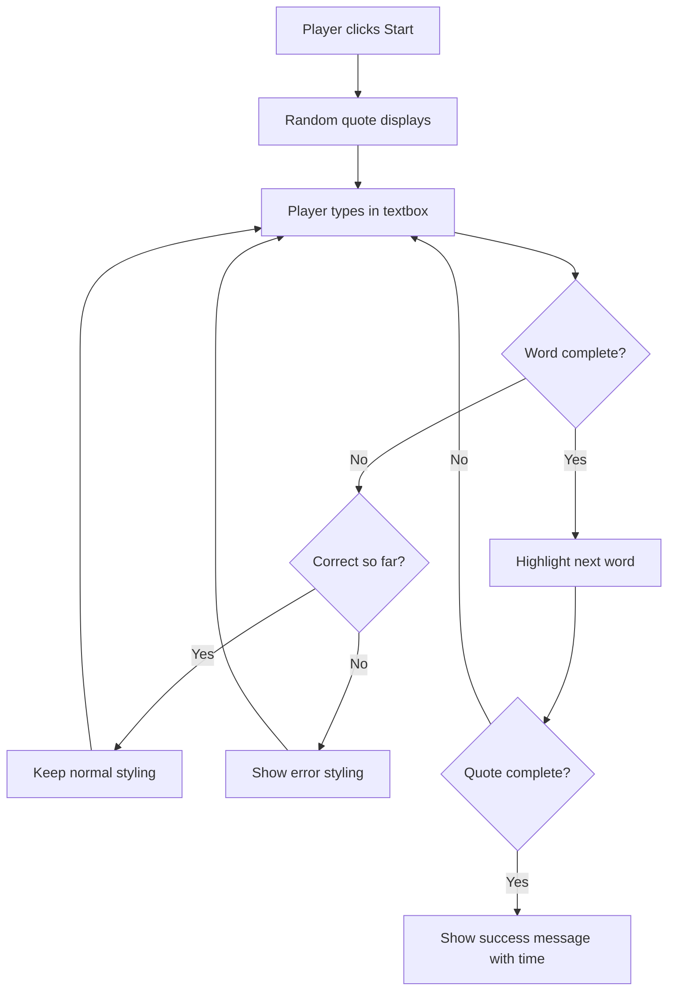
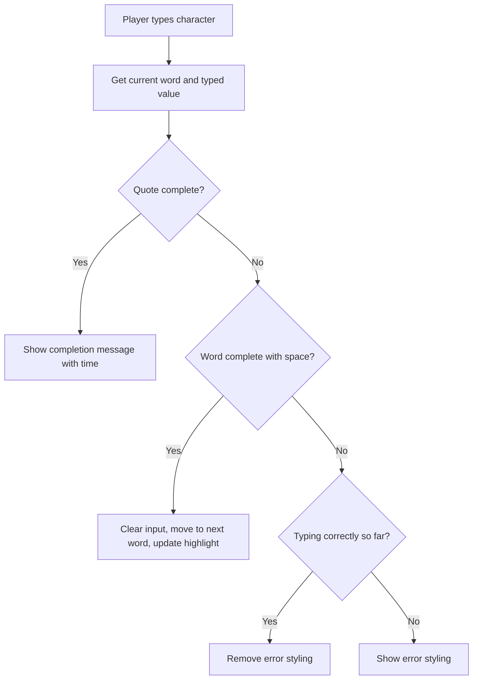

<!--
CO_OP_TRANSLATOR_METADATA:
{
  "original_hash": "e6b75e5b8caae906473a8a09d77b7121",
  "translation_date": "2025-10-24T20:27:48+00:00",
  "source_file": "4-typing-game/typing-game/README.md",
  "language_code": "hu"
}
-->
# Játék készítése események segítségével

Gondolkodtál már azon, hogyan tudják a weboldalak, hogy mikor kattintasz egy gombra vagy írsz egy szövegdobozba? Ez az eseményvezérelt programozás varázsa! Mi lenne, ha ezt az alapvető készséget egy hasznos dolog építésével tanulnád meg – egy gépelési sebesség játékot, amely reagál minden billentyűleütésedre.

Első kézből fogod látni, hogyan "beszélnek" a webböngészők a JavaScript kódoddal. Minden alkalommal, amikor kattintasz, gépelsz vagy mozgatod az egeret, a böngésző apró üzeneteket küld (ezeket eseményeknek nevezzük) a kódodnak, és te döntöd el, hogyan reagálj rájuk!

Mire végeztünk, egy valódi gépelési játékot fogsz létrehozni, amely nyomon követi a sebességedet és pontosságodat. Ennél is fontosabb, hogy megérted az alapvető koncepciókat, amelyek minden interaktív weboldalt működtetnek, amit valaha használtál. Merüljünk el benne!

## Előadás előtti kvíz

[Előadás előtti kvíz](https://ff-quizzes.netlify.app/web/quiz/21)

## Eseményvezérelt programozás

Gondolj a kedvenc alkalmazásodra vagy weboldaladra – mi teszi élővé és reszponzívvá? Az, ahogyan reagál arra, amit csinálsz! Minden érintés, kattintás, húzás vagy billentyűleütés egy "eseményt" hoz létre, és itt történik a webfejlesztés igazi varázsa.

Ami a webes programozást igazán érdekessé teszi, az az, hogy sosem tudjuk, mikor kattint valaki arra a gombra, vagy kezd el gépelni egy szövegdobozba. Lehet, hogy azonnal kattint, vár öt percet, vagy soha nem kattint! Ez a kiszámíthatatlanság azt jelenti, hogy másképp kell gondolkodnunk arról, hogyan írjuk meg a kódunkat.

Ahelyett, hogy olyan kódot írnánk, amely receptként felülről lefelé fut, olyan kódot írunk, amely türelmesen vár, hogy valami történjen. Ez hasonló ahhoz, ahogyan a 1800-as években a távírókezelők ültek a gépeik mellett, készen arra, hogy válaszoljanak, amint egy üzenet érkezett a dróton.

Tehát mi is pontosan az "esemény"? Egyszerűen fogalmazva, ez valami, ami történik! Amikor kattintasz egy gombra – az egy esemény. Amikor beírsz egy betűt – az egy esemény. Amikor mozgatod az egeret – az egy másik esemény.

Az eseményvezérelt programozás lehetővé teszi, hogy a kódunk hallgasson és reagáljon. Különleges funkciókat hozunk létre, amelyeket **eseményfigyelőknek** nevezünk, amelyek türelmesen várnak bizonyos dolgok megtörténésére, majd akcióba lépnek, amikor ezek bekövetkeznek.

Gondolj az eseményfigyelőkre úgy, mint egy csengőre a kódod számára. Beállítod a csengőt (`addEventListener()`), megmondod neki, milyen hangot hallgasson (például 'click' vagy 'keypress'), majd meghatározod, mi történjen, amikor valaki megnyomja (a saját funkciódat).

**Így működnek az eseményfigyelők:**
- **Figyelnek** bizonyos felhasználói műveletekre, mint kattintások, billentyűleütések vagy egérmozgások
- **Végrehajtják** a saját kódodat, amikor a megadott esemény bekövetkezik
- **Azonnal reagálnak** a felhasználói interakciókra, zökkenőmentes élményt teremtve
- **Kezelnek** több eseményt ugyanazon az elemen különböző figyelők segítségével

> **NOTE:** Érdemes kiemelni, hogy számos módja van eseményfigyelők létrehozásának. Használhatsz névtelen függvényeket, vagy létrehozhatsz névvel ellátottakat. Használhatsz különböző rövidítéseket, például a `click` tulajdonság beállítását, vagy az `addEventListener()` használatát. A gyakorlatban az `addEventListener()`-re és névtelen függvényekre fogunk koncentrálni, mivel ez a webfejlesztők által leggyakrabban használt technika. Ez a legflexibilisebb is, mivel az `addEventListener()` minden eseményhez működik, és az esemény neve paraméterként megadható.

### Gyakori események

Bár a webböngészők tucatnyi különböző eseményt kínálnak, amelyeket figyelhetsz, a legtöbb interaktív alkalmazás csak néhány alapvető eseményre támaszkodik. Ezeknek az alapvető eseményeknek a megértése lehetővé teszi, hogy kifinomult felhasználói interakciókat építs.

[Számos esemény](https://developer.mozilla.org/docs/Web/Events) áll rendelkezésedre, amelyeket figyelhetsz, amikor alkalmazást hozol létre. Alapvetően bármi, amit a felhasználó egy oldalon csinál, eseményt vált ki, ami nagy hatalmat ad neked, hogy biztosítsd a kívánt élményt. Szerencsére általában csak egy kis maroknyi eseményre van szükséged. Íme néhány gyakori (beleértve azt a kettőt, amelyet a játékunk létrehozásakor használni fogunk):

| Esemény | Leírás | Gyakori felhasználási esetek |
|--------|--------|-----------------------------|
| `click` | A felhasználó valamire kattintott | Gombok, linkek, interaktív elemek |
| `contextmenu` | A felhasználó jobb egérgombbal kattintott | Egyedi jobb kattintásos menük |
| `select` | A felhasználó kijelölt egy szöveget | Szövegszerkesztés, másolási műveletek |
| `input` | A felhasználó szöveget írt be | Űrlapellenőrzés, valós idejű keresés |

**Ezeknek az eseménytípusoknak a megértése:**
- **Kiváltódnak**, amikor a felhasználók interakcióba lépnek az oldalad bizonyos elemeivel
- **Részletes információt nyújtanak** a felhasználói műveletről eseményobjektumokon keresztül
- **Lehetővé teszik**, hogy reszponzív, interaktív webalkalmazásokat hozz létre
- **Konzisztensen működnek** különböző böngészőkben és eszközökön

## A játék elkészítése

Most, hogy megértetted, hogyan működnek az események, tegyük próbára ezt a tudást valami hasznos dolog építésével. Készítsünk egy gépelési sebesség játékot, amely bemutatja az eseménykezelést, miközben segít egy fontos fejlesztői készség fejlesztésében.

Egy játékot fogunk készíteni, hogy felfedezzük, hogyan működnek az események a JavaScriptben. A játékunk a játékos gépelési képességét fogja tesztelni, ami az egyik leginkább alábecsült készség, amelyet minden fejlesztőnek érdemes elsajátítania. Érdekesség: a ma használt QWERTY billentyűzetkiosztást valójában az 1870-es években tervezték írógépekhez – és a jó gépelési készségek ma is ugyanolyan értékesek a programozók számára! A játék általános menete így fog kinézni:



**Így fog működni a játékunk:**
- **Elindul**, amikor a játékos rákattint az indítás gombra, és megjelenít egy véletlenszerű idézetet
- **Nyomon követi** a játékos gépelési előrehaladását szó szerint valós időben
- **Kiemeli** az aktuális szót, hogy irányítsa a játékos figyelmét
- **Azonnali vizuális visszajelzést ad** a gépelési hibákról
- **Kiszámítja** és megjeleníti az összes időt, amikor az idézet befejeződik

Építsük meg a játékunkat, és tanuljunk az eseményekről!

### Fájlstruktúra

Mielőtt elkezdenénk kódolni, szerveződjünk! Ha már az elején tiszta fájlstruktúrát hozol létre, az később megkímél a fejfájástól, és professzionálisabbá teszi a projektedet. 😊

Egyszerűen fogjuk tartani, csak három fájllal: `index.html` az oldal struktúrájához, `script.js` az összes játéklogikához, és `style.css`, hogy minden jól nézzen ki. Ez a klasszikus trió, amely a web nagy részét működteti!

**Hozz létre egy új mappát a munkádhoz egy konzol vagy terminál ablak megnyitásával, és add ki a következő parancsot:**

```bash
# Linux or macOS
mkdir typing-game && cd typing-game

# Windows
md typing-game && cd typing-game
```

**Ezek a parancsok a következőket teszik:**
- **Létrehoznak** egy új könyvtárat `typing-game` néven a projektfájlok számára
- **Automatikusan belépnek** az újonnan létrehozott könyvtárba
- **Beállítanak** egy tiszta munkaterületet a játékfejlesztéshez

**Nyisd meg a Visual Studio Code-ot:**

```bash
code .
```

**Ez a parancs:**
- **Elindítja** a Visual Studio Code-ot az aktuális könyvtárban
- **Megnyitja** a projektmappádat a szerkesztőben
- **Hozzáférést biztosít** az összes szükséges fejlesztői eszközhöz

**Adj hozzá három fájlt a mappához a Visual Studio Code-ban a következő nevekkel:**
- `index.html` – Tartalmazza a játékod szerkezetét és tartalmát
- `script.js` – Kezeli az összes játéklogikát és eseményfigyelőt
- `style.css` – Meghatározza a vizuális megjelenést és a stílust

## Felhasználói felület létrehozása

Most építsük meg a színpadot, ahol minden játék akció zajlik majd! Gondolj erre úgy, mint egy űrhajó vezérlőpaneljének tervezésére – biztosítanunk kell, hogy minden, amire a játékosoknak szükségük van, ott legyen, ahol számítanak rá.

Gondoljuk át, hogy mit igényel a játékunk. Ha egy gépelési játékot játszanál, mit szeretnél látni a képernyőn? Íme, mire lesz szükségünk:

| UI Elem | Cél | HTML Elem |
|---------|-----|-----------|
| Idézet megjelenítése | Megmutatja a gépelendő szöveget | `<p>` `id="quote"`-val |
| Üzenet terület | Állapot- és sikerüzeneteket jelenít meg | `<p>` `id="message"`-val |
| Szövegbevitel | Ahol a játékosok begépelik az idézetet | `<input>` `id="typed-value"`-val |
| Indítás gomb | Elindítja a játékot | `<button>` `id="start"`-tal |

**A felhasználói felület struktúrájának megértése:**
- **Logikusan szervezi** a tartalmat felülről lefelé
- **Egyedi ID-kat rendel** az elemekhez JavaScript célzásához
- **Világos vizuális hierarchiát biztosít** a jobb felhasználói élmény érdekében
- **Tartalmaz** szemantikus HTML elemeket az akadálymentesség érdekében

Mindegyikhez ID-kat kell rendelni, hogy JavaScriptben dolgozhassunk velük. Hozzáadjuk a CSS és JavaScript fájlokra való hivatkozásokat is, amelyeket létre fogunk hozni.

Hozz létre egy új fájlt `index.html` néven. Add hozzá a következő HTML-t:

```html
<!-- inside index.html -->
<html>
<head>
  <title>Typing game</title>
  <link rel="stylesheet" href="style.css">
</head>
<body>
  <h1>Typing game!</h1>
  <p>Practice your typing skills with a quote from Sherlock Holmes. Click **start** to begin!</p>
  <p id="quote"></p> <!-- This will display our quote -->
  <p id="message"></p> <!-- This will display any status messages -->
  <div>
    <input type="text" aria-label="current word" id="typed-value" /> <!-- The textbox for typing -->
    <button type="button" id="start">Start</button> <!-- To start the game -->
  </div>
  <script src="script.js"></script>
</body>
</html>
```

**Az HTML struktúra lebontása:**
- **Kapcsolja** a CSS stíluslapot a `<head>`-ben a stílushoz
- **Világos címet és utasításokat hoz létre** a felhasználók számára
- **Helyőrző bekezdéseket hoz létre** specifikus ID-kkal a dinamikus tartalomhoz
- **Tartalmaz** egy beviteli mezőt akadálymentességi attribútumokkal
- **Biztosít** egy indítás gombot a játék elindításához
- **Betölti** a JavaScript fájlt a végén az optimális teljesítmény érdekében

### Az alkalmazás elindítása

Az alkalmazás gyakori tesztelése a fejlesztés során segít korán észrevenni a problémákat, és valós időben látni a haladást. A Live Server egy felbecsülhetetlen eszköz, amely automatikusan frissíti a böngészőt, amikor mented a változtatásokat, így sokkal hatékonyabbá teszi a fejlesztést.

Mindig a legjobb iteratívan fejleszteni, hogy lásd, hogyan néz ki a dolgok. Indítsuk el az alkalmazásunkat. A Visual Studio Code-hoz van egy csodálatos bővítmény, a [Live Server](https://marketplace.visualstudio.com/items?itemName=ritwickdey.LiveServer&WT.mc_id=academic-77807-sagibbon), amely helyileg hosztolja az alkalmazásodat, és minden mentéskor frissíti a böngészőt.

**Telepítsd a [Live Server](https://marketplace.visualstudio.com/items?itemName=ritwickdey.LiveServer&WT.mc_id=academic-77807-sagibbon)-t a link követésével és az Install gombra kattintva:**

**A telepítés során a következő történik:**
- **Megnyitja** a böngésződet a Visual Studio Code-ban
- **Végigvezet** a bővítmény telepítési folyamatán
- **Előfordulhat**, hogy újra kell indítanod a Visual Studio Code-ot a beállítás befejezéséhez

**A telepítés után a Visual Studio Code-ban nyomd meg a Ctrl-Shift-P (vagy Cmd-Shift-P) billentyűkombinációt a parancspaletta megnyitásához:**

**A parancspaletta megértése:**
- **Gyors hozzáférést biztosít** az összes VS Code parancshoz
- **Keres** parancsokat gépelés közben
- **Billentyűparancsokat kínál** a gyorsabb fejlesztéshez

**Írd be: "Live Server: Open with Live Server":**

**A Live Server funkciói:**
- **Elindít** egy helyi fejlesztői szervert a projektedhez
- **Automatikusan frissíti** a böngészőt, amikor fájlokat mentesz
- **Kiszolgálja** a fájljaidat egy helyi URL-ről (általában `localhost:5500`)

**Nyiss meg egy böngészőt, és navigálj ide: `https://localhost:5500`:**

Most látnod kell az általad létrehozott oldalt! Adjunk hozzá némi funkcionalitást.

## CSS hozzáadása

Most tegyük szebbé a dolgokat! A vizuális visszajelzés kulcsfontosságú volt a felhasználói felületek számára a számítástechnika korai napjai óta. Az 1980-as években a kutatók felfedezték, hogy az azonnali vizuális visszajelzés drámaian javítja a felhasználói teljesítményt és csökkenti a hibákat. Pontosan ezt fogjuk létrehozni.

A játékunknak kristálytisztán kell jeleznie, hogy mi történik. A játékosoknak azonnal tudniuk kell, melyik szót kell begépelniük, és ha hibát követnek el, azt azonnal látniuk kell. Készítsünk néhány egyszerű, de hatékony stílust:

H
| Idézetek tömbje | Tárolja az összes lehetséges idézetet a játékhoz | `['Idézet 1', 'Idézet 2', ...]` |
| Szavak tömbje | Törje fel az aktuális idézetet egyedi szavakra | `['Amikor', 'te', 'van', ...]` |
| Szó index | Követi, hogy a játékos melyik szót gépeli | `0, 1, 2, 3...` |
| Kezdési idő | Számolja az eltelt időt a pontozáshoz | `Date.now()` |

**Szükségünk lesz hivatkozásokra a felhasználói felület elemeihez is:**
| Elem | ID | Cél |
|------|----|-----|
| Szövegbevitel | `typed-value` | Ahol a játékosok gépelnek |
| Idézet megjelenítése | `quote` | Megjeleníti a gépelendő idézetet |
| Üzenet terület | `message` | Állapotfrissítéseket jelenít meg |

```javascript
// inside script.js
// all of our quotes
const quotes = [
    'When you have eliminated the impossible, whatever remains, however improbable, must be the truth.',
    'There is nothing more deceptive than an obvious fact.',
    'I ought to know by this time that when a fact appears to be opposed to a long train of deductions it invariably proves to be capable of bearing some other interpretation.',
    'I never make exceptions. An exception disproves the rule.',
    'What one man can invent another can discover.',
    'Nothing clears up a case so much as stating it to another person.',
    'Education never ends, Watson. It is a series of lessons, with the greatest for the last.',
];
// store the list of words and the index of the word the player is currently typing
let words = [];
let wordIndex = 0;
// the starting time
let startTime = Date.now();
// page elements
const quoteElement = document.getElementById('quote');
const messageElement = document.getElementById('message');
const typedValueElement = document.getElementById('typed-value');
```

**Az alábbiakban bemutatjuk, mit ér el ez a beállítási kód:**
- **Tárolja** Sherlock Holmes idézeteinek tömbjét `const` használatával, mivel az idézetek nem változnak
- **Inicializálja** a nyomkövetési változókat `let` használatával, mivel ezek az értékek frissülnek a játék során
- **Rögzíti** a DOM elemekre való hivatkozásokat `document.getElementById()` segítségével a hatékony hozzáférés érdekében
- **Előkészíti** az összes játékfunkció alapját egyértelmű, leíró változónevekkel
- **Logikusan szervezi** az összefüggő adatokat és elemeket az egyszerűbb kódkarbantartás érdekében

✅ Nyugodtan adj hozzá több idézetet a játékodhoz

> 💡 **Profi tipp**: Az elemeket bármikor lekérhetjük a kódban a `document.getElementById()` használatával. Mivel rendszeresen hivatkozni fogunk ezekre az elemekre, elkerülhetjük a string literálokkal kapcsolatos elírásokat, ha konstansokat használunk. Olyan keretrendszerek, mint a [Vue.js](https://vuejs.org/) vagy a [React](https://reactjs.org/) segíthetnek a kód központosított kezelésében.
>
**Miért működik ez a megközelítés ilyen jól:**
- **Elkerüli** a helyesírási hibákat, amikor többször hivatkozunk elemekre
- **Javítja** a kód olvashatóságát leíró konstans nevekkel
- **Lehetővé teszi** a jobb IDE támogatást automatikus kiegészítéssel és hibakereséssel
- **Könnyebbé teszi** az átalakítást, ha az elem ID-k később megváltoznak

Nézz meg egy videót a `const`, `let` és `var` használatáról

[](https://youtube.com/watch?v=JNIXfGiDWM8 "Változók típusai")

> 🎥 Kattints a fenti képre egy videóért a változókról.

### Indítási logika hozzáadása

Itt áll össze minden! 🚀 Most fogod megírni az első valódi eseményfigyelődet, és van valami igazán kielégítő abban, hogy látod, ahogy a kódod reagál egy gombnyomásra.

Gondolj bele: valahol odakint egy játékos meg fogja nyomni a "Start" gombot, és a kódodnak készen kell állnia rá. Nem tudjuk, mikor fogja megnyomni - lehet, hogy azonnal, lehet, hogy miután kávét szerez - de amikor megteszi, a játékod életre kel.

Amikor a felhasználó rákattint a `start` gombra, ki kell választanunk egy idézetet, be kell állítanunk a felhasználói felületet, és nyomon kell követnünk az aktuális szót és az időzítést. Az alábbi JavaScript kódot kell hozzáadnod; ezt a kódrészlet után részletezzük.

```javascript
// at the end of script.js
document.getElementById('start').addEventListener('click', () => {
  // get a quote
  const quoteIndex = Math.floor(Math.random() * quotes.length);
  const quote = quotes[quoteIndex];
  // Put the quote into an array of words
  words = quote.split(' ');
  // reset the word index for tracking
  wordIndex = 0;

  // UI updates
  // Create an array of span elements so we can set a class
  const spanWords = words.map(function(word) { return `<span>${word} </span>`});
  // Convert into string and set as innerHTML on quote display
  quoteElement.innerHTML = spanWords.join('');
  // Highlight the first word
  quoteElement.childNodes[0].className = 'highlight';
  // Clear any prior messages
  messageElement.innerText = '';

  // Setup the textbox
  // Clear the textbox
  typedValueElement.value = '';
  // set focus
  typedValueElement.focus();
  // set the event handler

  // Start the timer
  startTime = new Date().getTime();
});
```

**A kód logikai szakaszokra bontása:**

**📊 Szókövetési beállítás:**
- **Kiválaszt** egy véletlenszerű idézetet a `Math.floor()` és `Math.random()` segítségével a változatosság érdekében
- **Átalakítja** az idézetet egyedi szavak tömbjévé a `split(' ')` használatával
- **Visszaállítja** a `wordIndex` értékét 0-ra, mivel a játékosok az első szóval kezdenek
- **Előkészíti** a játék állapotát egy új körre

**🎨 Felhasználói felület beállítása és megjelenítése:**
- **Létrehoz** egy `<span>` elemekből álló tömböt, amely minden szót egyedi stílusba csomagol
- **Összekapcsolja** a span elemeket egyetlen stringgé a hatékony DOM frissítés érdekében
- **Kiemeli** az első szót a `highlight` CSS osztály hozzáadásával
- **Törli** az előző játék üzeneteit, hogy tiszta lapot biztosítson

**⌨️ Szövegmező előkészítése:**
- **Törli** a meglévő szöveget a bevitel mezőben
- **Fókuszál** a szövegmezőre, hogy a játékosok azonnal gépelhessenek
- **Előkészíti** a bevitel területét az új játékhoz

**⏱️ Időzítő inicializálása:**
- **Rögzíti** az aktuális időbélyeget a `new Date().getTime()` segítségével
- **Lehetővé teszi** a gépelési sebesség és a befejezési idő pontos kiszámítását
- **Elindítja** a teljesítménykövetést a játékhoz

### Gépelési logika hozzáadása

Itt foglalkozunk a játék szívével! Ne aggódj, ha ez eleinte soknak tűnik - minden darabot végigveszünk, és a végére látni fogod, milyen logikus az egész.

Amit itt építünk, az meglehetősen kifinomult: minden egyes alkalommal, amikor valaki begépel egy betűt, a kódunk ellenőrzi, mit gépelt, visszajelzést ad neki, és eldönti, mi történjen ezután. Ez hasonló ahhoz, ahogy a korai szövegszerkesztők, mint például a WordStar az 1970-es években, valós idejű visszajelzést adtak a gépelőknek.

```javascript
// at the end of script.js
typedValueElement.addEventListener('input', () => {
  // Get the current word
  const currentWord = words[wordIndex];
  // get the current value
  const typedValue = typedValueElement.value;

  if (typedValue === currentWord && wordIndex === words.length - 1) {
    // end of sentence
    // Display success
    const elapsedTime = new Date().getTime() - startTime;
    const message = `CONGRATULATIONS! You finished in ${elapsedTime / 1000} seconds.`;
    messageElement.innerText = message;
  } else if (typedValue.endsWith(' ') && typedValue.trim() === currentWord) {
    // end of word
    // clear the typedValueElement for the new word
    typedValueElement.value = '';
    // move to the next word
    wordIndex++;
    // reset the class name for all elements in quote
    for (const wordElement of quoteElement.childNodes) {
      wordElement.className = '';
    }
    // highlight the new word
    quoteElement.childNodes[wordIndex].className = 'highlight';
  } else if (currentWord.startsWith(typedValue)) {
    // currently correct
    // highlight the next word
    typedValueElement.className = '';
  } else {
    // error state
    typedValueElement.className = 'error';
  }
});
```

**A gépelési logika folyamatának megértése:**

Ez a funkció vízesés-szerű megközelítést alkalmaz, amely a legspecifikusabbtól a legáltalánosabb feltételekig ellenőrzi az állapotokat. Nézzük meg minden forgatókönyvet:



**🏁 Idézet befejezve (1. forgatókönyv):**
- **Ellenőrzi**, hogy a begépelt érték megegyezik-e az aktuális szóval ÉS az utolsó szónál vagyunk-e
- **Kiszámítja** az eltelt időt úgy, hogy a kezdési időt kivonja az aktuális időből
- **Átalakítja** a milliszekundumokat másodpercekké az 1,000-rel való osztással
- **Megjeleníti** a gratuláló üzenetet a befejezési idővel

**✅ Szó befejezve (2. forgatókönyv):**
- **Észleli** a szó befejezését, amikor a bevitel szóközzel végződik
- **Érvényesíti**, hogy a levágott bevitel pontosan megegyezik az aktuális szóval
- **Törli** a bevitel mezőt a következő szóhoz
- **Tovább lép** a következő szóra a `wordIndex` növelésével
- **Frissíti** a vizuális kiemelést az összes osztály eltávolításával és az új szó kiemelésével

**📝 Gépelés folyamatban (3. forgatókönyv):**
- **Ellenőrzi**, hogy az aktuális szó azzal kezdődik-e, amit eddig begépeltek
- **Eltávolítja** az esetleges hibás stílusokat, hogy jelezze a helyes bevitel
- **Lehetővé teszi** a folyamatos gépelést megszakítás nélkül

**❌ Hibás állapot (4. forgatókönyv):**
- **Kiváltja**, amikor a begépelt szöveg nem egyezik az elvárt szó kezdetével
- **Alkalmazza** a hibás CSS osztályt az azonnali vizuális visszajelzés érdekében
- **Segíti** a játékosokat gyorsan azonosítani és kijavítani a hibákat

## Teszteld az alkalmazásodat

Nézd meg, mit értél el! 🎉 Most építettél egy valódi, működő gépelési játékot eseményvezérelt programozással. Szánj egy pillanatot arra, hogy ezt értékeld - ez nem kis teljesítmény!

Most jön a tesztelési fázis! Vajon úgy működik, ahogy vártuk? Valamit kihagytunk? Az a helyzet, hogy ha valami nem működik tökéletesen azonnal, az teljesen normális. Még a tapasztalt fejlesztők is rendszeresen találnak hibákat a kódjukban. Ez mind része a fejlesztési folyamatnak!

Kattints a `start` gombra, és kezdj el gépelni! Úgy kellene kinéznie, mint az előző animációban.


**Mit kell tesztelni az alkalmazásodban:**
- **Ellenőrzi**, hogy a Start gombra kattintva véletlenszerű idézet jelenik meg
- **Megerősíti**, hogy a gépelés helyesen kiemeli az aktuális szót
- **Ellenőrzi**, hogy hibás gépelés esetén megjelenik a hibás stílus
- **Biztosítja**, hogy a szavak befejezése megfelelően előrehaladjon a kiemelésben
- **Teszteli**, hogy az idézet befejezésekor megjelenik a befejezési üzenet az idővel

**Gyakori hibakeresési tippek:**
- **Ellenőrizd** a böngésző konzolt (F12) JavaScript hibákért
- **Győződj meg róla**, hogy minden fájlnév pontosan egyezik (kis- és nagybetű érzékeny)
- **Biztosítsd**, hogy a Live Server megfelelően fut és frissít
- **Tesztelj** különböző idézeteket, hogy megbizonyosodj a véletlenszerű kiválasztás működéséről

---

## GitHub Copilot Agent kihívás 🎮

Használd az Agent módot az alábbi kihívás teljesítéséhez:

**Leírás:** Bővítsd a gépelési játékot egy nehézségi rendszerrel, amely a játékos teljesítményéhez igazodik. Ez a kihívás segít gyakorolni az eseménykezelést, az adatelemzést és a dinamikus UI frissítéseket.

**Feladat:** Hozz létre egy nehézségi beállítási rendszert a gépelési játékhoz, amely:
1. Követi a játékos gépelési sebességét (szavak per perc) és pontossági százalékát
2. Automatikusan igazodik három nehézségi szinthez: Könnyű (egyszerű idézetek), Közepes (aktuális idézetek), Nehéz (összetett idézetek írásjelekkel)
3. Megjeleníti az aktuális nehézségi szintet és a játékos statisztikáit a felhasználói felületen
4. Beépít egy sorozatszámlálót, amely 3 egymást követő jó teljesítmény után növeli a nehézséget
5. Vizualis visszajelzést ad (színek, animációk) a nehézségi változások jelzésére

Add hozzá a szükséges HTML elemeket, CSS stílusokat és JavaScript funkciókat a funkció megvalósításához. Tartalmazz megfelelő hibakezelést, és biztosítsd, hogy a játék hozzáférhető maradjon megfelelő ARIA címkékkel.

További információ az [agent mode](https://code.visualstudio.com/blogs/2025/02/24/introducing-copilot-agent-mode) használatáról itt.

## 🚀 Kihívás

Készen állsz arra, hogy a gépelési játékodat a következő szintre emeld? Próbáld meg megvalósítani ezeket a fejlett funkciókat, hogy mélyítsd az eseménykezelés és a DOM manipuláció megértését:

**További funkciók hozzáadása:**

| Funkció | Leírás | Gyakorlandó készségek |
|---------|--------|-----------------------|
| **Beviteli vezérlés** | Tiltsd le az `input` eseményfigyelőt a befejezéskor, és engedélyezd újra, amikor a gombot megnyomják | Eseménykezelés és állapotvezérlés |
| **UI állapotkezelés** | Tiltsd le a szövegmezőt, amikor a játékos befejezi az idézetet | DOM tulajdonságok manipulálása |
| **Modális párbeszédablak** | Jeleníts meg egy modális párbeszédablakot a sikerüzenettel | Fejlett UI minták és hozzáférhetőség |
| **Legjobb eredmény rendszer** | Tárold a legjobb eredményeket `localStorage` használatával | Böngésző tárolási API-k és adatmegőrzés |

**Megvalósítási tippek:**
- **Tanulmányozd** a `localStorage.setItem()` és `localStorage.getItem()` használatát a tartós tároláshoz
- **Gyakorold** az eseményfigyelők dinamikus hozzáadását és eltávolítását
- **Fedezd fel** a HTML párbeszédablak elemeket vagy CSS modális mintákat
- **Fontold meg** a hozzáférhetőséget, amikor formázási vezérlőket tiltasz le és engedélyezel

## Utóelőadás kvíz

[Utóelőadás kvíz](https://ff-quizzes.netlify.app/web/quiz/22)

## Áttekintés és önálló tanulás

Olvass utána [az összes elérhető eseménynek](https://developer.mozilla.org/docs/Web/Events), amelyeket a fejlesztő a webböngészőn keresztül használhat, és gondold át azokat a forgatókönyveket, amelyekben mindegyiket használnád.

## Feladat

[Hozz létre egy új billentyűzetes játékot](assignment.md)

---

**Felelősség kizárása**:  
Ez a dokumentum az [Co-op Translator](https://github.com/Azure/co-op-translator) AI fordítási szolgáltatás segítségével lett lefordítva. Bár törekszünk a pontosságra, kérjük, vegye figyelembe, hogy az automatikus fordítások hibákat vagy pontatlanságokat tartalmazhatnak. Az eredeti dokumentum az eredeti nyelvén tekintendő hiteles forrásnak. Kritikus információk esetén javasolt professzionális emberi fordítást igénybe venni. Nem vállalunk felelősséget semmilyen félreértésért vagy téves értelmezésért, amely a fordítás használatából eredhet.