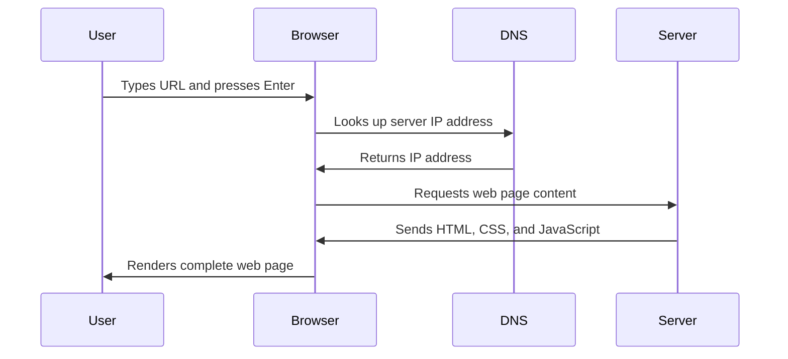

<!--
CO_OP_TRANSLATOR_METADATA:
{
  "original_hash": "33a875c522f237a2026e4653240dfc07",
  "translation_date": "2025-10-24T20:39:01+00:00",
  "source_file": "5-browser-extension/1-about-browsers/README.md",
  "language_code": "hu"
}
-->
# Böngészőbővítmény Projekt 1. rész: Minden a böngészőkről


> Sketchnote készítette: [Wassim Chegham](https://dev.to/wassimchegham/ever-wondered-what-happens-when-you-type-in-a-url-in-an-address-bar-in-a-browser-3dob)

## Előadás előtti kvíz

[Előadás előtti kvíz](https://ff-quizzes.netlify.app/web/quiz/23)

### Bevezetés

A böngészőbővítmények mini-alkalmazások, amelyek javítják a webes böngészési élményt. Tim Berners-Lee interaktív webre vonatkozó eredeti elképzeléséhez hasonlóan a bővítmények kiterjesztik a böngésző képességeit a dokumentumok egyszerű megtekintésén túl. A jelszókezelőktől, amelyek biztonságban tartják a fiókjaidat, a színválasztókig, amelyek segítenek a tervezőknek megtalálni a tökéletes árnyalatokat, a bővítmények mindennapi böngészési kihívásokat oldanak meg.

Mielőtt megépítenénk az első bővítményedet, értsük meg, hogyan működnek a böngészők. Ahogy Alexander Graham Bellnek is meg kellett értenie a hangátvitelt, mielőtt feltalálta a telefont, a böngésző alapjainak ismerete segít olyan bővítményeket létrehozni, amelyek zökkenőmentesen integrálódnak a meglévő böngészőrendszerekbe.

A lecke végére megérted a böngésző architektúráját, és elkezded építeni az első bővítményedet.

## A webes böngészők megértése

A webes böngésző lényegében egy kifinomult dokumentumértelmező. Amikor beírod a "google.com" címet a címsorba, a böngésző egy összetett műveletsorozatot hajt végre - tartalmat kér a világ különböző szervereiről, majd elemzi és megjeleníti azt az interaktív weboldalakat, amelyeket látsz.

Ez a folyamat tükrözi, hogyan tervezték az első webes böngészőt, a WorldWideWeb-et, Tim Berners-Lee által 1990-ben, hogy mindenki számára elérhetővé tegye a hiperhivatkozott dokumentumokat.

✅ **Egy kis történelem**: Az első böngészőt 'WorldWideWeb'-nek hívták, és Sir Timothy Berners-Lee készítette 1990-ben.


> Néhány korai böngésző, via [Karen McGrane](https://www.slideshare.net/KMcGrane/week-4-ixd-history-personal-computing)

### Hogyan dolgozzák fel a böngészők a webes tartalmakat

A folyamat, amely során beírsz egy URL-t, és megjelenik egy weboldal, több összehangolt lépést foglal magában, amelyek másodpercek alatt történnek:



**Ez a folyamat a következőket valósítja meg:**
- **Fordítja** az ember által olvasható URL-t egy szerver IP-címére DNS-keresés segítségével
- **Létrehoz** egy biztonságos kapcsolatot a webszerverrel HTTP vagy HTTPS protokollok használatával
- **Kéri** a konkrét weboldal tartalmát a szervertől
- **Fogadja** a HTML kódot, CSS stílusokat és JavaScript kódot a szervertől
- **Megjeleníti** az összes tartalmat az interaktív weboldalon, amit látsz

### A böngészők alapvető funkciói

A modern böngészők számos funkciót kínálnak, amelyeket a bővítményfejlesztők kihasználhatnak:

| Funkció | Cél | Bővítmény lehetőségek |
|---------|-----|------------------------|
| **Renderelő motor** | HTML, CSS és JavaScript megjelenítése | Tartalom módosítása, stílusok injektálása |
| **JavaScript motor** | JavaScript kód végrehajtása | Egyedi szkriptek, API interakciók |
| **Helyi tároló** | Adatok helyi mentése | Felhasználói preferenciák, gyorsítótárazott adatok |
| **Hálózati réteg** | Webes kérések kezelése | Kérésfigyelés, adat elemzés |
| **Biztonsági modell** | Védelem a rosszindulatú tartalom ellen | Tartalomszűrés, biztonsági fejlesztések |

**Ezeknek a funkcióknak a megértése segít:**
- **Azonosítani**, hol adhat a bővítményed a legtöbb értéket
- **Kiválasztani** a megfelelő böngésző API-kat a bővítményed funkcióihoz
- **Megtervezni** hatékonyan működő bővítményeket a böngészőrendszerekkel
- **Biztosítani**, hogy a bővítményed megfeleljen a böngésző biztonsági legjobb gyakorlatainak

### Keresztböngészős fejlesztési szempontok

Különböző böngészők kissé eltérően valósítják meg a szabványokat, hasonlóan ahhoz, ahogy különböző programozási nyelvek kezelhetik ugyanazt az algoritmust különböző módon. A Chrome, Firefox és Safari mindegyike egyedi jellemzőkkel rendelkezik, amelyeket a fejlesztőknek figyelembe kell venniük a bővítményfejlesztés során.

> 💡 **Profi tipp**: Használd a [caniuse.com](https://www.caniuse.com) weboldalt, hogy ellenőrizd, mely webes technológiák támogatottak a különböző böngészőkben. Ez felbecsülhetetlen értékű, amikor a bővítményed funkcióit tervezed!

**Kulcsfontosságú szempontok a bővítményfejlesztéshez:**
- **Teszteld** a bővítményedet a Chrome, Firefox és Edge böngészőkben
- **Alkalmazkodj** a különböző böngészőbővítmény API-khoz és manifest formátumokhoz
- **Kezeld** a különböző teljesítményjellemzőket és korlátokat
- **Biztosíts** alternatívákat a böngészőspecifikus funkciókhoz, amelyek esetleg nem érhetők el

✅ **Analitikai betekintés**: Meghatározhatod, mely böngészőket részesítik előnyben a felhasználóid, ha analitikai csomagokat telepítesz a webfejlesztési projektjeidbe. Ezek az adatok segítenek eldönteni, mely böngészőket támogasd először.

## A böngészőbővítmények megértése

A böngészőbővítmények közvetlenül a böngésző felületéhez adnak funkciókat, megoldva a gyakori webes böngészési kihívásokat. Ahelyett, hogy külön alkalmazásokat vagy összetett munkafolyamatokat igényelnének, a bővítmények azonnali hozzáférést biztosítanak az eszközökhöz és funkciókhoz.

Ez a koncepció tükrözi, hogyan képzelték el a korai számítógépes úttörők, mint például Douglas Engelbart, az emberi képességek technológiával való kiegészítését - a bővítmények kiegészítik a böngésző alapvető funkcióit.

**Népszerű bővítmény kategóriák és előnyeik:**
- **Produktivitási eszközök**: Feladatkezelők, jegyzetelő alkalmazások és időkövetők, amelyek segítenek szervezettnek maradni
- **Biztonsági fejlesztések**: Jelszókezelők, reklámblokkolók és adatvédelmi eszközök, amelyek védik az adataidat
- **Fejlesztői eszközök**: Kódformázók, színválasztók és hibakereső eszközök, amelyek egyszerűsítik a fejlesztést
- **Tartalomfejlesztés**: Olvasási módok, videóletöltők és képernyőképkészítő eszközök, amelyek javítják a webes élményt

✅ **Reflexiós kérdés**: Melyek a kedvenc böngészőbővítményeid? Milyen konkrét feladatokat látnak el, és hogyan javítják a böngészési élményedet?

## Bővítmények telepítése és kezelése

A bővítmények telepítési folyamatának megértése segít előre látni a felhasználói élményt, amikor az emberek telepítik a bővítményedet. A telepítési folyamat szabványosított a modern böngészők között, kisebb eltérésekkel a felület kialakításában.


> **Fontos**: Győződj meg róla, hogy bekapcsoltad a fejlesztői módot, és engedélyezted a bővítmények telepítését más áruházakból, amikor a saját bővítményeidet teszteled.

### Fejlesztési bővítmény telepítési folyamat

Amikor saját bővítményeket fejlesztesz és tesztelsz, kövesd ezt a munkafolyamatot:

```bash
# Step 1: Build your extension
npm run build
```

**Mit ér el ez a parancs:**
- **Fordítja** a forráskódot böngésző-kompatibilis fájlokká
- **Csomagolja** a JavaScript modulokat optimalizált csomagokba
- **Generálja** a végleges bővítményfájlokat a `/dist` mappában
- **Előkészíti** a bővítményedet telepítésre és tesztelésre

**2. lépés: Navigálj a böngészőbővítményekhez**
1. **Nyisd meg** a böngésződ bővítménykezelő oldalát
2. **Kattints** a "Beállítások és továbbiak" gombra (a `...` ikonra) a jobb felső sarokban
3. **Válaszd ki** a "Bővítmények" opciót a legördülő menüből

**3. lépés: Töltsd be a bővítményedet**
- **Új telepítésekhez**: Válaszd a `load unpacked` opciót, és válaszd ki a `/dist` mappát
- **Frissítésekhez**: Kattints a `reload` gombra a már telepített bővítményed mellett
- **Teszteléshez**: Engedélyezd a "Fejlesztői módot", hogy hozzáférj további hibakeresési funkciókhoz

### Publikus bővítmény telepítése

> ✅ **Megjegyzés**: Ezek a fejlesztési utasítások kifejezetten a saját magad által készített bővítmények tesztelésére vonatkoznak. A közzétett bővítmények telepítéséhez látogass el a hivatalos böngészőbővítmény-áruházakba, például a [Microsoft Edge Add-ons áruházba](https://microsoftedge.microsoft.com/addons/Microsoft-Edge-Extensions-Home).

**A különbség megértése:**
- **Fejlesztési telepítések** lehetővé teszik, hogy teszteld a nem közzétett bővítményeket a fejlesztés során
- **Áruházi telepítések** biztosítják a hitelesített, közzétett bővítményeket automatikus frissítésekkel
- **Oldalról történő telepítés** lehetővé teszi a bővítmények telepítését a hivatalos áruházakon kívülről (fejlesztői mód szükséges)

## A szénlábnyom bővítmény megépítése

Egy böngészőbővítményt fogunk létrehozni, amely megjeleníti a régiód energiafelhasználásának szénlábnyomát. Ez a projekt bemutatja az alapvető bővítményfejlesztési koncepciókat, miközben egy gyakorlati eszközt hoz létre a környezeti tudatosság érdekében.

Ez a megközelítés követi a "tanulás cselekvés által" elvet, amely John Dewey oktatási elméletei óta hatékonynak bizonyult - a technikai készségeket valódi, gyakorlati alkalmazásokkal kombinálva.

### Projektkövetelmények

A fejlesztés megkezdése előtt gyűjtsük össze a szükséges erőforrásokat és függőségeket:

**Szükséges API hozzáférés:**
- **[CO2 Signal API kulcs](https://www.co2signal.com/)**: Add meg az e-mail címedet, hogy megkapd az ingyenes API kulcsot
- **[Régiókód](http://api.electricitymap.org/v3/zones)**: Keresd meg a régiókódodat az [Electricity Map](https://www.electricitymap.org/map) segítségével (például Boston esetében 'US-NEISO')

**Fejlesztői eszközök:**
- **[Node.js és NPM](https://www.npmjs.com)**: Csomagkezelő eszköz a projektfüggőségek telepítéséhez
- **[Kezdő kód](../../../../5-browser-extension/start)**: Töltsd le a `start` mappát a fejlesztés megkezdéséhez

✅ **Tudj meg többet**: Fejleszd csomagkezelési készségeidet ezzel a [átfogó Learn modullal](https://docs.microsoft.com/learn/modules/create-nodejs-project-dependencies/?WT.mc_id=academic-77807-sagibbon)

### A projekt struktúrájának megértése

A projekt struktúrájának megértése segít hatékonyan szervezni a fejlesztési munkát. Ahogy az Alexandriai Könyvtár is könnyű hozzáférést biztosított a tudáshoz, egy jól szervezett kódbázis hatékonyabbá teszi a fejlesztést:

```
project-root/
├── dist/                    # Built extension files
│   ├── manifest.json        # Extension configuration
│   ├── index.html           # User interface markup
│   ├── background.js        # Background script functionality
│   └── main.js              # Compiled JavaScript bundle
└── src/                     # Source development files
    └── index.js             # Your main JavaScript code
```

**Mit valósít meg az egyes fájlok:**
- **`manifest.json`**: **Meghatározza** a bővítmény metaadatait, engedélyeit és belépési pontjait
- **`index.html`**: **Létrehozza** a felhasználói felületet, amely megjelenik, amikor a felhasználók rákattintanak a bővítményre
- **`background.js`**: **Kezeli** a háttérfeladatokat és a böngésző eseményfigyelőit
- **`main.js`**: **Tartalmazza** a végső, összeállított JavaScript kódot a build folyamat után
- **`src/index.js`**: **Tartalmazza** a fő fejlesztési kódot, amelyet a `main.js`-be fordítanak

> 💡 **Szervezési tipp**: Tárold az API kulcsodat és a régiókódodat egy biztonságos jegyzetben, hogy könnyen hozzáférj a fejlesztés során. Ezekre az értékekre szükséged lesz a bővítményed funkcióinak teszteléséhez.

✅ **Biztonsági megjegyzés**: Soha ne kötelezd el az API kulcsokat vagy érzékeny hitelesítő adatokat a kódrepozitóriumodba. Megmutatjuk, hogyan kezelheted ezeket biztonságosan a következő lépésekben.

## A bővítmény felületének létrehozása

Most megépítjük a felhasználói felület komponenseit. A bővítmény kétképernyős megközelítést alkalmaz: egy konfigurációs képernyőt az első beállításhoz és egy eredményképernyőt az adatok megjelenítéséhez.

Ez követi a progresszív információfeltárás elvét, amelyet a számítástechnika korai napjai óta alkalmaznak - az információk és op
**Leírás:** Fejleszd a böngészőbővítményt azzal, hogy hozzáadsz űrlapellenőrzési és felhasználói visszajelzési funkciókat, amelyek javítják a felhasználói élményt az API kulcsok és régiókódok megadásakor.

**Feladat:** Hozz létre JavaScript ellenőrző függvényeket, amelyek ellenőrzik, hogy az API kulcs mező legalább 20 karaktert tartalmaz-e, és hogy a régiókód megfelel-e a helyes formátumnak (például 'US-NEISO'). Adj vizuális visszajelzést azáltal, hogy a bemeneti mezők szegélyszíne zöldre változik érvényes adatok esetén, és pirosra érvénytelen adatok esetén. Továbbá adj hozzá egy kapcsoló funkciót, amely lehetővé teszi az API kulcs megjelenítésének/elrejtésének biztonsági célú kezelését.

További információ az [agent mode](https://code.visualstudio.com/blogs/2025/02/24/introducing-copilot-agent-mode) funkcióról itt található.

## 🚀 Kihívás

Nézz körül egy böngészőbővítmény áruházban, és telepíts egyet a böngésződbe. Érdekes módokon vizsgálhatod meg a fájljait. Mit fedezel fel?

## Előadás utáni kvíz

[Előadás utáni kvíz](https://ff-quizzes.netlify.app/web/quiz/24)

## Áttekintés és önálló tanulás

Ebben a leckében egy kicsit tanultál a webböngészők történetéről; használd ki ezt az alkalmat, hogy többet megtudj arról, hogyan képzelték el a Világháló feltalálói annak használatát, és olvass többet a történetéről. Néhány hasznos oldal:

[A webböngészők története](https://www.mozilla.org/firefox/browsers/browser-history/)

[A web története](https://webfoundation.org/about/vision/history-of-the-web/)

[Interjú Tim Berners-Lee-vel](https://www.theguardian.com/technology/2019/mar/12/tim-berners-lee-on-30-years-of-the-web-if-we-dream-a-little-we-can-get-the-web-we-want)

## Feladat 

[Stílusold újra a bővítményedet](assignment.md)

---

**Felelősség kizárása**:  
Ez a dokumentum az [Co-op Translator](https://github.com/Azure/co-op-translator) AI fordítási szolgáltatás segítségével lett lefordítva. Bár törekszünk a pontosságra, kérjük, vegye figyelembe, hogy az automatikus fordítások hibákat vagy pontatlanságokat tartalmazhatnak. Az eredeti dokumentum az eredeti nyelvén tekintendő hiteles forrásnak. Kritikus információk esetén javasolt professzionális emberi fordítást igénybe venni. Nem vállalunk felelősséget semmilyen félreértésért vagy téves értelmezésért, amely a fordítás használatából eredhet.