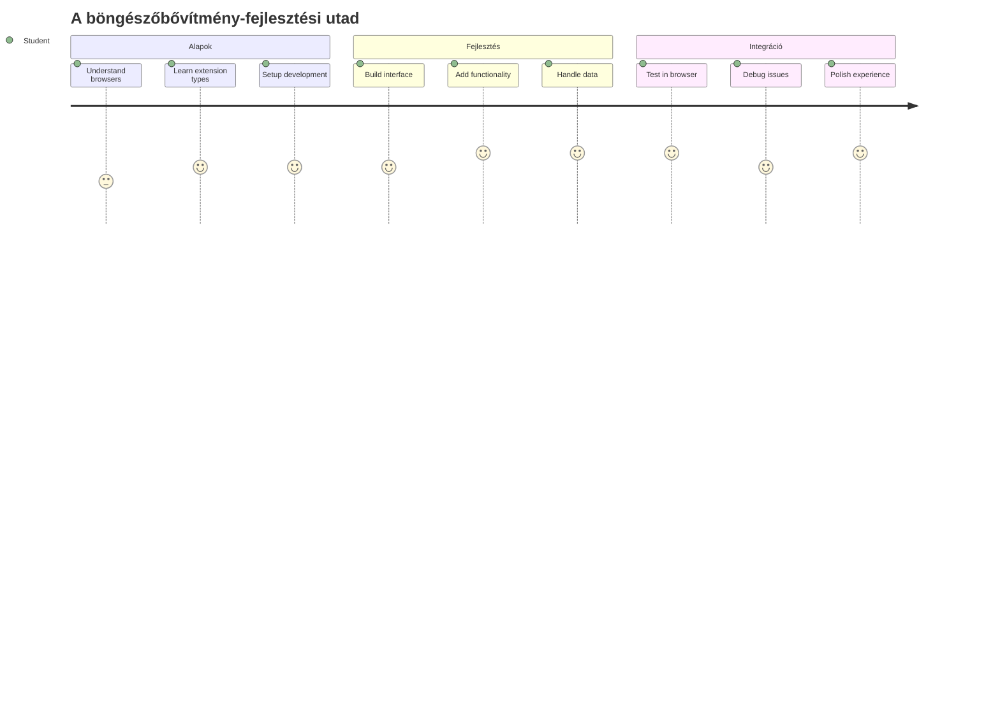
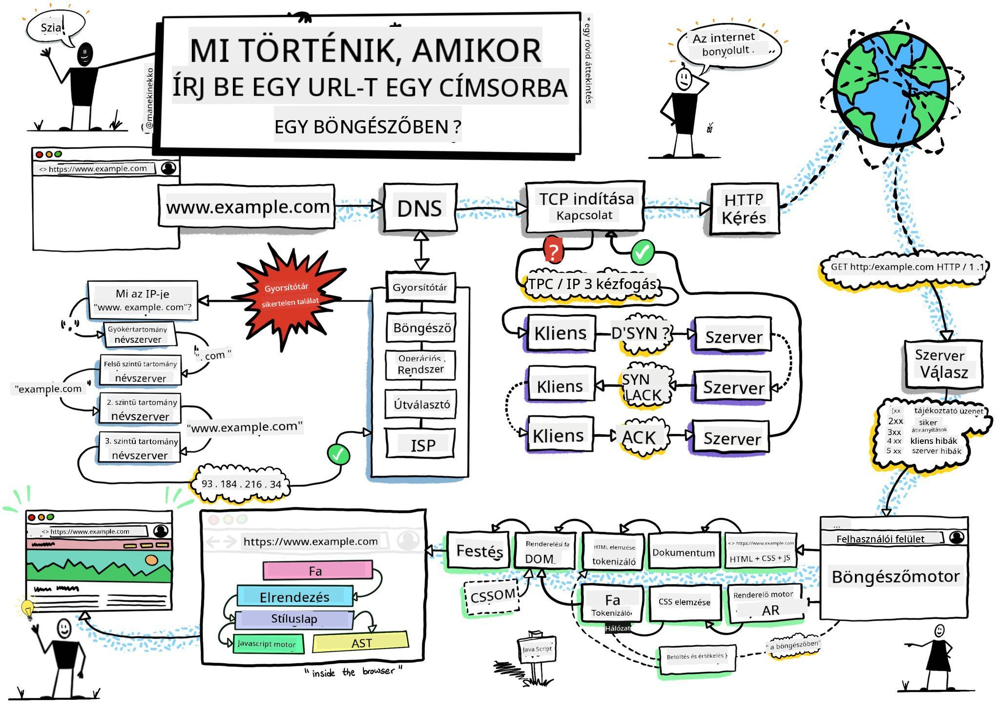
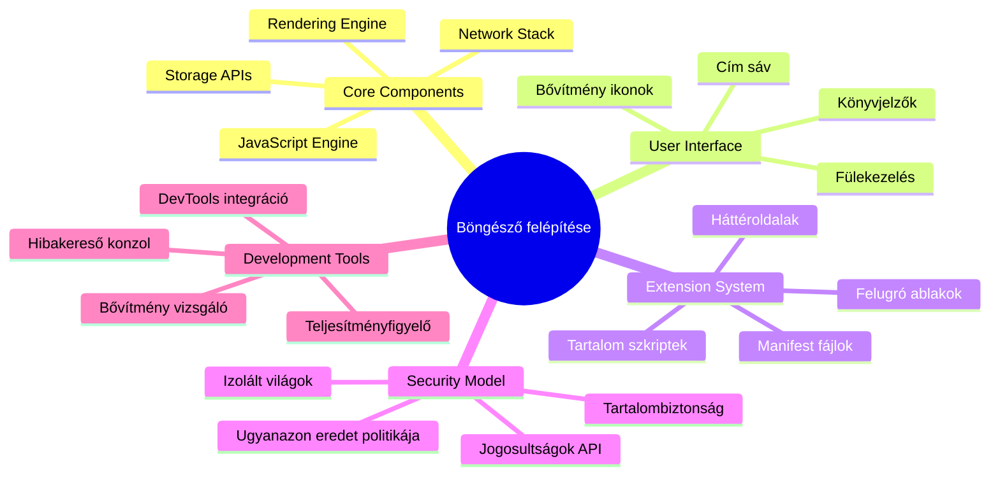
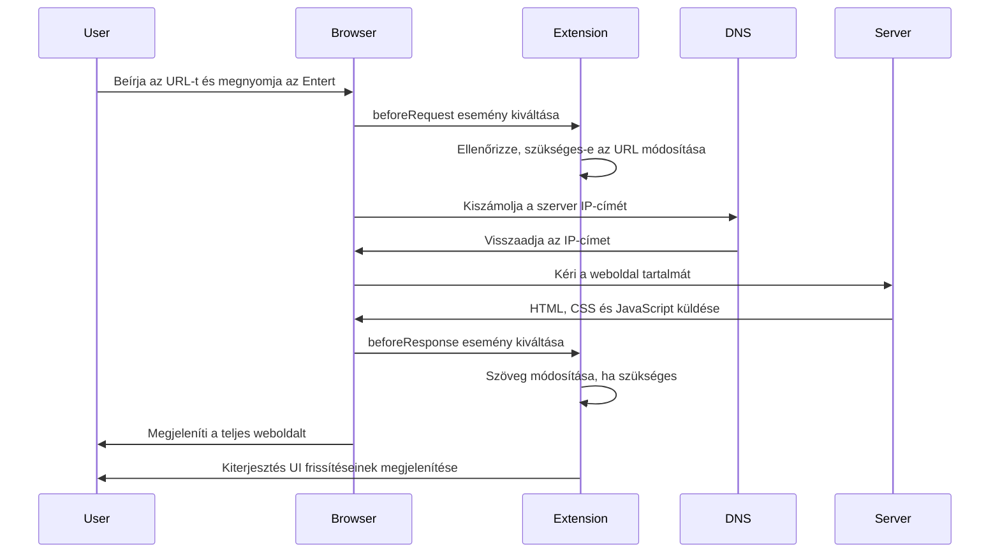
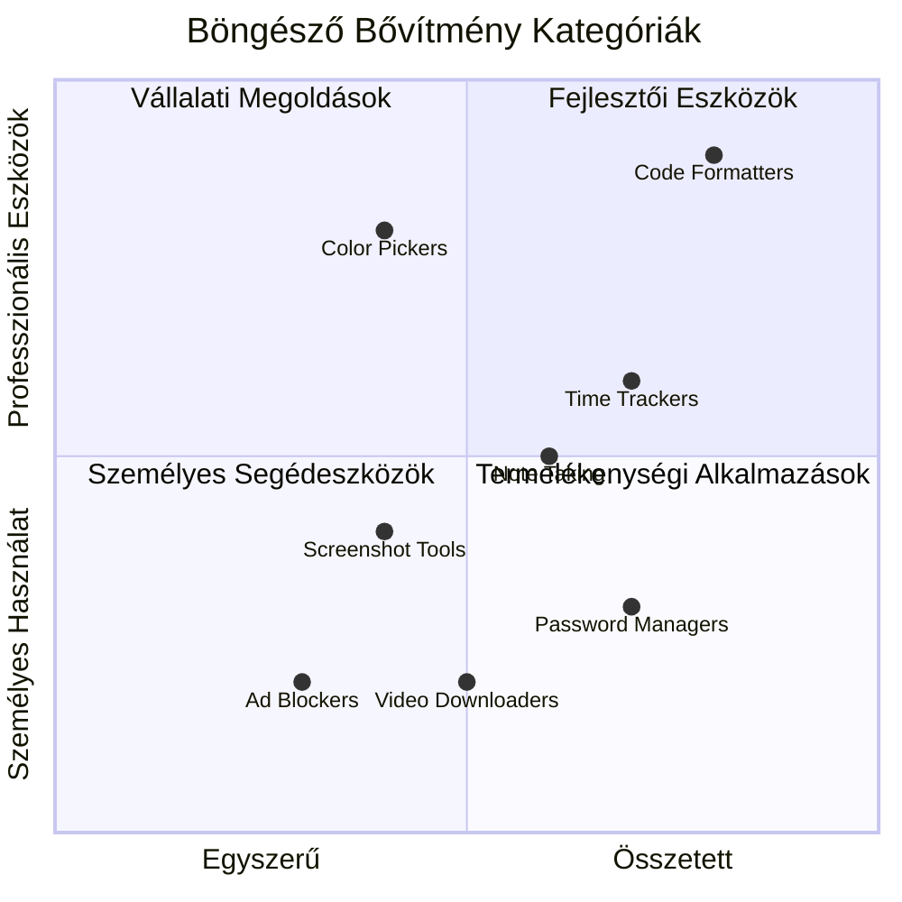
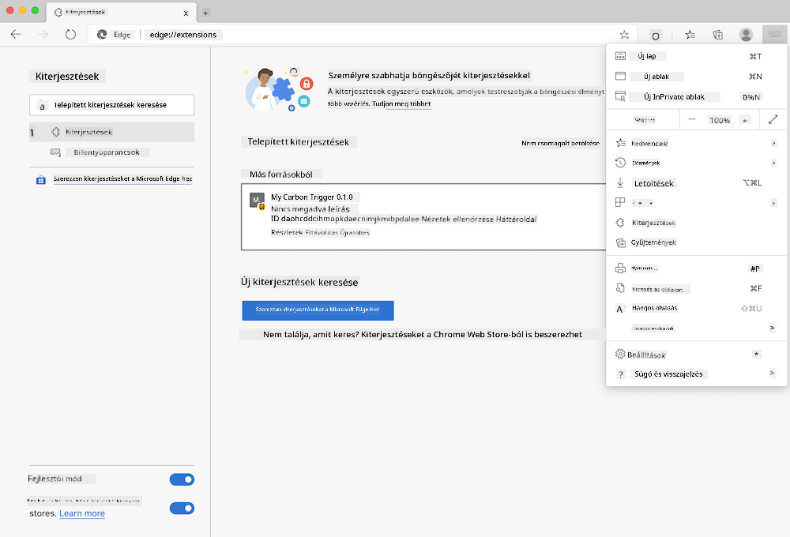
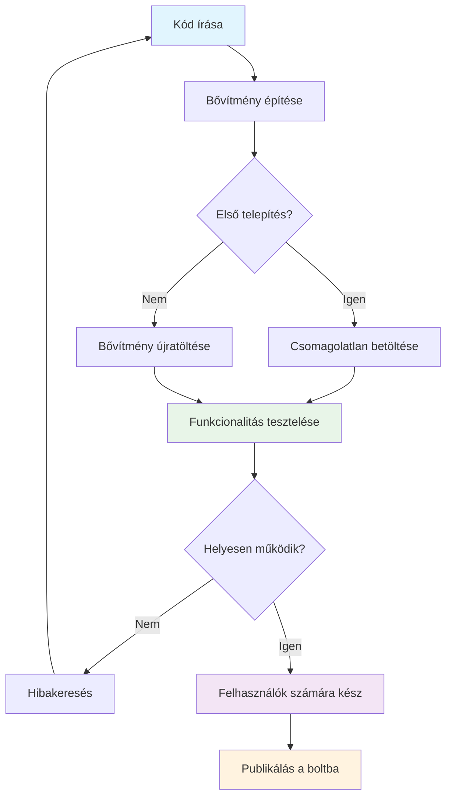
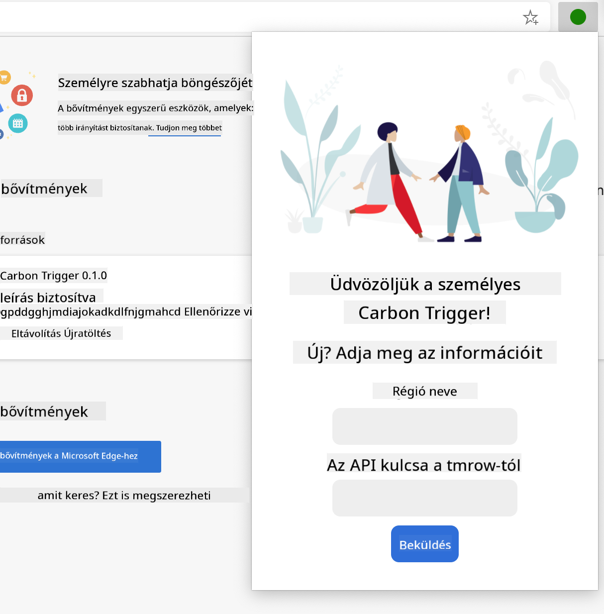
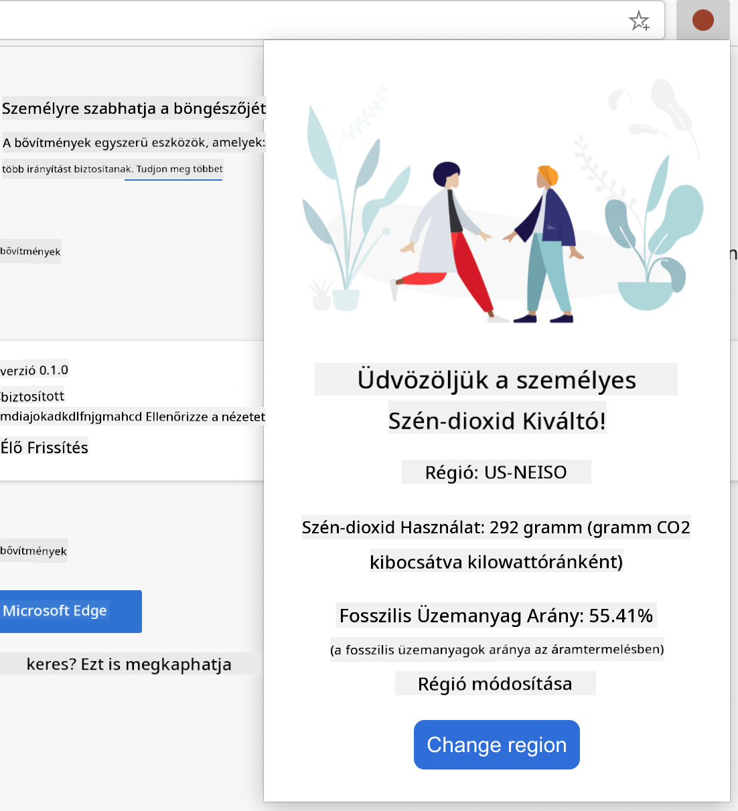
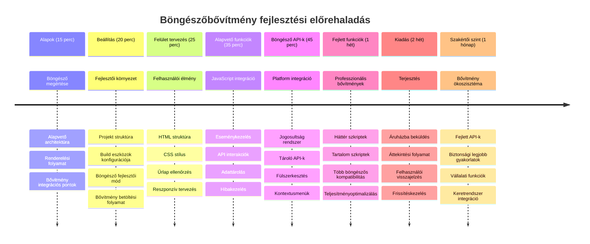

<!--
CO_OP_TRANSLATOR_METADATA:
{
  "original_hash": "00aa85715e1efd4930c17a23e3012e69",
  "translation_date": "2026-01-07T02:51:55+00:00",
  "source_file": "5-browser-extension/1-about-browsers/README.md",
  "language_code": "hu"
}
-->
# Böngésző bővítmény projekt 1. rész: Minden a böngészőkről



> Vázlatjegyzet készítője: [Wassim Chegham](https://dev.to/wassimchegham/ever-wondered-what-happens-when-you-type-in-a-url-in-an-address-bar-in-a-browser-3dob)

## Előadás előtti kvíz

[Előadás előtti kvíz](https://ff-quizzes.netlify.app/web/quiz/23)

### Bevezetés

A böngészőbővítmények mini alkalmazások, amelyek fokozzák a webes böngészési élményt. Ahogy Tim Berners-Lee eredeti interaktív webes víziója is hangsúlyozta, a bővítmények a böngésző képességeit egyszerű dokumentummegjelenítésen túl bővítik. A jelszókezelőktől, amelyek védenek fiókjaidat, a színválasztókig, amelyek segítik a tervezőket tökéletes árnyalatok kiválasztásában, a bővítmények a mindennapi böngészési kihívásokra adnak megoldást.

Mielőtt elkészítenénk az első bővítményedet, ismerjük meg, hogyan működnek a böngészők. Ahogyan Alexander Graham Bellnek is értenie kellett a hangátvitelt a telefon feltalálása előtt, a böngészők alapjainak ismerete segít abban, hogy olyan bővítményeket hozz létre, amelyek zökkenőmentesen integrálódnak a meglévő böngészőrendszerekhez.

A lecke végére megérted a böngészőarchitektúrát, és elkezded megépíteni első bővítményedet.


## A webes böngészők megértése

Egy webes böngésző lényegében egy kifinomult dokumentumértelmező. Amikor beírod, hogy "google.com" a címsorba, a böngésző bonyolult műveletsorozatot hajt végre – a világ minden táján lévő szerverekről tartalmat kér le, majd azt elemzi és megjeleníti az általa látott interaktív weboldalakká.

Ez a folyamat tükrözi azt, ahogyan az első webes böngészőt, a WorldWideWeb-et Tim Berners-Lee 1990-ben megtervezte, hogy a hiperhivatkozott dokumentumok mindenki számára elérhetőek legyenek.

✅ **Egy kis történelem**: Az első böngészőt 'WorldWideWeb'-nek hívták, és Sir Timothy Berners-Lee készítette 1990-ben.


> Néhány korai böngésző, forrás: [Karen McGrane](https://www.slideshare.net/KMcGrane/week-4-ixd-history-personal-computing)

### Hogyan dolgozza fel a böngésző a webes tartalmat

A URL beírása és a weboldal megjelenése között több összehangolt lépés zajlik le pár másodperc alatt:


**Ez a folyamat a következőket hajtja végre:**
- **Lefordítja** az ember által olvasható URL-t szerver IP címre DNS lekérdezéssel
- **Létrehoz** biztonságos kapcsolatot a webkiszolgálóval HTTP vagy HTTPS protokollon keresztül
- **Kéri** az adott weboldal tartalmát a szervertől
- **Fogadja** az HTML jelölést, CSS stílusokat és JavaScript kódot a szervertől
- **Megjeleníti** az összes tartalmat az interaktív weboldalon, amit látsz

### Böngésző alapvető funkciói

A modern böngészők sok funkciót kínálnak, amelyeket a bővítményfejlesztők kihasználhatnak:

| Funkció | Cél | Lehetőségek a bővítmények számára |
|---------|---------|------------------------|
| **Megjelenítő motor** | HTML, CSS és JavaScript megjelenítése | Tartalom módosítás, stílusinjekció |
| **JavaScript motor** | JavaScript kód végrehajtása | Egyedi szkriptek, API interakciók |
| **Helyi tároló** | Adatok helyi mentése | Felhasználói beállítások, gyorsítótárazott adatok |
| **Hálózati réteg** | Webes lekérések kezelése | Lekérés figyelés, adat elemzés |
| **Biztonsági modell** | Felhasználók védelme rosszindulatú tartalom ellen | Tartalomszűrés, biztonsági fejlesztések |

**E funkciók ismerete segít abban, hogy:**
- **Beazonosítsd**, hol adhat hozzá leginkább értéket a bővítményed
- **Megválaszd** a megfelelő böngésző API-kat a bővítmény funkcióihoz
- **Tervezd** azokat a bővítményeket, amelyek hatékonyan működnek a böngésző rendszereivel
- **Biztosítsd**, hogy bővítményed megfeleljen a böngésző biztonsági legjobb gyakorlatainak

### Több böngészőt támogató fejlesztési szempontok

A különböző böngészők kissé eltérő módon valósítják meg a szabványokat, hasonlóan ahhoz, ahogy különböző programozási nyelvek is eltérően kezelhetnek egy algoritmust. A Chrome, Firefox és Safari mind egyedi jellemzőkkel bír, amelyeket a fejlesztőknek figyelembe kell venniük bővítményfejlesztés során.

> 💡 **Pro Tipp**: Használd a [caniuse.com](https://www.caniuse.com) oldalt, hogy ellenőrizd, mely webes technológiák támogatottak a különböző böngészőkben. Ez felbecsülhetetlen segítség a bővítmény funkcióinak tervezésekor!

**Fontos szempontok a bővítményfejlesztéshez:**
- **Teszteld** bővítményedet Chrome, Firefox és Edge böngészőkön
- **Alkalmazkodj** a különböző böngésző bővítmény API-khoz és manifest formátumokhoz
- **Kezeld** a különböző teljesítményjellemzőket és korlátokat
- **Biztosíts** tartalék megoldásokat azokra a böngészőspecifikus funkciókra, amelyek esetleg nem elérhetőek minden böngészőben

✅ **Elemzési betekintés**: Megtudhatod, hogy mely böngészőket preferálják a felhasználóid, ha a webfejlesztési projektjeidbe analytics csomagokat telepítesz. Ezek az adatok segítenek, hogy a támogatott böngészőket fontossági sorrendbe állítsd.

## A böngészőbővítmények megértése

A böngészőbővítmények megoldják a gyakori webes böngészési problémákat azáltal, hogy funkciókat adnak hozzá közvetlenül a böngésző felületéhez. Nem igényelnek külön alkalmazásokat vagy bonyolult munkafolyamatokat, a bővítmények azonnali hozzáférést biztosítanak eszközökhöz és funkciókhoz.

Ez a koncepció tükrözi azt, ahogyan a korai számítástechnikai úttörők, például Douglas Engelbart elképzelték az emberi képességek technológiával való kiterjesztését – a bővítmények kiterjesztik a böngésződ alapfunkcionalitását.


**Népszerű bővítménykategóriák és előnyeik:**
- **Hatékonyságot növelő eszközök**: Feladatkezelők, jegyzetelő appok és időmérők, amelyek segítenek szervezettebbnek maradni
- **Biztonsági fejlesztések**: Jelszókezelők, reklámblokkolók és adatvédelmi eszközök, amelyek védik az adataidat
- **Fejlesztői eszközök**: Kódfomázók, színválasztók és hibakereső segédprogramok, amelyek gyorsítják a fejlesztést
- **Tartalomfejlesztés**: Olvasási módok, videóletöltők és képernyőkép eszközök, amelyek javítják a webböngészési élményt

✅ **Reflektáló kérdés**: Mik a kedvenc böngészőbővítményeid? Milyen konkrét feladatokat látnak el, és hogyan javítják a böngészési élményt?

### 🔄 **Pedagógiai átnézés**
**Böngésző architektúra megértése**: Mielőtt a bővítményfejlesztésre térnénk, győződj meg róla, hogy:
- ✅ El tudod magyarázni, hogyan dolgozzák fel a böngészők a webes kéréseket és jelenítenek meg tartalmat
- ✅ Fel tudod sorolni a böngészőarchitektúra fő összetevőit
- ✅ Érted, hogyan integrálódnak a bővítmények a böngésző funkcióiba
- ✅ Felismered a felhasználókat védő biztonsági modellt

**Gyors önellenőrzés**: Ki tudod követni a folyamatot az URL beírásától a weboldal megjelenéséig?
1. **DNS lekérdezés** az URL IP-címmé alakításához
2. **HTTP kérés** tartalom lekérésére a szervertől
3. **Elemzés** HTML, CSS és JavaScript feldolgozásával
4. **Megjelenítés** a végső weboldal megmutatása
5. **Bővítmények** több ponton módosíthatják a tartalmat

## Bővítmények telepítése és kezelése

A bővítmény telepítési folyamatának ismerete segít előre látni a felhasználói élményt, amikor a felhasználók telepítik a bővítményedet. A telepítési folyamat egységes a modern böngészőkben, kisebb felületbeli különbségekkel.



> **Fontos**: Győződj meg róla, hogy bekapcsoltad a fejlesztői módot és engedélyezted a más áruházból származó bővítményeket, amikor saját bővítményeidet teszteled.

### Bővítmény fejlesztés és telepítés lépései

Amikor saját bővítményeket fejlesztesz és tesztelsz, kövesd ezt a munkafolyamatot:


```bash
# 1. lépés: Építse meg a bővítményét
npm run build
```

**Mit hajt végre ez a parancs:**
- **Lefordítja** a forráskódot böngésző számára kész fájlokká
- **Csomagolja** a JavaScript modulokat optimalizált csomagokká
- **Előállítja** a végső bővítményfájlokat a `/dist` mappában
- **Előkészíti** bővítményed telepítésre és tesztelésre

**2. lépés: Nyisd meg a böngésző bővítménykezelő oldalát**
1. **Nyisd meg** a böngésződ bővítménykezelő oldalát
2. **Kattints** a jobb felső sarokban a „Beállítások és egyéb” (a `...` ikonra)
3. **Válaszd** ki a „Bővítmények” menüpontot

**3. lépés: Töltsd be a bővítményedet**
- **Új telepítéshez**: Válaszd a `csomagolatlan betöltése` lehetőséget, majd válaszd ki a `/dist` mappát
- **Frissítéshez**: Kattints a `újratöltés` gombra a már telepített kiegészítő mellett
- **Teszteléshez**: Kapcsold be a „Fejlesztői mód”-ot, hogy hozzáférj további hibakeresési funkciókhoz

### Bővítmény telepítése éles környezetben

> ✅ **Megjegyzés**: Ezek a fejlesztői utasítások kizárólag az általad készített bővítményekre vonatkoznak. A közzétett bővítmények telepítéséhez látogass el az olyan hivatalos bővítményáruházakba, mint a [Microsoft Edge bővítmény áruház](https://microsoftedge.microsoft.com/addons/Microsoft-Edge-Extensions-Home).

**A különbségek megértése:**
- **Fejlesztői telepítések** lehetővé teszik, hogy a fejlesztés alatt álló, még nem közzétett bővítményeket teszteld
- **Áruházi telepítések** jóváhagyott, publikált bővítményeket biztosítanak automatikus frissítésekkel
- **Oldalról való telepítés** lehetővé teszi bővítmények telepítését az áruházakon kívülről (fejlesztői mód szükséges)

## Szénlábnyom bővítmény készítése

Egy böngészőbővítményt készítünk, amely megmutatja az adott régió energiafelhasználásának szénlábnyomát. Ez a projekt alapvető bővítményfejlesztési fogalmakat szemléltet, miközben egy gyakorlati környezeti tudatosságot segítő eszközt hoz létre.

Ez az „elsajátítás a gyakorlatban” elv szerint halad, amely John Dewey neveléselméleti elvei óta bizonyítottan hatékony – a technikai készségek és a valódi életből vett hasznos alkalmazások kombinációját alkalmazza.

### Projekt követelmények

A fejlesztés megkezdése előtt gyűjtsük össze a szükséges erőforrásokat és függőségeket:

**Szükséges API hozzáférés:**
- **[CO2 Signal API kulcs](https://www.co2signal.com/)**: Add meg az email címed a ingyenes API kulcsért
- **[Régiókód](http://api.electricitymap.org/v3/zones)**: Keresd meg a régiókódod az [Electricity Map](https://www.electricitymap.org/map) segítségével (például Bostonhoz az 'US-NEISO' tartozik)

**Fejlesztői eszközök:**
- **[Node.js és NPM](https://www.npmjs.com)**: Csomagkezelő eszköz a projektfüggőségek telepítéséhez
- **[Kezdőkód](../../../../5-browser-extension/start)**: Töltsd le a `start` mappát a fejlesztés megkezdéséhez

✅ **Tanulj többet**: Fejleszd csomagkezelési készségeidet ezzel a [átfogó Learn modullal](https://docs.microsoft.com/learn/modules/create-nodejs-project-dependencies/?WT.mc_id=academic-77807-sagibbon)

### A projekt struktúrájának megértése

A projekt struktúrájának ismerete segít a fejlesztési munka hatékony szervezésében. Ahogy az alexandriai könyvtárat rendezték az egyszerű tudáskeresés érdekében, úgy egy jól strukturált kódbázis is gyorsítja a fejlesztést:

```
project-root/
├── dist/                    # Built extension files
│   ├── manifest.json        # Extension configuration
│   ├── index.html           # User interface markup
│   ├── background.js        # Background script functionality
│   └── main.js              # Compiled JavaScript bundle
├── src/                     # Source development files
│   └── index.js             # Your main JavaScript code
├── package.json             # Project dependencies and scripts
└── webpack.config.js        # Build configuration
```

**Mit tesz lehetővé az egyes fájl:**
- **`manifest.json`**: Meghatározza a bővítmény metaadatait, engedélyeit és belépési pontjait
- **`index.html`**: Létrehozza a felhasználói felületet, amely akkor jelenik meg, amikor a felhasználó a bővítményre kattint
- **`background.js`**: Kezeli a háttérfeladatokat és a böngésző eseményfigyelőit
- **`main.js`**: Tartalmazza az építési folyamat után létrejövő végső JavaScript kódot
- **`src/index.js`**: Tartalmazza a fő fejlesztői kódot, amelyből a `main.js` készül

> 💡 **Szervezési tipp**: Tárold biztonságos jegyzetben az API kulcsodat és a régiókódodat, hogy könnyen elérhető legyen a fejlesztés során. Ezekre az értékekre szükséged lesz a bővítmény funkcióinak teszteléséhez.

✅ **Biztonsági megjegyzés**: Soha ne töltsd fel API kulcsaidat vagy érzékeny hitelesítő adatokat a kódtáradba. A következő lépésekben megmutatjuk, hogyan kezeld ezeket biztonságosan.

## A bővítmény felületének létrehozása

Most építsük meg a felhasználói felület komponenseit. A bővítmény két képernyős megközelítést használ: egy konfigurációs képernyőt az alapbeállításokhoz és egy eredményképernyőt az adatok megjelenítéséhez.

Ez a fokozatos információfeltárás elve, amit az interfésztervezés már a számítástechnika korai napjaiban is alkalmaztak – az információkat logikus sorrendben mutatja, hogy ne terhelje túl a felhasználókat.

### Bővítmény nézetek áttekintése

**Beállítási nézet** – Első alkalommal használók konfigurációja:


**Eredmény nézet** – Szénlábnyom adat megjelenítése:


### A konfigurációs űrlap építése

Az űrlap begyűjti a felhasználó konfigurációs adatait az első használatkor. A beállítások a böngésző tárolójában megmaradnak a későbbi használatra.

A `/dist/index.html` fájlban add hozzá ezt az űrlapszerkezetet:

```html
<form class="form-data" autocomplete="on">
    <div>
        <h2>New? Add your Information</h2>
    </div>
    <div>
        <label for="region">Region Name</label>
        <input type="text" id="region" required class="region-name" />
    </div>
    <div>
        <label for="api">Your API Key from tmrow</label>
        <input type="text" id="api" required class="api-key" />
    </div>
    <button class="search-btn">Submit</button>
</form>
```

**Ez az űrlap a következőket teszi lehetővé:**
- **Létrehoz** egy szemantikus űrlapszerkezetet megfelelő feliratokkal és bemeneti kapcsolódásokkal
- **Lehetővé teszi** a böngésző automatikus kitöltési funkcióját a jobb felhasználói élményért
- **Követeli**, hogy mindkét mező ki legyen töltve a `required` attribútum használatával
- **Rendszerezi** a mezőket leíró osztálynevekkel a könnyebb stílusozás és JavaScript célozhatóság érdekében
- **Egyértelmű utasításokat** ad azoknak a felhasználóknak, akik először állítják be a bővítményt

### Az eredmények megjelenítése

Ezután hozd létre az eredményt megjelenítő területet, amely megmutatja a szénlábnyom adatokat. Add hozzá ezt az HTML-t az űrlap alá:

```html
<div class="result">
    <div class="loading">loading...</div>
    <div class="errors"></div>
    <div class="data"></div>
    <div class="result-container">
        <p><strong>Region: </strong><span class="my-region"></span></p>
        <p><strong>Carbon Usage: </strong><span class="carbon-usage"></span></p>
        <p><strong>Fossil Fuel Percentage: </strong><span class="fossil-fuel"></span></p>
    </div>
    <button class="clear-btn">Change region</button>
</div>
```

**Ez az elrendezés a következőket biztosítja:**
- **`loading`**: Betöltési üzenetet jelenít meg, amíg érkeznek az API-adatok
- **`errors`**: Hibajelzéseket mutat, ha az API hívás sikertelen vagy érvénytelen az adat
- **`data`**: Nyers adatokat tartalmaz a fejlesztéshez és hibakereséshez
- **`result-container`**: Formázott szénlábnyom információkat mutat a felhasználóknak
- **`clear-btn`**: Lehetővé teszi a régió megváltoztatását és a bővítmény újbóli konfigurálását

### Az építési folyamat beállítása

Telepítsük most a projekt függőségeit és teszteljük az építési folyamatot:

```bash
npm install
```

**Ez a telepítési folyamat a következőket végzi:**
- **Letölti** a Webpacket és más fejlesztői függőségeket a `package.json`-ból
- **Beállítja** az építő eszközláncot a modern JavaScript fordítására
- **Elkészíti** a fejlesztői környezetet bővítményépítéshez és teszteléshez
- **Lehetővé teszi** a kód csomagolását, optimalizálását és több böngészős kompatibilitást

> 💡 **Építési folyamat betekintés**: A Webpack összecsomagolja a forráskódot a `/src/index.js`-ből a `/dist/main.js` fájlba. Ez optimalizálja a kódot a kiadásra és biztosítja a böngészőkompatibilitást.

### Elért eredményeid tesztelése

Mostantól tudod tesztelni a bővítményedet:
1. **Futtasd** a build parancsot a kódod fordításához  
2. **Töltsd be** a kiterjesztést a böngésződbe fejlesztői módban  
3. **Ellenőrizd**, hogy az űrlap helyesen jelenik-e meg és professzionálisnak tűnik-e  
4. **Győződj meg róla**, hogy az összes űrlapelem megfelelően van igazítva és működik  

**Amit elértél:**  
- **Felépítetted** az alapvető HTML struktúrát a kiterjesztésedhez  
- **Létrehoztad** a konfigurációs és eredményfelületeket helyes szemantikai jelölésekkel  
- **Beállítottad** a modern fejlesztői munkafolyamatot iparági szabvány eszközökkel  
- **Előkészítetted** az alapokat az interaktív JavaScript funkciók hozzáadásához  

### 🔄 **Didaktikai ellenőrzés**  
**Kiterjesztés fejlesztésének előrehaladása**: Ellenőrizd a megértésed, mielőtt továbbmész:  
- ✅ Ki tudod fejteni az egyes fájlok célját a projekt struktúrában?  
- ✅ Érted, hogyan alakítja át a build folyamat a forráskódodat?  
- ✅ Miért választjuk szét a konfigurációt és az eredményeket külön UI szekciókra?  
- ✅ Hogyan támogatja az űrlapszerkezet mind a használhatóságot, mind a hozzáférhetőséget?  

**Fejlesztési munkafolyamat megértése**: Most már képesnek kell lenned a következőkre:  
1. **Módosítani** az HTML-t és CSS-t a kiterjesztésed felületén  
2. **Futtatni** a build parancsot a változtatások fordításához  
3. **Újratölteni** a kiterjesztést a böngésződben a frissítések teszteléséhez  
4. **Hibakeresni** a problémákat a böngésző fejlesztői eszközeivel  

Befejezted a böngészőkiterjesztés fejlesztésének első szakaszát. Ahogy a Wright fivéreknek előbb meg kellett érteniük az aerodinamikát a repülés előtt, úgy ezeknek az alapfogalmaknak a megértése is felkészít arra, hogy a következő leckében összetettebb interaktív funkciókat építs be.  

## GitHub Copilot Agent kihívás 🚀  

Használd az Agent módot a következő feladat megoldásához:  

**Leírás:** Fejleszd tovább a böngészőkiterjesztést azzal, hogy form-validációt és felhasználói visszajelzést adsz hozzá, hogy jobb legyen a felhasználói élmény az API kulcsok és régiókódok bevitele során.  

**Parancs:** Készíts JavaScript ellenőrző függvényeket, amelyek megvizsgálják, hogy az API kulcs mező legalább 20 karakter hosszú-e, és hogy a régiókód megfelelő formátumot követ-e (például 'US-NEISO'). Adj vizuális visszacsatolást úgy, hogy a beviteli mezők szegélyszínét zöldre állítod, ha érvényesek, és pirosra, ha hibásak. Továbbá adj egy váltó funkciót az API kulcs láthatóságának ki- és bekapcsolására biztonsági okokból.  

Tudj meg többet az [agent mode](https://code.visualstudio.com/blogs/2025/02/24/introducing-copilot-agent-mode) funkcióról itt.  

## 🚀 Kihívás  

Nézz meg egy böngészőkiterjesztés áruházat, és telepíts egyet a böngésződbe. Érdekes módokon megvizsgálhatod a fájljaikat. Mit fedezel fel?  

## Előadás utáni kvíz  

[Előadás utáni kvíz](https://ff-quizzes.netlify.app/web/quiz/24)  

## Áttekintés és önálló tanulás  

Ebben a leckében egy keveset tanultál a web böngészők történetéről; használd ki ezt az alkalmat, hogy többet megtudj arról, miként képzelték el a World Wide Web feltalálói használatát, és olvass tovább a történetéről. Néhány hasznos oldal:  

[A böngészők története](https://www.mozilla.org/firefox/browsers/browser-history/)  

[A web története](https://webfoundation.org/about/vision/history-of-the-web/)  

[Interjú Tim Berners-Lee-vel](https://www.theguardian.com/technology/2019/mar/12/tim-berners-lee-on-30-years-of-the-web-if-we-dream-a-little-we-can-get-the-web-we-want)  

### ⚡ **Amit a következő 5 percben megtehetsz**  
- [ ] Nyisd meg a Chrome/Edge bővítmények oldalát (chrome://extensions), és fedezd fel, mit telepítettél  
- [ ] Nézd meg a böngésződ DevTools Hálózat (Network) lapját egy weboldal betöltése közben  
- [ ] Próbáld meg megtekinteni az oldal forrását (Ctrl+U), hogy lásd a HTML szerkezetet  
- [ ] Vizsgálj meg bármilyen weboldal elemet, és módosítsd a CSS-ét a DevTools-ban  

### 🎯 **Amit ezen az órán elérhetsz**  
- [ ] Töltsd ki az előadás utáni kvízt, és értsd meg a böngésző alapjait  
- [ ] Készíts egy alap manifest.json fájlt egy böngészőkiterjesztéshez  
- [ ] Építs egy egyszerű „Hello World” kiterjesztést, amely felugró ablakot jelenít meg  
- [ ] Teszteld a kiterjesztésed betöltését fejlesztői módban  
- [ ] Fedezd fel a célböngésződ böngészőkiterjesztés dokumentációját  

### 📅 **Heti kiterjesztés fejlesztési utad**  
- [ ] Készíts funkcionális böngészőkiterjesztést valódi hasznossággal  
- [ ] Tanulj tartalom szkriptekről, háttér szkriptekről és felugró ablak interakciókról  
- [ ] Ismerd meg a böngésző API-kat, mint a tárhely, fülek és üzenetküldés  
- [ ] Tervezd meg a kiterjesztésed felhasználóbarát felületeit  
- [ ] Teszteld a kiterjesztésed különböző weboldalakon és helyzetekben  
- [ ] Tedd közzé a kiterjesztést a böngésző kiterjesztés áruházában  

### 🌟 **Havi böngésző fejlesztési céljaid**  
- [ ] Építs több kiterjesztést különböző felhasználói problémák megoldására  
- [ ] Tanuld meg az előrehaladott böngésző API-kat és biztonsági legjobb gyakorlatokat  
- [ ] Szerezz tapasztalatot nyílt forráskódú böngészőkiterjesztés projekteken való hozzájárulásban  
- [ ] Mesteri szinten sajátítsd el a cross-browser kompatibilitást és progresszív fejlesztést  
- [ ] Készíts kiterjesztés fejlesztői eszközöket és sablonokat mások számára  
- [ ] Válj böngészőkiterjesztés szakértővé, aki segíti más fejlesztők munkáját  

## 🎯 A böngészőkiterjesztés Mesterré válásának idővonala  


### 🛠️ Kiterjesztés fejlesztői eszköztárad összefoglalása  

A lecke elvégzése után így állsz:  
- **Böngésző architektúra ismeret**: Megérted a renderelő motorokat, biztonsági modelleket és kiterjesztés integrációt  
- **Fejlesztői környezet**: Modern eszköztár Webpackkal, NPM-bel és hibakeresési lehetőségekkel  
- **UI/UX alapok**: Szemantikus HTML struktúra progresszív felfedési mintákkal  
- **Biztonsági tudatosság**: Ismered a böngésző engedélyeket és a biztonságos fejlesztési gyakorlatokat  
- **Cross-browser fogalmak**: Elmélet a kompatibilitásról és tesztelési megközelítésekről  
- **API integráció**: Alapok külső adatforrások használatához  
- **Professzionális munkafolyamat**: Iparági szabvány fejlesztési és tesztelési protokollok  

**Való életbeli alkalmazások**: Ezek a képességek közvetlenül alkalmazhatók:  
- **Webfejlesztés**: Egylapos alkalmazások és progresszív web appok  
- **Asztali alkalmazások**: Electron és web-alapú asztali szoftverek  
- **Mobil fejlesztés**: Hibrid appok és web alapú mobil megoldások  
- **Vállalati eszközök**: Belső hatékonyság növelő alkalmazások és munkafolyamat automatizálás  
- **Nyílt forráskód**: Közreműködés böngészőkiterjesztés projekteken és web szabványokban  

**Következő szint**: Készen állsz az interaktív funkciók hozzáadására, böngésző API-k használatára, és olyan kiterjesztések készítésére, amelyek valódi problémákat oldanak meg!  

## Feladat  

[Stílusold át a kiterjesztésedet](assignment.md)

---

<!-- CO-OP TRANSLATOR DISCLAIMER START -->
**Nyilatkozat**:
Ez a dokumentum az AI fordító szolgáltatás [Co-op Translator](https://github.com/Azure/co-op-translator) segítségével készült. Bár pontosságra törekszünk, kérjük, vegye figyelembe, hogy az automatikus fordítások tartalmazhatnak hibákat vagy pontatlanságokat. Az eredeti, anyanyelvi dokumentum tekintendő hiteles forrásnak. Kritikus információk esetén szakmai emberi fordítást javaslunk. Nem vállalunk felelősséget az ebből eredő félreértésekért vagy téves értelmezésekért.
<!-- CO-OP TRANSLATOR DISCLAIMER END -->