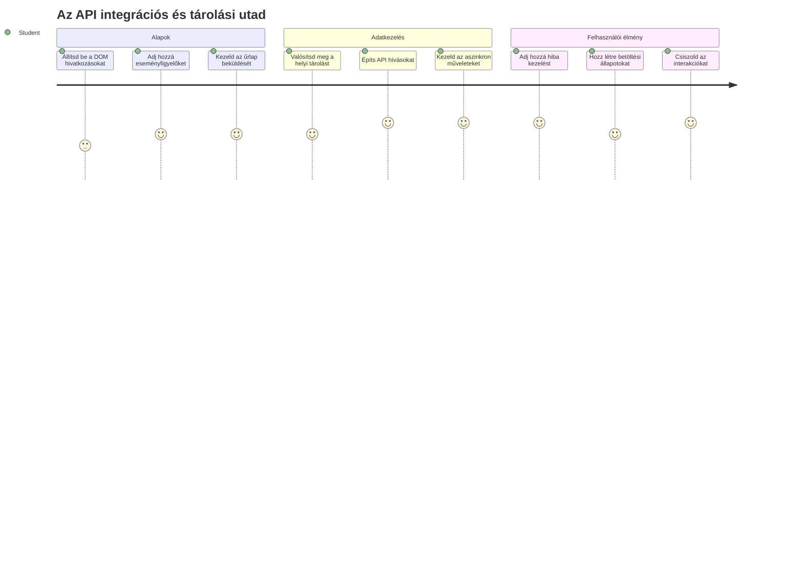
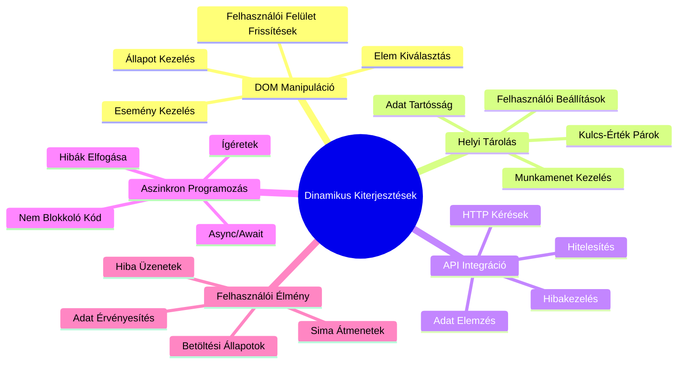
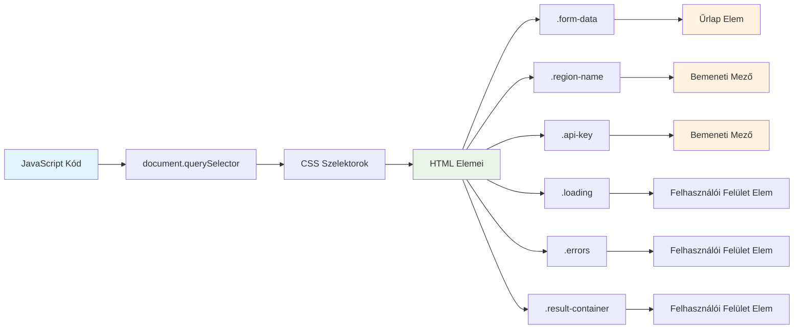
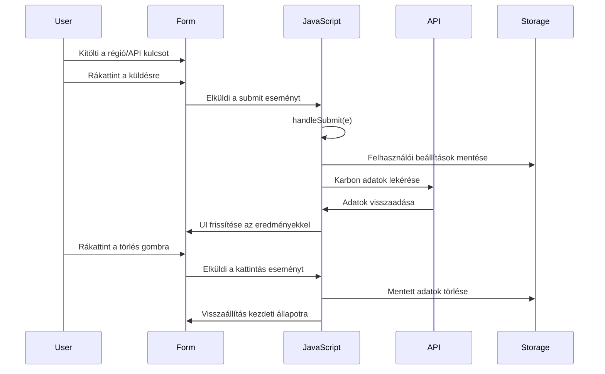
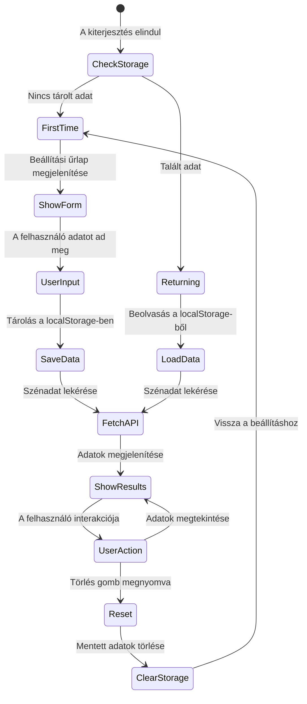
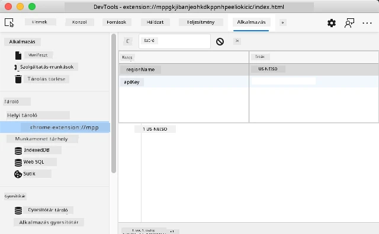
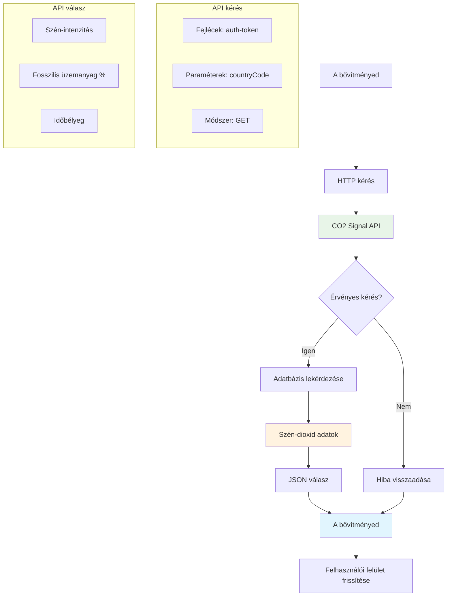
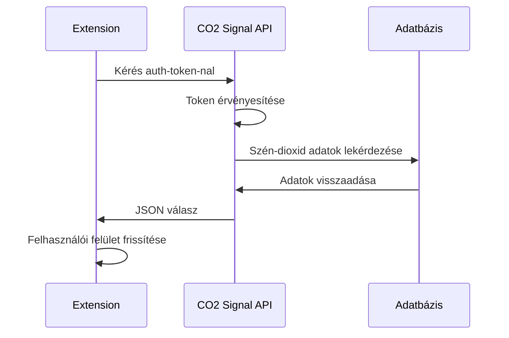
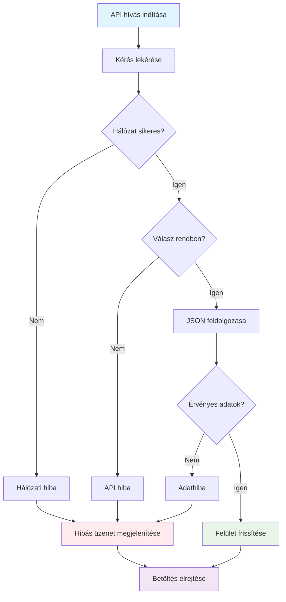
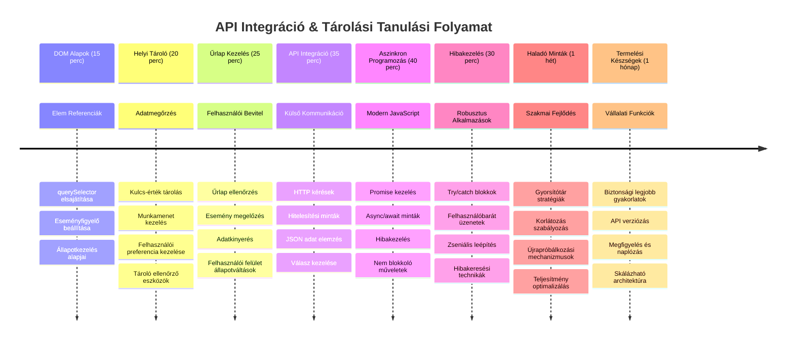

# Böngészőbővítmény Projekt 2. rész: API hívás, helyi tárolás használata


## Előadás előtti kvíz

[Előadás előtti kvíz](https://ff-quizzes.netlify.app/web/quiz/25)

## Bevezetés

Emlékszel arra a böngészőbővítményre, amit elkezdtél építeni? Jelenleg egy szép kinézetű űrlapod van, de alapvetően statikus. Ma életre keltjük azzal, hogy összekapcsoljuk valós adatokkal és memóriát adunk neki.

Gondolj az Apollo küldetés irányító számítógépeire – nemcsak rögzített információkat jelenítettek meg. Folyamatosan kommunikáltak az űrhajóval, frissítették a telemetriai adatokat, és megjegyezték a kritikus küldetésparamétereket. Ez a fajta dinamikus viselkedés lesz a mi célunk ma. A kiegészítőd eléri az internetet, valós környezeti adatokat szerez be, és megjegyzi a beállításaidat a következő alkalomra.

Az API integráció bonyolultnak hangozhat, de igazából csak azt tanítja meg a kódodnak, hogy kommunikáljon más szolgáltatásokkal. Akár időjárási adatokat, közösségi média híreket, vagy szénlábnyom-információkat kérsz le, mint mi ma, mindez a digitális kapcsolatok létrehozásáról szól. Megvizsgáljuk azt is, hogyan őrizhetik meg a böngészők az információkat – hasonlóan ahhoz, ahogy a könyvtárak használják a kartotékokat, hogy emlékezzenek, hová tartoznak a könyvek.

A lecke végére egy olyan böngészőbővítményed lesz, amely valós adatokat szerez be, tárolja a felhasználói beállításokat, és gördülékeny élményt nyújt. Kezdjük!


✅ Kövesd a megfelelő fájlokban található sorszámozott szegmenseket, hogy tudd, hová helyezd a kódodat

## Az elemek beállítása a bővítményben való manipulációhoz

Mielőtt a JavaScripted manipulálhatná a felületet, szüksége van hivatkozásokra bizonyos HTML elemekre. Gondolj rá úgy, mint egy távcsőre, amelyet bizonyos csillagokra kell irányítani – mielőtt Galileo tanulmányozhatta volna a Jupiter holdjait, először meg kellett találnia és fókuszálnia kellett magára a Jupiterre.

Az `index.js` fájlodban `const` változókat hozunk létre, amelyek megőrzik a fontos űrlapelemek referenciáit. Ez hasonló ahhoz, ahogy a tudósok megjelölik a felszerelésüket – ahelyett, hogy minden alkalommal át kellene kutatniuk a laboratóriumot, közvetlenül elérhetik, amire szükségük van.


```javascript
// űrlapmezők
const form = document.querySelector('.form-data');
const region = document.querySelector('.region-name');
const apiKey = document.querySelector('.api-key');

// eredmények
const errors = document.querySelector('.errors');
const loading = document.querySelector('.loading');
const results = document.querySelector('.result-container');
const usage = document.querySelector('.carbon-usage');
const fossilfuel = document.querySelector('.fossil-fuel');
const myregion = document.querySelector('.my-region');
const clearBtn = document.querySelector('.clear-btn');
```

**Ez a kód a következőket teszi:**
- **Megfogja** az űrlapelemeket `document.querySelector()` használatával CSS osztályválasztókkal
- **Létrehoz** hivatkozásokat a régió név és API kulcs input mezőkhöz
- **Csatlakozik** az eredmény megjelenítő elemekhez a szén-dioxid használati adatok számára
- **Beállítja** a hozzáférést olyan UI elemekhez, mint a betöltési jelzők és hibák üzenetei
- **Tárolja** az egyes elemek referenciait `const` változókban az egyszerű újrafelhasználásért a kódod egészében

## Eseményfigyelők hozzáadása

Most megadjuk a bővítményednek, hogy reagáljon a felhasználói műveletekre. Az eseményfigyelők a kódod módjai arra, hogy figyelje a felhasználói interakciókat. Gondolj rájuk úgy, mint a korai telefonközpontok kezelőire – ők hallgatták a bejövő hívásokat, és összekapcsolták a megfelelő áramköröket, amikor valaki kapcsolatot akart létesíteni.


```javascript
form.addEventListener('submit', (e) => handleSubmit(e));
clearBtn.addEventListener('click', (e) => reset(e));
init();
```

**Ezeknek a fogalmaknak a megértése:**
- **Csatol** egy beküldés figyelőt az űrlaphoz, amely akkor aktiválódik, amikor a felhasználók Entert nyomnak vagy beküldik az űrlapot
- **Kapcsol** kattintás figyelőt a törlés gombhoz az űrlap visszaállítására
- **Átadja** az esemény objektumot `(e)` a kezelő funkcióknak további vezérlésért
- **Azonnal meghívja** az `init()` függvényt a bővítmény kezdeti állapotának beállításához

✅ Észre fogod venni a rövidített nyílfüggvény-szintaxist (arrow function), amit itt használnak. Ez a modern JavaScript megközelítés tisztább, mint a hagyományos függvény kifejezések, de mindkettő jól működik!

### 🔄 **Pedagógiai ellenőrzés**
**Eseménykezelés megértése**: Mielőtt az inicializációra lépnénk, győződj meg róla, hogy képes vagy:
- ✅ Elmagyarázni, hogyan köti össze az `addEventListener` a felhasználói műveleteket JavaScript függvényekkel
- ✅ Megérteni, miért adjuk át az esemény objektumot `(e)` a kezelő függvényeknek
- ✅ Felismerni a különbséget a `submit` és a `click` események között
- ✅ Leírni, mikor fut az `init()` függvény és miért

**Gyors önellenőrzés**: Mi történik, ha elfelejted az `e.preventDefault()` -et egy űrlap beküldésénél?
*Válasz: Az oldal újratöltődik, elvesznek a JavaScript állapotok és megszakad a felhasználói élmény*

## Az inicializáló és visszaállító függvények létrehozása

Hozzuk létre a bővítmény inicializáló logikáját. Az `init()` függvény olyan, mint egy hajó navigációs rendszere, ami ellenőrzi a műszereit – meghatározza a jelenlegi állapotot és ennek megfelelően állítja be a felületet. Ellenőrzi, hogy valaki használta-e már a bővítményedet, és betölti az előző beállításokat.

A `reset()` függvény friss kezdést ad a felhasználóknak – hasonlóan, ahogy a tudósok visszaállítják a műszereiket kísérletek között, hogy tiszta adatokat kapjanak.

```javascript
function init() {
	// Ellenőrizze, hogy a felhasználó korábban elmentette-e az API hitelesítő adatokat
	const storedApiKey = localStorage.getItem('apiKey');
	const storedRegion = localStorage.getItem('regionName');

	// Állítsa be a bővítmény ikonját általános zöldre (helyőrző a következő lecke számára)
	// TODO: Az ikon frissítésének megvalósítása a következő leckében

	if (storedApiKey === null || storedRegion === null) {
		// Első alkalommal használó: jelenítse meg a beállító űrlapot
		form.style.display = 'block';
		results.style.display = 'none';
		loading.style.display = 'none';
		clearBtn.style.display = 'none';
		errors.textContent = '';
	} else {
		// Visszatérő felhasználó: automatikusan töltse be az elmentett adatokat
		displayCarbonUsage(storedApiKey, storedRegion);
		results.style.display = 'none';
		form.style.display = 'none';
		clearBtn.style.display = 'block';
	}
}

function reset(e) {
	e.preventDefault();
	// Törölje a tárolt régiót, hogy a felhasználó új helyszínt választhasson
	localStorage.removeItem('regionName');
	// Indítsa újra az inicializációs folyamatot
	init();
}
```

**Mit csinálunk itt lépésről lépésre:**
- **Lekéri** a tárolt API kulcsot és régiót a böngésző helyi tárolójából
- **Ellenőrzi**, hogy ez-e az első használat (nincsenek mentett adatok) vagy visszatérő felhasználó
- **Megjeleníti** a beállító űrlapot az új felhasználók számára, és elrejti a többi felületelemet
- **Betölti** automatikusan a korábban mentett adatokat a visszatérő felhasználók számára, és megjeleníti a visszaállítási lehetőséget
- **Kezeli** a felhasználói felület állapotát az elérhető adatok alapján

**A helyi tárolás (Local Storage) kulcsfogalmai:**
- **Megőrzi** az adatokat a böngésző munkamenetek között (ellentétben a munkamenet-tárolással)
- **Tárol** adatokat kulcs-érték párokként a `getItem()` és `setItem()` segítségével
- **Visszaad** `null` értéket, ha nincs adat a megadott kulcshoz
- **Egyszerű módot nyújt** a felhasználói beállítások és preferenciák megőrzésére

> 💡 **Böngésző tárolás megértése**: A [LocalStorage](https://developer.mozilla.org/docs/Web/API/Window/localStorage) olyan, mintha a bővítményednek tartós memóriát adnál. Gondolj az ókori Alexandriai Könyvtárra, amely tekercseket tárolt – az információ még akkor is elérhető maradt, amikor a tudósok elmentek és visszatértek.
>
> **Fontos jellemzők:**
> - **Megőrzi** az adatokat még akkor is, ha bezárod a böngészőt
> - **Túléli** a számítógép újraindítását és böngésző összeomlásokat
> - **Nagy tárolókapacitást** biztosít a felhasználói beállításoknak
> - **Azonnali hozzáférést** kínál hálózati késedelem nélkül

> **Fontos megjegyzés**: A böngészőbővítményed saját elkülönített helyi tárolót használ, amely különválik a weboldalakétól. Ez biztonságot nyújt és megakadályozza az ütközéseket más webhelyekkel.

Megtekintheted a tárolt adataidat, ha megnyitod a böngésző Fejlesztői Eszközeit (F12), az **Alkalmazás** (Application) fülre navigálsz és kibontod a **Local Storage** szekciót.




> ⚠️ **Biztonsági megfontolás**: Termelési alkalmazásokban az API kulcsok LocalStorage-ben történő tárolása biztonsági kockázatokat rejt, mivel JavaScript hozzáférhet ezekhez az adatokhoz. Tanulási céllal ez az eljárás elfogadható, de éles alkalmazások esetén biztonságos szerveroldali tárolás javasolt.

## Űrlap beküldésének kezelése

Most kezeljük, mi történik, amikor valaki beküldi az űrlapot. Alapértelmezés szerint a böngészők újratöltik az oldalt űrlap beküldésekor, de ezt a viselkedést megakasztjuk, hogy gördülékenyebb legyen az élmény.

Ez a megközelítés hasonló ahhoz, ahogy az irányítóközpont kezeli az űrhajóval való kommunikációt – ahelyett, hogy minden átvitelnél nullázna az egész rendszert, folyamatos működést tart fenn miközben feldolgozza az új információkat.

Hozz létre egy függvényt, amely elfogja az űrlap beküldési eseményét és kivonja a felhasználó adatát:

```javascript
function handleSubmit(e) {
	e.preventDefault();
	setUpUser(apiKey.value, region.value);
}
```

**Ebben a kódrészletben:**
- **Megakadályozza** az alapértelmezett űrlapbeküldési viselkedést, mely az oldal frissítését eredményezné
- **Kinyeri** a felhasználói adatokat az API kulcs és régió mezőkből
- **Átadja** az űrlapadatokat a `setUpUser()` függvénynek feldolgozásra
- **Fenntartja** az egyoldalas alkalmazás viselkedést az oldal újratöltése nélkül

✅ Emlékezz, hogy az űrlap HTML mezői tartalmazzák a `required` attribútumot, így a böngésző automatikusan ellenőrzi, hogy mind az API kulcs, mind a régió megadásra került mielőtt ez a függvény lefutna.

## Felhasználói beállítások konfigurálása

A `setUpUser` függvény felelős a felhasználói hitelesítés mentéséért és az első API hívás elindításáért. Ez egy zökkenőmentes átmenetet teremt a beállítás és az eredmények megjelenítése között.

```javascript
function setUpUser(apiKey, regionName) {
	// Mentse el a felhasználói hitelesítő adatokat a jövőbeni munkamenetekhez
	localStorage.setItem('apiKey', apiKey);
	localStorage.setItem('regionName', regionName);
	
	// Frissítse a felhasználói felületet a betöltési állapot megjelenítéséhez
	loading.style.display = 'block';
	errors.textContent = '';
	clearBtn.style.display = 'block';
	
	// Szerezze be a szén-dioxid-kibocsátási adatokat a felhasználó hitelesítő adataival
	displayCarbonUsage(apiKey, regionName);
}
```

**Lépésenként ez történik:**
- **Mentésre kerül** az API kulcs és a régió neve a helyi tárolóban a későbbi használathoz
- **Mutat** egy betöltési jelet, jelezve, hogy az adatok lekérése folyamatban van
- **Törli** az előző hibák üzeneteit a megjelenítésről
- **Megjeleníti** a tisztító gombot, hogy a felhasználók később visszaállíthassák a beállításaikat
- **Elindítja** az API hívást a valós szén-dioxid használati adatok lekéréséhez

Ez a függvény zökkenőmentes felhasználói élményt nyújt az adatmegtartás és a felületfrissítések együttes kezelésével.

## Szén-dioxid fogyasztási adatok megjelenítése

Most összekapcsoljuk a kiegészítődet külső adatforrásokkal API-kon keresztül. Ez a bővítményt egy önálló eszközből olyan eszközzé alakítja, amely valós idejű információkat kérhet le az internetről.

**API-k megértése**

Az [API-k](https://www.webopedia.com/TERM/A/API.html) teszik lehetővé az alkalmazások közötti kommunikációt. Gondolj rájuk úgy, mint a 19. századi távíró rendszerre, amely összekötötte a távoli városokat – az üzemeltetők kéréseket küldtek távoli állomásokra, és választ kaptak a kért információval. Amikor közösségi médiát nézel, hangasszisztenshez beszélsz, vagy futár appot használsz, mindig API-k segítik az adatcserét.


**Kulcsfontosságú fogalmak a REST API-król:**
- **REST** az angol 'Representational State Transfer' (Állapotábrázolás-alapú Átvitel) kifejezés rövidítése
- **Használ** szabványos HTTP módszereket (GET, POST, PUT, DELETE) az adatokkal való interakcióhoz
- **Ad vissza** adatokat előre látható formátumban, általában JSON-ben
- **Biztosít** konzisztens, URL-alapú végpontokat különféle lekérdezésekhez

✅ A [CO2 Signal API](https://www.co2signal.com/) valós idejű szén-dioxid intenzitási adatokat szolgáltat villamos hálózatokról világszerte. Segít a felhasználóknak megérteni, milyen környezeti hatással jár az áramfogyasztásuk!

> 💡 **Az aszinkron JavaScript megértése**: Az [`async` kulcsszó](https://developer.mozilla.org/docs/Web/JavaScript/Reference/Statements/async_function) lehetővé teszi, hogy a kód megfelelően kezelje a párhuzamos műveleteket. Amikor adatot kérsz egy szervertől, nem akarod, hogy a bővítményed teljesen megfagyjon – olyan lenne, mintha a légiforgalmi irányítás minden műveletet leállítana, amíg egy gép nem válaszol.
>
> **Főbb előnyök:**
> - **Fenntartja** a bővítmény válaszkészségét az adatok betöltése közben
> - **Lehetővé teszi**, hogy más kód futjon a hálózati kérés alatt
> - **Javítja** a kód olvashatóságát a hagyományos callback-ekhez képest
> - **Lehetővé teszi** a hálózati hibák szép kezelését

Nézd meg ezt a rövid videót az `async`-ról:

[](https://youtube.com/watch?v=YwmlRkrxvkk "Async és Await a Promise-ok kezeléséhez")

> 🎥 Kattints a fenti képre egy videóért az async/await témában.

### 🔄 **Pedagógiai ellenőrzés**
**Aszinkron programozás megértése**: Mielőtt az API függvényre ugrunk, győződj meg róla, hogy érted:
- ✅ Miért használjuk az `async/await`-et a bővítmény blokkosítása helyett
- ✅ Hogyan kezelik a `try/catch` blokkok a hálózati hibákat elegánsan
- ✅ Mi a különbség a szinkron és aszinkron műveletek között
- ✅ Miért hibázhat egy API hívás, és hogyan kezeljük ezeket a hibákat

**Valós példák az aszinkron működésre:**
- **Ételrendelés**: Nem vársz a konyhánál – kapsz egy bizonylatot és közben mást csinálsz
- **E-mailek küldése**: Az e-mail alkalmazásod nem fagy le küldés közben – további leveleket írhatsz
- **Weboldalak betöltése**: Képek fokozatosan töltődnek be, miközben már olvashatod a szöveget

**API hitelesítési folyamat:**

Hozd létre a függvényt, amely lekéri és megjeleníti a szén-dioxid fogyasztási adatokat:

```javascript
// Modern fetch API megközelítés (nem szükséges külső függőség)
async function displayCarbonUsage(apiKey, region) {
	try {
		// Szén-dioxid intenzitási adatok lekérése a CO2 Signal API-ról
		const response = await fetch('https://api.co2signal.com/v1/latest', {
			method: 'GET',
			headers: {
				'auth-token': apiKey,
				'Content-Type': 'application/json'
			},
			// Adjon hozzá lekérdezési paramétereket a konkrét régióhoz
			...new URLSearchParams({ countryCode: region }) && {
				url: `https://api.co2signal.com/v1/latest?countryCode=${region}`
			}
		});

		// Ellenőrizze, hogy az API kérés sikeres volt-e
		if (!response.ok) {
			throw new Error(`API request failed: ${response.status}`);
		}

		const data = await response.json();
		const carbonData = data.data;

		// Számolja ki a kerekített szén-dioxid intenzitási értéket
		const carbonIntensity = Math.round(carbonData.carbonIntensity);

		// Frissítse a felhasználói felületet a lekért adatokkal
		loading.style.display = 'none';
		form.style.display = 'none';
		myregion.textContent = region.toUpperCase();
		usage.textContent = `${carbonIntensity} grams (grams CO₂ emitted per kilowatt hour)`;
		fossilfuel.textContent = `${carbonData.fossilFuelPercentage.toFixed(2)}% (percentage of fossil fuels used to generate electricity)`;
		results.style.display = 'block';

		// TODO: calculateColor(carbonIntensity) - valósítsa meg a következő leckében

	} catch (error) {
		console.error('Error fetching carbon data:', error);
		
		// Mutasson felhasználóbarát hibaüzenetet
		loading.style.display = 'none';
		results.style.display = 'none';
		errors.textContent = 'Sorry, we couldn\'t fetch data for that region. Please check your API key and region code.';
	}
}
```

**Lépések részletesen:**
- **Használja** a modern `fetch()` API-t, külső könyvtárak (pl. Axios) helyett, hogy tiszta, függőségmentes kódot kapjunk
- **Megvalósítja** a helyes hibakezelést a `response.ok` ellenőrzéssel, hogy korán észlelje az API hibákat
- **Kezeli** az aszinkron műveleteket `async/await` segítségével az olvashatóbb kódért
- **Hitelesíti** magát a CO2 Signal API-val az `auth-token` fejléccel
- **Feldolgozza** a JSON válaszadatot és kinyeri a szén-intenzitási információkat
- **Frissíti** több UI elemet formázott környezeti adatokkal
- **Nyújt** felhasználóbarát hibajelzéseket API hibák esetén

**Fontos modern JavaScript fogalmak:**
- **Sablon literálok** `${}` szintaxissal a tiszta string formázáshoz
- **Hibakezelés** try/catch blokkokkal a robosztus alkalmazáshoz
- **Async/await** minta a hálózati kérések elegáns kezeléséhez
- **Objektum destrukturálás** az API válaszok adatainak kivonásához
- **Metódus láncolás** több DOM művelethez

✅ Ez a függvény számos fontos webfejlesztési koncepciót mutat be – külső szerverekkel kommunikál, hitelesít, feldolgoz adatokat, frissíti a felületet, és hiba esetén szépen kezeli a helyzetet. Ezek alapvető készségek a profi fejlesztők számára.


### 🔄 **Pedagógiai ellenőrzés**
**Teljes rendszer áttekintése**: Győződj meg a folyamat mesteri ismeretéről:
- ✅ Hogyan teszik lehetővé a DOM referenciák a JavaScript számára a felület vezérlését
- ✅ Miért teremt a helyi tárolás állandóságot a böngésző munkamenetek között
- ✅ Hogyan biztosítja az async/await, hogy az API hívások ne fagyasszák le a bővítményt
- ✅ Mi történik API hibák esetén és hogyan kezeljük a hibákat
- ✅ Miért része a felhasználói élménynek a betöltési állapot és a hibaüzenetek mutatása

🎉 **Amit elértél:** Készítettél egy böngészőbővítményt, amely:
- **Csatlakozik** az internethez és valós környezeti adatokat szerez be
- **Megőrzi** a felhasználói beállításokat munkamenetek között
- **Kezeli** a hibákat szépen, nem omlik össze
- **Zökkenőmentes, professzionális** felhasználói élményt biztosít

Teszteld le a munkádat az `npm run build` futtatásával, majd frissítsd a bővítményt a böngésződben. Most már egy működő szénlábnyom-követőd van. A következő lecke dinamikus ikon funkciókat fog hozzáadni, hogy teljes legyen a bővítmény.

---

## GitHub Copilot Agent kihívás 🚀

Használd az Agent módot a következő kihívás teljesítéséhez:
**Leírás:** Fejleszd tovább a böngészőbővítményt hibakezelési fejlesztésekkel és felhasználói élményt javító funkciókkal. Ez a kihívás segít az API-k, a helyi tároló és a DOM manipuláció gyakorlásában modern JavaScript minták használatával.

**Feladat:** Hozz létre egy továbbfejlesztett változatot a displayCarbonUsage függvényből, amely tartalmazza: 1) egy újrapróbálkozási mechanizmust sikertelen API hívásokra exponenciális visszalépéssel, 2) bemeneti érvényesítést a régiókódra az API hívás előtt, 3) betöltési animációt előrehaladási jelzőkkel, 4) az API válaszok tárolását localStorage-ban lejárati időbélyeggel (30 percig cache-elve), valamint 5) egy funkciót a korábbi API hívások történeti adatainak megjelenítésére. Emellett adj megfelelő TypeScript-stílusú JSDoc kommenteket az összes függvényparaméter és visszatérési típus dokumentálásához.

További információ az [agent mode](https://code.visualstudio.com/blogs/2025/02/24/introducing-copilot-agent-mode) funkcióról.

## 🚀 Kihívás

Bővítsd az API-kkal kapcsolatos ismereteidet azzal, hogy felfedezed a böngésző-alapú API-k gazdagságát a webfejlesztéshez. Válassz az alábbi böngésző API-k közül, és készíts egy kis bemutatót:

- [Geolocation API](https://developer.mozilla.org/docs/Web/API/Geolocation_API) - Szerezd meg a felhasználó aktuális helyzetét
- [Notification API](https://developer.mozilla.org/docs/Web/API/Notifications_API) - Küldj asztali értesítéseket
- [HTML Drag and Drop API](https://developer.mozilla.org/docs/Web/API/HTML_Drag_and_Drop_API) - Hozz létre interaktív drag felületeket
- [Web Storage API](https://developer.mozilla.org/docs/Web/API/Web_Storage_API) - Haladó helyi tárolási technikák
- [Fetch API](https://developer.mozilla.org/docs/Web/API/Fetch_API) - Modern alternatíva az XMLHttpRequest helyett

**Kutatási kérdések, amiket érdemes átgondolni:**
- Milyen valós problémákat old meg ez az API?
- Hogyan kezeli az API a hibákat és szélsőséges eseteket?
- Milyen biztonsági megfontolások vannak az API használatakor?
- Mennyire támogatott ez az API különböző böngészőkben?

Kutatásod után határozd meg, milyen jellemzők tesznek egy API-t fejlesztőbaráttá és megbízhatóvá.

## Előadás Utáni Kvíz

[Előadás utáni kvíz](https://ff-quizzes.netlify.app/web/quiz/26)

## Áttekintés & Önálló Tanulás

Ebben a leckében megismerted a LocalStorage és az API-k működését, amelyek mind nagyon hasznosak a profi webfejlesztők számára. Gondolkodj el, hogyan működnek ezek ketten együtt! Gondold végig, hogyan terveznél meg egy weboldalt, amely elemeket tárol az API használatához.

### ⚡ **Mit Tehetsz a Következő 5 Percben**
- [ ] Nyisd meg a DevTools Alkalmazás fület és fedezd fel a localStorage-t bármely weboldalon
- [ ] Készíts egy egyszerű HTML űrlapot és teszteld az űrlap érvényesítést a böngészőben
- [ ] Próbálj meg adatokat tárolni és lekérni a localStorage segítségével a böngésző konzoljában
- [ ] Vizsgáld meg az elküldött űrlapadatokat a Hálózat fülön keresztül

### 🎯 **Mit Érhetsz El Most Órán Belül**
- [ ] Fejezd be az előadás utáni kvízt és értsd meg az űrlapkezelés koncepcióit
- [ ] Építs egy böngészőbővítményt, amely űrlap segítségével menti a felhasználói beállításokat
- [ ] Valósíts meg kliensoldali űrlapévvényesítést hasznos hibajelzésekkel
- [ ] Gyakorold a chrome.storage API használatát a bővítmény adatainak megőrzéséhez
- [ ] Készíts felhasználói felületet, amely reagál a mentett felhasználói beállításokra

### 📅 **Hétköznapi Bővítményfejlesztés**
- [ ] Készíts egy teljes funkcionalitású böngészőbővítményt űrlapfunkcióval
- [ ] Sajátítsd el a különféle tárolási opciókat: helyi, szinkronizált és munkamenet tárolás
- [ ] Valósíts meg haladó űrlapfunkciókat, mint az automatikus kiegészítés és érvényesítés
- [ ] Adj hozzá import/export funkciókat a felhasználói adatokhoz
- [ ] Teszteld bővítményedet különböző böngészőkön alaposan
- [ ] Finomhangold a felhasználói élményt és hibakezelést

### 🌟 **Hónapok Alatti Web API Mesterség**
- [ ] Készíts bonyolult alkalmazásokat különféle böngésző-tároló API-k felhasználásával
- [ ] Tanuld meg az offline-first fejlesztési mintákat
- [ ] Vegyél részt nyílt forráskódú projektekben adatmegőrzés témakörben
- [ ] Válj szakértővé az adatvédelmi fejlesztésben és a GDPR betartásában
- [ ] Készíts újrahasznosítható könyvtárakat űrlapkezeléshez és adatmenedzsmenthez
- [ ] Oszd meg tudásod a web API-k és bővítményfejlesztés területén

## 🎯 A Te Bővítményfejlesztési Mesterré Válás Idővonala


### 🛠️ A Teljes Stack Fejlesztői Eszköztárad Összefoglalója

A lecke elvégzése után most már rendelkezel a következőkkel:
- **DOM Mesterség**: Pontos elemkiválasztás és manipuláció
- **Tárolási Szakértelem**: Tartós adatkezelés localStorage segítségével
- **API Integráció**: Valós idejű adatlekérés és hitelesítés
- **Aszinkron Programozás**: Nem blokkoló műveletek modern JavaScript-tel
- **Hibakezelés**: Robosztus alkalmazások, amelyek szépen kezelik a hibákat
- **Felhasználói Élmény**: Betöltési állapotok, érvényesítés, gördülékeny interakciók
- **Modern Minták**: fetch API, async/await és ES6+ funkciók

**Szakmai Készségek:** Olyan mintákat valósítottál meg, amiket használnak:
- **Webalkalmazásokban**: Egylapos appok külső adatforrásokkal
- **Mobilfejlesztésben**: API-alapú appok offline képességekkel
- **Asztali szoftverekben**: Electron appok tartós tárolással
- **Vállalati rendszerekben**: Hitelesítés, cache-elés és hibakezelés
- **Modern keretrendszerekben**: React/Vue/Angular adatkezelési minták

**Következő szint:** Készen állsz fejlettebb témák felfedezésére, mint cache stratégiák, valós idejű WebSocket kapcsolat vagy összetett állapotkezelés!

## Feladat

[API átvétele](assignment.md)

---

<!-- CO-OP TRANSLATOR DISCLAIMER START -->
**Felelősségkizárás**:  
Ezt a dokumentumot az AI fordítási szolgáltatás, a [Co-op Translator](https://github.com/Azure/co-op-translator) segítségével fordítottuk le. Bár pontos fordításra törekszünk, kérjük, vegye figyelembe, hogy az automatikus fordítások hibákat vagy pontatlanságokat tartalmazhatnak. Az eredeti, anyanyelvi dokumentum tekintendő hiteles forrásnak. Fontos információk esetén javasolt szakember által végzett emberi fordítás igénybevétele. Nem vállalunk felelősséget a fordítás használatából eredő félreértésekért vagy téves értelmezésekért.
<!-- CO-OP TRANSLATOR DISCLAIMER END -->