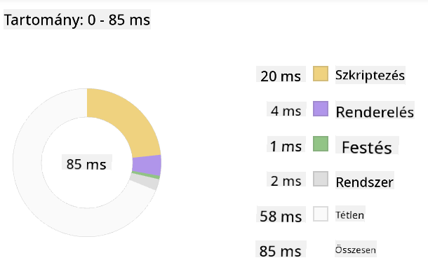

<!--
CO_OP_TRANSLATOR_METADATA:
{
  "original_hash": "49b58721a71cfda824e2f3e1f46908c6",
  "translation_date": "2025-08-29T10:25:46+00:00",
  "source_file": "5-browser-extension/3-background-tasks-and-performance/README.md",
  "language_code": "hu"
}
-->
# Böngészőbővítmény projekt 3. rész: Háttérfeladatok és teljesítmény megismerése

## Előadás előtti kvíz

[Előadás előtti kvíz](https://ff-quizzes.netlify.app/web/quiz/27)

### Bevezetés

A modul előző két leckéjében megtanultad, hogyan készíts egy űrlapot és egy megjelenítési területet az API-ból lekért adatok számára. Ez egy nagyon szokványos módja annak, hogy webes jelenlétet hozz létre. Még azt is megtanultad, hogyan kezeld az adatok aszinkron lekérését. A böngészőbővítményed már majdnem kész.

Már csak néhány háttérfeladatot kell kezelni, például a bővítmény ikon színének frissítését. Ezért ez egy remek alkalom arra, hogy beszéljünk arról, hogyan kezeli a böngésző az ilyen típusú feladatokat. Gondolkodjunk el ezekről a böngészőfeladatokról a webes eszközeid teljesítményének kontextusában, miközben építed őket.

## Webes teljesítmény alapjai

> "A weboldal teljesítménye két dologról szól: milyen gyorsan töltődik be az oldal, és milyen gyorsan fut rajta a kód." -- [Zack Grossbart](https://www.smashingmagazine.com/2012/06/javascript-profiling-chrome-developer-tools/)

Az a téma, hogy hogyan teheted a weboldalaidat villámgyorssá mindenféle eszközön, mindenféle felhasználó számára, mindenféle helyzetben, nem meglepő módon rendkívül széleskörű. Íme néhány szempont, amit érdemes szem előtt tartani, akár egy szokványos webes projektet, akár egy böngészőbővítményt építesz.

Az első dolog, amit meg kell tenned annak érdekében, hogy biztosítsd weboldalad hatékony működését, az az, hogy adatokat gyűjtesz annak teljesítményéről. Az első hely, ahol ezt megteheted, a böngésződ fejlesztői eszközei. Edge böngészőben válaszd a "Beállítások és továbbiak" gombot (a három pont ikon a böngésző jobb felső sarkában), majd navigálj a További eszközök > Fejlesztői eszközök menüpontra, és nyisd meg a Teljesítmény lapot. Windows rendszeren a `Ctrl` + `Shift` + `I`, Mac-en pedig az `Option` + `Command` + `I` billentyűkombinációval is megnyithatod a fejlesztői eszközöket.

A Teljesítmény lap tartalmaz egy Profilozó eszközt. Nyiss meg egy weboldalt (például próbáld ki: [https://www.microsoft.com](https://www.microsoft.com/?WT.mc_id=academic-77807-sagibbon)), és kattints a 'Felvétel' gombra, majd frissítsd az oldalt. Bármikor leállíthatod a felvételt, és megtekintheted azokat a rutinokat, amelyek a 'script', 'render' és 'paint' folyamatokat generálják az oldalon:


✅ Látogasd meg a [Microsoft Dokumentációt](https://docs.microsoft.com/microsoft-edge/devtools-guide/performance/?WT.mc_id=academic-77807-sagibbon) az Edge Teljesítmény paneljéről

> Tipp: hogy pontos képet kapj weboldalad indítási idejéről, töröld a böngésződ gyorsítótárát

Válassz ki elemeket a profil idővonalából, hogy nagyítsd azokat az eseményeket, amelyek az oldal betöltése közben történnek.

Készíts pillanatképet az oldal teljesítményéről úgy, hogy kiválasztasz egy részt a profil idővonalából, és megnézed az összefoglaló panelt:



Ellenőrizd az Eseménynapló panelt, hogy lássad, van-e olyan esemény, amely több mint 15 ms-ig tartott:


✅ Ismerd meg a profilozódat! Nyisd meg a fejlesztői eszközöket ezen az oldalon, és nézd meg, vannak-e szűk keresztmetszetek. Mi a leglassabban betöltődő eszköz? A leggyorsabb?

## Profilozási ellenőrzések

Általánosságban elmondható, hogy vannak bizonyos "problématerületek", amelyeket minden webfejlesztőnek figyelnie kell, amikor weboldalt épít, hogy elkerülje a kellemetlen meglepetéseket a termelési környezetbe való telepítéskor.

**Eszközméretek**: Az internet az elmúlt években "nehezebbé" és így lassabbá vált. Ennek a súlynak egy része a képek használatával kapcsolatos.

✅ Nézz körül az [Internet Archívumban](https://httparchive.org/reports/page-weight) egy történeti áttekintésért az oldalak súlyáról és egyebekről.

Jó gyakorlat, ha biztosítod, hogy a képeid optimalizáltak legyenek, és a megfelelő méretben és felbontásban kerüljenek a felhasználókhoz.

**DOM bejárások**: A böngészőnek fel kell építenie a Dokumentum Objektum Modelljét az általad írt kód alapján, ezért a jó oldal teljesítmény érdekében érdemes minimalizálni a tageket, csak azt használni és formázni, amire az oldalnak szüksége van. Például az oldalhoz kapcsolódó felesleges CSS optimalizálható; azokat a stílusokat, amelyeket csak egy oldalon kell használni, nem szükséges a fő stíluslapba belefoglalni.

**JavaScript**: Minden JavaScript fejlesztőnek figyelnie kell azokra a 'render-blokkoló' szkriptekre, amelyeket be kell tölteni, mielőtt a DOM többi része bejárható és megjeleníthető lenne a böngészőben. Fontold meg a `defer` használatát az inline szkriptekkel (ahogy a Terrárium modulban is történik).

✅ Próbálj ki néhány weboldalt egy [Weboldal sebességteszt weboldalon](https://www.webpagetest.org/), hogy többet megtudj azokról a gyakori ellenőrzésekről, amelyeket az oldal teljesítményének meghatározására végeznek.

Most, hogy van elképzelésed arról, hogyan rendereli a böngésző az általad küldött eszközöket, nézzük meg az utolsó néhány dolgot, amit meg kell tenned a bővítményed befejezéséhez:

### Szín kiszámítására szolgáló függvény létrehozása

A `/src/index.js` fájlban adj hozzá egy `calculateColor()` nevű függvényt a DOM-hoz való hozzáférést biztosító `const` változók sorozata után:

```JavaScript
function calculateColor(value) {
	let co2Scale = [0, 150, 600, 750, 800];
	let colors = ['#2AA364', '#F5EB4D', '#9E4229', '#381D02', '#381D02'];

	let closestNum = co2Scale.sort((a, b) => {
		return Math.abs(a - value) - Math.abs(b - value);
	})[0];
	console.log(value + ' is closest to ' + closestNum);
	let num = (element) => element > closestNum;
	let scaleIndex = co2Scale.findIndex(num);

	let closestColor = colors[scaleIndex];
	console.log(scaleIndex, closestColor);

	chrome.runtime.sendMessage({ action: 'updateIcon', value: { color: closestColor } });
}
```

Mi történik itt? Átadsz egy értéket (a szén-dioxid intenzitást) az előző leckében befejezett API-hívásból, majd kiszámítod, hogy az értéke mennyire közel áll a színek tömbjében bemutatott indexhez. Ezután elküldöd ezt a legközelebbi színértéket a chrome runtime-nak.

A chrome.runtime rendelkezik [egy API-val](https://developer.chrome.com/extensions/runtime), amely mindenféle háttérfeladatot kezel, és a bővítményed ezt használja:

> "Használd a chrome.runtime API-t a háttéroldal lekérésére, a manifest részleteinek visszaadására, valamint az alkalmazás vagy bővítmény életciklusában bekövetkező események figyelésére és válaszadására. Ezzel az API-val a relatív URL-eket teljesen kvalifikált URL-ekké is konvertálhatod."

✅ Ha ezt a böngészőbővítményt Edge-re fejleszted, meglephet, hogy chrome API-t használsz. Az újabb Edge böngészőverziók a Chromium böngészőmotoron futnak, így kihasználhatod ezeket az eszközöket.

> Megjegyzés: ha böngészőbővítményt szeretnél profilozni, indítsd el a fejlesztői eszközöket magából a bővítményből, mivel az egy külön böngészőpéldányként működik.

### Alapértelmezett ikon szín beállítása

Most az `init()` függvényben állítsd be az ikont egy általános zöld színre azáltal, hogy ismét meghívod a chrome `updateIcon` műveletét:

```JavaScript
chrome.runtime.sendMessage({
	action: 'updateIcon',
		value: {
			color: 'green',
		},
});
```

### A függvény meghívása, a hívás végrehajtása

Ezután hívd meg az előbb létrehozott függvényt azzal, hogy hozzáadod a C02Signal API által visszaadott ígérethez:

```JavaScript
//let CO2...
calculateColor(CO2);
```

Végül pedig a `/dist/background.js` fájlban add hozzá a háttérműveleti hívásokhoz tartozó figyelőt:

```JavaScript
chrome.runtime.onMessage.addListener(function (msg, sender, sendResponse) {
	if (msg.action === 'updateIcon') {
		chrome.browserAction.setIcon({ imageData: drawIcon(msg.value) });
	}
});
//borrowed from energy lollipop extension, nice feature!
function drawIcon(value) {
	let canvas = document.createElement('canvas');
	let context = canvas.getContext('2d');

	context.beginPath();
	context.fillStyle = value.color;
	context.arc(100, 100, 50, 0, 2 * Math.PI);
	context.fill();

	return context.getImageData(50, 50, 100, 100);
}
```

Ebben a kódban hozzáadsz egy figyelőt minden olyan üzenethez, amely a háttérfeladat-kezelőhöz érkezik. Ha az üzenet neve 'updateIcon', akkor a következő kód fut le, amely a megfelelő színű ikont rajzolja meg a Canvas API segítségével.

✅ A Canvas API-ról többet fogsz tanulni a [Űrjáték leckékben](../../6-space-game/2-drawing-to-canvas/README.md).

Most építsd újra a bővítményedet (`npm run build`), frissítsd és indítsd el a bővítményt, és figyeld meg, ahogy a szín változik. Jó alkalom egy kis szünetre vagy házimunkára? Most már tudod!

Gratulálok, hasznos böngészőbővítményt készítettél, és többet tanultál arról, hogyan működik a böngésző, valamint hogyan profilozd annak teljesítményét.

---

## 🚀 Kihívás

Vizsgálj meg néhány nyílt forráskódú weboldalt, amelyek már régóta léteznek, és a GitHub történetük alapján próbáld meg meghatározni, hogyan optimalizálták őket az évek során a teljesítmény érdekében, ha egyáltalán optimalizálták. Mi a leggyakoribb probléma?

## Előadás utáni kvíz

[Előadás utáni kvíz](https://ff-quizzes.netlify.app/web/quiz/28)

## Áttekintés és önálló tanulás

Fontold meg, hogy feliratkozol egy [teljesítmény hírlevélre](https://perf.email/)

Vizsgáld meg, hogy a böngészők milyen módokon mérik a webes teljesítményt, ha átnézed a fejlesztői eszközök teljesítmény lapjait. Találsz jelentős különbségeket?

## Feladat

[Elemezz egy weboldalt teljesítmény szempontjából](assignment.md)

---

**Felelősség kizárása**:  
Ez a dokumentum az AI fordítási szolgáltatás [Co-op Translator](https://github.com/Azure/co-op-translator) segítségével lett lefordítva. Bár törekszünk a pontosságra, kérjük, vegye figyelembe, hogy az automatikus fordítások hibákat vagy pontatlanságokat tartalmazhatnak. Az eredeti dokumentum az eredeti nyelvén tekintendő hiteles forrásnak. Kritikus információk esetén javasolt professzionális emberi fordítást igénybe venni. Nem vállalunk felelősséget semmilyen félreértésért vagy téves értelmezésért, amely a fordítás használatából eredhet.