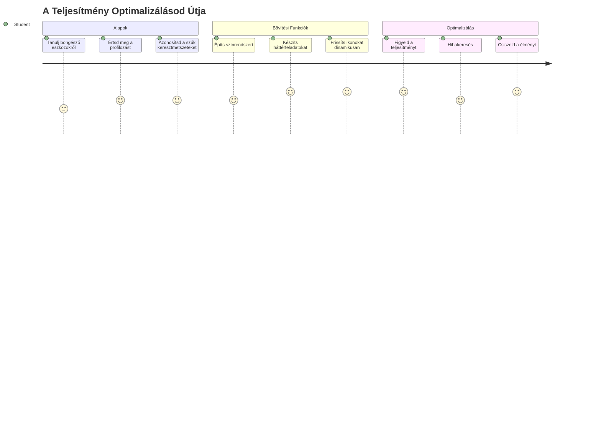
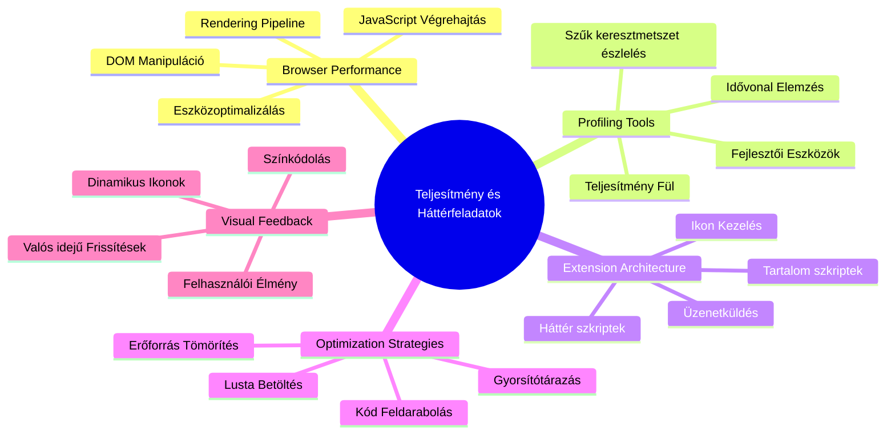
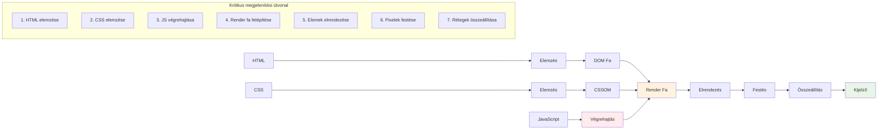
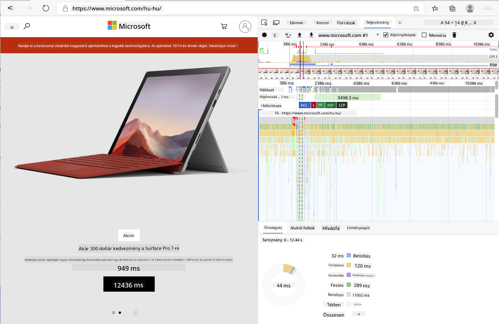
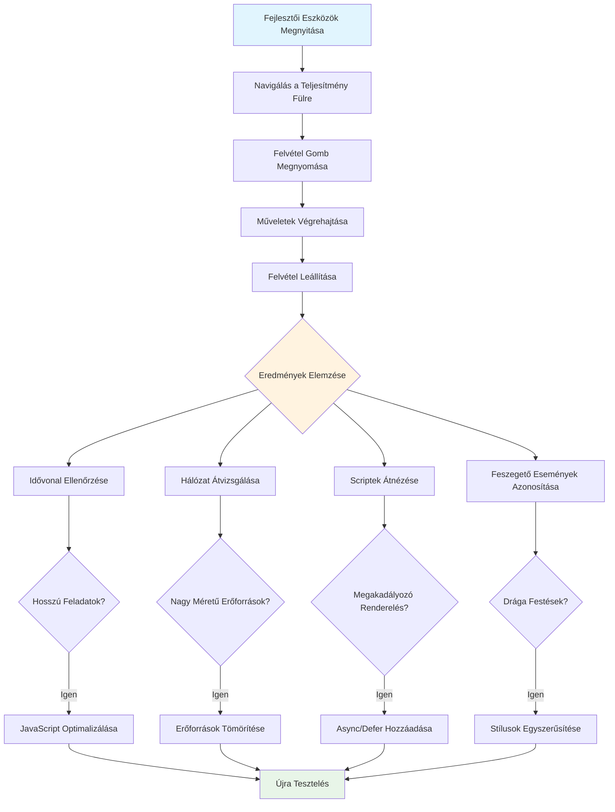
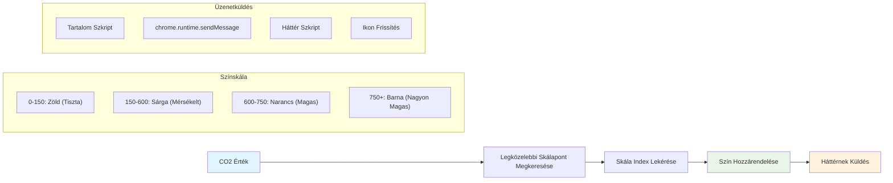
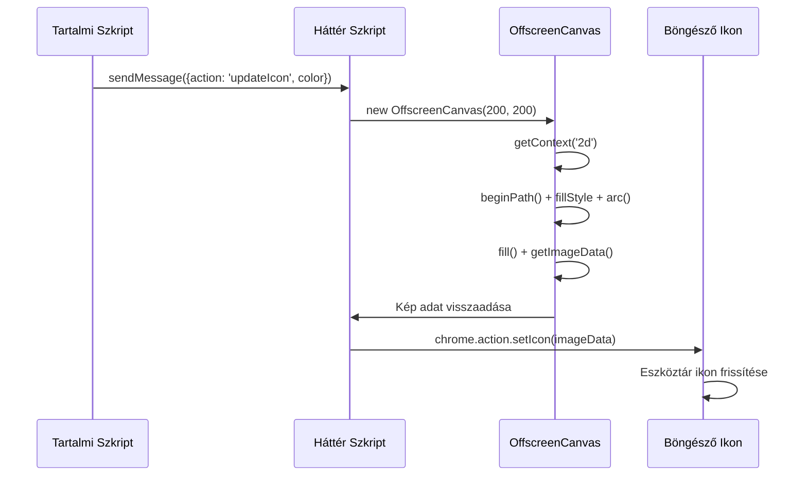
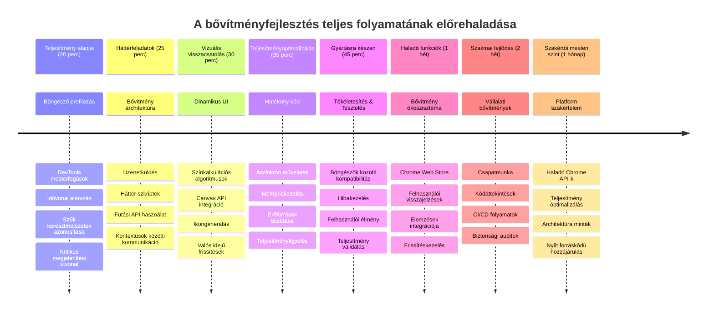

<!--
CO_OP_TRANSLATOR_METADATA:
{
  "original_hash": "b275fed2c6fc90d2b9b6661a3225faa2",
  "translation_date": "2026-01-07T02:50:02+00:00",
  "source_file": "5-browser-extension/3-background-tasks-and-performance/README.md",
  "language_code": "hu"
}
-->
# Böngészőbővítmény projekt 3. rész: Ismerkedés a háttérfeladatokkal és a teljesítménnyel


Gondolkodtál már valaha azon, hogy mi teszi egyes böngészőbővítményeket gyorsnak és reszponzívnak, míg mások lassúnak tűnnek? A titok abban rejlik, hogy mi történik a színfalak mögött. Míg a felhasználók kattintgatnak a bővítményed felületén, egy egész háttérfolyamatok világa csendben kezeli az adatlekéréseket, az ikonfrissítéseket és a rendszererőforrásokat.

Ez a böngészőbővítmény sorozatunk utolsó leckéje, és most simán működőképesre hozzuk a szénlábnyom-követődet. Dinamikus ikonfrissítéseket fogsz hozzáadni, és megtanulod, hogyan észleld időben a teljesítményproblémákat. Olyan ez, mint egy versenyautó beállítása – egy kis optimalizáció is hatalmas különbséget tesz abban, hogy minden hogyan fut.

Amikor végeztünk, egy kifinomult bővítményed lesz, és érted majd azokat a teljesítményelveket, amelyek megkülönböztetik a jó webalkalmazásokat a kiválóaktól. Merüljünk el a böngészőoptimalizálás világában.

## Bevezető kvíz

[Bevezető kvíz](https://ff-quizzes.netlify.app/web/quiz/27)

### Bevezetés

Az előző leckék során építettél egy űrlapot, csatlakoztattad egy API-hoz, és foglalkoztál aszinkron adatlekéréssel. A bővítményed szépen formálódik.

Most hozzá kell adnunk az utolsó simításokat – például hogy az a bővítményikon színt váltson a szénadatok alapján. Ez nekem mindig a NASA Apollo űrhajóján alkalmazott optimalizáció jut eszembe, ahol mindent optimalizálniuk kellett. Nem engedhették meg maguknak az elvesztegetett ciklusokat vagy memóriát, mert az életek függtek a teljesítménytől. Bár a mi böngészőbővítményünk nem ennyire kritikus, ugyanazok az elvek érvényesek – a hatékony kód jobb felhasználói élményt teremt.


## A webes teljesítmény alapjai

Ha a kódod hatékonyan fut, az emberek tényleg *érzik* a különbséget. Ismered azt a pillanatot, amikor egy oldal azonnal betöltődik, vagy egy animáció simán fut? Ez a jó teljesítmény működés közben.

A teljesítmény nemcsak a sebességről szól – arról is, hogy olyan webes élményeket hozz létre, amelyek természetesek, nem pedig esetlenek és frusztrálóak. A számítástechnika korai napjaiban Grace Hopper híresen tartott az asztalán egy nanomásodpercet (egy lábnyi huzalt), hogy megmutassa, milyen messzire utazik a fény egy milliárdod másodperc alatt. Ez volt az ő módja annak, hogy megmagyarázza, miért számít minden mikroperc a számítástechnikában. Nézzük meg azokat a detektív eszközöket, amelyek segítenek kideríteni, mi lassít le valamit.

> "A weboldal teljesítmény két dologról szól: milyen gyorsan töltődik be az oldal, és milyen gyorsan fut rajta a kód." -- [Zack Grossbart](https://www.smashingmagazine.com/2012/06/javascript-profiling-chrome-developer-tools/)

Az a téma, hogyan lehet az oldalakat villámgyorssá tenni mindenféle eszközön, mindenféle felhasználó számára, mindenféle helyzetben, nem meglepő módon óriási. Íme néhány pont, amit szem előtt kell tartani, akár egy standard webprojektet, akár böngészőbővítményt építesz.

A weboldalad optimalizálásának első lépése annak megértése, mi történik valójában a háttérben. Szerencsére a böngésződhez erős detektív eszközök járnak alapból.


Az Edge fejlesztői eszközeinek megnyitásához kattints a jobb felső sarokban található három pöttyre, majd válaszd a Több eszköz > Fejlesztői eszközök menüpontot. Vagy használd a billentyűkombinációt: Windowson `Ctrl` + `Shift` + `I`, Macen `Option` + `Command` + `I`. Amikor megnyílt, kattints a Teljesítmény fülre – itt fogod végezni a vizsgálatot.

**Íme a teljesítmény detektív eszköztárad:**
- **Nyisd meg** a Fejlesztői eszközöket (fejlesztőként folyamatosan használnod kell majd!)
- **Navigálj** a Teljesítmény fülre – gondolj rá úgy, mint a webapp kondíciómérőjére
- **Nyomd meg** a Felvétel gombot, és figyeld az oldal működését
- **Tanulmányozd** az eredményeket, hogy felfedezd, mi lassít le

Próbáljuk ki! Nyiss meg egy weboldalt (a Microsoft.com jól működik ehhez), és kattints a 'Felvétel' gombra. Most frissítsd az oldalt, és figyeld, ahogy a profiler felveszi, mi történik. Amikor leállítod a felvételt, részletes bontást látsz arról, hogyan 'szkriptel', 'renderel' és 'fest' a böngésző. Ez olyan, mint amikor a küldetésirányítás minden rendszert figyel egy űrrakéta indításakor – valós idejű adatokat kapsz arról, mi történik és mikor.



✅ A [Microsoft dokumentáció](https://docs.microsoft.com/microsoft-edge/devtools-guide/performance/?WT.mc_id=academic-77807-sagibbon) rengeteg további részletet tartalmaz, ha mélyebben bele akarsz nézni

> Profi tipp: Mielőtt tesztelnéd, töröld a böngésződ gyorsítótárát, hogy lásd, hogyan teljesít az oldal az első látogatóknak – általában nagyon különbözik az ismétlődő látogatásoktól!

Jelölj ki a profil idővonalából eseményeket, hogy közelről lásd a betöltődés közbeni történéseket.

Készíts pillanatképet az oldal teljesítményéről az idővonal egy részének kijelölésével, és nézd meg az összefoglaló panelt:


Nézd meg az Eseménynapló panelt, hogy történt-e 15 ms-nál hosszabb esemény:


✅ Ismerkedj meg a profilerrel! Nyisd meg a fejlesztői eszközöket ezen az oldalon, és nézd meg, van-e valahol szűk keresztmetszet. Melyik a leglassabban betöltődő erőforrás? A leggyorsabb?


## Mire figyelj profilozáskor

A profiler futtatása csak az első lépés – a valódi tudás az, hogy mit mondanak valójában azok a színes diagramok. Ne aggódj, megtanulod majd olvasni őket. A tapasztalt fejlesztők már észreveszik a figyelmeztető jeleket, mielőtt azok teljes problémává válnának.

Beszéljünk a szokásos gyanúsítottakról – a teljesítményproblémákról, amelyek könnyen becsempésződnek webprojektekbe. Ahogy Marie Curie-nak is szigorúan ellenőriznie kellett a sugárzás szintjét a laborjában, nekünk is figyelni kell bizonyos mintázatokra, amelyek bajt jeleznek. Ezek korai felismerése sok bosszúságtól kímél meg téged (és a felhasználóidat).

**Erőforrásméretek**: Az évek során a weboldalak "nehézkesebbé" váltak, és ennek nagy része a képeknek köszönhető. Olyan, mintha egyre több és több dolgot pakolnánk be a digitális bőröndünkbe.

✅ Nézd meg az [Internet Archive](https://httparchive.org/reports/page-weight) oldalát, hogy hogyan nőttek az oldalméretek időben – elég tanulságos.

**Íme néhány tipp az erőforrások optimalizálásához:**
- **Tömörítsd** a képeket! A modern formátumok, mint a WebP, drasztikusan csökkenthetik a fájlméretet
- **Szolgáltasd** a megfelelő képméretet eszközönként – nincs szükség hatalmas asztali képekre telefonokon
- **Minimalizáld** a CSS és JavaScript fájlokat – minden bájt számít
- **Használj** lusta betöltést, hogy a képek csak akkor töltődjenek be, amikor a felhasználó ténylegesen görget hozzájuk

**DOM bejárások**: A böngészőnek építenie kell a Dokumentum Objektum Modellt a kódod alapján, ezért a jó oldalteljesítmény érdekében tarts minimálisra a HTML tageket, csak a szükséges elemeket használd és formázd azokat. E tekintetben optimalizálható egy oldal fölösleges CSS-e is; például az olyan stílusokat, amelyeket csak egy oldalon kell használnod, nem kell a fő stíluslapba tenni.

**Fő stratégiák a DOM optimalizálására:**
- **Minimalizálja** a HTML elemek és beágyazási szintek számát
- **Eltávolítja** a nem használt CSS szabályokat és hatékonyan konszolidálja a stíluslapokat
- **Szervezi** a CSS-t úgy, hogy csak az adott oldalhoz szükséges töltődjön be
- **Szerkezetbe állítja** a HTML-t szemantikusan a jobb böngészői elemzés érdekében

**JavaScript**: Minden JavaScript fejlesztőnek figyelnie kell a "renderelést blokkoló" szkriptekre, amelyeket le kell tölteni, és végre kell hajtani, mielőtt a DOM bejárható és megjeleníthető. Érdemes használni a `defer` attribútumot a beágyazott szkriptekhez (ahogy a Terrárium modulban is tettük).

**Modern JavaScript optimalizációs technikák:**
- **Használja** a `defer` attribútumot, hogy a szkriptek a DOM bejárás után töltődjenek be
- **Alkalmaz** kódmegosztást, hogy csak a szükséges JavaScript töltődjön be
- **Alkalmaz** lusta betöltést nem kritikus funkcióknál
- **Minimalizálja** a nagy könyvtárak és keretrendszerek használatát, amikor csak lehet

✅ Próbálj ki néhány oldalt a [Site Speed Test webhelyen](https://www.webpagetest.org/), hogy megtanuld, mik a gyakori ellenőrzések a weboldalak teljesítményének megállapításához.

### 🔄 **Pedagógiai ellenőrzőpont**
**Teljesítményértés**: Mielőtt bővítményfunkciókat építesz, biztos hogy tudod:
- ✅ Elmagyarázni a kritikus renderelési utat HTML-től pixelig
- ✅ Azonosítani a gyakori teljesítményproblémákat webalkalmazásokban
- ✅ Használni a böngésző fejlesztői eszközeit az oldalprofilozáshoz
- ✅ Érteni, hogyan befolyásolja az erőforrásméret és DOM összetettség a sebességet

**Gyors önellenőrzés**: Mi történik, ha renderelést blokkoló JavaScript van?
*Válasz: A böngészőnek le kell töltenie és végre kell hajtania a szkriptet, mielőtt folytathatja a HTML elemzését és az oldal megjelenítését*

**Valós teljesítményhatás**:
- **100 ms késés**: A felhasználók érzékelik a lassulást
- **1 másodperces késés**: A felhasználók kezdenek elveszíteni fókuszt
- **3+ másodperc**: A felhasználók 40%-a elhagyja az oldalt
- **Mobil hálózatokon**: A teljesítmény még fontosabb

Most, hogy van fogalmad arról, hogyan rendereli a böngésző a neked küldött erőforrásokat, nézzük meg az utolsó néhány dolgot, amit meg kell tenned a bővítményed befejezéséhez:

### Hozz létre egy függvényt a szín kiszámításához

Most készítünk egy olyan függvényt, amely számszerű adatokat alakít át értelmes színekké. Gondolj rá úgy, mint egy közlekedési lámpára – zöld a tiszta energia, piros a magas szénintenzitás.

Ez a függvény az API-tól kapott CO2 adatokat veszi, és meghatározza, melyik szín mutatja legjobban a környezeti hatást. Hasonlóan ahhoz, ahogy a tudósok színkódokat használnak hőtérképeken összetett adatminták megjelenítésére – például óceáni hőmérséklet vagy csillagképződés. Add hozzá ezt a `/src/index.js`-hez, közvetlenül a korábban beállított `const` változók után:


```javascript
function calculateColor(value) {
	// Definiáld a CO2 intenzitás skálát (gramm per kWh)
	const co2Scale = [0, 150, 600, 750, 800];
	// A megfelelő színek a zöldtől (tisztán) a sötét barnáig (magas szén-dioxid)
	const colors = ['#2AA364', '#F5EB4D', '#9E4229', '#381D02', '#381D02'];

	// Keresd meg a legközelebbi skálaértéket a bemenetünkhöz
	const closestNum = co2Scale.sort((a, b) => {
		return Math.abs(a - value) - Math.abs(b - value);
	})[0];
	
	console.log(`${value} is closest to ${closestNum}`);
	
	// Keresd meg az indexet a színtérképhez
	const num = (element) => element > closestNum;
	const scaleIndex = co2Scale.findIndex(num);

	const closestColor = colors[scaleIndex];
	console.log(scaleIndex, closestColor);

	// Küldj színfrissítési üzenetet a háttér szkriptnek
	chrome.runtime.sendMessage({ action: 'updateIcon', value: { color: closestColor } });
}
```

**Nézzük meg ezt az okos kis függvényt:**
- **Beállít** két tömböt – egyet a CO2 szinteknek, egyet a színeknek (zöld = tiszta, barna = szennyezett!)
- **Megtalál** a tényleges CO2 értékhez legközelebb eső elemet egy menő tömbrendezéssel
- **Megfogja** a megfelelő színt a findIndex() metódussal
- **Üzenetet küld** a Chrome háttérszkriptjének a választott színnel
- **Template literálokat használ** (azokat a backtickeket) a tisztább sztringformázáshoz
- **Mindent rendezetten tart** const deklarációkkal

A `chrome.runtime` [API](https://developer.chrome.com/extensions/runtime) olyan, mint a bővítményed idegrendszere – kezeli a háttérben zajló kommunikációt és feladatokat:

> "Használd a chrome.runtime API-t a háttéroldal lekérésére, a manifest részleteinek visszaadására, valamint az eseményekre való figyelésre és reagálásra az app vagy bővítmény életciklusa alatt. Ezzel az API-val a relatív URL-útvonalakat teljes körű URL-ekké alakíthatod."

**Miért olyan hasznos a Chrome Runtime API:**
- **Lehetővé teszi**, hogy a bővítmény különböző részei kommunikáljanak egymással
- **Kezeli** a háttérmunkákat anélkül, hogy lefagyna a felhasználói felület
- **Kezeli** a bővítmény életciklus eseményeit
- **Egyszerűvé teszi** az üzenetküldést a szkriptek között

✅ Ha Edge böngészőhöz fejleszted ezt a bővítményt, meglepődhetsz, hogy egy chrome API-t használsz. A legújabb Edge verziók Chromium motoron futnak, így ezeket az eszközöket ki tudod használni.


> **Profi tipp**: Ha böngészőbővítményt szeretnél profilozni, indítsd el a fejlesztői eszközöket magából a bővítményből, mert az egy külön böngészőpéldány. Ez hozzáférést ad a bővítmény-specifikus teljesítménymutatókhoz.

### Állítsd be az alapértelmezett ikon színt

Mielőtt valódi adatokat kérnénk le, adjunk egy kiindulópontot a bővítményednek. Senki sem szeret egy üres vagy tönkrement ikont bámulni. Zöld színnel kezdjük, hogy a felhasználók már azonnal lássák, hogy a bővítmény működik, amint telepítik.

Az `init()` függvényedben állítsd be az alap zöld ikont:

```javascript
chrome.runtime.sendMessage({
	action: 'updateIcon',
	value: {
		color: 'green',
	},
});
```

**Mit ér ez a inicializáció:**
- **Beállít** egy semleges zöld színt alapértelmezett állapotként
- **Azonnali vizuális visszajelzést ad** bővítmény betöltődésekor
- **Létrehozza** a kommunikációs mintát a háttérszkripttel
- **Biztosítja**, hogy a felhasználók funkcionális bővítményt lássanak az adatok betöltődése előtt

### Hívd meg a függvényt, hajtsd végre a hívást

Most kösd össze az egészet, hogy amikor érkezik az új CO2 adat, a te ikonod automatikusan frissüljön a megfelelő színnel. Olyan, mint az utolsó áramkör bekötése egy elektronikus eszközben – hirtelen minden komponens egy rendszert alkot.

Add ezt a sort közvetlenül azután, hogy megkapod az API-tól a CO2 adatot:

```javascript
// Miután lekértük a CO2 adatokat az API-ból
// hagyjuk, hogy a CO2 érték legyen a data.data[0].intensity.actual;
calculateColor(CO2);
```

**Ez az integráció megvalósítja, hogy:**
- **Összekapcsolja** az API adatfolyamát a vizuális jelző rendszerrel
- **Automatikusan indítja** az ikon frissítését, amint új adat érkezik
- **Valós idejű vizuális visszajelzést biztosít** a jelenlegi szénintenzitás alapján
- **Fenntartja** az adatlekérés és megjelenítés logikai elkülönítését

És végül, a `/dist/background.js` fájlban add hozzá a figyelőt ezekhez a háttérben történő műveletekhez:

```javascript
// Hallgass az üzenetekre a tartalmi szkriptből
chrome.runtime.onMessage.addListener(function (msg, sender, sendResponse) {
	if (msg.action === 'updateIcon') {
		chrome.action.setIcon({ imageData: drawIcon(msg.value) });
	}
});

// Dinamikus ikon rajzolása a Canvas API használatával
// Az energy lollipop kiterjesztésből kölcsönözve - remek funkció!
function drawIcon(value) {
	// Hozz létre egy háttér vásznat a jobb teljesítmény érdekében
	const canvas = new OffscreenCanvas(200, 200);
	const context = canvas.getContext('2d');

	// Rajzolj egy színes kört, amely a szén-dioxid intenzitást jelzi
	context.beginPath();
	context.fillStyle = value.color;
	context.arc(100, 100, 50, 0, 2 * Math.PI);
	context.fill();

	// Add vissza a böngésző ikon képadatait
	return context.getImageData(50, 50, 100, 100);
}
```

**Ezt teszi a háttérszkript:**
- **Figyel** az üzenetekre a főszkriptből (mint egy recepciós, aki hívásokat fogad)
- **Feldolgozza** az 'updateIcon' kérelmeket, hogy megváltoztassa az eszköztár ikont
- **Új ikonokat hoz létre** dinamikusan a Canvas API-val
- **Egyszerű színes kört rajzol**, amely a jelenlegi szénintenzitást mutatja
- **Frissíti** a böngésző eszköztárát az új ikonnal
- **Az OffscreenCanvas-t használja** a zavartalan teljesítményhez (nem blokkolja a UI-t)

✅ A [Space Game leckékben](../../6-space-game/2-drawing-to-canvas/README.md) még többet megtanulsz majd a Canvas API-ról.


### 🔄 **Pedagógiai ellenőrzőpont**
**A bővítmény teljes megértése**: Ellenőrizd a rendszer teljes körű ismeretét:
- ✅ Hogyan működik az üzenetküldés a különböző bővítményi szkriptek között?
- ✅ Miért használjuk az OffscreenCanvas-t a sima teljesítmény érdekében a sima Canvas helyett?
- ✅ Milyen szerepet játszik a Chrome Runtime API a kiterjesztés architektúrájában?
- ✅ Hogyan térképezi fel az adatokat a színkalkulációs algoritmus a vizuális visszacsatolás szempontjából?

**Teljesítmény szempontok**: A kiterjesztésed most már bemutatja:
- **Hatékony üzenetküldés**: Tiszta kommunikáció a szkript-környezetek között
- **Optimalizált megjelenítés**: Az OffscreenCanvas megakadályozza a felhasználói felület blokkolását
- **Valós idejű frissítések**: Dinamikus ikonváltozások élő adatok alapján
- **Memóriakezelés**: Megfelelő takarítás és erőforrás-gazdálkodás

**Ideje letesztelni a kiterjesztést:**
- **Fordítsd le** mindent az `npm run build` parancssal
- **Töltsd újra** a kiterjesztést a böngészőben (ne felejtsd el ezt a lépést)
- **Nyisd meg** a kiterjesztést, és figyeld meg, ahogy az ikon színei változnak
- **Ellenőrizd**, hogyan reagál a valódi szén-dioxid adatokat feldolgozva világszerte

Most egy pillantás alatt megtudod, hogy jó idő-e arra a mosásra, vagy várnod kell a tisztább energia érkezésére. Épp most építettél valami igazán hasznosat, miközben a böngésző teljesítményéről is tanultál.

## GitHub Copilot Agent kihívás 🚀

Használd az Agent módot a következő kihívás teljesítéséhez:

**Leírás**: Fejleszd a böngészőkiterjesztés teljesítményfigyelő képességeit azzal, hogy hozzáadsz egy funkciót, amely követi és megjeleníti a kiterjesztés különböző komponenseinek betöltési idejét.

**Feladat**: Hozz létre egy teljesítményfigyelő rendszert a böngészőkiterjesztéshez, amely méri és naplózza az API-ból történő CO2-adat lekérésének, a színek kiszámításának és az ikon frissítésének idejét. Adj hozzá egy `performanceTracker` nevű függvényt, amely a Performance API-t használja ezen műveletek mérésére, majd az eredményeket időbélyeggel és időtartam-mutatókkal jeleníti meg a böngésző konzoljában.

Tudj meg többet az [agent módról](https://code.visualstudio.com/blogs/2025/02/24/introducing-copilot-agent-mode) itt.

## 🚀 Kihívás

Itt egy érdekes nyomozói feladat: válassz néhány nyílt forráskódú weboldalt, amelyek évek óta működnek (gondolj a Wikipedia-ra, GitHub-ra vagy a Stack Overflow-ra), és merülj el a commit történelemben. Meg tudod találni, hol javítottak teljesítményt? Milyen problémák szoktak ismétlődni?

**Nyomozási módszered:**
- **Keresd** a commit üzenetekben az olyan szavakat, mint az „optimalizálás”, „teljesítmény” vagy „gyorsabb”
- **Figyeld meg** a mintákat - ugyanazon típusú problémákat javítják újra és újra?
- **Azonosítsd** a weboldalakat lassító gyakori okokat
- **Oszd meg**, amit felfedeztél - a többi fejlesztő valós példákból tanul

## Előadás utáni kvíz

[Előadás utáni kvíz](https://ff-quizzes.netlify.app/web/quiz/28)

## Áttekintés & Önálló tanulás

Fontold meg, hogy feliratkozol egy [teljesítmény hírlevélre](https://perf.email/)

Vizsgáld meg, hogyan mérik a böngészők a webes teljesítményt, böngészd át a teljesítményfüleket a fejlesztői eszközökben. Találsz nagyobb különbségeket?

### ⚡ **Mit csinálhatsz az elkövetkező 5 percben**
- [ ] Nyisd meg a böngésző Feladatkezelőjét (Shift+Esc Chrome-ban), hogy lásd a kiterjesztések erőforrás-használatát
- [ ] Használd a DevTools Teljesítmény fület, hogy rögzítsd és elemezd a weboldal teljesítményét
- [ ] Ellenőrizd a böngésző Kiterjesztések oldalát, hogy mely kiterjesztések befolyásolják az indítási időt
- [ ] Próbáld ki ideiglenesen kikapcsolni a kiterjesztéseket a teljesítmény-különbségek megfigyeléséhez

### 🎯 **Mit érhetsz el ebben az órában**
- [ ] Teljesítsd az előadás utáni kvízt, és értsd meg a teljesítmény fogalmait
- [ ] Valósíts meg egy háttérszkriptet a böngészőkiterjesztésedhez
- [ ] Tanulj meg használni a browser.alarms-t hatékony háttérfeladatokhoz
- [ ] Gyakorold az üzenetküldést a tartalmi és háttérszkriptek között
- [ ] Mérd és optimalizáld a kiterjesztésed erőforrás-használatát

### 📅 **Hétközbeni teljesítmény-utazásod**
- [ ] Fejlessz egy nagy teljesítményű böngészőkiterjesztést háttérfunkcióval
- [ ] Sajátítsd el a service workerek és a modern kiterjesztés-architektúra használatát
- [ ] Valósíts meg hatékony adat-szinkronizálást és cache-elési stratégiákat
- [ ] Tanulj haladó hibakeresési technikákat a kiterjesztés teljesítményéhez
- [ ] Optimalizáld a kiterjesztésed mind funkcionálisan, mind erőforrás-hatékonyságban
- [ ] Készíts átfogó teszteket a kiterjesztés teljesítményeseteiről

### 🌟 **Havi optimalizálási mesterképzésed**
- [ ] Építs vállalati szintű böngészőkiterjesztéseket optimális teljesítménnyel
- [ ] Ismerkedj meg a Web Worker-ekkel, Service Worker-ekkel és a modern webes teljesítménnyel
- [ ] Vegyél részt nyílt forráskódú projektekben, amelyek teljesítményoptimalizálással foglalkoznak
- [ ] Sajátítsd el a böngésző belső működését és haladó hibakeresési technikákat
- [ ] Hozz létre teljesítményfigyelő eszközöket és legjobb gyakorlatokról szóló útmutatókat
- [ ] Válj teljesítményszakértővé, aki segít webalkalmazások optimalizálásában

## 🎯 Böngészőkiterjesztés mesterkurzus idővonala


### 🛠️ Teljes kiterjesztésfejlesztési eszköztárad

A trilógia elvégzése után most már mester szinten érted:
- **Böngésző architektúráját**: Mély betekintés a kiterjesztések böngészőrendszerbe való integrációjába
- **Teljesítményprofilozást**: Tudod, hogyan azonosítsd és orvosold a szűk keresztmetszeteket fejlesztői eszközökkel
- **Aszinkron programozást**: Modern JavaScript minták responzív, nem blokkoló műveletekhez
- **API integrációt**: Külső adatok lekérését hitelesítéssel és hibakezeléssel
- **Vizuális tervezést**: Dinamikus UI-frissítések és Canvas-alapú grafikus generálás
- **Üzenetküldést**: Szkriptek közti kommunikációt kiterjesztés architektúrában
- **Felhasználói élményt**: Betöltési állapotok, hibakezelés és intuitív interakciók
- **Éles környezetbeli képességeket**: Tesztelés, hibakeresés és optimalizálás valós alkalmazáshoz

**Valós alkalmazások**: Kiterjesztésfejlesztői tudásod közvetlenül alkalmazható:
- **Progresszív webalkalmazások**: Hasonló architektúra és teljesítményminták
- **Electron asztali alkalmazások**: Keresztplatformos alkalmazások webes technológiákkal
- **Mobil hibrid appok**: Cordova/PhoneGap fejlesztés webes API-kkal
- **Vállalati webalkalmazások**: Összetett dashboardok és termelékenységi eszközök
- **Chrome DevTools kiterjesztések**: Fejlett fejlesztői eszközök és hibakeresés
- **Web API integráció**: Olyan alkalmazások, amelyek külső szolgáltatásokkal kommunikálnak

**Szakmai hatás**: Most már képes vagy:
- **Éles, használatra kész kiterjesztést építeni az ötlettől a bevezetésig**
- **Optimalizálni a webalkalmazás teljesítményét ipari szintű profilozó eszközökkel**
- **Skálázható rendszereket tervezni megfelelő felelősségszétválasztással**
- **Hibakeresni összetett aszinkron műveleteket és kontextusok közti kommunikációt**
- **Hozzájárulni nyílt forráskódú kiterjesztés projektekhez és böngésző standardokhoz**

**További lehetőségek:**
- **Chrome Web Store fejlesztő**: Több millió felhasználónak szánt kiterjesztések publikálása
- **Webes teljesítmény mérnök**: Optimalizációra és felhasználói élményre szakosodás
- **Böngésző platform fejlesztő**: Böngésző motor fejlesztésben való részvétel
- **Kiterjesztés keretrendszer alkotó**: Eszközök építése más fejlesztőknek
- **Fejlesztői kapcsolatok**: Tudásmegosztás oktatás és tartalomkészítés révén

🌟 **Teljesítmény feloldva**: Teljes, működő böngészőkiterjesztést építettél, amely profi fejlesztési gyakorlatokat és modern webes szabványokat demonstrál!

## Házi feladat

[Teljesítmény elemzése egy oldalon](assignment.md)

---

<!-- CO-OP TRANSLATOR DISCLAIMER START -->
**Jogi nyilatkozat**:  
Ezt a dokumentumot az AI fordító szolgáltatás, a [Co-op Translator](https://github.com/Azure/co-op-translator) használatával fordítottuk le. Bár az pontosságra törekszünk, kérjük, vegye figyelembe, hogy az automatikus fordítások hibákat vagy pontatlanságokat tartalmazhatnak. Az eredeti dokumentum anyanyelvű változata tekintendő hivatalos forrásnak. Kritikus információk esetén szakmai, emberi fordítást javaslunk. Nem vállalunk felelősséget az ebből a fordításból eredő félreértésekért vagy téves értelmezésekért.
<!-- CO-OP TRANSLATOR DISCLAIMER END -->